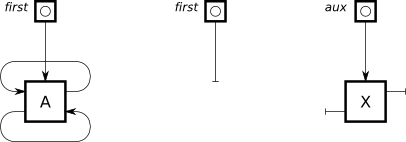
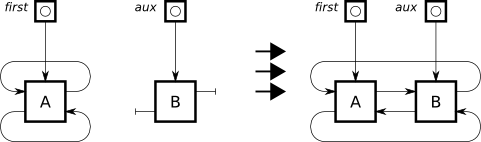
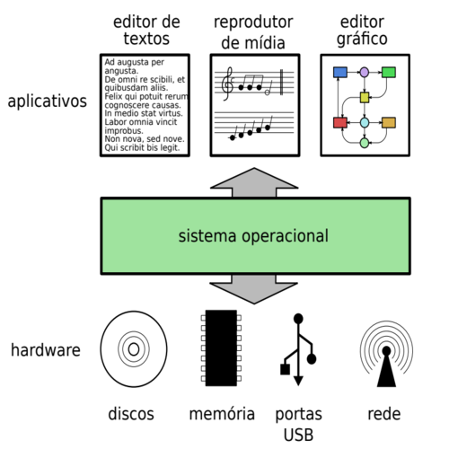
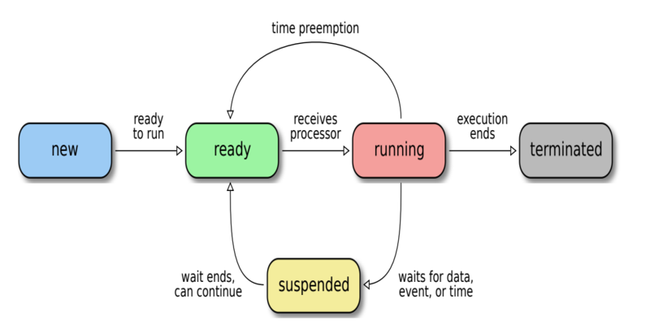
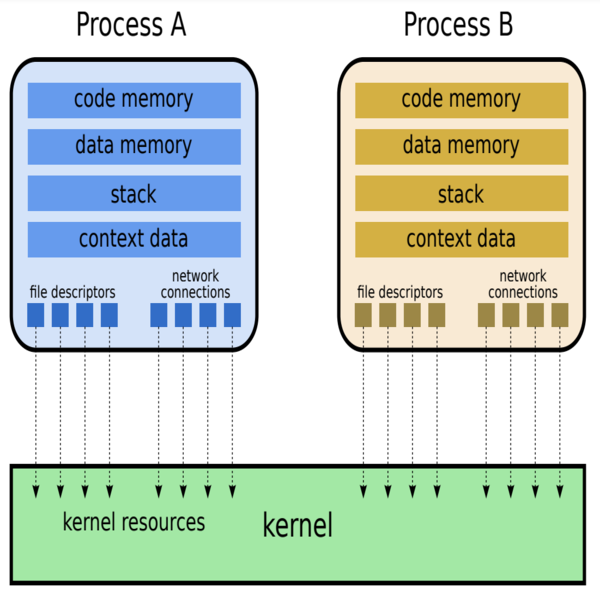
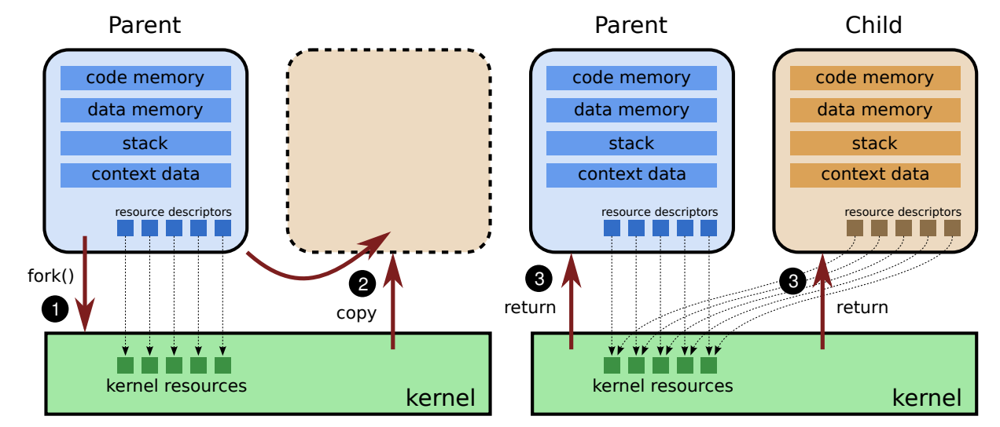

> **NOTE:**  
> Currently all notes here are in Portuguese (Brazilian).

# Operating Systems (Theory & Practice)

## Contents

 - **Implementation:**
   - [Biblioteca de Filas](#queues-library)
 - **Theory:**
   - **O.S Fundamentals**
     - [Objetivos de um SO](#so-goal)
     - [Gerência de recursos](#res-management)
   - **O.S Structure:**
     - [Elementos de um SO](#os-elements)
   - **Task Concepts:**
     - [Exemplos de Tarefas (Simultâneas)](#tasks-examples)
     - [Programa vs. Tarefa](#program-vs-task)
     - [Ciclo de vida das tarefas](#tasks-lifecycle)
   - **Task Implementation:**
     - [Contexto, Descritor de Contexto](#intro-to-contexts)
     - [Troca de Contexto](#context-switching)
     - [Despachante (Dispatcher) e Escalonador (Scheduler)](#dispatcher-vs-scheduler)
     - [**Processos:**](#intro-to-processes)
       - [Estados de um Processo](#process-states)
       - [Chamadas de Sistema (+Parent & Child Processes)](#sys-calls)
     - [**Threads (Tarefas dentro de um Processo):**](#intro-to-threads)
     - [Uso de Processos versus Threads para criação de tarefas](#processes-versus-threads)
 - **Settings**
   - [Zig Settings](#zig-settings)
 - **Languages Tips & Tricks:**
 - [**REFERENCES**](#references)
<!--- 
[WHITESPACE RULES]
- Same topic = "10" Whitespace character.
- Different topic = "50" Whitespace character.
--->


<!--- ( Implementation/Biblioteca de Filas ) --->

---

<div id="queues-library"></div>

## Biblioteca de filas (Warm-Up)

O **Sistema Operacional** gerencia muitas filas de *"processos prontos"*, *"suspensos"*, *"dormindo"*, *"esperando em semáforos"*, etc.

A estrutura de dados mais adequada para implementar essas filas é uma **Lista Circular Duplamente Encadeada (Circular Doubly Linked List)**, como indicada na figura abaixo:

  

Vamos ver alguns exemplos do que a nossa Fila (Queue) deve ser capaz de realizar:

**EXAMPLE-01:**  
Uma fila com um único elemento, uma fila vazia e um elemento isolado (elemento fora de uma fila):

  

**EXAMPLE-02:**  
Inserção de um elemento em uma fila vazia:

  

Observe que:

 - O elemento a inserir deve estar isolado, ou seja, não deve pertencer a nenhuma outra fila;
 - O elemento a inserir já existe, ou seja, não há necessidade de alocar memória para ele (malloc).

**EXAMPLE-03:**  
Inserção de um elemento no fim de uma fila não-vazia:

  

**EXAMPLE-04:**  
Remoção de um elemento da fila, indicado pelo ponteiro aux. Observe que a remoção apenas retira o elemento da fila, sem o destruir, alterar seu conteúdo ou liberar sua memória.

  

### Interface

A Interface (declaração) da nossa **Queue** vai ser a seguinte:

[queue.h](COS/src/queue.h)
```c
#ifndef __QUEUE__
#define __QUEUE__

#ifndef NULL
#define NULL ((void *)0)
#endif

//------------------------------------------------------------------------------
// Generic Queue structure, without defined content.
typedef struct queue_t
{
   struct queue_t *prev; // Points to the "previous" element in the queue.
   struct queue_t *next; // Points to the "next" element in the queue.
} queue_t;

//------------------------------------------------------------------------------
// Inserts an element at the end of the queue.
// Conditions to verify, generating error messages:
// - The queue must exist.
// - The element must exist.
// - The element must not be in another queue.
// Return: 0 if success, <0 if an error occurred.
int queue_append(queue_t **queue, queue_t *elem);

//------------------------------------------------------------------------------
// Removes the indicated element from the Queue, without destroying it.
// Conditions to verify, generating error messages:
// - The queue must exist.
// - The queue must not be empty.
// - The element must exist.
// - The element must belong to the indicated queue.
// Return: 0 if success, <0 if an error occurred.
int queue_remove(queue_t **queue, queue_t *elem);

//------------------------------------------------------------------------------
// Counts the number of elements in the queue.
// Return: number of elements in the queue.
int queue_size(queue_t *queue);

//------------------------------------------------------------------------------
// Traverses the Queue and prints its content on the screen.
// The printing of each element is done by an external function,
// defined by the program that uses the library.
//
// void print_elem (void *ptr) ; // "ptr" points to the element to print.
void queue_print(char *name, queue_t *queue, void print_elem(void *));

#endif // __QUEUE__
```

Vamos analisar algumas partes importantes da **Interface** da nossa **Queue** acima:

 - `typedef struct queue_t`
   - Primeiro, nós temos uma estrutura generica:
     - Isso porque inicialmente ela não tem nenhum tipo de dado relacionado a ela.
     - Apenas, dois ponteiros um para o elemento anterior e um para o elemento posterior, que são as extremidades da Fila (Queue).
 - `queue_t **queue`
   - Veja que as funções **queue_append()** e **queue_remove()** ???

### Definição

> Agora vamos ver como definir (implementar) as funções da nossa **Fila (Queue)**.

Para começar vamos implementar a função `queue_append()`:

**C Language Version:**
[queue.c](COS/src/queue.c)
```c

```


<!--- ( Theory/O.S Fundamentals ) --->

---

<div id="so-goal"></div>

## Objetivos de um SO

> Um **Sistema Operacional (SO)** é um Software que *"gerencia os recursos de hardware"* e *"software"* de um computador, proporcionando uma interface entre o usuário e o hardware.

Por exemplo, veja a imagem abaixo:

  

---

<div id="res-management"></div>

## Gerência de recursos (+Funcionalidades de um SO)

Muitos programas de computador usam o hardware para atingir seus objetivos. Como:

 - Ler e armazenar dados.
 - Editar e imprimir documentos.
 - Navegar na Internet.
 - Tocar música...

**NOTE:**  
Em um sistema com várias atividades simultâneas, podem surgir conflitos no uso do hardware. Por exemplo, quando dois ou mais aplicativos precisam dos mesmos recursos para poder executar.

> Cabe ao **Sistema Operacional** definir *"políticas"* para gerenciar o uso dos recursos de hardware pelos aplicativos, e resolver eventuais disputas e conflitos.

Vejamos algumas situações onde a gerência de recursos do hardware se faz necessária:

 - **Uso de CPU e Memória:**
   - É normal em um sistema vários aplicativos disputarem o uso de *CPU* e *Memória*.
   - Por isso o uso desses dispositivos deve ser distribuído entre os aplicativos, de forma que cada um deles possa executar na velocidade adequada para cumprir suas funções sem prejudicar os demais.

**NOTE:**  
Ao desenvolver um Sistema Operacional, algumas funcionalidades que ajudam a gerência esses recursos são:

 - Gerência do processador.
 - Gerência de memória.
 - Gerência de dispositivos.
 - Gerência de arquivos.


<!--- ( Theory/O.S Structure ) --->

---

<div id="os-elements"></div>

## Elementos de um Sistema Operacional

 - **Núcleo (Core):**
   - É o coração do Sistema Operacional, responsável pela gerência dos recursos do hardware usados pelas aplicações.
   - Ele também implementa as principais abstrações utilizadas pelos aplicativos e programas utilitários.
 - **Código de inicialização (boot code):**
   - A inicialização do hardware requer uma série de tarefas complexas, como reconhecer os dispositivos instalados, testá-los e configurá-los adequadamente para seu uso posterior.
   - Outra tarefa importante é carregar o núcleo do sistema operacional em memória e iniciar sua execução.
 - **Drivers:**
   - Módulos de código específicos para acessar os dispositivos físicos.
   - Existe um driver para cada tipo de dispositivo, como discos rígidos SATA, portas USB, placas gráfica, etc.
   - Muitas vezes o driver é construído pelo próprio fabricante do hardware e fornecido em forma compilada (em linguagem de máquina) para ser acoplado ao restante do sistema operacional.
 - **Programas utilitários:**
   - São programas que facilitam o uso do Sistema Computacional, fornecendo funcionalidades complementares ao núcleo, como formatação de discos e mídias, configuração de dispositivos, manipulação de arquivos (mover, copiar, apagar), interpretador de comandos, terminal, interface gráfica, gerência de janelas, etc.

  


<!--- ( Theory/Task Concepts ) --->

---

<div id="tasks-examples"></div>

## Exemplos de Tarefas (Simultâneas)

Em um sistema de computação, é frequente a necessidade de executar várias tarefas distintas simultaneamente. Por exemplo:

 - **Tarefas de Usuário:**
   - O usuário de um computador pessoal pode estar editando uma imagem, imprimindo um relatório, ouvindo música e trazendo da Internet um novo software, tudo ao mesmo tempo.
 - **Servidor:**
   - Em um grande servidor de e-mails, milhares de usuários conectados remotamente enviam e recebem e-mails através da rede.
 - **Navegador Web:**
   - Um navegador Web precisa buscar os elementos da página a exibir, analisar e renderizar o código HTML e os gráficos recebidos, animar os elementos da interface e responder aos comandos do usuário.

---

<div id="program-vs-task"></div>

## Programa vs. Tarefa

 - **Programa:**
   - um *Programa* é um conjunto de uma ou mais sequências de instruções escritas para resolver um problema específico, constituindo assim uma aplicação ou utilitário.
 - **Tarefa:**
   - Já uma tarefa é a execução *sequencial*, *"por um processador"*, da s*"equência de instruções definidas em um programa"* para realizar seu objetivo.

---

<div id="tasks-lifecycle"></div>

## Ciclo de vida das tarefas

Para entender o ciclo de vida de uma tarefa, veja o diagrama abaixo:

  

 - **Nova (New):**
   - A tarefa está sendo criada, i.e. seu código está sendo carregado em memória, junto com as bibliotecas necessárias, e as estruturas de dados do núcleo estão sendo atualizadas para permitir sua execução.
 - **Pronta (Ready):**
   - A tarefa está em memória, pronta para iniciar ou retomar sua execução, apenas aguardando a disponibilidade do processador.
   - **NOTE:** Todas as tarefas prontas são organizadas em uma fila (fila de prontas, ready queue ou run queue), cuja ordem é determinada por algoritmos de escalonamento.
 - **Executando (Running):**
   - O processador está dedicado à tarefa, executando suas instruções e fazendo avançar seu estado.
 - **Suspensa (Suspended):**
   - A tarefa não pode executar porque depende de dados externos ainda não disponíveis (do disco ou da rede, por exemplo), aguarda algum tipo de sincronização (o fim de outra tarefa ou a liberação de algum recurso compartilhado) ou simplesmente espera o tempo passar (em uma operação sleeping, por exemplo).
 - **Terminada (Terminated):**
   - O processamento da tarefa foi encerrado e ela pode ser removida da memória do sistema.


<!--- ( Theory/Task Implementation ) --->

---

<div id="intro-to-contexts"></div>

## Contexto, Descritor de Contexto

> Um **"contexto (Context)"** é o *"estado de uma tarefa em um determinado instante"*.

Esse contexto pode ter:

 - O estado interno do processador.
 - Informações sobre os recursos usados pelo a tarefa:
   - Como arquivos abertos, conexões de rede e semáforos.

## Descritor de Contexto

Um "Descritor de Contexto (Context Descriptor, Context Control Block/CCB, Process Control Block/PCB)" é uma estrutura de dados usada pelos Sistemas Operacionais para armazenar e gerenciar o contexto de um processo ou thread.

 - **NOTE:** Ele contém todas as informações necessárias para retomar a execução de um processo ou thread após uma interrupção ou troca de contexto. Essas informações geralmente incluem:

Essas informações geralmente incluem:

 - **Registradores da CPU:**
   - Estados dos registradores gerais, contador de programa (PC), ponteiro de pilha, e outros registradores específicos do processador.
 - **Estado do Processo/Thread:**
   - Informação sobre o estado atual (executando, pronto, bloqueado, etc.).
 - **Espaço de Endereçamento:**
   - Informações sobre a memória virtual alocada ao processo, incluindo tabelas de páginas e segmentos.
 - **Informações de Pilha:**
   - Dados sobre a pilha de chamadas, incluindo ponteiros de pilha e base da pilha.
 - **Recursos de E/S:**
   - Referências a arquivos abertos e dispositivos de entrada/saída associados ao processo.
 - **Informações de Sinalização e Sincronização:**
   - Dados sobre sinais pendentes, máscaras de sinais, e outros mecanismos de sincronização.
 - **Identificação do Processo/Thread:**
   - IDs exclusivos para identificação do processo ou thread.
 - **Dados de Gerenciamento de Tempo:**
   - Informação sobre a prioridade do processo, tempo de CPU utilizado, e tempos de espera.

Em pseudocódigo, um descritor de contexto pode ser representado da seguinte forma:

```c
struct ContextDescriptor {
    int processID;
    int threadID;
    int programCounter;
    int stackPointer;
    int registers[NUM_REGISTERS];
    int state; // RUNNING, READY, BLOCKED, etc.
    MemoryMap memoryMap;
    IOResources ioResources;
    SignalInfo signalInfo;
    TimeManagement timeManagement;
};
```

---

<div id="context-switching"></div>

## Troca de Contexto

A **Troca de Contexto** é o *"processo de salvar o estado de um processo ou thread atualmente em execução para que ele possa ser retomado mais tarde"*, *"e restaurar o estado de outro processo ou thread para iniciar ou retomar sua execução"*.

> **NOTE:**  
> Isso permite que o sistema operacional gerencie múltiplos processos ou threads de maneira eficiente, dando a aparência de execução simultânea em um ambiente multitarefa.

Passos envolvendo uma Troca de Contexto pode ser:

 - **Salvar o Contexto:**
   - O Sistema Operacional salva o estado do processo ou thread atualmente em execução em seu descritor de contexto (também conhecido como bloco de controle de processo, PCB, ou bloco de controle de thread, TCB).
   - Isso inclui salvar os registradores da CPU, contador de programa, ponteiro de pilha e outras informações relevantes.
 - **Atualizar o Estado do Processo/Thread:**
   - O estado do processo ou thread atualmente em execução é atualizado para indicar que ele não está mais em execução (por exemplo, para um estado de "pronto" ou "bloqueado").
 - **Selecionar o Próximo Processo/Thread:**
   - O escalonador do Sistema Operacional seleciona o próximo processo ou thread a ser executado com base em algoritmos de escalonamento e critérios como prioridade e justiça.
 - **Restaurar o Contexto:**
   - O estado do processo ou thread selecionado é restaurado a partir de seu descritor de contexto, incluindo registradores da CPU, contador de programa, ponteiro de pilha, etc.
 - **Atualizar o Estado do Processo/Thread:**
   - O estado do processo ou thread recém-selecionado é atualizado para indicar que ele está agora em execução.
 - **Retomar a Execução:**
   - A CPU retoma a execução do processo ou thread recém-selecionado de onde ele parou.

**Importância da Troca de Contexto:**  
A troca de contexto é crucial para permitir multitarefa e garantir que todos os processos ou threads recebam uma parte justa do tempo da CPU. Ela permite que o Sistema Operacional:

 - **Forneça Resposta Rápida:**
   - Ao alternar frequentemente entre processos, o sistema pode responder rapidamente às entradas do usuário e outros eventos.
 - **Utilize o Tempo da CPU de Forma Eficiente:**
   - Ao executar outros processos enquanto alguns estão aguardando a conclusão de operações de E/S, a CPU pode ser mantida ocupada.
 - **Implemente Compartilhamento de Tempo:**
   - Vários usuários ou processos podem compartilhar os mesmos recursos da CPU, dando a ilusão de paralelismo.

---

<div id="dispatcher-vs-scheduler"></div>

## Despachante (Dispatcher) e Escalonador (Scheduler)

 - **Despachante (Dispatcher):**
   - O **Despachante (Dispatcher)** é a parte do sistema operacional que realiza a troca de contexto e garante que o processo ou thread correto receba a CPU no momento apropriado.
 - **Escalonador (Scheduler):**
   - O **Escalonador (Scheduler)** decide qual processo deve ser executado pela CPU em um determinado momento, com base em um conjunto de políticas de escalonamento.

> **NOTE:**  
> Ou seja, enquanto o *Escalonador (Scheduler)* decide qual processo deve ser executado a seguir com base em uma política de escalonamento, o *Despachante (Dispatcher)* é responsável por realizar a troca de contexto e iniciar a execução do processo selecionado.

Em outras palavras:

 - O *Escalonador (Scheduler)* faz a decisão de seleção.
 - E o *Despachante (Dispatcher)* realiza essa decisão.

---

<div id="intro-to-processes"></div>

## Processos

**NOTE:**  
Uma forma muito empregada pelos Sistemas Operacionais para representar o conceito de *"tarefas"* é o uso de processos.

> **Um *Processo* de um Sistema Operacional é uma instância de um programa em execução.**

Um processo pode ser composto pelos seguintes componentes:

 - **Código do Programa:**
   - As instruções executáveis do programa.
 - **Espaço de Endereçamento: A memória atribuída ao processo, que inclui:**
   - **Segmento de Código:** Armazena o código executável do programa.
   - **Segmento de Dados:** Contém as variáveis globais e estáticas.
   - **Segmento de Heap:** Utilizado para alocação dinâmica de memória.
   - **Segmento de Stack:** Armazena dados de execução temporários, como variáveis locais, endereços de retorno, etc.
 - **Registradores de CPU:**
   - Incluem o contador de programa, registradores de uso geral, e o ponteiro de pilha.
 - **Informações de Controle de Processo:**
   - Mantidas pelo Sistema Operacional e incluem o identificador do processo (PID), estado do processo, prioridades, informações de escalonamento, e outras informações administrativas.

Por exemplo, veja a abstração de um processo abaixo:



---

<div id="process-states"></div>

## Estados de um Processo

Um processo pode estar em um dos seguintes estados durante sua execução:

 - **Novo (New):**
   - O processo está sendo criado.
 - **Pronto (Ready):**
   - O processo está na fila de prontos, aguardando a alocação da CPU.
 - **Executando (Running):**
   - O processo está atualmente sendo executado pela CPU.
 - **Bloqueado (Blocked ou Waiting):**
   - O processo está esperando por algum evento, como a conclusão de uma operação de E/S.
 - **Terminado (Terminated):**
   - O processo completou sua execução ou foi interrompido.

---

<div id="sys-calls"></div>

## Chamadas de Sistema (+Parent & Child Processes)

> Durante a vida do sistema, processos são criados e destruídos. Essas operações são disponibilizadas às aplicações através de **"chamadas de sistema"**.

Cada Sistema Operacional tem suas próprias **Chamadas de Sistema** para a gestão de processos. Por exemplo:

| Ação                                | Windows               | Linux            |
|-------------------------------------|-----------------------|------------------|
| **Criar um novo processo**          | CreateProcess()       | fork(), execve() |
| **Encerrar o processo corrente**    | ExitProcess()         | exit()           |
| **Encerrar outro processo**         | TerminateProcess()    | kill()           |
| **Obter o ID do processo corrente** | GetCurrentProcessId() | getpid()         |

Por exemplo, nos sistemas *UNIX*, a criação de novos processos é feita em duas etapas:

### Primeira Etapa

 - Um processo cria uma réplica de si mesmo, usando a chamada de sistema **fork()**.
 - Todo o espaço de memória do processo inicial *(pai)* é copiado para o novo processo *(filho)*, incluindo o código da(s) tarefa(s) associada(s) e os descritores dos arquivos e demais recursos associados ao mesmo.

Por exemplo, veja a abstração de processo Pai (parent) e Filho (child) abaixo:

  

> **NOTE:**  
> A **Chamada de Sistema fork()** é invocada por um processo, mas dois processos recebem seu retorno:
> - O processo *Pai (Parent)*, que a invocou.
> - E o processo *Filho (Child)*, que acabou de ser criado e que possui o mesmo estado interno que o pai (ele também está aguardando o retorno da chamada de sistema).

### Segunda Etapa

 - Já na segunda etapa, o *processo Filho (Child)* usa a **Chamada de Sistema execve()** para carregar um novo código binário em sua memória.
 - Essa chamada substitui o código do processo que a invoca pelo código executável contido em um arquivo informado como parâmetro.

---

<div id="intro-to-threads"></div>

## Threads (Tarefas dentro de um Processo)

Os primeiros *Sistemas Operacionais* suportavam uma única tarefa por processo. Porém, à medida em que as aplicações se tornavam mais complexas, essa limitação se tornou bem inconveniente.

Por exemplo, um editor de textos geralmente executa tarefas simultâneas, como:

 - Edição;
 - Formatação;
 - Paginação;
 - Verificação ortográfica.

Outro exemplo é un *servidor (de arquivos, bancos de dados, etc.)* que deve gerenciar as conexões de vários usuários simultaneamente, que muitas vezes requisitam as mesmas informações.

> **NOTE:**  
> Essas demandas evidenciaram a necessidade de suportar mais de uma tarefa operando sobre os mesmos recursos, ou seja, dentro do mesmo processo.

É comum dizer que uma Thread é:

> **"Uma linha de execução (ou tarefa específica) dentro de um processo."**

Um processo pode conter várias *"Threads"*, cada uma das quais pode ser executada de forma independente, mas compartilham o mesmo espaço de endereçamento e recursos do processo pai.

---

<div id="processes-versus-threads"></div>

## Uso de Processos versus Threads para criação de tarefas

A escolha entre criar um **"processo para cada tarefa"** ou usar **"um único processo com várias threads, cada uma responsável por uma tarefa"**, depende de vários fatores como o *tipo de aplicação*, *o ambiente de execução*, *a necessidade de compartilhamento de recursos* e a *complexidade do gerenciamento*.

Primeiro, vamos analisar as vantagens e desvantagens de criar um Processo para Cada Tarefa:

 - **Um Processo para cada tarefa:**
   - **Vantagens:**
     - **Isolamento e Segurança:**
       - Cada processo tem seu próprio espaço de endereçamento, o que isola as tarefas entre si:
         - Um erro ou falha em um processo não afeta os outros.
       - Maior segurança, pois os processos não podem acessar a memória uns dos outros diretamente.
     - **Robustez:**
       - Falhas em um processo não propagam para outros processos. Isso aumenta a robustez geral da aplicação.
     - **Gerenciamento Simples de Recursos:**
       - O Sistema Operacional pode gerenciar recursos (memória, CPU) de forma independente para cada processo.
     - **Facilidade de Depuração:**
       - Depurar processos é mais simples, pois cada processo pode ser tratado como uma unidade independente.
   - **Vantagens:**
     - **Overhead de Recursos:**
       - Criar e gerenciar múltiplos processos consome mais recursos (memória e tempo de CPU) devido ao *"overhead"* de troca de contexto entre processos.
       - Cada processo tem sua própria tabela de páginas, descritores de arquivos, e outros recursos que consomem memória.
     - **Comunicação Complexa:**
       - A *comunicação entre processos (IPC)* é mais complexa e lenta, geralmente envolvendo mecanismos como pipes, sockets, ou memória compartilhada.
     - **Desempenho:**
       - Trocas de contexto entre processos são mais custosas do que entre threads, o que pode afetar o desempenho.

Ótimo, agora vamos analisar as vantagens e desvantagens de criar um Processo com várias Thread, uma para cada tarefa:

 - **Um Processo com várias Threads, uma Thread para cada tarefa:**
   - **Vantagens:**
     - **Eficiência:**
       - Criar e gerenciar Threads é geralmente mais rápido e consome menos recursos do que criar processos.
       - A troca de contexto entre Threads é mais rápida do que entre processos.
     - **Compartilhamento de Recursos:**
       - Threads dentro do mesmo processo compartilham o mesmo espaço de endereçamento, permitindo comunicação rápida e eficiente entre elas.
       - Fácil compartilhamento de variáveis globais e estruturas de dados.
     - **Desempenho em Sistemas Multiprocessados:**
       - Threads podem ser executadas simultaneamente em múltiplos núcleos, aproveitando ao máximo sistemas multiprocessadores.
   - **Desvantagens:**
     - **Complexidade de Programação:**
       - Gerenciar múltiplas Threads pode ser mais complexo, especialmente em termos de sincronização e gerenciamento de concorrência.
       - Erros como *"Condições de Corrida"*, *"Deadlocks"*, e *"problemas de sincronização"* são mais comuns.
     - **Segurança e Estabilidade:**
       - Falhas em uma Thread (como violações de acesso) podem afetar todo o processo, potencialmente derrubando todas as Threads do Processo.
       - Threads compartilham o mesmo espaço de endereçamento, aumentando o risco de corrupção de memória.
     - **Depuração:**
       - Depurar aplicações multithread pode ser mais difícil devido à concorrência e à natureza assíncrona das Threads.

Para finalizar vamos ver algumas considerações finais:

 - **Um Processo para Cada Tarefa:**
   - Processos são mais adequados para aplicações que exigem isolamento e segurança elevados, como servidores de múltiplas instâncias independentes.
 - **Um Processo com várias Threads, uma Thread para cada tarefa:**
   - Threads são ideais para aplicações que requerem alta eficiência e compartilhamento de recursos, como programas gráficos intensivos ou servidores web multithread.


<!--- ( Settings/Zig ) --->

---

<div id="zig-settings"></div>

## Zig Settings

**Para criar um projeto de executável:**
```bash
zig init
```

**Para criar um projeto de biblioteca:**
```bash
zig init-lib
```

**VSCode Settings:**

First, find the **zig binary** in your PATH:

```bash
whereis zig
```

Now, open the VSCode and add the **zig binary** to your **PATH**:

 - File:
   - Preferences:
     - Settings:
       - **NOTE:** Find by the `Zig Path` field on the bar:
         - Add the Zig Binary to your PATH.

> **NOTE:**  
> Now reopen the VSCode.

**Compile and Build (On the build):**
```bash
zig build
```

**Run:**
```bash
./zig-out/bin/zig
```


<!--- ( REFERENCES ) --->

---

<div id="references"></div>

## REFERENCES

 - [Sistemas Operacionais: Conceitos e Mecanismos](https://www.researchgate.net/publication/343921399_Sistemas_Operacionais_Conceitos_e_Mecanismos)
 - [Waine - Dev do Desempenho](https://www.youtube.com/@waine_jr/videos)
 - [PingPongOS](https://wiki.inf.ufpr.br/maziero/doku.php?id=so:pingpongos)

---

**Rodrigo** **L**eite da **S**ilva
