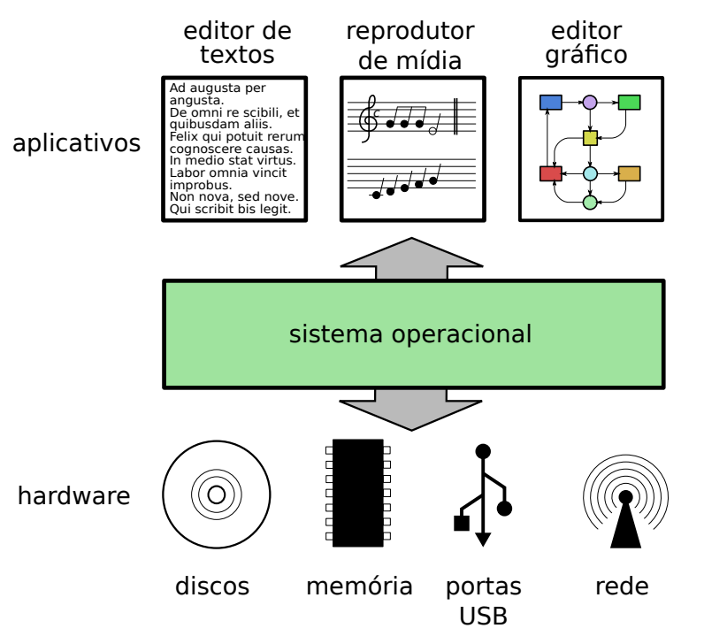
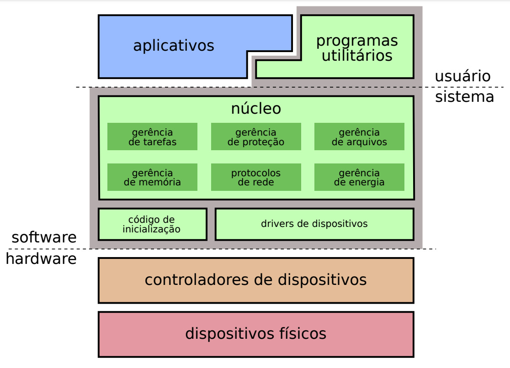

> **NOTE:**  
> All notes here are in Portuguese (Brazil).

# Sistemas Operacionais: Conceitos e Mecanismos (Portuguese Brazil)

## Contents

 - **Conceitos Básicos**
   - [Objetivos de um SO](#so-goal)
   - [Gerência de recursos](#res-management)
 - **Estrutura de um SO:**
   - [Elementos de um SO](#os-elements)
 - **O conceito de Tarefa:**
 - [**REFERENCES**](#references)
<!--- 
[WHITESPACE RULES]
- Same topic = "10" Whitespace character.
- Different topic = "50" Whitespace character.
--->

<!--- ( Conceitos Básicos ) --->

---

## Objetivos de um SO

> Um **Sistema Operacional (SO)** é um Software que *"gerencia os recursos de hardware"* e *"software"* de um computador, proporcionando uma interface entre o usuário e o hardware.

Por exemplo, veja a imagem abaixo:

  

---

## Gerência de recursos (+Funcionalidades de um SO)

Muitos programas de computador usam o hardware para atingir seus objetivos. Como:

 - Ler e armazenar dados.
 - Editar e imprimir documentos.
 - Navegar na Internet.
 - Tocar música...

**NOTE:**  
Em um sistema com várias atividades simultâneas, podem surgir conflitos no uso do hardware. Por exemplo, quando dois ou mais aplicativos precisam dos mesmos recursos para poder executar.

> Cabe ao **Sistema Operacional** definir *"políticas"* para gerenciar o uso dos recursos de hardware pelos aplicativos, e resolver eventuais disputas e conflitos.

Vejamos algumas situações onde a gerência de recursos do hardware se faz necessária:

 - **Uso de CPU e Memória:**
   - É normal em um sistema vários aplicativos disputarem o uso de *CPU* e *Memória*.
   - Por isso o uso desses dispositivos deve ser distribuído entre os aplicativos, de forma que cada um deles possa executar na velocidade adequada para cumprir suas funções sem prejudicar os demais.

**NOTE:**  
Ao desenvolver um Sistema Operacional, algumas funcionalidades que ajudam a gerência esses recursos são:

 - Gerência do processador.
 - Gerência de memória.
 - Gerência de dispositivos.
 - Gerência de arquivos.

<!--- ( Estrutura de um SO ) --->

---

## Elementos de um Sistema Operacional

 - **Núcleo (Core):**
   - É o coração do Sistema Operacional, responsável pela gerência dos recursos do hardware usados pelas aplicações.
   - Ele também implementa as principais abstrações utilizadas pelos aplicativos e programas utilitários.
 - **Código de inicialização (boot code):**
   - A inicialização do hardware requer uma série de tarefas complexas, como reconhecer os dispositivos instalados, testá-los e configurá-los adequadamente para seu uso posterior.
   - Outra tarefa importante é carregar o núcleo do sistema operacional em memória e iniciar sua execução.
 - **Drivers:**
   - Módulos de código específicos para acessar os dispositivos físicos.
   - Existe um driver para cada tipo de dispositivo, como discos rígidos SATA, portas USB, placas gráfica, etc.
   - Muitas vezes o driver é construído pelo próprio fabricante do hardware e fornecido em forma compilada (em linguagem de máquina) para ser acoplado ao restante do sistema operacional.
 - **Programas utilitários:**
   - São programas que facilitam o uso do Sistema Computacional, fornecendo funcionalidades complementares ao núcleo, como formatação de discos e mídias, configuração de dispositivos, manipulação de arquivos (mover, copiar, apagar), interpretador de comandos, terminal, interface gráfica, gerência de janelas, etc.

  

<!--- ( O conceito de Tarefa ) --->

---

## x

---

## x

<!--- ( REFERENCES ) --->

---

## REFERENCES

 - [Waine - Dev do Desempenho](https://www.youtube.com/@waine_jr/videos)
 - [Sistemas Operacionais: Conceitos e Mecanismos](https://www.researchgate.net/publication/343921399_Sistemas_Operacionais_Conceitos_e_Mecanismos)
 - [PingPongOS](https://wiki.inf.ufpr.br/maziero/doku.php?id=so:pingpongos)

---

**Rodrigo** **L**eite da **S**ilva
