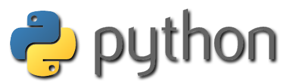

# Python

> Meus exemplos de códigos da Linguagem de Programação **Python**.

## Conteúdo

 - [Fundamentos](modules/fundamentals)
 - [Variáveis](modules/variables)
 - [Funções](modules/functions)
 - [Estruturas de dados básicas](modules/basic-data-structures)
 - [OOP](modules/oop)
 - [Módulos & Pacotes](modules/modules-packages)

---

**Rodrigo Leite -** *Software Engineer*
