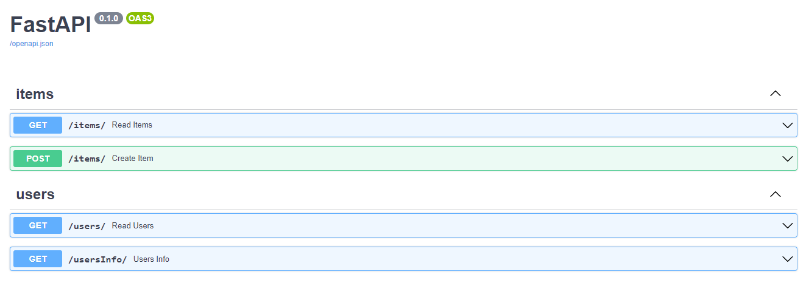
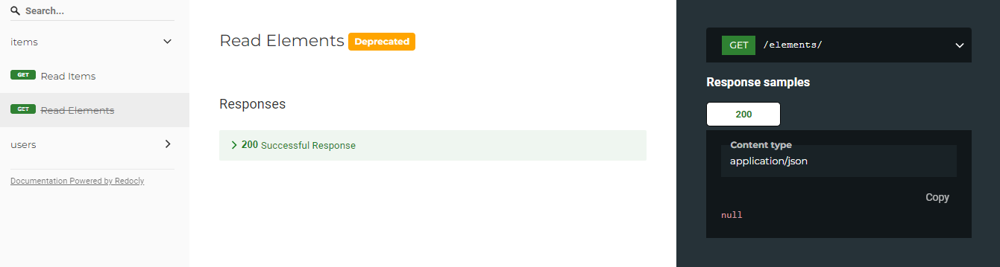

# Path Operation Configuration

> **Warning:**
> Notice that these parameters are passed directly to the path operation decorator, not to your path operation function.

## Contents

 - [Tags](#tags)
 - [Summary and description](#summary-description)
 - [Description from docstring](#docstring)
 - [Deprecate a path operation](#deprecate)

---

<div id=tags""></div>

## Tags

You can add tags to your path operation, pass the parameter **tags** with a *list* of **str** (commonly just one *str*):

[tags-v1.py](src/tags-v1.py)
```python
from fastapi import FastAPI
from pydantic import BaseModel

app = FastAPI()


class Item(BaseModel):
    name: str
    description: str | None = None
    price: float
    tax: float | None = None
    tags: set[str] = set()


@app.post("/items/", response_model=Item, tags=["items"])
async def create_item(item: Item):
    return item


@app.get("/items/", tags=["items"])
async def read_items():
    return [{"name": "Foo", "price": 42}]


@app.get("/users/", tags=["users"])
async def read_users():
    return [{"username": "johndoe"}]

@app.get("/usersInfo/", tags=["users"])
async def users_info():
    return [
        {"ID": 9999},
        {"Description": "My fake description"}
    ]
```

**CONSOLE:**  
```python
uvicorn tags-v1:app --reload
```

  

**NOTE:**  
See that now we have operations separated by tags (Items and Users).

---

<div id="summary-description"></div>

## Summary and description

You can add a **summary** and **description** for yours operations:

[summary-desc.py](src/summary-desc.py)
```python
from fastapi import FastAPI
from pydantic import BaseModel

app = FastAPI()


class Item(BaseModel):
    name: str
    description: str | None = None
    price: float
    tax: float | None = None
    tags: set[str] = set()


@app.post(
    "/items/",
    response_model=Item,
    summary="Create an item",
    description="Create an item with all the information, name, description, price, tax and a set of unique tags",
)
async def create_item(item: Item):
    return item
```

**CONSOLE:**  
```python
uvicorn summary-desc:app --reload
```

---

<div id="docstring"></div>

## Description from docstring

As descriptions tend to be long and cover multiple lines, you can declare the path operation description in the function docstring and FastAPI will read it from there.

You can write **Markdown** in the docstring, it will be interpreted and displayed correctly (taking into account docstring indentation).

[docstring.py](src/docstring.py)
```python
from fastapi import FastAPI
from pydantic import BaseModel

app = FastAPI()


class Item(BaseModel):
    name: str
    description: str | None = None
    price: float
    tax: float | None = None
    tags: set[str] = set()


@app.post("/items/", response_model=Item, summary="Create an item")
async def create_item(item: Item):
    """
    Create an item with all the information:

    - **name**: each item must have a name
    - **description**: a long description
    - **price**: required
    - **tax**: if the item doesn't have tax, you can omit this
    - **tags**: a set of unique tag strings for this item
    """
    return item
```

**CONSOLE:**  
```python
uvicorn docstring:app --reload
```

  
  

---

<div id="deprecate"></div>

## Deprecate a path operation

If you need to mark a path operation as <u>deprecated</u>, **but without removing it**, pass the parameter **deprecated=True**:

[deprecated.py](src/deprecated.py)
```python
from fastapi import FastAPI

app = FastAPI()


@app.get("/items/", tags=["items"])
async def read_items():
    return [{"name": "Foo", "price": 42}]


@app.get("/users/", tags=["users"])
async def read_users():
    return [{"username": "johndoe"}]


@app.get("/elements/", tags=["items"], deprecated=True)
async def read_elements():
    return [{"item_id": "Foo"}]
```

**CONSOLE:**  
```python
uvicorn deprecated:app --reload
```

  
  

---

**REFERENCES:**  
[Path Operation Configuration](https://fastapi.tiangolo.com/tutorial/path-operation-configuration/)  

---

Ro**drigo** **L**eite da **S**ilva - **drigols**
