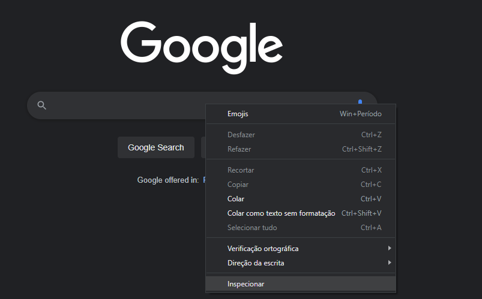

# Getting temperature from Google

## Contents

 - [Planning](#planning)
 - [Opening the browser and access the Google](#open)
 - [Typing search text in the browser](#typing-text)
 - [Getting result from search](#result)
 - [Full script (program)](#full)

---

<div id="planning"></div>

## Planning

To get a temperature from Google first we need planning the steps:

 - Open the Browser;
 - Access the Google;
 - Enter the search (temperature);
 - Click to find;
 - Found the temperature;
 - Finally, save the temperature.

---

<div id="open"></div>

## Opening the browser and access the Google page

Let's start by opening the browser and access the Google page:

```python
from selenium import webdriver
from selenium.webdriver.chrome.service import Service

service = Service(executable_path="C:\WebDriver\chromedriver")

driver = webdriver.Chrome(service=service) # Select the browser (Chrome).
driver.get('https://www.google.com/') # Open the browser with Google page.

driver.quit() # Closed the browser.
```

---

<div id="typing-text"></div>

## Typing search text in the browser

> Now, let's typing search text in the browser.

**NOTE:**  
But, before typing search text in the browser first we need to know what element will receive that text.

To know what element represents the search field first, let's inspect it:

  

Click in top left arrow to find elements passing the mouse:

  

Ok, see that this element has many attributes:

```html
<input
    class="gLFyf gsfi"
    jsaction="paste:puy29d;"
    maxlength="2048"
    name="q"
    type="text"
    aria-autocomplete="both"
    aria-haspopup="false"
    autocapitalize="off"
    autocomplete="off"
    autocorrect="off"
    autofocus=""
    role="combobox"
    spellcheck="false"
    title="Search"
    value=""
    aria-label="Search"
    data-ved="0ahUKEwjXiuDqhfb5AhUhFbkGHbzeAk0Q39UDCAQ">
```

> **NOTE:**  
> Now, let's use **name="q"** attribute to find this element with Selenium and pass text search for him.

To Apply this we use:

 - **find_element()** method from webdriver:
   - To find element in the page.
 - **By class**:
   - To find a specific element with "x" attribute (NAME) and "y" value ("q").
 - **send_keys()** method to send text to the specific element.

```python
//

from selenium.webdriver.common.keys import Keys
from selenium.webdriver.common.by import By

//

# Find element with attribute NAME="q" and pass "temperature now" for him.
elem = driver.find_element(By.NAME, "q").send_keys("temperature now")

//
```

Ok, now we need do our script (program) press enter in the browser. Let's inspect button element to find a specific attribute to works with:

  

```html
<input
    class="gNO89b"
    value="Google Search"
    aria-label="Google Search"
    name="btnK"
    role="button"
    tabindex="0"
    type="submit"
    data-ved="0ahUKEwji5YrXkvb5AhUtK7kGHWKEBiYQ4dUDCA0">
```

> **NOTE:**  
> - Now we can try find this element with Selenium using **name="btnK"** and work with.
> - However, here we have a problem. This HTML page has two elements with attribute **name="btnK"**.

To solve this we use **XPATH** approach, first we need get **XPATH** to the button element:

  

Now just use **find_element()** and **By.XPATH** to find this element and click() method to press enter in the browser.

```python
//

# Find element by XPATH attribute and use the click() method him.
driver.find_element(
    By.XPATH, "/html/body/div[1]/div[3]/form/div[1]/div[1]/div[3]/center/input[1]"
).click()

//
```

---

<div id="result""></div>

## Getting result from search

Finally, let's get result from the search, but first we need to inspect this element:

  

**outerHTML:**  
```python
<span
    class="wob_t q8U8x"
    id="wob_tm"
    style="display:inline">24
</span>
```

Ok, now we can use this ID to find this element and get the temperature:

```python
# Find element by ID and return the result as a text.
temperature = driver.find_element(By.ID, "wob_tm").text

print("\nDaily Temperature:", temperature)
```

**NOTE:**  
See that we used the **text** attribute to get a return as a text.

---

<div id="full"></div>

## Full script (program)

The full script (program) was:

[temp_from_google.py](src/temp_from_google.py)
```python
from selenium import webdriver
from selenium.webdriver.chrome.service import Service

from selenium.webdriver.common.keys import Keys
from selenium.webdriver.common.by import By

service = Service(executable_path="C:\WebDriver\chromedriver")

driver = webdriver.Chrome(service=service) # Select the browser (Chrome).
driver.get('https://www.google.com/') # Open the browser with Google page.

# Maximize the window.
driver.maximize_window()

# Find element with attribute NAME="q" and pass "temperature now" for him.
driver.find_element(By.NAME, "q").send_keys("temperature now")

# Find element by XPATH attribute and use the click() method him.
driver.find_element(
    By.XPATH, "/html/body/div[1]/div[3]/form/div[1]/div[1]/div[3]/center/input[1]"
).click()

# Find element by ID and return the result as a text.
temperature = driver.find_element(By.ID, "wob_tm").text

driver.quit() # Closed the browser.

# Print the result.
print("\nDaily Temperature:", temperature)
```

**OUTPUT:**
```python
Daily Temperature: 24
```

---

**REFERENCES:**  
[Aprenda Automação WEB em 10 minutos! (Selenium com Python)](https://www.youtube.com/watch?v=myQIZElpXTU)  

---

Ro**drigo** **L**eite da **S**ilva - **drigols**
