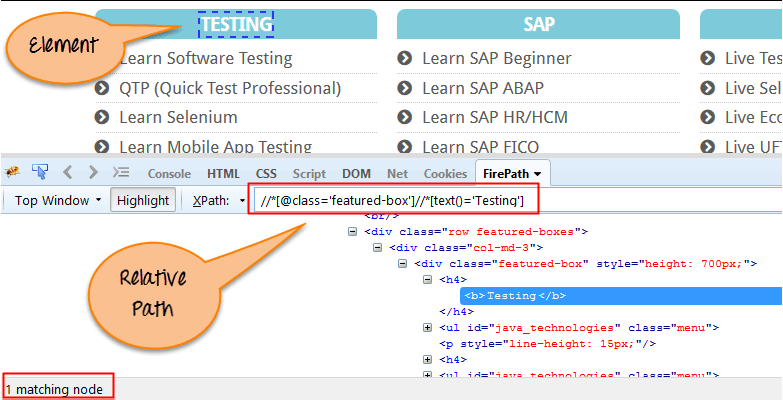

# XPath

## Contents

 - [What is XPath in Selenium?](#intro)
 - [Absolute XPath](#axpth)
 - [Relative Xpath](#rxpth)

---

<div id="intro"></div>

## What is XPath in Selenium?

> **XPath in Selenium** is an XML path <u>used for navigation through the HTML structure of the page</u>.

**NOTE:**  
**XPath** can be used for both *HTML* and *XML* documents to find the location of any element on a webpage using **HTML DOM structure**.

The basic format of XPath in selenium is explained below with screen shot:

  

**Syntax for XPath selenium:**
```
Xpath=//tagname[@attribute='value']
```

---

<div id="axpth"></div>

## Absolute XPath

It is the direct way to find the element.

> **NOTE:**  
> But the <u>disadvantage</u> of the absolute XPath is that <u>if there are any changes made in the path of the element then that XPath gets failed</u>.

For example:

**Absolute XPath:**
```
/html/body/div[2]/div[1]/div/h4[1]/b/html[1]/body[1]/div[2]/div[1]/div[1]/h4[1]/b[1]
```

  

> **NOTE:**  
> The key characteristic of XPath is that it begins with the **single forward slash(/)**,which means you can select the element from the root node.

---

<div id="rxpth"></div>

## Relative XPath

**Relative XPath** starts from the middle of **HTML DOM structure**.

 - It starts with **double forward slash (//)**;
 - It can search elements anywhere on the webpage, means no need to write a long XPath and you can start from the middle of HTML DOM structure.
 - Relative XPath is always preferred as it is not a complete path from the root element.

For example:

**Relative XPath:**
```
//div[@class='featured-box cloumnsize1']//h4[1]//b[1]
```

  

---

**REFERENCES:**  
[XPath in Selenium: How to Find & Write Text, Contains, OR, AND](https://www.guru99.com/xpath-selenium.html)  
[How to find element by XPath in Selenium with Example](https://www.browserstack.com/guide/find-element-by-xpath-in-selenium)  

---

Ro**drigo** **L**eite da **S**ilva - **drigols**
