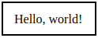
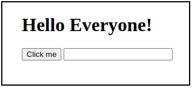

# Django

## Contents

 - **Django Fundamentals:**
   - [Arquitetura do Django (MVT | Model-View-Template)](#django-architecture)
   - [Projects vs. apps](#project-x-app)
 - **Model-View-Template (MVT):**
   - [**Model:**](#intro-to-models)
     - [Separating models by files](#separating-models-by-files)
   - [**View:**](#intro-to-views)
   - [**Template:**](#intro-to-templates)
     - [Como definir um HTML base para o projeto (base.html)](#creating-template-base)
     - [Como usar (relacionar/mapear) um template base em um template filho](#using-template-base)
     - **CSS:**
       - [Como criar um arquivo base.css e adicionar no base.html](#creating-base-css)
       - [Como adicionar um CSS específico (users.css) em um bloco head](#creating-users-css)
     - **Components:**
       - [Como mapear um formulário no django](#mapping-form)
 - **Routes/URL:**
   - [Como criar uma Rota/URL no Django](#criar-rota-url)
 - **Migrations (Allows Django to "Manage" and "Version Control" database schemas):**
   - [Specifying the Databases](#specifying-the-databases)
   - [`python manage.py migrate (Send migrations to the database)`](#migrate)
   - [`python manage.py makemigrations (Create/Version the changes in the model using migrations files)`](#makemigrations)
 - **CORE:**
   - [How add an App to the Project](#how-add-an-app-to-the-project)
   - [Como fazer o Django reconhecer os "templates" da aplicação](#templates-to-settings)
   - [Como fazer o Django reconhecer os arquivos estáticos e de média (Static vs. Media)](#static-to-settings)
 - **Django Admin:**
   - `python manage.py createsuperuser` (http://localhost:8000/admin)
   - [Add your models to the Django Admin](#add-your-models-to-the-django-admin)
 - **Project & App Settings:**
   - [Como estruturar um projeto Django com gerenciador de dependências Poetry](#setting-poetry-core)
   - [Creating React and Django Projects](#react-django-projects)
 - **Commands:**
   - `python manage.py startproject <ProjectName>`
   - `python manage.py startapp <AppName>`
   - `python manage.py runserver (You can specify a port number here)`
 - [**References**](#ref)
<!---
[WHITESPACE RULES]
- Same topic = "10" Whitespace character.
- Different topic = "50" Whitespace character.
--->


<!--- ( Django Fundamentals ) --->

---

<div id="project-x-app"></div>

## Projects vs. apps

 - **A project** is a `collection of configuration` and `apps` for a particular website:
   - `A project can contain multiple apps.`
 - **An app** is a web application that *"does something"*:
   - A blog system;
   - A database of public records;
   - A small poll app...
   - `An app can be in multiple projects.`


---

<div id="django-architecture"></div>

## Arquitetura do Django (MVT | Model-View-Template)

> O django utiliza a **Arquitetura MVT (Model-View-Template)**.

Onde:

 - **Model:**
   - Tudo o que for relacionado a Banco de Dados.
 - **View:**
   - É onde fica a lógica da nossa Aplicação.
   - Por exemplo, são as funções Python que vão receber uma requisição (request) e devolver uma resposta (response).
 - **Template:**
   - São os nossos arquivos HTML que vão ser exibidos para o usuário.

Por exemplo, veja a imagem abaixo:

  

Vejam que:

 - **Eu tenho o meu Cliente:**
   - No caso meu Navegador (Browser).
   - Que faz uma requisão (request) HTTP.
 - **Essa requisição (resquest) HTTP vai para `url.py` do projeto (core):**
   - Ele vai verificar se existe a Rota/URl chamada.
 - **Se a Rota/URL existir nós chamamos uma funcionalidade (view):**
   - Processamos o que tem que ser feito e retornamos uma resposta (response) HTTP.


<!--- ( Model-View-Template (MVT)/Model ) --->

---

<div id="intro-to-models"></div>

## Model

> Everything related to Databases.

 - **Definition:**
   - Models are Python classes that define the structure of your database.
 - **Purpose:**
   - Define database schema.
   - Define relationships between different data entities.
   - Provide an abstraction layer for database operations.

**EXAMPLE:**
```python
from django.db import models

class Author(models.Model):
    name = models.CharField(max_length=100)
    birth_date = models.DateField()
    email = models.EmailField()

    def __str__(self):
        return self.name
```

In this example:

 - Author is a model with three fields:
   - *"name"*, *"birth_date"*, and *"email"*.
 - Each field is represented by a field class (e.g., CharField, DateField, EmailField) that specifies the type of data it holds.

---

<div id="separating-models-by-files"></div>

## Separating models by files

 - It is common at the beginning of our application to create our models in the `models.py` file.
 - However, as our application scales, we will have many models in the same file.
 - So, the interesting thing here would be to divide our models by files:
   - **NOTE:** This ensures/helps the modularization of the system.

For example, imagine we have the following models:

```python
# employees_management/models.py

from django.db import models


class Employee(models.Model):
    name = models.CharField(max_length=250)


class Department(models.Model):
    name = models.CharField(max_length=250)
```

To separate them first, let's create the following structure: 

```bash
├── <employees_management>
|      ├── /models
|      |      ├── __init__.py
|      |      ├── employee.py
|      |      ├── department.py
```

```python
# employees_management/models/employee.py

from django.db import models


class Employee(models.Model):
    name = models.CharField(max_length=250)
```

```python
# employees_management/models/department.py

from django.db import models


class Department(models.Model):
    name = models.CharField(max_length=250)
```

**NOTE:**  

 - **EN -** Now we need to import the modules `(employee.py and department.py)` in the `__init__.py` file so that Django can work with these models that are in separate files.
 - **PT -** Agora nós precisamos importar os módulos `(employee.py e department.py)` no arquivo `__init__.py `para o django conseguir trabalhar com esses models que estão em arquivos separados.

```python
# employees_management/models/__init__.py

from .employee import Employee
from .department import Department
```

Finally, run the Django migration commands:

```bash
python manage.py makemigrations
```

```bash
python manage.py migrate
```


<!--- ( Model-View-Template (MVT)/View ) --->

---

<div id="intro-to-views"></div>

## View

 - Views are where the logic of our Application is located.
 - For example, these are the Python functions that will receive a *"request"* and return a *"response"*.


<!--- ( Model-View-Template (MVT)/Template ) --->

---

<div id="intro-to-templates"></div>

## Template


> **Templates nada mais são do que HTML's que vão ser exibidos na tela.**

Vocês concordam então que nós podemos ter:

 - Templates do projeto (Por exemplo, core).
 - Templa de cada App (Por exemplo, users).

Sabendo disso nós vamos criar 2 diretórios templates:

```bash
├─── /
│    ├── /templates
│    ├── /users
│    |      ├── /templates
```

Vejam que agora nós temos:

 - Os templates da aplicação.
 - Os templates do App "users".

---

<div id="creating-template-base"></div>

## Como definir um HTML base para o projeto (base.html)

É comum em uma aplicação web nós termos coisas que se repetem em várias página. Por exemplo:

 - Background.
 - Fontes.
 - Cores...

> **NOTE:**  
> Para resolver isso o django tem os **"Arquivos de Base"**.

Vamos criar um arquivo chamado `templates/base.html` (Nos templates de todo o projeto, não do App):

```html
<!--- { templates/base.html } --->

<!doctype html>
<html lang="en">
    <head>
        <meta charset="utf-8">
        <meta name="viewport" content="width=device-width, initial-scale=1">
        <title></title>
        <link href="https://cdn.jsdelivr.net/npm/bootstrap@5.3.3/dist/css/bootstrap.min.css" rel="stylesheet">
        
    </head>
    <body>
        
        <script src="https://cdn.jsdelivr.net/npm/bootstrap@5.3.3/dist/js/bootstrap.bundle.min.js"></script>
    </body>
</html>
```

 - Agora eu posso utilizar esses códigos base em outros templates:
   - Para utilizar esse código base em outros templates é só utilizar o `extend (heranças)` para dizer que o templete vai herdar o template base: ``
   - **NOTE:** Agora o template que extender (herdar) o template base (base.html), exibirá o conteúdo do template base.
 - ``, ``, ``:
   - Esses blocos não tem nada escrito, mas se tivesse seria exibido no template filho (que extendeu/herdou o template base).
   - **NOTE:** Outra observação é que você pode reescrever esse bloco no template filho ele será exibido no template base:
     - Ou seja, esse bloco está mapeado/relacionado entre os templates pai e filho.

---

<div id="using-template-base"></div>

## Como usar (relacionar/mapear) um template base em um template filho

> Lembram que nós podemos extender (herdar) o template base (base.html) para outros templates (filhos)?

Então, vamos extender (herdar) o template base (base.html) para criar uma tela de registro (Signup) para um App "users":

```html
<!--- ( users/templates/register.html ) --->










    <div class="container-fluid">
        <div class="row">
            <div class="col-md-2 d-flex justify-content-center bg-img ">
            </div>
            <div class="col-md-10 d-flex justify-content-center bg-color-dark form-auth">
                <div class="container-form">
                    <h1 class="text-logo">START.SE</h1>
                    <h1>Sign up</h1>
                    <br>
                    <form action="#" >
                        <label>Username</label>
                        <input type="text" class="form-control input-pers" name="username" placeholder="Enter your username">
                        <br>
                        <label>Senha</label>
                        <input type="password" class="form-control input-pers" name="senha" placeholder="Enter your password">
                        <br>
                        <label>Confirmar senha</label>
                        <input type="password" class="form-control input-pers" name="confirmar_senha" placeholder="Confirm your password">
                        <div class="centralizar">
                            <input type="submit" class="btn btn-indigo" value="Cadastrar">
                            <a href="#" class="texto">I already have an account</a>
                        </div>
                    </form>
                </div>
            </div>
            
        </div>
    </div>

```

**NOTE:**  
Vejam que nós extendermos (herdamos) do template base e reescrevemos os blocos:

 - ``
 - ``
 - **NOTE:** Vejam que nós inserimos novos conteúdos nesses blocos.

---

<div id="creating-base-css"></div>

## Como criar um arquivo base.css e adicionar no base.html

> Lembram que nós temos um `base.html` para toda a aplicação?

Então, é interessante também ter um arquivo `base.css` para todo o projeto, com regras de *CSS* gerais (comum) para todo o projeto.


```css
/* core/templates/static/general/css/base.css */

:root{
    --main-color: #161424;
    --dark-color: #0D0C16;
    --contrast-color: #4F46E5;
}

body{
    color: white !important;
    background-color: var(--main-color) !important;
}

.bg-color-dark{
    background-color: var(--main-color);
}

.p-bold{
    font-weight: bold;
}

.color-dark{
    color: var(--dark-color);
}

.dark-color{
    background-color: var(--dark-color);
    color: white !important;
}

.centralizar{
    text-align: center;
}

::-webkit-input-placeholder {
    color: rgb(196, 196, 196) !important;
}

:-moz-placeholder { /* Firefox 18- */
    color: rgb(196, 196, 196) !important;  
}

::-moz-placeholder {  /* Firefox 19+ */
    color: rgb(196, 196, 196) !important;  
}

:-ms-input-placeholder {  
    color: rgb(196, 196, 196) !important;  
}
```

Agora basta dizer que o nosso `base.html` vai utilizar o nosso *CSS* `base.css`:

```html
<!--- { templates/base.html } --->


<!doctype html>
<html lang="en">
    <head>
        <meta charset="utf-8">
        <meta name="viewport" content="width=device-width, initial-scale=1">
        <link rel="stylesheet" href="">
        <title></title>
        <link href="https://cdn.jsdelivr.net/npm/bootstrap@5.3.3/dist/css/bootstrap.min.css" rel="stylesheet">
        
    </head>
    <body>
        
        <script src="https://cdn.jsdelivr.net/npm/bootstrap@5.3.3/dist/js/bootstrap.bundle.min.js"></script>
    </body>
</html>
```

 - O django `` é responsável por carregar os arquivos estáticos no projeto.
 - Para utilizar o nosso CSS nós o importamos na tag `<link>`:
   - `<link rel="stylesheet" href="">`

---

<div id="creating-users-css"></div>

## Como adicionar um CSS específico (users.css) em um bloco head

Imagine que nós temos o seguinte CSS do nosso App `users`:

```css
/* core/templates/static/users/css/users.css */

.bg-img{
    background-image: url('');
    height: 100vh;
    background-size: cover;
}

.form-auth{
    padding: 50px;
}

.text-logo{
    color: rgb(161, 161, 161);
    font-weight: 100;
}

.container-form{
    width: 35%;
    margin-top: 4em;
    
}

.input-pers{
    margin-top: 5px;
    background-color: transparent !important;
    font-size: 18px;
    color: white !important;
}

.btn-indigo{
    background-color: var(--contrast-color);
    color: white;
    width: 100%;
    margin-top: 20px;
    font-size: 20px;
}

.btn-indigo-normal{

    background-color: var(--contrast-color);
    color: white;

}

.btn-indigo:hover{
    background-color: #332cb6;
}

.centralizar{
    text-align: center;
}

.texto{
    color: white;
    text-decoration: none;
}
```

Para dizer que o nosso `register.html` vai utilizar o nosso *CSS* `users.css`:

```html
<!--- { users/templates/register.html } --->




    <link rel="stylesheet" href="">

```

> **NOTE:**  
> Veja que nós estamos importando o nosso CSS dentro do bloco `head`.

---

<div id="mapping-form"></div>

## Como mapear um formulário no django

Para entender como mapear um formulário no Django, primeiro imagine que temos o seguinte formulário:

```html
<!--- { users/templates/register.html } --->

<form action="" method="POST">
    <label>Username</label>
    <input type="text" class="form-control input-pers" name="username" placeholder="Enter your username">
    <br>
    <label>Senha</label>
    <input type="password" class="form-control input-pers" name="password" placeholder="Enter your password">
    <br>
    <label>Confirmar senha</label>
    <input type="password" class="form-control input-pers" name="confirm_password" placeholder="Confirm your password">
    <div class="centralizar">
        <input type="submit" class="btn btn-indigo" value="Cadastrar">
        <a href="#" class="texto">I already have an account</a>
    </div>
</form>
```

 - ``
   - Isso é referente ao `nome (name="register")` da URL que nós definimos em `urls.py`.
   - `path("register/", views.register, name="register"),`
 - `method="POST"`
   - Isso é referente ao *metodo (POST) HTTP* que o formulário vai utilizar.
 - ``
   - Essa tag do django é uma tag de segurança contra falsificação de formulários.
 - `name="username"`, `name="password"`, `name="confirm_password"`
   - Esses são os nomes dos campos no formulário que podem ser utilizados nas views para encontrar as entradas.
     - `username = request.POST.get("username")`
     - `password = request.POST.get("password")`
     - `confirm_password = request.POST.get("confirm_password")`

Ótimo, já temos o formulário, agora vamos criar um método em `views.py` que vai receber o formulário e vai realizar o cadastro de usuário no Banco de Dados (SQLite no caso):

```python
# users/views.py


from django.shortcuts import redirect, render
from django.contrib.auth.models import User


def register(request):
    if request.method == "GET":
        return render(request, "register.html")
    elif request.method == "POST":

        username = request.POST.get("username")
        password = request.POST.get("password")
        confirm_password = request.POST.get("confirm_password")

        if not password == confirm_password:
            print("Passwords do not match.")
            return redirect("/users/register")

        if len(password) < 6:
            print("Password too short.")
            return redirect("/users/register")

        users = User.objects.filter(username=username)
        if users:
            print("User already exists.")
            return redirect("/users/register")

        user = User.objects.create_user(
            username=username,
            password=password,
        )

        return redirect("/users/login")
```

Agora vamos explicar as partes mais importantes do código acima:


```python
if request.method == "GET":
    return render(request, "register.html")
elif request.method == "POST":
    ....
```

Aqui é o seguinte:

 - Se a requisição for `GET`, ou seja, o usuário estiver tentando acessar a página de cadastro, nós vamos renderizar (render) a tela de cadastro `(register.html)`.
 - Se a requisição for `POST`, ou seja, o usuário estiver tentando realizar o cadastro, nós vamos realizar o cadastro:
   - **NOTE:** Esse procesos de cadastro vai ser explicado abaixo.

```python
username = request.POST.get("username")
password = request.POST.get("password")
confirm_password = request.POST.get("confirm_password")
```

Aqui nós estamos utilizando `request.POST.get()` para pegar valores específicos (name) de cada campo do formulário.

```python
if not password == confirm_password:
    print("passwords do not match.")
    return redirect("/users/register")
```

Se o `password` e o `confirm_password` não forem iguais (not) o usuário será redirecionado (redirect) para a tela (Rota/URL) de cadastro novamente.

```python
if len(password) < 6:
    print("password too short.")
    return redirect("/users/register")
```

Se o `password` for muito curto `(password < 6)` o usuário será redirecionado (redirect) para a tela (Rota/URL) de cadastro novamente.

```python
users = User.objects.filter(username=username)
if users:
    print("User already exists.")
    return redirect("/users/register")
```

 - Nessa parte nós estamos utilizando o método filter() para verificar se o usuário existe no Banco de Dados.
 - Se o usuario existir, o usuário será redirecionado (redirect) para a tela (Rota/URL) de cadastro novamente.

```python
from django.contrib.auth.models import User


# ......


user = User.objects.create_user(
    username=username,
    password=password,
)
```

Aqui nós estamos adicionando um novo usuário no Banco de Dados SQLite.

```python
return redirect("/users/login")
```

Por fim, se tudo ocorreu bem, o usuário será redirecionado (redirect) para a tela (Rota/URL) de login.


<!--- ( Routes/URL ) --->

---

<div id="criar-rota-url"></div>

## Como criar uma Rota/URL no Django

Por padrão uma Aplicação Django já vem com as Rotas/URLs:

 - **Barra "/" | Que é um tipo de homepage feita pelo Django:**
   - [http://127.0.0.1:8000/](http://127.0.0.1:8000/)
 - **Admin | Área administrativa do Django:**
   - Aqui você tem que cadastrar os usuarios para poder acessar:
     - `python manage.py createsuperuser`
   - [http://127.0.0.1:8000/admin](http://127.0.0.1:8000/admin)

Para criar uma nova Rota/URL nós devemos registra-la em `core/urls.py`:

```python
# core/urls.py

from django.contrib import admin
from django.urls import path

urlpatterns = [
    path(route='admin/', view=admin.site.urls),
]
```

Vejam que automaticamente o Django já registrou a Rota/URL **"admin/"**. Onde:

 - `from django.urls import path`
   - A função `path` do Django é fundamental para **"mapear"** URLs para as respectivas `views (funções que geram as respostas HTTP)`.
 - `route`
   - O parâmetro `route` define uma nova Rota/URL das páginas, por exemplo:
     - `/home/`, `/products/`, `/contacts/`.
 - `view`
   - As views são responsáveis por:
     - Conter a lógica para buscar os dados necessários.
     - Criar a estrutura da página (usando templates).
     - Retornar a página completa para o usuário.
     - **NOTE:** Ou seja, as views geram respostas HTTP para o cliente.

**NOTE:**  
Viram que para cada URL/Rota nós temos o mapeamento para uma ação (view).

> **Mas como criar uma nova Rota/URL?**

Imagine que nós temos um App **"noivos"** que tem suas próprias URLs, por exemplo:

```bash
noivos/convidados
noivos/presentes
noivos/padrinhos
```

Para mapear essas sub Rotas/URLs em `core/urls.py` nós utilizamos a função `include()`:

```python
# core/urls.py

from django.contrib import admin
from django.urls import path, include

urlpatterns = [
    path(route='admin/', view=admin.site.urls),
    path(route='noivos/', view=include('noivos.urls')),
]
```

> **NOTE:**  
> Vejam que nós criamos a Rota/URL `noivos/` que a ação dela agora não vai ser uma view, mas sim buscar as sub Rotas/URLs do App `noivos` em `noivos/urls.py` que por sua vez terá suas views relacionadas.

Agora vamos criar um novo arquivo `noivos/urls.py` que terar um mapeamento das sub Rotas/URLs do App `noivos` com as Ações/Respostas HTTP das views:

```python
# noivos/urls.py

from django.urls import path


urlpatterns = [
    path(route='', view=???),
]
```

> **NOTE:**  
> Por enquanto nós não temos nenhuma ação/resposta HTTP (view) para o App `noivos`.

Então, vamos criar em `noivos/views.py` uma resposta HTTP para a Rota/URL `noivos/`:

```python
# noivos/views.py

from django.http import HttpResponse


def home(request):
    return HttpResponse("Hello, world!")
```

> **NOTE:**  
> Essa resposta vai apenas exibir **"Hello, world!"** no Browser.

Agora vamos relacionar essa ação/resposta da view com o a nossa Rota/URL `noivos/`:

```python
# noivos/urls.py

from django.urls import path
from . import views

urlpatterns = [
    path(route='', view=views.home, name='home'),
]
```

 - O parâmetro **"name"** dentro da função path do Django serve como um `identificador único` para uma determinada Rota/URL.
 - Ele é como um apelido que você dá para uma rota, facilitando sua referência em outras partes do seu projeto, principalmente na criação de links dinâmicos.

  

> **E como eu faço para essa Rota/URL mostrar um arquivo HTML?**

Primeiro, vamos criar um `home.html` só para teste:

```html
<!--- ( noivos/templates/home.html ) --->

<h1>Hello Everyone!</h1>
<button>Click me</button>
<input type="text">
```

Agora vamos modificar nossa função **home()** em `noivos/views.py` para exibir o `home.html`:

```python
# noivos/views.py

from django.shortcuts import render


def home(request):
    if request.method == "GET":
        return render(request, "home.html")
```

  

Vejam que:

 - `if request.method == "GET"`
   - Primeiro nós estamos utilizando o atributo `request.method` para verificar se o método da requisição é `GET`.
   - **NOTE:** Que é o método utilizado para pegar (ler) dados do servidor.
 - `render(request, "home.html")`
   - Se o método foi mesmo `GET`, iremos renderizar o arquivo `home.html` no Browser com a função **render()** do Django.


<!--- ( Migrations ) --->

---

<div id="specifying-the-databases"></div>

## Specifying the Databases

To specify the database we need to open the `settings.py` file in the project folder and find the **"DATABASES key"**:

```python
DATABASES = {
    'default': {
        'ENGINE': 'django.db.backends.sqlite3',
        'NAME': BASE_DIR / 'db.sqlite3',
    }
}
```

> **NOTE:**  
> By default, Django uses the **"sqlite3"** database.

Now, let's see how to add other databases:

```python
DATABASES = {
    'default': {
        'ENGINE': 'django.db.backends.sqlite3',
        'NAME': BASE_DIR / 'db.sqlite3',
    },
    'mysql_db': {
        'ENGINE': 'django.db.backends.mysql',
        'NAME': 'blog_db',
        'USER': 'root',
        'PASSWORD': 'toor',
        'HOST': 'localhost',
        'PORT': '3310',
    },
    'postgresql_db': {
        'ENGINE': 'django.db.backends.postgresql',
        'NAME': 'blog_db',
        'USER': 'postgres',
        'PASSWORD': 'toor',
        'HOST': 'localhost',
        'PORT': '5432',
    }
}
```

See that:

 - We have a default database: **sqlite3**.
 - Setting to use another databases: **"mysql_db"** and **"postgresql_db"**.

**NOTE:**  
To apply migrations to a specific database you need to run the following command:

```bash
# MySQL.
python manage.py migrate --database=mysql_db

# PostgreSQL.
python manage.py migrate --database=postgresql_db
```


---

<div id="migrate"></div>

## `python manage.py migrate (Send migrations to the database)`

```bash
python manage.py migrate
```

> **The command above is used to *"send migrations to the database"*.**

For example:

 - The command `migrate` prepares the Django Database:
   - Commonly used to initialize the database.
 - When we *create/modify a model*, we need to run the `migrate` command to send the changes to the database.


---

<div id="makemigrations"></div>

## `python manage.py makemigrations (Create/Version the changes in the model using migrations files)`

To understand the command `makemigrations`, let's imagine we have an App `employees_management` with the following models.

```python
# employees_management/models.py

from django.db import models


class Employee(models.Model):
    name = models.CharField(max_length=250)
```

Before run the `makemigrations` command, we need to:

 - Add the App to the `INSTALLED_APPS` list in `settings.py` file.
 - Run the command `python manage.py migrate`.

```bash
python manage.py makemigrations
```

**OUTPUT:**  
```bash
 employee_management/migrations/0001_initial.py
    + Create model Employee
```

See that:

 - The django created a folder `/migrations`.
 - With the file `0001_initial.py`:
   - Represents the first migration or model version.
   - If we change the model, we need to run the `makemigrations` command again:
     - **NOTE:** In other words, as we improve our models (a medida que nós vamos incrementando nossos modelos), we will run the `makemigrations` command and version the changes in the model.

```python
# migrations/0001_initial.py

# Generated by Django 5.1 on 2024-08-11 04:30

from django.db import migrations, models


class Migration(migrations.Migration):

    initial = True

    dependencies = [
    ]

    operations = [
        migrations.CreateModel(
            name='Employee',
            fields=[
                ('id', models.BigAutoField(auto_created=True, primary_key=True, serialize=False, verbose_name='ID')),
                ('name', models.CharField(max_length=250)),
            ],
        ),
    ]
```

 - `Generated by Django 5.1 on 2024-08-11 04:30`
   - Date and hour of the migration.
 - `initial = True`
   - Says that this is the first migration.
 - `dependencies = []`
   - Dependencies for this migration.
 - `migrations.CreateModel()`
   - Class to create a model's table.
 - `name='Employee'`
   - Name of the model (table).
 - `fields=[id, name]`
   - Fields of the model (table).
   - **NOTE:** Since I didn't define a *"Primary Key"*, django automatically created the `id` field to be the *primary key*.

Briefly:

> The command `makemigrations` create/version the changes in the model using the migrations files.


<!--- ( CORE ) --->

---

<div id="how-add-an-app-to-the-project"></div>

## How add an App to the Project

> After install (create) an App we need to install (register) this App in our project. To do this, we need to add it in our `core/settings.py` file.

For example, imagine we create the `blog` App:

```bash
django-admin startapp blog
```

Now, let's add the new app to the project:

```python
# core/settings.py

# ...

INSTALLED_APPS = [
    "django.contrib.admin",
    "django.contrib.auth",
    "django.contrib.contenttypes",
    "django.contrib.sessions",
    "django.contrib.messages",
    "django.contrib.staticfiles",
    "blog.apps.BlogConfig", # <--- App added here.
]

# ...
```

You can check the app settings on the `apps.py` file inside the app folder:

```python
from django.apps import AppConfig


class BlogConfig(AppConfig):
    default_auto_field = 'django.db.models.BigAutoField'
    name = 'blog'
```


---

<div id="templates-to-settings"></div>

## Como fazer o Django reconhecer os "templates" da aplicação

> **Como fazer o Django reconhecer os templates da aplicação?**

Para entender como o Django reconhece os templates da aplicação, primeiro precisamos entender a constante `BASE_DIR` em `core/settings.py`:

```python
# core/settings.py

BASE_DIR = Path(__file__).resolve().parent.parent
```

 - Essa constante contém o diretório raiz do nosso projeto independente do Sistema Operacional (Windows, Linux, MacOS).
 - **NOTE:** Se for de seu interesse pode dar um `print(BASE_DIR)` para verificar.

Agora basta mapear nosso diretório raiz (`BASE_DIR`) com o diretório onde estao os templates da nossa aplicação:

```python
# core/settings.py


BASE_DIR = Path(__file__).resolve().parent.parent


TEMPLATES = [
    {
        'DIRS': [BASE_DIR / 'templates'],
        'APP_DIRS': True,
    }
]
```

 - `'DIRS': [],`
   - Define os diretórios que serão procurados para encontrar os templates:
     - `BASE_DIR:`
       - Inidica que vai procurar na raiz do projeto.
     - `templates:`
       - Inidica que vai procurar na pasta templates.
 - `'APP_DIRS': True,`
   - Define se o Django também deve procurar templates nos Apps.


---

<div id="static-to-settings"></div>

## Como fazer o Django reconhecer os arquivos estáticos e de média (Static vs. Media)

Antes de fazer as configurações para o Django reconhecer os Arquivos estáticos (static) e de média (media), vamos entender o que é um Arquivo estático (static) e de média (media):

 - `Arquivos Estátivos vs. de Média:`
   - `Estáticos:`
     - São os arquivos os programadores adicionam para serem utilizados na aplicação, como:
       - *CSS*, *JavaScript*, *Imagens*, etc.
   - `Média:`
     - São os arquivos que os usuários enviam (upload) para a aplicação, como:
       - Vídeos, imagens, etc.

Para fazer o Django reconhecer os arquivos estáticos (static) da aplicação, primeiro devemos procurar pelo a constante `STATIC_URL` em `core/settings.py`:

```python
# core/settings.py

STATIC_URL = 'static/'
```

 - No Django, a constante `STATIC_URL` no arquivo `core/settings.py` define a URL base para servir arquivos estáticos, como *"CSS"*, *"JavaScript"*, *"Imagens"* e outros recursos que não mudam com frequência:
   - Ela configura o caminho que os navegadores devem usar para acessar esses arquivos.

Abaixo da constante `STATIC_URL` adicione o seguinte código:

```python
# core/settings.py

import os


# Arquivos que os programadores adicionam (Por exemplo, CSS, JavaScript, imagens, etc.).
STATIC_URL = '/static/'
STATICFILES_DIRS = (os.path.join(BASE_DIR, 'templates/static'),)
STATIC_ROOT = os.path.join('static')
```

 - `import os`
   - Módulo Python para trabalhar com o Sistema Operacional.
 - `STATIC_URL = '/static/'`
   - Essa constante indica em qual URL da aplicação nós podemos acessar os arquivos estáticos.
 - `STATICFILES_DIRS = (os.path.join(BASE_DIR, 'templates/static'),)`
   - É uma lista (ou tupla) de diretórios onde o Django deve procurar por arquivos estáticos adicionais.
   - Aqui a função `os.path.join()` recebe dois argumentos:
     - O nome do diretório onde deve iniciar a busca (raiz do projeto nosso caso `BASE_DIR`).
     - O nome do diretório onde os arquivos estáticos estão *"(templates/static)"*.
 - `STATIC_ROOT = os.path.join('static')`
   - Define o diretório onde o Django colocará todos os arquivos estáticos quando o comando `collectstatic` for executado.
   - **NOTE:** Esse comando é usado em produção para reunir todos os arquivos estáticos de diferentes aplicativos em um único diretório, facilitando o trabalho do servidor web para servir esses arquivos.

Agora vamos configurar os arquivos de média da aplicação:

```python
# core/settings.py

import os


# Arquivos enviados (upload) pelo usuário para a aplicação.
MEDIA_ROOT = os.path.join(BASE_DIR, 'media')
MEDIA_URL = '/media/'
```

 - `MEDIA_ROOT = os.path.join(BASE_DIR, 'media')`
   - É o diretório onde o Django armazenará os arquivos de mídia enviados (upload) pelos usuários (imagens, vídeos, documentos, etc.).
   - Aqui a função `os.path.join()` recebe dois argumentos:
     - O nome do diretório onde deve iniciar a busca (raiz do projeto nosso caso `BASE_DIR`).
     - O nome do diretório onde os arquivos de média estão *"(media)"*.
 - `MEDIA_URL = '/media/'`
   - Essa variável indica em qual URL da aplicação nós podemos acessar os arquivos de média.


<!--- ( Django Admin ) --->

---

<div id="add-your-models-to-the-django-admin"></div>

## Add your models to the Django Admin

Imagine we have the following models:

```python
# your-app/models.py

from django.db import models


class Category(models.Model):
    name = models.CharField(max_length=30)


class Post(models.Model):
    title = models.CharField(max_length=255)
    body = models.TextField()
    created_on = models.DateTimeField(auto_now_add=True)
    last_modified = models.DateTimeField(auto_now=True)
    categories = models.ManyToManyField("Category", related_name="posts")


class Comment(models.Model):
    author = models.CharField(max_length=60)
    body = models.TextField()
    created_on = models.DateTimeField(auto_now_add=True)
    post = models.ForeignKey("Post", on_delete=models.CASCADE)
```

Now, for your models to appear in the Django Admin, we need to add them to the `admin.py` file:

```python
# your-app/admin.py

from django.contrib import admin
from blog.models import Category, Comment, Post


class CategoryAdmin(admin.ModelAdmin):
    pass


class PostAdmin(admin.ModelAdmin):
    pass


class CommentAdmin(admin.ModelAdmin):
    pass
```

Now, let's register a `user` to login on the Django Admin:

```bash
python manage.py makemigrations <app_name>
```

```bash
python manage.py migrate <app_name>
```

```bash
python manage.py migrate
```

```bash
python manage.py createsuperuser
```

> **NOTE:**  
> If we look better, we don't have our models in the Django Admin.

To solva that we need to register our models in the `admin.py` file:

```python
# your-app/admin.py

admin.site.register(Category, CategoryAdmin)
admin.site.register(Post, PostAdmin)
admin.site.register(Comment, CommentAdmin)
```

 - Now, if you reload the Django Admin page, you should see your models listed.
 - If you click on *Posts*, you can add new posts for the blog manually.


<!--- ( Project & App Settings ) --->

---

<div id="setting-poetry-core"></div>

## Como estruturar um projeto Django com gerenciador de dependências Poetry

Para estruturar um projeto com o gerenciador de dependências Poetry, primeiro vamos criar a pasta do projeto:

```bash
mkdir wedding_manager
```

> **NOTE:**  
> Usar "wedding_manager" (com underscore) ao invés de "weddingmanager" (sem) segue uma convenção de nomenclatura mais alinhada ao estilo Python.

Aqui estão os principais motivos:

 - **Legibilidade:**
   - O uso de um underscore torna o nome mais legível, especialmente quando envolve várias palavras. *"wedding_manager"* é visualmente mais claro e fácil de entender do que *"weddingmanager"*.
 - **PEP 8:**
   - A convenção de nomenclatura do Python (PEP 8) recomenda o uso de underscores para nomes de módulos e pacotes que têm várias palavras, o que torna o código mais consistente com os padrões Python.

Continuando, agora vamos iniciar o gerenciador de dependências Poetry:

```bash
poetry init
```

 - Nós vamos utilizar o **"poetry init"** ao invés do **"poetry new"** porque estamos supondo que é um projeto já existente.
 - Responda qual versão do Python você deseja utilizar e outras configurações (se desejar).

Agora vamos selecionar qual versão do Python nosso ambiente virtual vai utilizar:

```bash
poetry env use "/usr/local/bin/python3.13"
```

Continuando, vamos ativar o ambiente virtual:

```bash
poetry shell
```

Com o ambiente virtual ativado vamos instalar a última versão do Django:

```bash
poetry add django@latest
```

Agora nós vamos iniciar nosso projeto Django que muitas vezes é chamado de **"core"**:

```bash
django-admin startproject core .
```

> **Por que "core"?**

 - **Núcleo do sistema:**
   - O nome **"core" (núcleo, em inglês)** reflete o papel central que essa aplicação geralmente desempenha no projeto. Ela serve como a base sobre a qual outras aplicações podem ser construídas e, muitas vezes, contém funcionalidades essenciais como autenticação, configurações gerais e lógica de negócio comum a todo o sistema.
 - **Organização do Código:**
   - O nome **"core"** indica que essa pasta contém a configuração principal do projeto. Em projetos maiores, isso ajuda a diferenciar a configuração do Django das aplicações específicas (apps) que você criará.
 - **Evita Conflitos de Nome:**
   - Nomear o projeto com algo genérico como **"core"** evita possíveis conflitos de nome com outras apps do projeto, que geralmente terão nomes específicos, como *"users"*, *"finance"*, *"dashboard"*, etc.


---

<div id="react-django-projects"></div>

## Creating React and Django Projects

A common approach to create Django and React Project is:

 - Create a project with django-admin (This will be the Root/Backend of the project):
   - django-admin startproject `<project_name>`
 - Initialize `pyproject.toml` inside the root:
   - poetry init
 - Create the frontend with create-react-app:
   - npx create-react-app frontend


<!--- ( References ) --->

---

<div id="ref"></div>

## References

 - **General:**
   - [Python Documentation](https://docs.djangoproject.com/)
   - [Google Gemini](https://gemini.google.com/app)
   - [ChatGPT](https://chatgpt.com/)
   - [Estrutura Básica de um Projeto em Django](https://www.youtube.com/watch?v=4u0aI-90KnU)
 - **Tutorials:**
   - [How To Build a To-Do application Using Django and React](https://www.digitalocean.com/community/tutorials/build-a-to-do-application-using-django-and-react)
   - [Build a Blog From Scratch With Django](https://realpython.com/build-a-blog-from-scratch-django/)
   - [Dev Fullstack Cloud](https://www.youtube.com/playlist?list=PLsA_kcShOU63R5AWqD4Apn78ePPbpncv4)

---

**Rodrigo** **L**eite da **S**ilva
