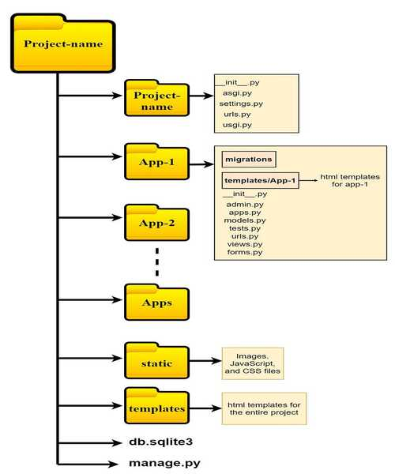

# Django



## Contents

 - **Basics:**
   - [Django Architecture ( Model-Template-View | MTV )](#django-architecture)
   - [Projects vs. apps](#project-x-app)
 - **Django Structure:**
   - **/projectname (Project Root)**
     - [`manage.py`](#manage-py)
     - [**/projectname (Django Root)**](#project-name)
       - [`__init__.py`](#init-py)
       - [`asgi.py`](#asgi-py)
       - [`settings.py`](#settings-py)
       - [`urls.py`](#urls-py)
       - [`wsgi.py`](#wsgi-py)
     - [**/app-name**](#app-name)
       - [`__init__.py`](#app-init-py)
       - [`admin.py`](#app-admin-py)
       - [`apps.py`](#app-apps-py)
       - [`models.py`](#app-models-py)
       - [`tests.py`](#app-tests-py)
       - [`views.py`](#app-views-py)
       - [**/migrations**](#app-migrations)
         - [`__init__.py`](#app-migrations-init-py)
 - **Commands:**
   - [`django-admin`](#django-admin)
     - `django-admin --version`
     - `django-admin startproject projectname`
     - `django-admin startapp appname (Create an app)`
   - `manage.py`
     - [`python manage.py runserver`](#manage-py-runserver)
     - [`python manage.py createsuperuser`](#manage-py-createsuperuser)
 - [Settings](#settings)
 - [References](#ref)


<!--- ( Basics ) --->

---

<div id="django-architecture"></div>

## Django Architecture ( Model-Template-View | MTV )

> **Django** is a Web Framework that is built on the **Model-Template-View (MTV)** pattern.

For example, see the examples below to understand more easily:

**Example-01:**
  

 - **Model:**
   - The *model* is responsible for `storing` and `retrieving` data from a database.
   - It also contains the business logic for the application, such as validation and relationships between data.
   - **When to use:** The model is used to manage and manipulate data. It is responsible for handling the data-related tasks, such as fetching data from a database, processing it, and updating it.
 - **Template:**
   - The *template* is `responsible for rendering the user interface of the application`.
   - It uses *HTML*, *CSS*, and *JavaScript* to create the pages that users see.
   - **When to use:** Templates are used for rendering and displaying information to the user. They take the data provided by the model and format it in a way that is suitable for presentation.
 - **View:**
   - The *view* is `responsible for handling user requests` and `rendering the appropriate template`.
   - It also communicates with the model to retrieve data.
   - **When to use:** Views are used to present the user interface and handle user input. They interact with the model to fetch and display data, and they also capture user actions and pass them to the controller for further processing.

---

<div id="project-x-app"></div>

## Projects vs. apps

The difference between **a project** and **an app** is:

 - **A project** is a `collection of configuration` and `apps` for a particular website:
   - `A project can contain multiple apps.`
 - **An app** is a web application that *"does something"*:
   - A blog system;
   - A database of public records;
   - A small poll app...
   - `An app can be in multiple projects.`


<!--- ( Django Structure ) --->

---

<div id="manage-py"></div>

## `manage.py`

> The `manage.py` file is a Python script that is used to manage the Django project.

https://docs.djangoproject.com/en/5.0/ref/django-admin/

---

<div id="project-name"></div>

## `/project-name`

> The main project directory.

Inside this directory are the **project settings**, such as:

 - `__init__.py`
 - `asgi.py`
 - `settings.py`
 - `urls.py`
 - `wsgi.py`

> **NOTE:**  
> The folder one level higher (root) contains the same name as the project, however, we can rename it if necessary. For example, `"myproject"` or `"frontend"`.

---

<div id="init-py"></div>

## `__init__.py`

> An empty file that tells Python that this directory should be considered a *Python Package*.

---

<div id="asgi-py"></div>

## `asgi.py`

> An **entry-point** for *ASGI-compatible web servers* to serve your project.

https://docs.djangoproject.com/en/5.0/howto/deployment/asgi/

---

<div id="settings-py"></div>

## `settings.py`

> Settings/configuration *for this Django project*.

https://docs.djangoproject.com/en/5.0/topics/settings/

---

<div id="urls-py"></div>

## `urls.py`

> The URL declarations for this Django project; a “table of contents” of your Django-powered site.

https://docs.djangoproject.com/en/5.0/topics/http/urls/

---

<div id="wsgi-py"></div>

## `wsgi.py`

> An **entry-point** for *WSGI-compatible web servers* to serve your project.

https://docs.djangoproject.com/en/5.0/howto/deployment/wsgi/

---

<div id="app-name"></div>

## `/app-name`

> The main app directory.

Inside this directory are the **app settings**, such as:

---

<div id="app-init-py"></div>

## `__init__.py`

> An empty file that tells Python that this directory should be considered a *Python Package*.

---

<div id="app-admin-py"></div>

## `admin.py`

 - This file is where you register your app's models with the Django admin site.
 - You can customize how your models are displayed and interacted with in the admin interface here.

---

<div id="app-apps-py"></div>

## `apps.py`

 - This file defines the application configuration.
 - It allows you to specify metadata for your app, such as the app's name.

---

<div id="app-models-py"></div>

## `models.py`

 - This file is where you define your app's data models using Django's **ORM (Object-Relational Mapper)**.
 - **NOTE:** *Models are Python classes that represent database tables, and this file is where you define the fields and behaviors of those models.*

---

<div id="app-tests-py"></div>

## `tests.py`

 - This file is where you write tests for your app.
 - Django encourages writing tests to ensure that your app behaves as expected and to catch any regressions when making changes.

---

<div id="app-views-py"></div>

## `views.py`

 - Views are the `'V'` of `MVT`.
 - Views provide an interface through which users interact with a Django website.
 - It connects **models** and **templates** together.
 - In this file, you write the **business logic for your app**.
 - A view can be either **function-based** or **class-based**:
   - You decide if you want to write your views using functions or classes.

---

<div id="app-migrations"></div>

## `/migrations`

 - This directory is where Django stores database migrations.
 - Migrations are files generated by Django's migration framework that represent changes to your app's models over time.
 - They allow you to evolve your database schema as your app changes without manually modifying the database schema.

---

<div id="app-migrations-init-py"></div>

## `__init__.py`

> An empty file that tells Python that this directory should be considered a *Python Package*.

---

x


<!--- ( django-admin ) --->

---

<div id="django-admin"></div>

## `django-admin`

> The **django-admin** command is used to manage the Django project.

**NOTE:**  
You can find the **django-admin** command on:

**LINUX:**
```bash
your-python-environment/bin/django-admin
```

**WINDOWS:**
```
your-python-environment/Scripts/django-admin
```


```python
import re
import sys
from django.core.management import execute_from_command_line
if __name__ == '__main__':
    sys.argv[0] = re.sub(r'(-script\.pyw|\.exe)?$', '', sys.argv[0])
    sys.exit(execute_from_command_line())
```

### Code Explanation

 - `from django.core.management import execute_from_command_line`
   - This line imports the **"execute_from_command_line() function"** from the **"django.core.management module"**.
   - This function is responsible for executing the Django management commands.
 - `sys.argv[0] = re.sub(r'(-script\.pyw|\.exe)?$', '', sys.argv[0])`
   - The `sys.argv` is a list in Python that contains the command-line arguments passed to the script.
     - The `sys.argv[0]` is the name of first argument passed to the script.
   - The `re.sub` is a method that performs a regex substitution:
     - In this case, it removes the specified suffixes from the script's name.
     - This line uses a regular expression to remove the suffix `-script.pyw` or `.exe` from the script's name.
     - This is done to ensure compatibility when the script is invoked from different environments.
 - `sys.exit(execute_from_command_line())`
   - This line calls the **execute_from_command_line()** function, passing the command-line arguments as its arguments. This function will then execute the appropriate Django management commands.


<!--- ( manage.py ) --->

---

<div id="manage-py-runserver"></div>

## `manage.py runserver`

To start the development server, run `manage.py runserver`.

```bash
python manage.py runserver
```

You can also specify the port number to run the server on:

```bash
python manage.py runserver 8080
```

---

<div id="manage-py-createsuperuser"></div>

## `python manage.py createsuperuser`

To create a superuser, run `manage.py createsuperuser`:

```bash
python manage.py createsuperuser
```

Now, open a web browser and go to **“/admin/”** on your local domain – e.g., **http://127.0.0.1:8000/admin/**.

---

<div id=""></div>

x


<!--- ( Settings ) --->

---

<div id="settings"></div>

## Settings

**CREATE VIRTUAL ENVIRONMENT:**  
```bash
python -m venv environment
```

**ACTIVATE THE VIRTUAL ENVIRONMENT (WINDOWS):**  
```bash
source environment/Scripts/activate
```

**ACTIVATE THE VIRTUAL ENVIRONMENT (LINUX):**  
```bash
source environment/bin/activate
```

**UPDATE PIP:**
```bash
python -m pip install --upgrade pip
```

**INSTALL PYTHON DEPENDENCIES:**  
```bash
pip install -U -v --require-virtualenv -r requirements.txt
```

**Now, Be Happy!!!** 😬


<!--- ( References ) --->

---

<div id="ref"></div>

## References

 - [x](#)

---

Ro**drigo** **L**eite da **S**ilva - **drigols**
