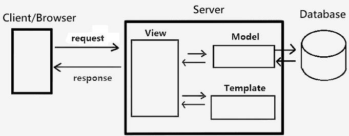

# Django

## Contents

 - **Django Basics:**
   - [Django Architecture ( Model-Template-View | MTV )](#django-architecture)
   - [Projects vs. apps](#project-x-app)
   - [Django Structure](#django-structure)
 - **Django Admin:**
   - `python manage.py createsuperuser` (http://localhost:8000/admin)
   - [Add your models to the Django Admin](#add-your-models-to-the-django-admin)
 - [**Migrations:**](#intro-to-migrations)
   - [`python manage.py makemigrations <app_name>`](#intro-to-makemigrations)
   - [`python manage.py migrate <app_name>`](#intro-to-migrate)
   - [Specifying the database](#specifying-the-database)
 - **Model-Template-View (MTV):**
   - [**Model:**](#intro-to-models)
     - [Creating Models for an App](#creating-models)
   - [**Template:**](#intro-to-templates)
     - [Creating Templates for your App](#creating-templates-for-your-app)
   - [**View:**](#intro-to-views)
 - **Project & App Settings:**
   - [How add an App to the Project](#how-add-an-app-to-the-project)
 - **Commands:**
   - `django-admin startproject <ProjectName>`
   - `python manage.py runserver (You can specify a port number here)`
   - `python manage.py startapp <AppName>`
 - **Code Snippet:**
   - **Model:**
   - **Template:**
   - **View:**
   - **Tests:**
   - **Database:**
 - [**Settings**](#settings)
 - [**References**](#ref)
<!--- 
[WHITESPACE RULES]
- Same topic = "10" Whitespace character.
- Different topic = "50" Whitespace character.
--->


<!--- ( Django Basics ) --->

---

<div id="django-architecture"></div>

## Django Architecture ( Model-Template-View | MTV )

> **Django** is a Web Framework that is built on the **Model-Template-View (MTV)** pattern.

For example, see the examples below to understand more easily:

**Example-01:**
  

 - **Model:**
   - The *model* is responsible for `storing` and `retrieving` data from a database.
   - It also contains the business logic for the application, such as validation and relationships between data.
   - **When to use:** The model is used to manage and manipulate data. It is responsible for handling the data-related tasks, such as fetching data from a database, processing it, and updating it.
 - **Template:**
   - The *template* is `responsible for rendering the user interface of the application`.
   - It uses *HTML*, *CSS*, and *JavaScript* to create the pages that users see.
   - **When to use:** Templates are used for rendering and displaying information to the user. They take the data provided by the model and format it in a way that is suitable for presentation.
 - **View:**
   - The *view* is `responsible for handling user requests` and `rendering the appropriate template`.
   - It also communicates with the model to retrieve data.
   - **When to use:** Views are used to present the user interface and handle user input. They interact with the model to fetch and display data, and they also capture user actions and pass them to the controller for further processing.

---

<div id="project-x-app"></div>

## Projects vs. apps

The difference between **a project** and **an app** is:

 - **A project** is a `collection of configuration` and `apps` for a particular website:
   - `A project can contain multiple apps.`
 - **An app** is a web application that *"does something"*:
   - A blog system;
   - A database of public records;
   - A small poll app...
   - `An app can be in multiple projects.`

---

<div id="django-structure"></div>

## Django Structure

After you create a Django project you will have the following structure:

```bash
django-admin startproject <ProjectName>
```

```bash
├─── .<ProjectName>
│    ├── <ProjectName>
│    |      ├── __init__.py
│    |      ├── asgi.py
│    |      ├── settings.py
│    |      ├── urls.py
│    |      ├── wsgi.py
│    ├── manage.py
│    ├── <AppName>
│    |      ├── /migrations
│    |      |      ├── __init__.py
│    |      ├── __init__.py
│    |      ├── admin.py
│    |      ├── apps.py
│    |      ├── models.py
│    |      ├── tests.py
│    |      ├── views.py
```

Where:

 - `.<ProjectName>` Root folder.
   - `<ProjectName>` Project setting files.
     - `__init__.py`
     - `asgi.py` ASGI server settings.
     - `settings.py` All settings for the project:
       - Define templates sources.
       - Apps installed.
       - Project secret key.
     - `urls.py` Project URLs:
       - www.example.com/blog
       - www.example.com/admin
     - `wsgi.py` WSGI server settings.
   - `manage.py` File to manage the project.
     - `python manage.py runserver`.
   - `<AppName>` Project apps (E.g. /site, /store, etc).
     - `/migrations` Manage changes to the Database.
       - `__init__.py`
     - `/templates` Project/App frontend files.
       - `__init__.py`
       - HTML, CSS, and JavaScript files.
     - `__init__.py`
     - `admin.py`
     - `apps.py`
     - `models.py` Here you will create things that you will store in your Database:
       - For example, database tables.
     - `tests.py`
     - `views.py` Represents your App's logic:
       - When the use click on the `/blog` URL what happens?
       - When the user clicks on the `/admin` URL what happens?
       - Link the views to the templates.


<!--- ( Django Admin ) --->

---

<div id="add-your-models-to-the-django-admin"></div>

## Add your models to the Django Admin

> For your models to appear in the Django Admin, you must first add them to the `your-app/admin.py` file:

But, first let's create classes to represent your models:

```python
# blog/admin.py

from django.contrib import admin
from blog.models import Category, Comment, Post


class CategoryAdmin(admin.ModelAdmin):
    pass


class PostAdmin(admin.ModelAdmin):
    pass


class CommentAdmin(admin.ModelAdmin):
    pass
```

Now, let's link these classes with our models and **"register"** them:

```python
admin.site.register(Category, CategoryAdmin)
admin.site.register(Post, PostAdmin)
admin.site.register(Comment, CommentAdmin)
```

 - Now, if you open the admin page, you should see your models listed.
 - If you click on *Posts*, you can add new posts for the blog manually.


<!--- ( Migrations ) --->

---

<div id="intro-to-migrations"></div>

## Migrations

> Migrations in Django are a way to **"manage"** and **"version control"** database schema changes over time.

 - **They allow you to evolve your database schema such as:**
   - Creating.
   - Modifying.
   - Deleting tables and columns.
 - **Objectives of Migrations:**
   - **Track Changes to Models:** Migrations record changes made to Django models, enabling these changes to be applied to the database.
   - **Version Control for the Database:** Similar to code version control, migrations allow you to have a history of database changes and the ability to roll forward and backward through these changes.
   - **Automate Database Changes:** Instead of writing SQL scripts manually, migrations let you define changes in Python models, and Django automatically generates and applies the necessary SQL statements.
 - **How Migrations Work:**
   - **Creating Migrations:** When you make changes to your models, you use the `makemigrations` command to create migration files that describe those changes.
   - **Applying Migrations:** The `migrate` command is used to apply these changes to the database, synchronizing the database schema with your model definitions.

Some useful migrations commands are:

```bash
# "makemigrations": Creates migration files based on the changes to your models.
python manage.py makemigrations


# "migrate": Applies pending migrations to the database.
python manage.py migrate


# "showmigrations": Displays all available migrations and their status (applied or not).
python manage.py showmigrations


# sqlmigrate: Shows the SQL that will be executed for a specific migration.
python manage.py sqlmigrate app_name migration_number
```

---

<div id="intro-to-makemigrations"></div>

## `python manage.py makemigrations <app_name>`

The **"makemigrations"** creates migration files based on the changes in your models.

**USE CASE:**  

 - Use this command after making changes to your models. It creates migration files that describe the changes.
 - The makemigrations command analyzes whether changes have been made to the models and, if so, creates new migrations (Migrations) to change the structure of your database, reflecting the changes made.

```bash
python manage.py makemigrations blog


Migrations for 'blog':
  blog/migrations/0001_initial.py
    - Create model Category
    - Create model Post
    - Create model Comment
```

If you look in the *"migrations"* folder in the *"blog app"*, you'll see that the migration has been created.

**0001_initial.py**  
```bash
# Generated by Django 5.0.1 on 2024-06-02 04:06

import django.db.models.deletion
from django.db import migrations, models


class Migration(migrations.Migration):

    initial = True

    dependencies = [
    ]

    operations = [
        migrations.CreateModel(
            name='Category',
            fields=[
                ('id', models.BigAutoField(auto_created=True, primary_key=True, serialize=False, verbose_name='ID')),
                ('name', models.CharField(max_length=30)),
            ],
        ),
        migrations.CreateModel(
            name='Post',
            fields=[
                ('id', models.BigAutoField(auto_created=True, primary_key=True, serialize=False, verbose_name='ID')),
                ('title', models.CharField(max_length=255)),
                ('body', models.TextField()),
                ('created_date', models.DateTimeField(auto_now_add=True)),
                ('last_modified', models.DateTimeField(auto_now=True)),
                ('categories', models.ManyToManyField(related_name='posts', to='blog.category')),
            ],
        ),
        migrations.CreateModel(
            name='Comment',
            fields=[
                ('id', models.BigAutoField(auto_created=True, primary_key=True, serialize=False, verbose_name='ID')),
                ('author', models.CharField(max_length=60)),
                ('body', models.TextField()),
                ('created_date', models.DateTimeField(auto_now_add=True)),
                ('post', models.ForeignKey(on_delete=django.db.models.deletion.CASCADE, to='blog.post')),
            ],
        ),
    ]
```

**0001_initial.py:**  
This file contains the instructions that Django should perform on the database.

---

<div id="intro-to-migrate"></div>

## `python manage.py migrate <app_name>`

> The **"migrate"** command applies the changes in the migration files (created with the makemigrations command) to the database.

**USE CASE:**

 - Use this command to apply the migrations to your database, updating its schema to match your models.

```bash
python manage.py migrate blog


Operations to perform:
  Apply all migrations: blog
Running migrations:
  Applying blog.0001_initial... OK
```

---

<div id="specifying-the-database"></div>

## Specifying the database

To specify the database we need to open the `settings.py` file in the project folder and find the **"DATABASES key"**:

```python
DATABASES = {
    'default': {
        'ENGINE': 'django.db.backends.sqlite3',
        'NAME': BASE_DIR / 'db.sqlite3',
    }
}
```

> ***NOTE:**  
> By default, Django uses the **"sqlite3"** database.

Now, let's see how to add other databases:

```python
DATABASES = {
    'default': {
        'ENGINE': 'django.db.backends.sqlite3',
        'NAME': BASE_DIR / 'db.sqlite3',
    },
    'mysql_db': {
        'ENGINE': 'django.db.backends.mysql',
        'NAME': 'blog_db',
        'USER': 'root',
        'PASSWORD': 'toor',
        'HOST': 'localhost',
        'PORT': '3310',
    },
    'postgresql_db': {
        'ENGINE': 'django.db.backends.postgresql',
        'NAME': 'blog_db',
        'USER': 'postgres',
        'PASSWORD': 'toor',
        'HOST': 'localhost',
        'PORT': '5432',
    }
}
```

See that:

 - We have a default database: **sqlite3**.
 - Setting to use another databases: **"mysql_db"** and **"postgresql_db"**.

**NOTE:**  
To apply migrations to a specific database you need to run the following command:

```bash
# MySQL.
python manage.py migrate --database=mysql_db

# PostgreSQL.
python manage.py migrate --database=postgresql_db
```


<!--- ( Model-Template-View (MTV)/Model ) --->

---

<div id="intro-to-models"></div>

## Model

 - **Definition:**
   - Models are Python classes that define the structure of your database.
   - They represent the data and the logic (methods) for accessing and manipulating that data.
 - **Purpose:**
   - Define database schema.
   - Define relationships between different data entities.
   - Provide an abstraction layer for database operations.

**EXAMPLE:**
```python
from django.db import models

class Author(models.Model):
    name = models.CharField(max_length=100)
    birth_date = models.DateField()
    email = models.EmailField()

    def __str__(self):
        return self.name
```

In this example:

 - Author is a model with three fields:
   - *"name"*, *"birth_date"*, and *"email"*.
 - Each field is represented by a field class (e.g., CharField, DateField, EmailField) that specifies the type of data it holds.

---

<div id="creating-models"></div>

## Creating Models for an App

> To create models in an app, we need to add them to the `models.py` file.

For example, imagine we need to map tables to the following classes:

 - Post
 - Category
 - Comment

```python
# blog/models.py

from django.db import models


class Category(models.Model):
    name = models.CharField(max_length=30)


class Post(models.Model):
    title = models.CharField(max_length=255)
    body = models.TextField()
    # "auto_now_add=True", Automatically set the
    # field to now when the object is first created.
    created_date = models.DateTimeField(auto_now_add=True)
    # "auto_now=True", Automatically set the field
    # to now every time the object is saved.
    last_modified = models.DateTimeField(auto_now=True)
    categories = models.ManyToManyField("Category", related_name="posts")


class Comment(models.Model):
    author = models.CharField(max_length=60)
    body = models.TextField()
    # "auto_now_add=True", Automatically set the
    # field to now when the object is first created.
    created_date = models.DateTimeField(auto_now_add=True)
    post = models.ForeignKey("Post", on_delete=models.CASCADE)
```


<!--- ( Model-Template-View (MTV)/Template ) --->

---

<div id="intro-to-templates"></div>

## Template

> **Templates** are HTML files with the capability of rendering dynamic content sent over from your Django *views*.

 - **Definition:**
   - Templates are files that define the structure and layout of your website's pages.
   - They contain HTML and Django template language to dynamically generate content.
 - **Purpose:**
   - Separate the presentation layer from the business logic.
   - Define how data should be displayed to the user.
   - Allow reuse of HTML structures.

**EXAMPLE:**
```html
<!DOCTYPE html>
<html>
<head>
    <title>{{ author.name }}</title>
</head>
<body>
    <h1>{{ author.name }}</h1>
    <p>Born: {{ author.birth_date }}</p>
    <p>Email: {{ author.email }}</p>
</body>
</html>
```

In this example:

 - `{{ author.name }}`, `{{ author.birth_date }}`, and `{{ author.email }}` are template tags that will be replaced with the actual data passed from the view.

---

<div id="creating-templates-for-your-app"></div>

## Creating Templates for your App

To create Templates for our app, we need to manually add them to the `templates` directory at the same App level (directory).

For example, first, let's create the `template` folder at the same App level (directory):

```bash
mkdir templates && cd templates
```

Now, let's create some templates:

```bash
touch index.html
```

Now, let's code the `index.html` template to show user posts:

**index.html**
```html
Coming soon...
```


<!--- ( Model-Template-View (MTV)/View ) --->

---

<div id="intro-to-views"></div>

## View

> A **View** in Django is a collection of *functions* or *classes* inside the `views.py` file in an app’s directory. Each function or class handles the logic that gets processed each time your user visits a different URL.

 - **Definition:**
   - Views are Python functions or classes that handle requests and return responses.
   - They connect the model and the template, processing data and determining which template to render.
 - **Purpose:**
   - Handle user requests and return appropriate responses.
   - Fetch data from the database using models.
   - Render templates with the fetched data.

**EXAMPLE:**
```python
from django.shortcuts import render
from .models import Author

def author_detail(request, author_id):
    author = Author.objects.get(pk=author_id)
    return render(request, 'author_detail.html', {'author': author})
```

In this example:

 - `author_detail` is a view function that retrieves an Author object based on `author_id`.
 - It then renders the `author_detail.html` template, passing the author object as context.


<!--- ( Project & App Settings ) --->

---

<div id="how-add-an-app-to-the-project"></div>

## How add an App to the Project

> After install (create) an App we need to install (register) this App in our project. To do this, we need to add it in our `settings.py` file.

For example, imagine we create the `blog` App:

```bash
django-admin startapp blog
```

Now, let's add the new app to the project:

```python
# personal_blog/settings.py

# ...

INSTALLED_APPS = [
    "blog.apps.BlogConfig", # <--- App added here.
    "django.contrib.admin",
    "django.contrib.auth",
    "django.contrib.contenttypes",
    "django.contrib.sessions",
    "django.contrib.messages",
    "django.contrib.staticfiles",
]

# ...
```

You can check the app settings on the `apps.py` file inside the app folder:

```python
from django.apps import AppConfig


class BlogConfig(AppConfig):
    default_auto_field = 'django.db.models.BigAutoField'
    name = 'blog'
```


<!--- ( Settings ) --->

---

<div id="settings"></div>

## Settings

**CREATE VIRTUAL ENVIRONMENT:**  
```bash
python -m venv django-environment
```

**ACTIVATE THE VIRTUAL ENVIRONMENT (WINDOWS):**  
```bash
source django-environment/Scripts/activate
```

**ACTIVATE THE VIRTUAL ENVIRONMENT (LINUX):**  
```bash
source django-environment/bin/activate
```

**UPDATE PIP:**
```bash
python -m pip install --upgrade pip
```

**INSTALL PYTHON DEPENDENCIES:**  
```bash
pip install -U -v --require-virtualenv -r requirements.txt
```

**Now, Be Happy!!!** 😬


<!--- ( References ) --->

---

<div id="ref"></div>

## References

 - **General:**
   - [Python Documentation](https://docs.djangoproject.com/)
   - [Google Gemini](https://gemini.google.com/app)
   - [ChatGPT](https://chatgpt.com/)
   - [Estrutura Básica de um Projeto em Django](https://www.youtube.com/watch?v=4u0aI-90KnU)
 - **Tutorials:**
   - [Build a Blog From Scratch With Django](https://realpython.com/build-a-blog-from-scratch-django/)
   - [Dev Fullstack Cloud](https://www.youtube.com/playlist?list=PLsA_kcShOU63R5AWqD4Apn78ePPbpncv4)

---

**Rodrigo** **L**eite da **S**ilva
