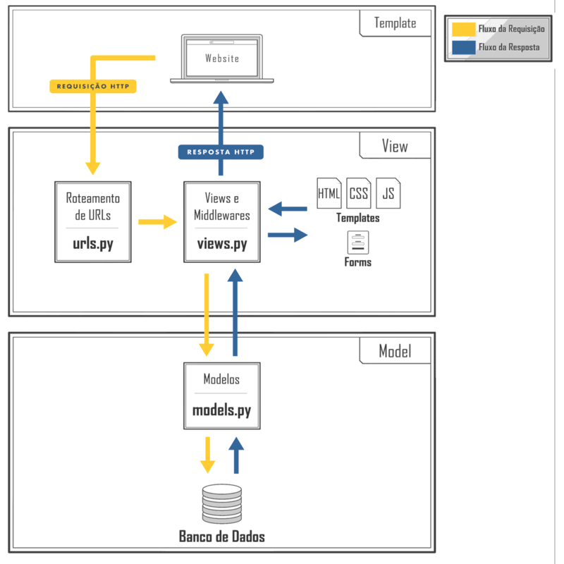

> **NOTE:**  
> All notes here are in Portuguese (Brazilian).

O que eu aprendi no **Pythonando (PSW 11)**.

 - **Implementação:**
   - [`Como definir uma Rota/URL no Django`](#define-django-url)
   - [`Como adicionar os "templates" no settings.py`](#templates-to-settings)
   - [`Como definir um HTML base para o projeto (base.html)`](#creating-template-base)
   - [`Como usar (relacionar/mapear) um template base em um template filho`](#creating-signup-page)
   - [`Como configurar os arquivos estáticos em settings.py`](#configuring-static-files)
   - [`Como criar um arquivo base.css e adicionar no base.html`](#creating-base-css)
   - [`Como adicionar um CSS específico (users.css) em um bloco head`](#creating-users-css)
   - [`Como mapear um formulário no django`](#django-mapping-forms)
 - **Teoria:**
   - [`Arquitetura do Django (MVT | Model-View-Template)`](#django-architecture)
   - [`Arquivos Estáticos vs. Média`](#static-vs-media)
 - [**Settings**](#settings)
<!--- 
[WHITESPACE RULES]
- Same topic = "10" Whitespace character.
- Different topic = "50" Whitespace character.
--->


<!--- ( Implementação ) --->

---

<div id="define-django-url"></div>

## `Como definir uma Rota/URL no Django`

Para definir uma nova Rota/URL devemos registrar a mesma em `urls.py`:

```python
# core/urls.py

from django.contrib import admin
from django.urls import path, include

urlpatterns = [
    path("admin/", admin.site.urls),
    path("users/", include("users.urls")),
]
```

No exemplo acima:

 - `urlpatterns = []`
   - Uma lista Python contendo todas as Rota/URLs.
 - `path`
   - É a função responsável por definir a *Rota/URL*.
 - `path("users/", ...),`
   - Essa primeira parte diz que estou definindo uma Rota/URL que vai ser acessada pelo nome *"users/"*.
 - `path(..., include("users.urls")),`
   - Por fim, nós estamos utilizando a função `include("users.urls")` para dizer que sempre que for chamado a Rota/URL `users/`:
     - Será procurado outras Rotas/URL;
     - Dentro do meu App *"users"*;
     - Dentro de um arquivo chamado `urls`.

> **Onde está esse arquivo?**  
> Se o seu App ainda não tiver um arquivo chamado `urls.py`, você pode criar um.

```python
# users/urls.py

from django.urls import path
from . import views

urlpatterns = [
    path("register/", views.register, name="register"),
]
```

No exemplo acima nós:

 - `register/`
   - Define uma rota/URL "register".
 - `views.register`
   - Sempre que a Rota/URL `register/` for acessada, será executada esta função `register` do arquivo `views.py`.
   - **NOTE:** Ainda vamos implementar essa função.
 - `name="register"`
   - Nome da Rota/URL.

**NOTE:**  
Vamos implementar a função `register` em `views.py` apenas para exibir um "Hello World!" na tela (Vai ser só um exemplo):

```python
# users/views.py

from django.http import HttpResponse

def register(request):
    return HttpResponse("Hello World!")
```

Agora para testar precisamos abrir a URL: [http://127.0.0.1:8000/users/register/](http://127.0.0.1:8000/users/register/)

```bash
/users/register/
  ^       ^
  |       |  # users/urls.py
  |       |  path("register/", views.register, name="register"),
  |       ------------^
  |
  |  # core/urls.py
  |  path("users/", include("users.urls")),
  -----------^
```


---

<div id="templates-to-settings"></div>

## `Como adicionar os "templates" no settings.py`

> **Templates nada mais são do que HTML's que vão ser exibidos na tela.**

Vocês concordam então que nós podemos ter:

 - Templates do projeto (Por exemplo, core).
 - Templa de cada App (Por exemplo, users).

Sabendo disso nós vamos criar 2 diretórios templates:

```bash
├─── /
│    ├── /templates
│    ├── /users
│    |      ├── /templates
```

> **NOTE:**  
> Para que nosso projeto Django saiba encontrar esse templates, primeiro precisamos defini-los em `settings.py`.

Mas antes vamos analisar algumas partes importantes de `settings.py`:

```python
# core/settings.py

BASE_DIR = Path(__file__).resolve().parent.parent

TEMPLATES = [
  {
      'DIRS': [],
      'APP_DIRS': True,
  }
]
```

 - `BASE_DIR = Path(__file__).resolve().parent.parent`
   - A constante `BASE_DIR` contém o diretório raiz do nosso projeto independente do Sistema Operacional (Windows, Linux, MacOS).
 - `'DIRS': [],`
   - Define os diretórios que serão procurados para encontrar os templates.
 - `'APP_DIRS': True,`
   - Define se o Django também deve procurar templates nos Apps.

**NOTE:**  
Mas veja que o nosso `'DIRS': []` não tem nada definido ainda. Para isso nós precisamos concatenar o nosso diretórios raiz do projeto ('BASE_DIR') e o nosso diretório de templates ('templates'):

```python
import os

TEMPLATES = [
  {
      'DIRS': [os.path.join(BASE_DIR, "templates")],
      'APP_DIRS': True,
  }
]
```

> **NOTE:**  
> O módulo `os.path.join` concatena dois diretórios e é mais recomendado porque independente do Sistema Operacional (Windows, Linux, MacOS), o Python vai concatenar os diretórios corretamente.


---

<div id="creating-template-base"></div>

## `Como definir um HTML base para o projeto (base.html)`

É comum em uma aplicação web nós termos coisas que se repetem em várias página. Por exemplo:

 - Background.
 - Fontes.
 - Cores...

> **NOTE:**  
> Para resolver isso o django tem os **"Arquivos de Base"**.

Vamos criar um arquivo chamado `templates/base.html` (Nos templates de todo o projeto, não do App):

```html
<!--- { templates/base.html } --->

<!doctype html>
<html lang="en">
    <head>
        <meta charset="utf-8">
        <meta name="viewport" content="width=device-width, initial-scale=1">
        <title></title>
        <link href="https://cdn.jsdelivr.net/npm/bootstrap@5.3.3/dist/css/bootstrap.min.css" rel="stylesheet">
        
    </head>
    <body>
        
        <script src="https://cdn.jsdelivr.net/npm/bootstrap@5.3.3/dist/js/bootstrap.bundle.min.js"></script>
    </body>
</html>
```

 - Agora eu posso utilizar esses códigos base em outros templates:
   - Para utilizar esse código base em outros templates é só utilizar o `extend (heranças)` para dizer que o templete vai herdar o template base: ``
   - **NOTE:** Agora o template que extender (herdar) o template base (base.html), exibirá o conteúdo do template base.
 - ``, ``, ``:
   - Esses blocos não tem nada escrito, mas se tivesse seria exibido no template filho (que extendeu/herdou o template base).
   - **NOTE:** Outra observação é que você pode reescrever esse bloco no template filho ele será exibido no template base:
     - Ou seja, esse bloco está mapeado/relacionado entre os templates pai e filho.


---

<div id="creating-signup-page"></div>

## `Como usar (relacionar/mapear) um template base em um template filho`

> Lembram que nós podemos extender (herdar) o template base (base.html) para outros templates (filhos)?

Então, vamos extender (herdar) o template base (base.html) para criar uma tela de registro (Signup) para o App "users":

```html
<!--- ( users/templates/register.html ) --->










    <div class="container-fluid">
        <div class="row">
            <div class="col-md-2 d-flex justify-content-center bg-img ">
            </div>
            <div class="col-md-10 d-flex justify-content-center bg-color-dark form-auth">
                <div class="container-form">
                    <h1 class="text-logo">START.SE</h1>
                    <h1>Sign up</h1>
                    <br>
                    <form action="#" >
                        <label>Username</label>
                        <input type="text" class="form-control input-pers" name="username" placeholder="Enter your username">
                        <br>
                        <label>Senha</label>
                        <input type="password" class="form-control input-pers" name="senha" placeholder="Enter your password">
                        <br>
                        <label>Confirmar senha</label>
                        <input type="password" class="form-control input-pers" name="confirmar_senha" placeholder="Confirm your password">
                        <div class="centralizar">
                            <input type="submit" class="btn btn-indigo" value="Cadastrar">
                            <a href="#" class="texto">I already have an account</a>
                        </div>
                    </form>
                </div>
            </div>
            
        </div>
    </div>

```

**NOTE:**  
Vejam que nós extendermos (herdamos) do template base e reescrevemos os blocos `` e ``, inserindo novos conteúdos.


---

<div id="configuring-static-files"></div>

## `Como configurar os arquivos estáticos em settings.py`

Para dizer onde estão os arquivos estáticos da nossa Aplicação, vamos adicionar o caminho dos arquivos estáticos em `core/settings.py`:

```python
# core/settings.py

STATIC_URL = '/static/'
STATICFILES_DIRS = (os.path.join(BASE_DIR, 'templates/static'),)
STATIC_ROOT = os.path.join('static')

MEDIA_ROOT = os.path.join(BASE_DIR, 'media')
MEDIA_URL = '/media/'
```

Vejam que:

 - Nós temos várias constantes.
 - Essas constantes representam caminhos para diretórios.
 - Dentro do diretório `core/templates (raiz do projeto)` nós temos o diretório para os arquivos estáticos.

> **NOTE:**  
> É recomendado criar uma pasta dentro de `/static` para cada *App* e uma `/general` para toda a aplicação.

**Example:**  
```bash
├─── /
│    ├── /templates
│    |      ├── /static
│    |      |      ├── /general
│    |      |      |      ├── /css
│    |      |      |      ├── /images
│    |      |      ├── /users
│    |      |      |      ├── /css
│    |      |      |      ├── /images
```


---

<div id="creating-base-css"></div>

## `Como criar um arquivo base.css e adicionar no base.html`

> Lembram que nós temos um `base.html` para toda a aplicação?

Então, é interessante também ter um arquivo `base.css` para todo o projeto, com regras de *CSS* gerais (comum) para todo o projeto.


```css
/* core/templates/static/general/css/base.css */

:root{
    --main-color: #161424;
    --dark-color: #0D0C16;
    --contrast-color: #4F46E5;
}

body{
    color: white !important;
    background-color: var(--main-color) !important;
}

.bg-color-dark{
    background-color: var(--main-color);
}

.p-bold{
    font-weight: bold;
}

.color-dark{
    color: var(--dark-color);
}

.dark-color{
    background-color: var(--dark-color);
    color: white !important;
}

.centralizar{
    text-align: center;
}

::-webkit-input-placeholder {
    color: rgb(196, 196, 196) !important;
}

:-moz-placeholder { /* Firefox 18- */
    color: rgb(196, 196, 196) !important;  
}

::-moz-placeholder {  /* Firefox 19+ */
    color: rgb(196, 196, 196) !important;  
}

:-ms-input-placeholder {  
    color: rgb(196, 196, 196) !important;  
}
```

Agora basta dizer que o nosso `base.html` vai utilizar o nosso *CSS* `base.css`:

```html
<!--- { templates/base.html } --->


<!doctype html>
<html lang="en">
    <head>
        <meta charset="utf-8">
        <meta name="viewport" content="width=device-width, initial-scale=1">
        <link rel="stylesheet" href="">
        <title></title>
        <link href="https://cdn.jsdelivr.net/npm/bootstrap@5.3.3/dist/css/bootstrap.min.css" rel="stylesheet">
        
    </head>
    <body>
        
        <script src="https://cdn.jsdelivr.net/npm/bootstrap@5.3.3/dist/js/bootstrap.bundle.min.js"></script>
    </body>
</html>
```

> **NOTE:**  
> Vejam que nós demos um load na tag `` no início do HTML.


---

<div id="creating-users-css"></div>

## `Como adicionar um CSS específico (users.css) em um bloco head`

Imagine que nós temos o seguinte CSS do nosso App `users`:

```css
/* core/templates/static/users/css/users.css */

.bg-img{
    background-image: url('');
    height: 100vh;
    background-size: cover;
}

.form-auth{
    padding: 50px;
}

.text-logo{
    color: rgb(161, 161, 161);
    font-weight: 100;
}

.container-form{
    width: 35%;
    margin-top: 4em;
    
}

.input-pers{
    margin-top: 5px;
    background-color: transparent !important;
    font-size: 18px;
    color: white !important;
}

.btn-indigo{
    background-color: var(--contrast-color);
    color: white;
    width: 100%;
    margin-top: 20px;
    font-size: 20px;
}

.btn-indigo-normal{

    background-color: var(--contrast-color);
    color: white;

}

.btn-indigo:hover{
    background-color: #332cb6;
}

.centralizar{
    text-align: center;
}

.texto{
    color: white;
    text-decoration: none;
}
```

Para dizer que o nosso `register.html` vai utilizar o nosso *CSS* `users.css`:

```html
<!--- { users/templates/register.html } --->




    <link rel="stylesheet" href="">

```

> **NOTE:**  
> Veja que nós estamos importando o nosso CSS dentro do bloco `head`.


---

<div id="django-mapping-forms"></div>

## `Como mapear um formulário no django`

Para entender como mapear um formulário no Django, primeiro imagine que temos o seguinte formulário:

```html
<!--- { users/templates/register.html } --->

<form action="" method="POST">
    <label>Username</label>
    <input type="text" class="form-control input-pers" name="username" placeholder="Enter your username">
    <br>
    <label>Senha</label>
    <input type="password" class="form-control input-pers" name="password" placeholder="Enter your password">
    <br>
    <label>Confirmar senha</label>
    <input type="password" class="form-control input-pers" name="confirm_password" placeholder="Confirm your password">
    <div class="centralizar">
        <input type="submit" class="btn btn-indigo" value="Cadastrar">
        <a href="#" class="texto">I already have an account</a>
    </div>
</form>
```

 - ``
   - Isso é referente ao `nome (name="register")` da URL que nós definimos em `urls.py`.
   - `path("register/", views.register, name="register"),`
 - `method="POST"`
   - Isso é referente ao *metodo (POST) HTTP* que o formulário vai utilizar.
 - ``
   - Essa tag do django é uma tag de segurança contra falsificação de formulários.
 - `name="username"`, `name="password"`, `name="confirm_password"`
   - Esses são os nomes dos campos no formulário que podem ser utilizados nas views para encontrar as entradas.
     - `username = request.POST.get("username")`
     - `password = request.POST.get("password")`
     - `confirm_password = request.POST.get("confirm_password")`

Ótimo, já temos o formulário, agora vamos criar um método em `views.py` que vai receber o formulário e vai realizar o cadastro de usuário no Banco de Dados (SQLite no caso):

```python
# users/views.py


from django.shortcuts import redirect, render
from django.contrib.auth.models import User


def register(request):
    if request.method == "GET":
        return render(request, "register.html")
    elif request.method == "POST":

        username = request.POST.get("username")
        password = request.POST.get("password")
        confirm_password = request.POST.get("confirm_password")

        if not password == confirm_password:
            print("Passwords do not match.")
            return redirect("/users/register")

        if len(password) < 6:
            print("Password too short.")
            return redirect("/users/register")

        users = User.objects.filter(username=username)
        if users:
            print("User already exists.")
            return redirect("/users/register")

        user = User.objects.create_user(
            username=username,
            password=password,
        )

        return redirect("/users/login")
```

Agora vamos explicar as partes mais importantes do código acima:


```python
if request.method == "GET":
    return render(request, "register.html")
elif request.method == "POST":
    ....
```

Aqui é o seguinte:

 - Se a requisição for `GET`, ou seja, o usuário estiver tentando acessar a página de cadastro, nós vamos renderizar (render) a tela de cadastro `(register.html)`.
 - Se a requisição for `POST`, ou seja, o usuário estiver tentando realizar o cadastro, nós vamos realizar o cadastro:
   - **NOTE:** Esse procesos de cadastro vai ser explicado abaixo.

```python
username = request.POST.get("username")
password = request.POST.get("password")
confirm_password = request.POST.get("confirm_password")
```

Aqui nós estamos utilizando `request.POST.get()` para pegar valores específicos (name) de cada campo do formulário.

```python
if not password == confirm_password:
    print("passwords do not match.")
    return redirect("/users/register")
```

Se o `password` e o `confirm_password` não forem iguais (not) o usuário será redirecionado (redirect) para a tela (Rota/URL) de cadastro novamente.

```python
if len(password) < 6:
    print("password too short.")
    return redirect("/users/register")
```

Se o `password` for muito curto `(password < 6)` o usuário será redirecionado (redirect) para a tela (Rota/URL) de cadastro novamente.

```python
users = User.objects.filter(username=username)
if users:
    print("User already exists.")
    return redirect("/users/register")
```

 - Nessa parte nós estamos utilizando o método filter() para verificar se o usuário existe no Banco de Dados.
 - Se o usuario existir, o usuário será redirecionado (redirect) para a tela (Rota/URL) de cadastro novamente.

```python
from django.contrib.auth.models import User


# ......


user = User.objects.create_user(
    username=username,
    password=password,
)
```

Aqui nós estamos adicionando um novo usuário no Banco de Dados SQLite.

```python
return redirect("/users/login")
```

Por fim, se tudo ocorreu bem, o usuário será redirecionado (redirect) para a tela (Rota/URL) de login.


<!--- ( Teoria ) --->

---

<div id="django-architecture"></div>

## `Arquitetura do Django (MVT | Model-View-Template)`

> O django utiliza a **Arquitetura MVT (Model-View-Template)**.

Onde:

 - **Model:**
   - Tudo o que for relacionado a Banco de Dados.
 - **View:**
   - É onde fica a lógica da nossa Aplicação.
   - Por exemplo, são as funções Python que vão receber uma requisição (request) e devolver uma resposta (response).
 - **Template:**
   - São os nossos arquivos HTML que vão ser exibidos para o usuário.

Por exemplo, veja a imagem abaixo:

  

Vejam que:

 - **Eu tenho o meu Cliente:**
   - No caso meu Navegador (Browser).
   - Que faz uma requisão (request) HTTP.
 - **Essa requisição (resquest) HTTP vai para `url.py` do projeto (core):**
   - Ele vai verificar se existe a Rota/URl chamada.
 - **Se a Rota/URL existir nós chamamos uma funcionalidade (view):**
   - Processamos o que tem que ser feito e retornamos uma resposta (response) HTTP.


---

<div id="static-vs-media"></div>

## `Arquivos Estáticos vs. Média`

 - **Estáticos (Static):**
   - Arquivos estáticos são os arquivos que não colocamos dentro do código para serem utilizados.
   - Exemplo: CSS, Imagens, Logo...
 - **Média (Media):**
   - Os arquivos de média são os arquivos que os usuários da aplicação fazem Upload para a sua aplicação.
   - Exemplo: Vídeos do Youtube (Os usuários que colocam os vídeos), Imagens do Instagram.


<!--- ( Settings ) --->

---

<div id="settings"></div>

## Settings

**CREATE VIRTUAL ENVIRONMENT:**  
```bash
python -m venv environment
```

**ACTIVATE THE VIRTUAL ENVIRONMENT (WINDOWS):**  
```bash
source environment/Scripts/activate
```

**ACTIVATE THE VIRTUAL ENVIRONMENT (LINUX):**  
```bash
source environment/bin/activate
```

**UPDATE PIP:**
```bash
python -m pip install --upgrade pip
```

**INSTALL PYTHON DEPENDENCIES:**  
```bash
pip install -U -v --require-virtualenv -r requirements.txt
```

**Now, Be Happy!!!** 😬

---

**Rodrigo** **L**eite da **S**ilva
