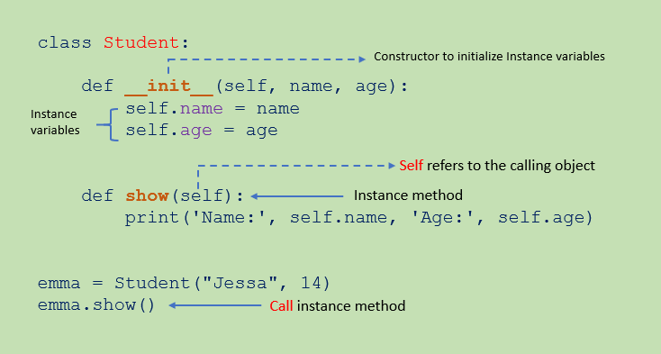

# Object-Oriented Programming (OOP)

## Contents

 - **Classes and Objects:**
   - [Class Attributes:](#class-attributes)
     - [Instance variables](#instance-variables)
     - [Class Variables](#class-variables)
     - [Getting the attribute value with gettatr() method](#gettatr-ex01)
   - [Class Methods:](#class-methods)
     - [Instance method](#instance-method)
     - [Class method](#class-method)
       - [Access Class Variables with Class Methods](#access-clas-variables)
     - [Static method](#static-method)
 - **Encapsulation:**
   - [Access Modifiers in Python](#access-modifiers-python)
 - **Inheritance:**
   - [Single inheritance](#s-inheritance)
   - [Multiple Inheritance](#mt-inheritance)
   - [Multilevel inheritance](#mtl-inheritance)
   - [Hierarchical Inheritance](#h-inheritance)
   - [Hybrid Inheritance](#hybrid-inheritance)
   - [super() function](#super-function)
 - [References](#ref)


<!--- ( Classes and Objects ) --->

---

<div id="class-attributes"></div>

## Class Attributes

When we design a class, we use **instance variables** and **class variables**. In Class, attributes can be defined into two parts:

 - **Instance variables:**
   - The instance variables are attributes attached to an instance of a class. We define instance variables in the constructor ( the `__init__()` method of a class).
 - **Class Variables:**
   - A class variable is a variable that is declared inside of class, but outside of any instance method or `__init__()` method.

  

---

<div id="instance-variables"></div>

## Instance variables

 - Instance variables are not shared by objects.
 - Every object has its own copy of the instance attribute.
 - This means that for each object of a class, the instance variable value is different.

For example:


---

<div id="class-variables"></div>

## Class Variables

> In Python, class variables (also known as class attributes) are shared across all instances (objects) of a class.
> - They belong to the class itself, not to any specific instance.

For example:

  

---

<div id="gettatr-ex01"></div>

## Getting the attribute value with gettatr() method

> The **getattr()** method returns the value of the named attribute of an object.

For example:

[getattr.py](src/getattr.py)
```python
class Student:
    # Class variables.
    country = "Brazil"

    def __init__(self, name, age):
        # Instance variables.
        self.name = name
        self.age = age


if __name__ == "__main__":
    stud = Student("Rodrigo", 34)

    stud_name = getattr(stud, "name")
    stud_age = getattr(stud, "age")
    std_country = getattr(stud, "country")

    print("Name:", stud_name)
    print("Age:", stud_age)
    print("Country:", std_country)
```

**OUTPUT:**
```bash
Name: Rodrigo
Age: 34
Country: Brazil
```

**NOTE:**  
See that, with the **getattr()** method we can get the value of the instance or class variable.

---

<div id="class-methods"></div>

## Class Methods

In **Object-oriented programming**, inside a **class**, we can define the following three types of methods:

 - **Instance method:**
   - Used to access or modify the object state.
   - If we use instance variables inside a method, such methods are called instance methods.
 - **Class method:**
   - Used to access or modify the class state.
   - In method implementation, if we use only class variables, then such type of methods we should declare as a class method.
 - **Static method:**
   - It is a general utility method that performs a task in isolation. Inside this method, we don’t use instance or class variable because this static method doesn’t have access to the class attributes.

  

---

<div id="instance-method"></div>

## Instance method

> **If we use instance variables inside a method, such methods are called instance methods.**

 - To work with an instance method, we use the **self** keyword.
 - We use the **self** keyword as the first parameter to a method.
 - The **self** refers to the current object.

For example:

  

> **NOTE:**  
> Any method we create in a class will automatically be created as an instance method unless we explicitly tell Python that it is a *class* or *static method*.

---

<div id="class-method"></div>

## Class method

> Class methods are methods that are called on the class itself, not on a specific object instance. Therefore, it belongs to a class level, and all class instances share a class method.

**Class methods are used when we are dealing with factory methods:**

 - Factory methods are those methods that return a class object for different use cases.
 - Thus, factory methods create concrete implementations of a common interface.

The class method can be called using **ClassName.method_name()** as well as by using an object of the class.

For example:

  

**NOTE:**  
Any method we create in a class will automatically be created as an instance method. We must explicitly tell Python that it is a class method using the **@classmethod decorator** or **classmethod() function**.

<div id="access-clas-variables"></div>

### Access Class Variables with Class Methods

> Using the class method, we can only access or modify the class variables.

Let’s see how to access and modify the class variables with class method:

[class-method-ex01.py](src/class-method-ex01.py)
```python
class Student:
    # Class variable.
    school_name = "ABC School"

    def __init__(self, name, age):
        # Instance variables.
        self.name = name
        self.age = age

    @classmethod
    def change_school(Student_class, school_name):
        """Class method."""
        Student_class.school_name = school_name

    # Instance method.
    def show(self):
        print(self.name, self.age, "School:", Student.school_name)


if __name__ == "__main__":
    jessa = Student("Jessa", 20) # Instance.
    jessa.show()

    # change school_name
    Student.change_school("XYZ School")
    jessa.show()
```

**OUTPUT:**
```bash
Jessa 20 School: ABC School
Jessa 20 School: XYZ School
```

---

<div id="static-method"></div>

## Static method

> **A static method is a general utility method that performs a task in isolation.**

 - A static method is bound (vinculado) to the class and not the object of the class.
   - Therefore, we can call it using the class name.
 - A static method doesn’t have access to the class and instance variables because it does not receive an implicit first argument like **self** and **cls**:
   - Therefore it cannot modify the state of the object or class.

**NOTE:**  
Any method we create in a class will automatically be created as an *instance method*. We must explicitly tell Python that it is a **static method** using the **@staticmethod decorator** or **staticmethod() function**.

For example:

```python
class C:
    @staticmethod
    def f(arg1, arg2, ...): ...
```


<!--- ( Encapsulation ) --->

---

<div id="access-modifiers-python"></div>

## Access Modifiers in Python

> Encapsulation can be achieved by declaring the data members and methods of a class either as **private** or **protected**.

**NOTE:**  
However, Python don’t have direct access modifiers like **public**, **private**, and **protected**. We can achieve this by using single **underscore** and **double underscores**.

Access modifiers limit access to the variables and methods of a class. Python provides three types of access modifiers public, private, and protected.

 - **Public Member:** Accessible anywhere from outside the class.
 - **Private Member:** Accessible within (dentro) the class.
 - **Protected Member:** Accessible within (dentro) the class and its sub-classes.

For example:

  


<!--- ( Inheritance ) --->

---

<div id="s-inheritance"></div>

## Single inheritance

> In **Single Inheritance**, a child class inherits from a single-parent class.

  

For example:

[single-inheritance.py](src/single-inheritance.py)
```python
# Base class.
class Vehicle:
    def Vehicle_info(self):
        print("Inside Vehicle class")


# Child class.
class Car(Vehicle):
    def car_info(self):
        print("Inside Car class")


if __name__ == "__main__":

    # Create object of Car.
    car = Car()

    # Access Vehicle's info using car object
    car.Vehicle_info()
    car.car_info()
```

**OUTPUT:**
```bash
Inside Vehicle class
Inside Car class
```

**NOTE:**  
See that we are using the **Vehicle_info()** method of the parent class *Vehicle* from the (a partir) child class *Car*.

---

<div id="mt-inheritance"></div>

## Multiple Inheritance

> In multiple inheritance, one child class can inherit from multiple parent classes.

  

For example:

[multiple-inheritance.py](src/multiple-inheritance.py)
```python
# Parent class 1.
class Person:
    def person_info(self, name, age):
        print("Inside Person class")
        print("Name:", name, "Age:", age)


# Parent class 2.
class Company:
    def company_info(self, company_name, location):
        print("Inside Company class")
        print("Name:", company_name, "location:", location)


# Child class.
class Employee(Person, Company):
    def Employee_info(self, salary, skill):
        print("Inside Employee class")
        print("Salary:", salary, "Skill:", skill)

if __name__ == "__main__":

    # Create object of Employee.
    emp = Employee()

    # Access data.
    emp.person_info("Jessa", 28)
    emp.company_info("Google", "Atlanta")
    emp.Employee_info(12000, "Machine Learning")
```

**OUTPUT:**
```bash
Name: Jessa Age: 28
Inside Company class
Name: Google location: Atlanta
Inside Employee class
Salary: 12000 Skill: Machine Learning
```

**NOTE:**  
In the above example, we created two parent classes **Person** and **Company** respectively. Then we create one child called **Employee** which inherit from **Person** and **Company** classes.

---

<div id="mtl-inheritance"></div>

## Multilevel inheritance

> In multilevel inheritance, a class inherits from a child class or derived class.

  

For example:

[multilevel-inheritance.py](src/multilevel-inheritance.py)
```python
# Base class.
class Vehicle:
    def Vehicle_info(self):
        print("Inside Vehicle class")


# Child class 1.
class Car(Vehicle):
    def car_info(self):
        print("Inside Car class")


# Child class 2.
class SportsCar(Car):
    def sports_car_info(self):
        print("Inside SportsCar class")

if __name__ == "__main__":

    # Create object of SportsCar.
    s_car = SportsCar()

    # Access Vehicle's and Car info using SportsCar object.
    s_car.Vehicle_info()
    s_car.car_info()
    s_car.sports_car_info()
```

**OUTPUT:**
```bash
Inside Vehicle class
Inside Car class
Inside SportsCar class
```

---

<div id="h-inheritance"></div>

## Hierarchical Inheritance

> In Hierarchical inheritance, more than one child class is derived from a single parent class.

  

For example:

[hierarchical-inheritance.py](src/hierarchical-inheritance.py)
```python
class Vehicle:
    def info(self):
        print("This is Vehicle")


class Car(Vehicle):
    def car_info(self, name):
        print("Car name is:", name)


class Truck(Vehicle):
    def truck_info(self, name):
        print("Truck name is:", name)

if __name__ == "__main__":

    obj1 = Car()
    obj1.info()
    obj1.car_info("BMW")

    obj2 = Truck()
    obj2.info()
    obj2.truck_info("Ford")
```

**OUTPUT:**
```bash
This is Vehicle
Car name is: BMW
This is Vehicle
Truck name is: Ford
```

---

<div id="hybrid-inheritance"></div>

### Hybrid Inheritance

> When inheritance is consists of multiple types or a combination of different inheritance is called hybrid inheritance.

  

For example

[hybrid-inheritance.py](src/hybrid-inheritance.py)
```python
class Vehicle:
    def vehicle_info(self):
        print("Inside Vehicle class")


class Car(Vehicle):
    def car_info(self):
        print("Inside Car class")


class Truck(Vehicle):
    def truck_info(self):
        print("Inside Truck class")


# Sports Car can inherits properties of Vehicle and Car.
class SportsCar(Car, Vehicle):
    def sports_car_info(self):
        print("Inside SportsCar class")

if __name__ == "__main__":

    s_car = SportsCar()

    s_car.vehicle_info()
    s_car.car_info()
    s_car.sports_car_info()
```

**OUTPUT:**
```bash
Inside Vehicle class
Inside Car class
Inside SportsCar class
```

---

<div id="super-function"></div>

## super() function

> In child class, we can refer to parent class by using the **super() function**.

The **super() function** returns a temporary object of the parent class that allows us to call a parent class method inside a child class method.

For example:

[super-function.py](src/super-function.py)
```python
class Company:
    def company_name(self):
        return "Google"


class Employee(Company):
    def info(self):
        # Calling the superclass method using super() function.
        c_name = super().company_name()
        print("Jessa works at", c_name)


if __name__ == "__main__":
    emp = Employee()
    emp.info()
```

**OUTPUT:**
```bash
Jessa works at Google
```

**NOTE:**  

 - In the above example, we create a parent class **Company** and child class **Employee**.
 - In **Employee** class, we call the parent class method by using a **super() function**.


<!--- ( Polymorphism ) --->

---


---

<div id="ref"></div>

## References

 - [Classes and Objects in Python](https://pynative.com/python-classes-and-objects/)

---

Ro**drigo** **L**eite da **S**ilva - **drigols**

[](src/)
```python

```

**INPUT:**
```bash

```

**OUTPUT:**
```bash

```
