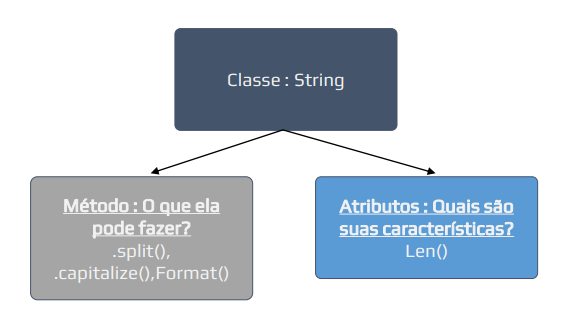

# Introdução básica a Orientação a Objetos (04.1 | CTRL + Click)

## Conteúdo

 - [01 - Python é Orientado a Objetos](#01)
 - [02 - Introdução a Objetos](#02)
 - [03 - Analogia a Objetos com a classe String](#03)
 - [04 - Variáveis também são Objetos](#04)
   - [04.1 - Abusando do conhecimento de Orientação a Objetos em variáveis](#041)
 - [05 - Saindo da programação Estrutural para a Orientada a Objetos](#05)

---

<div id="01"></div>

## 01 - Python é Orientado a Objetos

Não sei se você já ouviu falar, mas Python é todo orientado a Objetos.

> **Isso mesmo, tudo no Python é um objeto!**

Como assim?

 - Lista é objeto? **Sim**
 - Dicionário é objeto? **Sim**
 - E as tuplas? **Também...**
 - E... **Também ☺**

**NOTE:**  
Esses objetos no Python são *Classes (class)*

---

<div id="02"></div>

## 02 - Introdução a Objetos

Bem, objetos são basicamente uma abstração de algo no mundo real. Por exemplo, uma pessoa:

 - **O que uma pessoa pode fazer?**
   - Correr;
   - Comer;
   - Andar;
   - Pular;
   - Estudar;
   - Trabalhar...
 - **Quais são as características de uma pessoa?**
   - Alto;
   - Baixo;
   - Gordo;
   - Magro;
   - Forte;
   - Fraco...

Podemos claramente perceber que essas duas perguntas possuem respostas muito claras.

**NOTE:**  
O que ela pode fazer em geral são ações desempenhadas pela pessoa, já as características simplesmente existem na pessoa. Ações como correr ou comer, podem afetar a característica de ser forte ou fraco, mas são coisas distintas.

Veja essa abstração abaixo de forma visual:

  

Usando o mesmo exemplo, vamos agora fingir que essa pessoa existe dentro do Python.

 - Nesse caso, essa pessoa seria um **objeto** ou **classe**;
 - As ações, que essa **Classe**: **‘pessoa’** pode fazer são os **métodos**;
 - Já as **característica** são os **atributos**.

Mais uma vez vamos ver isso de uma forma visual para ficar mais claro:

  

---

<div id="03"></div>

## 03 - Analogia a Objetos com a classe String

A mesma lógica que nós aplicamos a pessoa, podemos aplicar a *classe string*, onde:

 - **As ações são os métodos:**
   - *.split()*, *.format()*
 - **E as características são os atributos:**
   - *len()*

De novo vamos ver isso visualmente:

  

---

<div id="04"></div>

## 04 - Variáveis também são Objetos

Não sei se você sabe mas quando utilizamos o **type()** estamos perguntando ao python qual a **classe (class)** está variável pertence. Como nós sabemos essas classes representam tipos primitivos de dados, que são:

 - int;
 - float;
 - string;
 - dict
 - etc...

**NOTE:**  
Consequentemente, sabendo a classe, sabemos o que podemos fazer com aquela variável, ou seja, quais são os métodos (ações) que podemos aplicar com **x** tipo de dado.

> Imagino que esteja pensando: **“Ok, até entendi mas e daí? Como uso isso?”**

<div id="041"></div>

### 04.1 - Abusando do conhecimento de Orientação a Objetos em variáveis

Você pode utilizar qualquer editor de código para abusar desse conhecimento, mas eu vou utilizar o **VSCode** que é o editor que eu mais utilizo.

De início vamos criar um código bem simples que verifica qual o tipo de uma variável:

[testing_type.py](src/testing_type.py)  
```python
name = "rodrigo leite"

print(type(name))
```

**OUTPUT:**  
```python
<class 'str'>
```

Veja que a nossa saída foi do tipo ***string ('str' = classe str)***.

Agora vamos utilizar o método **capitalize()** da classe **str**:
[testing_capitalize.py](src/testing_capitalize.py)  
```python
name = "rodrigo leite"

print(name.capitalize())
```

**OUTPUT:**  
```python
Rodrigo leite
```

**NOTE:**  
Veja que o **método** transforma a primeira letra *(só a primeira)* de um texto (string) em maiúscula.

> Ok, mas como eu sei que existe esse método na classe **string ('str')** e quais são os outros?

**NOTE:**  
É ai que entrada a *mágica*, vamos ver agora os **métodos (ações)** e **atributos (características)** da classe **str**.

> Com o **CTRL segurado, clique no método capitalize()** usado no código.

Perceba que uma nova guia **builtins.pyi** foi aberta com centenas de linhas.

Essas linhas são listas de classes e métodos que existem dentro do Python. Se você olhar direito vai ver que o método **capitalize()** está dentro de uma **class ('str')** e assim como em  funções, está sendo definida pelo a palavra reservada **def**. Por que?

> Porque o **capitalize()** é um método da classe **string ('str')**. Assim com todos os métodos dessa classe *(casefold, center, count, etc...)*

---

<div id="05"></div>

## 05 - Saindo da programação Estrutural para a Orientada a Objetos

Imagine que nós queremos criar um *objeto* que represente uma **TV**, quais são os **métodos (ações)** e **atributos (características)** desse *objeto*?

Poderia ser algo parecido com isso:

 - **Quais são seus métodos? (O que posso fazer com essa TV?):**
   - Mudar canal;
   - Mudar volume;
   - Ligar;
   - Desligar...
 - **Quais são seus atributos? (Suas características):**
   - Cor = preto;
   - Tamanho = 55;
   - Volume = 50...

Agora vamos transformar toda essa *abstração* do **objeto TV** em código Python:

[tv-v1.py](src/tv-v1.py)  
```python
class TV():

  cor = "preta"
  tamanho = 55
  volume = 50 

  def mudar_canal(self):
    pass

  def mudar_volume(self):
    pass

  def ligar_desligar(self):
    pass
```

> Por que isso tudo agora? Se até agora nunca usei classes, para que usar agora?

Até agora, fizemos códigos que resolvíamos problemas pontuais, e nosso código basicamente era feito sequencialmente (programação Estruturada).

Agora, vamos organizar essa programação para conseguirmos dividir esses códigos em programas ou aplicações de um programa, ou um sistema maior (programação orientada a objeto).

Para isso, faz muito sentido criarmos as classes que funcionarão para todo esse sistema e não só para um código único.

Veja essas duas abstrações abaixo para ficar mais claro:


**NOTE:**  
Em geral, o que acontecerá nessa forma de programar é que a parte mais de inteligência dos nossos códigos, onde usávamos
**Ifs**, **for**, **etc**, vão passar a pertencerem a métodos de classes específicas.

A ideia é criar a inteligência fora do nosso código principal e só chama-los quando precisarmos dos mesmos.

---

**REFERÊNCIAS:**  
[Python Impressionador: Curso de Python Completo](https://www.hashtagtreinamentos.com/curso-python)
