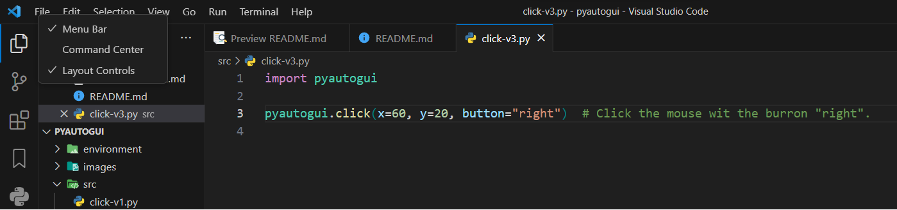
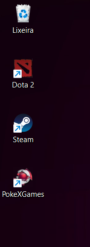
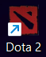

# PyAutoGUI

## Contents

 - **Mouse Control:**
   - [Get the current Mouse position (x, y)](#current-position)
   - [Check if the position exists](#check-position-exists)
   - [Moving the mouse](#moving-the-mouse)
   - [Clicking with the mouse](#clicking-w-mouse)
 - **Keyboard Control:**
   - [pyautogui.KEYBOARD_KEYS](#keyboard-keys)
   - [Writing texts with "pyautogui.write" function](#intro-to-write)
 - **Screenshot Functions:**
   - [Locating an image (object) on the screen and clicking on it](#laiotsacoi)
 - **Code Snippets:**
   - [[Hotkeys] - CTRL + a, CTRL + c, and CTRL + v](#ctrls-ex01)
   - [Apply opacity on a specific Window](#apply-opacity)
   - [Tibia Auto-Looting (Sources)](src/tibia)
   - [Take and save screenshots](#takesave-ss)
 - [**Settings**](#settings)
 - [**References**](#ref)
<!--- 
[WHITESPACE RULES]
- Same topic = "10" Whitespace character.
- Different topic = "50" Whitespace character.
--->


<!--- ( Mouse Control Functions ) --->

---

<div id="current-position"></div>

## Get the current Mouse position (x, y)

The first thing you need to know before getting the Mouse position is the coordinates system with **PyAutoGUI**:

```bash
0,0       X increases --->
+---------------------------+
|                           | Y increases
|                           |     |
|   1920 x 1080 screen      |     |
|                           |     V
|                           |
|                           |
+---------------------------+ 1919, 1079
```

See that:

 - The coordinate system starts from:
   - The *top* in the *axe-y*.
   - The *left* in the *axe-x*.
 - To increase the *axe-x* we move to the *right*.
 - To increase the *axe-y* we move to the *bottom*.

To get the current Mouse position with PyAutoGUI we use the **pyautogui.position()** function:

[position-v1.py](src/mouse-control/position-v1.py)
```python
import pyautogui

current_mouse_position = pyautogui.position()  # current mouse x and y.
print(current_mouse_position)
```

**INPUT & RUN:**
```bash
python position-v1.py
```

**OUTPUT:**
```bash
Point(x=813, y=842)
<class 'pyautogui.Point'>
```

See that the return was:

 - The current mouse position (x, y).
 - A *pyautogui.Point* object. 

We can also get these coordinates separately:

[position-v2.py](src/mouse-control/position-v2.py)
```python
import pyautogui

current_mouse_position = pyautogui.position()
print("Current mouse position: ", current_mouse_position)

x, y = current_mouse_position
print("x: ", x)
print("x type: ", type(x))
print("x: ", y)
print("x type: ", type(y))
```

**INPUT & RUN:**
```bash
python position-v2.py 
```

**OUTPUT:**
```bash
Current mouse position:  Point(x=1554, y=194)
x:  1554
x type:  <class 'int'>
x:  194
x type:  <class 'int'>
```

> **NOTE:**  
> See that now we have integers variables to the coordinates x and y separately.

Knowing that we can create a loop to stay printing the current Mouse position while the program is running:

[position-v3.py](src/mouse-control/position-v3.py)
```python
import pyautogui

print('Press Ctrl-C to quit.')
try:
    while True:
        current_mouse_position = pyautogui.position()
        print(current_mouse_position)
except KeyboardInterrupt:
    print('\n')
```

The code above will generate many prints printing the current mouse coordinates. This is interesting if we wish to save that in some file (or database).

**NOTE:**  
However, has another approach to don't stay printing many times:

[position-v4.py](src/mouse-control/position-v4.py)
```python
import pyautogui

print('Press Ctrl-C to quit.')
try:
    while True:
        x, y = pyautogui.position()
        positionStr = 'X: ' + str(x).rjust(4) + ' Y: ' + str(y).rjust(4)
        print(positionStr, end='')
        print('\b' * len(positionStr), end='', flush=True)
except KeyboardInterrupt:
    print('\n')
```

However, we have a most interesting approach using **"pyautogui.displayMousePosition()"**, that do it automatically:

[displayMousePosition.py](src/mouse-control/displayMousePosition.py)
```python
import pyautogui

print(pyautogui.displayMousePosition())
```

The return is:

 - The x and y coordinates.
 - And the RGB color reference of the position.

---

<div id="check-position-exists"></div>

## Check if the position exists

Sometimes we don't know the size of the screen. To check if the position exists on the screen we can use the **pyautogui.onScreen()** function:

[onScreen.py](src/mouse-control/onScreen.py)
```python
import pyautogui

print(pyautogui.onScreen(0, 0))
print(pyautogui.onScreen(10, 10))
print(pyautogui.onScreen(0, -1))
print(pyautogui.onScreen(1919, 1079))
print(pyautogui.onScreen(0, 99999999))
```

**INPUT & RUN:**
```bash
python onScreen.py 
```

**OUTPUT:**
```bash
True
True
False
True
False
```

> **NOTE:**
> This function is interesting when we don't know the user screen size.

---

<div id="moving-the-mouse"></div>

## Moving the mouse

 - To move the mouse to a specific position (coordinates x and y) we can use the **moveTo()** function.
 - The **None** value can be passed for a coordinate to mean *“the current mouse cursor position”*.
 
For example:

[moveTo-v1.py](src/mouse-control/moveTo-v1.py)
```python
import pyautogui

pyautogui.moveTo(100, 200)   # moves the mouse to X = 100, Y = 200.
pyautogui.moveTo(None, 500)  # moves the mouse to X = 100, Y = 500.
pyautogui.moveTo(600, None)  # moves the mouse to X = 600, Y = 500.
```

**NOTE:**  
Normally the mouse cursor will instantly move to the new coordinates. If you want the mouse to gradually move to the new location, pass a third argument for the duration (in seconds) the movement should take.

For example:

[moveTo-v2.py](src/mouse-control/moveTo-v2.py)
```python
import pyautogui

pyautogui.moveTo(100, 200, 2)   # moves the mouse to X = 100, Y = 200 over 2 seconds.
pyautogui.moveTo(None, 500, 2)  # moves the mouse to X = 100, Y = 500 over 2 seconds.
pyautogui.moveTo(600, None, 2)  # moves the mouse to X = 600, Y = 500 over 2 seconds.
```

**NOTE:**  
If you want to move the mouse cursor over a **few pixels** relative to its current position, use the **move()** function. This function has similar parameters as moveTo(). For example:

[move.py](src/mouse-control/move.py)
```python
import pyautogui

pyautogui.moveTo(100, 200, 2)  # moves the mouse to X = 100, Y = 200 over 2 seconds.
pyautogui.move(0, 50, 2)       # move  the mouse down 50 pixels over 2 seconds.
pyautogui.move(-30, 0, 2)      # move  the mouse left 30 pixels over 2 seconds.
pyautogui.move(-30, None, 2)   # move  the mouse left 30 pixels over 2 seconds.
```

---

<div id="clicking-w-mouse"></div>

## Clicking with the mouse

Sometimes we need to click on something with the mouse. To do it we can use the **pyautogui.click()** function that clicks on the current mouse position.

For example:

[click-v1.py](src/mouse-control/click-v1.py)
```python
import pyautogui

pyautogui.moveTo(60, 20)  # moves mouse to X = 60, Y = 20.
pyautogui.click()         # Click the mouse wit the burron "left".
```

  

**NOTE:**  
However the **pyautogui.click()** function can also receives **x** and **y** as argument:

[click-v2.py](src/mouse-control/click-v2.py)
```python
import pyautogui

pyautogui.click(x=60, y=20)  # Click the mouse wit the burron "left".
```

**NOTE:**  
You can also specify another mouse button to click: `LEFT`, `MIDDLE`, `RIGHT`, `PRIMARY`, or `SECONDARY`.

[click-v3.py](src/mouse-control/click-v3.py)
```python
import pyautogui

pyautogui.click(x=60, y=20, button="right")  # Click the mouse wit the burron "right".
```

  

Sometimes we will need to click the same button (or something) several times. For this we use the **"click"** attribute:

[click-v4.py](src/mouse-control/click-v4.py)
```python
import pyautogui

pyautogui.click(x=60, y=20, clicks=5, interval=1)
```

> **NOTE:**
> In the code above we use the **"interval"** argument to say to the program wait 1-second interval to click again.


<!--- ( Keyboard Control Functions ) --->

---

<div id="keyboard-keys"></div>

## pyautogui.KEYBOARD_KEYS

Some functions we will learn can receive a keyboard key as an argument to do something. Knowing that let's use the **"pyautogui.KEYBOARD KEYS"** that return the list of keyboard keys:

[keyboard_keys.py](src/keyboard-control/keyboard_keys.py)
```python
import pyautogui

keys_list = pyautogui.KEYBOARD_KEYS
print(type(keys_list))
print(keys_list)

# for key in keys_list:
#    print(key)
```

**INPUT & RUN:**
```bash
python keyboard_keys.py 
```

**OUTPUT:**
```bash
<class 'list'>
['\t', '\n', '\r', ' ', '!', '"', '#', '$', '%', '&', "'", '(', ')', '*', '+', ',', '-', '.', '/', '0', '1', '2', '3', '4', '5', '6', '7', '8', '9', ':', ';', '<', '=', '>', '?', '@', '[', '\\', ']', '^', '_', '`', 'a', 'b', 'c', 'd', 'e', 'f', 'g', 'h', 'i', 'j', 'k', 'l', 'm', 'n', 'o', 'p', 'q', 'r', 's', 't', 'u', 'v', 'w', 'x', 'y', 'z', '{', '|', '}', '~', 'accept', 'add', 'alt', 'altleft', 'altright', 'apps', 'backspace', 'browserback', 'browserfavorites', 'browserforward', 'browserhome', 'browserrefresh', 'browsersearch', 'browserstop', 'capslock', 'clear', 'convert', 'ctrl', 'ctrlleft', 'ctrlright', 'decimal', 'del', 'delete', 'divide', 'down', 'end', 'enter', 'esc', 'escape', 'execute', 'f1', 'f10', 'f11', 'f12', 'f13', 'f14', 'f15', 'f16', 'f17', 'f18', 'f19', 'f2', 'f20', 'f21', 'f22', 'f23', 'f24', 'f3', 'f4', 'f5', 'f6', 'f7', 'f8', 'f9', 'final', 'fn', 'hanguel', 'hangul', 'hanja', 'help', 'home', 'insert', 'junja', 'kana', 'kanji', 'launchapp1', 'launchapp2', 'launchmail', 'launchmediaselect', 'left', 'modechange', 'multiply', 'nexttrack', 'nonconvert', 'num0', 'num1', 'num2', 'num3', 'num4', 'num5', 'num6', 'num7', 'num8', 'num9', 'numlock', 'pagedown', 'pageup', 'pause', 'pgdn', 'pgup', 'playpause', 'prevtrack', 'print', 'printscreen', 'prntscrn', 'prtsc', 'prtscr', 'return', 'right', 'scrolllock', 'select', 'separator', 'shift', 'shiftleft', 'shiftright', 'sleep', 'space', 'stop', 'subtract', 'tab', 'up', 'volumedown', 'volumemute', 'volumeup', 'win', 'winleft', 'winright', 'yen', 'command', 'option', 'optionleft', 'optionright']
```

---

<div id="intro-to-write"></div>

## Writing texts with "pyautogui.write" function

> To write texts somewhere (em algum lugar) we can use the "pyautogui.write" function.

 - This function starts to write automatically the first letter:
   - Sometimes is interesting create a *"sleep()"* to wait something.

For example:

[write-v1.py](src/keyboard-control/write-v1.py)
```python
from time import sleep
import pyautogui

sleep(2)
pyautogui.write("Hello World!")
```

**INPUT & RUN:**
```bash
python write-v1.p
```

**OUTPUT:**
```bash
Hello World!
```

> **NOTE:**  
> The first letter will always be written automatically. However, we can use the "interval" argument to make an interval (in seconds) to write another letter.

[write-v2.py](src/keyboard-control/write-v2.py)
```python
from time import sleep
import pyautogui

sleep(2)
pyautogui.write("Hello World!", interval=1)
```

**INPUT & RUN:**
```bash
python write-v2.py
```

**OUTPUT:**
```bash
Hello World!
```


<!--- ( Screenshot Functions ) --->

---

<div id="laiotsacoi"></div>

## Locating an image (object) on the screen and clicking on it

> To locate parts of an image (object) on the screen we can use the **"pyautogui.locateOnScreen"** function.

For example, let's make a loop to check if Dota2 exists in my workspace and click on it



To find this Dota2 image we need to send an image to **"pyautogui.locateOnScreen"** function as argument:

**dota2.png:**  
  

```python
import pyautogui

dota2Object = pyautogui.locateOnScreen("../images/dota2.png")

try:
    while True:
        print(dota2Object)
except KeyboardInterrupt:
    print("")
```

**OUTPUT:**
```bash
None
None
None

....

None
None
None
```

**What?**  
Here, we have some problems:

 - **#PROBLEM-01:**
   - **confidence default value: "str = 0.999":**
     - The **"pyautogui.locateOnScreen"** function has an attribute called **"confidence"** that say how accurate the image needs to be.
     - If you don't pass any value the default value was **"0.999"**, that's, **99% accurate**:
       - That is, the image needs to be almost (quase) perfect when compared.
       - This generally generates a problem, because the **"pyautogui.locateOnScreen"** function finds a perfect (almost/quase) image.
       - 1 = 100% accurate.
       - 0 = 0% accurate.
     - **NOTE:** To use this argument you need first install **"opencv-python"**.
 - **#PROBLEM-02:**
   - We have to call the **"pyautogui.locateOnScreen()"** function on the screen where we are going to locate the image. We will need to switch from the code editor screen to the desktop screen:
     - That is, there is no point in (não adianta) printing the same result (dota2Object) inside the loop if the function **"pyautogui.locateOnScreen()"** was called on the wrong screen.
     - To solve this problem we have to put the **"pyautogui.locateOnScreen()"** function inside the loop as well (também).

Now the code will be:

```python
import pyautogui

try:
    while True:
        dota2Object = pyautogui.locateOnScreen("../images/dota2.png", confidence=0.75)
        print(dota2Object)
except KeyboardInterrupt:
    print("")
```

**OUTPUT:**
```bash
None
None
None

Switch screen....

Box(left=17, top=112, width=60, height=71)
Box(left=17, top=112, width=60, height=71)
Box(left=17, top=112, width=60, height=71)
Box(left=17, top=112, width=60, height=71)
```

See that the **"pyautogui.locateOnScreen"** function return:

 - The image (object) coordinates:
   - **left =** Where *"x"* coordinate starts.
   - **top =** Where *"y"* coordinate starts.
 - The image (object) size in width and height:
   - **width =** image size in width.
   - **height =** image size in height.

Knowing that we need to click on the Dota2 image. However, first, we need to move the mouse to the center of the Dota2 image found.

To do it, let's use the **"pyautogui.center()"** function that returns the center coordinates of the passed image:

```python
x_coordinate, y_coordinate = pyautogui.center(dota2Object)
```

Finally, let's make the program double-click the image:

```python
pyautogui.click(x=x_coordinate, y=y_coordinate, duration=1, clicks=2)
```

> **Now, see the code below, does it works (funciona)?**

```python
import pyautogui

dota2Object = None

while dota2Object == None:
    dota2Object = pyautogui.locateOnScreen("../images/dota2.png", confidence=0.75)
    x_coordinate, y_coordinate = pyautogui.center(dota2Object)
    pyautogui.click(x=x_coordinate, y=y_coordinate, duration=1, clicks=2)
```

> **Not!**

 - How the **"dota2Object"** was initialized as `None` the first *while loop* always will be true.
 - Then, if the **"pyautogui.locateOnScreen"** returns `None (don't find the image)` the **"pyautogui.center(dota2Object)"** will receive `None`, that's, this will generate an error.

**NOTE:**  
To solve that we need to check if the **"dota2Object"** variable is not None, before call the **"pyautogui.center()"** function:

[open_dota2.py](src/screenshot-functions/open_dota2.py)
```python
import pyautogui

dota2Object = None

while dota2Object is None:
    try:
        dota2Object = pyautogui.locateOnScreen("../images/dota2.png", confidence=0.75)
        if dota2Object:
            print("Image found on the screen:", dota2Object)
            x_coordinate, y_coordinate = pyautogui.center(dota2Object)
            pyautogui.click(x=x_coordinate, y=y_coordinate, duration=1, clicks=2)
        else:
            print("Image not found on the screen.")
    except Exception as e:
        print(f"Error while trying to locate the image: {e}")
        break
```

**OUTPUT:**
```bash
Image not found on the screen.
Image not found on the screen.
Image not found on the screen.
Image not found on the screen.
Image found on the screen: Box(left=17, top=112, width=60, height=71)
```


<!--- ( Code Snippets ) --->

---

<div id="ctrls-ex01"></div>

## [Hotkeys] - CTRL + a, CTRL + c, and CTRL + v

In this example, let's see how to automatically **select all the text (CTRL + A)**, do **CTRL + c**, and **CTRL + v**:

[ctrls-v1.cpy](src/code-snippets/ctr/ctrls-v1.cpy)
```python
from time import sleep
import pyautogui

sleep(5)
pyautogui.hotkey('ctrl', 'a') # ctrl - a to select all.
pyautogui.hotkey('ctrl', 'c') # ctrl - c to copy.
pyautogui.hotkey('ctrl', 'v') # ctrl - v to paste.
```

---

<div id=""></div>

<div id="apply-opacity"></div>

## Apply opacity on a specific Window

To apply opacity on a specific Window first, we need to get a Window. To get a specific Window we can use the **"pygetwindow.getWindowsWithTitle()"** function.

The **"pygetwindow.getWindowsWithTitle()"** function returns a list of windows with the title we pass as argument. For example, imagine we pass the "chrome" as argument:

```python
import pygetwindow

OPACITY = 1  # Opacity = 0 to 255
WINDOW_TITLE = "chrome"  # Window title.

# Get the Window.
windows_list = pygetwindow.getWindowsWithTitle(WINDOW_TITLE)
print(type(windows_list))
print(windows_list)

for window in windows_list:
    print(window)
```

**OUTPUT:**
```bash
<class 'list'>
[Win32Window(hWnd=37619942), Win32Window(hWnd=854206), Win32Window(hWnd=4065162), Win32Window(hWnd=1312996)]
<Win32Window left="-7", top="-7", width="1550", height="830", title="Google Translate - Google Chrome">
<Win32Window left="-7", top="-7", width="1550", height="830", title="ChatGPT - Google Chrome">
<Win32Window left="-7", top="-7", width="1550", height="830", title="Bing - Google Chrome">
<Win32Window left="-7", top="-7", width="1550", height="830", title="Google - Google Chrome">
```

See that the return is:

 - A list of windows.
 - And your specific handle (window identify).
 - We can iterate by the list and see each window's coordinates and size.

**NOTE:**  
To get a handle of each window we can use the **"_hWnd"** attribute:

```python
import pygetwindow

OPACITY = 1  # Opacity = 0 to 255
WINDOW_TITLE = "chrome"  # Window title.

# Get the Window.
windows_list = pygetwindow.getWindowsWithTitle(WINDOW_TITLE)

for window in windows_list:
    print(window)
    print("Handle:", window._hWnd, "\n")
```

**OUTPUT:**
```bash
<Win32Window left="-7", top="-7", width="1550", height="830", title="Google Docs - Google Chrome">
Handle: 37619942 

<Win32Window left="-7", top="-7", width="1550", height="830", title="ChatGPT - Google Chrome">
Handle: 854206 

<Win32Window left="-7", top="-7", width="1550", height="830", title="Bing - Google Chrome">
Handle: 4065162

<Win32Window left="-7", top="-7", width="1550", height="830", title="Google - Google Chrome">
Handle: 1312996
```

Now, let's see a complete code to apply opacity on a Tibia window:

[apply_opacity_on_tibia.py](src/code-snippets/tibia/apply_opacity_on_tibia.py)
```python
import ctypes
import pygetwindow

GWL_EXSTYLE = -20
WS_EX_LAYERED = 0x00080000
LWA_ALPHA = 0x00000002

OPACITY = 1  # Opacity = 0 to 255
WINDOW_TITLE = "Tibia - Guardiao da Blessing"  # Window title.

# Get the Window.
target_window = pygetwindow.getWindowsWithTitle(WINDOW_TITLE)[0]

if target_window is not None:
    target_hwnd = target_window._hWnd

    ex_style = ctypes.windll.user32.GetWindowLongA(target_hwnd, GWL_EXSTYLE)
    ctypes.windll.user32.SetWindowLongA(
        target_hwnd, GWL_EXSTYLE, ex_style | WS_EX_LAYERED
    )

    ctypes.windll.user32.SetLayeredWindowAttributes(target_hwnd, 0, OPACITY, LWA_ALPHA)

    print("Window opacity modified.")
else:
    print("Window don't found.")
```

---

<div id="takesave-ss"></div>

## Take and save screenshots

Here, let's see a script to *print* and *save* a **"screenshot"**:

[script.py](src/code-snippets/screenshots/script.py)
```python
import pyautogui
import keyboard
import time
import os


def take_screenshot(count):
    # Define the path to save the screenshot
    screenshot_name = f"source-folders-here/{count:03}.png"

    # Create directories if they don't exist
    os.makedirs(os.path.dirname(screenshot_name), exist_ok=True)

    # Save the screenshot
    pyautogui.screenshot().save(screenshot_name)
    print(f"Screenshot saved as {screenshot_name}")


def main():
    count = 1
    while True:
        if keyboard.is_pressed("esc"):
            print("'ESC' pressed...")
            take_screenshot(count)
            count += 1
            time.sleep(1)  # Small pause to avoid multiple captures at once
        elif keyboard.is_pressed("F1"):
            print("'F1' pressed...")
            print("Exiting the program.")
            break


if __name__ == "__main__":
    main()
```


<!--- ( Settings ) --->

---

<div id="settings"></div>

## Settings

**CREATE VIRTUAL ENVIRONMENT:**  
```bash
python -m venv pyautogui-environment
```

**ACTIVATE THE VIRTUAL ENVIRONMENT (WINDOWS):**  
```bash
source pyautogui-environment/Scripts/activate
```

**ACTIVATE THE VIRTUAL ENVIRONMENT (LINUX):**  
```bash
source pyautogui-environment/bin/activate
```

**UPDATE PIP:**
```bash
python -m pip install --upgrade pip
```

**INSTALL PYTHON DEPENDENCIES:**  
```bash
pip install -U -v --require-virtualenv -r requirements.txt
```

**Now, Be Happy!!!** 😬


<!--- ( References ) --->

---

<div id="ref"></div>

## References

 - [Mouse Control Functions](https://pyautogui.readthedocs.io/en/latest/mouse.html)
 - [Keyboard Control Functions](https://pyautogui.readthedocs.io/en/latest/keyboard.html)
 - [Message Box Functions](https://pyautogui.readthedocs.io/en/latest/msgbox.html)
 - [Screenshot Functions](https://pyautogui.readthedocs.io/en/latest/screenshot.html)
 - [PYTHON FOR GUI AUTOMATION – PYAUTOGUI](https://www.topcoder.com/thrive/articles/python-for-gui-automation-pyautogui)
 - [Faça seu próprio bot com python para PXG 1/2](https://www.youtube.com/watch?v=tH3rHn37rG0)
 - [Faça seu próprio bot com python para o TIBIA 1/4](https://www.youtube.com/watch?v=R0_RhKaeWlg)

---

Ro**drigo** **L**eite da **S**ilva - **drigols**
