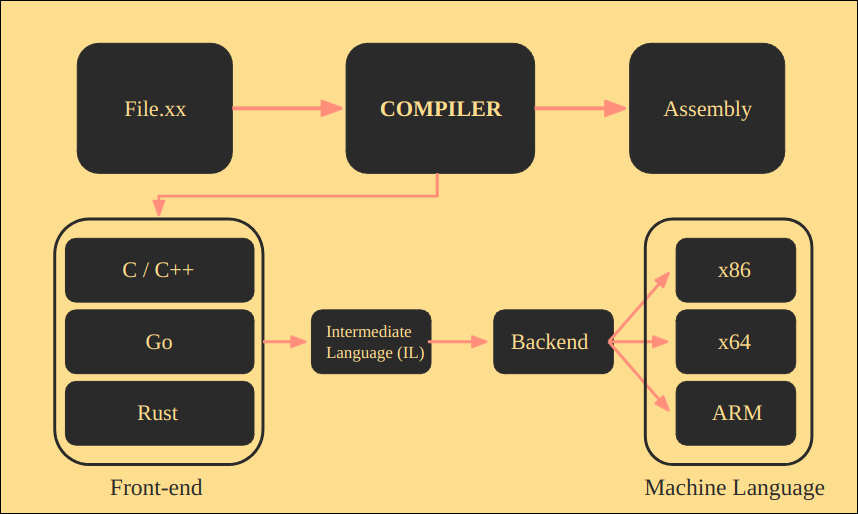
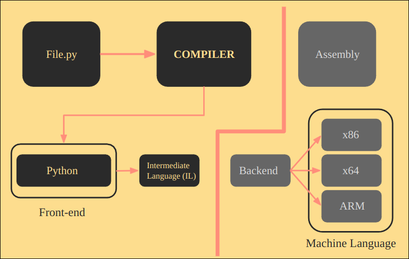
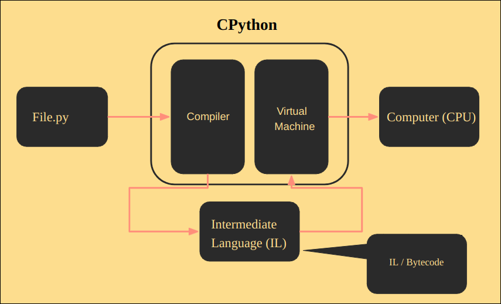
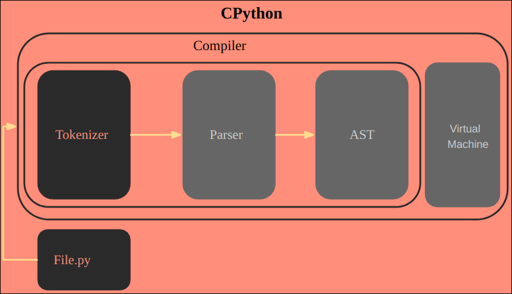
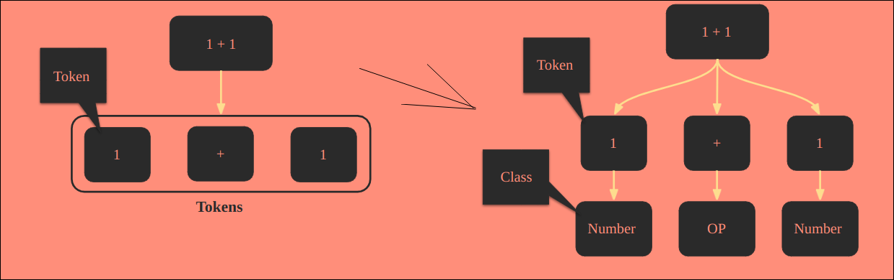
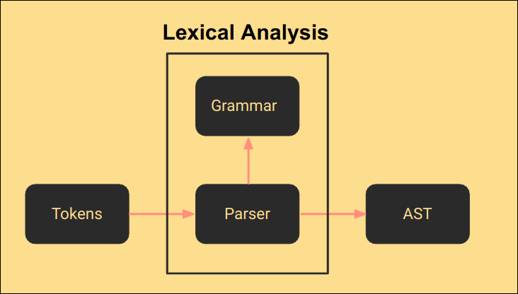
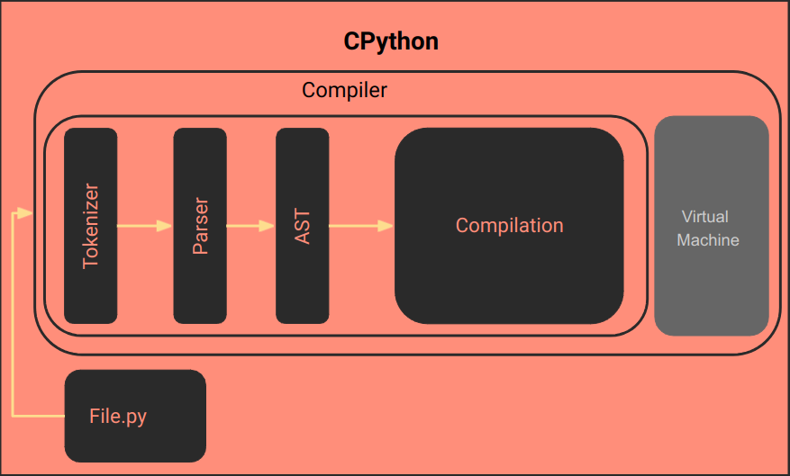
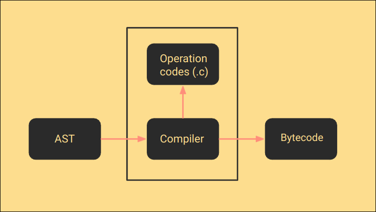
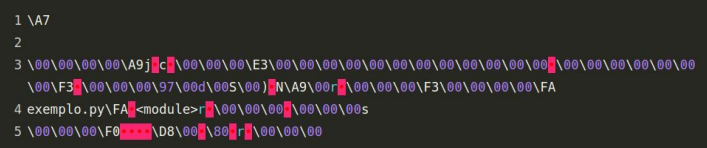

# Python Internals

## Contents

 - **Concepts:**
   - [Intermediate Language (IL) vs. Machine Language (Assembly)](#il-ml)
 - [**Python Precompilation Process:**](#ppp)
     - [**Tokenizer (Tokenizes the program statements)**](#intro-to-tokenizer)
       - [`python -m tokenize <module.py>`](#mtokenize)
     - [**Parser (Analyzes the tokens and makes sense of operations)**](#intro-to-parser)
       - [Lexical Analysis](#intro-to-lexical-analysis)
       - [Understanding the SyntaxError](#syntaxerror)
     - [**Abstract Syntax Tree/AST ()**](#intro-to-ast)
       - [`python -m ast <module.py>`](#mast)
 - [**Python Compilation Process:**](#pcp)
   - [Bytecode == Intermediate Language (IL)](#bytecode-equal-il)
   - [`python -m compileall <module.py> (Compiles the code)`](#mcompileall)
   - [`python -m dis <module.py> (Generates IL)`](#mdis)
 - [**Python Virtual Machine:**](#pvm)
 - [**Settings**](#settings)
 - [**REFERENCES**](#ref)
<!--- 
[WHITESPACE RULES]
- Same topic = "10" Whitespace character.
- Different topic = "50" Whitespace character.
--->


<!--- ( Concepts ) --->

---

<div id="il-ml"></div>

## Intermediate Language (IL) vs. Machine Language (Assembly)

To understand how Python is interpreted, first, let's see how a compilation works for a compiled language:

  

See our **file.xx** passes by a *compiler* → next is generated a Machine Language (Assembly). However, the compiler has **Front-end** and **Backend** steps:

 - **Front-end:**
   - Receive the compiled language code: C/C++, Go, Rust.
   - Translates to an *Intermediate Language (IL)* → The compiler knows to work with this language (IL).
 - **Backend:**
   - The compiler backend translates the *Intermediate Language (IL)* to *Machine Language (Assembly)*:
     - The *Machine Language (Assembly)* is a language used/read by the *CPU*.
     - This *Machine Language (Assembly)* is:
       - *x83:* 32 architecture.
       - *x64:* 64 architecture.
       - *ARM:* Cellphone architecture.

> **NOTE:**  
> This is the traditional compilation, but how Python compiler works?

To understand how Python is interpreted, let's see another abstraction below:

  

 - Looking at the image above we can see that the Python compilation has no **"backend step"**.
 - That's, the Python compilation doesn't generate a **Machine Language (Assembly)** for a specific CPU architecture.

> **Ok, but if the Python compiler doesn't compiler for a specific architecture where does he send the Intermediate Language (IL)?**

To understand this, let's see another abstraction:

  

Looking at the image above we can see that:

 - The compiler translates our code to an *Intermediate Language (IL)*.
 - This *Intermediate Language (IL)* is sended to a **Virtual Machine**.
 - The **Virtual Machine** communicates with the **computer (CPU)** and repeats this process until it finishes the tasks.

> **NOTE:**  
> See that here the Python compiler doesn't have a backend step to generate a *Machine Language*. **The *Virtual Machine* that communicates with the *computer (CPU)***.

Knowing this, we can say that:

 - Traditional compilers compile the code for **Real Machines (or CPU architecture)**.
 - The Python compiler compiles the code for a **Virtual Machine**.


<!--- ( PPP = Python Pre-Compilation Process ) --->

---

<div id="ppp"></div>

## Python Precompilation Process

The **Python Precompilation Process** has three steps before sending an *Intermediate Language (IL)* to the **Virtual Machine**:

 - Tokenizer.
 - Parser.
 - Abstract Syntax Tree (AST).

  


<!--- ( PPP/Tokenizer ) --->

---

<div id="intro-to-tokenizer"></div>

## Tokenizer (Tokenizes the program statements)

> The first step before sending an *Intermediate Language (IL)* to the *Virtual Machine* is the ***"Tokenizer"***.

For example, see the **tokenizations** below:

  

---

  

See that:

 - **We have a Input (text):**
 - **Next, we tokenize the Input (text) by sentences:**
   - The *dot symbol "."* sometimes says that the sentence is ended.
 - **Finally, we to tokenize the sentences.**

> **OK, but why tokenize?**

 - **Do you remember in the high school the "Morphological Analysis"?**
   - That's, we get each word in the sentence and find your grammatical class.
 - **The Lexical Analysis (applied on the Parse stage) do the same thing:**
   - Take each tokenized word (or statement) and place it in the appropriate context.

> **NOTE:**  
> However, here the focus is not "Morphological Analysis" or "Words", but **Python statements**, **inputs**, **expressions**, etc.

For example:

  

> If you pay attention you can see that the **"+"** is an operator. But, which operator?

Like "Morphological Analysis" here we also have subclass.

  

> **Okay, but how do I know what tokens Python has?**

**NOTE:**  
We can check the Python Tokens on the [CPython Repository](https://github.com/python/cpython) by clicking on the [Grammar/Tokens](https://github.com/python/cpython/blob/main/Grammar/Tokens).

**Current Python Tokens (02/07/2024):**
```py
ENDMARKER
NAME
NUMBER
STRING
NEWLINE
INDENT
DEDENT

LPAR                    '('
RPAR                    ')'
LSQB                    '['
RSQB                    ']'
COLON                   ':'
COMMA                   ','
SEMI                    ';'
PLUS                    '+'
MINUS                   '-'
STAR                    '*'
SLASH                   '/'
VBAR                    '|'
AMPER                   '&'
LESS                    '<'
GREATER                 '>'
EQUAL                   '='
DOT                     '.'
PERCENT                 '%'
LBRACE                  '{'
RBRACE                  '}'
EQEQUAL                 '=='
NOTEQUAL                '!='
LESSEQUAL               '<='
GREATEREQUAL            '>='
TILDE                   '~'
CIRCUMFLEX              '^'
LEFTSHIFT               '<<'
RIGHTSHIFT              '>>'
DOUBLESTAR              '**'
PLUSEQUAL               '+='
MINEQUAL                '-='
STAREQUAL               '*='
SLASHEQUAL              '/='
PERCENTEQUAL            '%='
AMPEREQUAL              '&='
VBAREQUAL               '|='
CIRCUMFLEXEQUAL         '^='
LEFTSHIFTEQUAL          '<<='
RIGHTSHIFTEQUAL         '>>='
DOUBLESTAREQUAL         '**='
DOUBLESLASH             '//'
DOUBLESLASHEQUAL        '//='
AT                      '@'
ATEQUAL                 '@='
RARROW                  '->'
ELLIPSIS                '...'
COLONEQUAL              ':='
EXCLAMATION             '!'

OP
AWAIT
ASYNC
TYPE_IGNORE
TYPE_COMMENT
SOFT_KEYWORD
FSTRING_START
FSTRING_MIDDLE
FSTRING_END
COMMENT
NL
ERRORTOKEN

# These aren't used by the C tokenizer but are needed for tokenize.py
ENCODING
```

---

<div id="mtokenize"></div>

## `python -m tokenize <module>`

To see the tokens of a program, we need to run the following command:

```bash
python -m tokenize <module.py>
```

For example, imagine we have the following program:

[tokenize-ex01.py](src/tokenize-ex01.py)
```python
1 + 2
```

**INTPUT:**
```bash
python -m tokenize tokenize-ex01.py
```

**OUTPUT:**
```bash
0,0-0,0:            ENCODING       'utf-8'        
1,0-1,1:            NUMBER         '1'            
1,2-1,3:            OP             '+'            
1,4-1,5:            NUMBER         '2'            
1,5-1,6:            NEWLINE        '\n'           
2,0-2,0:            ENDMARKER      ''
```

Analyzing the output above we have **three columns**:

 - **First column:**
   - **Token (Statement) mapping:** This mapping is separated into *two parts*.
     - "initial_row", "initial_col" - "final_row", "final_col"
     - For example, "1,2-1,3":
       - "initial_row" = 1
       - "initial_col" = 2
       - "final_row" = 1
       - "final_col" = 3
     - **NOTE:** The tokenize process ignores *"spaces"* and *"tabs"*. That is, **"1 + 2"** is equal to **"1+2"**.
 - **Second column:**
   - Token name in the grammar.
 - **Third column:**
   - Token value.

> **NOTE:**  
> We can also specific to the *"tokenize"* show *subclass* of tokens using **"-e"** flag:

**INTPUT:**
```bash
python -m tokenize -e tokenize-ex01.py
```

**OUTPUT:**
```bash
0,0-0,0:            ENCODING       'utf-8'        
1,0-1,1:            NUMBER         '1'            
1,2-1,3:            PLUS           '+'            
1,4-1,5:            NUMBER         '2'            
1,5-1,6:            NEWLINE        '\n'           
2,0-2,0:            ENDMARKER      ''
```

> **NOTE:**  
> See that now the **"+"** operator shows its subclass **"PLUS"** and not just **"OP"**.


<!--- ( PPP/Parser ) --->

---

<div id="intro-to-parser"></div>

## Parser (Analyzes the tokens and makes sense of operations)

> The **"Parser"** stage is where Python will **analyze the tokens** and **make sense of operations (dar sentido as operações)**.

 - To make sense of the operations, we first need to program the **grammatical rules** of the language.
 - To program the **grammatical rules** is common used the [Extended Backus-Naur Form (EBNF)](https://plantuml.com/ebnf#:~:text=Extended%20Backus%E2%80%93Naur%20Form%20(EBNF)%20is%20a%20type%20of,of%20the%20Algol%20programming%20language.) notation, also know as the [Context-Free Grammars](https://brilliant.org/wiki/context-free-grammars/):
   - [Extended Backus–Naur Form (EBNF)](https://plantuml.com/ebnf#:~:text=Extended%20Backus%E2%80%93Naur%20Form%20(EBNF)%20is%20a%20type%20of,of%20the%20Algol%20programming%20language.) is a type of formal syntax used to specify the structure of a programming language or other formal language. 

**NOTE:**  
We can check the Python grammar implementations on the [CPython Repository](https://github.com/python/cpython) by clicking on the [Grammar/python.gram](https://github.com/python/cpython/blob/main/Grammar/python.gram).

---

<div id="intro-to-lexical-analysis"></div>

## Lexical Analysis

The process of **analyzing the tokens** and **making sense of operations** is called **"Lexical Analysis"**:

  

See that:

 - **First, we take the tokens:**
   - Generated by the **"Tokenizer"** stage.
 - **Next, the *Parser* stage will check the language Grammar:**
   - This step is known as the **"Lexical Analysis"**.
 - **Finally, the *Parser* generates the *"Abstract Syntax Tree (AST)"*.**

---

<div id="syntaxerror"></div>

## Understanding the SyntaxError

To understand the **"SyntaxError"** imagine we have the following program:

[syntax_error.py](src/syntax_error.py)
```python
1000 +* 2
```

Now, let's tokenize this program:

**INPUT:**
```bash
python -m tokenize -e syntax_error.py
```

**OUTPUT:**
```bash
0,0-0,0:            ENCODING       'utf-8'        
1,0-1,4:            NUMBER         '1000'         
1,5-1,6:            PLUS           '+'            
1,6-1,7:            STAR           '*'            
1,8-1,9:            NUMBER         '2'            
1,9-1,10:           NEWLINE        '\n'           
2,0-2,0:            ENDMARKER      ''
```

**NOTE:**  
See that the `*` and `+` are considered operators (plus and star respectively).

> **Now... What happens if we try to run this program?**

**INPUT:**
```bash
python -m syntax_error.py
```

**OUTPUT:**
```bash
  File "syntax_error.py", line 1
    1000 +* 2
          ^
SyntaxError: invalid syntax
```

**Why SyntaxError?**  
Do you remember **"Lexical Analysis"** in the *Parser* stage?

  

Yes, the **Lexical Analysis (Parser)** checks the rule `+*` on the [Grammar/python.gram](https://github.com/python/cpython/blob/main/Grammar/python.gram) and sees that **the rule doesn't exist**.

> **NOTE:**  
> Whenever (sempre) a rule is not in the grammar it will generate a **"SyntaxError"**.


<!--- ( PPP/Abstract Syntax Tree/AST ) --->>

---

<div id="intro-to-ast"></div>

## Abstract Syntax Tree/AST ()


---

<div id="mast"></div>

## `python -m ast <module.py>`

To check the **"Abstract Syntax Tree (AST)"** of our program we need to run the following command:

**INPUT:**
```bash
python -m ast tokenize-ex01.py
```

**OUTPUT:**
```bash
Module(
   body=[
      Expr(
         value=BinOp(
            left=Constant(value=1),
            op=Add(),
            right=Constant(value=2)))],
   type_ignores=[])
```

> **NOTE:**  
> See that the output is a Data Structure. That is, we can access it.

The **Abstract Syntax Tree (AST)** of the example above will look like this:

  


<!--- ( PCP = Python Compilation Process ) --->

---

<div id="pcp"></div>

## Python Compilation Process

After Python goes through the *Precompilation stages (Tokenizer, Parser, AST)* we start the **Compilation** process:



Python compilation looks something like this:

  

See that:

 - First, we take the *Abstract Syntax Tree (AST)* stage result.
 - Next, the compiler run **Operation codes (written in .c)** on the *Abstract Syntax Tree (AST)*.
 - Finally is generates **"Bytecode"**:
   - The generated *Bytecode* are files with the `.pyc` extension.

**NOTE:**  
We can see the **Operation codes (written in .c)** on the [CPython Repository](https://github.com/python/cpython) by clicking on the [Python/compile.c](https://github.com/python/cpython/blob/main/Python/compile.c).

---

<div id="bytecode-equal-il"></div>

## Bytecode == Intermediate Language (IL)

I don't know if you remember, but **Bytecode** and **Intermediate Language (IL)** are the same thing:

  

---

<div id="mcompileall"></div>

## `python -m compileall <module.py> (Compiles the code)`

To compiler a Python module manually we can run the following command:

**INPUT:**
```bash
python -m compileall tokenize-ex01.py
```

Going back to our examples, the compiled code will be something like this:

  

> **NOTE:**  
> These files are generally saved in `__pycache__` folder.

---

<div id="mdis"></div>

## `python -m dis <module.py> (Generates IL)`

After the *Compilation process*, we have a crazy code to be interpreted:

  

**The *Virtual Machine* can't interpret this code!**  
To solve that we first need to *"disassemble"* it (the Virtual Machine does it automatically).

For example:

[disassemble.py](src/disassemble.py)
```python
a = 10000
b = 2
a + b
```

**INPUT:**
```bash
python -m dis disassemble.py
```

> **NOTE:**  
> **"dis"** is the abbreviation of **"disassemble"**.

**OUTPUT:**
```bash
  0           0 RESUME                   0

  1           2 LOAD_CONST               0 (10000)
              4 STORE_NAME               0 (a)

  2           6 LOAD_CONST               1 (2)
              8 STORE_NAME               1 (b)

  3          10 LOAD_NAME                0 (a)
             12 LOAD_NAME                1 (b)
             14 BINARY_OP                0 (+)
             18 POP_TOP
             20 RETURN_CONST             2 (None)
```

**NOTE:**  
This is what the **Virtual Machine** *"understands"* and will *"interpret"*.


<!--- ( PVM = Python Virtual Machine ) --->

---

<div id="pvm"></div>

## Python Virtual Machine

x


<!--- ( Settings ) --->

---

<div id="settings"></div>

## Settings

**CREATE VIRTUAL ENVIRONMENT:**  
```bash
python -m venv python-environment
```

**ACTIVATE THE VIRTUAL ENVIRONMENT (LINUX):**  
```bash
source python-environment/bin/activate
```

**ACTIVATE THE VIRTUAL ENVIRONMENT (WINDOWS):**  
```bash
source python-environment/Scripts/activate
```

**UPDATE PIP:**
```bash
python -m pip install --upgrade pip
```

**INSTALL PYTHON DEPENDENCIES:**  
```bash
pip install -U -v --require-virtualenv -r requirements.txt
```

**Now, Be Happy!!!** 😬


<!--- ( References ) --->

---

<div id="ref"></div>

## REFERENCES

 - [Como o interpretador do Python funciona? | Live de Python #218](https://www.youtube.com/watch?v=pxfZTAJDipY)

---

Ro**drigo** **L**eite da **S**ilva - **drigols**
