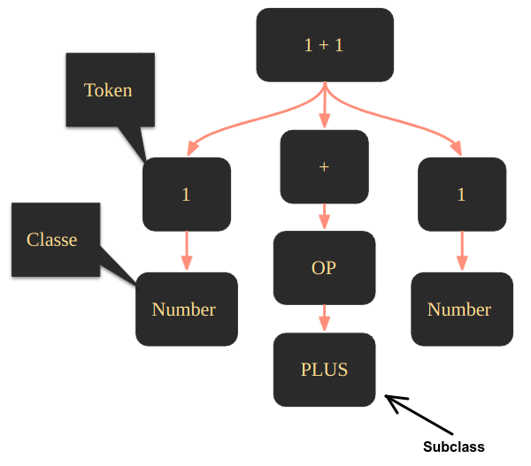

# Python Internals (Theory and Practice)

## Contents

 - **Concepts:**
   - [Intermediate Language (IL) vs. Machine Language (Assembly)](#il-ml)
 - [**Python Precompilation Process:**](#ppp)
     - [**Tokenizer (Tokenizes the program statements)**](#intro-to-tokenizer)
       - [`python -m tokenize <module.py>`](#mtokenize)
     - [**Parser (Analyzes the tokens and makes sense of operations)**](#intro-to-parser)
       - [Lexical Analysis](#intro-to-lexical-analysis)
       - [Understanding the SyntaxError](#syntaxerror)
     - [**Abstract Syntax Tree/AST ()**](#intro-to-ast)
       - [`python -m ast <module.py>`](#mast)
 - [**Python Compilation Process:**](#pcp)
   - [Bytecode == Intermediate Language (IL)](#bytecode-equal-il)
   - [`python -m compileall <module.py> (Compiles the code)`](#mcompileall)
   - [`python -m dis <module.py> (Generates IL)`](#mdis)
 - [**Python Virtual Machine:**](#pvm)
 - [**CPython**:](#cpython)
   - [/.azure-pipelines](#cpython-azurepipelines)
   - [/.devcontainer](#cpython-devcontainer)
   - [/.github](#cpython-github)
   - [/Android](#cpython-android)
   - [/Doc](#cpython-doc)
   - [/Grammar](#cpython-grammar)
   - [/Include](#cpython-include)
   - [/InternalDocs](#cpython-internaldocs)
   - [/Lib](#cpython-lib)
   - [/Mac](#cpython-mac)
   - [/Misc](#cpython-misc)
   - [/Modules](#cpython-modules)
   - [/Objects](#cpython-objects)
   - [/PC](#cpython-pc)
   - [/PCBuild](#cpython-pcbuild)
   - [/Parser](#cpython-parser)
   - **/Programs (Source code for the python executable and other binaries):**
     - [`python.c (Python interpreter entry point)`](#programs-python)
   - **/Python (The CPython interpreter source code):**
     - [`pyarena.c (Memory Management)`](#python-pyarena)
   - [/Tools](#cpython-tools)
   - [/iOS](#cpython-ios)
   - [.coveragerc](#cpython-coveragerc)
   - [.editorconfig](#cpython-editorconfig)
   - [.gitattributes](#cpython-gitattributes)
   - [.gitignore](#cpython-gitignore)
   - [.mailmap](#cpython-mailmap)
   - [.pre-commit-config.yaml](#cpython-precommitconfigyaml)
   - [.readthedocs.yml](#cpython-readthedocsyml)
   - [LICENSE](#cpython-license)
   - [Makefile.pre.in](#cpython-makefileprein)
   - [aclocal.m4](#cpython-aclocalm4)
   - [config.guess](#cpython-configguess)
   - [config.sub](#cpython-configsub)
   - [configure](#cpython-configure)
   - [configure.ac](#cpython-configureac)
   - [install-sh](#cpython-installsh)
   - [pyconfig.h.in](#cpython-pyconfighin)
 - **Settings:**
   - [Creating venv environment](#venv-environment)
   - [Install Python From Source](#python-from-source)
   - [Contributing to CPython](#contributing)
 - [**REFERENCES**](#ref)
<!--- 
[WHITESPACE RULES]
- Same topic = "10" Whitespace character.
- Different topic = "50" Whitespace character.
--->


<!--- ( Concepts ) --->

---

<div id="il-ml"></div>

## Intermediate Language (IL) vs. Machine Language (Assembly)

To understand how Python is interpreted, first, let's see how a compilation works for a compiled language:

  

See our **file.xx** passes by a *compiler* → next is generated a Machine Language (Assembly). However, the compiler has **Front-end** and **Backend** steps:

 - **Front-end:**
   - Receive the compiled language code: C/C++, Go, Rust.
   - Translates to an *Intermediate Language (IL)* → The compiler knows to work with this language (IL).
 - **Backend:**
   - The compiler backend translates the *Intermediate Language (IL)* to *Machine Language (Assembly)*:
     - The *Machine Language (Assembly)* is a language used/read by the *CPU*.
     - This *Machine Language (Assembly)* is:
       - *x83:* 32 architecture.
       - *x64:* 64 architecture.
       - *ARM:* Cellphone architecture.

> **NOTE:**  
> This is the traditional compilation, but how Python compiler works?

To understand how Python is interpreted, let's see another abstraction below:

  

 - Looking at the image above we can see that the Python compilation has no **"backend step"**.
 - That's, the Python compilation doesn't generate a **Machine Language (Assembly)** for a specific CPU architecture.

> **Ok, but if the Python compiler doesn't compiler for a specific architecture where does he send the Intermediate Language (IL)?**

To understand this, let's see another abstraction:

  

Looking at the image above we can see that:

 - The compiler translates our code to an *Intermediate Language (IL)*.
 - This *Intermediate Language (IL)* is sended to a **Virtual Machine**.
 - The **Virtual Machine** communicates with the **computer (CPU)** and repeats this process until it finishes the tasks.

> **NOTE:**  
> See that here the Python compiler doesn't have a backend step to generate a *Machine Language*. **The *Virtual Machine* that communicates with the *computer (CPU)***.

Knowing this, we can say that:

 - Traditional compilers compile the code for **Real Machines (or CPU architecture)**.
 - The Python compiler compiles the code for a **Virtual Machine**.


<!--- ( PPP = Python Pre-Compilation Process ) --->

---

<div id="ppp"></div>

## Python Precompilation Process

The **Python Precompilation Process** has three steps before sending an *Intermediate Language (IL)* to the **Virtual Machine**:

 - Tokenizer.
 - Parser.
 - Abstract Syntax Tree (AST).

  


<!--- ( PPP/Tokenizer ) --->

---

<div id="intro-to-tokenizer"></div>

## Tokenizer (Tokenizes the program statements)

> The first step before sending an *Intermediate Language (IL)* to the *Virtual Machine* is the ***"Tokenizer"***.

For example, see the **tokenizations** below:

  

---

  

See that:

 - **We have a Input (text):**
 - **Next, we tokenize the Input (text) by sentences:**
   - The *dot symbol "."* sometimes says that the sentence is ended.
 - **Finally, we to tokenize the sentences.**

> **OK, but why tokenize?**

 - **Do you remember in the high school the "Morphological Analysis"?**
   - That's, we get each word in the sentence and find your grammatical class.
 - **The Lexical Analysis (applied on the Parse stage) do the same thing:**
   - Take each tokenized word (or statement) and place it in the appropriate context.

> **NOTE:**  
> However, here the focus is not "Morphological Analysis" or "Words", but **Python statements**, **inputs**, **expressions**, etc.

For example:

  

> If you pay attention you can see that the **"+"** is an operator. But, which operator?

Like "Morphological Analysis" here we also have subclass.

  

> **Okay, but how do I know what tokens Python has?**

**NOTE:**  
We can check the Python Tokens on the [CPython Repository](https://github.com/python/cpython) by clicking on the [Grammar/Tokens](https://github.com/python/cpython/blob/main/Grammar/Tokens).

**Current Python Tokens (02/07/2024):**
```py
ENDMARKER
NAME
NUMBER
STRING
NEWLINE
INDENT
DEDENT

LPAR                    '('
RPAR                    ')'
LSQB                    '['
RSQB                    ']'
COLON                   ':'
COMMA                   ','
SEMI                    ';'
PLUS                    '+'
MINUS                   '-'
STAR                    '*'
SLASH                   '/'
VBAR                    '|'
AMPER                   '&'
LESS                    '<'
GREATER                 '>'
EQUAL                   '='
DOT                     '.'
PERCENT                 '%'
LBRACE                  '{'
RBRACE                  '}'
EQEQUAL                 '=='
NOTEQUAL                '!='
LESSEQUAL               '<='
GREATEREQUAL            '>='
TILDE                   '~'
CIRCUMFLEX              '^'
LEFTSHIFT               '<<'
RIGHTSHIFT              '>>'
DOUBLESTAR              '**'
PLUSEQUAL               '+='
MINEQUAL                '-='
STAREQUAL               '*='
SLASHEQUAL              '/='
PERCENTEQUAL            '%='
AMPEREQUAL              '&='
VBAREQUAL               '|='
CIRCUMFLEXEQUAL         '^='
LEFTSHIFTEQUAL          '<<='
RIGHTSHIFTEQUAL         '>>='
DOUBLESTAREQUAL         '**='
DOUBLESLASH             '//'
DOUBLESLASHEQUAL        '//='
AT                      '@'
ATEQUAL                 '@='
RARROW                  '->'
ELLIPSIS                '...'
COLONEQUAL              ':='
EXCLAMATION             '!'

OP
AWAIT
ASYNC
TYPE_IGNORE
TYPE_COMMENT
SOFT_KEYWORD
FSTRING_START
FSTRING_MIDDLE
FSTRING_END
COMMENT
NL
ERRORTOKEN

# These aren't used by the C tokenizer but are needed for tokenize.py
ENCODING
```

---

<div id="mtokenize"></div>

## `python -m tokenize <module>`

To see the tokens of a program, we need to run the following command:

```bash
python -m tokenize <module.py>
```

For example, imagine we have the following program:

[tokenize-ex01.py](src/tokenize-ex01.py)
```python
1 + 2
```

**INTPUT:**
```bash
python -m tokenize tokenize-ex01.py
```

**OUTPUT:**
```bash
0,0-0,0:            ENCODING       'utf-8'        
1,0-1,1:            NUMBER         '1'            
1,2-1,3:            OP             '+'            
1,4-1,5:            NUMBER         '2'            
1,5-1,6:            NEWLINE        '\n'           
2,0-2,0:            ENDMARKER      ''
```

Analyzing the output above we have **three columns**:

 - **First column:**
   - **Token (Statement) mapping:** This mapping is separated into *two parts*.
     - "initial_row", "initial_col" - "final_row", "final_col"
     - For example, "1,2-1,3":
       - "initial_row" = 1
       - "initial_col" = 2
       - "final_row" = 1
       - "final_col" = 3
     - **NOTE:** The tokenize process ignores *"spaces"* and *"tabs"*. That is, **"1 + 2"** is equal to **"1+2"**.
 - **Second column:**
   - Token name in the grammar.
 - **Third column:**
   - Token value.

> **NOTE:**  
> We can also specific to the *"tokenize"* show *subclass* of tokens using **"-e"** flag:

**INTPUT:**
```bash
python -m tokenize -e tokenize-ex01.py
```

**OUTPUT:**
```bash
0,0-0,0:            ENCODING       'utf-8'        
1,0-1,1:            NUMBER         '1'            
1,2-1,3:            PLUS           '+'            
1,4-1,5:            NUMBER         '2'            
1,5-1,6:            NEWLINE        '\n'           
2,0-2,0:            ENDMARKER      ''
```

> **NOTE:**  
> See that now the **"+"** operator shows its subclass **"PLUS"** and not just **"OP"**.


<!--- ( PPP/Parser ) --->

---

<div id="intro-to-parser"></div>

## Parser (Analyzes the tokens and makes sense of operations)

> The **"Parser"** stage is where Python will **analyze the tokens** and **make sense of operations (dar sentido as operações)**.

 - To make sense of the operations, we first need to program the **grammatical rules** of the language.
 - To program the **grammatical rules** is common used the [Extended Backus-Naur Form (EBNF)](https://plantuml.com/ebnf#:~:text=Extended%20Backus%E2%80%93Naur%20Form%20(EBNF)%20is%20a%20type%20of,of%20the%20Algol%20programming%20language.) notation, also know as the [Context-Free Grammars](https://brilliant.org/wiki/context-free-grammars/):
   - [Extended Backus–Naur Form (EBNF)](https://plantuml.com/ebnf#:~:text=Extended%20Backus%E2%80%93Naur%20Form%20(EBNF)%20is%20a%20type%20of,of%20the%20Algol%20programming%20language.) is a type of formal syntax used to specify the structure of a programming language or other formal language. 

**NOTE:**  
We can check the Python grammar implementations on the [CPython Repository](https://github.com/python/cpython) by clicking on the [Grammar/python.gram](https://github.com/python/cpython/blob/main/Grammar/python.gram).

---

<div id="intro-to-lexical-analysis"></div>

## Lexical Analysis

The process of **analyzing the tokens** and **making sense of operations** is called **"Lexical Analysis"**:

  

See that:

 - **First, we take the tokens:**
   - Generated by the **"Tokenizer"** stage.
 - **Next, the *Parser* stage will check the language Grammar:**
   - This step is known as the **"Lexical Analysis"**.
 - **Finally, the *Parser* generates the *"Abstract Syntax Tree (AST)"*.**

---

<div id="syntaxerror"></div>

## Understanding the SyntaxError

To understand the **"SyntaxError"** imagine we have the following program:

[syntax_error.py](src/syntax_error.py)
```python
1000 +* 2
```

Now, let's tokenize this program:

**INPUT:**
```bash
python -m tokenize -e syntax_error.py
```

**OUTPUT:**
```bash
0,0-0,0:            ENCODING       'utf-8'        
1,0-1,4:            NUMBER         '1000'         
1,5-1,6:            PLUS           '+'            
1,6-1,7:            STAR           '*'            
1,8-1,9:            NUMBER         '2'            
1,9-1,10:           NEWLINE        '\n'           
2,0-2,0:            ENDMARKER      ''
```

**NOTE:**  
See that the `*` and `+` are considered operators (plus and star respectively).

> **Now... What happens if we try to run this program?**

**INPUT:**
```bash
python -m syntax_error.py
```

**OUTPUT:**
```bash
  File "syntax_error.py", line 1
    1000 +* 2
          ^
SyntaxError: invalid syntax
```

**Why SyntaxError?**  
Do you remember **"Lexical Analysis"** in the *Parser* stage?

  

Yes, the **Lexical Analysis (Parser)** checks the rule `+*` on the [Grammar/python.gram](https://github.com/python/cpython/blob/main/Grammar/python.gram) and sees that **the rule doesn't exist**.

> **NOTE:**  
> Whenever (sempre) a rule is not in the grammar it will generate a **"SyntaxError"**.


<!--- ( PPP/Abstract Syntax Tree/AST ) --->

---

<div id="intro-to-ast"></div>

## Abstract Syntax Tree/AST ()


---

<div id="mast"></div>

## `python -m ast <module.py>`

To check the **"Abstract Syntax Tree (AST)"** of our program we need to run the following command:

**INPUT:**
```bash
python -m ast tokenize-ex01.py
```

**OUTPUT:**
```bash
Module(
   body=[
      Expr(
         value=BinOp(
            left=Constant(value=1),
            op=Add(),
            right=Constant(value=2)))],
   type_ignores=[])
```

> **NOTE:**  
> See that the output is a Data Structure. That is, we can access it.

The **Abstract Syntax Tree (AST)** of the example above will look like this:

  


<!--- ( PCP = Python Compilation Process ) --->

---

<div id="pcp"></div>

## Python Compilation Process

After Python goes through the *Precompilation stages (Tokenizer, Parser, AST)* we start the **Compilation** process:


Python compilation looks something like this:

  

See that:

 - First, we take the *Abstract Syntax Tree (AST)* stage result.
 - Next, the compiler run **Operation codes (written in .c)** on the *Abstract Syntax Tree (AST)*.
 - Finally is generates **"Bytecode"**:
   - The generated *Bytecode* are files with the `.pyc` extension.

**NOTE:**  
We can see the **Operation codes (written in .c)** on the [CPython Repository](https://github.com/python/cpython) by clicking on the [Python/compile.c](https://github.com/python/cpython/blob/main/Python/compile.c).

---

<div id="bytecode-equal-il"></div>

## Bytecode == Intermediate Language (IL)

I don't know if you remember, but **Bytecode** and **Intermediate Language (IL)** are the same thing:

  

---

<div id="mcompileall"></div>

## `python -m compileall <module.py> (Compiles the code)`

To compiler a Python module manually we can run the following command:

**INPUT:**
```bash
python -m compileall tokenize-ex01.py
```

Going back to our examples, the compiled code will be something like this:

  

> **NOTE:**  
> These files are generally saved in `__pycache__` folder.

---

<div id="mdis"></div>

## `python -m dis <module.py> (Generates IL)`

After the *Compilation process*, we have a crazy code to be interpreted:

  

**The *Virtual Machine* can't interpret this code!**  
To solve that we first need to *"disassemble"* it (the Virtual Machine does it automatically).

For example:

[disassemble.py](src/disassemble.py)
```python
a = 10000
b = 2
a + b
```

**INPUT:**
```bash
python -m dis disassemble.py
```

> **NOTE:**  
> **"dis"** is the abbreviation of **"disassemble"**.

**OUTPUT:**
```bash
  0           0 RESUME                   0

  1           2 LOAD_CONST               0 (10000)
              4 STORE_NAME               0 (a)

  2           6 LOAD_CONST               1 (2)
              8 STORE_NAME               1 (b)

  3          10 LOAD_NAME                0 (a)
             12 LOAD_NAME                1 (b)
             14 BINARY_OP                0 (+)
             18 POP_TOP
             20 RETURN_CONST             2 (None)
```

**NOTE:**  
This is what the **Virtual Machine** *"understands"* and will *"interpret"*.


<!--- ( PVM = Python Virtual Machine ) --->

---

<div id="pvm"></div>

## Python Virtual Machine

x


<!--- ( CPython ) --->

---

<div id="cpython"></div>

## CPython

> [CPython](https://github.com/python/cpython) is one of the many **Python runtimes**, maintained and written by different teams of developers.

 - [CPython](https://github.com/python/cpython) is the “official” or reference implementation of Python:
   - Some other runtimes you may have heard are [PyPy](https://github.com/pypy/pypy), [Cython](https://github.com/cython/cython), and [Jython](https://github.com/jython/jython).


<!--- ( CPython/.azure-pipelines ) --->

---

<div id="cpython-azurepipelines"></div>

## /.azure-pipelines

> Coming soon...


<!--- ( CPython/.devcontainer ) --->

---

<div id="cpython-devcontainer"></div>

## /.devcontainer

> Coming soon...


<!--- ( CPython/.github ) --->

---

<div id="cpython-github"></div>

## /.github

> Coming soon...


<!--- ( CPython/Android ) --->

---

<div id="cpython-android"></div>

## /Android

> Coming soon...


<!--- ( CPython/Doc ) --->

---

<div id="cpython-doc"></div>

## /Doc

> This directory contains the **reStructuredText (reST)** sources to the Python documentation. 


<!--- ( CPython/Grammar ) --->

---

<div id="cpython-grammar"></div>

## /Grammar

> The computer-readable language definition.


<!--- ( CPython/Include ) --->

---

<div id="cpython-include"></div>

## /Include

> The C header files.


<!--- ( CPython/InternalDocs ) --->

---

<div id="cpython-internaldocs"></div>

## /InternalDocs

> Coming soon...


<!--- ( CPython/Lib ) --->

---

<div id="cpython-lib"></div>

## /Lib

> Standard library modules *written in Python*.


<!--- ( CPython/Mac ) --->

---

<div id="cpython-mac"></div>

## /Mac

> **macOS** support files.


<!--- ( CPython/Misc ) --->

---

<div id="cpython-misc"></div>

## /Misc

> Miscellaneous files.


<!--- ( CPython/Modules ) --->

---

<div id="cpython-modules"></div>

## /Modules

> Standard Library **"Modules"** written in *C*.

Source files for standard library extension modules, and former extension modules that are now builtin modules.


<!--- ( CPython/Objects ) --->

---

<div id="cpython-objects"></div>

## /Objects

> Core types and the object model.


<!--- ( CPython/PC ) --->

---

<div id="cpython-pc"></div>

## /PC

> Windows build support files.


<!--- ( CPython/PCBuild ) --->

---

<div id="cpython-pcbuild"></div>

## /PCBuild

> Windows build support files for older Windows versions.


<!--- ( CPython/Parser ) --->

---

<div id="cpython-parser"></div>

## /Parser

> The Python **"Parser"** source code.


<!--- ( CPython/Programs ) --->

---

<div id="programs-python"></div>

## `python.c (Python interpreter entry point)`

 - When you type **"python"** into the terminal, you are running the Python binary, which has been compiled from source files like [CPython/Programs/python.c](https://github.com/python/cpython/blob/main/Programs/python.c).
 - **NOTE:** So, although you are not directly calling [python.c](https://github.com/python/cpython/blob/main/Programs/python.c), **you are using the result of compiling that file**.


<!--- ( CPython/Python ) --->

---

<div id="python-pyarena"></div>

## `pyarena.c (Memory Management)`

> The **"PyArena"** is one of CPython’s Memory Management Structures.

 - The code is within [Python/pyarena.c](https://github.com/python/cpython/blob/main/Python/pyarena.c) and contains a *wrapper* around C’s *Memory Allocation* and *Deallocation* functions:
   - In a traditionally written C program, the developer should allocate memory for data structures before writing into that data.

Python takes that responsibility away from the programmer and uses two algorithms:

 - A Reference Counter.
 - A Garbage Collector.


<!--- ( CPython/Tools ) --->

---

<div id="cpython-tools"></div>

## /Tools

> Standalone tools useful for building or extending Python.


<!--- ( CPython/iOS ) --->

---

<div id="cpython-ios"></div>

## /iOS

> Coming soon...


<!--- ( CPython/.coveragerc ) --->

---

<div id="cpython-coveragerc"></div>

## .coveragerc

> Coming soon...


<!--- ( CPython/.editorconfig ) --->

---

<div id="cpython-editorconfig"></div>

## .editorconfig

> Coming soon...


<!--- ( CPython/.gitattributes ) --->

---

<div id="cpython-gitattributes"></div>

## .gitattributes

> Coming soon...


<!--- ( CPython/.gitignore ) --->

---

<div id="cpython-gitignore"></div>

## .gitignore

> Coming soon...


<!--- ( CPython/mailmap ) --->

---

<div id="cpython-mailmap"></div>

## .mailmap

> Coming soon...


<!--- ( CPython/pre-commit-config.yaml ) --->

---

<div id="cpython-precommitconfigyaml"></div>

## .pre-commit-config.yaml

> Coming soon...


<!--- ( CPython/readthedocs.yml ) --->

---

<div id="cpython-readthedocsyml"></div>

## .readthedocs.yml

> Coming soon...


<!--- ( CPython/LICENSE ) --->

---

<div id="cpython-license"></div>

## LICENSE

> Coming soon...


<!--- ( CPython/Makefile.pre.in ) --->

---

<div id="cpython-makefileprein"></div>

## Makefile.pre.in

> Coming soon...


<!--- ( CPython/aclocal.m4 ) --->

---

<div id="cpython-aclocalm4"></div>

## aclocal.m4

> Coming soon...


<!--- ( CPython/config.guess ) --->

---

<div id="cpython-configguess"></div>

## config.guess

> Coming soon...


<!--- ( CPython/config.sub ) --->

---

<div id="cpython-configsub"></div>

## config.sub

> Coming soon...


<!-- ( CPython/configure ) -->

---

<div id="cpython-configure"></div>

## configure

> Coming soon...


<!--- ( CPython/configure.ac ) --->

---

<div id="cpython-configureac"></div>

## configure.ac

> Coming soon...


<!--- ( CPython/install-sh ) --->

---

<div id="cpython-installsh"></div>

## install-sh

> Coming soon...


<!--- ( CPython/pyconfig.h.in ) --->

---

<div id="cpython-pyconfighin"></div>

## pyconfig.h.in

> Coming soon...


<!--- ( Settings ) --->

---

<div id="venv-environment"></div>

## Creating venv environment

**CREATE VIRTUAL ENVIRONMENT:**  
```bash
python -m venv python-environment
```

**ACTIVATE THE VIRTUAL ENVIRONMENT (LINUX):**  
```bash
source python-environment/bin/activate
```

**ACTIVATE THE VIRTUAL ENVIRONMENT (WINDOWS):**  
```bash
source python-environment/Scripts/activate
```

**UPDATE PIP:**
```bash
python -m pip install --upgrade pip
```

**INSTALL PYTHON DEPENDENCIES:**  
```bash
pip install -U -v --require-virtualenv -r requirements.txt
```

**Now, Be Happy!!!** 😬

---

<div id="python-from-source"></div>

## Install Python From Source

To install Python from source, first we need some requirements (like C Compiler):

For Debian, Ubuntu, or other apt-based systems:

```bash
sudo apt install build-essential
```

```bash
sudo apt install libssl-dev zlib1g-dev libncurses5-dev \
  libncursesw5-dev libreadline-dev libsqlite3-dev libgdbm-dev \
  libdb5.3-dev libbz2-dev libexpat1-dev liblzma-dev libffi-dev \
  tk-dev \
  uuid-dev
```


Now, let's clone the repository:

```bash
git clone https://github.com/python/cpython
```

Enter the CPython directory:

```bash
cd cpython
```

Checkout to the specific branch:

```bash
git branch -a
```

```bash
* main
  remotes/origin/3.10
  remotes/origin/3.11
  remotes/origin/3.12
  remotes/origin/3.13
  remotes/origin/3.8
  remotes/origin/3.9
  remotes/origin/HEAD -> origin/main
  remotes/origin/main
```

For example, let's checkout to the **"3.13 branch"**:

```bash
git checkout 3.13
```

Now let's prepare the system for compilation, configuring options and checking dependencies:

```bash
./configure --with-pydebug
```

 - `./configure`
   - This script is used to prepare the build environment, checking dependencies and configuring specific build options. It is the first step in the building process for many software packages that use the autotools build system.
 - `--with-pydebug`
   - This is an argument passed to the configure script that specifies that the Python build should include debug symbols and other settings that make debugging the Python interpreter easier.
   - This includes, for example, additional error checks, extra assertions, memory allocation tracking, among others.

To compile the CPython code run the following command:

```bash
make -j
```

 - `make`
   - Invokes the *make* utility, which reads the *Makefile* to determine how to build the project.
 - `-j`
   - Specifies that *make* should run multiple jobs in parallel.
   - **NOTE:** When a number is not provided (e.g. -j2), make will attempt to run as many jobs in parallel as possible, depending on the resources available on the system.

**OUTPUT:**
```bash
Checked 112 modules (33 built-in, 78 shared, 1 n/a on linux-x86_64, 0 disabled, 0 missing, 0 failed on import)
```

This indicates that during compilation, 112 modules were checked:

 - 33 modules are integrated (built-in).
 - 78 modules are shared.
 - 1 module does not apply (n/a) to the linux-x86_64 platform.
 - No modules were disabled.
 - No modules are missing.
 - No module failed on import.

Now, let's run the tests:

```bash
./python -m test -j3
```

 - The command `./python -m test -j3` is used to run the Python test suite.
 - The suite tests are located in the `Lib/test` directory within the Python source code. This directory contains a series of test files that are used to verify the *integrity* and *functionality* of the Python implementation.

Finally, let's install the compiled Python on the system:

```bash
sudo make altinstall
```

---

<div id="contributing"></div>

## Contributing to CPython

**Step-01:**  
To contribute to [CPython](https://github.com/python/cpython), you must first do the ["Install Python From Source"](#python-from-source) process.

**Step-02:**  
Next, we must create a new branch from the branch we want to work in. For example, let's create a new branch from the `3.13` branch:

```bash
git checkout -b fix-issue-12345 3.13
```

 - `fix-issue-12345`
   - The `name` of the *new branch*.
   - `fix-issue` means fixing an issue.
   - `12345` is the issue number.
 - `3.13`
   - The `branch` we want to work in.
   - It could be main or anything else (Poderia ser a main ou qualquer outra).

**Step-03:**  
Now, we can do some **changes** or **implementations**.

**Step-04:**  
After *changes* or *implementations*, we need to run the **"tests"** and the **"patchcheck"**:

```bash
./python -m test -j3
```

```bash
make patchcheck
```

**Step-05:**  
Now, we need to **commit** the changes.

```bash
git add .
```

```bash
git commit -S -m "fix issue 12345"
```

**Step-06:**  
Now, we need to merge the changes to the `3.13` branch:

```bash
git checkout 3.13
```

```bash
git -S merge fix-issue-12345
```

**Step-07:**  
Before pushing, we need to check if new changes are in the `3.13` branch:

```bash
git remote update origin --prune
```

```bash
git pull origin 3.13
```

**Step-08:**
Now, we need to run the **"tests"** and the **"patchcheck"** again.

> Comming soon...  
> - Quais partes acima precisam de recompilação?
> - Quais partes acima precisam de test novamente?


<!--- ( References ) --->

---

<div id="ref"></div>

## REFERENCES

 - **Books:**
   - [CPython Internals: Your Guide to the Python 3 Interpreter](https://www.amazon.com/CPython-Internals-Guide-Python-Interpreter/dp/1775093344)
   - [Inside The Python Virtual Machine](https://leanpub.com/insidethepythonvirtualmachine)
 - **Videos:**
   - [Como o interpretador do Python funciona? | Live de Python #218](https://www.youtube.com/watch?v=pxfZTAJDipY)
 - **Tutorials:**
   - [Your Guide to the CPython Source Code](https://realpython.com/cpython-source-code-guide/)

---

Ro**drigo** **L**eite da **S**ilva - **drigols**
