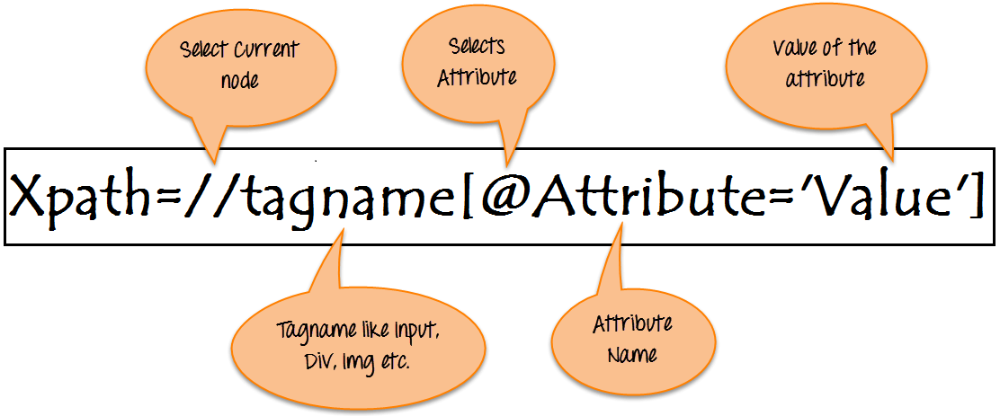
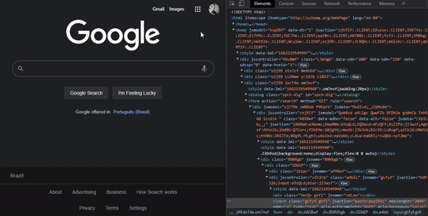
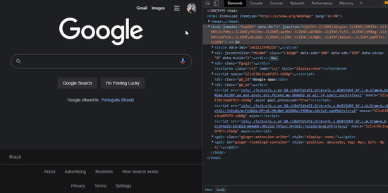
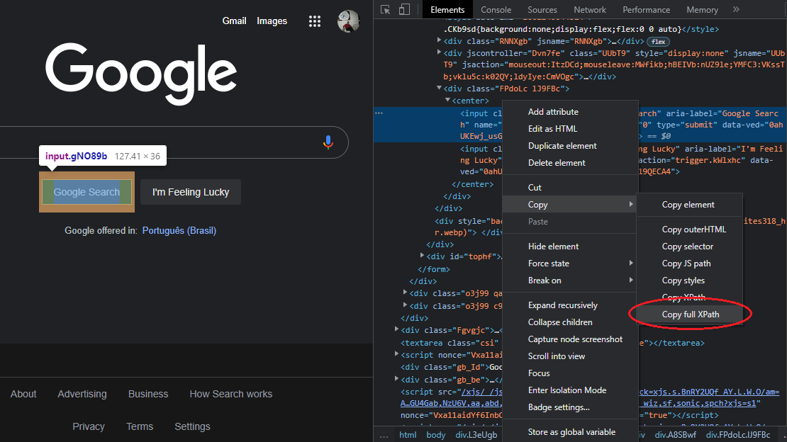

# Selenium

## Contents

 - **XPath:**
   - [What is XPath in Selenium?](#intro)
   - [Absolute XPath](#axpth)
   - [Relative Xpath](#rxpth)
 - **Examples:**
   - [Taking a screenshot of the current window](#take-ss)
   - [Getting temperature from Google](#get-temperature)
 - [Settings](#settings)
 - [References](#ref)


<!--- ( XPath ) --->

---

<div id="intro"></div>

## What is XPath in Selenium?

> **XPath in Selenium** is an XML path <u>used for navigation through the HTML structure of the page</u>.

**NOTE:**  
**XPath** can be used for both *HTML* and *XML* documents to find the location of any element on a webpage using **HTML DOM structure**.

The basic format of XPath in selenium is explained below with screen shot:

  

**Syntax for XPath selenium:**
```
Xpath=//tagname[@attribute='value']
```

---

<div id="axpth"></div>

## Absolute XPath

It is the direct way to find the element.

> **NOTE:**  
> But the <u>disadvantage</u> of the absolute XPath is that <u>if there are any changes made in the path of the element then that XPath gets failed</u>.

For example:

**Absolute XPath:**
```
/html/body/div[2]/div[1]/div/h4[1]/b/html[1]/body[1]/div[2]/div[1]/div[1]/h4[1]/b[1]
```

  

> **NOTE:**  
> The key characteristic of XPath is that it begins with the **single forward slash(/)**,which means you can select the element from the root node.

---

<div id="rxpth"></div>

## Relative XPath

**Relative XPath** starts from the middle of **HTML DOM structure**.

 - It starts with **double forward slash (//)**;
 - It can search elements anywhere on the webpage, means no need to write a long XPath and you can start from the middle of HTML DOM structure.
 - Relative XPath is always preferred as it is not a complete path from the root element.

For example:

**Relative XPath:**
```
//div[@class='featured-box cloumnsize1']//h4[1]//b[1]
```

  


<!--- ( Examples ) --->

<div id="take-ss"></div>

## Taking a screenshot of the current window

To take a screenshot of the current window is very easy using the **save_screenshot()** method provided by the webdriver:

[screenshot-example.py](src/screenshot-example.py)
```python
from selenium import webdriver
from selenium.webdriver.chrome.service import Service

service = Service(executable_path="C:\WebDriver\chromedriver")

driver = webdriver.Chrome(service=service)
driver.get('http://www.python.org/')
driver.save_screenshot('../images/python-page-screenshot.png')
driver.quit()
```

**Saved screenshot:**  
  

---

<div id="get-temperature"></div>

## Getting temperature from Google

To get a temperature from Google first we need planning the steps:

 - Open the Browser;
 - Access the Google;
 - Enter the search (temperature);
 - Click to find;
 - Found the temperature;
 - Finally, save the temperature.

### Opening the browser and access the Google page

Let's start by opening the browser and access the Google page:

```python
from selenium import webdriver
from selenium.webdriver.chrome.service import Service

service = Service(executable_path="C:\WebDriver\chromedriver")

driver = webdriver.Chrome(service=service) # Select the browser (Chrome).
driver.get('https://www.google.com/') # Open the browser with Google page.

driver.quit() # Closed the browser.
```

### Typing search text in the browser

> Now, let's typing search text in the browser.

**NOTE:**  
But, before typing search text in the browser first we need to know what element will receive that text.

To know what element represents the search field first, let's inspect it:

  

Click in top left arrow to find elements passing the mouse:

  

Ok, see that this element has many attributes:

```html
<input
    class="gLFyf gsfi"
    jsaction="paste:puy29d;"
    maxlength="2048"
    name="q"
    type="text"
    aria-autocomplete="both"
    aria-haspopup="false"
    autocapitalize="off"
    autocomplete="off"
    autocorrect="off"
    autofocus=""
    role="combobox"
    spellcheck="false"
    title="Search"
    value=""
    aria-label="Search"
    data-ved="0ahUKEwjXiuDqhfb5AhUhFbkGHbzeAk0Q39UDCAQ">
```

> **NOTE:**  
> Now, let's use **name="q"** attribute to find this element with Selenium and pass text search for him.

To Apply this we use:

 - **find_element()** method from webdriver:
   - To find element in the page.
 - **By class**:
   - To find a specific element with "x" attribute (NAME) and "y" value ("q").
 - **send_keys()** method to send text to the specific element.

```python
//

from selenium.webdriver.common.keys import Keys
from selenium.webdriver.common.by import By

//

# Find element with attribute NAME="q" and pass "temperature now" for him.
elem = driver.find_element(By.NAME, "q").send_keys("temperature now")

//
```

Ok, now we need do our script (program) press enter in the browser. Let's inspect button element to find a specific attribute to works with:

  

```html
<input
    class="gNO89b"
    value="Google Search"
    aria-label="Google Search"
    name="btnK"
    role="button"
    tabindex="0"
    type="submit"
    data-ved="0ahUKEwji5YrXkvb5AhUtK7kGHWKEBiYQ4dUDCA0">
```

> **NOTE:**  
> - Now we can try find this element with Selenium using **name="btnK"** and work with.
> - However, here we have a problem. This HTML page has two elements with attribute **name="btnK"**.

To solve this we use **XPATH** approach, first we need get **XPATH** to the button element:

  

Now just use **find_element()** and **By.XPATH** to find this element and click() method to press enter in the browser.

```python
//

# Find element by XPATH attribute and use the click() method him.
driver.find_element(
    By.XPATH, "/html/body/div[1]/div[3]/form/div[1]/div[1]/div[3]/center/input[1]"
).click()

//
```

### Getting result from search

Finally, let's get result from the search, but first we need to inspect this element:

  

**outerHTML:**  
```python
<span
    class="wob_t q8U8x"
    id="wob_tm"
    style="display:inline">24
</span>
```

Ok, now we can use this ID to find this element and get the temperature:

```python
# Find element by ID and return the result as a text.
temperature = driver.find_element(By.ID, "wob_tm").text

print("\nDaily Temperature:", temperature)
```

**NOTE:**  
See that we used the **text** attribute to get a return as a text.

The full script (program) was:

[temp_from_google.py](src/temp_from_google.py)
```python
from selenium import webdriver
from selenium.webdriver.chrome.service import Service

from selenium.webdriver.common.keys import Keys
from selenium.webdriver.common.by import By

service = Service(executable_path="C:\WebDriver\chromedriver")

driver = webdriver.Chrome(service=service) # Select the browser (Chrome).
driver.get('https://www.google.com/') # Open the browser with Google page.

# Maximize the window.
driver.maximize_window()

# Find element with attribute NAME="q" and pass "temperature now" for him.
driver.find_element(By.NAME, "q").send_keys("temperature now")

# Find element by XPATH attribute and use the click() method him.
driver.find_element(
    By.XPATH, "/html/body/div[1]/div[3]/form/div[1]/div[1]/div[3]/center/input[1]"
).click()

# Find element by ID and return the result as a text.
temperature = driver.find_element(By.ID, "wob_tm").text

driver.quit() # Closed the browser.

# Print the result.
print("\nDaily Temperature:", temperature)
```

**OUTPUT:**
```python
Daily Temperature: 24
```


<!--- ( Settings ) --->

---

<div id="settings"></div>

## Settings

**CREATE VIRTUAL ENVIRONMENT:**  
```bash
python -m venv environment
```

**ACTIVATE THE VIRTUAL ENVIRONMENT (Windows):**  
```bash
source environment/Scripts/activate
```

**ACTIVATE THE VIRTUAL ENVIRONMENT (Linux):**  
```bash
source environment/bin/activate
```

**UPDATE PIP:**
```bash
python -m pip install --upgrade pip
```

**INSTALL PYTHON DEPENDENCIES:**  
```bash
pip install -U -v --require-virtualenv -r requirements.txt
```

> **NOTE:**  
> - Selenium requires a driver to interface with the chosen browser.
> - For example, **Firefox** requires [geckodriver](https://github.com/mozilla/geckodriver/releases), which needs to be installed.

Supported browsers will have their own drivers available. Links to some of the more popular browser drivers follow:

| Driver       | Link                                                                  |
|--------------|-----------------------------------------------------------------------|
| **Chrome:**  | https://sites.google.com/chromium.org/driver/                         |
| **Edge:**    | https://developer.microsoft.com/en-us/microsoft-edge/tools/webdriver/ |
| **Firefox:** | https://github.com/mozilla/geckodriver/releases                       |
| **Safari:**  | https://webkit.org/blog/6900/webdriver-support-in-safari-10/          |

**NOTE:**  
Make sure it’s in your **PATH**, e. g., place it in *(for example, <u>chromedriver binary</u>)* **/usr/bin** or **/usr/local/bin**.

**Linux example (you will need sudo permission):**  

```bash
sudo cp yourdrive /usr/bin
```

or

```bash
sudo cp yourdrive /usr/local/bin
```

For more information about driver installation, please refer the [official documentation (Install browser drivers)](https://www.selenium.dev/documentation/webdriver/getting_started/install_drivers/).

### Using Drivers for Windows

> To use a specific driver for Windows you need specific the ***.exe PATH***.

For example:

 1. Download a specific driver;
 2. Create a folder *C:\WebDriver*;
 3. Put you **.exe** (for example, chromedriver.exe) in *C:\WebDriver*;

Ok, now you have an ***.exe*** to set in your code:

```python
service = Service(executable_path="C:\WebDriver\chromedriver")
```


<!--- ( References ) --->

---

<div id="ref"></div>

## References

 - [1. Installation](https://selenium-python.readthedocs.io/installation.html)
 - [XPath in Selenium: How to Find & Write Text, Contains, OR, AND](https://www.guru99.com/xpath-selenium.html)
 - [How to find element by XPath in Selenium with Example](https://www.browserstack.com/guide/find-element-by-xpath-in-selenium)
 - [Aprenda Automação WEB em 10 minutos! (Selenium com Python)](https://www.youtube.com/watch?v=myQIZElpXTU)

---

Ro**drigo** **L**eite da **S**ilva - **drigols**
