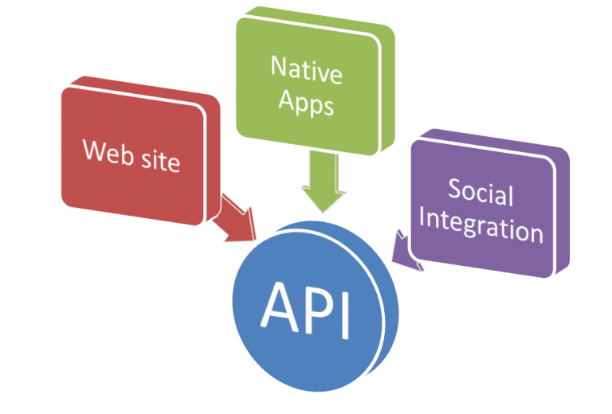

# RESTful API  
  
[](LICENSE.md)  
  
  
  
 - [O que é API?](#o-que-é-api)  
 - [Representações](#representações)  
 - [Introdução a REST](#introdução-a-rest)  
 - [REST x RESTful](#rest-x-restful)  
 - [Resource](#resource)  
 - [URI](#uri)  
 - [URL](#url)  
 - [O que é REST?](#o-que-é-rest)  
 - [Constraints](#constraints)  
 - [cURL](#curl)  
 - [Testando cURL](#testando-curl)  
 - [Métodos HTTP](#métodos-http)  
   - [GET](#get)  
   - [POST](#post)  
   - [PUT](#put)  
   - [DELETE](#delete)  
   - [HEAD](#head)  
   - [PATCH](#patch)  
   - [OPTIONS](#options)  
   - [TRACE](#trace)  
   - [CONNECT](#connect)  
 - [Safe Methods](#safe-methods)  
 - [Métodos Idempotentes](#métodos-idempotentes)  
 - [Media Types](#media-types)  
 - [Gerindo erros](#gerindo-erros)  
   - [1xx Informacional](#1xx-informacional)  
   - [2xx Success](#2xx-success)  
   - [3xx Redirection](#3xx-redirection)  
   - [4xx Client Error](#4xx-client-error)  
   - [5xx Server Error](#5xx-server-error)  
 - [Versionamento](#versionamento)  
 - [Caching](#caching)   
 - [Autenticação](#autenticação)  
 - [Identificação x Autenticação x Autorização](#identificação-x-autenticação-x-autorização)  
 - [Autenticação baseada em Token](#autenticação-baseada-em-token)  
 - [Swagger](#swagger)  
  
## O que é API?  
  
O acrônimo __API__ que provém do inglês __Application Programming Interface__ (Em português, significa Interface de Programação de Aplicações), trata-se de um conjunto de rotinas e padrões estabelecidos e documentados por uma aplicação __"A"__, para que outras aplicações consigam utilizar as funcionalidades desta aplicação __"A"__, sem precisar conhecer detalhes da implementação do software.  
  
Desta forma, entendemos que as __APIs__ permitem uma <u>interoperabilidade</u> entre aplicações. Em outras palavras, a comunicação entre aplicações e entre os usuários.  
  
__Exemplo de API: Twitter Developers__  
  
  
  
## Representações  
  
Agora que já sabemos que uma __API__ permite a __interoperabilidade entre usuários e aplicações__, isso reforça ainda mais a importância de pensarmos em algo padronizado e, de preferência, de fácil representação e compreensão por humanos e máquinas.  
  
Veja esses três exemplos:  
  
__XML__  
```xml  
<endereco>  
  <rua>  
    Rua Pedro  
  </rua>  
  <cidade>  
    Rodrigo Leite  
  </cidade>  
</endereco>  
```  
  
__JSON__  
```json  
{ 
  "endereco":  
  {  
    "rua": "Rua Pedro",  
    "cidade": "Rodrigo Leite"  
  }  
}  
```  
  
__YAML__  
```yaml  
endereco:  
rua: rua Pedro  
cidade: Rodrigo Leite  
```  
  
Qual deles você escolheria para informar o endereço em uma carta? Provavelmente o último, por ser de fácil entendimento para humanos, não é mesmo? Contudo, as 3 representações são válidas, pois nosso entendimento final é o mesmo, ou seja, a semântica é a mesma.  
  
 - Por outro lado, você deve concordar comigo que a primeira representação (formato XML) é mais verbosa, exigindo um esforço extra por parte de quem está escrevendo;  
 - No segundo exemplo (formato JSON) já é algo mais leve de se escrever;  
 - Já o último (formato YAML), é praticamente como escrevemos no dia a dia.  
  
## Introdução a REST  
  
__REST__ significa __Representational State Transfer__. Em português, "Transferência de Estado Representacional". Trata-se de uma abstração da arquitetura da Web. Resumidamente, o __REST__ consiste em:  
  
 - Princípios  
 - Regras  
 - Constraints...  
  
que, quando seguidas, permitem a criação de um projeto com interfaces bem definidas. Desta forma, permitindo, por exemplo, que aplicações se comuniquem.  
  
## REST x RESTful  
  
Existe uma certa confusão quanto aos termos __REST__ e __RESTful__. Entretanto, ambos representam os mesmo princípios. A diferença é apenas gramatical. Em outras palavras, sistemas que utilizam os princípios __REST__ são chamados de __RESTful__.  
  
 - __REST:__ Conjunto de princípios de arquitetura;  
 - __RESTful:__ Capacidade de determinado sistema aplicar os princípios de __REST__.  
   
## Resource  
  
Recursos são elementos de informação, que através de um __identificador global__ podem ser manipulados. Ou seja, recursos são <u>coisas</u>, que podem ser manipuladas através de um __ID__:  
  
```  
recurso: Usuário    id: www.meusite.com/user  
```  
  
No exemplo acima temos duas coisas importantes a saber:  
  
 - First: O recurso(resource) é __"usuário"__;  
 - Second: O identificador global é __"/user"__;  
   
> A nomeação de um recurso sempre é formada por um __substantivo__, nunca um __verbo__.  
  
Isso porque um recurso é sempre algo que você deseja manipular, exemplo:  
  
 - Um usuário;  
 - Uma empressora...  
  
## URI  
  
__URI (Uniform Resource Identifier)__, em português significa "Identificador Uniforme de Recursos", é uma cadeia de caracteres compacta usada para __identificar ou denominar um recurso na Internet__.  
  
```  
recurso: Usuário    uri: www.meusite.com/user  
```  
  
Por exemplo, lembra que nós temos o recurso __/user__? Então, com a __URI__ nós podemos afirmar que unicamente esse recurso está em meu site. <u>Pode ser que haja esse recurso "/user" em outros sites, mas esse em questão está no meu site</u>.  
  
## URL  
  
Um __URL (Uniform Resource Locator)__, ou em português, "Localizador-Padrão de Recursos", é o __endereço de um recurso__ disponível em uma rede.  
  
```  
Ex: recurso: Impressora  
url/uri: http://www.meusite.com/print  
```  
  
Vejam que no exemplo acima nós temos 3 partes importantes:  
  
 - Recurso: /print (impressora);  
 - URI: www.meusite.com;  
 - URL: http://www.meusite.com/print  
  
Então, a __URL__ nada mais é do que a junção: __recurso__ + __URI__ + __protocolo(http/https)__ = __URL__.  
  
## O que é REST?  
  
O termo transferência de estado representacional - __REST (Representational State Transfer)__ foi introduzido e definido no ano de 2000 através de uma tese de Ph.D do Cientista __Roy Fielding__, um dos principais autores da especificação do protocolo __HTTP__.  
  
O intuito geral da tese era a __formalização__ de um conjunto de __melhores prática__ denominadas __constraints__. Essas __constraints__ tinham como objetivo determinar a forma na qual padrões como __HTTP__ e __URI__ deveriam ser modelados, aproveitando de fato todos os recurso oferecidos pelos mesmos.  
  
## Constraints  
  
__Constraints: Cliente-Servidor__  
  
> A principal característica dessa constraint é __separar as responsabilidades__ de diferentes partes de um sistema.
  
 - Front-end: Client  
 - Back-End: Servidor  
  
Essa divisão pode-se dar de diversas formas, iniciando por exemplo com uma separação entre mecanismos de __interface do usuário__ e o __back-end__ da aplicação.  
  
> Isso nos permite a evolução e __escalabilidade__ destas responsabilidades __de forma independente__.  
  
__Constraints: Stateless (Sem estado)__  
  
Essa característica propõe que __cada requisição__ ao servidor __não deve ter ligação com requisições ANTERIORES ou FUTURAS__, ou seja, cada requisição deve conter todas as informações necessárias para que ela seja tratada com sucesso pelo servidor.  
  
__Constraints: Cache__  
  
Para uma melhor performance, um sistema __REST__ deve __permitir__ que suas respsotas sejam passíveis de __cache__.  
  
__Constraints: Interface Uniforme__  
  
Bastante esforço deve ser feito para que o sistema possua uma __interface modelada__ seguindo alguns padrões importantes. Quando se fala sobre uma interface, os elementos abaixo devem ser considerados:  
  
 - Recursos;  
 - Mensagens autodescritivas;  
 - Hypermedia...  
  
__Constraints: Sistema em Camadas__  
  
Com o intuito de permitir que a escalabilidade necessária para grandes sistemas distribuídos, um sistema __REST__ deve ter a capacidade de adicionar elementos intermediários e que sejam totalmente transparentes para seus clientes.  
  
> Ex: Balanceador de carga  
  
Por exemplo, suponha que nós temos um sistema que recebe inúmeras requisições, seria importante criar um __balanceador de carga__ para dizer __"Não esse acesso aqui que esse IP de determinador computador fez vai ser resolvidor a partir de determinador servidor e na mesma hora chega outra requisição, então ele diz você aqui vai ser tratado por esse outro servidor__.  
  
__Constraints: Código Sob Demanda__  
  
> Código sob demanda é a única constraint REST __opcional__.  
  
A ideia é aumentar a flexibilidade dos clientes, como por exemplo um código JavaScript que só é baixado quando uma determinada página é carregada.  
  
## cURL  
  
> https://curl.haxx.se/  
  
O __cURL__ é uma ferramenta para __CRIAR REQUISIÇÕES__ em diversos protocolos __(incluindo HTTP, HTTPS e FTP, entre muitos outros)__ e obter conteúdo remoto. Ele existe como ferramenta de __linha de comando__, e também como biblioteca, a __libcurl__.  
  
Uma requisição do __cURL__ é composta:  
  
 - Da palavra __curl__;  
 - Da __URL__ a qual você quer acessar;  
 - E um __conjunto de opções__ que permitem você modificar qualquer coisa na requisição que será enviada.  
  
__-H:__  
É um atalho para __Header__. Essa opção permite adicionar ou substituir campos do cabeçalho HTTP.  
  
```  
curl -H "Content-Type: application/json"  
```  
  
__-d:__  
É um atalho para __data__. É esta opção que vamos usar quando queremos __enviar dados__ para o servidor.  
  
__Exemplo com um payload JSON:__  
  
```  
curl -d '{"name": "Rodrigo Leite"}'  
```  
  
__-i, -include:__  
Quando usamos esta opção, o cURL não mostrará apenas o __corpo__ da resposta enviada do servidor, mas também o __cabeçalho/HEADER__.  
  
__-I, -head:__  
Esta opção diz ao cURL para fazer uma requisição do tipo __HEAD__ que irá __trazer apenas o cabeçalho do documento sem o corpo__.  
  
__-X, -request:__  
Esta opção __especifica qual verbo/método__ HTTP que queremos usar. O padrão é o GET mas nós podemos usar também:  
  
 - GET  
 - POST  
 - PUT  
 - PATCH  
 - DELETE  
  
Nós também podemos utilizar um site responsável apenas por testar requisições com o __cURL__. Veja o link abaixo:  
  
## Testando cURL  
  
Um site bem interessante para quem está começando é o __JSONPlaceholder__. Esse site prover recursos no qual podemos utilizar como teste. A própria descrição do site deixa bem claro __"Fake Online REST API for Testing and Prototyping"__.  
  
> https://jsonplaceholder.typicode.com/  
  
Lá você tem vários recursos que podem ser utilizado para testes:  
  
__Resources:__  
```  
/posts  
/comments  
/albums  
/photos  
/todos  
/users  
```  
  
Por exemplo, se você clicar em __/users__ vão ter vários recursos usuários que você pode requisitar para teste:  
  
```json  
[
  {
    "id": 1,
    "name": "Leanne Graham",
    "username": "Bret",
    "email": "Sincere@april.biz",
    "address": {
      "street": "Kulas Light",
      "suite": "Apt. 556",
      "city": "Gwenborough",
      "zipcode": "92998-3874",
      "geo": {
        "lat": "-37.3159",
        "lng": "81.1496"
      }
    },
    "phone": "1-770-736-8031 x56442",
    "website": "hildegard.org",
    "company": {
      "name": "Romaguera-Crona",
      "catchPhrase": "Multi-layered client-server neural-net",
      "bs": "harness real-time e-markets"
    }
  },
  {
    "id": 2,
    "name": "Ervin Howell",
    "username": "Antonette",
    "email": "Shanna@melissa.tv",
    "address": {
      "street": "Victor Plains",
      "suite": "Suite 879",
      "city": "Wisokyburgh",
      "zipcode": "90566-7771",
      "geo": {
        "lat": "-43.9509",
        "lng": "-34.4618"
      }
    },
    "phone": "010-692-6593 x09125",
    "website": "anastasia.net",
    "company": {
      "name": "Deckow-Crist",
      "catchPhrase": "Proactive didactic contingency",
      "bs": "synergize scalable supply-chains"
    }
  }
]  
```  
  
Vamos utilizar o __curl__ para fazer uma requisição HTTP e pegar o segundo usuário com o seu cabeçalho. Lembrando que para pegar o cabeçalho basta utilizar a opção __-i__:  
  
__Input:__  
```  
curl -i https://jsonplaceholder.typicode.com/users/2  
```  
  
__Output:__  
```json  
HTTP/1.1 200 OK
Date: Sat, 03 Mar 2018 19:43:51 GMT
Content-Type: application/json; charset=utf-8
Content-Length: 509
Connection: keep-alive
Set-Cookie: __cfduid=d8758bb1707981074092ebd73e94f47a81520106231; expires=Sun, 03-Mar-19 19:43:51 GMT; path=/; domain=.typicode.com; HttpOnly
X-Powered-By: Express
Vary: Origin, Accept-Encoding
Access-Control-Allow-Credentials: true
Cache-Control: public, max-age=14400
Pragma: no-cache
Expires: Sat, 03 Mar 2018 23:43:51 GMT
X-Content-Type-Options: nosniff
Etag: W/"1fd-XTG63SYhaP/Uo6/vgmARnL3rpBk"
Via: 1.1 vegur
CF-Cache-Status: REVALIDATED
Expect-CT: max-age=604800, report-uri="https://report-uri.cloudflare.com/cdn-cgi/beacon/expect-ct"
Server: cloudflare
CF-RAY: 3f5e9829d9954c18-GRU

{
  "id": 2,
  "name": "Ervin Howell",
  "username": "Antonette",
  "email": "Shanna@melissa.tv",
  "address": {
    "street": "Victor Plains",
    "suite": "Suite 879",
    "city": "Wisokyburgh",
    "zipcode": "90566-7771",
    "geo": {
      "lat": "-43.9509",
      "lng": "-34.4618"
    }
  },
  "phone": "010-692-6593 x09125",
  "website": "anastasia.net",
  "company": {
    "name": "Deckow-Crist",
    "catchPhrase": "Proactive didactic contingency",
    "bs": "synergize scalable supply-chains"
  }
```  
  
Vejam que realmente nós pegamos o corpo(dados) do recurso "users/" com o "id=1" e seu cabeçalho HTTP. Outro exemplo, suponha que agora nós precisamos pegar só o cabeçalho(header) da requisição como fazer? Simples, basta utilizar a opção __-I__:  

__Input:__  
```  
curl -I https://jsonplaceholder.typicode.com/users/2  
```  
  
__Output:__  
```json  
HTTP/1.1 200 OK
Date: Sat, 03 Mar 2018 19:50:56 GMT
Content-Type: application/json; charset=utf-8
Content-Length: 509
Connection: keep-alive
Set-Cookie: __cfduid=dfb642d31c1d639894d7c6342a90abd2a1520106656; expires=Sun, 03-Mar-19 19:50:56 GMT; path=/; domain=.typicode.com; HttpOnly
X-Powered-By: Express
Vary: Origin, Accept-Encoding
Access-Control-Allow-Credentials: true
Cache-Control: public, max-age=14400
Pragma: no-cache
Expires: Sat, 03 Mar 2018 23:50:56 GMT
X-Content-Type-Options: nosniff
Etag: W/"1fd-XTG63SYhaP/Uo6/vgmARnL3rpBk"
Via: 1.1 vegur
CF-Cache-Status: HIT
Expect-CT: max-age=604800, report-uri="https://report-uri.cloudflare.com/cdn-cgi/beacon/expect-ct"
Server: cloudflare
CF-RAY: 3f5ea2896b3a4b39-GRU  
```  
  
## Métodos HTTP  
  
Existem __9 verbos/métodos__ os quais podemos utilizar para a criação de uma __API RESTFul__. Esse conjunto de métodos possui a semântica de operações possíveis de serem efetuadas sob um determinado __recurso__.  
  
Na especificação original do HTTP existiam apenas 3 verbos/métodos (GET, POST, HEAD). Na revisão 1.1 do HTTP foram adicionados mais 5 verbos/métodos (OPTIONS, PUT, DELETE, TRACE e CONNECT). A RFC 5789(especificação) estendeu o HTTP com um novo verbo/método PATCH.  
  
 - GET  
 - POST  
 - HEAD  
 - OPTIONS  
 - PUT  
 - DELETE  
 - TRACE  
 - CONNECT  
  
## GET  
O método __GET__ é utilizado quando existe a necessidade de se obter um recurso. Ele é considerado __idempotente__, ou seja, independente da quantidade de vezes que é executado sob um recurso, o resultado sempre será o mesmo. <u>O verbo/método GET já é o padrão de requisições</u>:  
  
__Input:__  
```  
curl https://jsonplaceholder.typicode.com/users/2  
```  
  
__Ouput:__  
```json  
{
  "id": 2,
  "name": "Ervin Howell",
  "username": "Antonette",
  "email": "Shanna@melissa.tv",
  "address": {
    "street": "Victor Plains",
    "suite": "Suite 879",
    "city": "Wisokyburgh",
    "zipcode": "90566-7771",
    "geo": {
      "lat": "-43.9509",
      "lng": "-34.4618"
    }
  },
  "phone": "010-692-6593 x09125",
  "website": "anastasia.net",
  "company": {
    "name": "Deckow-Crist",
    "catchPhrase": "Proactive didactic contingency",
    "bs": "synergize scalable supply-chains"
  }
}  
```  
  
__NOTE:__  
> Como o __GET__ já é o verbo/método padrão nós precisamos passar o argumento __-X__ para espeficiar.  
  
## POST  
O verbo/método __POST__ é utilizado para a crição de um item do recurso a partir do uso de uma representação. Ou seja, suponha que nós temos um recurso usuários, nós vamos criar um novo item usuário.  
  
__Input:__  
```  
curl -X POST www.exemplo.com/client \  
-H "Content-Type: application/json" \  
-d '{"name": "Rodrigo"}'  
```  
  
__NOTE:__  
Uma observação no exemplo acima é a seguinte, quando nós precisamos passar muitos argumentos para o verbo/método __POST__, nós podemos utilizar barra invertida __" \ " (barra invertida)__ para que seja possível quebra de linha na mesma chamada do __POST__.  
  
## PUT  
O método __PUT__ é utilizado como forma de atualizar um determinado recurso.  
  
```  
curl -X POST www.exemplo.com/client \  
-H "Content-Type: application/json" \  
-d '{"name": "Novo nome"}'  
```  
  
## DELETE  
O __DELETE__ tem como finalidade a remoção de um determinado recurso.  
  
```  
curl -X DELETE www.exemplo.com/client/1  
```  
  
Esses métodos são similares a operações no Banco de Dados, veja o exemplo abaixo:  
  
  
  
## HEAD  
O verbo/método __HEAD__ é muito parecido com o método __GET__, a única diferença é que o servidor não retornará o __"body"__ depois de receber a requisição.  
  
__Exemplo:__  
  
```  
curl -I -v http://www.example.com/users  
```  
  
## PATCH  
O método __PATCH__ faz "modificiações parciais nos recursos", ou seja, fazer a alteração de valores específicos de um recurso, ao invés de enviar todos os dados novamente.  
  
Enquanto o verbo/método __PUT__ só permite a "substituição" inteira do recurso, o __PATCH__ permite modificações parciais.  
  
__Exemplo:__  
  
```  
curl -X PATCH -v http://www.example.com/users/1 \  
-H "Content-Type": application/json" \  
-d '{"age": 26}'  
```  
  
Veja que nesse exemplo nós estamos auterando apenas o item idade(age) do recurso usuário(users/1).  
  
> Com o verbo/método __PUT__ é necessário atualizar todos os itens(campos) do recurso mesmo que você só deseje atualizar um deles.  
  
## OPTIONS  
O verbo/método __OPTIONS__ é a forma que o cliente possui de perguntar ao servidor quais os requisitos para um determinado recurso.  
  
Por exemplo, o __OPTIONS__ pode ser usado para saber quais métodos podem ser aplicados a um determinado recurso, ou qual a URL permitida para se comunicar com um determinado recurso.  
  
> A ideia do __OPTIONS__ é você pergunta a um determinado recurso o que você pode fazer com ele. Quais verbos/métodos eu posso utilizar nesse recurso?  
  
__Exemplo:__  
  
```  
curl -i -X OPTIONS http://www.example.com/users/1  
```  
  
## TRACE  
Ecoa de volta a requisição recebida para que o cliente veja se houveram mudanças a adições feitas por servidores intermediários.  
  
> O verbo/método __TRACE__ por questões de segurança sempre fica desabilitado nos servidores.  
  
## CONNECT  
Converte a requisição de conexão para um túnel __TCP/IP__ transparente, usualmente para facilitar comunicação criptografada com SSL (HTTPS) através de um proxy HTTP não criptografado.  
  
## Safe Methods  
  
__Safe Methods__ são métodos que são considerados __"salvos"__. Eles não fazem nenhum efeito de qualquer um dos lados (cliente/servidor).  
  
Você até pode implementar algo para que quando um __safe method__ for chamado, como por exemplo atualizar o contador de um usuário, mas, o cliente não pode ser o responsável por essa alteração.  
  
Os __safe methods__ são:  
  
 - GET  
 - HEAD  
  
> Veja que esses métodos não alteram as informações do servidor. Ele apenas pega as informações para quem a chamou.  
  
## Métodos Idempotentes  
  
Idempotência é uma propriedade de algumas operações matemática e da Ciências da Computação, que quando __"rodadas/executadas"__ mútiplas vezes o resultado não será alterado depois da primeira vez.  
  
Os método idempotentes são:  
  
 - GET  
 - HEAD  
 - PUT  
 - DELETE  
 - OPTIONS  
 - TRACE  
  
## Media Types  
  
__Media type__ é uma string que definal qual o formato do dado e como ele deve ser lido pela máquina. Isso permite um computador diferenciar entre __JSON__ e __XML__, por exemplo. Um media type é composto por duas partes:  
  
 - A primeira parte refere-se ao tipo  
 - A segunda ao subtipo  
  
A primeira parte contém um tipo registrado de alto nível, que pode ser:  
  
 - application  
 - audio  
 - examples  
 - image  
 - message  
 - model  
 - multipart  
 - text  
 - video  
  
## Gerindo erros  
  
Naturalmente, quando fazemos requisições RESTful, receberemos como retorno um possível erro, seja por falha no formato da requisição, seja por causas internas referentes ao servidor. Isso não significa que o retorno apresentado seja uma mensagem clara, que não deixa dúvidas sobre o que aconteceu de fato.  
  
Pois bem, o intuito da gerência de erros em APIs Restful é __informar__ ao __requisitante__ uma mensagem que retrate o que de fato ocorreu. Mais do que isso, um status code que não seja genérico e sim, útil.  
  
Existem 5 classes de __HTTP Status Code__. São elas:  
  
## 1xx Informacional  
  
Códigos começados com __1__ são conhecidos como códigos informacionais. A maioria deles não são usados nos dias atuais.  
  
## 2xx Success  
  
Esses códigos indicam que ouve sucesso no intercâmbio entre o servidor e o cliente.  
  
## 3xx Redirection  
  
Os códigos _3xx__ indicam que cliente deve fazer uma ação adicional antes da requisição estar completa.  
  
## 4xx Client Error  
  
Nesse caso, o código indica que existe algo errado com a requisição do cliente.  
  
## 5xx Server Error  
  
O cliente enviou uma requisição válida, mas o servidor não foi capaz de processá-la com sucesso.  
  
## Versionamento  
  
Versionamento não faz parte das __constraints REST__, nem também do __Modelo de Maturidade Richardson__, mas é indispensável para criar
APIs que sofrem mudanças ao longo do tempo. Dessa forma, qual a melhor forma de versionar uma API?  
  
 - 1- Subdomínio: api1.example.com/users  
 - 2- URL: example.com/v1/users  
 - 3- HTTP Header customizado: X-API-Version: 1  
 - 4- URL com paramâmetros: example.com/users?v=1  
 - 5- Accept Header com Media Type customizado: Accept: application/vnd.myapi.v2+json  
 - 6- Accept Header com opção de versão: Accept:application/vnd.myapi+json;version=2.0  
  
Atualmente, uma das mais usadas é o versionamento através de URL, por ser de fácil implementação, evitar erros por parte de programadores novatos, e permitir compartilhar URLs facilmente.  
  
__Example: Pagseguro__  
  
> https://dev.pagseguro.uol.com.br/documentacao/pagamentos/pagamento-padrao  
  
__Example: Paypal__  
  
> https://developer.paypal.com/docs/api/  
  
## Caching  
  
Caching é extremamente importante, não só para os usuários, mas também para reduzir o custo de rodar aplicações. <u>Na computação, qualquer valor que é difícil e computacionalmente custoso de obter deve ser cacheado</u>.  
  
> As únicas coisas que não devem ser cacheadas são as que mudam com muita frequência.  
  
Uma vez feito o cache, como saber que ele está desatualizado? Esse processo chama-se __cache invalidation__/invalidação de cache e não é algo simples de se fazer.  
  
Infelizmente nem tudo pode ser cacheado. Alguns dados __real-time__ precisam ser buscados todas as vezes. O restante pode ser cacheado por um período de tempo, seja alguns segundo ou um dia, dependendo da frequência em que os dados mudam.  
  
## Cache no Cliente  
  
Os objetivos do caching HTTP são __eliminar o envio de requisições o máximo possível__, e caso uma requisição precise ser feita, __reduzir os dados de resposta__. O primeiro objetivo pode ser alcançado usando-se um mecanismo de expiração conhecido como _Cache-Control_, e o segundo é através do mecanismo de validação __ETag_ ou __Last-Modified__.  
  
 - Mínimo de requisições: __Cache-Control__  
 - Mínimo de dados nas respostas: __ETag__  
  
## Autenticação  
  
Autenticação é uma parte importante de qualquer aplicação Web moderna, ela tem a missão de identificar quem está usando a aplicação e se ela tem permissão para usá-la. Alguns websites ainda gerenciam a autenticação através de __cookies__ conforme a __RFC 6265__.  
  
> ( https://tools.ietf.org/html/rfc6265 )  
  
Mas, __cookies__ são criados para permitir o servidor gravar e manter os estados __(stateful)__, o que é completamente contrário ao que o REST propõe __(stateless)__, ou seja uma requisição não depende de outra. A ideia por trás do __stateless__ é permitir aplicações web mais escaláveis e de fácil caching para serem mais efetivas.  
  
O padrão do esquema de autenticação HTTP __basic__ e através de __digest__ são stateless, mas, atualmente muitas empresas precisam identificar seus usuários e querem diminuir a barreira para que eles usem seus produtos. Isso significa não ficar pedindo a senha do
usuário frequentemente, de preferência apenas uma única vez.  
  
## API Key and API secret token  
  
Quando uma aplicação web oferece ferramentas para outras aplicações web através de API, a autenticação pode ser feita através de uma
__API Key__ ou __API secret token__ como são conhecidas.  
  
__API Key:__  
Em resumo, uma API Key é um combinação de letras e números bem grande, como um hash, e fica sendo transmitida em todas as requisições para identificar aplicação e geralmente é combinada com um email/senha. Aqui vale uma ressalva:  
  
> Como estas __API Keys__ trafegam entre o servidor e o cliente, é importante que o servidor tenha configurado os __certificados SSL__ para garantir a maior segurança possível.  
  
Diferentemente de aplicações, quando um usuário utiliza um serviço ele também deve ser identificado, geralmente com seu email/senha, mas, enviar esses dados a cada requisição com certeza não é o ideal. Para tal, uma das soluções é no momento em que o usuário faz o login, o mesmo recebe um token baseados em suas credenciais e daí pra frente o token servirá de identificação nas próximas requisições.  
  
## Identificação x Autenticação x Autorização  
  
__Identificação:__  
Para esse conceito vamos usar um exemplo. O Google Maps permite desenvolvedores que possuem apenas a API Key pesquisem endereços. Ou seja, eles usam apenas uma API Key para serem __identificados__ e caso necessário o Google pode limitar o acesso para a quantidade de requisições, por exemplo. Mas, desse modo o desenvolvedor pode repassar sua API Key para outros amigos e eles poderão usá-la também.  
  
__Autenticação:__  
A autenticação se dá quando comprovamos quem somos, usando por exemplo a combinação login/senha.  
  
__Autorização:__  
A autorização por sua vez tem o intuito de definir o que podemos ou não fazer, pois, mesmo que o sistema me identifique e me autentique, minhas credenciais podem estar permitidas a apenas ler um determinado conteúdo, por exemplo.  
  
## Autenticação baseada em Token  
  
A autenticação baseada em token consiste em enviar o usuário/senha para o servidor e receber em troca um Token que será informado em cada requisição através da header Authorization.  
  
__Input:__  
```  
curl http://www.example.com/login -i -d '{"email":"jack@jack.com", "password": "supersecret"}'  
```  
  
__Ouput:__  
```  
HTTP/1.1 200 OK  
Content-Type: application/json  
Content-Length: 51  
Connection: keep-alive  
Server: thin  
{"access_token":"6afc7f5db9eaaf7eab"}  
```  
  
__Authorization:__  
```  
curl -i -H 'Authorization: Token 6afc7f5db9eaaf7eab' http://localhost:4567  
```  
  
Geralmente essa é a escolha para o uso em Web APIs, mas ela não é considerada __stateless__ pois o __servidor precisará armazenar o Token__ e
isso caracteriza __“manter o estado”__.  
  
## Swagger  
  
O __Swagger__ é um projeto(Open-Souce) composto por algumas ferramentas que auxiliam o desenvolvedor de APIs REST em algumas tarefas como:  
 - Modelagem da API  
 - Geração de documentação (legível) da API  
 - Geração de códigos do Cliente e do Servidor, com suporte a várias linguagens de programação  
  
O __Swagger__ também provê um ecossistema de ferramentas. As principais são:  
  
 - Swagger Editor – para a criação do contrato  
 - Swagger UI – para a publicação da documentação  
 - Swagger Codegen – para geração de “esqueletos” de servidores em mais de 10 tecnologias e de clientes em mais de 25 tecnologias diferentes  
  
__Site Oficial:__  
  
> https://swagger.io/  
  
O __Swagger__ também tem uma especificação que é muito interessante de ser seguida:  
  
> https://swagger.io/specification/  
  
<strong>Rodrigo Leite - Software Engineer</strong>