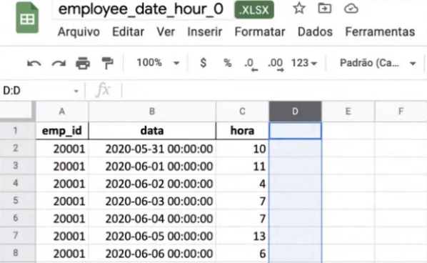
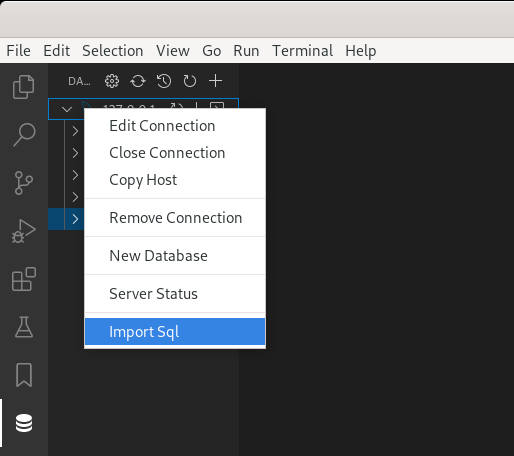

# Bootcamp de Data Science do canal Stack (Outubro 2021)

> Meus códigos e exemplos do Bootcamp de Data Science do canal [Stack do Youtube](https://www.youtube.com/c/Stack_tecnologias/featured).

  

## Conteúdo

 - **O que eu aprendi (relembrei):**
   - [01 - Data Science Lifecycle](#ds-lifecycle)
   - [02 - Começar pelo problema: Qual problema vamos resolver?](#problem)
     - [02.1 - Por onde começar](#problem-01)
     - [02.2 - Olhar para os nossos dados (MySQL, JSON, EXCEL, CSV) e relacioná-los com nosso problema](#problem-02)
     - [02.3 - Selecionar os dados que realmente são importantes para nosso problema](#problem-03)
     - [02.4 - A pergunta chave](#problem-04)
   - [03 - Como criar um Overview da solução](#overview)
   - [04 - Trabalhar com Docker](#docker)
     - [04.1 - Verificar a versão do Docker](#docker-01)
     - [04.2 - Verificar/Testar se o Docker está instalado corretamente](#docker-02)
     - [04.3 - Instalar uma imagem Docker com MySQL](#docker-03)
     - [04.4 - Verififcar Containers em Execução](#docker-04)
     - [04.5 - Executar e Parar Containers](#docker-05)
   - **05 - Trabalhar com MySQL no VSCode:**
     - [05.1 - Instalar a extensão Database Client e fazer conexão com o Banco de Dados](#vscode-01)
     - [05.2 - Importar scripts SQL no VSCode](#vscode-02)
   - **06 - Instalar e Configurar Datalakes com MinIO Server**
     - [06.1 - Criar o sistema de diretórios e Instalar um container com MinIO Server](#datalake-01)
     - [06.2 - Criar Buckets com o MinIO Server](#datalake-02)
   - **07 - Instalar e Configurar o Airflow:**
     - [07.1 - Criar os diretórios para trabalhar com o Airflow](#airflow-01)
     - [07.2 - Criar um container com o Airflow e se conectar no Servidor Web](#airflow-02)
     - [07.3 - Se conectar a um container docker (Airflow no nosso caso)](#airflow-03)
     - [07.4 - Instalar bibliotecas dentro de um container (Airflow no nosso caso)](#airflow-04)
     - [07.5 - Criar variáveis do Airflow](#airflow-05)
   - **08 - Trabalhar com Modelagem de Dados em um projeto real:**
     - [08.1 - Introdução e visão geral](#data-model-01)

---

<div id="ds-lifecycle"></div>

## 01 - Data Science Lifecycle

Bem, o **Data Science Lifecycle** nada mais é do que:

> **O Ciclo de Vida de um Projeto de Data Science.**

Veja como funciona esse ciclo abaixo:

  

---

<div id="problem"></div>

## 02 - Começar pelo problema: Qual problema vamos resolver?

Um problema que eu tinha até então *(estou tentando melhorar com isso)* é só estudar, estudar e estudar e não resolver nenhum tipo de problema.

> **Você tem que ter em mente que *Programadores*, *Cientistas de Dados*, *Engenheiros* `resolvem problemas` e não ficam só estudando!**

**Sabendo disso, qual tipo de problema nós vamos resolver nesse Bootcamp?**  
Bem, não sei se vocês já sabem, mas é muito **difícil (e caro)** uma empresa contratar um profissional que atenda aos requisitos da empresa. Por isso, é muito interessante que quando contratado o profissional permaneça o máximo de tempo possível na empresa.

> **Mas como impedir (ou tentar) que esses profissionais não saiam da empresa?**

**NOTE:**  
Esse é o problema que nós vamos tentar resolver.

Para resolver esse problema, nós vamos ter que responder várias questões como:

 - Quais fatores influenciam para um colaborador deixar a empresa?
 - Como reter esses colaboradores?
 - Podemos nos antecipar e saber se um determinado colaborador vai sair *(ou tentar)* da empresa?
 - Como diminuir o *turnover*?
   - **Turnover:** Turnover significa a taxa de rotatividade de colaboradores em uma empresa. Ou seja, o número de novos colaboradores comparado àqueles profissionais que deixam o ambiente de trabalho. Esse é um termo popular no setor de Recursos Humanos, relacionado com contratações e desligamentos de colaboradores.

<div id="problem-01"></div>

## 02.1 - Por onde começar

> Uma pergunta crucial na hora de iniciar em um projeto de Data Science é saber por onde começar.

Vale salientar que esse começo muitas vezes vai ser voltado para o nosso problema. Por exemplo, `tentar responder com dados` as perguntas do nosso problema.

 - **Quais fatores influenciam para um colaborador deixar a empresa?**
   - *Pessoa satisfeita?*
   - *Ambiente de trabalho?*
     - *Cargo, Departamento...*
   - *Salário?*
   - *Tempo na empresa?*
 - **Podemos nos antecipar e saber se um determinado colaborador vai sair *(ou tentar)* da empresa?**
   - *Desempendo do colaborador.*
   - *Carga de trabalho.*
 - **Como diminuir o *turnover*?**
 - **Como reter esses colaboradores?**

<div id="problem-02"></div>

## 02.2 - Olhar para os nossos dados (MySQL, JSON, EXCEL, CSV) e relacioná-los com nosso problema

> **Uma maneira inteligente aqui seria relacionar os dados que nos foi disponibilizado com o nosso problema.**

Por exemplo, suponha que nós temos a seguinte modelagem de dados:

  

**NOTE:**  
Agora suponha que a empresa tinha outra empresa terceirizada responsável por fazer uma avaliação de desempenho dos funcionários. Imagine que essa empresa nos deu os seguintes dados para nos ajudar a resolver nosso problema:

  

Veja que agora nós temos dados no formado **JSON**, referentes:

 - **Nível de satisfação do funcionário *(satistaction_level)*:**
   - Que seria uma nota de quanto *por cento (%)* o funcionário está satisfeito com a empresa.
 - **Última avaliação do funcionário *(last_evaluation)*:**
   - Que pode ser vista como a nota dos Gestores e pessoas que trabalham com esse funcionário.

E agora para as coisas ficarem ainda mais bonitas, imagine que a empresa tenha um sistema de ponto que salva (armazena) em um Arquivo do Excel às horas trabalhadas de um funcionário por dia. Algo parecido com isso:

  

<div id="problem-03"></div>

## 02.3 - Selecionar os dados que realmente são importantes para nosso problema

Outra observação muito importante aqui é a seguinte:

> **De todas essas fontes de dados quais dados são realmente importantes?**

De nada adianta nós termos várias fontes de dados se esses dados são irrelevantes para resolver o nosso problema. Por isso, é crucial nós focarmos apenas nos dados que nos interessam.

<div id="problem-04"></div>

## 02.4 - A pergunta chave

Agora vem a pergunta chave:

> **Como relacionar esses dados com o nosso problema?**

---

<div id="overview"></div>

## 03 - Como criar um Overview técnico da nossa solução

Bem, como o nome já diz **Overview** é uma visão geral. Mas geral do que? No nosso caso, nosso problema. Ou seja, uma visão geral de como nós vamos resolver tecnicamente.

**Primeiro vamos começar vendo isso visualmente:**

  

---

<div id="docker"></div>

## 04 - Trabalhar com Docker

**NOTE:**  
Essa introdução inicial eu não aprendi no Bootcamp, porém, vou deixar aqui para que fique de exemplo para outras pessoas aprenderem mais sobre o assunto.

> O Docker é um software que nos permite *"conteinizar"* **recursos**, **softwares** e **outros recursos** em nossa máquina real.

Por exemplo:

 - Queremos testar uma versão x do Python;
 - Ou instalar uma versão específica do MySQL...

Estas instalações são salvas em nosso computador e muitas vezes quando não precisamos mais delas nós as removemos e ficamos com pacotes quebrados em nossa máquina local e isso pode causar uma série de problemas.

Com o Docker nós criamos uma virtualização *(por exemplo, uma máquina virtual Linux)* para instalar esses recursos e quando não precisarmos mais deles, basta deletar o que foi instalado na virtualização. Isso é bastante interessante porque seguindo essa abordagem, o que foi instalado foi instalado apenas na máquina virtual e não na nossa máquina real.

<div id="docker-01"></div>

## 04.1 - Verificar a versão do Docker

Para verificar a versão atual do seu Docker é muito simples, basta digita **docker -v** no console:

**OUTPUT:**  
```
Docker version 20.10.11, build dea9396
```

<div id="docker-02"></div>

## 04.2 - Verificar/Testar se o Docker está instalado corretamente

Para verificar (ou testar) se o Docker está instalado corretamente uma maneira é baixar uma imagem de teste. Isso é muito simples, basta digitar o seguinte:

```
$ docker run -d -p 80:80 docker/getting-started
```

**NOTE:**  
Veja que nós estamos baixando a imagem **getting-started** que é uma imagem inicial do Docker. Agora como ver se essa imagem foi mesmo baixada?

```
docker images
```

**OUTPUT:**  
```
REPOSITORY               TAG                 IMAGE ID            CREATED             SIZE
docker/getting-started   latest              083d7564d904        4 months ago        28MB
```

**NOTE:**  
Veja que com o comando **docker images** nós conseguimos ver quantas images estão instalados no nosso docker. Outra alternativa é utilizar o comando **docker image ls**:

```
docker image ls
```

**OUTPUT:**  
```
REPOSITORY               TAG                 IMAGE ID            CREATED             SIZE
docker/getting-started   latest              083d7564d904        4 months ago        28MB
```

Vejam que o resultado é o mesmo.

<div id="docker-03"></div>

## 04.3 - Instalar uma imagem Docker com MySQL

Ok, mas como eu posso criar uma imagem *(máquina virtual)* Docker com o **MySQL** já instalado? É muito simples, veja o exemplo abaixo:

```
docker run --name mysqlbd1 -e MYSQL_ROOT_PASSWORD=bootcamp -p "3307:3306" -d mysql
```

Mas o que significa todo esse comando e argumentos?

 - **docker**
   - o docker é o principal, pois é a ferramenta para criação de containers *(o resto são parâmetros do docker)*.
 - **run**
   - O comando **run** é responsável por executar o container.
 - **--name**
   - Esse é muito fácil, é o nome da imagem que estamos criando.
 - **-e**
   - Esse comando é utilizado quando queremos criar uma **variável de ambiente** = `MYSQL_ROOT_PASSWORD=bootcamp` no nosso caso
 - **-p**
   - O comando **-p** é utilizado (nesse exemplo) para mapear as portas entre o meu *container (image)* e a porta do meu *sistema operacional (máquina local)*. Por exemplo, quando nós colocamos **-p "3307:3306"**, significa que a porta 3307 do meu host (máquina local) vai se comunicar com a porta 3306 do meu container (image). Por que 3306? Porque é a porta padrão do serviço MySQL.
   - Por que eu mudei o da minha máquina host (local) para 3307? Porque nós podemos ter outros serviço MySQL trabalhando locamente nessa porta e pode dar conflito na hora do nosso container (image) tentar utilizar essa porta.
   - Por fim, você pode dizer que estamos mapeando a porta 3306 do container para a porta 3307 do host (máquina local).
 - **-d**
   - O comando **-d** executa o container em background *(como um daemon)*.
 - mysql
   - Significa que vamos ter o mysql instalado

<div id="docker-04"></div>

## 04.4 - Verififcar Containers em Execução

Agora como eu vejo os containers que estão em execução? Simples: **docker ps** ou **docker ps -a**

```
docker ps
```

**OUTPUT:**  
```
CONTAINER ID        IMAGE               COMMAND                  CREATED             STATUS              PORTS                               NAMES
23cb8a4bb7cd        mysql               "docker-entrypoint.s…"   8 hours ago         Up 8 hours          33060/tcp, 0.0.0.0:3307->3306/tcp   stack-image
```

**NOTE:**  
 - O comando **docker ps** mostra os containers que estão realmente em execução;
 - Para ver todos os containers e seus status você deve utilizar o comando **docker ps -a**.

```
docker ps -a
```

**OUTPUT:**  
```
CONTAINER ID        IMAGE                    COMMAND                  CREATED             STATUS                   PORTS                               NAMES
a5e2d4d001fb        mysql                    "docker-entrypoint.s…"   7 hours ago         Created                                                      mysqlbd1
23cb8a4bb7cd        mysql                    "docker-entrypoint.s…"   8 hours ago         Up 8 hours               33060/tcp, 0.0.0.0:3307->3306/tcp   stack-image
53b4f89630a5        docker/getting-started   "/docker-entrypoint.…"   10 hours ago        Exited (0) 7 hours ago                                       admiring_elbakyan
```

<div id="docker-05"></div>

## 04.5 - Executar e Parar Containers

Para executar e para os serviços de um container é muito simples, basta utilizar os comandos:

```
// Para startar.
docker start nome-do-container/id

// Para parar
docker stop nome-do-container/id
```

Por exemplo, imagine que você acabou de ligar sua máquina local e que não tem nenhum container ativo com o comando **docker ps**:

```
docker ps
```

**OUTPUT:**
```
CONTAINER ID   IMAGE     COMMAND   CREATED   STATUS    PORTS     NAMES
```

Agora vamos verificar quais containers nós temos, porém, não estão em execução no momento com o comando **docker ps -a**:

```
docker ps -a
```

**OUTPUT:**
```
CONTAINER ID   IMAGE                            COMMAND                  CREATED        STATUS                     PORTS                                       NAMES
ca30a20e4776   apache/airflow:2.1.1-python3.8   "/bin/bash -c '(airf…"   31 hours ago   Exited (255) 9 hours ago   0.0.0.0:8080->8080/tcp, :::8080->8080/tcp   airflow
b8172bf7c402   minio/minio                      "/usr/bin/docker-ent…"   31 hours ago   Exited (0) 21 hours ago                                                elegant_feynman
aa53f1ed322f   mysql                            "docker-entrypoint.s…"   31 hours ago   Exited (0) 21 hours ago                                                mysqlbd1
```

Ótimo, temos 3 containers que podemos executar:

 - airflow;
 - minio/minio;
 - mysqlbd1.

Agora é só rodar cada um deles:

```
docker start airflow mysqlbd1
airflow
mysqlbd1

docker start b8172bf7c402
```

**NOTE:**  
Veja que:

 - Primeiro, nós podemos subir mais de um container de uma vez com o comando **docker start nome-do-container/id**;
 - Segundo, nós subimos o terceiro container (MinIO) apenas com o ID do container.

Agora é só checar se esses containers estão realmente rodando agora:

```
docker ps
```

**OUTPUT:**  
```
CONTAINER ID   IMAGE                            COMMAND                  CREATED        STATUS          PORTS                                                           NAMES
ca30a20e4776   apache/airflow:2.1.1-python3.8   "/bin/bash -c '(airf…"   31 hours ago   Up 2 minutes    0.0.0.0:8080->8080/tcp, :::8080->8080/tcp                       airflow
b8172bf7c402   minio/minio                      "/usr/bin/docker-ent…"   31 hours ago   Up 35 seconds   0.0.0.0:9000-9001->9000-9001/tcp, :::9000-9001->9000-9001/tcp   elegant_feynman
aa53f1ed322f   mysql                            "docker-entrypoint.s…"   31 hours ago   Up 2 minutes    33060/tcp, 0.0.0.0:3307->3306/tcp, :::3307->3306/tcp            mysqlbd1
```

**NOTE:**  
Veja que realmente agora os containers estão em execução, como também nós podemos ver em quais portas eles estão rodando.

---

<div id="vscode-01"></div>

## 05.1 - Instalar a extensão Database Client e fazer conexão com o Banco de Dados

O primeiro passo que você deve fazer se desejar trabalhar com MySQL que está no seu *Docker Container* e o VSCode é baixar a seguinte extensão do VSCode:

 - [Database Client](https://github.com/cweijan/vscode-database-client)

Com a extensão instalada agora vamos clicar no ícone **Database** no lado esquerdo do VSCode:

  

Agora vamos clicar no mais (+) para configurar uma conexão com o Bando de Dados MySQL:

  

**NOTE:**  
Veja que nós também podemos criar conexões com outros tipos de Banco de Dados e serviços como *SSH* e *FTP*.

Agora vamos nos conectar passando:

 - Um nome para a conexão;
 - A porta que nós mapeamos;
 - E a senha do Banco de Dados MySQL.


**NOTE:**  
Veja que a conexão foi bem-sucedida! Esses bancos de dados que foram listados do lado esquerdo são os bancos de dados padrão do MySQL.

<div id="vscode-02"></div>

## 05.2 - Importar scripts SQL no VSCode

Bem, é muito comum nós termos scripts prontos quando se trata de Banco de Dados. Muitas vezes nós criamos um modelo relacional com *MySQL Workbench*, por exemplo, que nós gera um script SQL para toda a criação do Banco de Dados seguindo esse modelo criado.

Para executar um script SQL utilizando o VSCode é muito simples. Basta clicar com o botão direito do mouse em cima do Banco de Dados e depois clicar em **Import SQL**:

  

---

<div id="datalake-01"></div>

## 06.1 - Criar o sistema de diretórios e Instalar um container com MinIO Server

Vamos começar criando o diretório **datalake**:

```
mkdir datalake
```

Agora vamos criar outro container com o **MinIO Server**:

**NOTE:**  
Vale salientar que esse comando só vai funcionar se você estiver na pasta raiz, por exemplo, `C:\` ou `/home/user/project`.

```
docker run -d -p 9000:9000 -p 9001:9001 -v "$PWD/datalake:/data" minio/minio server /data --console-address ":9001"
```

Se tudo ocorrer bem você vai poder ir na Aplicação Web do MinIO, basta abrir o browser e digitar: [http://localhost:9001/login](http://localhost:9001/login) que você será direcionado para a seguinte janela:

  

Agora basta logar com o respectivo login e senha:

```
username: minioadmin
password: minioadmin
```

Supondo que tudo ocorreu bem você vai cair na seguinte tela do MinIO:

  

**NOTE:**  
 - Uma observação muito importante aqui é o **Endereço IP** do MinIO. Esse **IP** corresponde ao **IP** do Container Docker - **172.17.0.3:9000**.
 - Outra observação é que esse IP pode ser dinâmico, ou seja, se você reiniciar seu container ele pode mudar esse endereço IP.

<div id="datalake-02"></div>

## 06.2 - Criar Buckets com o MinIO Server

Agora nós vamos criar os **Buckets** (você vai entender logo mais para que serve) no Servidor Web do MinIO. Para isso é muito simples, basta clicar em **buckets/create bucket**:

  

**NOTE:**  
Os buckets que nós vamos criar vão ser os seguintes:

 - **landing**
 - **processing**
 - **curated**

Após criar os buckets clique no bucket **landing** e faça o seguinte:

 - Crie uma pasta chamada **performance-evaluation**:
   - Em seguida clique em Upload e carregue o arquivo: **employee_performance_evaluation.json**
 - Crie outra pasta chamada **working-hours**:
   - E em seguida faça upload dos arquivos **.xlsx**

**NOTE:**  
O nosso **bucket landing** ficara mais ou menos assim:


**NOTE:**  
Se você voltar no diretório **datalake** da sua máquina local você vai ver que foi criada a mesma estrutura e com os mesmos arquivos. Isso porque nós mapeamos esse diretório com o MinIO na hora de instalação do container.

---

<div id="airflow-01"></div>

## 07.1 - Criar os diretórios para trabalhar com o Airflow

Bem, de início nós vamos criar os diretórios que vamos configurar para trabalhar com o Airflow. Para isso utilize o seguinte comando aninhado:

```
mkdir airflow && cd airflow && mkdir dags
```

<div id="airflow-02"></div>

## 07.2 - Criar um container com o Airflow e se conectar no Servidor Web

Agora vamos voltar para o diretório raiz do nosso projeto e criar o nosso Docker Container com o Airflow da seguinte maneira:

**Voltando para o diretório raiz:**
```
cd ..
```

**Rodando o nosso container com o AirFlow:**  
```
docker run -d -p 8080:8080 -v "$PWD/airflow/dags:/opt/airflow/dags/" --entrypoint=/bin/bash --name airflow apache/airflow:2.1.1-python3.8 -c '(airflow db init && airflow users create --username admin --password bootcamp --firstname Felipe --lastname Lastname --role Admin --email admin@example.org); airflow webserver & airflow scheduler'
```

**NOTE:**  
O Airflow demora um pouco para subir todos os serviços, mas supondo que já está tudo rodando como desejamos vamos dar uma olhada no Servidor Web do Airflow na porta [http://localhost:8080/](http://localhost:8080/):

  

Ótimo, o Servidor Web do Airflow esta rodando como desejamos. Agora basta logar com o usuário e senha que nós criamos na hora de iniciar nosso container:

```
Username: admin
Password: bootcamp
```

Se tudo ocorrer bem você vai cair na seguinte janela:

  

<div id="airflow-03"></div>

## 07.3 - Se conectar a um container docker (Airflow no nosso caso)

Bem, até então nós estamos conectado na nossa máquina local, mas como se conectar ao terminal do nosso container com o Airflow?

Isso é simples, basta utilizar o seguinte comando:

```
docker container exec -it airflow bash
```

**OUTPUT:**  
```
airflow@ca30a20e4776:/opt/airflow$
```

**NOTE:**  
Veja que agora nós estamos dentro do container.

**NOTE:**  
Outra observação é que se você desejar voltar para a sua máquina local basta utilizar o comando **exit**.

<div id="airflow-04"></div>

## 07.4 - Instalar bibliotecas dentro de um container (Airflow no nosso caso)

Bem, agora que nós já estamos conectados dentro do container é muito simples, basta baixar/instalar as bibliotecas que nós vamos utilizar. Por exemplo:

```python
pip install pymysql xlrd openpyxl minio


Collecting pymysql
  Downloading PyMySQL-1.0.2-py3-none-any.whl (43 kB)
     |████████████████████████████████| 43 kB 152 kB/s 
Collecting xlrd
  Downloading xlrd-2.0.1-py2.py3-none-any.whl (96 kB)
     |████████████████████████████████| 96 kB 563 kB/s 
Collecting openpyxl
  Downloading openpyxl-3.0.9-py2.py3-none-any.whl (242 kB)
     |████████████████████████████████| 242 kB 6.4 MB/s 
Collecting minio
  Downloading minio-7.1.2-py3-none-any.whl (75 kB)
     |████████████████████████████████| 75 kB 741 kB/s 
Collecting et-xmlfile
  Downloading et_xmlfile-1.1.0-py3-none-any.whl (4.7 kB)
```

**MAS POR QUE INSTALAR ESSAS BIBLIOTECAS DENTRO DO CONTAINER E NÃO NA NOSSA MÁQUINA LOCAL?**  
Porque os códigos vão rodar no container Airflow e não na nossa máquina local.

<div id="airflow-05"></div>

## 07.5 - Criar variáveis do Airflow

> Essas variáveis são úteis para evitar de colocarmos valores sensíveis dentro dos nossos códigos.

**Mas que tipos de valores são esses?**

 - IP de um Servidor;
 - Senhas;
 - Portas...

Primeiro, para você criar essas variáveis você vai na aba **Admin/variables** no Servidor Web do Airflow:

  

**As variáveis vão ser as seguintes:**  
```
data_lake_server = 172.17.0.3:9000
data_lake_login = minioadmin
data_lake_password = minioadmin

database_server = 172.17.0.2 (Use o comando inspect para descobrir o ip do container: docker container inspect mysqlbd1 - localizar o atributo IPAddress)
database_login = root
database_password = bootcamp
database_name = employees
```

---

<div id="data-model-01"></div>

## 08.1 - Introdução e visão geral

Nem sempre nós vamos receber um conjunto de dados bonitinho para trabalharmos. Muitas vezes esses dados vão vir de várias fontes e formatos diferentes. Por exemplo veja a abstração abaixo:

  

**NOTE:**  
Vejam que os dados realmente vem de fontes diferentes: **MySQL**, **Arquivos CSV**, **Arquivos JSON (Por exemplo uma API)** e **Arquivos EXCEL**.

---

**REFERÊNCIA:**  
[Stack - Youtube](https://www.youtube.com/c/Stack_tecnologias/featured)  
[+Comandos básicos Docker](https://medium.com/xp-inc/principais-comandos-docker-f9b02e6944cd)
