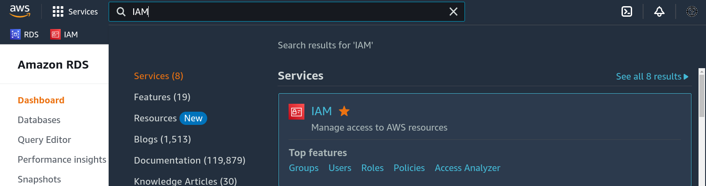

# Bootcamp de Engenharia de Dados do canal Stack (Janeiro 2023)

> Meus códigos e exemplos do **Bootcamp de Engenharia de Dados** do canal [Stack do Youtube](https://www.youtube.com/c/Stack_tecnologias/featured).

## Conteúdo

 - [Arquitetura do Projeto](#project-architecture)
 - [Criando uma conta IAM (Identity and Access Management)](#iam)
 - [Criando um Banco de Dados RDS (Relational Database Service)](#rds)
 - [](#)
 - [](#)
 - [](#)
 - [](#)
 - [](#)
 - [](#)
 - [](#)
 - [](#)
 - [](#)
 - [Configurações do projeto](#settings)

---

<div id="project-architecture"></div>

## Arquitetura do Projeto

  

 - **Data Source:** Amazon RDS
 - **Ingestion:** AWS Database Migration Service
 - **Data Lake:**
   - **Delta Lake:** Amazon S3
 - **Preprocessing:** Amazon EMR
 - **Serving:** AWS Glue & Amazon Athena
 - **Management:**
 - **Data Warehouse:**

---

<div id="iam"></div>

## Criando uma conta IAM (Identity and Access Management)

> Agora por motivos de segurança vamos criar uma conta **"IAM (Identity and Access Management)"** para não ficar acessando e modificando recursos como usuário **"root"**.

Para começar pesquise por **"IAM"** na *AWS*:

  

 - Clique em "Users":
   - Add users:
     - Coloque o nome do usuário (ex: drigols).
     - Habilite permissão ao "console".
       - Provide user access to the AWS Management Console - optional
     - Crie uma senha para o usuário:
       - I want to create an IAM user
       - Custom password
       - Desmarque a opção que exige que o usuário crie uma nova senha quando conectar:
         - Users must create a new password at next sign-in (recommended).
     - Clique em "NEXT":
     - Agora ele vai pergunta se você desejar colocar o usuário em algum grupo:
       - Crie um GRUPO = Administrators
       - Marque a opção:
         - AdministratorAccess
     - Marque o grupo que você criou em clique em "NEXT"
     - Por fim clique em "Crate user"
     - Agora ele vai lhe dar um retorno com:
       - Console sign-in URL:
         - https://109710384575.signin.aws.amazon.com/console
       - User name:
         - drigols
       - Console password:
         - `***************`

---

<div id="rds"></div>

## Criando um Banco de Dados RDS (Relational Database Service)

Agora vamos criar um Banco de Dados Postgre na AWS utilizando o serviço **RDS (Relational Database Service)**:

 - Primeiro pesquisa por RDS.
 - Clique em "DB Instances (0/40)".
 - Create Database.
 - Escolha o banco de dados Postgre.
 - Escolha o nível gratúito (Free tier).
 - Escolha o nome da **instância do servidor** (DB instance identifier):
   - server01
 - Escolha o nome do usuário principal (Master username):
   - Eu poderia colocar ADM, Root.
   - Porém, vamos manter como *"postgres"* que já é quase padrão para quem trabalhar com Database e Postgres.
 - Escolha uma senha de conexão (Master password + Confirm master password):
   - `vXOvNZE<&E}h$vx=`
 - Escolha a opção de acesso público ao Banco de Dados (Public access):
   - Ou seja, a AWS vai gerar um IP (DNS) público para quem deseja acessar o Banco de Dados.
 - Agora escolha o nome do Banco de Dados em "Additional configuration" > "Initial database name":
   - `coins`
 - Habilite proteção contra exclusão:
   - Additional configuration > Deletion protection > Enable deletion protection
   - Ou seja, ninguém vai conseguir apaga esse Banco de Dados sem querer.
   - Para apagar esse Banco de Dados, será necessário entrar nessa instância na AWS e desabilitar essa opção manualmente para só depois conseguir apagar esse Banco de Dados.
 - Finalmente clique em criar banco de dados:
   - Pode demorar algum tempo.
   - Creating database server01.
   - Your database might take a few minutes to launch.

x


---

<div id="settings"></div>

## Configurações do projeto

Configurações Python:

```
python -m venv environment
```

```
source environment/bin/activate
```

```
python -m pip install --upgrade pip
```

---

**REFERENCES:**  
[Stack](https://www.youtube.com/@Stack_tecnologias)  

---

Ro**drigo** **L**eite da **S**ilva - **drigols**
