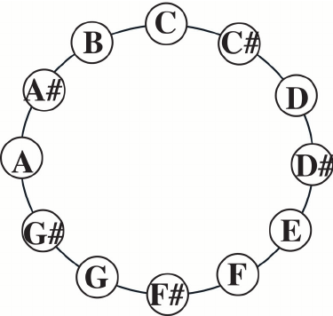
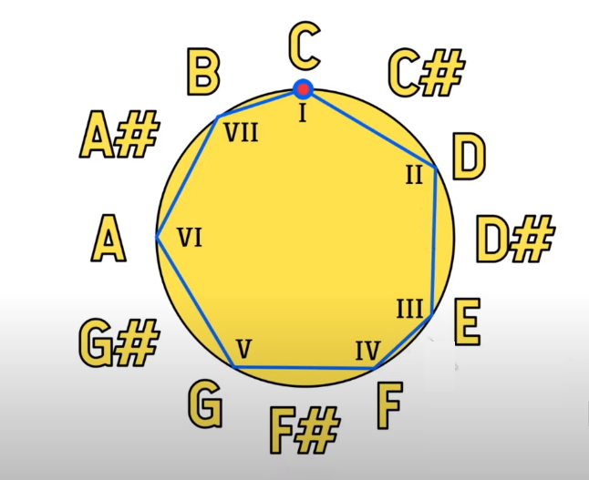
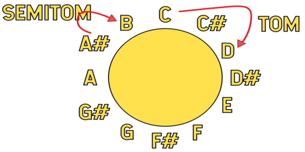
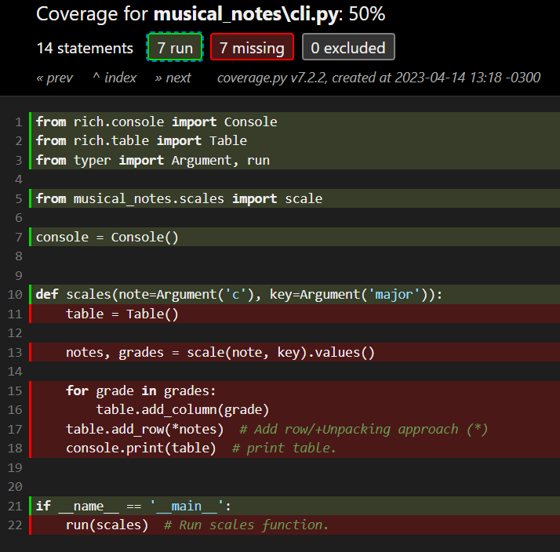
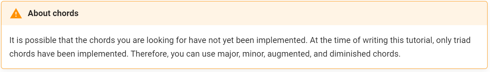
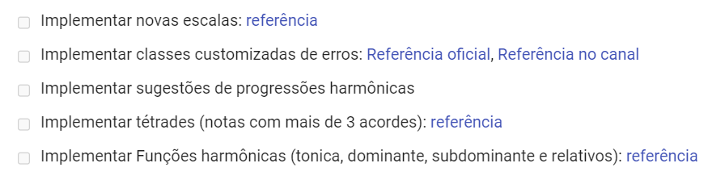
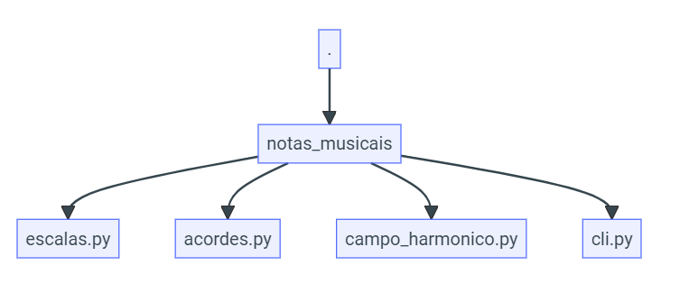

# Musical notes

> You can see the **Project WorkFlow** here.

## Contents

 - [Project Goals](#goals)
 - [Musical notes theory](#musical-notes-theory)
 - [Start the project with Poetry](#init-poetry)
 - [Start the repository with the git tool](#init-git)
 - [Add .gitignore and .editorconfig](#gitignore-editorconfig)
 - [Add LICENSE.md](#license)
 - [Add Pytest and Pytest-Cov ("dev" group)](#pytest-cov)
 - [Add Taskipy](#taskipy)
 - [Add blue (PEP8: code formatter + analyze)](#blue)
 - [Add isort (reorder import library)](#isort)
 - [Add mkdocs-material, mkdocstrings and mkdocstrings-python ("doc" group)](#mkdocs)
 - [Start mkdocs settings (mkdocs new .)](#init-mkdocs)
 - [Start Pytest settings](#start-pytest)
 - [Testing Blue (PEP8: code formatter + analyze)](#testing-blue)
 - [Add tasks](#add-tasks)
 - [Planning and Implementing the scales.py](#planning-implementing-scale-py)
 - [Create a mkdocs to our scales.py function](#mkdocs-scales-py)
 - [Intro to AAA (3A or A3) tests](#intro-to-aaa)
 - [Add test for our function to work with lowercase notes](#test-lowercase-notes)
 - [Add test when pass note (argument) does not exist](#test-pass-note-does-not-exist)
 - [Add test when key (tone argument) exists](#test-key-not-exists)
 - [How to use `"@mark.parametrize"` to make fake parameters for your tests](#mark-parametrize-fake-parameters)
 - [Understanding "coverage"](#understanding-coverage)
 - [Typer test instance "CliRunner"](#typer-test-instance)
 - [exit_code (0=Ok, 1=Error)](#exit-code)
 - [Using "stdout" and "pytest -v" to check (test) CLI return](#stdout-pytest-v)
 - [Creating a script (CLI) for our application (Adding our CLI to pyproject.toml)](#creating-scrit-cli)
 - [How to create macros (variables) with "mkdocs-macros-plugin@latest" and "jinja2"](#macro-var)
 - [How to create pretty "warnings"](#add-warnings)
 - [Creating pretty tasks on documentation](#pretty-tasks)
 - [Creating graph (structure) on our documentation](#graph)
 - [Go up "Read The Docs" for Web](#go-up-docs)
 - [Publishing the project on PyPi](#publishing)
 - [Choosing project version](#project-version)

---

<div id="goals"></div>

## Project Goals

To start, let's get started with the **Project Goals**.

> Help music student study ***Musical Theory***.

 - Assist (ajudar) in understanding musical scales.
 - Chord formation (formação de acordes).
 - Assist in the understanding of harmonic fields (campos harmônicos).
 - Help with harmonic progressions

---

<div id="musical-notes-theory"></div>

## Musical notes theory

To create this project we need to know what's Musical notes. For example:

|                |                   |                   |                       |                   |                     |                     |                     |
| -------------- | ----------------- |-------------------|-----------------------|-------------------|---------------------|---------------------|---------------------|
| **English**    | C                 | D                 | E                     | F                 | G                   | A                   | B                   |
| **Portuguese** | Dó e acorde de dó | Ré e acorde de ré | E - Mi e acorde de mi | Fá e acorde de fá | Sol e acorde de sol | Lá e acorde de lá   | Si e acorde de si   |

Between each note above we have some **"accidental" (sharp # / sustenidos )** notes:

|                |   |    |   |    |   |   |    |   |    |   |    |   |
| -------------- | --|----|---|----|---|---|----|---|----|---|----|---|
| **English**    | C | C# | D | D# | E | F | F# | G | G# | A | A# | B |

For example, see the clock analogy below:

  

> **Ok, we know the basics of musical notes, but what's a *"scale"*?**
> - [EN] - "Scales is a formula to find notes that combine between."
> - [PT] - "Escalas é uma fórmula para encontrar notas que combinam entre si."

For example, see the clock analogy below:

  

See that all notes listed above have a relation - That's, C (dó), D (ré), E (mí), F (fá), G (sol), A (lá), B (sí).

> **Ok, but and the space between these notes?**  
> These are `"intervals (intervalos)"`.

However, we have two types of intervals:

  

 - **TOM (ENG: Tone):**
   - Distance between two notes: C (dó), D (ré), E (mí), F (fá), G (sol), A (lá), B (sí).
 - **SEMITOM (ENG: Semitone):**
   - Distance between a note and a note sharp (#) or vice-versa.

---

<div id="init-poetry"></div>

## Start the project with Poetry

```
poetry new musical-notes
```

To use the environment use:

```
poetry shell
```

---

<div id="init-git"></div>

## Start the repository with the git tool

```
git init .
```

**NOTE**  
Now, let's create our repository on the cloud (GitHub):

```
gh repo create
```

**NOTE:**  
He will ask some questions to create the repository. Answer and create the repository.

---

<div id="gitignore-editorconfig"></div>

## Add .gitignore and .editorconfig

Now, let's add [.gitignore](../.gitignore) and [.editorconfig](../.editorconfig) to the project.

---

<div id="license"></div>

## Add LICENSE.md

Now, let's add a [LICENSE.md](../LICENSE.md) to the project.

---

<div id="pytest-cov"></div>

## Add Pytest and Pytest-Cov ("dev" group)

Now, let's add Pytest to the project:

```
poetry add --group dev pytest@latest pytest-cov@latest
```

**NOTE**  
See that we group the test libraries in the de "dev" group.

---

<div id="taskipy"></div>

## Add Taskipy

```
poetry add --group dev taskipy@latest
```

---

<div id="blue"></div>

## Add blue (PEP8: code formatter + analyze)

```
poetry add --group dev blue@latest
```

---

<div id="isort"></div>

## Adding isort (reorder import library)

```
poetry add --group dev isort@latest
```

---

<div id="mkdocs"></div>

## Add mkdocs-material, mkdocstrings and mkdocstrings-python ("doc" group)

```
poetry add --group doc mkdocs-material@latest mkdocstrings@latest mkdocstrings-python@latest
```

---

<div id="init-mkdocs"></div>

## Start mkdocs settings (mkdocs new .)

Now, let's start our mkdocs settings. For it, let's pass the path (root for us):

```
mkdocs new .
```

**OUTPUT:**  
```
INFO     -  Writing config file: ./mkdocs.yml
INFO     -  Writing initial docs: ./docs/index.md
```

To test we can se mkdocs serve:

```
mkdocs serve
```

**OUTPUT:**  
```
INFO     -  Building documentation...
INFO     -  Cleaning site directory
INFO     -  Documentation built in 0.04 seconds
INFO     -  [08:52:04] Watching paths for changes: 'docs', 'mkdocs.yml'
INFO     -  [08:52:04] Serving on http://127.0.0.1:8000/
```

> **NOTE:**  
> To test open the server address to test: **http://127.0.0.1:8000/**

Now, let's apply some settings. For it, open the generated [mkdocs.yml](../mkdocs.yml):

[mkdocs.yml](../mkdocs.yml)
```
site_name: Musical Notes
repo_url: https://github.com/drigols/musical-notes
repo_name: drigols/musical-notes
edit_uri: tree/master/docs

theme:
  name: material
  language: en
  logo: assets/logo.png
  favicon: assets/logo.png
  palette:
    primary: black

markdown_extensions:
  - attr_list # Allow apply styles {width=xxx .center}.

extra_css:
  - stylesheets/extra.css
```

To edit the main content open the [index.md](../docs/index.md):

[index.md](../docs/index.md)
```
{width=300 .center}
# Musical Notes
```

Now, let's see how to apply stylesheet on our docs:

[extra.css](../docs/stylesheets/extra.css)
```
.center {
    display: block;
    margin-left: auto;
    margin-right: auto;
}
```

---

<div id="start-pytest"></div>

## Start Pytest settings

To settings our Pytest first we need to define it in [pyproject.toml](../pyproject.toml):

[pyproject.toml](../pyproject.toml)
```py
[tool.pytest.ini_options]
pythonpath = "."
addopts = "--doctest-modules"
```

---

<div id="testing-blue"></div>

## Testing Blue (PEP8: code formatter + analyze)

Imagine we have the following **Python** file:

[musical_notes/test.py](../musical_notes/test.py)
```
name = "Rodrigo"
```

 - **If we just run *"blue ."*, he will format the code automatically, we don't know what was modified**.
 - We can also use two different approaches to know what needs to change:
   - `blue --check .`
     - Tells you if you have any issues to fix, but not what they are.
   - `blue --check --diff .`
     - Tells you if you have any issues to fix, and what they are.

For example, if we run:

```
blue --check --diff .
```

**OUTPUT:**
```
--- musical_notes/test.py       2023-03-31 16:46:45.855618 +0000
+++ musical_notes/test.py       2023-03-31 16:52:29.974415 +0000
@@ -1 +1 @@
-name = "Rodrigo"
+name = 'Rodrigo'
would reformat musical_notes/test.py
```

Now, we just need to solve that.

---

<div id="add-tasks"></div>

## Add tasks

Now, let's add some tasks to the project:

[pyproject.toml](../pyproject.toml)
```python
[tool.taskipy.tasks]
lint = "blue --check --diff . && isort --check --diff ."
docs = "mkdocs serve"
pre_test = "task lint" # Pre test.
test = "pytest -s -x --cov=musical_notes -vv"
post_test = "coverage html" # Post test.
```

---

<div id="planning-implementing-scale-py"></div>

## Planning and Implementing the scales.py

Now, let's planning and implementing the [scale.py](../musical_notes/scale.py). Let's start from docstring and from it implement the function. For example, which parameter does the function have?

[scales.py](../musical_notes/scales.py)
```python
def scales():
    """
    >>> scales('C', 'major')
    """
    ...
```

**OUTPUT:**  
```
TypeError: scales() takes 0 positional arguments but 2 were given
```

> **NOTE:**  
> See that the function should have two parameters, but doesn't have any.

Ok, let's implement these parameters:

[scales.py](../musical_notes/scales.py)
```python
def scales(note, key):
    """
    >>> scales('C', 'major')
    """
    ...
```

**RUNG TASK:**  
```
task test
```

**OUTPUT:**  
```
1 passed in 0.11s
```

> **Ok, but what output should the function have?**

Let's, implement in the docstring an output example:

[scales.py](../musical_notes/scales.py)
```python
def scales(note, key):
    """
    >>> scales('C', 'major')
    {'notes': ['C, 'D', 'E', 'F', 'G', 'A', 'B'], 'key': ['I', 'II', 'III', 'IV', 'V', 'VI', 'VII']}
    """
    ...
```

**RUNG TASK:**  
```
task test
```

**OUTPUT:**  
```
>>> scales('C', 'major')
Expected:
    {'notes': ['C, 'D', 'E', 'F', 'G', 'A', 'B'], 'key': ['I', 'II', 'III', 'IV', 'V', 'VI', 'VII']}
Got nothing
```

Well, we have to implement this output now:

[scales.py](../musical_notes/scales.py)
```python
NOTES = 'C C# D D# E F F# G G# A A# B'.split()
ESCALES = {'major': (0, 2, 4, 5, 7, 9, 11)}


def scale(note: str, key: str) -> dict[str, list[str]]:
    """
    Generate a scale from a note and a tone (key).

    Parameters:
        note: The note that will be the tonic of the scale.
        key: Scale tone (key).

    Returns:
        A dictionary with the scale notes and degree. Inside of the dictionary, the key is a string (str) and a value is a list of strings.

    Examples:
        >>> scale('C', 'major')
        {'notes': ['C', 'D', 'E', 'F', 'G', 'A', 'B'], 'key': ['I', 'II', 'III', 'IV', 'V', 'VI', 'VII']}

        >>> scale('a', 'major')
        {'notes': ['A', 'B', 'C#', 'D', 'E', 'F#', 'G#'], 'key': ['I', 'II', 'III', 'IV', 'V', 'VI', 'VII']}
    """
    note = note.upper()
    intervals = ESCALES[key]
    key_post = NOTES.index(note)
    temp = []

    for interval in intervals:
        note = (key_post + interval) % 12
        temp.append(NOTES[note])

    return {'notes': temp, 'key': ['I', 'II', 'III', 'IV', 'V', 'VI', 'VII']}
```

**RUN TASK:**  
```
task test
```

**OUTPUT:**  
```
1 passed in 0.10s
```

---

<div id="mkdocs-scales-py"></div>

## Create a mkdocs to our scales.py function

Now, let's create a mkdocs API to our [scales.py](../musical_notes/scales.py).

 - First create a folder in **docs/api**, next, create **scales.md**.

Inside [docs/api/scales.md](../docs/api/scales.md) add:

[docs/api/scales.md](../docs/api/scales.md)
```
::: scales
```

Now, let's add a plugin to our mkdocs settings:

[mkdocs.yml](../mkdocs.yml)
```python
plugins:
- mkdocstrings:
    handlers:
      python:
        paths: [musical_notes]
```

Finally, run **"task docs"** to testin.

---

<div id="intro-to-aaa"></div>

## Intro to AAA (3A or A3) tests

For our tests we will use AAA (3A or A3) Approach, which means:

 - **Arrange**
   - PT-BR = Arrumar
 - **Act**
   - PT-BR = Agir
 - **Assert**
   - PT-BR = Garantir

---

<div id="test-lowercase-notes"></div>

## Add test for our function to work with lowercase notes

Now, let's add a test to check if our **"scale"** function works with lowercase notes *(following AAA approach)*:

[test_scales.py](../tests/test_scales.py)
```python
def test_scale_must_work_with_lowercase_notes():
    # Arrange
    note = 'c'
    key = 'major'

    # Act
    result = scale(note, key)

    # Assert
    assert result
```

**RUN TASK:**  
```
task test
```

**OUTPUT:**  
```
2 passed in 0.11s
```

---

<div id="test-pass-note-does-not-exist"></div>

## Add test when pass note (argument) does not exist

Now, let's add a test to check when a invalid note is passed:

[scales.py](../musical_notes/scales.py)
```python
#.............

    """
    .....................

    Raises:
        ValueError: When passing a non-existent note.

    .....................
    """

    try:
        key_post = NOTES.index(note)
    except ValueError:
        raise ValueError(f'That note does not exist, try {NOTES}')

#............
```

[test_scales.py](../tests/test_scales.py)
```python
from pytest import raises

def test_scale_must_return_an_error_saying_that_the_note_not_exists():
    # Arrange
    note = 'X'
    key = 'major'
    error_message = f'That note does not exist, try {NOTES}'

    # Act
    with raises(ValueError) as error:
        scale(note, key)

    # Assert
    assert error_message == error.value.args[0]
```

**RUN TASK:**  
```
task test
```

**OUTPUT:**  
```
3 passed in 0.07s
```

---

<div id="test-key-not-exists"></div>

## Add test when key (tone argument) exists

Now, let's add a test when the user passes a not exist key (tone):

[test_scales.py](../tests/test_scales.py)
```python
def test_scale_key_not_exists():
    # Arrange
    note = 'X'
    key = 'banana'
    error_message = f'That key (tone) does not exist or not does implemented, try {list(SCALES.keys())}'

    # Act
    with raises(KeyError) as error:
        scale(note, key)

    # Assert
    assert error_message == error.value.args[0]
```

[scales.py](../musical_notes/scales.py)
```python
#...........................

    """
    ........................

    Raises:
        ValueError: When passing a non-existent note.
        KeyError: When key (tone) does not exist or not does implemented.

    ........................
    """
    try:
        intervals = SCALES[key]
    except KeyError:
        raise KeyError(
            'That key (tone) does not exist or not does implemented, '
            f'try {list(SCALES.keys())}'
        )

#...........................
```

**RUN TASK:**  
```
task test
```

**OUTPUT:**  
```
4 passed in 0.11s
```
---

<div id="mark-parametrize-fake-parameters"></div>

## How to use `"@mark.parametrize"` to make fake parameters for your tests

> Now, imagine you need to test when you pass a note the return is correct. Ok, you will need to test all possible returns.

For that, let's use `"@mark.parametrize"` to create fake parameters to test the returns of all notes.

[test_scales.py](../tests/test_scales.py)
```python
@mark.parametrize(
    # Arrange
    'note, expected',
    [
        ('C', ['C', 'D', 'E', 'F', 'G', 'A', 'B']),
        ('C#', ['C#', 'D#', 'F', 'F#', 'G#', 'A#', 'C']),
        ('F', ['F', 'G', 'A', 'A#', 'C', 'D', 'E']),
    ],
)
def test_scale_must_return_correct_note(note, expected):
    # Act
    result = scale(note, 'major')

    # Assert
    assert result['notes'] == expected
```

**RUN TASK:**  
```
task test
```

**OUTPUT:**  
```python
musical_notes/scales.py::musical_notes.scales.scale PASSED
tests/test_scales.py::test_scale_must_work_with_lowercase_notes PASSED
tests/test_scales.py::test_scale_must_return_an_error_saying_that_the_note_not_exists PASSED
tests/test_scales.py::test_scale_key_not_exists PASSED
tests/test_scales.py::test_scale_must_return_correct_note[C-expected0] PASSED
tests/test_scales.py::test_scale_must_return_correct_note[C#-expected1] PASSED
tests/test_scales.py::test_scale_must_return_correct_note[F-expected2] PASSED
```

See that now, we have the "Arrange" step separated in the `"@mark.parametrize"`:

```python
@mark.parametrize(
    # Arrange
    'note, expected',
    [
        ('C', ['C', 'D', 'E', 'F', 'G', 'A', 'B']),
        ('C#', ['C#', 'D#', 'F', 'F#', 'G#', 'A#', 'C']),
        ('F', ['F', 'G', 'A', 'A#', 'C', 'D', 'E']),
    ],
)
```

 - **Parameters:**
   - **note -** For example, `note` passsed by the user:
     - `C` or `C#` for our test
   - **expected -** *Expected result* by the passed note:
     - `['C', 'D', 'E', 'F', 'G', 'A', 'B']`
     - `['C#', 'D#', 'F', 'F#', 'G#', 'A#', 'C']`
     -  `['F', 'G', 'A', 'A#', 'C', 'D', 'E']`

**NOTE:**  
See also that the test function receives two parameters (note and expected); Declared in `"@mark.parametrize"`:

```python
def test_deve_retornar_as_notas_corretas(note, expected):
    ...
```

If you pay attention to the Pytest return you can see the tests:

```python
tests/test_scales.py::test_scale_must_return_correct_note[C-expected0] PASSED
tests/test_scales.py::test_scale_must_return_correct_note[C#-expected1] PASSED
tests/test_scales.py::test_scale_must_return_correct_note[F-expected2] PASSED
```

---

<div id="Understanding-coverage"></div>

## Understanding "coverage"

To understand the "coverage" library see the image below:

  

 - **7 statements were run:**
   - Green filled.
 - **7 statements were not run (that's, no coverage):**
   - Red filled.
   - That's, no coverage.

---

<div id="typer-test-instance"></div>

## Typer test instance "CliRunner" 

The Typer library has a test instance called **"CliRunner"** that stays:

```python
from typer.testing import CliRunner
```

With this, we can invoker/call functions to test:

```python
runner = CliRunner()  # Arrange

result = runner.invoke(app)
```

---

<div id="exit-code"></div>

## exit_code (0=Ok, 1=Error)

We can also use **"exit_code"** to test if our CLI command has some error. For example:

```python
def test_scale_cli_must_return_zero_stdout():
    result = runner.invoke(app)  # Act

    # Assert
    assert result.exit_code == 0  # exit_code is 0 when not having an error.
```

---

<div id="stdout-pytest-v"></div>

## Using "stdout" and "pytest -v" to check (test) CLI return

We can also use stdout to check (test) CLI return. For example:

```python
def test_scale_cli_must_contain_notes_in_the_answer():
    # Arrange
    note = 'C'

    result = runner.invoke(app)  # Act

    # Assert
    assert note == result.stdout
```

Now, if you run **"pytest . -v"**:

```
pytest . -v
```

**OUTPUT:**  
```python
        # Assert
>       assert note == result.stdout
E       AssertionError: assert 'C' == '┌───┬────┬──...────┴─────┘\n'
E         + C
E         - ┌───┬────┬─────┬────┬───┬────┬─────┐
E         - │ I │ II │ III │ IV │ V │ VI │ VII │
E         - ├───┼────┼─────┼────┼───┼────┼─────┤
E         - │ C │ D  │ E   │ F  │ G │ A  │ B   │
E         - └───┴────┴─────┴────┴───┴────┴─────┘

tests\test_cli.py:22: AssertionError
============================================ short test summary info ===============================================
FAILED tests/test_cli.py::test_scale_cli_must_contain_notes_in_the_answer - AssertionError: assert 'C' == '┌───┬────┬──...────┴─────┘\n'
=========================================== 1 failed, 8 passed in 0.30s ============================================
```

**NOTE:**  
See that we are comparing the "C" musical note with a Typer/+Rich table, for that our test FAILED. To solve that we need to test if the "C" musical note is in Typer/+Rich table. For example:

```python
assert note in result.stdout
```

**OUTPUT:**  
```python
tests/test_cli.py::test_scale_cli_must_contain_notes_in_the_answer PASSED                 [100%]
```

**NOTE:**  
See that now our test **PASSED**.

---

<div id="creating-scrit-cli"></div>

## Creating a script (CLI) for our application (Adding our CLI to pyproject.toml)

> Now, let's create a script (CLI) for our application. For that, we need to add our CLI to [pyproject.toml](../pyproject.toml).

For example:

[pyproject.toml](../pyproject.toml)
```python
[tool.poetry.scripts]
musical-notes = "musical_notes.cli:app"
```

That means:

 - **musical-notes =** Main command CLI name.
   - **musical_notes =** package or folder
     - **cli =** `cli.py` in package or folder musical_notes
       - **app =** Typer instance in `cli.py`:
         - app = Typer()

```bash
poetry run musical-notes scale
```

**OUTPUT:**  
```
┏━━━┳━━━━┳━━━━━┳━━━━┳━━━┳━━━━┳━━━━━┓
┃ I ┃ II ┃ III ┃ IV ┃ V ┃ VI ┃ VII ┃
┡━━━╇━━━━╇━━━━━╇━━━━╇━━━╇━━━━╇━━━━━┩
│ C │ D  │ E   │ F  │ G │ A  │ B   │
└───┴────┴─────┴────┴───┴────┴─────┘
```

```bash
poetry run musical-notes chord
```

**OUTPUT:**  
```
┏━━━┳━━━━━┳━━━┓
┃ I ┃ III ┃ V ┃
┡━━━╇━━━━━╇━━━┩
│ C │ E   │ G │
└───┴─────┴───┘
```

**NOTE:**  
See that now we have the main command **"musical-notes"** and some subcommands: **scale**, **chord**,....

---

<div id="hot-reload-mkdocs"></div>

## Add Hot-Reload to our mkdocs

To add Hot-Reload to our mkdocs is very easy:

[mkdocs.yml](../mkdocs.yml)
```
watch:
  - musical_notes
```

---

<div id="macro-var"></div>

## How to create macros (variables) with "mkdocs-macros-plugin@latest" and "jinja2"

We are repeating many times in the documentation the following command:

```bash
poetry run musical-notes <subcommand>
```

To solve that we can create a macro (variables). First, we need to install the following libraries:

```bash
poetry add --group doc mkdocs-macros-plugin@latest jinja2@latest
```

Now, we need to setting the macro in the [mkdocs.yml](../mkdocs.yml):

```yaml
plugins:
- macros
- ....
- ....

extra:
  commands:
    run: poetry run musical-notes # (or musical-notes)
```

Finally, we need only replace the old command by the created macro:

```bash
{{ commands.run }}
```

 - **commands:**
   - `"commands"` is the group of commands.
 - **run:**
   - `"run"` is the specific command we want to run.

---

<div id="add-warnings"></div>

## How to create pretty "warnings"

Sometimes we would like to create pretty warning on our documentation. Like this:

  

To enable this we need to add **"admonition"** to **"markdown_extensions"** in [mkdocs.yml](../mkdocs.yml):

[mkdocs.yml](../mkdocs.yml)
```yaml
markdown_extensions:
  - admonition
```

**NOTE:**  
Now, to create a warning we just need to use `"!!!"` before a sentence and break the line to show the real warning.

For example:

```md
!!! warning "About chords"
	It is possible that the chords you are looking for have not yet been implemented. At the time of writing this tutorial, only triad chords have been implemented. Therefore, you can use major, minor, augmented, and diminished chords.
```

---

<div id="pretty-tasks"></div>

## Creating pretty tasks on documentation

To create task in the documentarion we can use **pymdownx.tasklist**:

[mkdocs.yml](../mkdocs.yml)
```yaml
markdown_extensions:
pymdownx.tasklist
```

  

```md
- [ ] Implementar novas escalas: [referência](https://en.wikipedia.org/wiki/List_of_musical_scales_and_modes)
- [ ] Implementar classes customizadas de erros: [Referência oficial](https://docs.python.org/3/tutorial/errors.html#tut-userexceptions), [Referência no canal](https://youtu.be/sJpNfZqLpoI)
- [ ] Implementar sugestões de progressões harmônicas
- [ ] Implementar tétrades (notas com mais de 3 acordes):  [referência](https://pt.wikipedia.org/wiki/T%C3%A9trade)
- [ ] Implementar Funções harmônicas (tonica, dominante, subdominante e relativos): [referência](https://pt.wikipedia.org/wiki/Fun%C3%A7%C3%A3o_(m%C3%BAsica))
```

---

<div id="graph"></div>

## Creating graph (structure) on our documentation

To create a graph (strucute) on our documentation we need use **"pymdownx.superfences"**:

[mkdocs.yml](../mkdocs.yml)
```yaml
markdown_extensions:
  - pymdownx.superfences:
      custom_fences:
        - name: mermaid
          class: mermaid
          format: !!python/name:pymdownx.superfences.fence_code_format
```

Now, we can create a graph structure like this:

  

---

<div id="go-up-docs"></div>

## Go up "Read The Docs" for Web

To go up "Read The Docs" for Web first we need login on Read The Docs page: [https://readthedocs.org/](https://readthedocs.org/)

 - Import project:
   - Select you project
     - Build Version

Now, you need to configure the mkdocs of you repository in [.readthedocs.yaml](../.readthedocs.yaml)

[.readthedocs.yaml](../.readthedocs.yaml)
```yaml
version: 2

mkdocs:
  configuration: mkdocs.yml

build:
  os: ubuntu-latest
  tools:
    python: "3.11"
  jobs:
    post_create_environment:
      # Install poetry
      # https://python-poetry.org/docs/#installing-manually
      - pip install poetry
      # Tell poetry to not use a virtual environment
      - poetry config virtualenvs.create false
    post_install:
      # Install dependencies with 'docs' dependency group
      # https://python-poetry.org/docs/managing-dependencies/#dependency-groups
      - poetry install --only doc  # Install "only" doc dependencies
```

To understanding the process see the links below:

[Configuration file v2](https://docs.readthedocs.io/en/stable/config-file/v2.html)  
[build.jobs](https://docs.readthedocs.io/en/stable/config-file/v2.html#build-jobs)  
[Install dependencies with Poetry](https://docs.readthedocs.io/en/stable/build-customization.html#install-dependencies-with-poetry)  

---

<div id="publishing"></div>

## Publishing the project on PyPi

To publish the project on Pypi is very easy with Poetry, just run the following command:

```bash
poetry publish --build --username=pypi-username --password=pypi-password
```

**NOTE:**  
However, first we need to configure some things, like Docs, Repository, etc... In [pyproject.toml](../pyproject.toml). You can check the PiPy documentation [Creating the package files](https://packaging.python.org/en/latest/tutorials/packaging-projects/).

For example, first let's add some classifiers. For it, let's use the PyPi classifiers references: [Classifiers](https://pypi.org/classifiers/)

[pyproject.toml](../pyproject.toml)
```python
classifiers = [
    "Topic :: Education",
    "Environment :: Console",
    "Natural Language :: English",
    "Development Status :: 5 - Production/Stable",
    "Programming Language :: Python :: 3.11",
]
```

Now, let's create the section to URLs. For it, let's use `[tool.poetry.urls]` section:

[pyproject.toml](../pyproject.toml)
```python
[tool.poetry.urls]
"Documentation" = "https://musical-notes.readthedocs.io/en/latest/"
"Repository" = "https://github.com/drigols/musical-notes"
"Issue Tracker" = "https://github.com/drigols/musical-notes/issues"
```

---

<div id="project-version"></div>

## Choosing project version

To choose the project version we need to pay attention to some things. For example, see the code version below:

[pyproject.toml](../pyproject.toml)
```python
version = "0.1.0"
```

That means:

```python
Major - 0
Minor - 1
Patch - 0
```

> All Software starts from version `"0.0.0"`:

Always you have a stable version we increment a **"minor"** in the software. Then we continue to increment the patch until stays in another stable version. For example:

```python
Major - 0
Minor - 1
Patch - 0 > 1 > 2 > 3 > ... > Until another software stable version

Major - 0
Minor - 2
Patch - 0 > 1 > 2 > 3 > ... > Until another software stable 

Major - 0
Minor - 3
Patch - 0 > 1 > 2 > 3 > ... > Until another software stable 
```

> And the **"Major"** when it goes up?

**NOTE:**  
When we have an **"incompatible version"** we go up the "major".

Then, we continue the process, however, always we add a new feature we increment the **"minor"**:

```python
Major - 1
Minor - 0 > new feature (1) > new feature (2) > new feature (n)
Patch - 0
```

> And the **"Patch"** when it goes up?

**NOTE:**  
The **"Patch"** go up always we `solve a "bug"`. For example:

```python
Major - 1
Minor - 2
Patch - 0 > Bug solved (1) > Bug solved (2) > Bug solved (n)
```

 - **In short:**
   - **Always we add a `new feature`:**
     - We increment a `"minor"`.
   - **Always we that `solve a bug`:**
     - We increment a `"patch"`.
   - **Always that something `breaks the software`:**
     - We increment a `"major"`.
     - For example, change the CLI command.

For our project let's start with version `"0.1.0"`, that's the first stable version of our project.

[pyproject.toml](../pyproject.toml)
```python
version = "0.1.0"
```

**NOTE:**  
To understand more about project version see [Semantic Versioning](https://semver.org/).

---

Ro**drigo** **L**eite da **S**ilva - **drigols**
