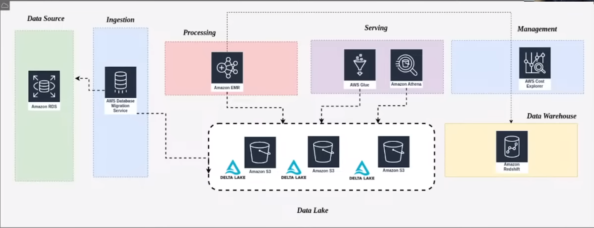
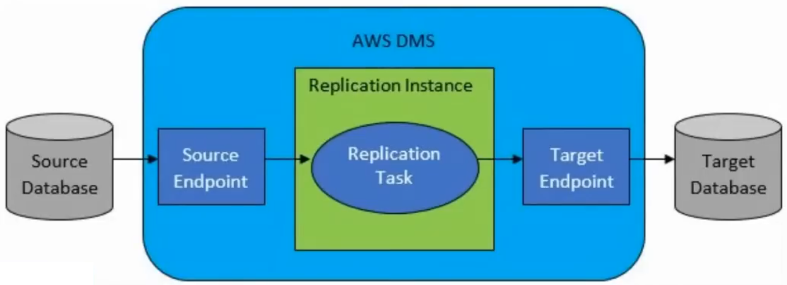
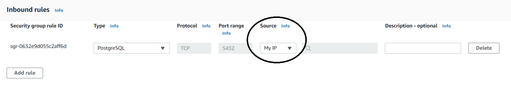
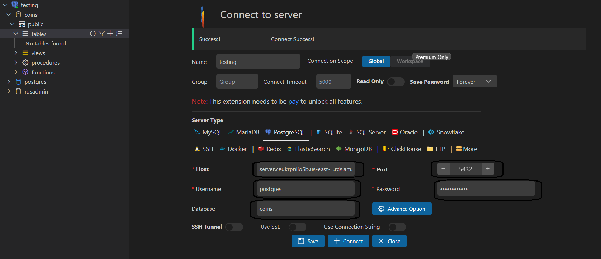

# Bootcamp de Engenharia de Dados do canal Stack (Janeiro 2023)

> Meus códigos e exemplos do **Bootcamp de Engenharia de Dados** do canal [Stack do Youtube](https://www.youtube.com/c/Stack_tecnologias/featured).

## O que eu aprendi?

 - **Engenharia:**
   - [Um exemplo de Arquitetura de um Projeto de Engenharia de Dados](#project-architecture)
   - [Data Lake Buckets: "raw" vs. "processed" vs. "curated"](#dl-buckets-arch)
   - [Para que server um DMS (Database source → (Endpoint) DMS (Endpoint) → Database target)](#eng-dms)
 - **AWS Services:**
   - **IAM (Identity and Access Management):**
     - [PORQUE e COMO CRIAR uma conta IAM (Identity and Access Management)](#iam)
   - **RDS (Relational Database Service):**
     - [Como criar Banco de Dados RDS (Relational Database Service) na AWS](#rds)
   - **Amazon S3 (Simple Storage Service):**
     - [Como criar um Data Lake (Buckets) na AWS com S3](#data-lake-s3)
   - **DMS (Database Migration Service):**
     - [Como criar um DMS (Database Migration Service) na AWS](#dms)
     - [Como criar Endpoints no DMS na AWS](#endpoints-dms)
     - [Como criar tarefas (tasks) no DMS na AWS](#dms-tasks)
   - **Amazon EMR (Elastic MapReduce):**
     - [Como criar um Cluster com Amazon EMR (Vantagens)](#cluster-emr)
 - **Código:**
   - [Como consumir dados da API → Transformar em um DataFrame → Criar uma tabela no RDS → Inserir os dados a partir do DataFrame](#testing-api-db)
 - **Ferramentas:**
   - [Como testar conexão com o Banco de Dados na AWS (Database Client extension)](#testing-aws-db)
 - **Configurações:**
   - [Configurações do projeto](#settings)

---

<!--- ( Engenharia ) -->

<div id="project-architecture"></div>

## Um exemplo de Arquitetura de um Projeto de Engenharia de Dados

  

 - **Data Source:**
 - **Ingestion:**
 - **Data Lake:**
   - Armazena diversos tipos de dados (Exemplo um diretório com arquivos JSON, CSV, Parquet, Delta).
 - **[Delta Lake (delta.io)](https://delta.io/):**
   - Formato especial de armazenar dados.
 - **Preprocessing:**
 - **Serving:**
 - **Management:**
 - **Data Warehouse:**

---

<div id="dl-buckets-arch"></div>

## Data Lake Buckets: "raw" vs. "processed" vs. "curated"

Uma abordagem muito utilizada pelos Engenheiros de Dados é criar "Buckets" para armazenar os dados na Cloud (nuvem). Porém, cada Bucket armazena um tipo de dados diferente. Por exemplo:

 - **raw-nomedoprojecto:**
   - **raw =** Os dados mais brutos possíveis (os Cientistas NÃO TEM ACESSO).
 - **processed-nomedoprojecto:**
   - **processed =** Onde os dados já estão processados (os Cientistas de Dados TEM ACESSO).
 - **curated-nomedoprojecto:**
   - **curated =** Aqui são os dados finais. Ou seja, já podemos disponibilizar ele para o time de negócio ou fazer um Dashboard para os stackholders.

---

<div id="eng-dms"></div>

## Para que server um DMS (Database source → (Endpoint) DMS (Endpoint) → Database target)

  

 - **DMS (Database Migration Service):**
   - O **DMS (Database Migration Service)** na AWS é ***uma ferramenta que permite a migração de dados entre diferentes bancos de dados***.
 - **DMS Endpoints:**
   - Outra observação olhando na arquitetura acima é que nós utilizamos Endpoints para fazer a conexão entre esses Banco de Dados.

Existem várias razões pelas quais uma organização pode precisar usar o DMS, incluindo:

 - **Migração para a nuvem:**
   - Uma das principais razões para usar o DMS é migrar bancos de dados para a nuvem AWS. Isso pode ajudar as empresas a economizar em custos de infraestrutura, além de fornecer mais flexibilidade e escalabilidade.
 - **Atualizações do sistema:**
   - Quando uma organização atualiza seu sistema, pode precisar migrar dados de um banco de dados legado para um novo banco de dados. O DMS pode ajudar a facilitar essa transição.
 - **Mudança de fornecedor:**
   - Se uma organização decide mudar de fornecedor de banco de dados, o DMS pode ajudar a migrar os dados do banco de dados antigo para o novo.
 - **Sincronização de bancos de dados:**
   - O DMS também pode ser usado para sincronizar bancos de dados, garantindo que os dados estejam atualizados em todos os locais.
 - **Backup e recuperação de desastres:**
   - O DMS pode ser usado para fazer backups regulares do banco de dados, bem como para restaurar dados em caso de falhas ou desastres.

Esses são apenas alguns exemplos de como o DMS pode ser usado na AWS. Em geral, o DMS pode ajudar as organizações a mover dados com segurança e eficiência entre diferentes plataformas de banco de dados.

---

<!--- ( AWS Services ) -->

<div id="iam"></div>

## PORQUE e COMO CRIAR uma conta IAM (Identity and Access Management)

> Por motivos de segurança vamos criar uma conta **"IAM (Identity and Access Management)"** para não ficar acessando e modificando recursos como usuário **"root"**.

 - Para começar pesquise por **"IAM"** na *AWS*:
 - Clique em "Users":
   - Add users:
     - Coloque o nome do usuário (ex: drigols).
     - Habilite permissão ao "console".
       - Provide user access to the AWS Management Console - optional
     - Crie uma senha para o usuário:
       - I want to create an IAM user
       - Custom password
       - Desmarque a opção que exige que o usuário crie uma nova senha quando conectar:
         - Users must create a new password at next sign-in (recommended).
     - Clique em "NEXT":
     - Agora ele vai pergunta se você desejar colocar o usuário em algum grupo:
       - Crie um GRUPO = Administrators
       - Marque a opção:
         - AdministratorAccess
     - Marque o grupo que você criou em clique em "NEXT"
     - Por fim clique em "Create user"
     - Agora ele vai lhe dar um retorno com:
       - Console sign-in URL:
         - https://109710384575.signin.aws.amazon.com/console
       - User name:
         - drigols
       - Console password:
         - `***************`

---

<div id="rds"></div>

## Como criar Banco de Dados RDS (Relational Database Service) na AWS

Agora vamos criar um Banco de Dados Postgre na AWS utilizando o serviço **RDS (Relational Database Service)**:

 - Primeiro pesquisa por RDS.
 - Clique em "DB Instances (0/40)".
 - Create Database.
 - Escolha o banco de dados Postgre.
 - Escolha o nível gratúito (Free tier).
 - Escolha o nome da **instância do servidor** *(DB instance identifier)*:
   - rds-server
 - Escolha o nome do usuário principal (Master username):
   - Eu poderia colocar ADM, Root, mas vou deixar **postgres** mesmo.
   - É comum DBA's deixarem **"postgres"** que já é quase padrão para quem trabalhar com Database e Postgres.
 - Escolha uma senha de conexão (Master password + Confirm master password):
   - 7hRt5yU9pLm2
 - Escolha a opção de acesso público ao Banco de Dados *(Public access)*:
   - Ou seja, a AWS vai gerar um IP (DNS) público para quem deseja acessar o Banco de Dados.
 - Agora escolha o nome do Banco de Dados em "Additional configuration" > "Initial database name":
   - coins
 - Habilite proteção contra exclusão:
   - Additional configuration > Deletion protection > Enable deletion protection
   - Ou seja, ninguém vai conseguir apaga esse Banco de Dados sem querer.
   - Para apagar esse Banco de Dados, será necessário entrar nessa instância na AWS e desabilitar essa opção manualmente para só depois conseguir apagar esse Banco de Dados.
 - Finalmente clique em criar banco de dados:
   - **NOTE:** Pode demorar algum tempo.
 - **Liberando a porta "5432" na instância:**
   - **NOTE:** Se tiver alguma regra que você não criou antes "Delete" e crie a sua como citado abaixo.
   - Depois que a nossa instância (server) e o Banco de Dados for criado nós precisamos liberar a porta *"5432"* qual o postgres trabalhar.
   - Para isso clique em:
     - Security > VPC security groups > default (sg-014a5d44163dcec9b);
     - Procure por regras de entrada (Inbound Rules):
       - Editar regras de entrada (Edit Inbound Rules):
       - Coloque meu ip (My IP) source e clique em *"Save Rules"*.

  

---

<div id="data-lake-s3"></div>

## Como criar um Data Lake (Buckets) na AWS com S3

 - **Pesquise por "S3" na AWS.**
   - Clique no serviço.
 - **Criando os Buckets:**
   - **Clique em "Create Bucket":**
     - Coloqueo o nome do Bucket (Bucket name):
       - "raw-nomedoprojecto"
       - raw = Os dados mais brutos possíveis  (os Cientistas NÃO TEM ACESSO).
       - nomedoprojecto = O nome do projeto a qual o bucket pertence.
     - Adicione uma Tag ao Bucket (Tags(1) - optional -> Add Tag):
       - Key=Projeto, Value=Bootcamp.
       - Key=Team, Value=Stack.
       - Key=CentroCusto, Value=TI.
     - Finalmente, clique em "Create Bucket".
   - **Clique novamente em "Create Bucket"**
     - Coloqueo o nome do Bucket (Bucket name):
       - "processed-nomedoprojecto"
       - processed = Onde os dados já estão processados (os Cientistas de Dados TEM ACESSO).
       - nomedoprojecto = O nome do projeto a qual o bucket pertence.
     - Adicione uma Tag ao Bucket (Tags(1) - optional -> Add Tag):
       - Key=Projeto, Value=Bootcamp.
       - Key=Team, Value=Stack.
       - Key=CentroCusto, Value=TI.
     - Finalmente, clique em "Create Bucket".
   - **Clique novamente em "Create Bucket"**
     - Coloqueo o nome do Bucket (Bucket name):
       - "curated-nomedoprojecto"
       - curated = Aqui são os dados finais. Ou seja, já podemos disponibilizar ele para o time de negócio ou fazer um Dashboard para os stackholders.
       - nomedoprojecto = O nome do projeto a qual o bucket pertence.
     - Adicione uma Tag ao Bucket (Tags(1) - optional -> Add Tag):
       - Key=Projeto, Value=Bootcamp.
       - Key=Team, Value=Stack.
       - Key=CentroCusto, Value=TI.
     - Finalmente, clique em "Create Bucket".

---

<div id="dms"></div>

## Como criar um DMS (Database Migration Service) na AWS

 - Agora pesquise por DMS (Database Migration Service) na AWS:
   - Clique nele.
   - Clique em "Create Application Instance".
   - Coloque o nome da instância:
     - dms-instance
   Coloque em "Descriptive Amazon Resource Name (ARN) - optional":
     - dms-instance
   - Coloque uma descrição:
     - Serviço de Ingestão para o Data Lake
   - Configure a instância da máquina (Instance configuration):
     - Instance class = Seleciona a mais básica possível (1 GB).
     - Engine Version = 3.4.6.
     - Multi AZ = Single.AZ.
   - Deixe marcada a opção: Public accessible:
     - Essa opção é para quem deseja acessar à máquina do DMS. Se essa opção estiver marcada a AWS vai gerar um IP público de acesso.
   - Adicione Tags:
     - Key=Projeto, Value=Bootcamp.
     - Key=Team, Value=Stack.
     - Key=CentroCusto, Value=TI.
   - Finalmente, clique em "Create Application Instance".

---

<div id="endpoints-dms"></div>

## Como criar Endpoints no DMS na AWS

**NOTE:**  
Antes de criar os Endpoints vamos criar uma "role" que vai ser necessária. O tutorial (use Guide) [Using Amazon S3 as a target for AWS Database Migration Service](https://docs.aws.amazon.com/dms/latest/userguide/CHAP_Target.S3.html) da explicações de como fazer isso.

Primeiro copie o exemplo de "role" abaixo:

```json
{
    "Version": "2012-10-17",
    "Statement": [
        {
            "Effect": "Allow",
            "Action": [
                "s3:PutObject",
                "s3:DeleteObject",
                "s3:PutObjectTagging"
            ],
            "Resource": [
                "arn:aws:s3:::buckettest2/*"
            ]
        },
        {
            "Effect": "Allow",
            "Action": [
                "s3:ListBucket"
            ],
            "Resource": [
                "arn:aws:s3:::buckettest2"
            ]
        }
    ]
}
```

 - **Agora vá em IAM**:
   - Clique em "roles".
   - Clique em "Create Role".
   - Deixe marcado "AWS Service".
   - Use cases for other AWS services:
     - Selecione DMS (Depois marque ele)
   - Next.
   - Clique em "Create policy".
   - Clique em "JSON".
   - Agora cole o código "JSON" que nós pegamos no tutorial acima:
     - Porém, nós precisamos mudar o "Resource" para apontar para o nosso Bucket "raw-nomedoprojecto" no S3.
     - Vá no Bucket "raw-nomedoprojecto":
       - Clique em "properties".
       - Copie o "Amazon Resource Name (ARN)": arn:aws:s3:::raw-nomedoprojecto
     - Volte no código JSON e cole o seu "Amazon Resource Name (ARN)" no "Resource". Por exemplo:
       - "Resource": ["arn:aws:s3:::raw-nomedoprojecto/*"]
     - **NOTE:** Vejam que o código JSON tem 2 sources, você tem que colocar o arn do seu bucket nos 2.
     - Clique em "Next tags".
   - Pule a etapa de Tags clicando em "Next Reviw".
   - Em "Review policy":
     - Name = policy-s3-access
     - Depois clique em "Create policy".
   - Clique em NOVAMENTE "roles".
   - Clique em NOVAMENTE "Create Role".
   - Deixe marcado "AWS Service" NOVAMENTE.
   - Use cases for other AWS services:
     - Selecione DMS (Depois marque ele) NOVAMENTE
   - Next.
   - Agora sim, selecione a *policy* que você criou antes "policy-s3-access" e dê "next".
   - Agora dê um nome para sua role = role-dms-s3-raw.
   - Finalmente, clique em "Create role".

Agora sim você tem uma regra "role-dms-s3-raw" para usar nos seus Endpoints futuramente.

> Os "Endpoints" são uma forma de nós conectamos nossa "fonte" e um "target".

 - **Clique em "Endpoints":**
   - **Clique em "Create endpoint":**
     - Escolha o Endpoints do tipo "source".
     - Selecione a opção "Select RDS DB instance":
       - Selecione a nossa fonte de dados que vai ser o nosso Banco de Dados Postgre RDS = rds-server.
     - Configure o Endpoint (Endpoint configuration):
       - Endpoint identifier = rds-source-postgresql
       - Repita o mesmo em "Descriptive Amazon Resource Name (ARN) - optional"
       - Provide access information manually: Suas credenciais de ADM no Postgre RDS:
         - Username: postgres
         - Password: 7hRt5yU9pLm2
     - Adicione Tags:
       - Key=object, Value=endpoint-source
     - Clique em "Create endpoint"
   - **Clique novamente em "Create endpoint":**
     - Escolha o Endpoints do tipo "target".
     - **NOTE:** Os target vão ser os nossos "Buckets" no Data Lake.
     - Configure o Endpoint (Endpoint configuration):
       - Endpoint identifier = s3-target-datalake
       - Target engine = Amazon S3
       - Adicione o ARN (Service access role ARN):
         - Vá em "IAM" > Roles > selecione a regra "role-dms-s3-raw".
         - Copie a "ARN".
         - E adicione aqui em "Adicione o ARN (Service access role ARN)".
       - Aponte para o **nome do Bucket** e o **diretório** que nós vamos escrever:
         - Bucket name = raw-nomedoprojecto
         - Bucket folder = Vamos deixar em branco, ou seja, ele vai escrever dentro da raiz.
     - Endpoint settings:
       - Add new setting:
         - AddColumnName + Value = true
     - Adicione Tags:
       - Key=object, Value=endpoint-target
   - **Testando as conexões dos Endpoints:**
     - Agora nós precisamos testar as conexões do Endpoints.
     - Clique em cada Endpoint:
       - Connections > Test connections > Run test

---

<div id="dms-tasks"></div>

## Como criar tarefas (tasks) no DMS na AWS

 - **No DMS clique em "Database migration tasks":**
   - **Clique em "Create database migration task":**
     - Task identifier:
       - task-01
       - Repita o mesmo em "Descriptive Amazon Resource Name (ARN) - optional"
     - Replication instance:
       - Selecione: dms-instance
     - Source database endpoint:
       - rds-source-postgresql
     - Target database endpoint:
       - s3-target-datalake
     - Migration type: Selecione "Migrate existing data".
       - Migrate existing data:
         - Essa opção faz apenas a migração de dados entre Banco de Dados. Essa que nós vamos utilizar.
       - Migrate existing data and replicate ongoing changes:
         - Essa opção faz a migração e fica tipo "ouvindo/listening" as alterações e modificando sempre que possível. Mas conhecida como CDC.
       - Replicate data changes only:
         - Essa opção pega apenas as mudanças do Banco de Dados de origem.
     - Task settings:
       - LOB column settings = Marque a opção "Limited LOB mode".
       - Task logs = Marque a opção "Turn on CloudWatch logs.
     - Table mappings:
       - Add new selection rule:
         - Em "Schema" selecione: "Enter a schema".
         - Source name = %
         - Source table name = %
         - Action = Include.
     - Clique em "Create task".

---

<div id="cluster-emr"></div>

## Como criar um Cluster com Amazon EMR (Vantagens)

**NOTE:**  
Antes de fato criar nosso cluster nós precisamos criar algumas "roles" que serão necessárias. Essa roles podem ser vistas em ["Configure IAM service roles for Amazon EMR permissions to AWS services and resources"](https://docs.aws.amazon.com/emr/latest/ManagementGuide/emr-iam-roles.html).

 - Vá em IAM
 - Roles > Create Role
 - **Criando a role "EMR_DefaultRole_V2":**
   - Use cases for other AWS services:
     - Selecione "EMR", marque o serviço "EMR" e de "Next"
   - Já tem uma opção de "policies" atribuída a ele, de "Next" novamente.
   - Role name (vamos deixar o mesmo nome que ele recomenda na documentação):
     - EMR_DefaultRole_V2
   - Finalmente clique em "Create Role".
 - **Criando a role "EMR_EC2_DefaultRole":**
   - Use cases for other AWS services:
     - Selecione "EMR", marque o serviço "EMR Role for EC2" e de "Next"
   - Já tem uma opção de "policies" atribuída a ele, de "Next" novamente.
   - Role name (vamos deixar o mesmo nome que ele recomenda na documentação):
     - EMR_EC2_DefaultRole
   - Finalmente clique em "Create Role".

> Quais a vantagens de ter um produto na **Amazon EMR**?

 - **Vantagens:**
   - Uma das vantagens é que ela prover vários serviços Open-Source que nós podemos utilizar na nossa aplicação como:
     - Spark, Hadoop
   - Outra vantagem é que o serviço do Amazon EMR é pago por hora, ou seja:
     - Independente do processamento que você tenha que fazer você apenas vai pagar por hora, não por recurso gasto.

Sabendo disso, vamos para a criação do Cluster:

 - **Pesquise por Amazon EMR:**
 - Clique em "Create Cluster"
 - Coloque o nome do cluster = cluter-test
 - Mantenha a última versão = 6.9.0 (no meu caso atualmente)
 - Application bundle:
   - Selecione "AWS Custom": Selecione apenas o "Spark"
 - Marque a opção = "Use for Spark table metadata"
 - Mantenha as opções de "Operating system options":
   - Marcado "Amazon Linux release" e "Automatically apply latest Amazon Linux updates" 
 - Cluster configuration:
   - Deixa "Instance groups" marcado
   - Primary
     - Pesquise por "m4.large" e selecione essa máquina
   - Core
     - Pesquise por "m4.large" e selecione essa máquina
   - Task 1 of 1
     - Pesquise por "m4.large" e selecione essa máquina
 - Desmarque a opção:
   - Use termination protection
 - Cluster logs - optional selecione a opção "Publish cluster-specific logs to Amazon S3":
   - Browser S3 = Selecione o folder "processed-nomedoprojeto"
 - Tag:
   - Key=Object, Value=cluster-emr 
 - Security configuration and EC2 key pair - optional
   - Clique em "Create key pair" para criar um par de chaves RSA:
     - nome = pair-test
     - "Create key pair"
     - Isso vai baixar um arquivo contendo o par de chaves RSA.
     - Agora clique em "browser" em "Amazon EC2 key pair for SSH to the cluster - optional"
       - De "refresh" se não aparecer nada e seleciona chave criada. 
 - Em "Identity and Access Management (IAM) roles" adicione as "roles" criadas:
   - Service role (Dê refresh se não aparecer) = EMR_DefaultRole_V2
   - Instance profile (Dê refresh se não aparecer) = EMR_EC2_DefaultRole 
 - Finalmente clique em "Create cluster".

---

<!--- ( Código ) -->

<div id="testing-api-db"></div>

## Como consumir dados da API → Transformar em um DataFrame → Criar uma tabela no RDS → Inserir os dados a partir do DataFrame

Os dados que nós vamos consumir vem da API [CoinMarketCap](https://coinmarketcap.com/api/) e depois serão salvos em um Banco de Dados Postgres na AWS. Para entender como foi feito o processo veja o [Jupyter Notebook clicando aqui](notebooks/api-and-db.ipynb).

Agora que você entendeu as partes do código para consumir os dados da API e salvar em um Banco de Dados na AWS, veja os códigos completo a clicando aqui: [app.py](ingestao-rds/app.py)

---

<!--- ( Ferramentas ) -->

<div id="testing-aws-db"></div>

## Como testar conexão com o Banco de Dados na AWS (Database Client extension)

Agora vamos tentar nos conectar com o Banco de Dados na AWS utilizando a extensão Database Client no VSCode:

  

---

<!--- ( Configurações ) -->

<div id="settings"></div>

## Configurações do projeto

**Create environment:**
```bash
python -m venv environment
```

**Activate environment:**
```bash
# Linux Approach
source environment/bin/activate

# Windows Approach
source environment/Scripts/activate
```

**Upgrade pip:**
```bash
python -m pip install --upgrade pip
```

**If necessary, freeze new dependencies:**
```bash
pip freeze > requirements.txt --require-virtualenv
```

---

Ro**drigo** **L**eite da **S**ilva - **drigols**
