# Easy RAG ( Pythonando | Arcane 06 - 2025 )

## Contents

 - **Implementação:**
   - [`Configurando o Poetry`](#poetry-settings-pyproject)
   - [`Configurando o Ruff`](#ruff-settings-pyproject)
   - [`Configurando o Pytest`](#pytest-settings-pyproject)
   - [`Configurando o Taskipy`](#taskipy-settings-pyproject)
   - [`Configurando o pre-commit`](#precommit-settings)
   - [`Instalando o Django e criando o projeto core`](#install-django-core)
   - [`Criando o App "users"`](#create-users-app)
   - [`Criando a ROTA/URL users`](#create-users-url)
   - [`Configurando o core/settings.py para reconhecer arquivos estáticos, templates e media`](#core-settings)
   - [`Criando o template base.html e mapeando com o register.html`](#create-base-html)
   - [`Criando um super usuário no Django Admin`](#create-super-user)
   - [`Pegando (POST) os dados do formulário (registro) e salvando no banco de dados`](#create-register-view)
   - [`Criando a janela e ação (view) de login`](#create-login-view)
   - [`Linkando a página de login com a de registrar`](#login-to-register)
   - [`Criando as ROTAS/URLs de permissões`](#create-permissions)
   - [`Criando o App agent`](#create-agent-app)
   - [`Criando a ROTA/URL agent e janela training-ai.html (+Entendendo name="training_ai")`](#create-agent-url)
   - [`Mapeando o treinamento para o Banco de Dados (+Entendendo as migrações)`](#create-agent-model)
   - [`Criando um signal/observer para o nosso Banco de Dados`](#create-signal-observer)
   - [`Pré-Processando as entradas antes do treinamento`](#create-tasks-training)
   - [`Preparando os dados (chunk, overlap, embeddings) e salvando em um BD FAISS`](#prepare-to-train)
   - [`Criando/Entendendo Workers/Clusters`](#create-workers)
   - [`Listando as tarefas (tasks) do Django Q2 na interface web`](#list-tasks)
   - [`Arquitetura de pergunta e resposta`](#chat-archicture)
   - [`Criando uma ROTA/URL para o meu chat.html`](#chat-url)
   - [`Modelando as perguntas que o usuário envia ao chatbot`](#question-model)
   - [`Registrando os modelos/tabelas no Django Admin`](#register-table-admin)
   - [`Pegando a pergunta do usuário (POST); salvando e retornando o ID (question_id) da pergunta`](#post-question)
   - [`Criando a função utilitária stream_generator()`](#stream-generator)
 - **Teoria:**
   - [`RAG (Retrieval-Augmented Generation)`](#intro-to-rag)
   - [`Chunks`](#intro-to-chunks)
   - [`Overlap`](#intro-to-overlap)
<!---
[WHITESPACE RULES]
- "20" Whitespace character.
--->


---

<div id="poetry-settings-pyproject"></div>

## `Configurando o Poetry`

> De início a primeira coisa que vamos fazer é configurar o **Poetry** para ter um ambiente virtual.

De início vamos ver qual Python estamos utilizando:

```bash
python3
```

```bash
import platform
platform.system()
'Linux'
```

Ótimo, estamos utilizando o Python na plataforma Linux (WSL).

> **E o pip?**

```bash
which pip
```

**OUTPUT:**
```bash
pip not found
```

```bash
python3

import pip
ModuleNotFoundError: No module named 'pip'
```

**Bem, não temos o pip instalado!**  
Vamos instalar com apt:

```bash
sudo apt install python3-pip -y
```

Agora vamos verificar a versão instalada:

```bash
pip --version
```

**OUTPUT:**  
```bash
pip 24.0 from /usr/lib/python3/dist-packages/pip (python 3.12)
```

Com isso podemos intalar o Poetry:

```bash
sudo apt install pipx
```

```bash
pipx ensurepath
```

```bash
pipx install poetry
```

Agora vamos ver onde está o binário do nosso Python e relacionada ao nosso ambiente virtual (poetry):

```bash
which python3
```

**OUTPUT:**  
```bash
/usr/bin/python3
```

```bash
poetry env use "/usr/bin/python3"
```

Agora vamos adicionar o plugin do poetry para utilizar o `poetry shell`:

```bash
poetry self add poetry-plugin-shell
```

Finalmente, agora é só ativar o ambiente virtual:

```bash
poetry shell
```


---

<div id="ruff-settings-pyproject"></div>

## `Configurando o Ruff`

De início no nosso projeto a primeira coisa que vamos fazer é configurar o **Ruff** no nosso `pyproject.toml`:

> Esse bloco define às *Regras Gerais de funcionamento do (Ruff)*.

#### `[tool.ruff]`

```toml
[tool.ruff]
line-length = 79
```

 - `line-length = 79`
   - Define que nenhuma linha de código deve ultrapassar 79 caracteres *(seguindo o padrão tradicional do PEP 8)*.
   - É especialmente útil para manter legibilidade em terminais com largura limitada.
   - Ruff irá avisar (e, se possível, corrigir) quando encontrar linhas mais longas.

#### `[tool.ruff.lint]`

Esse é o sub-bloco principal de configuração de linting do Ruff, ou seja, onde você define como o Ruff deve analisar o código quanto a erros, estilo, boas práticas etc.

```toml
[tool.ruff.lint]
preview = true
select = ['I', 'F', 'E', 'W', 'PL', 'PT']
```

 - `preview = true`
   - Ativa regras experimentais (em fase de teste, mas estáveis o suficiente).
   - Pode incluir novas verificações que ainda não fazem parte do conjunto padrão.
   - Útil se você quer estar sempre com o Ruff mais “rigoroso” e atualizado.
 - `select = ['I', 'F', 'E', 'W', 'PL', 'PT']`
   - Define quais conjuntos de regras (lints) o Ruff deve aplicar ao seu código. Cada uma dessas letras corresponde a um grupo de regras:
     - `I` ([Isort](https://pycqa.github.io/isort/)): Ordenação de imports em ordem alfabética.
     - `F` ([Pyflakes](https://github.com/PyCQA/pyflakes)): Procura por alguns erros em relação a boas práticas de código.
     - `E` ([pycodestyle](https://pycodestyle.pycqa.org/en/latest/)): Erros de estilo de código.
     - `W` ([pycodestyle](https://pycodestyle.pycqa.org/en/latest/)): Avisos sobre estilo de código.
     - `PL` ([Pylint](https://pylint.pycqa.org/en/latest/index.html)): "erros" em relação a boas práticas de código.
     - `PT` ([flake8-pytest](https://pypi.org/project/flake8-pytest-style/)): Boas práticas do Pytest.

#### `[tool.ruff.format]`

O bloco [tool.ruff.format] é usado para configurar o formatador interno do Ruff, que foi introduzido recentemente como uma alternativa ao Black — mas com a vantagem de ser muito mais rápido.

```toml
[tool.ruff.format]
preview = true
quote-style = "double"
```

 - `preview = true`
   - Ativa regras experimentais (em fase de teste, mas estáveis o suficiente).
 - `quote-style = "double"`
   - Define o estilo de aspas (duplas no nosso caso) usadas pelo formatador.


---

<div id="pytest-settings-pyproject"></div>

## `Configurando o Pytest`

> Agora nós vamos configurar o **Pytest** no nosso `pyproject.toml`.

O bloco `[tool.pytest.ini_options]` no `pyproject.toml` é usado para configurar o comportamento do Pytest, da mesma forma que você faria com `pytest.ini`, `setup.cfg` ou `tox.ini`:

```toml
[tool.pytest.ini_options]
pythonpath = "."
addopts = '-p no:warnings'
```

 - `pythonpath = "."`
   - Onde o Pytest procurar arquivos Python para executar.
   - Ou seja, a partir da `raiz (.)` do nosso projeto.
 - `addopts = '-p no:warnings'`
   - Para ter uma visualização mais limpa dos testes, caso alguma biblioteca exiba uma mensagem de warning, isso será suprimido pelo pytest.


---

<div id="taskipy-settings-pyproject"></div>

## `Configurando o Taskipy`

> Aqui nós vamos configurar o **Taskipy** no nosso `pyproject.toml`.

O bloco `[tool.taskipy.tasks]` é usado para definir *tarefas (tasks)* automáticas personalizadas no seu `pyproject.toml`, usando o pacote taskipy.

```toml
[tool.taskipy.tasks]
lint = 'ruff check'
pre_format = 'ruff check --fix'
format = 'ruff format'
pre_test = 'task lint'
test = 'pytest -s -x --cov=. -vv'
post_test = 'coverage html'
start = 'python manage.py runserver'
migrate = 'python manage.py migrate'
makemigrations = 'python manage.py makemigrations'
```

 - `lint = 'ruff check'`
   - Executa o Ruff para verificar erros de estilo e código (linting), sem alterar nada.
 - `pre_format = 'ruff check --fix'`
   - Executa antes da *tarefa (task)* `format`. Aqui, você corrige automaticamente os erros encontrados por Ruff.
 - `format = 'ruff format'`
   - Usa o formatador nativo do Ruff (em vez de Black) para aplicar formatação ao código. 
 - `pre_test = 'task lint'`
   - Antes de rodar os testes, executa a tarefa lint (garantindo que o código está limpo).
 - `test = 'pytest -s -x --cov=. -vv'`
   - Roda os testes com Pytest, com as seguintes opções:
     - `-s`: Mostra print() e input() no terminal.
     - `-x`: Interrompe no primeiro erro.
     - `--cov=.`: Mede cobertura de testes com o plugin pytest-cov
     - `-vv`: Verbosidade extra (mostra todos os testes)
 - `post_test = 'coverage html'`
   - Depois dos testes, gera um relatório HTML de cobertura que você pode abrir no navegador (geralmente em htmlcov/index.html).
 - `start = 'python manage.py runserver'`
   - Inicia o servidor Django.
 - `migrate = 'python manage.py migrate'`
   - Executa a migração do banco de dados.
 - `makemigrations = 'python manage.py makemigrations'`
   - Cria um novo arquivo de migração para o banco de dados.


---

<div id="precommit-settings"></div>

## `Configurando o pre-commit`

Para garantir que antes de cada commit seu projeto passe por:

 - ✅ lint (usando Ruff)
 - ✅ test (com pytest)
 - ✅ coverage

Você deve usar o pre-commit — uma ferramenta leve e ideal para isso. Vamos configurar passo a passo:

```bash
poetry add --group dev pre-commit
```

[.pre-commit-config.yaml](../.pre-commit-config.yaml)
```yaml
repos:
  - repo: local
    hooks:
      - id: ruff-lint
        name: ruff check
        entry: task lint
        language: system
        types: [python]
        exclude: ^(core/settings\.py|agent/migrations/)

      #- id: pytest-test
      #  name: pytest test
      #  entry: task test
      #  language: system
      #  types: [python]

      #- id: pytest-coverage
      #  name: pytest coverage
      #  entry: task post_test
      #  language: system
      #  types: [python]
```

Agora nós precisamos instalar o pre-commit:

```bash
pre-commit install
```

#### Dica extra: Se quiser rodar manualmente

```bash
pre-commit run --all-files
```


---

<div id="install-django-core"></div>

## `Instalando o Django e criando o projeto core`

Agora nós vamos instalar o Django e criar o projeto `core`:

```bash
poetry add django
```

```bash
django-admin startproject core .
```

Outra coisa importante agora é excluir o arquivo core/settings.py do ruff:

```bash
[tool.ruff]
line-length = 79
exclude = [
    "core/settings.py",
]
```

> **NOTE:**  
> Agora esse arquivo não vai mais passar pelo `lint`.


---

<div id="create-users-app"></div>

## `Criando o App "users"`

Agora vamos cria ro App `users` que vai ser responsável por representar os usuários do nosso projeto:

 - Cadastro (register);
 - Login;
 - Permissões...

```bash
python manage.py startapp users
```

Agora vamos adicionar o App as configurações do nosso projeto `core/settings.py`:

[core/settings.py](../core/settings.py)
```python
INSTALLED_APPS = [

    ....

    'users',
]
```


---

<div id="create-users-url"></div>

## `Criando a ROTA/URL users`

Continuando, agora vamos criar uma ROTA/URL chamada `users`:

[core/urls.py](../core/urls.py)
```python
from django.contrib import admin
from django.urls import path, include

urlpatterns = [
    path("admin/", admin.site.urls),
    path("users/", include("users.urls")),
]
```

 - `path("users/", include("users.urls"))`
   - Aqui nós estamos criando uma rota `users/`
   - Que vai redirecionar para o App `users` no arquivo `urls`.

Bem, nós ainda não temos esse arquivo `users/urls.py`, então é só criar ele.

> Mas o que colocar em `users/urls.py`?

**NOTE:**  
É comum nós relacionarmos esse arquivo `users/urls.py` com sub ROTAS/URLs que por sua vez fazem alguma ação (view) no projeto.

Por exemplo, vamos dizer que a nossa rota `users/` vai ter uma sub rota `register/` que por sua vez vai ter uma ação (view) relacionada:

[users/urls.py](../users/urls.py)
```python
from django.urls import path, include
from . import views

urlpatterns = [
    path("register/", views.register, name="register"),
]
```

Bem, agora nós temos:

 - Uma sub rota de `users` que vai ficar como `users/register/`;
 - Que vai chamar uma *ação (view)* chamada `register`.

> Mas o que esse ação (view) faz?

De início vamos imaginar que ela vai chamar um arquivo `register.html`:

[users/views.py](../users/views.py)
```python
from django.shortcuts import render

def register(request):
    if request.method == 'GET':
        return render(request, 'register.html')
```

Vejam que primeiro nós estamos verificando se a requisição é do tipo `GET` e se for nós renderizamos o arquivo `register.html`.

> Mas cademo esse arquivo `register.html`?

Bem, nós precisamos criar esse arquivo `register.html`:

[users/templates/register.html](../users/templates/register.html)
```html
<h1>Easy RAG</h1>
<button>Register</button>
```

> **NOTE:**  
> Agora é só rodar o servidor Django e verificar na sub rota `users/register/`.


---

<div id="core-settings"></div>

## `Configurando o core/settings.py para reconhecer arquivos estáticos, templates e media`

Outro passo importante é configurar o nosso projeto para reconhecer arquivos estáticos, templates e media:

[core/settings.py](../core/settings.py)
```python
import os


TEMPLATES = [
    {
        'BACKEND': 'django.template.backends.django.DjangoTemplates',
        'DIRS': [BASE_DIR / 'templates'],
        'APP_DIRS': True,
        'OPTIONS': {
            'context_processors': [
                'django.template.context_processors.request',
                'django.contrib.auth.context_processors.auth',
                'django.contrib.messages.context_processors.messages',
            ],
        },
    },
]


STATIC_URL = "static/"
STATICFILES_DIRS = (os.path.join(BASE_DIR, "templates/static"),)
STATIC_ROOT = os.path.join(BASE_DIR, "staticfiles")

MEDIA_ROOT = os.path.join(BASE_DIR, "media")
MEDIA_URL = "/media/"
```


---

<div id="create-base-html"></div>

## `Criando o template base.html e mapeando com o register.html`

É comum em projetos Django nós termos um template base que vai ter configurações globais:

[templates/base.html](../templates/base.html)
```html
<!DOCTYPE html>
<html>
    <head>
        <meta charset="UTF-8">
        <meta name="viewport" content="width=device-width, initial-scale=1.0">
        <script src="https://cdn.jsdelivr.net/npm/@tailwindcss/browser@4"></script>
    </head>
    <body>
        
        
    </body>
</html>
```

> **NOTE:**  
> Agora quem desejar utilizar esse template é só herdar (extends) esse template.

Por exemplo, vamos fazer com que o nosso template `users/templates/register.html` herde esse template `core/templates/base.html`:

[users/templates/register.html](../users/templates/register.html)
```html



<h1>Easy RAG</h1>
<button>Register</button>
```

> **NOTE:**  
> O código acima não vai exibir nada porque ele não sabe onde inserir esse conteúdo dentro do template base.

Para resolver isso nós temos que usar o tag `` para relacionar/mapear esse conteúdo com o nosso template base, no mesmo local que tem essa tag no nosso template base:

[users/templates/register.html](../users/templates/register.html)
```html





    <h1>Easy RAG</h1>
    <button>Register</button>


```

Pronto, agora o `<h1>` e `<button>` serão exibidos no nosso template base.

Como o foco aqui não é o HTML vou deixar um modelo pronto para representar nossa janela de cadastro:

[users/templates/register.html](../users/templates/register.html)
```html




    <div class="flex min-h-screen bg-[#fef5ec]/60 flex-col justify-center py-12 sm:px-6 lg:px-8">
        <div class="sm:mx-auto sm:w-full sm:max-w-md">
            <h2 class="mt-6 text-center text-2xl/9 font-bold tracking-tight text-gray-900">Create your account</h2>
        </div>
        <div class="mt-10 sm:mx-auto sm:w-full sm:max-w-[480px]">
            <div class="bg-white px-6 py-12 shadow-sm sm:rounded-lg sm:px-12">
                
                    
                        <div class="rounded-md {{ message.tags }} mt-4">
                            <div class="flex">
                                <div class="ml-3 py-4">{{ message }}</div>
                            </div>
                        </div>
                    
                
                <form class="space-y-6" action="" method="POST">
                    
                    <div>
                        <label for="email" class="block text-sm/6 font-medium text-gray-900">Username</label>
                        <div class="mt-2">
                            <input type="text"
                                   name="username"
                                   required
                                   class="block w-full rounded-md bg-white px-3 py-1.5 text-base text-gray-900 outline-1 -outline-offset-1 outline-gray-300 placeholder:text-gray-400 focus:outline-2 focus:-outline-offset-2 focus:outline-indigo-600 sm:text-sm/6">
                        </div>
                    </div>
                    <div>
                        <label for="password" class="block text-sm/6 font-medium text-gray-900">Password</label>
                        <div class="mt-2">
                            <input type="password"
                                   name="password"
                                   id="password"
                                   autocomplete="current-password"
                                   required
                                   class="block w-full rounded-md bg-white px-3 py-1.5 text-base text-gray-900 outline-1 -outline-offset-1 outline-gray-300 placeholder:text-gray-400 focus:outline-2 focus:-outline-offset-2 focus:outline-indigo-600 sm:text-sm/6">
                        </div>
                    </div>
                    <div>
                        <label class="block text-sm/6 font-medium text-gray-900">Confirm Password</label>
                        <div class="mt-2">
                            <input type="password"
                                   name="confirm_password"
                                   required
                                   class="block w-full rounded-md bg-white px-3 py-1.5 text-base text-gray-900 outline-1 -outline-offset-1 outline-gray-300 placeholder:text-gray-400 focus:outline-2 focus:-outline-offset-2 focus:outline-indigo-600 sm:text-sm/6">
                        </div>
                    </div>
                    <div>
                        <button type="submit"
                                class="flex w-full justify-center rounded-md bg-indigo-600 px-3 py-1.5 text-sm/6 font-semibold text-white shadow-xs hover:bg-indigo-500 focus-visible:outline-2 focus-visible:outline-offset-2 focus-visible:outline-indigo-600">
                            Register
                        </button>
                    </div>
                </form>
            </div>
            <p class="mt-10 text-center text-sm/6 text-gray-500">
                Already have an account?
                <a href="#" class="font-semibold text-indigo-600 hover:text-indigo-500">Log-in.</a>
            </p>
        </div>
    </div>

```


---

<div id="create-super-user"></div>

## `Criando um super usuário no Django Admin`

Antes de criarmos ou trabalharmos com Banco de Dados é interessantes criar um super usuário para verificar as alterações no Banco de Dados:

```bash
python manage.py createsuperuser
```

 - [http://127.0.0.1:8000/admin/](http://127.0.0.1:8000/admin/)


---

<div id="create-register-view"></div>

## `Pegando (POST) os dados do formulário (registro) e salvando no banco de dados`

> Antes de tudo, como o Django sabe qual Banco de Dados estamos utilizando?

Essas informações estão em `core/settings.py`:

[core/settings.py](../core/settings.py)
```python
DATABASES = {
    'default': {
        'ENGINE': 'django.db.backends.sqlite3',
        'NAME': BASE_DIR / 'db.sqlite3',
    }
}
```

> **NOTE:**  
> Ou seja, nós estamos utilizando o Banco de Dados SQLite.

Continuando, nós já temos que uma view que exibir (GET) no nosso template `register.html`:

[users/views.py](../users/views.py)
```python
def register(request):
    if request.method == "GET":
        return render(request, "register.html")
```

> Ok, mas como eu pego os dados do formulário (registro)?

Primeiro, vamos analisar esse formulário (código):

[users/templates/register.html](../users/templates/register.html)
```html
<form class="space-y-6" action="" method="POST">
    
    <div>
        <label for="email" class="block text-sm/6 font-medium text-gray-900">Username</label>
        <div class="mt-2">
            <input type="text"
                    name="username"
                    required
                    class="block w-full rounded-md bg-white px-3 py-1.5 text-base text-gray-900 outline-1 -outline-offset-1 outline-gray-300 placeholder:text-gray-400 focus:outline-2 focus:-outline-offset-2 focus:outline-indigo-600 sm:text-sm/6">
        </div>
    </div>
    <div>
        <label for="password" class="block text-sm/6 font-medium text-gray-900">Password</label>
        <div class="mt-2">
            <input type="password"
                    name="password"
                    id="password"
                    autocomplete="current-password"
                    required
                    class="block w-full rounded-md bg-white px-3 py-1.5 text-base text-gray-900 outline-1 -outline-offset-1 outline-gray-300 placeholder:text-gray-400 focus:outline-2 focus:-outline-offset-2 focus:outline-indigo-600 sm:text-sm/6">
        </div>
    </div>
    <div>
        <label class="block text-sm/6 font-medium text-gray-900">Confirm Password</label>
        <div class="mt-2">
            <input type="password"
                    name="confirm_password"
                    required
                    class="block w-full rounded-md bg-white px-3 py-1.5 text-base text-gray-900 outline-1 -outline-offset-1 outline-gray-300 placeholder:text-gray-400 focus:outline-2 focus:-outline-offset-2 focus:outline-indigo-600 sm:text-sm/6">
        </div>
    </div>
    <div>
        <button type="submit"
                class="flex w-full justify-center rounded-md bg-indigo-600 px-3 py-1.5 text-sm/6 font-semibold text-white shadow-xs hover:bg-indigo-500 focus-visible:outline-2 focus-visible:outline-offset-2 focus-visible:outline-indigo-600">
            Register
        </button>
    </div>
</form>
```

As partes cruciais aqui são:

#### `✅ Atributo method="POST" do <form>`

Ele define que os dados do formulário serão enviados via POST, e é isso que te permite acessá-los por `request.POST` na view.

```html
<form method="POST">
```

> **NOTE:**  
> Se fosse `method="GET"` (que não faz sentido nesse caso), você usaria `request.GET.get('username')`, por exemplo.

#### `✅ `

 - Esse token protege seu formulário contra ataques *CSRF (Cross-Site Request Forgery)*.
 - Sem ele, o Django bloqueia o envio dos dados via POST por questões de segurança.

```html
<form class="space-y-6" action="" method="POST">
  
  <div>
      ...
  </div>
</form>
```

#### `✅ action=""`

 - Define para onde os dados serão enviados.
 - O Django vai redirecionar os dados do formulário para a ação (view) vinculada à URL de nome `'register'`.

```html
<form class="space-y-6" action="" method="POST">
```

#### `✅ Atributo name dos campos <input>`

```html
<input type="text" name="username">
<input type="password" name="password">
<input type="password" name="confirm_password">
```

> Este é o mais importante para que você possa recuperar os dados no backend usando `request.POST`.

Por exemplo, vamos verificar se o método é `POST` e recuperar os dados do formulário na view:

[users/views.py](../users/views.py)
```python
from django.shortcuts import render


def register(request):
    if request.method == "GET":
        ...
    elif request.method == "POST":
        username = request.POST.get("username")
        password = request.POST.get("password")
        confirm_password = request.POST.get("confirm_password")
        print(f"Username: {username}")
        print(f"Password: {password}")
        print(f"Confirm Password: {confirm_password}")
```

Agora para testar é só fazer uma requisição `POST` (inserir dados no formulário) para essa view:

**OUTPUT:**  
```bash
Username: rodrigols
Password: 123456789
Confirm Password: 987654321
```

**Vejam que as senhas não coincidem:**  
Eu fiz isso de proposito, então vamos resolver isso para evitar que o usuário digite senhas diferentes no formulário.

[users/views.py](../users/views.py)
```python
from django.contrib import messages
from django.contrib.messages import constants
from django.shortcuts import redirect, render

def register(request):
    if request.method == "GET":
        return render(request, "register.html")
    elif request.method == "POST":
        username = request.POST.get("username")
        password = request.POST.get("password")
        confirm_password = request.POST.get("confirm_password")

        if not password == confirm_password:
            messages.add_message(
                request,
                constants.ERROR,
                "Password and confirm password must be the same.",
            )
            return redirect("/users/register/")
```

Aqui se o usuário não digitar a mesma senha nos 2 campos ele vai receber uma mensagem de ERROR e será redirecionado novamente para a ROTA/URL `/users/register/`.

> Mas de onde vem essa mensagem de ERROR?

Bem, nós vamos criar ela(s) em `core/settings.py`:

[core/settings.py](../core/settings.py)
```python
from django.contrib.messages import constants

MESSAGE_TAGS = {
    constants.SUCCESS: "bg-green-50 text-green-700",
    constants.ERROR: "bg-red-50 text-red-700",
}
```

Vejam que nós primeiro importantes as mensagens prontas do Djando (SUCCESS e ERROR) e depois personalizamos elas (adicionando cores especificas).

> E como utilizar agora?

Agora é só importar elas na nossa view que ela vai saber pegar essas mensagens:

[users/views.py](../users/views.py)
```python
from django.contrib import messages
from django.contrib.messages import constants
```

> **NOTE:**  
> Uma observação aqui é que no `core/settings.py` o que nós fizemos foi apenas personalizar as cores porque as mensagens já estavam prontas no Djando.

Agora se você tentar colocar senhas diferentes no formulário ele vai receber uma mensagem de ERROR e será redirecionado novamente para a ROTA/URL `/users/register/`.

Outra verificação comum em formulários é verificar se as senhas contém no mínimo 8 caracteres:

[users/views.py](../users/views.py)
```python
...

MIN_PASSWORD_LENGTH = 8

def register(request):
    if request.method == "GET":
        ...
    elif request.method == "POST":

        ...

        if len(password) < MIN_PASSWORD_LENGTH:
            messages.add_message(
                request,
                constants.ERROR,
                "Password must be 8 or more characters long.",
            )
            return redirect("/users/register/")
```

Agora se o usuário digitar menos de 8 caracteres ele vai receber uma mensagem de ERROR e será redirecionado novamente para a ROTA/URL `/users/register/`.

> Ótimo e como salvar essas informações no Banco de Dados?

Para fazer isso vamos utilizar o objeto `User` do Django que nós permite fazer variações operações no nosso Banco de Dados (por exemplo, inserir um novo usuário):

[users/views.py](../users/views.py)
```python
from django.contrib.auth.models import User


def register(request):
    if request.method == "GET":
        ...
    elif request.method == "POST":

        ...

        User.objects.create_user(username=username, password=password)

        return redirect("/users/login/")
```

Vejam que:

 - Nós estamos criando um novo objeto no Banco de Dados:
   - `User.objects.create_user(username=username, password=password)`
 - E vamos redirecionar o usuário para a ROTA/URL `/users/login/` para que ele possa fazer login:
   - **NOTE:** Vamos criar ela futuramente, por enquanto, só ignore.

Agora você pode ir no Djando Admin e verificar se o usuário foi cadastrado.

 - [http://127.0.0.1:8000/admin/auth/user/](http://127.0.0.1:8000/admin/auth/user/)

> E se já existir um usuário já cadastro com esse username?

Bem, com o objeto `User` também podemos fazer filtros no Banco de Dados, por exemplo verificar se o username ja existe:

[users/views.py](../users/views.py)
```python
users = User.objects.filter(username=username)
print(users)
```

Por exemplo, vamos fazer 2 testes um com um usuário que já existe e um que não existe para ver os resultados:

**INSERINDO UM USUÁRIO QUE NÃO EXISTE:**
```bash
Usersname exist? <QuerySet []>
```

 - Não existe username com esse nome.
 - Ou seja, um `QuerySet` vazio.

**INSERINDO UM USUÁRIO QUE JÁ EXISTE:**
```bash
Usersname exist? <QuerySet [<User: robens>]>
```

 - Existe username com esse nome.
 - Ou seja, um `QuerySet` com um item (robens).

Agora que entendemos o que acontece em cada caso vamos refatorar o código para exibir uma mensagem de erro no formulário quando isso acontecer:

[users/views.py](../users/views.py)
```python
if users.exists():
    messages.add_message(
        request,
        constants.ERROR,
        "A user with that username already exists.",
    )
    return redirect("/users/register/")
```

Por fim, nós temos o seguinte código completo para criar um novo usuário:

[users/views.py](../users/views.py)
```python
from django.contrib import messages
from django.contrib.auth.models import User
from django.contrib.messages import constants
from django.shortcuts import redirect, render

MIN_PASSWORD_LENGTH = 8


def register(request):
    if request.method == "GET":
        return render(request, "register.html")
    elif request.method == "POST":
        username = request.POST.get("username")
        password = request.POST.get("password")
        confirm_password = request.POST.get("confirm_password")

        if not password == confirm_password:
            messages.add_message(
                request,
                constants.ERROR,
                "Password and confirm password must be the same.",
            )
            return redirect("/users/register/")

        if len(password) < MIN_PASSWORD_LENGTH:
            messages.add_message(
                request,
                constants.ERROR,
                "Password must be 8 or more characters long.",
            )
            return redirect("/users/register/")

        users = User.objects.filter(username=username)
        if users.exists():
            messages.add_message(
                request,
                constants.ERROR,
                "A user with that username already exists.",
            )
            return redirect("/users/register/")

        User.objects.create_user(username=username, password=password)

        return redirect("/users/login/")
```


---

<div id="create-login-view"></div>

## `Criando a janela e ação (view) de login`

> Lembram que ao criar um usuário nós estavamos redirecionando ele para a ROTA/URL `/users/login/`?

Então, a primeira coisa que vamos fazer é criar essa ROTA/URL:

[users/urls.py](../users/urls.py)
```python
from django.urls import path

from . import views

urlpatterns = [
    path("register/", views.register, name="register"),
    path("login/", views.login, name="login"),
]
```

Ótimo, agora nós precisamos que ao alguém acessar essa ação (view):

 - Se for um `GET` vamos exibir a janela de login.
 - Se for um `POST` vamos fazer uma verificação e fazer o login.

De início vamos tratar quando for o método `GET`:

[users/views.py](../users/views.py)
```python
def login(request):
    if request.method == "GET":
        return render(request, "login.html")
```

Ótimo, se for um `GET` vamos renderizar a janela de login.

> E como ela vai ser?

Novamente nosso foco não é o frontend, então vou deixar um exemplo pronto:

[users/templates/login.html](../users/templates/login.html)
```html



    <div class="flex min-h-screen bg-[#fef5ec]/60 flex-col justify-center py-12 sm:px-6 lg:px-8">
        <div class="sm:mx-auto sm:w-full sm:max-w-md">
        <h2 class="mt-6 text-center text-2xl/9 font-bold tracking-tight text-gray-900">Log in to your account</h2>
        </div>
        <div class="mt-10 sm:mx-auto sm:w-full sm:max-w-[480px]">
            <div class="bg-white px-6 py-12 shadow-sm sm:rounded-lg sm:px-12">
                
                    
                        <div class="rounded-md {{ message.tags }} mt-4">
                            <div class="flex">
                                <div class="ml-3 py-4">{{ message }}</div>
                            </div>
                        </div>
                    
                
                <form class="space-y-6" action="" method="POST">
                    
                    <div>
                        <label for="email" class="block text-sm/6 font-medium text-gray-900">Username</label>
                        <div class="mt-2">
                            <input type="text"
                                   name="username"
                                   required
                                   class="
                                       block w-full rounded-md bg-white px-3
                                       py-1.5 text-base text-gray-900 outline-1
                                       -outline-offset-1 outline-gray-300
                                       placeholder:text-gray-400
                                       focus:outline-2 focus:-outline-offset-2
                                       focus:outline-indigo-600 sm:text-sm/6"
                            >
                        </div>
                    </div>
                    <div>
                        <label for="password" class="block text-sm/6 font-medium text-gray-900">Password</label>
                        <div class="mt-2">
                            <input type="password"
                                   name="password"
                                   id="password"
                                   autocomplete="current-password"
                                   required
                                   class="
                                       block w-full rounded-md bg-white
                                       px-3 py-1.5 text-base text-gray-900
                                       outline-1 -outline-offset-1
                                       outline-gray-300
                                       placeholder:text-gray-400
                                       focus:outline-2 focus:-outline-offset-2
                                       focus:outline-indigo-600 sm:text-sm/6
                                   "
                            >
                        </div>
                    </div>
                    <div>
                        <button type="submit"
                                class="
                                    flex w-full justify-center rounded-md
                                    bg-indigo-600 px-3 py-1.5 text-sm/6
                                    font-semibold text-white shadow-xs
                                    hover:bg-indigo-500
                                    focus-visible:outline-2
                                    focus-visible:outline-offset-2
                                    focus-visible:outline-indigo-600
                                "
                        >
                            Login
                        </button>
                    </div>
                </form>
            </div>
            <p class="mt-10 text-center text-sm/6 text-gray-500">
                Don't have an account?
                <a href="" class="font-semibold text-indigo-600 hover:text-indigo-500">Create.</a>
            </p>
        </div>
    </div>

```

Agora se você abrir a URL [http://127.0.0.1:8000/users/login/](http://127.0.0.1:8000/users/login/) ele vai exibir a janela de login.

Continuando, agora vamos tratar quando for o método `POST`, ou seja, o usuário está tentando logar no sistema:

[users/views.py](../users/views.py)
```python
from django.contrib.auth import authenticate

def login(request):
    if request.method == "GET":
        return render(request, "login.html")
    elif request.method == "POST":
        username = request.POST.get("username")
        password = request.POST.get("password")

        user = authenticate(request, username=username, password=password)
        print("Authenticated user:", user)

        return redirect("login")
```

No exemplo acima estamos utilizando o método `authenticate` para verificar se o usuário está cadastrado ou não no Banco de Dados, passand o username e a password.

 - Se o **usuário NÃO EXISTIR**, ele vai retornar `None`:
   - E seremos redirecionados para a ROTA/URL `/users/login/` novamente.
 - Se o **usuário EXISTIR**, ele vai retornar um objeto do tipo `User`:
   - Nome do usuário, exemplo: drigols

Mas vocês concordam que o ideal seria:

 - Se o usuário exisitr fazer um processo de login.
 - Senão, exibir uma mensagem de erro e redirecionar para a ROTA/URL `/users/login/` novamente.

Então, vamos fazer isso:

[users/views.py](../users/views.py)
```python
from django.contrib import auth


def login(request):
    if request.method == "GET":
        return render(request, "login.html")
    elif request.method == "POST":
        username = request.POST.get("username")
        password = request.POST.get("password")

        user = authenticate(request, username=username, password=password)

        if user:
            auth.login(request, user)
            return redirect("treinar_ia")

        messages.add_message(
            request, constants.ERROR, "Invalid username or password."
        )
        return redirect("login")
```

Ótimo, agora:

 - Se o usuário digitar o username e senha corretamente (vai retornar um objeto do tipo `User`) vamos fazer o login (com `auth.login(request, user)`) e seremos redirecionados (com return parando a função) para a ROTA/URL `/treinar_ia/`:
   - Vamos trabalhar nela futuramente.
 - Senão, segue o fluxo, será exibida uma mensagem de ERROR e seremos redirecionados para a ROTA/URL `/users/login/` novamente.


---

<div id="login-to-register"></div>

## `Linkando a página de login com a de registrar`

Se vocês prestarem atenção vão ver que tanto a página de login como a de registro tem link ligando uma com a outração:

```html
<!--- register.html --->
<a href="#" class="font-semibold text-indigo-600 hover:text-indigo-500">Log-in.</a>

<!--- login.html --->
<a href="#" class="font-semibold text-indigo-600 hover:text-indigo-500">Create.</a>
```

Para fazer uma apontar para a outra nós precisamos utilizar a `` do Django para fazer essa relação:

```html
<!--- register.html --->
<a href="" class="font-semibold text-indigo-600 hover:text-indigo-500">Log-in.</a>

<!--- login.html --->
<a href="" class="font-semibold text-indigo-600 hover:text-indigo-500">Create.</a>
```


---

<div id="create-permissions"></div>

## `Criando as ROTAS/URLs de permissões`

Agora vamos criar permissões para nossos usuários.

> Mas que permissões?

Nós vamos querer que alguns usuários:

 - Consigam treinar Redes Neurais;
 - Outro apenas Consigam utilizar o chat e fazer perguntas.

De início vamos começar criando a ROTA/URL `permissions/`:

[users/urls.py](../users/urls.py)
```python
from django.urls import path

from . import views

urlpatterns = [
    path("register/", views.register, name="register"),
    path("login/", views.login, name="login"),
    path("permissions/", views.permissions, name="permissions"),
]
```

Agora nós vamos criar uma view que vai fazer alguma ação com essa permissão, por exemplo chamar um arquivo `permissions.html`:

[users/views.py](../users/views.py)
```python
def permissions(request):
    return render(request, "permissions.html")
```

Agora vamos cria esse arquivo `permissions.html`:

[users/templates/permissions.html](../users/templates/permissions.html)
```html




    <div class="bg-[#272320]">
        <div class="divide-y divide-gray-900/10 px-4 max-w-7xl mx-auto lg:px-24 min-h-screen">
            <div class="grid grid-cols-1 gap-x-8 gap-y-8 py-10 md:grid-cols-3">
                <div class="px-4 sm:px-0">
                    <h2 class="text-base/7 text-xl font-bold text-gray-100">Employees</h2>
                    <p class="mt-1 text-sm/6 text-gray-300">Control your employees' permissions.</p>
                </div>
                <form class="bg-[#f8f3ef] shadow-xs ring-1 ring-gray-900/5 sm:rounded-xl md:col-span-2">
                    <div class="px-4 py-6 sm:p-8">
                        <div>
                            <ul role="list" class="divide-y divide-gray-100">

                                    <li class="flex items-center justify-between gap-x-6 py-5">
                                        <div class="flex min-w-0 gap-x-4">
                                            <div class="min-w-0 flex-auto">
                                                <p class="text-sm/6 font-semibold text-gray-900">Name</p>
                                                <p class="mt-1 truncate text-xs/5 text-gray-500">
                                                    Attendant
                                                </p>
                                            </div>
                                        </div>

                                        <a href="#"
                                               class="rounded-full bg-white px-2.5 py-1 text-md font-semibold text-gray-900 shadow-xs ring-1 ring-gray-300 ring-inset hover:bg-gray-50">+ permissão</a>
                                    </li>

                            </ul>
                        </div>
                    </div>
                </form>
            </div>
        </div>
    </div>
</div>

```

Por hora, vamos apenas ver no browser se está tudo ok:

 - [http://127.0.0.1:8000/users/permissions/](http://127.0.0.1:8000/users/permissions/)

Ótimo se tudo ocorrer bem você verá uma tela com um usuário (fake). Mas o interessante mesmo aqui seria mostrar os usuários do Banco de Dados, por isso eu vou listar eles:

[users/views.py](../users/views.py)
```python
def permissions(request):
    users = User.objects.filter(is_superuser=False)
    print(users)
    return render(request, "permissions.html")
```

Agora se você acessar a ROTA/URL `/users/permissions/` verá o seguinte no terminal:

**OUTPUT:**
```bash
<QuerySet [<User: rodrigo>, <User: robens>]>
[28/Jul/2025 19:52:16] "GET /users/permissions/ HTTP/1.1" 200 2139
```

Vejam que nós tivemos como retorno:

 - Uma query (QuerySet) que retorna os usuários que *não são ADM* no Banco de Dados:
   - Isso por causa do filtro: `User.objects.filter(is_superuser=False)`

> Mas eu quero exibir esses usuários na tela (HTML), como faço?

Para fazer isso primeiros nós devemos enviar esses dados (retorno do filtro "users") para o meu template `users/templates/permissions.html`:

[users/views.py](../users/views.py)
```python
def permissions(request):
    users = User.objects.filter(is_superuser=False)
    return render(request, "permissions.html", {"users": users})
```

 - Vejam que agora a função `render()` recebe um argumento a mais: `{"users": users}`.
 - Ou seja, eu estou permitindo que lá dentro de `permissions.html` eu possa utilizar esses dados.

> Mas como?

Sabendo que agora o nosso HTML `permissions.html` tem acesso aos dados de `users` podemos manipular eles na DOOM, por exemplo dentro de um loop mostrando cada usuário:

[users/templates/permissions.html](../users/templates/permissions.html)
```html

    <li class="flex items-center justify-between gap-x-6 py-5">
        <div class="flex min-w-0 gap-x-4">
            <div class="min-w-0 flex-auto">
                <p class="text-sm/6 font-semibold text-gray-900">{{ user.username }}</p>
                <p class="mt-1 truncate text-xs/5 text-gray-500">
                        Gerente Atendente
                </p>
            </div>
        </div>
            <a href=""
              class="rounded-full bg-white px-2.5 py-1 text-md font-semibold text-gray-900 shadow-xs ring-1 ring-gray-300 ring-inset hover:bg-gray-50">+ permissions</a>
    </li>

```

O mais importante no código acima é que:

 - ``
 - Nós temos um loop `for` iterando por todos os usuários:
   - Ou seja, podemos trabalhar com cada um individualmente.
 - `<p class="text-sm/6 font-semibold text-gray-900">{{ user.username }}</p>`
   - Aqui nós estamos apenas exibindo o nome do usuário atual na lista.

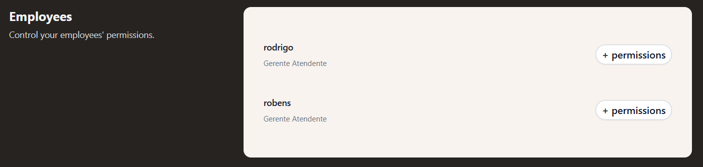  

Se você prestar atenção vai ver que nós conseguimos listar os usuários cadastrados, porém, não estamos exibindo suas categorias dinamicamente.

Por exemplo:

 - Attendant;
 - Manager.

Para fazer isso primeiro nós vamos instalar a biblioteca [django-role-permissions](https://django-role-permissions.readthedocs.io/en/stable/setup.html#installation):

```bash
poetry add django-role-permissions@latest
```

Agora nós precisamos adicionar ela nos Apps do nosso projeto:

[core/settings.py](../core/settings.py)
```python
INSTALLED_APPS = (
    ...
    'rolepermissions',
    ...
)
```

Agora nós precisamos criar *funções específicas (roles/regras)* para cada classe, mas antes:

 - Vamos criar um arquivo chamado `core/roles.py`.
   - Esse arquivo vai contar as classes com regras (roles) específicas para cada categoria.
 - Também precisamos relacionar essas regras (roles) com o nosso `core/settings.py`.

[core/settings.py](../core/settings.py)
```python
ROLEPERMISSIONS_MODULE = 'core.roles'
```

Ótimo, agora é só criar funções que trataram as permissões de cada tipo de usuário:

[core/roles.py](core/roles.py)
```python
from rolepermissions.roles import AbstractUserRole

class Manager(AbstractUserRole):
    available_permissions = {
        'training_ai': True,
    }
```

Vejam que no código acima:

 - O `cargo Manager` *tem permissão de treinar IA*:
   - `training_ai: True`.
 - Eu também preciso que ao clicar em `+ permissions` esse usuário clicado se torne um `Manager`:
   - Ou seja, ele terá permissão de *treinar IA*.

Para conseguir esse resultado primeiro vamos criar uma ROTA/URL `become_manager (tornar gerente)`:

[users/urls.py](../users/urls.py)
```python
urlpatterns = [
    path("become_manager/<int:id>", views.become_manager, name="become_manager"),
]
```

Diferente das outras Rotas/URL's nessa nós temos `/<int:id>` que significa que nós podemos passar parâmetros para essa view:

```bash
/become_manager/5
/become_manager/42
/become_manager/123
```

 - Os números (5, 42, 123...) são capturados e enviados para a view `become_manager()` como um argumento `id`.
 - Ou seja, nós precisamos desse id como parâmetro da nossa função `become_manager()` na view.

Continuando, agora vamos criar essa ação (view) de tornar um usuário `Manager`:

[users/views.py](../users/views.py)
```python
from rolepermissions.roles import assign_role

def become_manager(request, id):
    user = User.objects.get(id=id)
    assign_role(user, "manager")
    return redirect("permissions")
```

Vejam que:

 - Nós estamos utilizando o objeto `User` para pegar o usuário pelo `id`.
 - Nós estamos utilizando a função `assign_role()` para atribuir o cargo `manager` ao usuário.
 - Por fim, redirecionamos novamente para a ROTA/URL `permissions` para que a lista de usuários seja atualizada.

> Mas como eu faço para quando o usuário clicar em `+ permissions` chamar essa ação (view) de tornar um usuário `Manager`?

Simples, vamos chamar essa ação indicando essa ROTA/URL ao clicar nesse botão (URL):

[users/templates/permissions.html](../users/templates/permissions.html)
```html
<a href=""
class="rounded-full
      bg-white px-2.5
      py-1 text-md
      font-semibold
      text-gray-900
      shadow-xs ring-1
      ring-gray-300
      ring-inset hover:bg-gray-50
">+ permissions</a>
```

Agora falta alterar dinamicamente quem é `Manager` e quem é `Attendant`. Mas antes nós precisamos importar as tags do `django-role-permissions` para conseguir trabalhar com elas no nosso HTML:

[users/templates/permissions.html](../users/templates/permissions.html)
```html

```

Continuando, agora nosso HTML sabe quem tem permissões ou não podemos utilizar a lógica de programação para fazer isso:

[users/templates/permissions.html](../users/templates/permissions.html)
```html

    <li class="flex items-center justify-between gap-x-6 py-5">
        <div class="flex min-w-0 gap-x-4">
            <div class="min-w-0 flex-auto">
                <p class="text-sm/6 font-semibold text-gray-900">{{ user.username }}</p>
                <p class="mt-1 truncate text-xs/5 text-gray-500">
                    
                        Manager
                    
                        Attendant
                    
                </p>
            </div>
        </div>
        
            <a href=""
                class="
                  rounded-full bg-white
                  px-2.5 py-1 text-md
                  font-semibold text-gray-900
                  shadow-xs ring-1 ring-gray-300
                  ring-inset hover:bg-gray-50">+ permission</a>
        
    </li>

```

No código acima nós temos:

 - ``
   - Um faço for que vai iterar por cada usuário.
 - `<p class="text-sm/6 font-semibold text-gray-900">{{ user.username }}</p>`
   - Exibindo o nome do usuário atual: `{{ user.username }}`.
 - ``
   - Se o usuário tiver a permissão de gerente vamos exibir o texto `Manager`.
 - ``
   - Senão vamos exibir o texto `Attendant`.
 - ``
   - Se o usuário *"não tiver a permissão de gerente"* vamos exibir o botão `+ permissions`.
   - Ou seja, ele vai chamar a ação (view) de tornar um usuário `Manager` quando clicar nesse botão.

> **NOTE:**  
> Por enquanto, essas vão ser as permissões que vamos ter.


---

<div id="create-agent-app"></div>

## `Criando o App agent`

Continuando, agora nós vamos criar o App `agent` que vai ser responsável por representar os agentes do nosso projeto:

```bash
python manage.py startapp agent
```

[core/settings.py](../core/settings.py)
```python
INSTALLED_APPS = (
    ...
    'agent',
    ...
)
```


---

<div id="create-agent-url"></div>

## `Criando a ROTA/URL agent e janela training-ai.html (+Entendendo name="training_ai")`

Bem, agora nós vamos criar as ROTAS/URL's para o nosso App `agent`, começando pelo `core/urls.py`:

[core/urls.py](../core/urls.py)
```python
urlpatterns = [
    path("agent/", include("agent.urls")),
]
```

Continuando, agora precisamos criar as sub-ROTAS/URL's para o nosso App `agent`:

[agent/urls.py](../agent/urls.py)
```python
from django.urls import path

from . import views

urlpatterns = [
    path("training-ai/", views.training_ai, name="training_ai"),
]
```

Vejam que no código acima nós temos:

 - `training-ai/`
   - A ROTA/URL no browser vai ser `http://127.0.0.1:8000/agent/training-ai/`.
 - `views.training_ai`
   - A ação (view) que vai ser tomada ao acessar essa ROTA/URL.
 - `name="training_ai`
   - Esse `name` é um `alias/nome da rota`, que permite referenciar essa URL em outros lugares, como templates, view, reverse(), etc., sem precisar escrever o caminho da URL diretamente.
   - Por exemplo: `<a href="">Ir para o treinamento</a>`

**NOTE:**  
> - Outra observação aqui é o seguinte, quando você chama o `training_ai (ou seja, alias)` em alguma parte do seu projeto o que ela faz é chamar a rota `training-ai/`.
> - Ou seja, `training_ai` é apenas um nome interno usado para facilitar referências, mas ele aponta para a rota real `/training-ai/`.

Continuando, agora nós precisamos criar uma view (ação), por exemplo vamos começar apenas com ela chamando um arquivo HTML (`training-ai.html`):

[agent/views.py](../agent/views.py)
```python
from django.shortcuts import render


def training_ai(request):
    if request.method == "GET":
        return render(request, "training-ai.html")
```

Por fim, vamos criar o arquivo HTML `training-ai.html` (como nosso foco não é o frontend vou apenas deixar o arquivo pronto):

[agent/templates/training-ai.html](../agent/templates/training-ai.html)
```html
É um arquivo muito grande (mais ou menos 150 linhas) não vou exibir...
```

Se tudo ocorrer bem você verá uma janela de treinamento.


---

<div id="create-agent-model"></div>

## `Mapeando o treinamento para o Banco de Dados (+Entendendo as migrações)`

> Agora nós vamos mapear os dados da janela `training-ai.html` com o nosso Banco de Dados.

Pa fazer isso primeiro nós precisamos criar um modelo em [agent/models.py](../agent/models.py) para representar esses dados:

[agent/models.py](../agent/models.py)
```python
from django.db import models


class Training(models.Model):
    site = models.URLField()
    content = models.TextField()
    document = models.FileField(upload_to="documents/")

    def __str__(self):
        return self.site
```

Agora nós precisamos criar as migrações no nosso Banco de Dados:

**Esse comando salva as alterações nas suas tabelas (código/models.py) em migrations/:**
```bash
python manage.py makemigrations
```

**Esse comando pega as migrações (em migrations/) e aplica no Banco de Dados:**
```bash
python manage.py migrate
```

Agora se você procurar no Banco de Dados verá a tabela `Training`:

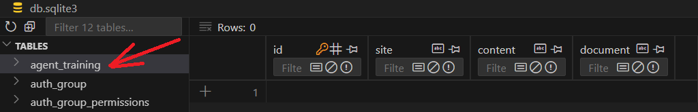

Agora nós precisamos que ao usuário enviar os dados (`request.method == "POST"`) em `training-ai.html` nós consigamos salvá-los em variáveis:

[agent/views.py](../agent/views.py)
```python
from django.shortcuts import render


def training_ai(request):
    if request.method == "GET":
        return render(request, "training-ai.html")
    elif request.method == "POST":
        site = request.POST.get("site")
        content = request.POST.get("content")
        document = request.FILES.get("document")
```

> Mas em qual parte do HTML que diz que podemos pegar esses dados?

 - `<input name="site"></input>`
   - Na tag `<input>` nós temos o campo `name="site"`.
   - É ela que nós estamos utilizando como referência.
 - `<textarea name="content"></textarea>`
   - Na tag `<textarea>` nós temos o campo `name="content"`.
   - É ela que nós estamos utilizando como referência.
 - `<input name="document" type="file">`
   - Por fim, na tag `<input>` nós temos o campo `name="document"`.
   - É ela que nós estamos utilizando como referência.

> **NOTE:**  
> Se for de seu interesse você pode dar um print de cada campo para ver o que está sendo enviado no terminal.

```python
def training_ai(request):
    if request.method == "GET":
        return render(request, "training-ai.html")
    elif request.method == "POST":
        site = request.POST.get("site")
        content = request.POST.get("content")
        document = request.FILES.get("document")
        print("Site typed:", site)
        print("Content typed:", content)
        print("Document sended:", document)
        return redirect("training-ai.html")
```

**OUTPUT:**
```bash
Site typed: pythonando.com.br
Content typed: Esse é um teste...
Document sended: rodrigo-dev.pdf
```

> Ótimo, mas como eu envio isso para o Banco de Dados?

Para fazer isso é simples:

 - Primeiro nós importamos o modelo em [agent/models.py](../agent/models.py);
 - Depois, relacionamos cada variável do modelo com às do nosso formulário;
 - Depois, nós salvamos no Banco de Dados com o método `save()`;
 - Por fim, nós redirecionamos para a ROTA/URL `training-ai` novamente.

[agent/views.py](../agent/views.py)
```python
from django.shortcuts import render, redirect

from .models import Training

def training_ai(request):
    if request.method == "GET":
        return render(request, "training-ai.html")
    elif request.method == "POST":
        site = request.POST.get("site")
        content = request.POST.get("content")
        document = request.FILES.get("document")

        training = Training(
            site=site,
            content=content,
            document=document,
        )
        training.save()

        return redirect("training_ai")
```

**OBSERVAÇÕES:**

 - Esse documento que você fez upload não vai para o Banco de Dados.
 - Ele vai para `media/documents/seu-documento`.
 - Ou seja, o que vai para o Banco de Dados é o caminho para esse documento a partir do root.


---

<div id="create-signal-observer"></div>

## `Criando um signal/observer para o nosso Banco de Dados`

> O que nós vamos fazer aqui é sempre que algo acontecer no Banco de Dados (por exemplo, criar um novo objeto/inserir dados) um signal/observer será executado.

Para começar a primeira coisa que nós precisamos fazer é dizer ao nosso [agent/apps.py](../agent/apps.py) para ler os signals/observers:

[agent/apps.py](../agent/apps.py)
```python
from django.apps import AppConfig


class AgentConfig(AppConfig):
    default_auto_field = "django.db.models.BigAutoField"
    name = "agent"

    def ready(self):  # noqa: PLR6301
        import agent.signals  # noqa: F401, PLC0415
```

> **NOTE:**  
> Esses `# noqa:` são para os códigos passarem no linter.

Continuando, vamos criar o arquivo [agent/signals.py](../agent/signals.py) que terá o seguinte código (é só um teste por enquanto):

[agent/signals.py](../agent/signals.py)
```python
from django.db.models.signals import post_save
from django.dispatch import receiver

from .models import Training


@receiver(post_save, sender=Training)
def signals_treinamento_ia(sender, instance, created, **kwargs):
    print(instance.site)
    print(instance.content)
    print(instance.document)
    print("Executed...")
```

Agora, se você olhar no terminal vai ver o que esse *signal/observer (instance)* está capturando/observando o objeto que foi criado (instance) e seus conteúdos (site, content, document).

**OUTPUT:**
```bash
pythonando.com.br
Signal test...
documents/rodrigo-dev.pdf
Executed...
```

> Mas e esses parâmetros/decoradores?

 - `✅ @receiver(...)`
   - Esse é um decorator do Django (vem de from django.dispatch import receiver) que:
     - Conecta sua função a um sinal específico (como post_save, pre_save, etc.).
     - Faz com que a função seja chamada automaticamente quando esse sinal for disparado.
   - `post_save`
     - Esse é o sinal do Django que é disparado automaticamente após um `save()` bem-sucedido em qualquer modelo Django.
     - Ele vem de from `django.db.models.signals import post_save`
     - **NOTE:** Outros sinais comuns: `pre_save`, `post_delete`, `pre_delete`, etc.
   - `sender=Training`
     - Esse parâmetro limita o sinal para ser disparado apenas quando um objeto do modelo `models.Training` for salvo.
     - **NOTE:** Sem `sender=...`, o receiver poderia reagir a qualquer modelo que disparasse `post_save`.
     - Ou seja, quando um objeto do tipo `Training` for salvo, chame essa função. 
 - `✅ def signals_treinamento_ia(sender, instance, created, **kwargs):`
   - Essa é a função que vai ser chamada toda vez que o sinal for disparado.
     - `sender`
       - A classe do modelo que enviou o sinal (neste caso, Training).
     - `instance`
       - A instância específica de `Training` que foi salva.
     - `created`
       - Booleano que indica se o objeto foi criado agora (True) ou atualizado (False).
     - `**kwargs`
       - Parâmetros extras que o Django pode enviar (como using, raw, etc.).


---

<div id="create-tasks-training"></div>

## `Pré-Processando as entradas antes do treinamento`

Ótimo, nós temos um signal/observer que sempre que um novo objeto `Training` for criado ele vai executar a função `task_trainin_ai()`.

> Mas vocês concordam comigo que antes de mandar esses dados para algum tipo treinamento antes nós precisamos fazer um pré-processamento?

Então, é isso que nós vamos fazer agora:

 - Entender cada campo que o usuário digitou;
 - Fazer um *pré-processamento* nesses campos;
 - Por fim, mandar esses dados para treinamento.

Para começar vamos instalar as bibliotecas necessárias para fazer esse processo:

```bash
poetry add langchain@latest
```

```bash
poetry add langchain-community@latest
```

```bash
poetry add pypdf@latest
```

```bash
poetry add beautifulsoup4@latest
```

```bash
poetry add sentence-transformers@latest
```

```bash
poetry add langchain-huggingface@latest
```

```bash
poetry add faiss-cpu@latest
```

Ótimo, agora que nós já temos todas as bibliotecas necessárias instaladas vamos partir para a implementação.

Vamos começar dizendo ao nosso signal/observer que ele executará uma função `task_trainin_ai()` sempre que um novo objeto `Training` for criado:

[agent/signals.py](../agent/signals.py)
```python
@receiver(post_save, sender=Training)
def signals_treinamento_ia(sender, instance, created, **kwargs):
    if created:
        task_trainin_ai(instance.id)
```

Vejam que se a instância do objeto for criada (created=True):

 - Vamos executar a função `task_trainin_ai()`;
 - E passar como argumento o `id` dessa instância.

> Mas que função `task_trainin_ai()` é essa?

Vamos criar ela agora:

[agent/signals.py](../agent/signals.py)
```python
def task_trainin_ai(training_id):
    training = Training.objects.get(id=training_id)
    print(training_id)
    print(training)
```

Bem, vamos inserir algo no Banco de Dados (site, conteúdo, documento) e ver o que acontece no terminal:

**OUTPUT:**
```bash
11
pythonando.com.br
```

> What? Como assim?

 - `print(training_id)`
   - Vai exibir o ID do *objeto Training* recém-criado.
   - Que você recebeu em `task_trainin_ai(instance.id)`.
 - `print(training)`
   - Vai exibir a representação textual (string) do *objeto Training* com o ID passado.
   - ⚠️ Isso depende do que você definiu no método `__str__()` dentro do seu modelo:
     - Se você definiu como `def __str__(self): return self.site` vai exibir `pythonando.com.br`.
   - ⚠️ Se você não tem `__str__()` no *modelo Training*:
     - O Django vai usar o padrão: `<Training: Training object (7)>`

> **NOTE:**  
> Essa explicação de cima foi mais para a gente entender o que acontece quando um novo objeto `Training` é criado sem o método `__str__()` implementado corretamente.

Na verdade o que nós precisamos mesmo é passar só a instância do objeto porque por padrão (default) os modelos do Django já tem esse ID:

[agent/signals.py](../agent/signals.py)
```python
def task_trainin_ai(instance):
    print("Instance id:",instance.id)
```

Vamos inserir algo no Banco de Dados (site, conteúdo, documento) novamente e ver o que acontece no terminal:

**OUTPUT:**
```bash
Instance id: 15
```

> **NOTE:**  
> Novamente, nós estamos apenas entendendo como o Djando funciona, mas o que nós precisamos mesmo é pegar esses dados e tratá-los separadamente com uma função de *Pré-Processamento* `generate_documents(instance)`.

Vamos começar implementando uma verificação se a instancia passada para a função `generate_documents(instance)` tem os campos preenchidos:

[agent/utils.py](../agent/utils.py)
```python
def generate_documents(instance):
    if instance.site:
        print(instance.site)
    if instance.content:
        print(instance.content)
    if instance.document:
        print(instance.document)
```

Agora nós vamos chamar essa função `generate_documents(instance)` na função `task_trainin_ai(training_id)` (É só um teste por enquanto):

[agent/signals.py](../agent/signals.py)
```python
def task_trainin_ai(instance):
    generate_documents(instance)
```

Agora, se nós inserirmos alguns dados no Banco de Dados (site, conteúdo, documento) vamos ter algo parecido com isso no terminal:

**OUTPUT:**
```bash
pythonando.com.br
Teste if's...
documents/rodrigo-dev.pdf
```

> **NOTE:**  
> Uma observação aqui é que se esses campos não forem preenchidos, eles não serão impressos porque o retorno será `None`.

Continuando, vamos começar tratando (entendendo) o campo `document`:

[agent/utils.py](../agent/utils.py)
```python
def generate_documents(instance):
    if instance.document:
        print(instance.document)
```

**OUTPUT:**
```bash
documents/rodrigo-dev.pdf
```

Vejam que o que nós temos não é o documento, mas sim o caminho para esse documento. Então, vamos pegar esse caminho e quebrar em partes (split) por ponto (.):

[agent/utils.py](../agent/utils.py)
```python
from langchain_community.document_loaders import PyPDFLoader

def generate_documents(instance):
    if instance.document:
        doc = instance.document.name.split('.')
        print(doc)
```

**OUTPUT:**
```bash
['documents/rodrigo-dev', 'pdf']
```

Vejam que agora nós temos uma lista com 2 itens:

 - `documents/rodrigo-dev`
   - Caminho do documento.
 - `pdf`
   - Extensão do documento.

**Pegando a extensão do arquivo:**  
É interessante sempre nós termos as extensões de arquivos que nós vamos trabalhar para fazer filtros. Por exemplo, nesse nosso projeto vamos trabalhar com arquivos PDF, então vamos pegar essa extensão.

> **Mas como pegar só a extensão?**
> É só pegar o último item da lista: `[-1]`

[agent/utils.py](../agent/utils.py)
```python
def generate_documents(instance):
    if instance.document:
        extension = instance.document.name.split('.')[-1]
        print(extension)
```

**OUTPUT:**
```bash
pdf
```

 - Outra observação é que se o usuário salvar com uma extensão maiúsculas, podemos ter um problema de verificação.
 - Por isso, vamos adicionar `.lower()` na extensão:

[agent/utils.py](../agent/utils.py)
```python
def generate_documents(instance):
    if instance.document:
        extension = instance.document.name.split('.')[-1].lower()
        print(extension)
```

> Mas para que eu quero essa extensão?

Bem, nós podemos criar uma verificação para saber se a extensão do documento é `pdf` e se for nós lemos esse arquivo, até porque o que nós temos até agora é só o caminho.

[agent/utils.py](../agent/utils.py)
```python
from langchain_community.document_loaders import PyPDFLoader

def generate_documents(instance):
    if instance.document:
        extension = instance.document.name.split('.')[-1].lower()
        if extension == 'pdf':
            loader = PyPDFLoader(instance.documento.path)
            pdf_doc = loader.load()
            print(pdf_doc)
```

**OUTPUT:**
```bash
Vai ser exibido o texto do PDF...
Não vou mostrar porque era muito grande!!!
OBS: Inclusive é uma "lista" de textos...
```

> Ótimo, conseguimos ler o texto e agora?

Agora nós temos que guardar esse texto em algum lugar, por exemplo, uma lista e retornar esse lista no final da função:

[agent/utils.py](../agent/utils.py)
```python
from langchain_community.document_loaders import PyPDFLoader

def generate_documents(instance):
    documents = []
    if instance.document:
        extension = instance.document.name.split('.')[-1].lower()
        if extension == 'pdf':
            loader = PyPDFLoader(instance.document.path)
            pdf_doc = loader.load()
            documents += pdf_doc

    return documents
```

> **NOTE:**  
> Ótimo, nós estamos conseguindo retornar o texto do PDF para quem chamar a função `generate_documents(instance)`, que no caso foi a função `task_trainin_ai(instance)`.

Agora nós vamos fazer o mesmo pré-processamento, porém, para o `content`...  

Vamos começar entendendo esse campo:

[agent/utils.py](../agent/utils.py)
```python
def generate_documents(instance):
    documents = []

    ...

    if instance.content:
        print(instance.content)

    return documents
```

**OUTPUT:**
```bash
Testo digitado...
```

> Ótimo é só passar esse texto para a lista com a função `.append()`?  
> **NÂO!**

#### ✅ O que essa versão faz?

 - Adiciona o texto cru (uma str) diretamente na lista documents.

#### ❌ O que você perde ao fazer isso?

 - Você não está criando um objeto Document, então perde recursos importantes da biblioteca LangChain, como:
   - Metadados (`metadata={...}`);
   - Identificação de origem;
   - Compatibilidade com outros componentes da LangChain (por exemplo, o FAISS ou retrievers);
   - Suporte para `.page_content` (muitos módulos esperam isso).

Sabendo disso vamos transformar esse texto em um `objeto Document` do *LangChain*:

[agent/utils.py](../agent/utils.py)
```python
from langchain.docstore.document import Document

def generate_documents(instance):
    documents = []

    ...

    if instance.content:
        content_object = Document(page_content=instance.content)
        print(content_object)
        print(type(content_object))

    return documents
```

**OUTPUT:**
```bash
page_content='Esse é um teste...'
<class 'langchain_core.documents.base.Document'>
```

Vejam que agora nós temos:

 - Texto em `page_content`;
 - Um objeto LangChain `Document`;
 - E o tipo dele é `langchain_core.documents.base.Document`.

#### ✅ Quando usar Document(page_content=...)?

Se você pretende usar a lista documents com:

 - VectorStores (como FAISS, Chroma, Pinecone);
 - Retrievers;
 - RAG pipelines da LangChain.

Agora que nós entendemos vamos modificar essa função para adicionar esse objeto na nossa lista `documents`:

[agent/utils.py](../agent/utils.py)
```python
from langchain_community.document_loaders import PyPDFLoader
from langchain.docstore.document import Document

def generate_documents(instance):
    documents = []
    if instance.document:
        extension = instance.document.name.split('.')[-1].lower()
        if extension == 'pdf':
            loader = PyPDFLoader(instance.document.path)
            pdf_doc = loader.load()
            documents += pdf_doc

    if instance.content:
        content_object = Document(page_content=instance.content)
        documents.append(content_object)

    return documents
```

> E o site que o usuário digitar?

Novamente, vamos começar entendendo o campo `site`:

[agent/utils.py](../agent/utils.py)
```python
if instance.site:
    print(instance.site)
    print(type(instance.site))
```

**OUTPUT:**
```bash
pythonando.com.br
<class 'str'>
```

**Bem, nós temos um texto do tipo `str`.**  
Agora nós precisamos inserir o `https://` no inicio:

[agent/utils.py](../agent/utils.py)
```python
if instance.site:
    if instance.site.startswith('https://'):
        site_url = instance.site
    else:
        site_url = f'https://{instance.site}'
```

Continuando, agora nós precisamos fazer uma requisição (request) para esse site e pegar o HTML do mesmo:

[agent/utils.py](../agent/utils.py)
```python
import requests

if instance.site:
    if instance.site.startswith('https://'):
        site_url = instance.site
    else:
        site_url = f'https://{instance.site}'
    site_content = requests.get(site_url, timeout=10).text
    print(site_content)
    print(type(site_content))
```

**OUTPUT:**
```bash
Vai mostrar todo o HTML do site...

<class 'str'>
```

O problema é o seguinte:

 - Nós vamos ter todo o HTML da página:
   - Pode ser muito grande.
 - Novamente, temos um texto `str`.

> **NOTE:**  
> O interessante aqui seria transformar esse HTML em algo mais limpo (fácil do nosso modelo entender).

Para fazer isso vamos criar uma outra função utilitária `html_to_rag_text()`:

[agent/utils.py](../agent/utils.py)
```python
from bs4 import BeautifulSoup

def html_to_rag_text(html_str: str) -> str:
    soup = BeautifulSoup(html_str, "html.parser")
    final_text = []

    for tag in soup.find_all(["h1", "h2", "h3", "p", "li"]):
        text = tag.get_text(strip=True)

        if not text:
            continue

        if tag.name in {"h1", "h2", "h3"}:
            formatted_text = f"\n\n### {text.upper()}"
        elif tag.name == "li":
            formatted_text = f" - {text}"
        else:
            formatted_text = text

        final_text.append(formatted_text)

    return "\n".join(final_text).strip()
```

Bem no código acima nós estamos fazendo o seguinte:

 - `from bs4 import BeautifulSoup`
   - BeautifulSoup é usada para analisar (parsear) HTML ou XML e facilitar a extração de dados.
   - É muito útil para limpar, transformar ou navegar em estruturas HTML.
 - `def html_to_rag_text(html_str: str) -> str:`
   - Define uma função que recebe uma string contendo HTML (html_str);
   - E *"retorna uma string limpa e formatada"* para uso em sistemas de RAG (Retrieval-Augmented Generation).
 - `soup = BeautifulSoup(html_str, "html.parser")`
   - Transforma o HTML em um objeto navegável (soup) usando o parser nativo do Python (html.parser).
 - `final_text = []`
   - Inicializa uma lista vazia que vai guardar o texto extraído e formatado.
 - `for tag in soup.find_all(["h1", "h2", "h3", "p", "li"]):`
   - Procura todas as tags `h1`, `h2`, `h3`, `p` e `li` (que são títulos, parágrafos e itens de lista).
   - Faz um loop por cada uma dessas tags.
 - `text = tag.get_text(strip=True)`
   - Extrai só o texto interno da tag, removendo espaços desnecessários.
 - `if not text: continue`
   - Se o conteúdo estiver vazio (ex: `<p> </p>`), pula para a próxima tag.
 - `if tag.name in ["h1", "h2", "h3"]: formatted_text = f"\n\n### {text.upper()}"`
   - Se for título `(h1, h2, h3)`, transforma o texto em maiúsculo e adicionando `###` (como um título estilo Markdown).
 - `elif tag.name == "li": formatted_text = f" - {text}"`
   - Se for um item de lista `(li)`, adiciona um marcador `-` antes do texto.
 - `else: formatted_text = text`
   - Se for um `parágrafo (p)`, usa o texto sem nenhuma formatação extra.
 - `final_text.append(formatted_text)`
   - Adiciona o texto formatado na lista final_text.
 - `return "\n".join(final_text).strip()`
   - Junta todos os itens da lista com quebras de linha.
   - Remove espaços extras no início e fim do resultado final.
   - Por fim, retorna o texto formatado.

Ótimo, agora é só importar essa função para formatar nosso HTML em um texto mais amigável (parecido com um markdown):

[agent/utils.py](../agent/utils.py)
```python
if instance.site:
    if instance.site.startswith('https://'):
        site_url = instance.site
    else:
        site_url = f'https://{instance.site}'
    site_content = requests.get(site_url, timeout=10).text
    site_content = html_to_rag_text(site_content)
    print(site_content)
    print(type(site_content))
```

**OUTPUT:**
```bash
Novamente nós vamos ter um texto muito grande
que foi formatado com a função html_to_rag_text().
Mas sem as tags e etc.

Também do tipo <class 'str'>
```

Ótimo, agora é só pegar esse texto formatado e fazer o mesmo que fizemos com content, **transformar em um Document LangChain** e salvar na lista `documents`:

[agent/utils.py](../agent/utils.py)
```python
def generate_documents(instance):
    documents = []
    if instance.document:
        extension = instance.document.name.split('.')[-1].lower()
        if extension == 'pdf':
            loader = PyPDFLoader(instance.document.path)
            pdf_doc = loader.load()
            documents += pdf_doc

    if instance.content:
        content_object = Document(page_content=instance.content)
        documents.append(content_object)

    if instance.site:
        if instance.site.startswith('https://'):
            site_url = instance.site
        else:
            site_url = f'https://{instance.site}'
        site_content = requests.get(site_url, timeout=10).text
        site_content = html_to_rag_text(site_content)
        content_object = Document(page_content=site_content)
        documents.append(content_object)

    return documents
```

> **NOTE:**  
> Ótimo, agora nós temos nossa função de *Pré-Processamento* `generate_documents(instance)` pronta para ser usada em `task_trainin_ai(instance)`.


---

<div id="prepare-to-train"></div>

## `Preparando os dados (chunk, overlap, embeddings) e salvando em um BD FAISS`

> Bem, agora nós já temos nossos *dados (lista documents)* prontos para serem treinados.

Vamos começar vendo o que realmente a função `task_trainin_ai()` recebeu de `generate_documents()`:

[agent/signals.py](../agent/signals.py)
```python
def task_trainin_ai(instance):
    documents = generate_documents(instance)
    print(type(documents))
    print(len(documents))
```

**OUTPUT:**
```bash
<class 'list'>
3
```

Vejam que nós temos uma lista com 3 itens (0, 1, 2):

 - 0: Documento PDF;
 - 1: Conteúdo;
 - 2: Site.

Vamos ver 1 por 1 só para testes:

[agent/signals.py](../agent/signals.py)
```python
def task_trainin_ai(instance):
    documents = generate_documents(instance)
    for doc in documents:
        print("\n--------------------------------------------\n")
        print(doc)
```

**OUTPUT:**
```bash
Não vou mostrar porque os textos são muito grande,
mas foi...

- Conteúdo do meu PDF.
- Conteúdo digitado pelo usuário.
- Conteúdo do meu site.
```

Ótimo, agora que nós já sabemos que os dados estão realmente chegando na função `task_trainin_ai(instance)`, vamos começar a implementar a função `task_trainin_ai(instance)`.

De início vamos fazer uma validação para verificar se nós não estamos recebendo uma instância vazia, ou seja, o usuário apertou em **"Train AI"** sem preencher nenhum campo:

[agent/signals.py](../agent/signals.py)
```python
def task_trainin_ai(instance):
    documents = generate_documents(instance)

    if not documents:
        return
```

Continuando, agora vamos criar um objeto `splitter` que será responsável por aplicar os conceitos de *Chunking* e *Overlap* nos nossos dados:

[agent/signals.py](../agent/signals.py)
```python
from langchain.text_splitter import RecursiveCharacterTextSplitter


def task_trainin_ai(instance):
    documents = generate_documents(instance)

    if not documents:
        return

    # Cria um splitter de 500 (documentos) e overlap de 100 (100 palavras casa)
    splitter = RecursiveCharacterTextSplitter(chunk_size=500, chunk_overlap=100)
```

Agora que nós já temos um objeto `splitter` criado, vamos utilizar ele para dividir nossos dados em pedaços menores com o método `split_documents(documents)`:

[agent/signals.py](../agent/signals.py)
```python
from langchain.text_splitter import RecursiveCharacterTextSplitter


def task_trainin_ai(instance):
    documents = generate_documents(instance)

    if not documents:
        return

    # Cria um splitter de 500 (documentos) e overlap de 100 (100 palavras casa)
    splitter = RecursiveCharacterTextSplitter(chunk_size=500, chunk_overlap=100)
    chunks = splitter.split_documents(documents)
```

Agora nós vamos utilizar uma Rede Neural (objeto) que foi treinada para pegar textos (palavras) e transformar em Embeddings (vetores):

[agent/signals.py](../agent/signals.py)
```python
from langchain_huggingface import HuggingFaceEmbeddings


def task_trainin_ai(instance):
    documents = generate_documents(instance)

    if not documents:
        return

    # Cria um splitter de 500 (documentos) e overlap de 100 (100 palavras casa)
    splitter = RecursiveCharacterTextSplitter(chunk_size=500, chunk_overlap=100)
    chunks = splitter.split_documents(documents)

    embeddings = HuggingFaceEmbeddings(model_name="all-MiniLM-L6-v2")
```

> **Então, já transformamos nossos textos (palavras) em Embeddings (vetores)?**  
> Não, até o momento nós só criamos um objeto para fazer isso.

Na verdade, nós vamos transformar nossos textos (palavras) em Embeddings (vetores) e depois já salvá-los em um *Banco de Dados (FAISS)*:

[agent/signals.py](../agent/signals.py)
```python
import os

from django.conf import settings
from langchain_community.vectorstores import FAISS


def task_trainin_ai(instance):
    documents = generate_documents(instance)

    if not documents:
        return

    # Cria um splitter de 500 (documentos) e overlap de 100 (100 palavras casa)
    splitter = RecursiveCharacterTextSplitter(
        chunk_size=500, chunk_overlap=100
    )
    chunks = splitter.split_documents(documents)

    embeddings = HuggingFaceEmbeddings(model_name="all-MiniLM-L6-v2")

    db_path = settings.BASE_DIR / "faiss_database"  # DB path
    # Create the directory if it doesn't exist
    db_path.mkdir(parents=True, exist_ok=True)

    index_path = db_path / "index.faiss"

    if index_path.exists():
        vectordb = FAISS.load_local(
            str(db_path), embeddings, allow_dangerous_deserialization=True
        )
        vectordb.add_documents(chunks)
    else:
        vectordb = FAISS.from_documents(chunks, embeddings)

    vectordb.save_local(str(db_path))
```

 - `db_path = settings.BASE_DIR / "faiss_database"`
   - Define o caminho (nome da pasta) onde o banco vetorial será salvo/localizado.
   - Neste caso, usaremos o caminho do diretório raiz (BASE_DIR) do projeto Django.
 - `db_path.mkdir(parents=True, exist_ok=True)`
   - Essa linha cria o diretório *faiss_database* caso ele ainda não exista.
   - Ela garante que o caminho onde o índice FAISS será salvo já existe no sistema de arquivos.
   - 🧠 Por que precisa disso?
     - O FAISS salva os arquivos `index.faiss` e `index.pkl` dentro dessa pasta.
     - Se a pasta não existir, o `.save_local()` vai falhar com erro *FileNotFoundError*.
     - A flag *parents=True* garante que qualquer pasta intermediária seja criada também (se necessário).
     - A flag *exist_ok=True* impede que ele dê erro se a pasta já existir.
 - `index_path = db_path / "index.faiss"`
   - Essa linha cria um objeto Path completo que aponta diretamente para o arquivo index.faiss:
     - Se *db_path* for `Path("faiss_database")`, então index_path será `Path("faiss_database/index.faiss")`.
 - `if index_path.exists():`
   - Verifica se já existe uma pasta chamada "faiss_database" no caminho (nome da pasta) passado.
   - Se existir, significa que o banco vetorial FAISS já foi criado antes.
   - `vectordb = FAISS.load_local(db_path, embeddings, allow_dangerous_deserialization=True)`:
     - Carrega o banco FAISS existente do disco: `FAISS.load_local()`.
     - Usa os embeddings fornecidos para garantir que novos documentos adicionados usem a mesma lógica de vetorização.
     - O parâmetro allow_dangerous_deserialization=True permite deserialização potencialmente insegura (por ex., se estiver carregando objetos complexos do disco).
   - `vectordb.add_documents(chunks)`:
     - Adiciona os novos documentos `vetorizados (chunks)` ao banco existente.
 - `else:`
   - Se o caminho (nome da pasta) do banco não existir, criaremos um novo do zero.
   - `vectordb = FAISS.from_documents(chunks, embeddings)`
     - Cria um novo banco vetorial FAISS a partir dos documentos `vetorizados (chunks)`.
     - Utiliza o objeto `embeddings` definido anteriormente para gerar os vetores dos textos.
 - `vectordb.save_local(db_path)`
   - Por fim, salva o banco vetorial FAISS no caminho (nome da pasta) *"faiss_database"*.

Se você prestar atenção vai ver que foi criado um diretório chamado `faiss_database` onde os `chunks` estarão armazenados. Porém, esses dados estão em *binário*.

> **Como eu vejo eles agora?**

Bem, eu tenho script simples, só para isso:

<details>

<summary>FAISS to JSON</summary>

<br/>

[faiss.view.py](../agent/faiss.view.py)
```python
import json
import os

from langchain_community.vectorstores import FAISS
from langchain_huggingface import HuggingFaceEmbeddings

# Path to the FAISS database
db_path = "faiss_database"

# Instantiate Hugging Face embeddings (free model)
embeddings = HuggingFaceEmbeddings(model_name="all-MiniLM-L6-v2")

# Load the FAISS index
db = FAISS.load_local(
    db_path, embeddings, allow_dangerous_deserialization=True
)

# Access the index and documents
faiss_index = db.index
documents = list(db.docstore._dict.values())

# Build the data
data = []
for i, doc in enumerate(documents):
    vector = faiss_index.reconstruct(i)
    item = {
        "id": i,
        "content": doc.page_content.replace("\n", " ").strip(),
        "partial_vector": vector[:10].tolist(),
    }
    data.append(item)

# Define the full path to save the JSON in the same directory as the index
json_path = os.path.join(db_path, "faiss_exported.json")

# Save the JSON file
with open(json_path, "w", encoding="utf-8") as jsonfile:
    json.dump(data, jsonfile, ensure_ascii=False, indent=2)

print("File created successfully.")
```

</details>

Agora se você olhar em [faiss_exported.json](../faiss_database/faiss_exported.json) vai ver um JSON com os `chunks` armazenados no formato JSON com os seus respectivos vetores.


---

<div id="create-workers"></div>

## `Criando/Entendendo Workers/Clusters`

Agora nós vamos imaginar que nosso servidor só consegue processar 2 requisições (processos) por vez:

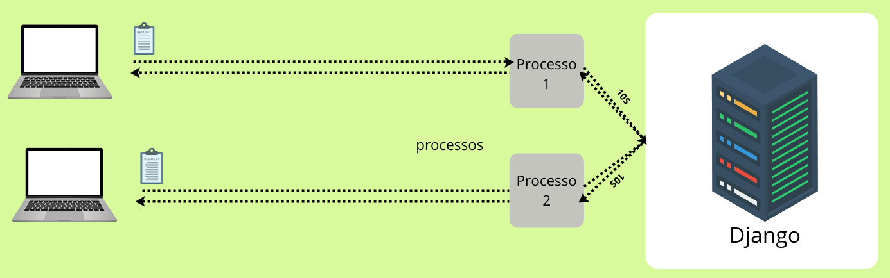  

Bem, no exemplo acima está tudo bem porque:

 - Nós temos 2 requisições;
 - Nosso servidor consegue processar 2 requisições por vez.

> Se nós recebermos 3 requisições simultaneamente?

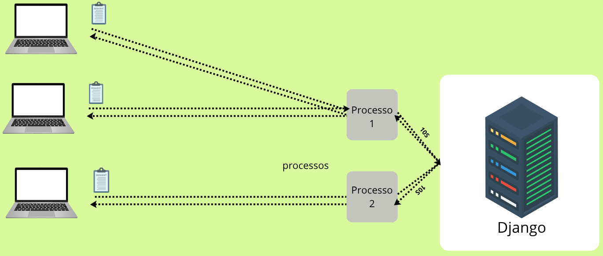  

> **Bem, nós temos um problema!**  
> Como resolver?

Para resolver isso nós vamos utilizar o conceito de **"Worker"**:

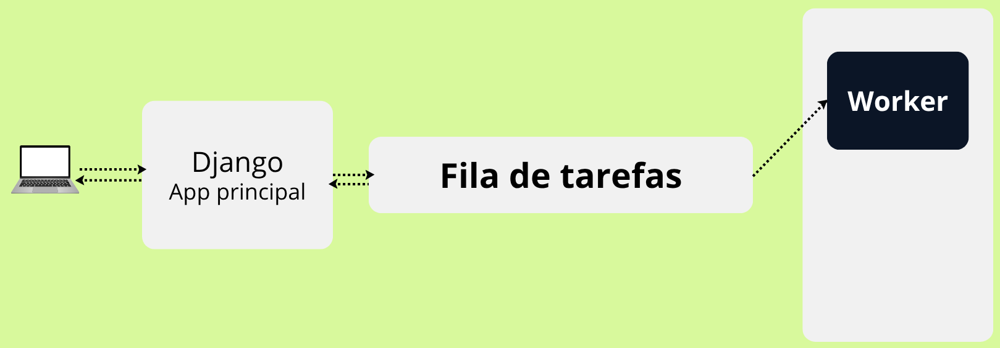  

> **NOTE:**  
> Agora toda vez que nossa aplicação receber uma requisição, essa requisição vai ser enviada para uma **"Fila de Tarefas"**.

Bem, para aplicar esse conceito nós vamos utilizar a biblioteca [Django Q2](https://github.com/django-q2/django-q2):

```bash
poetry add django-q2@latest
```

Agora vamos adicionar esse App no nosso projeto:

[settings.py](../core/settings.py)
```python
INSTALLED_APPS = [
    ...
    "django_q",
    ...
]
```

Agora nós precisamos definir o cluster, ou seja, o conjunto de **workers**:

[settings.py](../core/settings.py)
```python
Q_CLUSTER = {
    "name": "easyrad",
    "workers": 1,
    'timeout': 60,  # ← tempo de execução máxima de uma tarefa
    'retry': 90,    # ← tempo de espera para repetir se falhar (deve ser maior)
    "queue_limit": 50,
    "orm": "default",
}
```

Ótimo, agora vamos fazer nossos códigos entenderem isso:

[signals.py](../agent/signals.py)
```python
from django_q.tasks import async_task

@receiver(post_save, sender=Training)
def signals_treinamento_ia(sender, instance, created, **kwargs):
    if created:
        async_task(task_trainin_ai, instance)
```

No código acima:

 - Nós estamos utilizando a função `async_task` do Django Q2;
 - Essa função recebe 2 parâmetros:
   - A função que queremos executar;
   - Os dados (para nosso exemplo é uma instânia de `Training`) que essa função receberia.

Agora nós precisamos aplicar as migrações de Banco de Dados para o nosso [Django Admin](http://localhost:8000/admin/) reconhecer esse processo:

```bash
python manage.py migrate
```

Pronto, agora se você olhar novamente no seu [Django Admin](http://localhost:8000/admin/) vai ver os possíveis `status` de cada *tarefa (task)* no **DJANGO Q**:

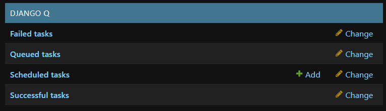  

**NOTE:**  
Agora tente inserir conteúdo (Site, Conteúdo, PDF) para sua base de dados e veja se ela está sendo treinada, ou seja, foi criada no seu Banco de Dados FAISS: [/faiss_database](../faiss_database/).

> **What? Como assim?**
> Bem, nossa aplicação não executa mas a função `task_trainin_ai(instance)`, quem vai fazer isso é o nosso cluster/worker.

Mas, para esse cluster/worker funcionar, nós precisamos que ele esteja executando em background:

```bash
python manage.py qcluster
```

> **NOTE:**  
> Agora se você olhar novamente em [/faiss_database](../faiss_database/) vai ver os arquivos criados pelo nosso cluster/worker.


---

<div id="list-tasks"></div>

## `Listando as tarefas (tasks) do Django Q2 na interface web`

> Agora nós vamos listas as tarefas do nosso Django Q2 na nossa interface web.

Lembram da nossa view [views.py](../agent/views.py) `training_ai`?

[views.py](../agent/views.py)
```python
def training_ai(request):
    if request.method == "GET":
        return render(request, "training-ai.html")
    elif request.method == "POST":
        site = request.POST.get("site")
        content = request.POST.get("content")
        document = request.FILES.get("document")

        training = Training(
            site=site,
            content=content,
            document=document,
        )
        training.save()

        return redirect("training_ai")
```

Lembrem que o nosso `if request.method == "GET"` que chama/requisita o template `training-ai.html`, então o que nós precisamos agora é passar os status de cada para essa ação (view).

> Mas como?

O *django_q* tem o objeto `Task` que pode ser utilizado para pegar os status das tarefas do nosso `Worker/Cluster`:

[views.py](../agent/views.py)
```python
from django_q.models import Task


def training_ai(request):
    if request.method == "GET":
        tasks = Task.objects.all()
        return render(request, "training-ai.html", {"tasks": tasks})
```

Ótimo, nós passamos os status de todas as tarefas para o nosso template `training-ai.html`, agora é só manipular eles.

Vamos começar criando um loop  para listar essas tarefas:

[training-ai.html](../agent/templates/training-ai.html)
```html

    <tr class="even:bg-gray-50">
      <td class="py-4 pr-3 pl-4 text-sm
                  font-medium
                  whitespace-nowrap
                  text-gray-900 sm:pl-3">
        Teste...
      </td>
      <td class="px-3 py-4 text-sm
                  whitespace-nowrap
                  text-gray-500">
        Teste...
      </td>
      <td class="px-3 py-4 text-sm whitespace-nowrap">
          <span class="inline-flex
                        items-center
                        rounded-full
                        bg-green-100
                        px-2.5 py-0.5
                        text-green-800
                      text-xs font-medium">
            ✅
          </span>
        </td>
    </tr>

```

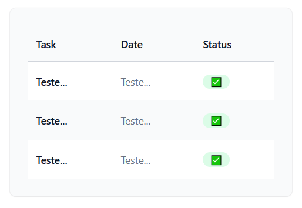

Vejam que nós listamos 3 itens porque nosso cluster/worker processou 3 tarefas.

> Mas quais são?

Vamos atualizar para mostrar o nome da tarefa e a data:

[training-ai.html](../agent/templates/training-ai.html)
```html
<td class="py-4 pr-3 pl-4 text-sm
            font-medium
            whitespace-nowrap
            text-gray-900 sm:pl-3">
  {{ task.name }}
</td>
<td class="px-3 py-4 text-sm
            whitespace-nowrap
            text-gray-500">
  {{ task.started|default:"-" }}
</td>
```

Agora vamos criar um if para validar os status das tarefas; se ela foi executada ou não:

[training-ai.html](../agent/templates/training-ai.html)
```html

    <tr class="even:bg-gray-50">
      <td class="py-4 pr-3 pl-4 text-sm
                  font-medium
                  whitespace-nowrap
                  text-gray-900 sm:pl-3">
        {{ task.name }}
      </td>
      <td class="px-3 py-4 text-sm
                  whitespace-nowrap
                  text-gray-500">
        {{ task.started|default:"-" }}
      </td>
      <td class="px-3 py-4 text-sm whitespace-nowrap">
          
              <span class="inline-flex
                          items-center
                          rounded-full
                          bg-green-100
                          px-2.5 py-0.5
                          text-green-800
                          text-xs font-medium">
                ✅
              </span>
          
              <span class="inline-flex
                          items-center
                          rounded-full
                          bg-green-100
                          px-2.5 py-0.5
                          text-green-800
                          text-xs font-medium">
                ❌
              </span>
          
        </td>
    </tr>

```

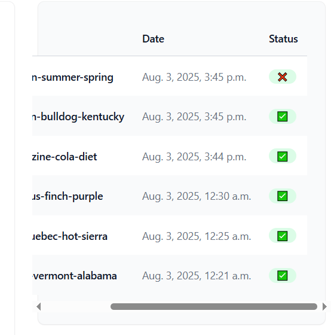  

> **NOTE:**  
> Vejam que se a tarefa (task) não for bem sucedida, ela vai apresentar um ❌ no nosso template.


---

<div id="chat-archicture"></div>

## `Arquitetura de pergunta e resposta`

Bem, antes de darmos continuídade ao desenvolvimento do nosso projeto vamos entender (planejar) como vai ser enviada (POST) as perguntas do usuário; para onde elas vão e depois quem vai pegar.

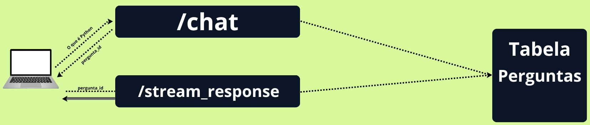  

Vejam que na arquitetura acima nós temos:

 - `Cliente`
   - Faz uma pergunta;
 - `/chat`
   - Pega essa pergunta e salva em uma *tabela de perguntas (Banco de Dados)*.
   - Retorna o `ID (question_id)` da pergunta para o usuário.
 - `/stream_chat`
   - Recebe do usuário o `ID (question_id)` da pergunta recebida do `/chat`;
   - Fica respondendo até que a conexão (pergunta) seja encerrada.


---

<div id="chat-url"></div>

## `Criando uma ROTA/URL para o meu chat.html`

Agora nós vamos criar uma ROTA/URL para o nosso chat:

[agent/urls.py](../agent/urls.py)
```python
from django.urls import path

from . import views

urlpatterns = [

    ...

    path("chat/", views.chat, name="chat"),

    ...
]
```

Continuando, agora nós precisamos dizer a nossa ação (view) que quando alguém acessar a ROTA/URL seja direcionada para o template `chat.html`:

[agent/views.py](../agent/views.py)
```python
def chat(request):
    if request.method == "GET":
        return render(request, "chat.html")
```

[agent/templates/chat.html](../agent/templates/chat.html)
```html
O HTML é muito grande, então não vou exibir...
```


---

<div id="question-model"></div>

## `Modelando as perguntas que o usuário envia ao chatbot`

Agora nós vamos modelar as perguntas que o usuário envia ao chatbot:

[agent/models.py](../agent/models.py)
```python
class TrainingData(models.Model):
    metadata = models.JSONField(null=True, blank=True)
    text = models.TextField()


class Question(models.Model):
    training_data = models.ManyToManyField(TrainingData)
    question = models.TextField()

    def __str__(self):
        return self.question
```

Na modelagem acima nós temos:

 - `class TrainingData(models.Model)`
   - O modelo que vai representar os dados de treinamento.
   - Ou seja, quais dados (Site, Conteúdo, PDF) foram utilizados para treinar o modelo
   - `metadata = models.JSONField(null=True, blank=True)`
     - Armazena dados estruturados em formato JSON, como:
       - `{"source": "site", "author": "John", "date": "2023-01-01"}`
 - `class Question(models.Model)`
   - O modelo que vai representar as perguntas.
   - Ou seja, quais perguntas foram feitas ao chatbot.
   - `training_data = models.ManyToManyField(TrainingData)`
     - Uma relação muitos-para-muitos com o modelo `TrainingData`.
     - Ou seja, uma pergunta pode ter vários dados de treinamento.
   - `question = models.TextField()`
     - Armazena o texto da pergunta.

Agora vamos aplicar as migrações:

```bash
python manage.py makemigrations
```

```bash
python manage.py migrate
```


---

<div id="register-table-admin"></div>

## `Registrando os modelos/tabelas no Django Admin`

> Outra coisa interessante que podemos fazer é registrar nossos modelos/tabelas para serem vistos no `Django Admin`.

Esse registro é feito em [admin.py](../agent/admin.py), no seu respectivo app:

[agent/admin.py](../agent/admin.py)
```python
from django.contrib import admin
from .models import TrainingData, Question

admin.site.register(TrainingData)
admin.site.register(Question)
```

> **NOTE:**  
> Agora se você procurar no seu `Django Admin` vai aparecer as tabelas `TrainingData` e `Question`.


---

<div id="post-question"></div>

## `Pegando a pergunta do usuário (POST); salvando e retornando o ID (question_id) da pergunta`

Agora nós vamos mapear a pergunta do usuário (POST) com o nosso modelo:

[agent/views.py](../agent/views.py)
```python
from django.http import JsonResponse
from django.views.decorators.csrf import csrf_exempt

from .models import Question

@csrf_exempt
def chat(request):
    if request.method == "GET":
        return render(request, "chat.html")
    elif request.method == "POST":
        user_question = request.POST.get("question")
        question = Question(question=user_question)
        question.save()
        return JsonResponse({"id": question.id})
```

No código acima:

 - `@csrf_exempt`
   - Esse decorador diz ao Django que essa view pode receber requests sem CSRF.
 - `elif request.method == "POST"`
   - Se for o método POST, ou seja, se o usuário enviar uma pergunta ao chatbot.
 - `user_question = request.POST.get("question")`
   - Pega o texto da pergunta do usuário.
 - `question = Question(question=user_question)`
   - Cria um objeto `Question` com o texto da pergunta do usuário.
 - `question.save()`
   - Salva o objeto `Question` no Banco de Dados.
 - `return JsonResponse({"id": question.id})`
   - Retorna um JSON com o ID da pergunta.

> Como eu testo (vejo) isso na prática?

Vamos utilizar a extensão [Postman](https://marketplace.visualstudio.com/items?itemName=Postman.postman-for-vscode):

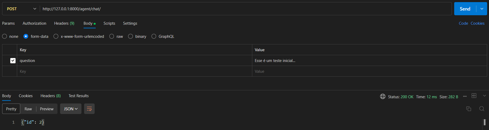  

Vejam que no exemplo acima:

 - Estamos utilizando o método `POST`;
 - Estamos vendo na aba `body`, ou seja, o corpo da requisição;
 - No formato de dados `form-data`;
 - Estamos dizendo qual a `key` vamos utilizar: `question`;
 - Passamos um valor para essa key: `Esse é um teste inicial...`;
 - Por fim, como esperado recebemos um dicionário (JSON) com o ID da pergunta: `{"id": 2}`.

Para finalizar (confirmar) vamos ver no Banco de Dados se realmente essa pergunta foi salva:

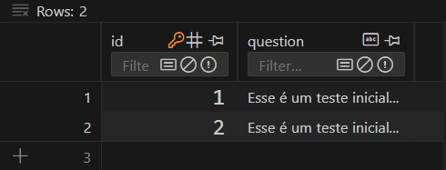  

Ótimo, estamos:

 - Salvando a pergunta do usuário no Banco de Dados;
 - Retornando o *ID (question_id)* da pergunta.


---

## `Criando a ROTA/URL stream_response`

Agora nós vamos criar uma ROTA/URL `stream_response` que será responsável por pegar a pergunta salva no Banco de Dados a partir do `id`:

[agent/urls.py](../agent/urls.py)
```python
from django.urls import path

from . import views

urlpatterns = [
    ...
    path("stream-response/", views.stream_response, name="stream_response"),
]
```

Agora vamos criar uma ação (view) para essa ROTA/URL pegar a pergunta salva no Banco de Dados a partir do `id`:

[agent/views.py](../agent/views.py)
```python
@csrf_exempt
def stream_response(request):
    question_id = request.POST.get("question_id")
    question_obj = Question.objects.get(id=question_id)
    return HttpResponse(question_obj.question)
```

No código acima nós estamos:

 - `question_id = request.POST.get("question_id")`
   - Pegando um `id` a partir do método `POST`.
 - `question_obj = Question.objects.get(id=question_id)`
   - Pegando o objeto (instância) a partir do `id`.
 - `return HttpResponse(question_obj.question)`
   - Retornando o texto da pergunta (objeto).

Vamos testar no Postman:

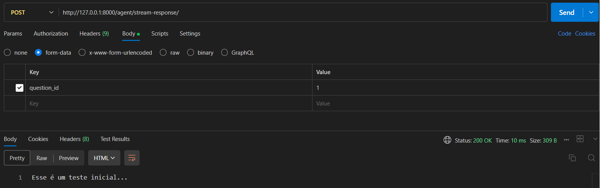  

Ótimo, nós estamos conseguindo pegar a pergunta salva no Banco de Dados a partir do `id`:


---

<div id="stream-generator"></div>

## `Criando a função utilitária stream_generator()`

Agora vamos criar uma função utilitária que vai pegar a pergunta do Banco de Dados e *relacionar (KNN)* com os nossos dados de treinamento: `stream_generator()`

[views.py](../agent/views.py)
```python
from langchain_huggingface import HuggingFaceEmbeddings
from langchain_community.vectorstores import FAISS
from django.conf import settings


def stream_generator(question_obj):

    db_path = settings.BASE_DIR / "faiss_database"  # DB path

    embeddings = HuggingFaceEmbeddings(model_name="all-MiniLM-L6-v2")

    vectordb = FAISS.load_local(
        str(db_path), embeddings, allow_dangerous_deserialization=True
    )

    docs = vectordb.similarity_search(question_obj.question, k=5)

    print("------------- ( docs settings ) -------------")
    print("TYPE:", type(docs))
    print("SIZE:", len(docs))

    print("---------------- ( LIST 00 ) ----------------")
    print("LIST 00 - METADATA:", docs[0].metadata)
    print("\nLIST 00 - PAGE_CONTENT:", docs[0].page_content)

    print("---------------- ( LIST 01 ) ----------------")
    print("LIST 01 - METADATA:", docs[1].metadata)
    print("\nLIST 01 - PAGE_CONTENT:", docs[1].page_content)

    print("---------------- ( LIST 02 ) ----------------")
    print("LIST 02 - METADATA:", docs[2].metadata)
    print("\nLIST 02 - PAGE_CONTENT:", docs[2].page_content)

    print("---------------- ( LIST 03 ) ----------------")
    print("LIST 03 - METADATA:", docs[3].metadata)
    print("\nLIST 03 - PAGE_CONTENT:", docs[3].page_content)

    print("---------------- ( LIST 04 ) ----------------")
    print("LIST 04 - METADATA:", docs[4].metadata)
    print("\nLIST 04 - PAGE_CONTENT:", docs[4].page_content)
```

No código acima as partes principais são:

 - `stream_generator(question_obj)`
   - Essa função recebe um objeto *question_obj (uma instância do modelo Question)* e busca os documentos mais similares a essa pergunta no banco vetorial *FAISS*. 
 - `embeddings = HuggingFaceEmbeddings(model_name="all-MiniLM-L6-v2")`
   - Esse modelo converte texto em vetores numéricos para que você possa comparar similaridade entre textos.
 - `vectordb = FAISS.load_local(str(db_path), embeddings, allow_dangerous_deserialization=True)`
   - Carregando o Banco Vetorial (FAISS) a partir do `db_path`.
 - `docs = vectordb.similarity_search(question_obj.question, k=5)`
   - Realiza uma busca vetorial com base no texto da pergunta (question_obj.question).
   - **NOTE:** `k=5` significa que ele *retornará os 5 documentos mais similares à pergunta*.

**OUTPUT:**
```bash
------------- ( docs settings ) -------------
TYPE: <class 'list'>
SIZE: 5
---------------- ( LIST 00 ) ----------------
LIST 00 - METADATA: {}

LIST 00 - PAGE_CONTENT: Teste FAISS...
---------------- ( LIST 01 ) ----------------
LIST 01 - METADATA: {}

LIST 01 - PAGE_CONTENT: Teste
---------------- ( LIST 02 ) ----------------
LIST 02 - METADATA: {}

LIST 02 - PAGE_CONTENT: Nós somos a única escola de programação que te fornece um suporte individualizado com reuniões, esse é um pilar essencial que acelera drasticamente sua jornada como programador.
Análises de códigos
Nas análises você nos envia o código de aplicações que tenha desenvolvido e nós o avaliamos informando pontos positivos e negativos.
Essa é uma das melhores formas de evoluir, já que podemos encontrar erros em seu código que muitas vezes passam despercebido.
Eventos entre alunos
---------------- ( LIST 03 ) ----------------
LIST 03 - METADATA: {}

LIST 03 - PAGE_CONTENT: Nós somos a única escola de programação que te fornece um suporte individualizado com reuniões, esse é um pilar essencial que acelera drasticamente sua jornada como programador.
Análises de códigos
Nas análises você nos envia o código de aplicações que tenha desenvolvido e nós o avaliamos informando pontos positivos e negativos.
Essa é uma das melhores formas de evoluir, já que podemos encontrar erros em seu código que muitas vezes passam despercebido.
Eventos entre alunos
---------------- ( LIST 04 ) ----------------
LIST 04 - METADATA: {}

LIST 04 - PAGE_CONTENT: Nós somos a única escola de programação que te fornece um suporte individualizado com reuniões, esse é um pilar essencial que acelera drasticamente sua jornada como programador.
Análises de códigos
Nas análises você nos envia o código de aplicações que tenha desenvolvido e nós o avaliamos informando pontos positivos e negativos.
Essa é uma das melhores formas de evoluir, já que podemos encontrar erros em seu código que muitas vezes passam despercebido.
Eventos entre alunos
```

Vejam que na saída (output) do terminal nós tivemos:

 - Uma lista `<class 'list'>`;
 - Essa lista contém 5 itens;
 - Cada item contém um `metadata` e um `page_content`:
   - Que são os campos da nossa modelagem em [models.py](../agent/models.py).

> **NOTE:**  
> Bem, os prints acima era só para depuração (entendermos o que está acontecendo).

O que nós queremos mesmo é salvar esses dados em uma instância de [models.TrainingData](../agent/models.py):

[views.py](../agent/views.py)
```python
from .models import Question, Training, TrainingData


def stream_generator(question_obj):

    ...

    for doc in docs:
        td = TrainingData(
                metadata=doc.metadata,
                text=doc.page_content
        )
        td.save()
```

Agora se você for no seu Postman e requisitar uma pergunta pelo `id` a resposta será mapeada para [models.TrainingData](../agent/models.py); você pode verificar no seu Django Admin (tabela).

> **NOTE:**  
> Porém, ainda não existe uma relação entre a pergunta (Question) e os dados de treinamento (TrainingData).

Para que isso aconteça nós precisamos adicionar essa relação manualmente:

[views.py](../agent/views.py)
```python
for doc in docs:
    td = TrainingData(
            metadata=doc.metadata,
            text=doc.page_content
    )
    td.save()
    question_obj.training_data.add(td)  # <-----
```

No código acima:

 - Nós estamos pegando a variável `training_data` do objeto `question_obj`:
   - `training_data = models.ManyToManyField(TrainingData)`
 - Nós estamos adicionando o `td` para essa variável.

> **NOTE:**  
> Se você fizer uma requisição novamente com o postman e olhar na tabela question (no Django Admin) verá que o campo **"Training data"** tem essa relação.


<!--- ( Teoria ) --->

---

<div id="intro-to-rag"></div>

## `RAG (Retrieval-Augmented Generation)`

Retrieval‑Augmented Generation (RAG) é uma técnica que combina:

 - Recuperação de documentos (retrieval);
 - Com modelos geradores de linguagem (generation).

Em vez de confiar apenas no conhecimento “embutido” nos parâmetros do modelo, o RAG permite que o sistema vá buscar trechos de texto relevantes em uma base externa (por exemplo, Wikipedia, banco de documentos corporativos) e use essas informações para gerar respostas mais precisas e contextualizadas.

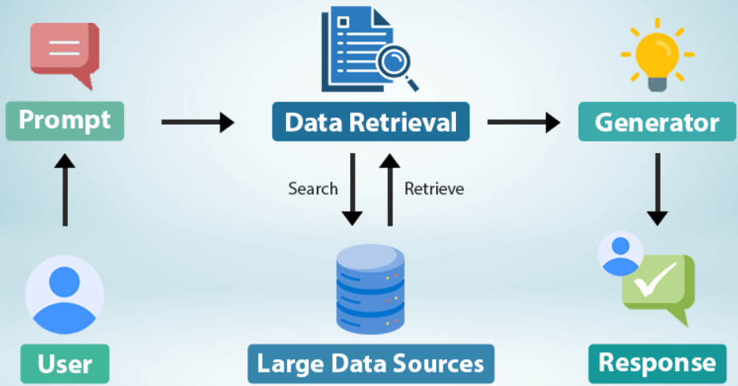  

### Quando utilizar RAG

 - **Base de conhecimento grande e em constante atualização:**
   - Documentações, FAQs, bases científicas.
 - **Domínios técnicos/especializados:**
   - Jurídico, médico, pesquisadores que exigem precisão e citações.
 - **Sistemas de suporte ao cliente:**
   - Chatbots que precisam referenciar manuais, políticas, termos de serviço.

### Quando não utilizar RAG

 - **Tarefas de conversação livre:**
   - Bate‑papo informal, criação de conteúdo criativo onde não há necessidade de buscar fatos externos.
 - **Restrições de latência:**
   - Se seu sistema exige respostas em tempo real (<100 ms) e não comporta o tempo extra de recuperação.
 - **Ambientes com poucos dados:**
   - Se a base de documentos for pequena e autossuficiente, pode ser mais simples usar um LLM puro ou até finetuning.


---

<div id="intro-to-chunks"></div>

## `Chunks`

> Imagina que você precisa criar um *RAG* que utiliza a **Constituição Federal** para auxiliar advogados.

Se, para uma pergunta sobre **direito do consumidor**, enviarmos *toda a constituição*, isso fará com que o modelo de IA não consiga processar todas as informações, já que, quanto maior o prompt, **menos precisa tende a ser a resposta**.

Para isso, utilizamos a técnica de **"chunks"**, onde, pegamos um arquivo geral e o quebramos em vários pequenos trechos:

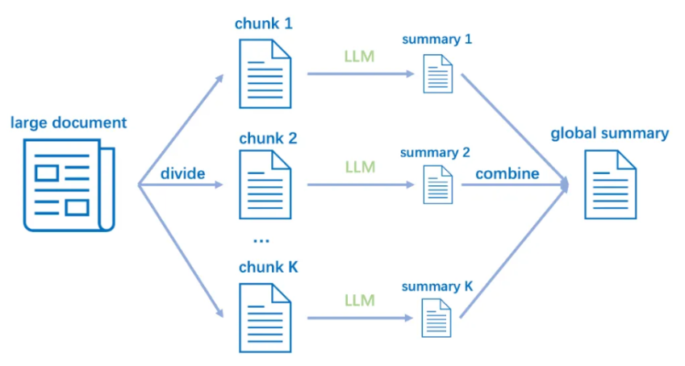  

> **NOTE:**  
> Podemos usar um `chunk_size` para especificar quantos caracteres teremos por **chunk**.

A *Constituição Federal* possui **64.488 palavras**. Se definirmos um `chunk_size` como **100**, teremos **645 mini arquivos (64.488÷100)** da Constituição.

### 🧾 Exemplos:

 - **Art. 1º** A República Federativa do Brasil, formada pela união indissolúvel dos Estados e Municípios e do Distrito Federal, constitui-se em Estado Democrático de Direito e tem como fundamentos...
 - **Parágrafo único.** Todo o poder emana do povo, que o exerce por meio de representantes eleitos ou diretamente, nos termos desta Constituição...
 - **Art. 2º** São Poderes da União, independentes e harmônicos entre si, o Legislativo, o Executivo e o Judiciário...


---

<div id="intro-to-overlap"></div>

## `Overlap`

**Mas agora enfrentamos outro problema:**  
Ao separar o texto por chunks, pode ser que eles **fiquem sem sentido**, já que partes importantes da informação podem ser **cortadas (separadas)**.

> **NOTE:**  
> Para isso, usamos o parâmetro `chunk_overlap`.

 - Ele define quantos caracteres de sobreposição haverá entre um chunk e o próximo.
 - 👉 Isso é útil para manter o contexto entre pedaços consecutivos.

Por exemplo, Exemplo com `chunk_size = 500` e `chunk_overlap = 100`

```bash
[000 ... 499]
[400 ... 899]
[800 ... 1299]
```

Vejam que:

 - **Nosso primeiro chunk comeca em 000 e termina em 499:**
   - Ou seja, as primeiras 500 palavras da Constituição.
 - **Nosso segundo chunk começa em 400 (por causa do "chunk_overlap = 100") e termina em 899:**
   - Ou seja, ele está pegando as 100 últimas palavras do chunk anterior.
   - **NOTE:** Isso é importante para evitar perda de contexto entre os chunks.

Por exemplo, imagine que temos o seguinte texto:

```bash
Python é uma excelente linguagem de programação para web e IA.
```

Se aplicarmos:

 - `chunk_size = 7`
 - `chunk_overlap = 3`

Vamos ter:

```bash
Python é uma excelente linguagem de programação para web e IA.
   |   |  |      |         |     |       |
   0   1  2      3         4     5       6
   ---------------------------------------
                chunk 1


Python é uma excelente linguagem de programação para web e IA.
                           |     |       |       |    |  |  |
                           1     2       3       4    5  6  7
                           -----------------------------------
                                        chunk 2
```

> **NOTE:**  
> Vejam que nós pegamos as **3 últimas palavras do chunk (overlap = 3)** para não perde contexto.

---

**Rodrigo** **L**eite da **S**ilva - **rodrigols89**
