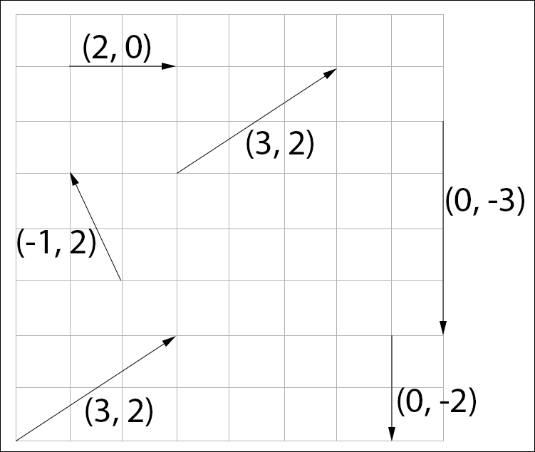
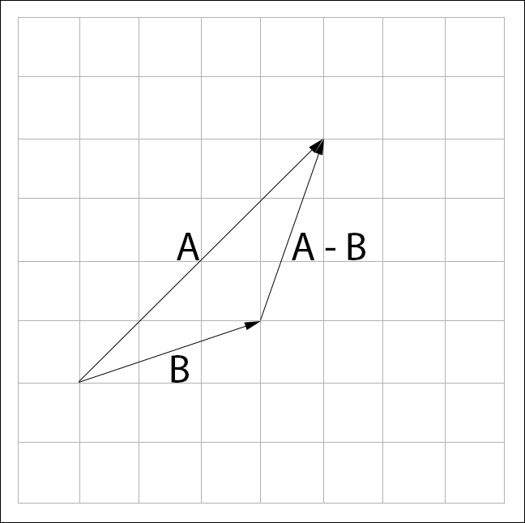
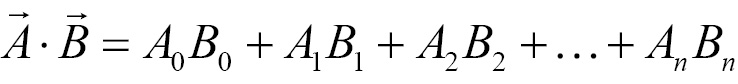

# Game Physics Cookbook

> My **notes** and **codes** from [Game Physics Cookbook](https://learning.oreilly.com/library/view/game-physics-cookbook/9781787123663/).

## Contents

 - **Vectors:**
   - [Vector definition](#vector-definition)
   - [Component-wise operations](#component-wise-operations)
   - [Dot Product](#dot-product)
   - [Magnitude](#magnitude)
   - [Find the distance between two points (Using Magnitude)](#distance-two-points)
 - **Implementations:**
   - **Vectors:**
     - [2D Vector](#2d-vector)
     - [3D Vector](#3d-vector)
     - [Implementations of Component-wise operations](#implementations-component-wise-operations)
     - [Dot Product implementation](#dot-product-implementation)
     - [Magnitude implementation](#magnitude-implementation)
     - [Distance between two points (Using Magnitude) implementation](#distance-two-points-implementation)


<!--- ( Vectors ) -->

---

<div id="vector-definition"></div>

## Vector definition

> A vector is an **n-tuple** of real **numbers**.
> - A tuple is a **finite ordered list** of **elements**.
> - In the context of games **n** is usually **2**, **3**, or **4**.

An **n-dimensional vector "V"** is represented as follows:

  

> **NOTE:**  
> Vectors are written as a capital bold letter with or without an **arrow** above it. Both are valid symbols for vector **"V"**. 

 - The subscript numbers **"V<sub>i</sub>"** are called the components of the vector.
 - Components are expressed as a **number** or as a **letter** *corresponding to the axis that component represents*.
 - Subscripts are indexed starting with 0.
 - Axis **x**, **y**, **z**, and **w** correspond to the numbers **0**, **1**, **2**, and **3**, respectively.

Visually, a vector is drawn as a displacement (deslocamento) arrow. For example, the two dimensional vector **V = (3, 2)** would be drawn as an arrow pointing to **3** units on the **X axis** and **2** units on the **Y axis**.

  

A vector consists of a **direction** and a **magnitude**:

 - **Direction:**
   - The *direction* is where the vector points.
 - **Magnitude:**
   - The *magnitude* is how far along that direction the vector is pointing.

**You can think of a vector as a series of instructions:**  
For example, `take three steps right` and `two steps up`.

Because a vector does not have a set position, where it is drawn does not matter as shown in the following diagram:

  

**NOTE:**  
The preceding figure shows several vectors, with vector **(3, 2)** appearing multiple times. The **origin** of a vector could be anywhere; the coordinate system of the preceding figure was omitted to emphasize this.

---

<div id="component-wise-operations"></div>

## Component-wise operations

To understanding the **Component-wise operations**, first you need to know that every vector describes a series of displacements (deslocamentos). For example, the vector **V = (2, 3)** means:

 - Move **two units** in the positive **X** direction;
 - And **three units** in the positive **Y** direction.

### Addition

We add vectors by following the series of displacements (deslocamentos) that each vector represents. 

For example, to visualize this:

 - Given Vectors **"A"** and **"B"**;
 - Draw them so (Desenhe-os assim):
   - The head of **"A"** touches the tail of **"B"**.
   - The result of the addition is a new vector spanning from the tail of **"A"** to the head of **"B"**:

See the image below to understand more easily:

  

The formula to represent the **Component-wise addition operation** is:

  

### Subtraction

Subtraction works the same way as addition. We have to follow the negative displacement (deslocamento) of vector **"B"** starting from vector **"A"**.

 - To visually subtract vectors **"A"** and **"B"**.
 - Draw **"A"** and **"B"** with their tails touching (com suas caldas se tocando).
 - The result of the subtraction is a vector spanning from the head of **"B"** to the head of **"A"**.

See the image below to understand more easily:

  

**NOTE:**  
A more intuitive way to visualize subtraction might be to think of it as adding negative **"B"** and **"A"**, like so; **A + (-B)**. If we represent the subtraction like this, visually we can follow the rules of addition:

  

In the above image, the vector **A - B** appears multiple times. This is to emphasize that the position of a vector does not matter. Both of the **A - B** vectors above represent the same displacement!

The formula to represent the **Component-wise subtraction operation** is:

  

### Multiplication

There are many approaches to multiplying Vectors. However, here we focus on **Component-wise operations**, that's we are focused on *multiplication by scale (component-wise)*.

For example, given two n-dimensional vectors **"U"** and **"V"**, multiplication is defined as follows:

  

In addition to multiplying two vectors, you can also multiply a vector by a scalar. In this context, a scalar is any real number. Given vector **"U"** and scalar **S**, scalar multiplication is defined as follows:

  

See the image below to understand more easily how the multiplication of a Vector by a scale works:

  

> **NOTE:**  
> See that in the two approaches, we multiply each component of the vector **"U"** by the respective component in the vector **"V"** (or scale).

---

<div id="dot-product"></div>

## Dot Product

> The **"Dot Product"** operation is the *sum (summation)* of the multiplication of the components.

Different of *component-wise operations multiplications*, where only each component is multiplied by the respective component (or scale) in the **Dot Product** approach we:

 - Multiply each component by the respective component.
 - Next, *sum (summation)* all multiplications.

The formula for the **Dot Product** is:

  
  

**NOTE:**  
The resulting scalar represents the directional relation of the vectors. That is, **A * B** represents how much **"A"** is pointing in the direction of **"B"**.

Using the dot product we can tell if two vectors are pointing in the same direction or not following these rules:

 - If the dot product is **positive**, the vectors are pointing in the **same direction**.
 - If the dot product is **negative**, the vectors point in **opposing directions**.
 - If the dot product is 00, the vectors are **perpendicular**.

> **Ok, but when use that?**

Imagine we have a **spaceship S**,  We know its forward vector, **"F"** and a vector that points to its right, **"R"**:

  

We also have an enemy **ship E**, and a vector that points from our **ship S** to the enemy **ship E**, vector **"T"**:

  

> **How can we tell if the the ship S needs to turn left or right to face the enemy ship E?**

 - We need to take the dot product of **"T"** and **"R"**:
   - If the result of the dot product is **positive**, the **ship needs to turn right**.
   - If the result of the dot product is **negative**, the **ship needs to turn to the left**.
   - If the result of the dot product is **0**, the **ship does not need to turn**.

---

<div id="magnitude"></div>

## Magnitude

> The **Magnitude (or length)** of a vector is written as the letter of the vector surrounded by two bars, **|| V ||**.

The **Magnitude (or length)** of a vector is:

> The square root of the dot product of the vector with itself:

  

See that:

 - **We are taking square root (pegando a raiz quadrada).**
 - **From Dot Product operation of a Vector "A" with itself (Da operação Dot Product de um vetor "A" consigo mesmo).**

**NOTE:**  
In addition to implementing the magnitude function, we're also going to implement a magnitude squared function. The formula is the same, but it avoids the expensive square root operation:

  

**NOTE:**  
In games we often compare the magnitude of a vector to known numbers; however, doing a comparison between a number and the magnitude **is expensive (é caro) because of the square root operation**.

---

<div id="distance-two-points"></div>

## Find the distance between two points (Using Magnitude)

> The **Magnitude (or length)** of a vector **can be used to find the distance between two points**.

Assuming we have points **"P1"** and **"P2"**, we can find a vector **"T"** that connects them by subtracting **"P2"** from **"P1"**. For example, see the image below to understand more easily:

  

**NOTE:**  
The distance between the two points is the **length (or Magnitude)** of **"T"**.

---

<div id=""></div>

## x

x


<!--- ( Implementations ) -->

---

<div id=""></div>

## 2D Vector

Imagine we have a 2D Vector representation in C++:

[vectors.h](src/vectors.h)
```cpp
#ifndef _H_MATH_VECTORS_
#define _H_MATH_VECTORS_

typedef struct vec2
{
    union
    {
        struct
        {
            float x;
            float y;
        };
        float asArray[2];
    };

    float &operator[](int i)
    {
        return asArray[i];
    }
} vec2;

#endif
```

 - **Inside the vector structure we declare an anonymous union. This anonymous union allows us to access the components of the vector by:**
   - **The name:**
     - e.g. "right.x".
   - **As an index into an array of floats:**
     - e.g. "right.asArray[0]".
 - **Additionally, we overloaded the indexing operator for the structure. This will allow us to index the vectors directly:** `float &operator[](int i) { return asArray[i]; }`
   - e.g. "right[1]".

For example, imagine we need to make a **V = (3, 2)** Vector:

[driver_2d_vector.cpp](src/driver_2d_vector.cpp)
```cpp
#include <iostream>
#include "vectors.h"

int main()
{
    vec2 V = {3.0f, 2.0f};

    std::cout << "Component 0 (x): " << V.x << "\n";
    std::cout << "Component 0 (x): " << V.asArray[0] << "\n";
    std::cout << "Component 0 (x): " << V[0] << "\n";

    std::cout << "\nComponent 1 (y): " << V.y << "\n";
    std::cout << "Component 1 (y): " << V.asArray[1] << "\n";
    std::cout << "Component 1 (y): " << V[1];

    return 0;
}
```

**COMPILATION AND RUN:**
```bash
g++ driver_2d_vector.cpp -o test.out && ./test.out
```

**OUTPUT:**  
```bash
Component 0 (x): 3
Component 0 (x): 3
Component 0 (x): 3

Component 1 (y): 2
Component 1 (y): 2
Component 1 (y): 2
```

See that:

 - **We have a *V = (3, 2)* Vector:**
   - vec2 V = {3.0f, 2.0f};
 - **And accessing each component from three different approaches:**
   - **Component name:**
     - V.x
     - V.y
   - **As the index of the array (float):**
     - V.asArray[0] // x component
     - V.asArray[1] // y component
   - **Index overloading "[]":**
     - V[0] // x component
     - V[1] // y component

---

<div id="3d-vector"></div>

## 3D Vector

> To implement a **3D Vector** we use the same approach in a [2D Vector](#2d-vector).

For example, see the structure to a 3D Vector below:

[vectors.h](src/vectors.h)
```cpp
#ifndef _H_MATH_VECTORS_
#define _H_MATH_VECTORS_

typedef struct vec3
{
    union
    {
        struct
        {
            float x;
            float y;
            float z;
        };
        float asArray[3];
    };

    // Index overloading.
    float &operator[](int i)
    {
        return asArray[i];
    }
} vec3;

#endif
```

For example, imagine we need to make a **V = (5, 3, 8)** Vector:

[driver_3d_vector.cpp](src/driver_3d_vector.cpp)
```cpp
#include <iostream>
#include "vectors.h"

int main()
{
    vec3 V = {5.0f, 3.0f, 8.0f};

    std::cout << "Component 0 (x): " << V.x << "\n";
    std::cout << "Component 0 (x): " << V.asArray[0] << "\n";
    std::cout << "Component 0 (x): " << V[0] << "\n";

    std::cout << "\nComponent 1 (y): " << V.y << "\n";
    std::cout << "Component 1 (y): " << V.asArray[1] << "\n";
    std::cout << "Component 1 (y): " << V[1] << "\n";

    std::cout << "\nComponent 2 (z): " << V.z << "\n";
    std::cout << "Component 2 (z): " << V.asArray[2] << "\n";
    std::cout << "Component 2 (z): " << V[2];

    return 0;
}
```

**COMPILATION AND RUN:**
```bash
g++ driver_3d_vector.cpp -o test.out && ./test.out
```

**OUTPUT:**  
```bash
Component 0 (x): 5
Component 0 (x): 5
Component 0 (x): 5

Component 1 (y): 3
Component 1 (y): 3
Component 1 (y): 3

Component 2 (z): 8
Component 2 (z): 8
Component 2 (z): 8
```

---

<div id="implementations-component-wise-operations"></div>

## Implementations of Component-wise operations

To implement **Component-wise operations** to our **2D** and **3D** Vectors first, let's add prototypes to apply ["Operator Overloading"](https://github.com/drigols/studies/tree/master/modules/cpp-codes/modules/oop/polymorphism#operator-overloading) for our functions:

[vectors.h](src/vectors.h)
```cpp
#ifndef _H_MATH_VECTORS_
#define _H_MATH_VECTORS_

typedef struct vec2
{
    union
    {
        struct
        {
            float x;
            float y;
        };
        float asArray[2];
    };

    // Index overloading.
    float &operator[](int i)
    {
        return asArray[i];
    }
} vec2;

typedef struct vec3
{
    union
    {
        struct
        {
            float x;
            float y;
            float z;
        };
        float asArray[3];
    };

    // Index overloading.
    float &operator[](int i)
    {
        return asArray[i];
    }
} vec3;

// Operator Overloading (prototype) for Add (+) operation.
vec2 operator+(const vec2 &l, const vec2 &r);
vec3 operator+(const vec3 &l, const vec3 &r);

// Operator Overloading (prototype) for Sub (-) operation.
vec2 operator-(const vec2 &l, const vec2 &r);
vec3 operator-(const vec3 &l, const vec3 &r);

// Operator Overloading (prototype) for Scalar Multiplication (*) operation.
vec2 operator*(const vec2 &l, float r);
vec3 operator*(const vec3 &l, float r);

// Operator Overloading (prototype) for Component-wise multiplication (*) operation.
vec2 operator*(const vec2 &l, const vec2 &r);
vec3 operator*(const vec3 &l, const vec3 &r);

// Operator Overloading (prototype) for check equal (==) operation.
bool operator==(const vec2 &l, const vec2 &r);
bool operator==(const vec3 &l, const vec3 &r);

// Operator Overloading (prototype) for check not equal (!=) operation.
bool operator!=(const vec2 &l, const vec2 &r);
bool operator!=(const vec3 &l, const vec3 &r);

#endif
```

Now, let's implement this **Component-wise operations**:

[vectors.cpp](src/vectors.cpp)
```cpp
#include "vectors.h"
#include <cmath>
#include <cfloat>

// Macro to comparing floating point numbers to vectors.cpp.
#define CMP(x, y) \
    (fabsf(x - y) <= FLT_EPSILON * fmaxf(1.0f, fmaxf(fabsf(x), fabsf(y))))

// Operator Overloading (implementation) for Add (+) operation.
vec2 operator+(const vec2 &l, const vec2 &r)
{
    return {l.x + r.x, l.y + r.y};
}

// Operator Overloading (implementation) for Add (+) operation.
vec3 operator+(const vec3 &l, const vec3 &r)
{
    return {l.x + r.x, l.y + r.y, l.z + r.z};
}

// Operator Overloading (implementation) for Sub (-) operation.
vec2 operator-(const vec2 &l, const vec2 &r)
{
    return {l.x - r.x, l.y - r.y};
}

// Operator Overloading (implementation) for Sub (-) operation.
vec3 operator-(const vec3 &l, const vec3 &r)
{
    return {l.x - r.x, l.y - r.y, l.z - r.z};
}

// Operator Overloading (implementation) for Scalar Multiplication (*) operation.
vec2 operator*(const vec2 &l, float r)
{
    return {l.x * r, l.y * r};
}

// Operator Overloading (implementation) for Scalar Multiplication (*) operation.
vec3 operator*(const vec3 &l, float r)
{
    return {l.x * r, l.y * r, l.z * r};
}

// Operator Overloading (implementation) for Component-wise multiplication (*) operation.
vec2 operator*(const vec2 &l, const vec2 &r)
{
    return {l.x * r.x, l.y * r.y};
}

// Operator Overloading (implementation) for Component-wise multiplication (*) operation.
vec3 operator*(const vec3 &l, const vec3 &r)
{
    return {l.x * r.x, l.y * r.y, l.z * r.z};
}

// Operator Overloading (implementation) for check equal (==) operation.
bool operator==(const vec2 &l, const vec2 &r)
{
    return CMP(l.x, r.x) && CMP(l.y, r.y);
}

// Operator Overloading (implementation) for check equal (==) operation.
bool operator==(const vec3 &l, const vec3 &r)
{
    return CMP(l.x, r.x) && CMP(l.y, r.y) && CMP(l.z, r.z);
}

// Operator Overloading (implementation) for check not equal (!=) operation.
bool operator!=(const vec2 &l, const vec2 &r)
{
    return !(l == r);
}

// Operator Overloading (implementation) for check not equal (!=) operation.
bool operator!=(const vec3 &l, const vec3 &r)
{
    return !(l == r);
}
```

Now, let's check in the practice:

[driver_component_wise_operations.cpp](src/driver_component_wise_operations.cpp)
```cpp
#include <iostream>
#include "vectors.h"

int main()
{
    std::cout << "================ ( 2D Vector examples ) ================\n";

    vec2 v1_2d = {5.0f, 4.0f};
    vec2 v2_2d = {10.0f, 8.0f};
    vec2 v3_2d; // "v3" to store operations results.

    std::cout << "v1_2d:\n"
              << "Component 0 (x): " << v1_2d.x << "\n"
              << "Component 1 (y): " << v1_2d.y << "\n\n";

    std::cout << "v2_2d:\n"
              << "Component 0 (x): " << v2_2d.x << "\n"
              << "Component 1 (y): " << v2_2d.y << "\n\n";

    v3_2d = v1_2d + v2_2d;
    std::cout << "v1_2d + v2_2d:\n"
              << "Component 0 (x): " << v3_2d.x << "\n"
              << "Component 1 (y): " << v3_2d.y << "\n\n";

    v3_2d = v1_2d - v2_2d;
    std::cout << "v1_2d - v2_2d:\n"
              << "Component 0 (x): " << v3_2d.x << "\n"
              << "Component 1 (y): " << v3_2d.y << "\n\n";

    v3_2d = v1_2d * 10;
    std::cout << "v1_2d * 10 (Multiplication as Scaling):\n"
              << "Component 0 (x): " << v3_2d.x << "\n"
              << "Component 1 (y): " << v3_2d.y << "\n\n";

    v3_2d = v1_2d * v2_2d;
    std::cout << "v1_2d * v2_2d (Dot Product):\n"
              << "Component 0 (x): " << v3_2d.x << "\n"
              << "Component 1 (y): " << v3_2d.y << "\n\n";

    bool v3_2d_equal = v1_2d == v2_2d;
    std::cout << "v1_2d == v2_2d (0=false, 1=true): " << v3_2d_equal << "\n";

    bool v3_2d_not_equal = v1_2d != v2_2d;
    std::cout << "v1_2d != v2_2d (0=false, 1=true): " << v3_2d_not_equal << "\n\n";

    std::cout << "================ ( 3D Vector examples ) ================\n";

    vec3 v1_3d = {5.0f, 4.0f, 6.0f};
    vec3 v2_3d = {10.0f, 8.0f, 3.0f};
    vec3 v3_3d; // "v3" to store operations results.

    std::cout << "v1_3d:\n"
              << "Component 0 (x): " << v1_3d.x << "\n"
              << "Component 1 (y): " << v1_3d.y << "\n"
              << "Component 2 (z): " << v1_3d.z << "\n\n";

    std::cout << "v2_3d:\n"
              << "Component 0 (x): " << v2_3d.x << "\n"
              << "Component 1 (y): " << v2_3d.y << "\n"
              << "Component 2 (z): " << v2_3d.z << "\n\n";

    v3_3d = v1_3d + v2_3d;
    std::cout << "v1_3d + v2_3d:\n"
              << "Component 0 (x): " << v3_3d.x << "\n"
              << "Component 1 (y): " << v3_3d.y << "\n"
              << "Component 3 (z): " << v3_3d.z << "\n\n";

    v3_3d = v1_3d - v2_3d;
    std::cout << "v1_3d - v2_3d:\n"
              << "Component 0 (x): " << v3_3d.x << "\n"
              << "Component 1 (y): " << v3_3d.y << "\n"
              << "Component 3 (z): " << v3_3d.z << "\n\n";

    v3_3d = v1_3d * 10;
    std::cout << "v1_3d * 10 (Multiplication as Scaling):\n"
              << "Component 0 (x): " << v3_3d.x << "\n"
              << "Component 1 (y): " << v3_3d.y << "\n"
              << "Component 2 (z): " << v3_3d.y << "\n\n";

    v3_3d = v1_3d * v2_3d;
    std::cout << "v1_3d * v2_3d (Dot Product):\n"
              << "Component 0 (x): " << v3_3d.x << "\n"
              << "Component 1 (y): " << v3_3d.y << "\n"
              << "Component 2 (z): " << v3_3d.z << "\n\n";

    bool v3_3d_equal = v1_3d == v2_3d;
    std::cout << "v1_3d == v2_3d (0=false, 1=true): " << v3_3d_equal << "\n";

    bool v3_3d_not_equal = v1_3d != v2_3d;
    std::cout << "v1_3d != v2_3d (0=false, 1=true): " << v3_3d_not_equal;

    return 0;
}
```

**COMPILATION AND RUN:**
```bash
g++ driver_component_wise_operations.cpp vectors.cpp -o test.out && ./test.out
```

**OUTPUT:**  
```bash
================ ( 2D Vector examples ) ================
v1_2d:
Component 0 (x): 5
Component 1 (y): 4

v2_2d:
Component 0 (x): 10
Component 1 (y): 8

v1_2d + v2_2d:
Component 0 (x): 15
Component 1 (y): 12

v1_2d - v2_2d:
Component 0 (x): -5
Component 1 (y): -4

v1_2d * 10 (Multiplication as Scaling):
Component 0 (x): 50
Component 1 (y): 40

v1_2d * v2_2d (Dot Product):
Component 0 (x): 50
Component 1 (y): 32

v1_2d == v2_2d (0=false, 1=true): 0
v1_2d != v2_2d (0=false, 1=true): 1

================ ( 3D Vector examples ) ================
v1_3d:
Component 0 (x): 5
Component 1 (y): 4
Component 2 (z): 6

v2_3d:
Component 0 (x): 10
Component 1 (y): 8
Component 2 (z): 3

v1_3d + v2_3d:
Component 0 (x): 15
Component 1 (y): 12
Component 3 (z): 9

v1_3d - v2_3d:
Component 0 (x): -5
Component 1 (y): -4
Component 3 (z): 3

v1_3d * 10 (Multiplication as Scaling):
Component 0 (x): 50
Component 1 (y): 40
Component 2 (z): 40

v1_3d * v2_3d (Dot Product):
Component 0 (x): 50
Component 1 (y): 32
Component 2 (z): 18

v1_3d == v2_3d (0=false, 1=true): 0
v1_3d != v2_3d (0=false, 1=true): 1
```

---

<div id="dot-product-implementation"></div>

## Dot Product implementation

To implement [Dot Product](#dot-product) concepts is very easy. For example, see the codes below:

[vectors.h](src/vectors.h)
```cpp
// Prototype for Dot Product function.
float Dot(const vec2& l, const vec2& r);
float Dot(const vec3& l, const vec3& r);
```

[vectors.cpp](src/vectors.cpp)
```cpp
// Dot Product implementation.
float Dot(const vec2 &l, const vec2 &r)
{
    return ((l.x * r.x) + (l.y * r.y));
}

// Dot Product implementation.
float Dot(const vec3 &l, const vec3 &r)
{
    return ((l.x * r.x) + (l.y * r.y) + (l.z * r.z));
}
```

[driver_dot_product.cpp](src/driver_dot_product.cpp)
```cpp
#include <iostream>
#include "vectors.h"

int main()
{
    std::cout << "================ ( 2D Vector example ) ================\n";

    vec2 v1_2d = {5.0f, 4.0f};
    vec2 v2_2d = {10.0f, 8.0f};
    float dot_product_2d;

    dot_product_2d = Dot(v1_2d, v1_2d);
    std::cout << "Dot Product: " << dot_product_2d << "\n";

    std::cout << "================ ( 3D Vector example ) ================\n";

    vec3 v1_3d = {5.0f, 4.0f, 6.0f};
    vec3 v2_3d = {10.0f, 8.0f, 3.0f};
    float dot_product_3d;

    dot_product_3d = Dot(v1_3d, v2_3d);
    std::cout << "Dot Product: " << dot_product_3d;

    return 0;
}
```

**COMPILATION AND RUN:**
```bash
g++ driver_dot_product.cpp vectors.cpp -o test.out && ./test.out
```

**OUTPUT:**  
```bash
================ ( 2D Vector example ) ================
Dot Product: 41
================ ( 3D Vector example ) ================
Dot Product: 100
```

---

<div id="magnitude-implementation"></div>

## Magnitude implementation

**NOTE:**  
Before starting to implement Magnitude functions, let's recap some things.

The **Magnitude (or length)** of a vector is:

> The square root of the dot product of the vector with itself:

  

See that:

 - **We are taking square root (pegando a raiz quadrada).**
 - **From Dot Product operation of a Vector "A" with itself (Da operação Dot Product de um vetor "A" consigo mesmo).**

**NOTE:**  
In addition to implementing the magnitude function, we're also going to implement a magnitude squared function. The formula is the same, but it avoids the expensive square root operation:

  

 - **[EN] -** The square root operation is a relatively expensive one that should be avoided whenever possible. For this reason, we are also going to implement a function to find the square magnitude of a vector.
 - **[PT] -** A operação de raiz quadrada é relativamente cara e deve ser evitada sempre que possível. Por esse motivo, também vamos implementar uma função para encontrar a magnitude quadrada de um vetor.

Now, let's do some implementations:

[vectors.h](src/vectors.h)
```cpp
// Prototype for Magnitude functions (with square root).
float Magnitude(const vec2 &v);
float Magnitude(const vec3 &v);

// Prototype for Magnitude functions (without square root).
float MagnitudeSq(const vec2 &v);
float MagnitudeSq(const vec3 &v);
```

[vectors.cpp](src/vectors.cpp)
```cpp

// Magnitude function implementation (with square root).
float Magnitude(const vec2 &v)
{
    return sqrtf(Dot(v, v));
}

// Magnitude function implementation (with square root).
float Magnitude(const vec3 &v)
{
    return sqrtf(Dot(v, v));
}

// Magnitude function implementation (without square root).
float MagnitudeSq(const vec2 &v)
{
    return Dot(v, v);
}

// Magnitude function implementation (without square root).
float MagnitudeSq(const vec3 &v)
{
    return Dot(v, v);
}
```

[driver_magnitude.cpp](src/driver_magnitude.cpp)
```cpp
#include <iostream>
#include "vectors.h"

int main()
{
    std::cout << "================ ( 2D Vector example ) ================\n";

    vec2 v_2d = {5.0f, 4.0f};
    float mag2d = Magnitude(v_2d);
    std::cout << "Magnitude: " << mag2d << "\n";

    std::cout << "================ ( 3D Vector example ) ================\n";

    vec3 v_3d = {5.0f, 4.0f, 6.0f};
    float mag3d = Magnitude(v_2d);
    std::cout << "Magnitude: " << mag3d;

    return 0;
}
```

**COMPILATION AND RUN:**
```bash
g++ driver_magnitude.cpp vectors.cpp -o test.out && ./test.out
```

**OUTPUT:**  
```bash
================ ( 2D Vector example ) ================
Magnitude: 6.40312
================ ( 3D Vector example ) ================
Magnitude: 6.40312
```

---

<div id="distance-two-points-implementation"></div>

## Distance between two points (Using Magnitude) implementation

To implement the distance between two points in C++ we know that first we need to subtract a vector **"P1"** from **"P2"** and **the Magnitude (or length) of this subtraction is the distance between two points**.

Let's, see how implement that in the practice:

[vectors.h](src/vectors.h)
```cpp
// Prototypes for Distance functions (without square root).
float Distance(const vec2 &p1, const vec2 &p2);
float Distance(const vec3 &p1, const vec3 &p2);
```

[vectors.cpp](src/vectors.cpp)
```cpp
// Distance function implementation (2D).
float Distance(const vec2 &p1, const vec2 &p2)
{
    vec2 t = p1 - p2;
    return Magnitude(t);
}

// Distance function implementation (3D).
float Distance(const vec3 &p1, const vec3 &p2)
{
    vec3 t = p1 - p2;
    return Magnitude(t);
}
```

**NOTE:**  
See tha, the distance between two points is **Magnitude (or length)** of **"t"**, and **"t"** is  **"p1 - p2"**.

[driver_distance.cpp](src/driver_distance.cpp)
```cpp
#include <iostream>
#include "vectors.h"

int main()
{
    std::cout << "================ ( 2D Vector example ) ================\n";

    vec2 V1_2D = {6.0f, 3.0f};
    vec2 V2_2D = {2.0f, 5.0f};

    float t_distance_2D = Distance(V1_2D, V2_2D);
    std::cout << "Distance: " << t_distance_2D << "\n";

    std::cout << "================ ( 3D Vector example ) ================\n";

    vec3 V1_3D = {15.0f, 3.0f, 7.0f};
    vec3 V2_3D = {3.0f, 10.0f, 5.0f};

    float t_distance_3D = Distance(V1_3D, V2_3D);
    std::cout << "Distance: " << t_distance_3D;

    return 0;
}
```

**COMPILATION AND RUN:**
```bash
g++ driver_distance.cpp vectors.cpp -o test.out && ./test.out
```

**OUTPUT:**  
```bash
================ ( 2D Vector example ) ================
Distance: 4.47214
================ ( 3D Vector example ) ================
Distance: 14.0357
```

---

<div id=""></div>

## x

x


---

Ro**drigo** **L**eite da **S**ilva - **drigols**
