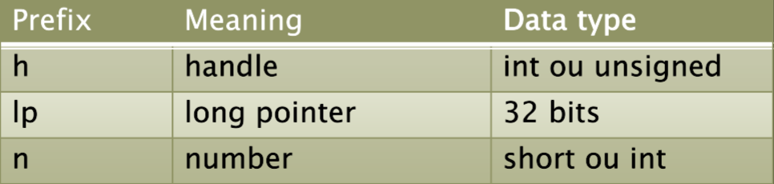

# Programação de Jogos (Judson Youtube Playlist)

> Minhas **notas (dicas e truques)** e **códigos** da playlist [Programação de Jogos](https://www.youtube.com/playlist?list=PLX6Nyaq0ebfjfo4PlkAcKRxR66qXZk899).

## Conteúdo

 - **Tips & Tricks:**
   - [Notação Húngara (Hungarian Notation)](#hn-w)
 - [Referências](#references)

<!--- ( Tips & Tricks ) -->

---

## Notação Húngara (Hungarian Notation)

> O Windows usa uma convenção de nomenclatura de variáveis conhecida como **Notação Húngara (Hungarian Notation)**.

Por exemplo:

  

<!--- ( Referências ) -->

---

## Referências

 - [Programação de Jogos | C++ | DirectX | Aula 01 - Programação Windows | Criar Janelas | API Win32](https://www.youtube.com/watch?v=NGoOrH-3tAc)

---

Ro**drigo** **L**eite da **S**ilva - **drigols**
