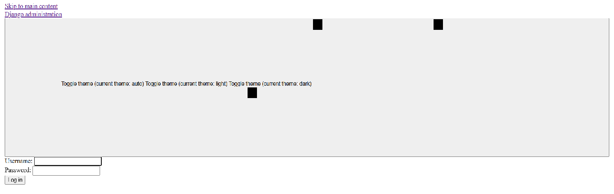
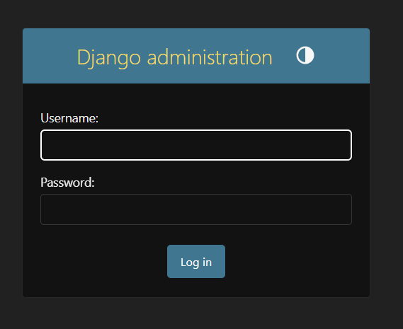

# `Criando o container Nginx (nginx)`

Para entender a necessidade do Nginx, vamos começar imaginando que nós criamos uma conta de **super usuário** no Django (pode ser na sua máquina local mesmo):

**Roda/Executa o comando "migrate" a partir do serviçor "web":**
```bash
docker compose exec web python manage.py migrate
```

**Roda/Executa o comando "createsuperuser" a partir do serviçor "web":**
```bash
docker compose exec web python manage.py createsuperuser
```

Agora é só abrir o **Django Admin** e verificar se temos a tabela `users`:

 - [http://127.0.0.1:8000/admin/](http://127.0.0.1:8000/admin/)

  

Vejam que:

 - Está tudo mal formado;
 - Sem estilização (CSS)...

> **Por que isso?**

 - **Executando/Rodando na máquina local**:
   - Quando você roda o Django na sua máquina local (fora do container), ele serve os arquivos estáticos automaticamente porque:
     - `DEBUG=True`
     - O servidor de desenvolvimento (runserver) serve /static/ diretamente.
 - **Executando/Rodando no container**:
   - Mas dentro do Docker, o **servidor Uvicorn não serve arquivos estáticos por padrão**.
   - Uvicorn é um ASGI server puro, *não um servidor web completo (como o runserver do Django)*.
   - **NOTE:** Por isso, o Django Admin aparece sem CSS.

#### `Como resolver isso? Usando Nginx`

Para ambientes de produção profissional, você deve:

 - Deixar o Uvicorn apenas para as requisições dinâmicas (ASGI);
 - Deixar o Nginx servir /static/ e /media/ diretamente.

 - **Função:**
   - Servir arquivos estáticos e atuar como *proxy reverso* para o Django.
 - **Quando usar:**
   - Sempre em produção para segurança e desempenho.
 - **Reverse proxy:**
   - Receber as requisições HTTP/HTTPS dos clientes.
   - Redirecionar (proxy_pass) para seu container Django (web).
   - Isso permite que seu backend fique “escondido” atrás do Nginx, ganhando segurança e performance.
 - **Servir arquivos estáticos e de mídia diretamente:**
   - Em Django, arquivos estáticos (/static/) e de upload (/media/) não devem ser servidos pelo Uvicorn (ineficiente).
   - O Nginx é muito melhor para isso, então ele entrega esses arquivos direto do volume.
 - **HTTPS (SSL/TLS):**
   - Configurar certificados (ex.: Let’s Encrypt) para rodar sua aplicação com HTTPS.
   - O Django não lida com certificados nativamente, então o Nginx faz esse papel.
 - **Balanceamento e cache (futuro):**
   - Se você crescer, pode colocar vários containers de Django e usar o Nginx como load balancer.
   - Também pode configurar cache de páginas ou de assets.
 - **Vantagens:**
   - Muito rápido para servir arquivos estáticos.
   - HTTPS e balanceamento de carga.
 - **Desvantagens:**
   - Exige configuração inicial extra.
 - **👉 Resumindo:**
   - O Nginx é a porta de entrada da sua aplicação, cuidando de performance, segurança e organização.

**NOTE:**  
Mas antes de criar e iniciar o nosso container com Nginx, vamos alterar uma configuração no nosso container `web`:

[docker-compose.yml](../../../docker-compose.yml)
```yaml
  web:

    ...

    expose:
      - "8000"

    ...
```

> **O que mudou?**

 - **Antes nós tinhamos:**
   - `ports: "${UVICORN_PORT}:${UVICORN_PORT}"`
   - ✅ Antes (ports) — Tornava a porta 8000 acessível externamente no host (ex.: http://localhost:8000).
 - **Agora nós temos:**
   - `expose: ["8000"]`
   - ✅ Agora (expose) — Deixa a porta 8000 visível apenas entre containers na rede Docker, invisível fora.

Com essa alteração feita, agora vamos criar/configurar o [docker-compose.yml](../../../docker-compose.yml) para o nosso container `nginx`:

[docker-compose.yml](../../../docker-compose.yml)
```yml
services:
  nginx:
    image: nginx:1.27
    container_name: nginx
    restart: always
    ports:
      - "80:80"
      - "443:443"
    volumes:
      - ./nginx/nginx.conf:/etc/nginx/conf.d/default.conf
      - ./static:/code/staticfiles
      - ./media:/code/media
    depends_on:
      - web
    networks:
      - backend

networks:
  backend:
```

 - `nginx:`
   - Nome do *serviço (container)* criado pelo docker-compose.
 - `image: nginx:1.27`
   - Pega a versão 1.27 oficial do Nginx no Docker Hub.
 - `container_name: nginx_reverse_proxy`
   - Nome fixo do container (para facilitar comandos como docker logs nginx_server).
 - `restart: always`
   - 🔹 O container vai voltar sempre que o Docker daemon subir, independente do motivo da parada.
   - 🔹 Mesmo se você der *docker stop*, quando o host reiniciar o container volta sozinho.
   - 👉 Bom para produção quando você quer *99% de disponibilidade*.
 - `ports:`
   - Mapeia portas do host para o container:
     - `80:80` → HTTP
     - `443:443` → HTTPS
 - `volumes:`
   - Pasta local `./nginx/conf` → onde ficam configs do Nginx.
   - Volumes `static` e `media` para servir arquivos.
 - `depends_on:`
   - Só inicia depois que o `Django (web)` estiver rodando.
 - `networks: backend`
   - Rede interna para conversar com Django sem expor a aplicação diretamente.

Agora nós precisamos criar o arquivo de configuração do `Nginx`:

[nginx.conf](../../../nginx/nginx.conf)
```bash
# ============================================================================
# CONFIGURAÇÃO DO SERVIDOR WEB NGINX
# ============================================================================
#
# Este arquivo configura o Nginx como proxy reverso para a aplicação
# Django, servindo arquivos estáticos e mídia diretamente e repassando
# requisições dinâmicas para o servidor de aplicação (Uvicorn/Gunicorn).
#
# Estrutura:
# - Configurações gerais do servidor
# - Servir arquivos estáticos (CSS, JS, imagens)
# - Servir arquivos de mídia (uploads dos usuários)
# - Proxy reverso para aplicação Django
#
# ============================================================================
# CONFIGURAÇÃO DO SERVIDOR VIRTUAL
# ============================================================================

server {
    # Porta na qual o servidor escuta requisições HTTP
    listen 80;
    
    # Nome do servidor (aceita qualquer nome de domínio)
    # Em produção, substitua por um domínio específico
    server_name _;

    # ========================================================================
    # CONFIGURAÇÕES GLOBAIS DO SERVIDOR
    # ========================================================================
    
    # Tamanho máximo do corpo da requisição (0 = ilimitado)
    # Permite uploads de qualquer tamanho - a validação é feita pelo Django
    # Em produção, considere definir um limite adequado (ex: 100M)
    client_max_body_size 0;

    # ========================================================================
    # SERVIÇO DE ARQUIVOS ESTÁTICOS
    # ========================================================================
    
    # Localização para servir arquivos estáticos (CSS, JS, imagens)
    # Estes arquivos são coletados pelo Django via 'collectstatic'
    location /static/ {
        # Caminho no sistema de arquivos onde os estáticos estão
        alias /code/staticfiles/;
        
        # Cache do navegador por 30 dias
        expires 30d;
        
        # Desabilita logs de acesso para melhorar performance
        access_log off;
        
        # Habilita listagem de diretórios (útil para debug)
        autoindex on;
    }

    # ========================================================================
    # SERVIÇO DE ARQUIVOS DE MÍDIA
    # ========================================================================
    
    # Localização para servir arquivos de mídia (uploads dos usuários)
    # Estes arquivos são enviados pelos usuários e armazenados pelo Django
    location /media/ {
        # Caminho no sistema de arquivos onde os arquivos de mídia estão
        alias /code/media/;
        
        # Cache do navegador por 30 dias
        expires 30d;
        
        # Desabilita logs de acesso para melhorar performance
        access_log off;
        
        # Habilita listagem de diretórios (útil para debug)
        autoindex on;
    }

    # ========================================================================
    # PROXY REVERSO PARA APLICAÇÃO DJANGO
    # ========================================================================
    
    # Todas as outras requisições são repassadas para o servidor Django
    # O Nginx atua como proxy reverso, melhorando performance e segurança
    location / {
        # URL do servidor de aplicação (Django via Uvicorn/Gunicorn)
        # 'web' é o nome do serviço no Docker Compose
        proxy_pass http://web:8000;
        
        # Headers necessários para o Django funcionar corretamente
        # Preserva o host original da requisição
        proxy_set_header Host $host;
        
        # IP real do cliente (importante para logs e segurança)
        proxy_set_header X-Real-IP $remote_addr;
        
        # Cadeia de IPs em caso de múltiplos proxies
        proxy_set_header X-Forwarded-For $proxy_add_x_forwarded_for;
        
        # Protocolo original (http ou https)
        # Necessário para o Django detectar requisições HTTPS
        proxy_set_header X-Forwarded-Proto $scheme;
    }
}
```

Por fim, vamos subir o container `nginx`:

```bash
docker compose up -d
```

 - **🧩 Fluxo de funcionamento**
   - `Uvicorn (web)` executa o Django e responde às rotas dinâmicas.
   - `Nginx` recebe todas as requisições HTTP externas:
     - `/static/` → servido diretamente da pasta staticfiles;
     - `/media/` → servido diretamente da pasta media;
     - outras rotas → redirecionadas para o container web (Uvicorn).
   - `PostgreSQL` e Redis são usados internamente via rede backend.

Agora tente abrir:

 - [http://localhost:8000/](http://localhost:8000/)
 - [http://localhost:8000/admin/](http://localhost:8000/admin/)

> **What? Não funcionou!**  
> 👉 Porque o Nginx está na porta 80 e o Uvicorn está atrás dele, **exposto (expose)** apenas internamente no Docker.

Agora para acessar nossa aplicação `web` primeiro nós devemos passar pelo container `nginx`:

 - [http://localhost/](http://localhost/)
 - [http://localhost/admin/](http://localhost/admin/)

> **Explicando brevemente:**  
> O container *nginx* atua como `reverse proxy`; ele recebe todas as requisições HTTP (nas portas 80/443) e as encaminha internamente para o container web (Uvicorn/Django).

Agora você pode abrir o seu Django Admin que estará tudo disponível pelo Nginx:

  

> **Mas como eu testo se meu nginx está funcionando corretamente?**

Primeiro, vamos ver se há mensagem de erro dentor do container `nginx`:

```bash
docker logs nginx
```

**OUTPUT:**
```bash
/docker-entrypoint.sh: /docker-entrypoint.d/ is not empty, will attempt to perform configuration
/docker-entrypoint.sh: Looking for shell scripts in /docker-entrypoint.d/
/docker-entrypoint.sh: Launching /docker-entrypoint.d/10-listen-on-ipv6-by-default.sh
10-listen-on-ipv6-by-default.sh: info: Getting the checksum of /etc/nginx/conf.d/default.conf
10-listen-on-ipv6-by-default.sh: info: /etc/nginx/conf.d/default.conf differs from the packaged version
/docker-entrypoint.sh: Sourcing /docker-entrypoint.d/15-local-resolvers.envsh
/docker-entrypoint.sh: Launching /docker-entrypoint.d/20-envsubst-on-templates.sh
/docker-entrypoint.sh: Launching /docker-entrypoint.d/30-tune-worker-processes.sh
/docker-entrypoint.sh: Configuration complete; ready for start up
2025/11/10 13:10:11 [notice] 1#1: using the "epoll" event method
2025/11/10 13:10:11 [notice] 1#1: nginx/1.27.5
2025/11/10 13:10:11 [notice] 1#1: built by gcc 12.2.0 (Debian 12.2.0-14)
2025/11/10 13:10:11 [notice] 1#1: OS: Linux 6.6.87.2-microsoft-standard-WSL2
2025/11/10 13:10:11 [notice] 1#1: getrlimit(RLIMIT_NOFILE): 1048576:1048576
2025/11/10 13:10:11 [notice] 1#1: start worker processes
2025/11/10 13:10:11 [notice] 1#1: start worker process 28
2025/11/10 13:10:11 [notice] 1#1: start worker process 29
2025/11/10 13:10:11 [notice] 1#1: start worker process 30
2025/11/10 13:10:11 [notice] 1#1: start worker process 31
2025/11/10 13:10:11 [notice] 1#1: start worker process 32
2025/11/10 13:10:11 [notice] 1#1: start worker process 33
2025/11/10 13:10:11 [notice] 1#1: start worker process 34
2025/11/10 13:10:11 [notice] 1#1: start worker process 35
172.18.0.1 - - [10/Nov/2025:13:10:28 +0000] "GET / HTTP/1.1" 200 12068 "-" "Mozilla/5.0 (Windows NT 10.0; Win64; x64) AppleWebKit/537.36 (KHTML, like Gecko) Chrome/142.0.0.0 Safari/537.36" "-"
172.18.0.1 - - [10/Nov/2025:13:10:28 +0000] "GET /favicon.ico HTTP/1.1" 404 2201 "http://localhost/" "Mozilla/5.0 (Windows NT 10.0; Win64; x64) AppleWebKit/537.36 (KHTML, like Gecko) Chrome/142.0.0.0 Safari/537.36" "-"
172.18.0.1 - - [10/Nov/2025:13:10:39 +0000] "GET /admin/ HTTP/1.1" 302 0 "-" "Mozilla/5.0 (Windows NT 10.0; Win64; x64) AppleWebKit/537.36 (KHTML, like Gecko) Chrome/142.0.0.0 Safari/537.36" "-"
172.18.0.1 - - [10/Nov/2025:13:10:39 +0000] "GET /admin/login/?next=/admin/ HTTP/1.1" 200 4173 "-" "Mozilla/5.0 (Windows NT 10.0; Win64; x64) AppleWebKit/537.36 (KHTML, like Gecko) Chrome/142.0.0.0 Safari/537.36" "-"
172.18.0.1 - - [10/Nov/2025:13:15:32 +0000] "GET / HTTP/1.1" 200 12068 "-" "Mozilla/5.0 (Windows NT 10.0; Win64; x64) AppleWebKit/537.36 (KHTML, like Gecko) Chrome/142.0.0.0 Safari/537.36" "-"
172.18.0.1 - - [10/Nov/2025:13:18:29 +0000] "GET / HTTP/1.1" 200 12068 "-" "Mozilla/5.0 (Windows NT 10.0; Win64; x64) AppleWebKit/537.36 (KHTML, like Gecko) Chrome/142.0.0.0 Safari/537.36" "-"
172.18.0.1 - - [10/Nov/2025:13:18:29 +0000] "GET /favicon.ico HTTP/1.1" 404 2201 "http://localhost/" "Mozilla/5.0 (Windows NT 10.0; Win64; x64) AppleWebKit/537.36 (KHTML, like Gecko) Chrome/142.0.0.0 Safari/537.36" "-"
172.18.0.1 - - [10/Nov/2025:13:18:30 +0000] "GET /admin/ HTTP/1.1" 302 0 "-" "Mozilla/5.0 (Windows NT 10.0; Win64; x64) AppleWebKit/537.36 (KHTML, like Gecko) Chrome/142.0.0.0 Safari/537.36" "-"
172.18.0.1 - - [10/Nov/2025:13:18:30 +0000] "GET /admin/login/?next=/admin/ HTTP/1.1" 200 4173 "-" "Mozilla/5.0 (Windows NT 10.0; Win64; x64) AppleWebKit/537.36 (KHTML, like Gecko) Chrome/142.0.0.0 Safari/537.36" "-"
```

Ótimo, agora vamos fazer alguns testes no navegador:

 - http://localhost/static/ → deve(ria) exibir arquivos estáticos.
 - http://localhost/media/ → deve(ria) exibir uploads.

**OUTPUT:**
```bash
403 Forbidden
nginx/1.27.5
```

> **What? Não funcionou!**

Agora vamos tentar acessar um arquivo específico:

 - http://localhost/static/admin/css/base.css
 - http://localhost/static/admin/img/inline-delete.svg

> **What? Agora funcionou!**

 - Esse comportamento indica que o *Nginx* está conseguindo servir arquivos existentes, mas não consegue listar diretórios.
 - **NOTE:** Por padrão, o Nginx não habilita autoindex (listagem de diretórios).

Então:

 - http://localhost/static/admin/css/base.css → Funciona porque você está acessando um arquivo específico.
 - http://localhost/static/ → Dá *403 Forbidden* porque você está acessando o diretório, e o Nginx não lista o conteúdo (diretório) por padrão.

> **Como resolver isso?**

#### Habilitar autoindex (não recomendado para produção, só para teste):

[nginx.conf](../../../nginx/conf/nginx.conf)
```bash
location /static/ {
    alias /code/staticfiles/;
    autoindex on;
}

location /media/ {
    alias /code/media/;
    autoindex on;
}
```

**Força recriar o container `nginx`**:
```
docker compose up -d --force-recreate nginx
```

> **NOTE:**  
> Isso permite ver os arquivos listados no navegador, mas não é seguro em produção, porque expõe todos os arquivos publicamente.

Agora, abra diretamente algum arquivo, como:

 - [http://localhost/static/admin/css/base.css](http://localhost/static/admin/css/base.css)
 - [http://localhost/media/example.txt](http://localhost/media/example.txt)
   - Crie esse arquivo em `/media (host)` antes de tentar acessar (testar).

Se esses arquivos carregarem, significa que tudo está correto para servir conteúdo estático e uploads, mesmo que a listagem do diretório não funcione.

> **💡 Resumo:**  
> O erro `403` ao acessar `/static/` ou `/media/` é normal no Nginx quando você não habilita `autoindex`. Para produção, você normalmente não quer listar diretórios, apenas servir arquivos diretamente.

Outra maneira de testar se o Nginx está funcionando corretamente seria usar o `curl`:

```bash
curl http://localhost/static/admin/css/base.css -I
```

**OUTPUT:**
```bash
HTTP/1.1 200 OK
Server: nginx/1.27.5
Date: Tue, 19 Aug 2025 02:29:18 GMT
Content-Type: text/css
Content-Length: 22120
Last-Modified: Tue, 19 Aug 2025 01:58:34 GMT
Connection: keep-alive
ETag: "68a3da4a-5668"
Accept-Ranges: bytes
```

```bash
curl http://localhost/media/example.txt -I
```

**OUTPUT:**
```bash
HTTP/1.1 200 OK
Server: nginx/1.27.5
Date: Tue, 19 Aug 2025 02:30:17 GMT
Content-Type: text/plain
Content-Length: 15
Last-Modified: Tue, 19 Aug 2025 02:26:29 GMT
Connection: keep-alive
ETag: "68a3e0d5-f"
Accept-Ranges: bytes
```

```bash
curl http://localhost/static/admin/img/inline-delete.svg -I
```

**OUTPUT:**
```bash
HTTP/1.1 200 OK
Server: nginx/1.27.5
Date: Tue, 19 Aug 2025 02:33:07 GMT
Content-Type: image/svg+xml
Content-Length: 537
Last-Modified: Tue, 19 Aug 2025 01:58:34 GMT
Connection: keep-alive
ETag: "68a3da4a-219"
Accept-Ranges: bytes
```

 - Vejam que quem está servindo os dados é o servidor Nginx e não o Django (container web).
 - Além, disso nós também estamos vendo algumas informações interessantes sobre os arquivos:
   - tipo: `text/css`, `text/plain`, `image/svg+xml`, etc.

---

**Rodrigo** **L**eite da **S**ilva - **rodirgols89**
