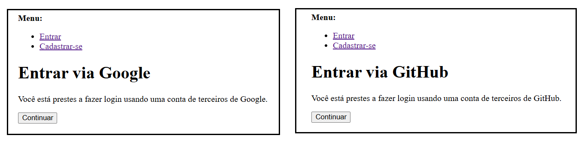

# `Linkando os botões de login social`

 - Até aqui, nós configuramos o `django-allauth` para registrar os provedores (Google e GitHub) no painel administrativo.
 - Agora, nós vamos fazer com que os botões **“Entrar com Google”** e **“Entrar com GitHub”** funcionem de verdade, conectando o *front-end* com o *allauth*.

[templates/pages/index.html](../../../templates/pages/index.html)
```html



<!-- Botão de Login com Google -->
<div>
    <a href=""
        class="w-full inline-flex justify-center 
              items-center py-2 px-4 border 
              border-gray-300 rounded-md 
              shadow-sm bg-white hover:bg-gray-50">
        <!-- Ícone do Google -->
        
        <span class="text-sm font-medium 
                      text-gray-700">
            Google
        </span>
    </a>
</div>


<!-- Botão de Login com GitHub -->
<div>
    <a href=""
        class="w-full inline-flex justify-center 
              items-center py-2 px-4 border 
              border-gray-300 rounded-md 
              shadow-sm bg-white hover:bg-gray-50">
        <!-- Ícone do GitHub -->
        
        <span class="text-sm font-medium 
                      text-gray-700">
            GitHub
        </span>
    </a>
</div>
```

**Explicação das principais partes do código:**

**🧩 Herança do template e carregamento de tags**
```html

```

 - ``
   - Importa os templates tags fornecidas pelo `django-allauth (ex.: )`.
   - Sem esse `load`, as tags sociais nao seriam reconhecidas pelo template engine.

**🧩 Botões de login social (links gerados pelo allauth)**
```html
<a href="">
    ...
</a>

<a href="">
    ...
</a>
```

 - **O que faz?**
   - `` e ``
     - Geram as URLs corretas para iniciar o fluxo `OAuth` com *Google* e *GitHub* (fornecidas pelo django-allauth).
     - Os `<a>` envolvem botões visuais que, ao clicar, redirecionam o usuário para o provedor externo.
 - **Por que é importante?**
   - Conecta o front-end ao sistema de login social do allauth.
   - O allauth cuida de gerar a URL correta, adicionar parâmetros e tratar callbacks.

Agora quando você clicar para logar com o **Google** ou **GitHub** você será redirecionado para o provedor externo, onde ele irá perguntar ao usuário se ele quer permitir o acesso ao seu perfil ou não:

  

**NOTE:**  
Porém, nesse exemplo acima nós não somos redirecionados diretamente para os provedores externos do google e github respectivamente. Primeiro, nós passamos por páginas internas do allauth e depois redirecionamos para eles.

> **Tem como ir diretor para os provedores externos do Google e GitHub sem passar por essas páginas do allauth?**

**SIM!**  
Para isso nós precisamos configurar [settings.py](../../../core/settings.py) para que o allauth redirecione diretamente para os provedores externos:

[core/settings.py](../../../core/settings.py)
```python
SOCIALACCOUNT_LOGIN_ON_GET = True
```

 - `SOCIALACCOUNT_LOGIN_ON_GET = True`
   - Quando `True`, o allauth redireciona diretamente para o provedor externo ao clicar nos botões de login.
   - **NOTE:** Por padrão, ele vem como `False`.

---

**Rodrigo** **L**eite da **S**ilva - **rodirgols89**
