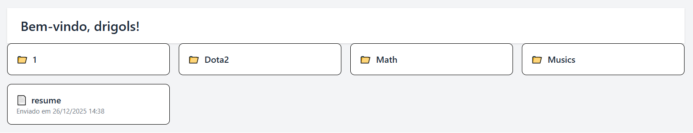
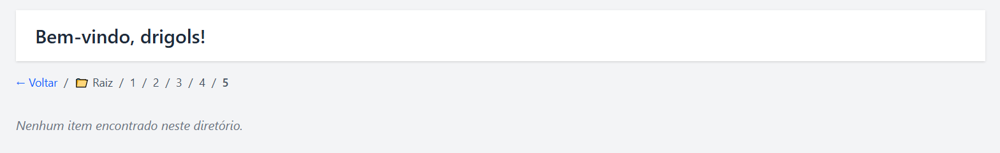

# `Atualizando a view (ação) para exibir as pastas e arquivos`

> **NOTE:**  
> Antes de implementar essa funcionalidade (feature) é importante que você crie algumas pastas e faça upload de alguns arquivos nessas pastas a partir do *Django Admin*.

Continuando, lembram que nós tinhamos uma view (ação) só para exibir a página `workspace_home.html`?

[workspace/views.py](../../../workspace/views.py)
```python
from django.contrib.auth.decorators import login_required
from django.shortcuts import render


@login_required(login_url="/")
def workspace_home(request):
    return render(request, "pages/workspace_home.html")
```

Então, agora nós vamos atualizar essa view (ação) para:

 - Listar as pastas e arquivos do usuário logado;
 - Mostrar somente o conteúdo que pertence a ele (usando request.user);
 - Servir como a página principal do Workspace, onde futuramente adicionaremos botões para *“criar pasta”* e *“fazer upload”*.

Vamos começar atualizando a view (ação) `workspace_home()`:

[workspace/views.py](../../../workspace/views.py)
```python
from django.contrib.auth.decorators import login_required
from django.shortcuts import get_object_or_404, render

from .models import File, Folder


@login_required(login_url="/")
def workspace_home(request):

    folder_id = request.GET.get("folder")

    if folder_id:
        current_folder = get_object_or_404(
            Folder,
            id=folder_id,
            owner=request.user
        )

        folders = Folder.objects.filter(
            parent=current_folder,
            owner=request.user,
            is_deleted=False
        ).order_by("name")

        files = File.objects.filter(
            folder=current_folder,
            uploader=request.user,
            is_deleted=False
        ).order_by("name")

        breadcrumbs = []
        temp = current_folder
        while temp:
            breadcrumbs.append(temp)
            temp = temp.parent
        breadcrumbs.reverse()

    else:
        current_folder = None

        folders = Folder.objects.filter(
            owner=request.user,
            parent__isnull=True,
            is_deleted=False
        ).order_by("name")

        files = File.objects.filter(
            uploader=request.user,
            folder__isnull=True,
            is_deleted=False
        ).order_by("name")

        breadcrumbs = []

    context = {
        "current_folder": current_folder,
        "folders": folders,
        "files": files,
        "breadcrumbs": breadcrumbs,
    }

    return render(request, "pages/workspace_home.html", context)
```

Agora, vamos explicar algumas partes do código acima (só o necessário, sem repetir o que já foi explicado em outras partes do README):

```python
folder_id = request.GET.get("folder")
```

 - **O que essa linha faz?**
   - Ela lê um parâmetro da URL (query string) chamado folder.
   - Exemplos de URL:
     - `/workspace` → folder_id = None
     - `/workspace?folder=5` → folder_id = "5"
 - **📌 Ou seja:**
   - Serve para saber em qual pasta o usuário está navegando;
   - Controla a navegação hierárquica do workspace
 - **⚠️ Importante:**
   - O valor vem como string;
   - Não faz validação aqui (isso será feito depois).

```python
if folder_id:
    ..
else:
    ..
```

 - **Quando entra no if?**
   - O usuário clicou em uma pasta;
   - A URL contém `?folder=<id>`;
   - Exemplo: `/workspace?folder=12`
 - **Quando entra no else?**
   - folder_id é None;
   - Ou seja: não há pasta selecionada;
   - O usuário está na raiz.

```python
current_folder = get_object_or_404(
    Folder,
    id=folder_id,
    owner=request.user
)
```

 - **O que esse bloco faz?**
   - Busca uma pasta específica.
   - Garante que:
     - ela existe;
     - pertence ao usuário logado.
   - Se não existir → retorna 404 automaticamente
 - `get_object_or_404()`
   - Função do Django que:
     - Executa uma query;
     - Se encontrar → retorna o objeto;
     - Se não encontrar → lança um Http404.
   - *Argumentos que ela recebe:*
     - `Folder` → o modelo;
     - `id=folder_id` → garante que é a pasta correta;
     - `owner=request.user` → garante que pertence ao usuário logado, segurança (um usuário não acessa pasta de outro).

```python
folders = Folder.objects.filter(
    parent=current_folder,
    owner=request.user,
    is_deleted=False
).order_by("name")
```

 - **O que esse bloco faz?**
   - Busca as subpastas da pasta atual.
 - `Folder.objects.filter(...)`
   - Query no modelo *"Folder"*.
   - **Argumentos explicados:**
     - `parent=current_folder`
       - só pastas filhas da pasta atual.
     - `owner=request.user`
       - Só pastas do usuário logado.
     - `is_deleted=False`
       - Ignora pastas excluídas logicamente (soft delete).

```python
files = File.objects.filter(
    folder=current_folder,
    uploader=request.user,
    is_deleted=False
).order_by("name")
```

 - **O que esse bloco faz?**
   - Busca os arquivos dentro da pasta atual.
 - `File.objects.filter(...)`
   - Query no modelo *"File"*.
   - **Argumentos explicados:**
     - `folder=current_folder`
       - Arquivos que pertencem à pasta atual.
     - `uploader=request.user`
       - Arquivos do usuário logado.
     - `is_deleted=False`
       - Ignora arquivos excluídos (soft delete).
     - `.order_by("name")`
       - Ordena alfabeticamente.

```python
breadcrumbs = []
temp = current_folder
while temp:
    breadcrumbs.append(temp)
    temp = temp.parent
breadcrumbs.reverse()
```

 - **O que esse bloco faz?**
   - Constrói o caminho hierárquico da pasta atual até a raiz (breadcrumb).
   - 📁 Exemplo: *Raiz / Pasta 1 / Pasta 2 / Pasta 3*
 - `breadcrumbs = []`
   - Lista vazia que vai armazenar as pastas.
 - `temp = current_folder`
   - Variável temporária para navegar na hierarquia.
 - `while temp:`
   - Enquanto existir uma pasta (até chegar na raiz).
   - `breadcrumbs.append(temp)`
     - Adiciona a pasta atual à lista.
   - `temp = temp.parent`
     - Sobe um nível na hierarquia.
 - `breadcrumbs.reverse()`
   - Inverte a lista para ficar da raiz → pasta atual.

**No else:**
```python
current_folder = None
```

 - **O que ela significa?**
   - Indica explicitamente:
     - O usuário está na raiz;
     - Não há pasta selecionada.

```python
folders = Folder.objects.filter(
    owner=request.user,
    parent__isnull=True,
    is_deleted=False
).order_by("name")
```

 - **O que esse bloco faz?**
   - Busca todas as pastas da raiz do usuário.
 - `Folder.objects.filter(...)`
   - Query no modelo *"Folder"*.

```python
files = File.objects.filter(
    uploader=request.user,
    folder__isnull=True,
    is_deleted=False
).order_by("name")
```

 - **O que esse bloco faz?**
   - Busca arquivos que estão soltos na raiz, sem pasta.
 - `File.objects.filter(...)`
   - Query no modelo *"File"*.

```python
breadcrumbs = []
```

 - **O que essa linha faz?**
   - Indica que:
     - Não há caminho hierárquico;
     - O usuário está na raiz.

```python
context = {
    "current_folder": current_folder,
    "folders": folders,
    "files": files,
    "breadcrumbs": breadcrumbs,
}
```

 - **O que esse bloco faz?**
   - Cria o contexto que será enviado ao template.

```python
return render(request, "pages/workspace_home.html", context)
```

 - **O que essa linha (retorno) faz?**
   - Renderiza o template HTML;
   - Injeta o context;
   - Retorna um HttpResponse;
   - 📌 Esse é o retorno final da view.

### Continuando...

Continuando, vamos começar atualizando nosso template [workspace_home.html](../../../workspace/templates/pages/workspace_home.html) para exibir qual usuário está logado:

[workspace/templates/pages/workspace_home.html](../../../workspace/templates/pages/workspace_home.html)
```html


Workspace


    <div class="flex h-screen bg-gray-100">

        <!-- 🧱 Sidebar -->
        

        <!-- 💼 Área principal do Workspace -->
        <main class="flex-1 p-8 overflow-y-auto">

            <!-- Header -->
            <header class="bg-white shadow px-6 py-4">
                <h1 class="text-2xl font-semibold text-gray-800">
                    Bem-vindo, {{ request.user.username }}!
                </h1>
            </header>

        </main>
    </div>

```

Agora, vamos fazer nosso template lista as pastas e arquivos que o usuário logado tem (lembrando que nós criamos essas pastas e arquivos a partir do Django Admin):

[workspace/templates/pages/workspace_home.html](../../../workspace/templates/pages/workspace_home.html)
```html
<!-- 📁 Listagem mista de pastas e arquivos -->

    <ul class="grid grid-cols-2 md:grid-cols-3 lg:grid-cols-4
        gap-4">

        <!-- Pastas -->
        
            <li class="bg-white border rounded-lg p-4
                hover:shadow-md transition cursor-pointer">
                <a href="?folder={{ folder.id }}" class="block">
                    <span class="text-gray-800 font-semibold
                        flex items-center space-x-2">
                        <span>📁</span>
                        <span>{{ folder.name }}</span>
                    </span>
                </a>
            </li>
        

        <!-- Arquivos -->
        
            <li class="bg-white border rounded-lg p-4
                hover:shadow-md transition">
                <a href="{{ file.file.url }}" target="_blank"
                    class="block">
                    <span class="text-gray-800 font-semibold
                        flex items-center space-x-2">
                        <span>📄</span>
                        <span>{{ file.name }}</span>
                    </span>
                    <p class="text-xs text-gray-500">
                        Enviado em
                        {{ file.uploaded_at|date:"d/m/Y H:i" }}
                    </p>
                </a>
            </li>
        
    </ul>

    <p class="pt-4 text-gray-500 italic">
        Nenhum item encontrado neste diretório.
    </p>

```

  

> **Mas como nosso template conseguiu exibir as pastas e arquivos do usuário logado?**

**NOTE:**  
Isso tudo foi montado e nós passamos como contexto (context) no retorno da view (ação) `workspace_home()`:

```python
return render(request, "pages/workspace_home.html", context)
```

Continuando, agora vamos criar um tipo de navegação (breadcrumbs) para exibir o caminho hierárquico do usuário logado para que ele consiga voltar para a página anterior:

[workspace/templates/pages/workspace_home.html](../../../workspace/templates/pages/workspace_home.html)
```html
<!-- 🧭 Breadcrumbs -->
<nav class="text-sm text-gray-600 my-4 flex items-center
    space-x-2">

    

        
            
                <a href="?folder={{ prev_folder.id }}"
                    class="text-blue-600 hover:underline
                        breadcrumb-drop"
                    data-folder-id="{{ prev_folder.id }}">
                    ← Voltar</a>
            
        
            <a href=""
                class="text-blue-600 hover:underline
                    breadcrumb-drop"
                data-folder-id="">← Voltar à raiz</a>
        

        <span>/</span>

        <a href=""
            class="hover:underline breadcrumb-drop"
            data-folder-id="">📁 Raiz</a>

        <span>/</span>

        
            
                <a href="?folder={{ folder.id }}"
                    class="hover:underline breadcrumb-drop"
                    data-folder-id="{{ folder.id }}">
                    {{ folder.name }}</a>
                <span>/</span>
            
                <span class="font-semibold breadcrumb-drop"
                      data-folder-id="{{ folder.id }}">
                    {{ folder.name }}
                </span>
            
        

    
        <span class="text-gray-400 italic breadcrumb-drop"
              data-folder-id="">
            📁 Raiz
        </span>
    

</nav>
```



---

**Rodrigo** **L**eite da **S**ilva - **rodirgols89**
