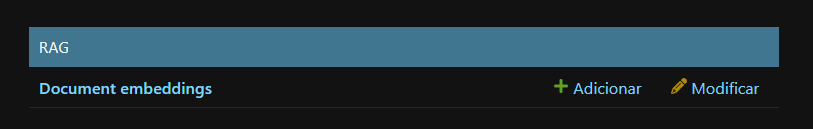
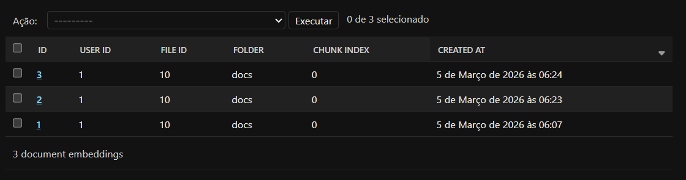
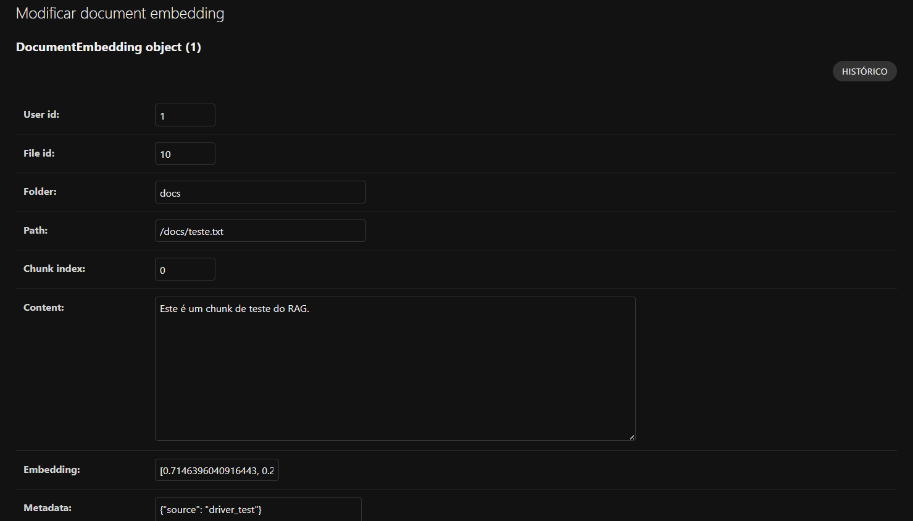
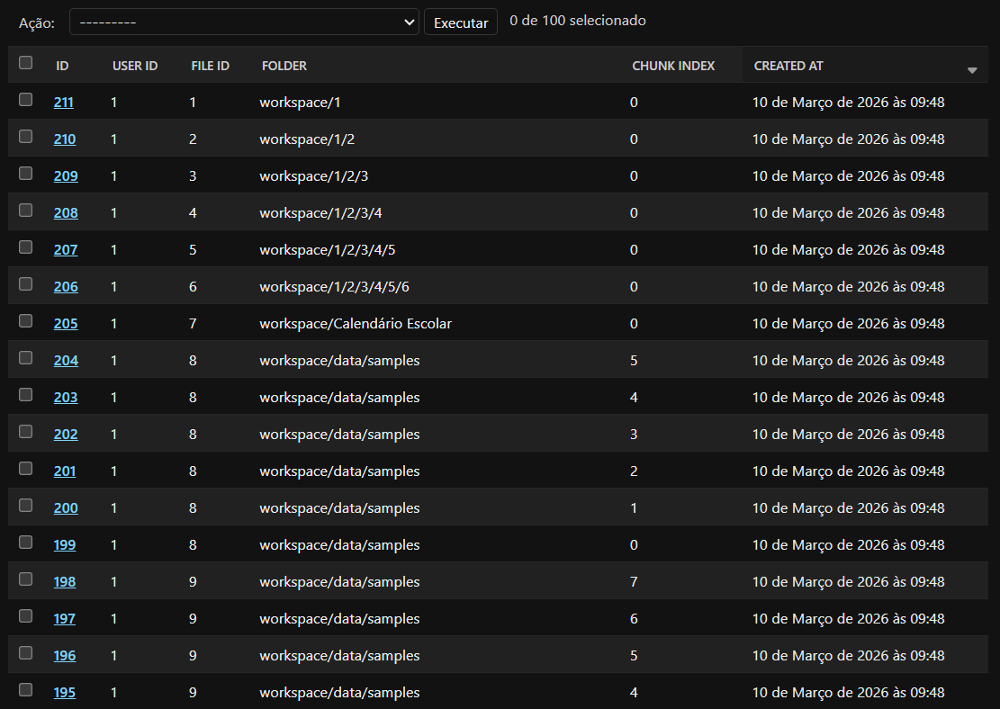

# `Armazenando Embeddings em Vector Database (com PostgreSQL + pgvector)`

## Conteúdo

 - [`O que vamos fazer aqui?`](#oqvfa)
 - [`Instalando as bibliotecas necessárias`](#installing-dependencies)
 - [`Atualizando o PostgreSQL (db) para suportar pgvector`](#add-pgvector)
 - [`Criando (modelando a tabela) a classe DocumentEmbedding()`](#create-document-embedding)
 - [`💾 Salvando (Persistência) os Embeddings no Banco de Dados: store_embeddings()`](#create-document-embedding)
<!---
[WHITESPACE RULES]
- 50
--->


---

<div id="oqvfa">

## `O que vamos fazer aqui?`

> 🧠 **Embeddings sem banco vetorial são inúteis.**

Gerar embeddings é só metade do trabalho.

👉 Se você **não armazenar corretamente**:

 - não consegue buscar
 - não consegue filtrar
 - não consegue respeitar isolamento por usuário
 - não consegue escalar

Neste passo, vamos **persistir os vetores no PostgreSQL** usando **pgvector**, com **metadados suficientes** para responder:

 - 📁 Em qual pasta está esse conteúdo?
 - 📄 De qual arquivo ele veio?
 - 🧭 Qual o caminho original?
 - 🔐 A qual usuário pertence?
 - 🆔 Qual é o ID no banco?

### `👁️ Exemplo visual (modelo mental)`

Imagine este chunk:

```bash
User: Rodrigo
Pasta: contratos/
Arquivo: nda.pdf
Caminho: contratos/nda.pdf
Texto: "Este contrato estabelece cláusula de confidencialidade..."
```

Depois do armazenamento:

```bash
┌────────┬─────────┬────────────┬────────────┬──────────────┐
│ id     │ user_id │ file_id    │ embedding  │ metadata     │
├────────┼─────────┼────────────┼────────────┼──────────────┤
│ 42     │ 7       │ 18         │ [0.12...]  │ {…}          │
└────────┴─────────┴────────────┴────────────┴──────────────┘
```

Quando o usuário pergunta algo, o sistema:

 1. transforma a pergunta em vetor
 2. busca vetores **do mesmo user_id**
 3. retorna apenas chunks relevantes **do workspace correto**


---

<div id="installing-dependencies">

## `Instalando as bibliotecas necessárias`

Antes de começar as implementações, vamos *instalar* e *exportar* as bibliotecas necessárias:

```bash
poetry add pgvector@latest
```

> **⚠️ NOTE:**  
> O `pgvector` adiciona suporte a vetores no PostgreSQL.

Por fim, vamos exportar essas dependências para o `requirements.txt`:

```bash
poetry export \
--without-hashes \
--format=requirements.txt \
--output=requirements.txt
```


---

<div id="add-pgvector"></div>

## `Atualizando o PostgreSQL (db) para suportar pgvector`

Até, então nós estavamos utilizando o PostgreSQL normal, mas para trabalhar com vetores, precisamos atualizar o banco para suportar a extensão `pgvector`:

[docker-compose.yml](../../../docker-compose.yml)
```yml
services:
  db:
    image: pgvector/pgvector:pg15

    ...
```

> **Ele (pgvector:pg15) ainda é PostgreSQL?**  
> SIM!

A imagem:

```yml
image: pgvector/pgvector:pg15
```

é baseada diretamente na imagem oficial:

```yml
image: postgres:15
```

Ou seja:

 - ✔️ Mesmo engine
 - ✔️ Mesmo planner
 - ✔️ Mesmo WAL
 - ✔️ Mesmo MVCC
 - ✔️ Mesmo suporte a ACID
 - ✔️ Mesma performance base
 - ✔️ Mesmas extensões nativas (uuid-ossp, pg_trgm, etc)

Ou seja:

 - Nós não estamos trocando de banco.
 - Nós continuamos usando:
   - 👉 PostgreSQL + uma extensão nativa compilada em C (pgvector)

Agora, vamos refletir isso no nosso container `db`:

```bash
docker compose down -v
```

```bash
docker compose up -d
```

Ótimo, agora vamos entrar no nosso container e ativar a extensão:

```sql
CREATE EXTENSION IF NOT EXISTS vector;
```

**OUTPUT:**

```sql
CREATE EXTENSION
```

```sql
SELECT * FROM pg_extension WHERE extname = 'vector';
```

**OUTPUT:**

```sql
oid  | extname | extowner | extnamespace | extrelocatable | extversion | extconfig | extcondition
-------+---------+----------+--------------+----------------+------------+-----------+--------------
 16704 | vector  |       10 |         2200 | t              | 0.8.1      |           |
(1 row)
```


---

<div id="create-document-embedding"></div>

## `Criando (modelando a tabela) a classe DocumentEmbedding()`

> Aqui nós vamos criar uma classe que vai representar a **tabela principal** do nosso RAG dentro do banco de dados.

Lembra que no nosso projeto estamos usando:

 - 🐘 PostgreSQL ➕ pgvector
 - 🧠 Embeddings
 - 👤 Workspace separado por usuário (controle por `user_id`)

> **Qual a finalidade dessa classe (modelo)?**

 - Pegar um pedaço de texto (chunk) de um documento
 - Transformar ele (o pedaço de texto/chunk) em vetor (embedding)
 - E salve isso no banco separado por usuário

Ou seja…

Cada linha dessa tabela representa:

 - 📄 *Um pedacinho de um documento*
 - 👤 Que pertence a um usuário específico
 - 🧠 Já transformado em embedding
 - 📁 Com informações de onde ele veio

Isso é a base para que depois o nosso pipeline de **Query Time** consiga fazer busca semântica filtrando corretamente por:

```sql
WHERE user_id = X
```

> **⚠️ NOTE:**  
> E assim nunca misturar dados entre usuários, como nós definimos nas regra de segurança do RAG.

### `Código Completo`

A modelagem da classe `DocumentEmbedding()` (completa) vai ficar da seguinte maneira:

[rag/models.py](../../../rag/models.py)
```python
from django.db import models
from pgvector.django import VectorField


class DocumentEmbedding(models.Model):

    user_id: models.PositiveIntegerField = (
        models.PositiveIntegerField(
            db_index=True,
        )
    )

    file_id: models.PositiveIntegerField = (
        models.PositiveIntegerField(
            db_index=True,
        )
    )

    folder: models.CharField = (
        models.CharField(
            max_length=255,
            db_index=True,
        )
    )

    path: models.CharField = (
        models.CharField(
            max_length=500,
            db_index=True,
        )
    )

    chunk_index: models.PositiveIntegerField = (
        models.PositiveIntegerField()
    )

    content: models.TextField = (
        models.TextField()
    )

    embedding: VectorField = (
        VectorField(
            dimensions=3072,
        )
    )

    metadata: models.JSONField = (
        models.JSONField(
            default=dict,
        )
    )

    created_at: models.DateTimeField = (
        models.DateTimeField(
            auto_now_add=True,
        )
    )

    class Meta:
        indexes = [
            models.Index(fields=["user_id"]),
            models.Index(fields=["file_id"]),
            models.Index(fields=["folder"]),
        ]
```

### `Aplicando migrations`

Agora, nós precisamos aplicar as migrations para essa alteração refletir no nosso banco de dados:

```bash
python manage.py makemigrations rag
```

Depois:

```bash
python manage.py migrate
```

Agora, se você olhar dentro do container `db` você conseguirá ver essa tabela:

```sql
\dt
```

**OUTPUT:**
```bash
                    List of relations
 Schema |             Name              | Type  |  Owner
--------+-------------------------------+-------+---------

    ...

 public | rag_documentembedding         | table | raguser

    ...
```

### `Adicionando o modelo (DocumentEmbedding) ao Admin`

 - Models não aparecem automaticamente no Admin;
 - Para isso acontecer nós precisamos registrar o model no arquivo `admin.py`.

[rag/admin.py](../../../rag/admin.py)
```python
from django.contrib import admin
from .models import DocumentEmbedding


@admin.register(DocumentEmbedding)
class DocumentEmbeddingAdmin(admin.ModelAdmin):
    list_display = (
        "id",
        "user_id",
        "file_id",
        "folder",
        "chunk_index",
        "created_at",
    )

    search_fields = (
        "content",
        "path",
        "folder",
    )

    list_filter = (
        "user_id",
        "folder",
        "created_at",
    )

    ordering = ("-created_at",)
```

### `Explicação passo a passo (Step-by-Step)`

> `@admin.register(DocumentEmbedding)`

Registra o model no Admin.

Sem isso, o Django **não mostra a tabela**.

> `list_display`

Define **quais colunas aparecem na lista**:

```python
list_display = (
    "id",
    "user_id",
    "file_id",
    "folder",
    "chunk_index",
    "created_at",
)
```

Exemplo visual no Admin:

```bash
ID | USER | FILE | FOLDER | CHUNK | CREATED
1  |  7   |  22  | docs   |   0   | 2026-03-05
```

> `search_fields`

Permite **buscar no Admin**.

Exemplo:

```bash
search: contrato
```

O Django procura em:

```bash
content
path
folder
```

> `list_filter`

Adiciona **filtros na lateral do admin**:

```bash
Filter by:

user_id
folder
created_at
```

Muito útil para RAG.

> `ordering`

Define a ordem padrão.

```python
ordering = ("-created_at",)
```

Agora, se você olhar no seu Django Admin vai aparecer:

  

### `Testando manualmente`

Agora, vamos criar alguns códigos que serão responsávei por testar (manualmente) se a função `DocumentEmbedding()` está modelada corretamente.

```python
import os
import django
import random

os.environ.setdefault("DJANGO_SETTINGS_MODULE", "core.settings")
django.setup()

from rag.models import DocumentEmbedding


def generate_fake_embedding():
    return [random.random() for _ in range(384)]


def test_insert_embedding():

    embedding = DocumentEmbedding.objects.create(
        user_id=1,
        file_id=10,
        folder="docs",
        path="/docs/teste.txt",
        chunk_index=0,
        content="Este é um chunk de teste do RAG.",
        embedding=generate_fake_embedding(),
        metadata={"source": "driver_test"}
    )

    print("✅ Embedding salvo:", embedding.id)


def test_query():

    results = DocumentEmbedding.objects.filter(user_id=1)

    print("\n📄 Embeddings encontrados:", results.count())

    for r in results:
        print("\n--- Registro ---")
        print("ID:", r.id)
        print("File:", r.file_id)
        print("Chunk:", r.chunk_index)
        print("Path:", r.path)
        print("Content:", r.content[:80])


if __name__ == "__main__":

    print("🚀 Testando inserção de embedding")
    test_insert_embedding()

    print("\n🔎 Testando consulta")
    test_query()
```

**OUTPUT:**
```bash
🚀 Testando inserção de embedding
✅ Embedding salvo: 1

🔎 Testando consulta

📄 Embeddings encontrados: 1

--- Registro ---
ID: 1
File: 10
Chunk: 0
Path: /docs/teste.txt
Content: Este é um chunk de teste do RAG.
```

**OUTPUT:**
```bash
✅ Embedding salvo: 2

🔎 Testando consulta

📄 Embeddings encontrados: 2

--- Registro ---
ID: 1
File: 10
Chunk: 0
Path: /docs/teste.txt
Content: Este é um chunk de teste do RAG.

--- Registro ---
ID: 2
File: 10
Chunk: 0
Path: /docs/teste.txt
Content: Este é um chunk de teste do RAG.
root@5bdd1a60dfa0:/code#
```

**OUTPUT:**
```bash
🚀 Testando inserção de embedding
✅ Embedding salvo: 3

🔎 Testando consulta

📄 Embeddings encontrados: 3

--- Registro ---
ID: 1
File: 10
Chunk: 0
Path: /docs/teste.txt
Content: Este é um chunk de teste do RAG.

--- Registro ---
ID: 2
File: 10
Chunk: 0
Path: /docs/teste.txt
Content: Este é um chunk de teste do RAG.

--- Registro ---
ID: 3
File: 10
Chunk: 0
Path: /docs/teste.txt
Content: Este é um chunk de teste do RAG.
```

**⚠️ NOTE:**  
No exemplo acima eu rodei o script 3 vezes, ou seja, criei 3 embeddings diferentes.

Agora se você olhar no Banco de Dados verá isso:

```sql
SELECT * FROM rag_documentembedding
```

**OUTPUT:**
```bash
NÃO VOU MOSTRAR A SAÍDA PORQUE É MUITO GRANDE.
```

Outra alternativa é ver no Django Admin:

  

Agora, se você clicar (abrir) em algum deles verá o conteúdo salvo:

  


---

<div id="create-document-embedding"></div>

## `💾 Salvando (Persistência) os Embeddings no Banco de Dados: store_embeddings()`

No nosso projeto RAG (com Django + PostgreSQL + pgvector), o pipeline de ingestão de documentos acontece mais ou menos assim:

```bash
Upload de arquivo
        ↓
Extração de texto
        ↓
Chunking (quebra em pedaços)
        ↓
Geração de embeddings
        ↓
💾 Persistência no banco
```

Aqui, nós vamos implementar a função `store_embeddings()` que será responsável exatamente por essa última etapa:

> **Salvar no banco de dados todos os chunks já transformados em embeddings.**

Por exemplo, vamos imaginar que um usuário faça upload de um arquivo:

```bash
/workspace/contratos/contrato_empresa_x.pdf
```

Pipeline:

```bash
contrato_empresa_x.pdf
        ↓
Extração de texto
        ↓
Chunking
        ↓
Chunks
```

Exemplo de chunks:

```bash
Chunk 0 → "Contrato de prestação de serviços..."
Chunk 1 → "Cláusula 1: objeto do contrato..."
Chunk 2 → "Cláusula 2: responsabilidades..."
```

Depois disso:

```bash
Chunk → Embedding (vetor numérico)
```

Exemplo:

```bash
Chunk 0 embedding →

[0.021, -0.332, 0.991, ... 384 dimensões]
```

Esses dados viram um objeto Python (como um dicionário):

```python
{
    "user_id": 7,
    "file_id": 15,
    "folder": "contratos",
    "path": "/workspace/contratos/contrato_empresa_x.pdf",
    "chunk_index": 0,
    "content": "Contrato de prestação de serviços...",
    "embedding": [0.021, -0.332, 0.991, ...]
}
```

Todos esses dicionários serão enviados para:

```python
store_embeddings()
```

### `📊 Exemplo visual no banco`

No *banco de dados* a função `store_embeddings()` vai salvar algo parecido com isso:

| id | user_id | file_id | folder    | chunk_index | content                    | embedding        |
| -- | ------- | ------- | --------- | ----------- | -------------------------- | ---------------- |
| 1  | 7       | 15      | contratos | 0           | "Contrato de prestação..." | [0.12, -0.33...] |
| 2  | 7       | 15      | contratos | 1           | "Cláusula 1..."            | [0.88, 0.11...]  |
| 3  | 7       | 15      | contratos | 2           | "Cláusula 2..."            | [0.54, -0.77...] |

### `Código Completo`

A nossa função `store_embeddings()` (completa) vai ficar da seguinte maneira:

[rag/services/vector_store.py](../../../rag/services/ingestion/vector_store.py)
```python
from typing import Any, Dict, List

from rag.models import DocumentEmbedding


def store_embeddings(
    *,
    embedded_chunks: List[Dict[str, Any]],
) -> None:
    """
    Persiste embeddings no PostgreSQL com pgvector.
    """

    objects: List[DocumentEmbedding] = []

    for chunk in embedded_chunks:
        objects.append(
            DocumentEmbedding(
                user_id=chunk["user_id"],
                file_id=chunk["file_id"],
                folder=chunk["folder"],
                path=chunk["path"],
                chunk_index=chunk["chunk_index"],
                content=chunk["content"],
                embedding=chunk["embedding"],
                metadata={
                    "source": "upload",
                },
            )
        )

    DocumentEmbedding.objects.bulk_create(objects)
```

### `Testando manualmente`

Agora vamos testar a função `store_embeddings()` usando os arquivos reais do **media/workspace** de um usuário e reutilizando todas as funções que nós já implementamos:

```bash
discover_workspace_files
        ↓
extract_text
        ↓
chunk_text
        ↓
generate_embeddings
        ↓
store_embeddings
```

```python
import os
import django

os.environ.setdefault("DJANGO_SETTINGS_MODULE", "core.settings")
django.setup()

from django.contrib.auth import get_user_model

from rag.services.ingestion.file_discovery import discover_workspace_files
from rag.services.ingestion.text_extraction import extract_text
from rag.services.ingestion.chunking import chunk_text
from rag.services.ingestion.embeddings import (
    get_embedding_model,
    generate_embeddings,
)
from rag.services.ingestion.vector_store import store_embeddings


User = get_user_model()


def test_rag_ingestion_pipeline(user_id: int):

    print("\n🔎 Buscando usuário...")
    user = User.objects.get(id=user_id)
    print(f"Usuário encontrado: {user}")

    # -----------------------------------------
    # 1️⃣ Descobrir arquivos do workspace
    # -----------------------------------------
    inventory = discover_workspace_files(user)
    print(f"\n📂 Arquivos encontrados: {len(inventory)}")

    embedding_model = get_embedding_model()

    for file_info in inventory:

        print("\n" + "=" * 70)
        print(f"📄 Processando arquivo: {file_info['name']}")

        try:

            # -----------------------------------------
            # 2️⃣ Extrair texto
            # -----------------------------------------
            documents = extract_text(file_info)

            chunks_for_embedding = []

            chunk_index = 0

            for doc in documents:

                text = doc.page_content

                # -----------------------------------------
                # 3️⃣ Chunking
                # -----------------------------------------
                chunks = chunk_text(
                    text=text,
                    chunk_size=500,
                    chunk_overlap=50,
                )

                for chunk in chunks:

                    chunks_for_embedding.append({
                        "user_id": user.id,
                        "file_id": file_info["file_id"],
                        "folder": file_info["folder"],
                        "path": file_info["absolute_path"],
                        "chunk_index": chunk_index,
                        "content": chunk,
                    })

                    chunk_index += 1

            print(f"🧩 Chunks criados: {len(chunks_for_embedding)}")

            # -----------------------------------------
            # 4️⃣ Gerar embeddings
            # -----------------------------------------
            embedded_chunks = generate_embeddings(
                embedding_model=embedding_model,
                chunks=chunks_for_embedding,
            )

            print(f"🧠 Embeddings gerados: {len(embedded_chunks)}")

            # -----------------------------------------
            # 5️⃣ Salvar no banco
            # -----------------------------------------
            store_embeddings(
                embedded_chunks=embedded_chunks
            )

            print("💾 Embeddings salvos no banco")

        except Exception as e:
            print("❌ ERRO ao processar arquivo:", e)


if __name__ == "__main__":
    test_rag_ingestion_pipeline(user_id=1)
```

**OUTPUT**
```bash
🔎 Buscando usuário...
Usuário encontrado: drigols

📂 Arquivos encontrados: 40

======================================================================
📄 Processando arquivo: TERMO DE EMPRÉSTIMO DE BEM MÓVEL.docx
🧩 Chunks criados: 9
🧠 Embeddings gerados: 9
💾 Embeddings salvos no banco

======================================================================
📄 Processando arquivo: Poliana.docx
🧩 Chunks criados: 9
🧠 Embeddings gerados: 9
💾 Embeddings salvos no banco

======================================================================
📄 Processando arquivo: Paloma.docx
🧩 Chunks criados: 9
🧠 Embeddings gerados: 9
💾 Embeddings salvos no banco

======================================================================
📄 Processando arquivo: Nice.docx
🧩 Chunks criados: 9
🧠 Embeddings gerados: 9
💾 Embeddings salvos no banco

======================================================================
📄 Processando arquivo: Estabilizador.docx
🧩 Chunks criados: 9
🧠 Embeddings gerados: 9
💾 Embeddings salvos no banco

======================================================================


    ...


======================================================================
📄 Processando arquivo: RAG.txt
🧩 Chunks criados: 1
🧠 Embeddings gerados: 1
💾 Embeddings salvos no banco

======================================================================
📄 Processando arquivo: RAG.txt
🧩 Chunks criados: 1
🧠 Embeddings gerados: 1
💾 Embeddings salvos no banco

======================================================================
📄 Processando arquivo: RAG.txt
🧩 Chunks criados: 1
🧠 Embeddings gerados: 1
💾 Embeddings salvos no banco

======================================================================
📄 Processando arquivo: RAG.txt
🧩 Chunks criados: 1
🧠 Embeddings gerados: 1
💾 Embeddings salvos no banco

======================================================================
📄 Processando arquivo: RAG.txt
🧩 Chunks criados: 1
🧠 Embeddings gerados: 1
💾 Embeddings salvos no banco
```

**⚠️ NOTE:**  
Novamente, se você verificar no Banco de Dados ou Django Admin vai ver que novos registros foram criados.

  

---

**Rodrigo** **L**eite da **S**ilva - **rodrigols89**
