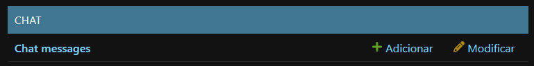
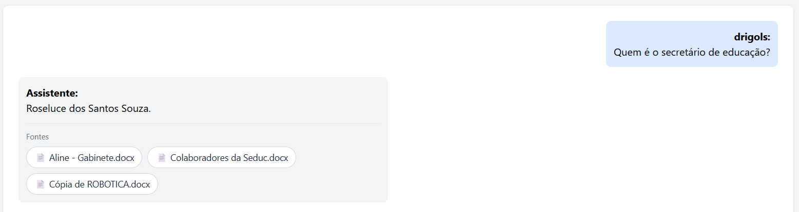
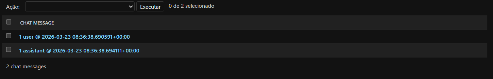
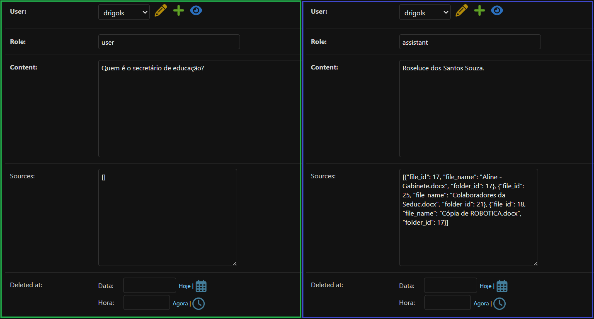

# `Persistindo (salvando) o histórico de chat no banco de dados`

## Conteúdo

 - [`O que vamos fazer aqui?`](#oqvfa)
 - [`Modelando a tabela ChatMessage()`](#chatmessage-model)
 - [`Criando o módulo chat/history.py`](#history-module)
 - [`Atualizando a view (ação) chat/views.py::ask_view()`](#update-ask-view)
 - [`Atualizando a view (ação) users/views.py::home_view()`](#update-home-view)
 - [`Criando (implementando) a view (ação) para limpar o histórico de chat`](#create-clear-chat-view)
 - [`Criando (implementando) a ROTA/URL chat/clear/`](#create-clear-chat-url)
 - [`Atualizando o template home.html`](#update-home-template)
<!---
[WHITESPACE RULES]
- 50
--->


---

<div id="oqvfa">

## `O que vamos fazer aqui?`

> Até agora o nosso histórico (chat) está sendo guardado na **sessão do Django**, na chave `chat_history`.

 - Ao fazer perguntas, as mensagens são acrescentadas em `request.session["chat_history"]`.
 - A sessão é um “armazém” ligado ao navegador do usuário (via **cookie de sessão**), mantido no servidor conforme a configuração (`DATABASES`, cache, arquivo, etc.).

Quando nós chamamos **logout** (`django.contrib.auth.logout`), o Django **encerra a sessão de autenticação** e, na prática, **invalida ou substitui a sessão atual**. Os dados que estavam só nessa sessão — incluindo `chat_history` — **deixam de estar associados à nova sessão**, então o histórico **some** da perspectiva do usuário.

**Resumindo:**  
O histórico não está no banco como *“conversa salva”*; está **acoplado à sessão**.

> Logout = nova sessão (ou sessão limpa) = histórico “perdido” para a interface.

### `Por que isso acontece (intenção técnica)?`

 - **Sessão** foi pensada para estado **curto prazo** e **por visita/login**: carrinho, preferências temporárias, fluxo de um formulário, etc.
 - **Logout** é um evento de segurança: “esta pessoa não é mais esta conta neste browser”. Limpar ou rotacionar a sessão evita que restos de dados sensíveis fiquem acessíveis na mesma sessão anônima ou em outro fluxo.

Por isso é **esperado** que qualquer coisa que exista **somente** na sessão desapareça ou não seja mais recuperada após o logout, a menos que você copie isso para outro lugar (por exemplo, banco de dados) antes ou use outro desenho.

### `Vantagens de guardar o histórico só na sessão`

| Vantagem                     | Explicação                                                     |
|------------------------------|----------------------------------------------------------------|
| **Simplicidade**             | Não precisa de tabelas novas, migrações nem CRUD de mensagens. |
| **Menos custo de BD**        | Nada de INSERT a cada troca de mensagem (útil em protótipos).  |
| **Privacidade “por padrão”** | Ao sair ou expirar a sessão, o histórico some do servidor (dependendo do backend de sessão). |
| **Implementação rápida**     | Ideal para MVP e testes de RAG.                                |

### `Desvantagens`

| Desvantagem                 | Explicação                                                                |
|-----------------------------|---------------------------------------------------------------------------|
| **Perda no logout**         | Como você notou: sair apaga o vínculo com aquele histórico.               |
| **Perda em outros casos**   | Cookie apagado, outro navegador/dispositivo, expiração da sessão.         |
| **Sem histórico “oficial”** | Não há conversas auditáveis, exportáveis ou recuperáveis por suporte.     |
| **Escalabilidade**          | Sessões grandes (muito texto) aumentam payload e armazenamento da sessão. |

### `Abordagem profissional: o que fazer em um produto real`

A prática usual é **separar claramente** dois conceitos:

 1. **Sessão** — coisas efêmeras (última página, flags, rascunho opcional).
 2. **Persistência** — conversas do usuário no **banco de dados** (ou serviço dedicado), ligadas ao **usuário** (e opcionalmente a um **workspace** ou **projeto**).

> Ou seja, aqui nós vamos persistir o histórico em um banco de dados, e **não** na sessão do navegador.


---

<div id="chatmessage-model"></div>

## `Modelando a tabela ChatMessage()`

> Aqui, nós vamos modelar uma tabela `ChatMessage` para armazenar as mensagens do chat.

A nossa tabela `ChatMessage` terá as seguintes colunas (campos):

| Campo        | Função                                                                           |
|--------------|----------------------------------------------------------------------------------|
| `user`       | Chave estrangeira para o usuário (`User` padrão do Django).                      |
| `role`       | `"user"` ou `"assistant"` (o template já trata esses papéis).                    |
| `content`    | Texto da mensagem.                                                               |
| `sources`    | `JSONField` com a lista de fontes do RAG (só relevante para o assistente); vazio para mensagens do usuário. |
| `created_at` | Data/hora de criação; ordenação do histórico.                                    |
| `deleted_at` | Data/hora de exclusão; marca o fim da conversa (Muito utilizado em soft delete). |

### `Código Completo`

A nossa classe `ChatMessage()` (completa) vai ficar da seguinte maneira:

[chat/models.py](../../../chat/models.py)
```python
from django.conf import settings
from django.db import models


class ChatMessage(models.Model):
    """Uma linha do histórico de chat por usuário (usuário ou assistente)."""

    user = models.ForeignKey(
        settings.AUTH_USER_MODEL,
        on_delete=models.CASCADE,
        related_name="chat_messages",
    )
    role = models.CharField(max_length=32)
    content = models.TextField()
    sources = models.JSONField(default=list, blank=True)
    created_at = models.DateTimeField(auto_now_add=True)
    deleted_at = models.DateTimeField(null=True, blank=True)

    class Meta:
        ordering = ["created_at", "id"]

    def __str__(self) -> str:
        return f"{self.user_id} {self.role} @ {self.created_at}"
```

Agora, nós precisamos aplicar as migrações:

```bash
poetry run python manage.py migrate
```

```bash
poetry run python manage.py makemigrations
```

Continuando, agora vamos registrar esse modelo no nosso Django Admin:

[chat/admin.py](../../../chat/admin.py)
```python
from django.contrib import admin

from .models import ChatMessage

admin.site.register(ChatMessage)
```

**NOTE:**  
Se você olhar agora no Django Admin ou no Banco de Dados verá a tabela `chat_chatmessage`.

  

Agora, vamos fazer uma pergunta no Chat:

  

Agora, vamos olhar no Django Admin:

  

Vejam que para apenas uma pergunta nós temos 2 mensagens:

 - **A pergunta do usuário:**
   - `1 user @ 2026-03-23 08:36:38.690591+00:00`
 - **A resposta do assistente:**
   - `1 assistant @ 2026-03-23 08:36:38.694111+00:00`

Vamos ver como cada uma das mensagens é armazenada no banco de dados: 

  

Vejam que é muito parecido. A maior mudança é o armazenamento do campo `sources` no assistente.

> **⚠️ NOTE:**  
> Lembrando que eu só consegui testar isso nesse momento desse tutorial porque eu já implementei toda a lógica necessária.


---

<div id="history-module"></div>

## `Criando o módulo chat/history.py`

> Aqui, nós vamos criar algumas funções utilitárias para lidar com o histórico de chat.

 - `get_chat_history_dicts(user)`
   - Lê todas as mensagens do usuário em ordem e devolve a mesma estrutura de dicionários que o template já esperava (`role`, `content`, e `sources` quando existir).
 - `append_exchange(user, question, answer, sources)`
   - Após uma pergunta bem-sucedida (ou com erro tratado), grava **duas** linhas:
     - Uma do usuário
     - Uma do assistente.
 - `clear_chat_for_user(user)`
   - Apaga todas as linhas `ChatMessage` daquele usuário.

Assim a regra de persistência fica centralizada e as views permanecem enxutas.

### `Código Completo`

O módulo `chat/history.py` (completo) vai ficar da seguinte maneira:

[chat/history.py](../../../chat/history.py)
```python
from typing import Any, Dict, List

from django.contrib.auth.models import AbstractUser
from django.utils import timezone

from chat.models import ChatMessage


def get_chat_history_dicts(user: AbstractUser) -> List[Dict[str, Any]]:
    """
    Monta a lista no formato esperado pelo template home
    (role, content, sources).
    """

    messages: List[Dict[str, Any]] = []

    for msg in ChatMessage.objects.filter(
        user=user,
        deleted_at__isnull=True).order_by("created_at", "id"):
        entry: Dict[str, Any] = {
            "role": msg.role,
            "content": msg.content,
        }
        if msg.role == "assistant" and msg.sources:
            entry["sources"] = msg.sources
        messages.append(entry)
    return messages


def append_exchange(
    user: AbstractUser,
    question: str,
    answer: str,
    sources: List[Dict[str, Any]],
) -> None:
    ChatMessage.objects.create(
        user=user,
        role="user",
        content=question,
        sources=[],
    )
    ChatMessage.objects.create(
        user=user,
        role="assistant",
        content=answer,
        sources=sources or [],
    )


def clear_chat_for_user(user: AbstractUser) -> None:
    # Soft-delete: não apaga fisicamente do banco;
    # apenas marca como deletado.
    ChatMessage.objects.filter(
        user=user,
        deleted_at__isnull=True).update(
            deleted_at=timezone.now()
    )
```


---

<div id="update-ask-view"></div>

## `Atualizando a view (ação) chat/views.py::ask_view()`

Até então, a nossa view (ação) `ask_view` tratava o histórico de chat como uma sessão:

### `CÓDIGO ANTIGO`

```python
from typing import Any, Dict, List

from django.contrib.auth.decorators import login_required
from django.http import HttpRequest, HttpResponse
from django.shortcuts import render

from rag.services.qa_service import ask


@login_required(login_url="/")
def ask_view(request: HttpRequest) -> HttpResponse:

    chat_history: List[Dict[str, Any]] = request.session.get(
        "chat_history",
        [],
    )

    if request.method != "POST":
        context: Dict[str, Any] = {
            "chat_history": chat_history,
        }
        return render(request, "pages/home.html", context)

    question: str = request.POST.get("question", "").strip()

    if not question:
        context: Dict[str, Any] = {
            "chat_history": chat_history,
        }
        return render(request, "pages/home.html", context)

    user_id: int = request.user.id

    try:
        # 🔥 AGORA O ASK DEVE RETORNAR UM DICT
        result: Dict[str, Any] = ask(
            user_id=user_id,
            question=question,
        )

        answer: str = result.get("answer", "")
        sources: List[Dict[str, str]] = result.get("sources", [])

    except Exception as error:
        print("ERRO RAG:", error)
        answer = "Erro ao processar sua pergunta."
        sources = []

    # 👤 mensagem do usuário
    user_message: Dict[str, Any] = {
        "role": "user",
        "content": question,
    }

    # 🤖 mensagem do assistente (COM FONTES)
    assistant_message: Dict[str, Any] = {
        "role": "assistant",
        "content": answer,
        "sources": sources,  # 🔥 NOVO
    }

    chat_history.append(user_message)
    chat_history.append(assistant_message)

    request.session["chat_history"] = chat_history
    request.session.modified = True

    context: Dict[str, Any] = {
        "chat_history": chat_history,
    }

    return render(request, "pages/home.html", context)
```

### `CÓDIGO NOVO (ATUALIZADO)`

Agora a nossa view (ação) vai utilizar as nossas funções utilizadas em `history.py` e armazenar o histórico no banco de dados:

[chat/views.py](../../../chat/views.py)
```python
from typing import Any, Dict, List

from django.contrib import messages
from django.contrib.auth.decorators import login_required
from django.http import HttpRequest, HttpResponse
from django.shortcuts import redirect, render

from chat.history import (
    append_exchange,
    clear_chat_for_user,
    get_chat_history_dicts,
)
from rag.services.qa_service import ask


@login_required(login_url="/")
def ask_view(request: HttpRequest) -> HttpResponse:
    if request.method == "GET":
        return redirect("home")

    chat_history: List[Dict[str, Any]] = get_chat_history_dicts(request.user)

    question: str = request.POST.get("question", "").strip()

    if not question:
        context: Dict[str, Any] = {
            "chat_history": chat_history,
        }
        return render(request, "pages/home.html", context)

    user_id: int = request.user.id

    try:
        result: Dict[str, Any] = ask(
            user_id=user_id,
            question=question,
        )

        answer: str = result.get("answer", "")
        sources: List[Dict[str, str]] = result.get("sources", [])

    except Exception as error:
        print("ERRO RAG:", error)
        answer = "Erro ao processar sua pergunta."
        sources = []

    append_exchange(
        user=request.user,
        question=question,
        answer=answer,
        sources=sources,
    )

    chat_history = get_chat_history_dicts(request.user)

    context: Dict[str, Any] = {
        "chat_history": chat_history,
    }

    return render(request, "pages/home.html", context)
```


---

<div id="update-home-view"></div>

## `Atualizando a view (ação) users/views.py::home_view()`

A nossa view (ação) `home_view()` também vai precisar ser atualizada; antes ela exibia o histórico armazenado na sessão - E agora vai exibir o histórico armazenado no banco de dados.

[users/views.py](../../../users/views.py)
```python
from chat.history import get_chat_history_dicts


@login_required(login_url="/")
def home_view(request):
    chat_history = get_chat_history_dicts(request.user)
    return render(
        request,
        "pages/home.html",
        {"chat_history": chat_history},
    )
```


---

<div id="create-clear-chat-view"></div>

## `Criando (implementando) a view (ação) para limpar o histórico de chat`

Aqui, nós vamos criar uma view (ação) para limpar o histórico de chat.

> **⚠️ NOTE:**  
> Lembrando, que nós vamos aplicar o conceito de **soft-delete** no nosso banco de dados.

### `Código Completo`

A nossa view (ação) `clear_chat_view()` (completa) vai ficar da seguinte maneira:

[chat/views.py](../../../chat/views.py)
```python
@login_required(login_url="/")
def clear_chat_view(request: HttpRequest) -> HttpResponse:
    if request.method != "POST":
        return redirect("home")

    clear_chat_for_user(request.user)
    messages.success(request, "Histórico do chat foi limpo.")
    return redirect("home")
```


---

<div id="create-clear-chat-url"></div>

## `Criando (implementando) a ROTA/URL chat/clear/`

Agora, nós vamos precisar criar uma rota (URL) para que seja possível chamar (referenciar) a view (ação) `clear_chat_view()`.

[chat/urls.py](../../../chat/urls.py)
```python
from django.urls import path

from . import views

urlpatterns = [

    ...

    path(
        route="chat/clear/",
        view=views.clear_chat_view,
        name="clear_chat"
    ),
]
```


---

<div id="update-home-template"></div>

## `Atualizando o template home.html`

Por fim, nós vamos atualizar o nosso template `home.html` para exibir o histórico de chat armazenado no banco de dados e limpar quando alguém clicar no botão *"Limpar"*.

[users/templates/pages/home.html](../../../users/templates/pages/home.html)
```html



Home


    <div class="flex h-screen min-h-0 overflow-hidden bg-gray-100">

        <!-- Sidebar -->
        

        <!-- Área principal: min-h-0 permite o filho flex encolher e rolar -->
        <main class="flex min-h-0 min-w-0 flex-1 flex-col overflow-hidden">

            <!-- Área do chat -->
            <div class="flex min-h-0 flex-1 flex-col gap-4 p-6">

                <!-- Header -->
                <header class="shrink-0 bg-white shadow px-6 py-4 flex flex-wrap items-center justify-between gap-3">
                    <h1 class="text-2xl font-semibold text-gray-800">
                        Bem-vindo, {{ request.user.username }}!
                    </h1>
                </header>

                
                    <ul class="shrink-0 space-y-2">
                        
                            <li class="px-4 py-2 rounded-lg text-sm
                                
                                    bg-green-100 text-green-800
                                
                                    bg-red-100 text-red-800
                                ">
                                {{ message }}
                            </li>
                        
                    </ul>
                

                <!-- Histórico (rolagem interna; JS mantém a vista no fim = mensagens recentes) -->
                <div
                    id="chat-history"
                    class="
                    min-h-0
                    flex-1
                    overflow-y-auto
                    overscroll-y-contain
                    bg-white
                    rounded-lg
                    shadow
                    p-6
                    space-y-4">

                    

                        

                            <!-- USUÁRIO -->
                            
                                <div class="flex justify-end">
                                    <div class="max-w-xl">
                                        <div class="bg-blue-100 p-3 rounded-lg">
                                            <strong class="flex justify-end">
                                                {{ request.user.username }}:
                                            </strong>
                                            {{ message.content }}
                                        </div>
                                    </div>
                                </div>

                            <!-- ASSISTENTE -->
                            
                                <div class="flex justify-start">
                                    <div class="max-w-xl">
                                        <div class="bg-gray-100 p-3 rounded-lg">
                                            
                                            <strong class="flex">
                                                Assistente:
                                            </strong>

                                            <!-- Resposta -->
                                            <div>
                                                {{ message.content }}
                                            </div>

                                            
                                                <div class="mt-3 pt-3 border-t border-gray-200">
                                                    <div class="text-xs text-gray-500 mb-2">
                                                        Fontes
                                                    </div>
                                                    <div class="flex flex-wrap items-center gap-2 text-sm">
                                                        
                                                            
                                                                <a
                                                                    href="?folder={{ source.folder_id }}"
                                                                    class="
                                                                        inline-flex items-center gap-1
                                                                        rounded-full px-3 py-1.5
                                                                        bg-white border border-gray-300
                                                                        text-gray-800
                                                                        hover:bg-gray-50 hover:border-gray-400
                                                                        whitespace-nowrap
                                                                    "
                                                                >
                                                                    📄 {{ source.file_name }}
                                                                </a>
                                                            
                                                                <a
                                                                    href=""
                                                                    class="
                                                                        inline-flex items-center gap-1
                                                                        rounded-full px-3 py-1.5
                                                                        bg-white border border-gray-300
                                                                        text-gray-800
                                                                        hover:bg-gray-50 hover:border-gray-400
                                                                        whitespace-nowrap
                                                                    "
                                                                >
                                                                    📄 {{ source.file_name }}
                                                                </a>
                                                            
                                                        
                                                    </div>
                                                </div>
                                            

                                        </div>
                                    </div>
                                </div>

                            <!-- SISTEMA -->
                            
                                <div class="flex justify-center">
                                    <div class="max-w-xl">
                                        <div class="bg-yellow-100 p-3 rounded-lg">
                                            {{ message.content }}
                                        </div>
                                    </div>
                                </div>
                            

                        

                    
                        <div class="text-center text-gray-500">
                            Nenhuma mensagem ainda. Faça uma pergunta!
                        </div>
                    

                </div>
                <!-- /Histórico -->

                <!-- Limpar + Formulário de pergunta + botão -->
                <div class="flex items-center gap-3">

                    <!-- Botão Limpar -->
                    <form method="post" action="">
                        
                        <button
                            type="submit"
                            class="
                                px-4 py-2
                                rounded-lg
                                border border-gray-300
                                bg-white text-gray-800
                                hover:bg-gray-50
                                whitespace-nowrap
                            "
                        >
                            Limpar
                        </button>
                    </form>
                    <!-- /Botão Limpar -->

                    <!-- Form de pergunta -->
                    <form method="POST" action="" class="flex flex-1 gap-3">
                        

                        <input
                            type="text"
                            name="question"
                            placeholder="Digite sua pergunta..."
                            required
                            class="peer flex-1 border rounded-lg px-4 py-2"
                        >

                        <!-- Botão Enviar -->
                        <button
                            type="submit"
                            class="
                                px-6 py-2 rounded-lg
                                bg-blue-600 text-white
                                opacity-50
                                pointer-events-none
                                peer-valid:opacity-100
                                peer-valid:pointer-events-auto
                            ">
                            Enviar
                        </button>
                        <!-- /Botão Enviar -->
                    </form>
                    <!-- /Form de pergunta -->
                </div>
                <!-- /Limpar + Formulário de pergunta + botão -->

            </div>
            <!-- /Área do chat -->
        </main>
    </div>



    <script src=""></script>

```

---

**Rodrigo** **L**eite da **S**ilva - **rodrigols89**
