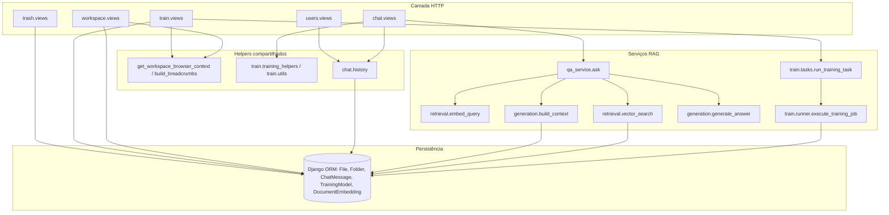
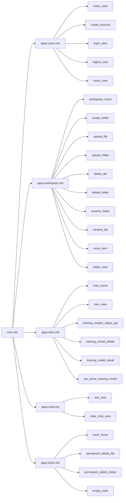
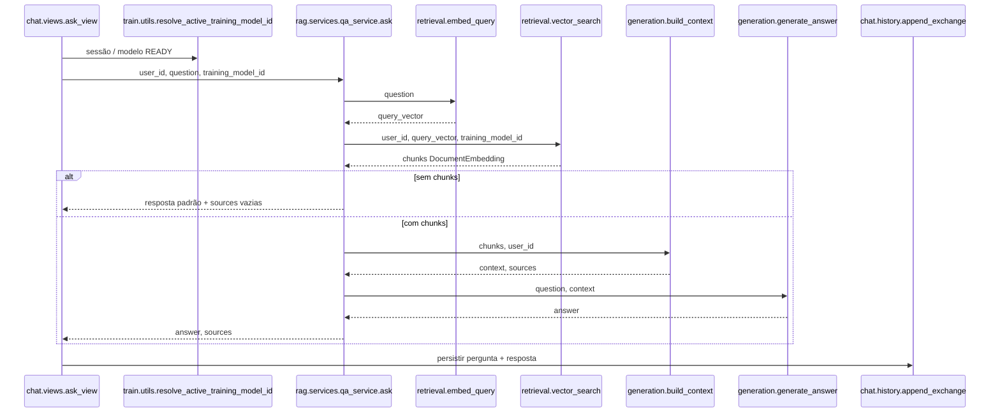
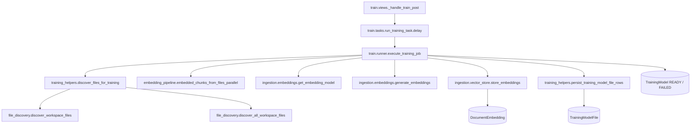
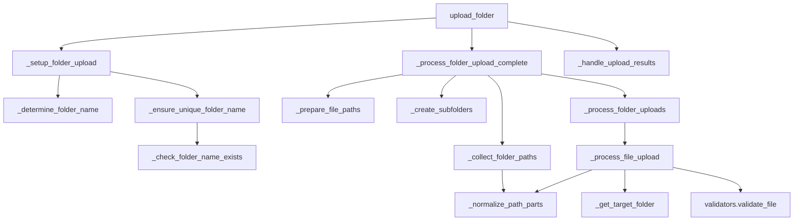
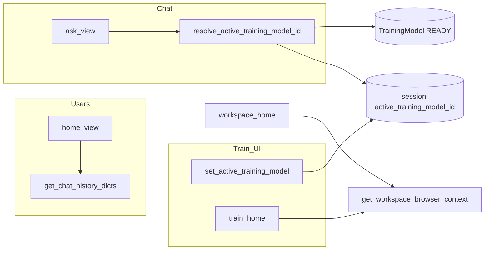
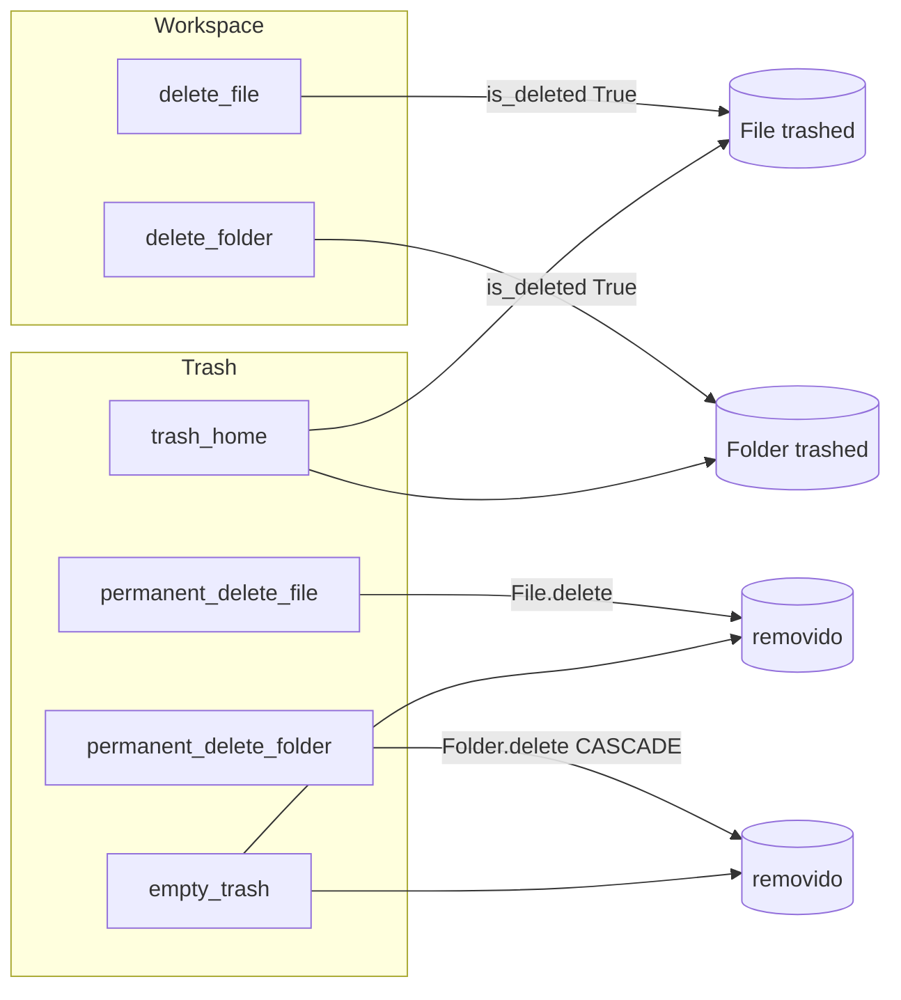

# `Mapa de funções do projeto (RAG / Django)`

Este documento resume **como as principais funções se relacionam** nos apps Django (`users`, `workspace`, `train`, `chat`, `trash`, `rag`) e no núcleo (`core`). Os diagramas usam [Mermaid](https://mermaid.js.org/) (renderizam em GitHub, GitLab e muitos editores Markdown).

---

## 1. Visão geral por camada

Fluxo de alto nível: HTTP → views → serviços → ORM / Celery / APIs externas.

---

## 2. Rotas → views (entrada HTTP)

Montagem em `core/urls.py`: admin, `allauth`, depois apps sem prefixo próprio.

*(Nomes exatos das rotas URL estão em cada `urls.py`; o diagrama foca nas **funções-view** ligadas.)*

---

## 3. Pipeline de chat + RAG (`ask_view` → `ask`)

---

## 4. Treinamento assíncrono (Celery → runner → ingestão)

---

## 5. Workspace: upload de pasta (funções encadeadas)

Subconjunto das helpers em `workspace.views` que formam o fluxo de upload em árvore.

---

## 6. Utilidades transversais

---

## 7. Lixeira vs workspace (soft delete vs hard delete)

---

## Referência rápida de arquivos-chave

| Área | Módulo principal | Funções de entrada |
|------|------------------|-------------------|
| CLI Django | `manage.py` | `main` → `execute_from_command_line` |
| URLs | `core/urls.py` | `urlpatterns` |
| Chat | `apps/chat/views.py` | `ask_view`, `clear_chat_view` |
| RAG pergunta | `apps/rag/services/qa_service.py` | `ask` |
| Treino | `apps/train/views.py`, `tasks.py`, `runner.py` | `train_view` / `_handle_train_post`, `run_training_task`, `execute_training_job` |
| Workspace | `apps/workspace/views.py` | `workspace_home`, uploads, rename, move, delete |
| Histórico | `apps/chat/history.py` | `get_chat_history_dicts`, `append_exchange`, `clear_chat_for_user` |

---

*Gerado a partir da estrutura atual do repositório; ao adicionar views ou serviços, atualize os diagramas correspondentes.*
