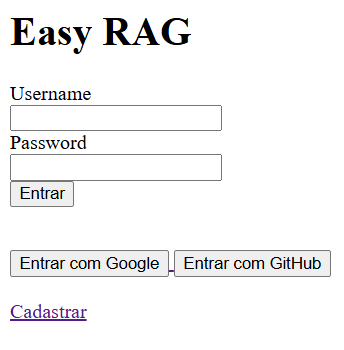
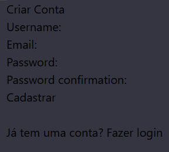
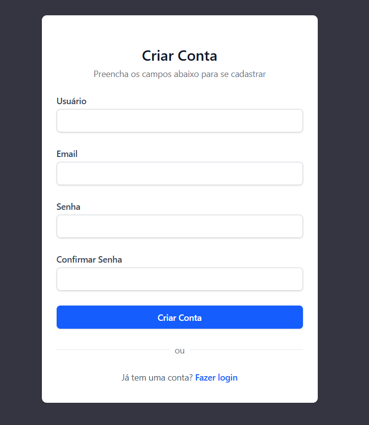
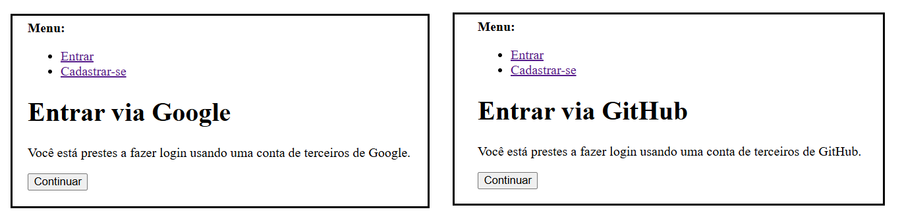
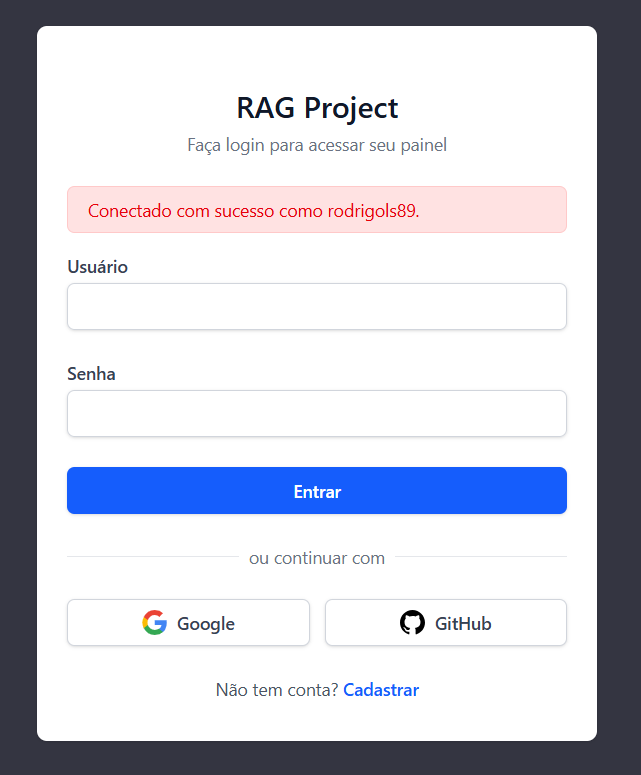
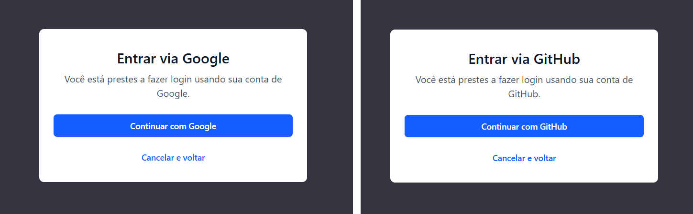
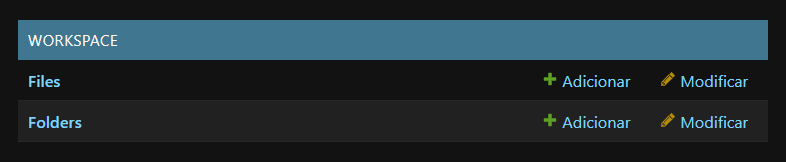
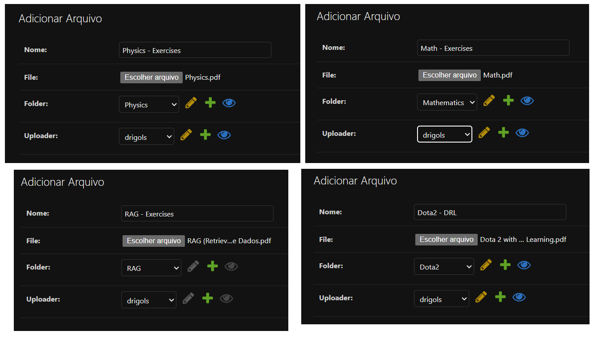
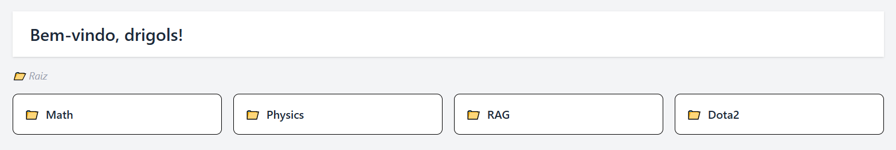

# Easy RAG

## Conteúdo

 - [`Adicionando .editorconfig e .gitignore`](#editorconfig-gitignore)
 - [`Iniciando o projeto com "poetry init"`](#poetry-init)
 - [`Instalando e configurando o Ruff`](#ruff-settings-pyproject)
 - [`Instalando e configurando o Pytest`](#pytest-settings-pyproject)
 - [`Instalando e configurando o Taskipy`](#taskipy-settings-pyproject)
 - [`Instalando e configurando o pre-commit`](#precommit-settings)
 - [`Criando o container com PostgreSQL (db)`](#db-container)
 - [`Criando o container com Redis (redis_cache)`](#redis-container)
 - [`Instalando/Configurando/Exportando o Django + Uvicorn + PostgresSQL`](#django-settings)
 - [`Criando o container web: Dockerfile + Django + Uvicorn`](#web-container)
 - [`Criando o container Nginx (nginx)`](#nginx-container)
 - [`Configurando o Django para reconhecer o PostgreSQL (+ .env) como Banco de Dados`](#django-postgresql-settings)
 - [`Criando App "users"`](#app-users)
 - [`Criando a landing page da aplicação (base.html + index.html)`](#index-landing)
 - [`Criando a página de cadastro (create-account.html + DB Commands)`](#create-account)
 - [`Criando a sessão de login/logout + página home.html`](#session-home)
 - [`Criando o login com Google e GitHub`](#login-google-github)
 - [`Criando o app "workspace"`](#app-workspace)
 - [`Mapeando a rota home/ com a workspace/`](#home-to-workspace)
 - [`Modelando o workspace: Pastas (Folders) e Arquivos (Files)`](#folder-file)
 - [`Customizando os formulários FolderForm e FileForm`](#workspace-forms)
 - [`Atualizando a view (ação) para exibir as pastas e arquivos`](#update-view-to-list-folders-and-files)
 - [`Criando a "Área Principal" dos templates /home.html e /workspace_home`](#main-area-home-workspace)
 - [`Adicionando novas pastas (folders) com a view create_folder()`](#adding-new-folders)
 - [`Implementando a inserção de arquivos`](#implement-insert-files)
 - [`path(route, view, name)`](#path)
 - [`.github/workflows`](#github-workflows)
 - [`Variáveis de Ambiente`](#env-vars)
 - [`Comandos Taskipy`](#taskipy-commands)
<!---
[WHITESPACE RULES]
- "40" Whitespace character.
--->


---

<div id="editorconfig-gitignore"></div>

## `Adicionando .editorconfig e .gitignore`

De início vamos adicionar os arquivos `.editorconfig` e `.gitignore` na raiz do projeto:

[.editorconfig](../.editorconfig)
```conf
# top-most EditorConfig file
root = true

# Unix-style newlines with a newline ending every file
[*]
end_of_line = lf
insert_final_newline = true
charset = utf-8

# 4 space indentation
[*.{py,html, js}]
indent_style = space
indent_size = 4

# 2 space indentation
[*.{json,y{a,}ml,cwl}]
indent_style = space
indent_size = 2
```

[.gitignore](../.gitignore)
```conf

É muito grande não vou exibir...
```


---

<div id="poetry-init"></div>

## `Iniciando o projeto com "poetry init"`

Agora vamos iniciar nosso projeto com `poetry init`:

```bash
poetry init
```


---

<div id="ruff-settings-pyproject"></div>

## `Instalando e configurando o Ruff`

Aqui vamos instalar e configurar o **Ruff** no nosso `pyproject.toml`:

```bash
poetry add --group dev ruff@latest
```

> Esse bloco define às *Regras Gerais de funcionamento do (Ruff)*.

#### `[tool.ruff]`

```toml
[tool.ruff]
line-length = 79
exclude = [
    "core/settings.py",
]
```

 - `line-length = 79`
   - Define que nenhuma linha de código deve ultrapassar 79 caracteres *(seguindo o padrão tradicional do PEP 8)*.
   - É especialmente útil para manter legibilidade em terminais com largura limitada.
   - Ruff irá avisar (e, se possível, corrigir) quando encontrar linhas mais longas.
 - `exclude = ["core/settings.py"]`
   - Define quais arquivos o Ruff deve ignorar:
     - Nesse caso, ele vai ignorar o arquivo `core/settings.py`.

#### `[tool.ruff.lint]`

Esse é o sub-bloco principal de configuração de linting do Ruff, ou seja, onde você define como o Ruff deve analisar o código quanto a erros, estilo, boas práticas etc.

```toml
[tool.ruff.lint]
preview = true
select = ['I', 'F', 'E', 'W', 'PL', 'PT']
```

 - `preview = true`
   - Ativa regras experimentais (em fase de teste, mas estáveis o suficiente).
   - Pode incluir novas verificações que ainda não fazem parte do conjunto padrão.
   - Útil se você quer estar sempre com o Ruff mais “rigoroso” e atualizado.
 - `select = ['I', 'F', 'E', 'W', 'PL', 'PT']`
   - Define quais conjuntos de regras (lints) o Ruff deve aplicar ao seu código. Cada uma dessas letras corresponde a um grupo de regras:
     - `I` ([Isort](https://pycqa.github.io/isort/)): Ordenação de imports em ordem alfabética.
     - `F` ([Pyflakes](https://github.com/PyCQA/pyflakes)): Procura por alguns erros em relação a boas práticas de código.
     - `E` ([pycodestyle](https://pycodestyle.pycqa.org/en/latest/)): Erros de estilo de código.
     - `W` ([pycodestyle](https://pycodestyle.pycqa.org/en/latest/)): Avisos sobre estilo de código.
     - `PL` ([Pylint](https://pylint.pycqa.org/en/latest/index.html)): "erros" em relação a boas práticas de código.
     - `PT` ([flake8-pytest](https://pypi.org/project/flake8-pytest-style/)): Boas práticas do Pytest.

#### `[tool.ruff.format]`

O bloco [tool.ruff.format] é usado para configurar o formatador interno do Ruff, que foi introduzido recentemente como uma alternativa ao Black — mas com a vantagem de ser muito mais rápido.

```toml
[tool.ruff.format]
preview = true
quote-style = "double"
```

 - `preview = true`
   - Ativa regras experimentais (em fase de teste, mas estáveis o suficiente).
 - `quote-style = "double"`
   - Define o estilo de aspas (duplas no nosso caso) usadas pelo formatador.


---

<div id="pytest-settings-pyproject"></div>

## `Instalando e configurando o Pytest`

Agora nós vamos instalar e configurar o **Pytest** no nosso `pyproject.toml`.

```bash
poetry add --group dev pytest@latest
```

```bash
poetry add --group dev pytest-cov@latest
```

#### `[tool.pytest.ini_options]`

O bloco `[tool.pytest.ini_options]` no `pyproject.toml` é usado para configurar o comportamento do Pytest, da mesma forma que você faria com `pytest.ini`, `setup.cfg` ou `tox.ini`:

```toml
[tool.pytest.ini_options]
pythonpath = "."
addopts = '-p no:warnings'
```

 - `pythonpath = "."`
   - Onde o Pytest procurar arquivos Python para executar.
   - Ou seja, a partir da `raiz (.)` do nosso projeto.
 - `addopts = '-p no:warnings'`
   - Para ter uma visualização mais limpa dos testes, caso alguma biblioteca exiba uma mensagem de warning, isso será suprimido pelo pytest.


---

<div id="taskipy-settings-pyproject"></div>

## `Instalando e configurando o Taskipy`

Agora nós vamos instalar e configurar o **Taskipy** no nosso `pyproject.toml`.

```bash
poetry add --group dev taskipy@latest
```

#### `[tool.taskipy.tasks]`

O bloco `[tool.taskipy.tasks]` é usado para definir *tarefas (tasks)* automáticas personalizadas no seu `pyproject.toml`, usando o pacote taskipy.

```toml
[tool.taskipy.tasks]
lint = 'ruff check'
pre_format = 'ruff check --fix'
format = 'ruff format'
pre_test = 'task lint'
test = 'pytest -s -x --cov=. -vv'
post_test = 'coverage html'
```

 - `lint = 'ruff check'`
   - Executa o Ruff para verificar erros de estilo e código (linting), sem alterar nada.
 - `pre_format = 'ruff check --fix'`
   - Executa antes da *tarefa (task)* `format`. Aqui, você corrige automaticamente os erros encontrados por Ruff.
 - `format = 'ruff format'`
   - Usa o formatador nativo do Ruff (em vez de Black) para aplicar formatação ao código. 
 - `pre_test = 'task lint'`
   - Antes de rodar os testes, executa a tarefa lint (garantindo que o código está limpo).
 - `test = 'pytest -s -x --cov=. -vv'`
   - Roda os testes com Pytest, com as seguintes opções:
     - `-s`: Mostra print() e input() no terminal.
     - `-x`: Interrompe no primeiro erro.
     - `--cov=.`: Mede cobertura de testes com o plugin pytest-cov
     - `-vv`: Verbosidade extra (mostra todos os testes)
 - `post_test = 'coverage html'`
   - Depois dos testes, gera um relatório HTML de cobertura que você pode abrir no navegador (geralmente em htmlcov/index.html).


---

<div id="precommit-settings"></div>

## `Instalando e configurando o pre-commit`

Para garantir que antes de cada commit seu projeto passe por:

 - ✅ lint (usando Ruff)
 - ✅ test (com pytest)
 - ✅ coverage

Você deve usar o pre-commit — uma ferramenta leve e ideal para isso. Vamos configurar passo a passo:

```bash
poetry add --group dev pre-commit
```

[.pre-commit-config.yaml](../.pre-commit-config.yaml)
```yaml
repos:
  - repo: local
    hooks:
      - id: ruff-lint
        name: ruff check
        entry: task lint
        language: system
        types: [python]

      - id: pytest-test
        name: pytest test
        entry: task test
        language: system
        types: [python]

      - id: pytest-coverage
        name: pytest coverage
        entry: task post_test
        language: system
        types: [python]
```

Agora nós precisamos instalar o pre-commit:

```bash
pre-commit install
```

#### Dica extra: Se quiser rodar manualmente

```bash
pre-commit run --all-files
```

> **NOTE:**  
> É interessante ter uma checagem rápida no Taskipy.

[pyproject.toml](../pyproject.toml)
```toml
[tool.taskipy.tasks]
precommit = 'pre-commit run --all-files'
```


---

<div id="db-container"></div>

## `Criando o container com PostgreSQL (db)`

> Aqui nós vamos entender e criar um container contendo o `Banco de Dados PostgreSQL`.

 - **Função:**
   - Armazenar dados persistentes da aplicação (usuários, arquivos, prompts, etc.).
 - **Quando usar:**
   - Sempre que precisar de um banco de dados relacional robusto.
 - **Vantagens:**
   - ACID (consistência e confiabilidade).
   - Suporte avançado a consultas complexas.
 - **Desvantagens:**
   - Mais pesado que bancos NoSQL para dados muito simples.

Antes de criar nosso container contendo o *PostgreSQL* vamos criar as variáveis de ambiente para esse container:

[.env](../.env)
```bash
# ==========================
# CONFIGURAÇÃO DO POSTGRES
# ==========================
POSTGRES_DB=easy_rag_db           # Nome do banco de dados a ser criado
POSTGRES_USER=easyrag             # Usuário do banco
POSTGRES_PASSWORD=easyragpass     # Senha do banco
POSTGRES_HOST=db                  # Nome do serviço (container) do banco no docker-compose
POSTGRES_PORT=5432                # Porta padrão do PostgreSQL
```

 - `PostgreSQL (db)`
   - `POSTGRES_DB` → nome do banco criado automaticamente ao subir o container.
   - `POSTGRES_USER` → usuário administrador do banco.
   - `POSTGRES_PASSWORD` → senha do usuário do banco.
   - `POSTGRES_HOST` → para o Django se conectar, usamos o nome do serviço (db), não localhost, pois ambos estão na mesma rede docker.
   - `POSTGRES_PORT` → porta padrão 5432.

Continuando, o arquivo [docker-compose.yml](../docker-compose.yml) para o nosso container *PostgreSQL* ficará assim:

[docker-compose.yml](../docker-compose.yml)
```yml
services:
  db:
    image: postgres:15
    container_name: postgresql
    restart: always
    env_file: .env
    volumes:
      - postgres_data:/var/lib/postgresql/data
    networks:
      - backend

volumes:
  postgres_data:

networks:
  backend:
```

 - `db`
   - Nome do *serviço (container)* criado pelo docker-compose.
 - `image: postgres:15`
   - Pega a versão 15 oficial do PostgreSQL no Docker Hub.
 - `container_name: postgresql`
   - Nome fixo do container (para facilitar comandos como docker logs postgresql).
 - `restart: always`
   - 🔹 O container vai voltar sempre que o Docker daemon subir, independente do motivo da parada.
   - 🔹 Mesmo se você der *docker stop*, quando o host reiniciar o container volta sozinho.
   - 👉 Bom para produção quando você quer *99% de disponibilidade*.
 - `env_file: .env`
   - Carrega variáveis de ambiente do arquivo `.env`.
 - `volumes:`
     - `postgres_data:` → Volume docker (Named Volume).
     - `/var/lib/postgresql/data` → pasta interna do container onde o Postgres armazena os dados.
 - `ports: 5432:5432`
   - `Primeiro 5432:` → porta no host (sua máquina).
   - `Segundo 5432:` → porta dentro do container onde o Postgres está rodando.
   - **NOTE:** Isso permite que você use o psql ou qualquer ferramenta de banco de dados (DBeaver, TablePlus, etc.) diretamente do seu PC.
 - `volumes:`
   - `postgres_data:` → Volume docker (Named Volume).
 - `networks: backend`
   - Coloca o container na rede backend para comunicação interna segura.

Agora é só subir o container:

```bash
docker compose up -d
```

Agora, se você desejar se conectar nesse Banco de Dados via *bash* utilize o seguinte comando (As vezes é necessário esperar o container/banco de dados subir):

**Entrar no container "postgres_db" via bash:**
```bash
docker exec -it postgresql bash
```

**Entra no banco de sados a partir das variáveis de ambiente:**
```bash
psql -U "$POSTGRES_USER" -d "$POSTGRES_DB"
```

> **E os volumes como eu vejo?**

```bash
docker volume ls
```

**OUTPUT:**
```bash
DRIVER    VOLUME NAME
local     ragproject_postgres_data
```

Nós também podemos inspecionar esse volume:

```bash
docker volume inspect ragproject_postgres_data
```

**OUTPUT:**
```bash
[
    {
        "CreatedAt": "2025-08-18T10:11:49-03:00",
        "Driver": "local",
        "Labels": {
            "com.docker.compose.config-hash": "a700fdfee7f177c7f6362471e765e6d38489efcbffced2de9741a321d0b88646",
            "com.docker.compose.project": "easy-rag",
            "com.docker.compose.version": "2.39.1",
            "com.docker.compose.volume": "postgres_data"
        },
        "Mountpoint": "/var/lib/docker/volumes/easy-rag_postgres_data/_data",
        "Name": "easy-rag_postgres_data",
        "Options": null,
        "Scope": "local"
    }
]
```

 - `Mountpoint`
   - O *Mountpoint* é onde os arquivos realmente ficam, mas não é recomendado mexer manualmente lá.
   - Para interagir com os dados, use o *container* ou ferramentas do próprio serviço (por exemplo, psql no Postgres).


---

<div id="redis-container"></div>

## `Criando o container com Redis (redis_cache)`

> Aqui nós vamos entender e criar um container contendo um `cache Redis`.

 - **Função:**
   - Armazenar dados temporários (cache, sessões, filas de tarefas).
 - **Quando usar:**
   - Quando for necessário aumentar velocidade de acesso a dados temporários ou usar filas.
 - **Vantagens:**
   - Muito rápido (em memória).
   - Perfeito para cache e tarefas assíncronas.
 - **Desvantagens:**
   - Não indicado para dados críticos (pode perder dados em caso de reinício)

Antes de criar nosso container contendo o *Redis* vamos criar as variáveis de ambiente para esse container:

[.env](../.env)
```bash
# ==========================
# CONFIGURAÇÃO DO REDIS
# ==========================
REDIS_HOST=redis                  # Nome do serviço (container) do Redis no docker-compose
REDIS_PORT=6379                   # Porta padrão do Redis
```

 - `Redis (redis)`
   - `REDIS_HOST` → nome do serviço no docker-compose.
   - `REDIS_PORT` → porta padrão 6379.
   - **NOTE:** O Redis será usado como cache e possivelmente fila de tarefas (com Celery, RQ ou outro).

Continuando, o arquivo [docker-compose.yml](../docker-compose.yml) para o nosso container *Redis* ficará assim:

[docker-compose.yml](../docker-compose.yml)
```yml
services:
  redis:
    image: redis:7
    container_name: redis_cache
    restart: always
    volumes:
      - redis_data:/data
    networks:
      - backend

volumes:
  redis_data:

networks:
  backend:
```

 - `redis:`
   - Nome do *serviço (container)* criado pelo docker-compose.
 - `image: redis:7`
   - Pega a versão 7 oficial do Redis no Docker Hub.
 - `container_name: redis_cache`
   - Nome fixo do container (para facilitar comandos como docker logs redis_cache).
 - `restart: always`
   - 🔹 O container vai voltar sempre que o Docker daemon subir, independente do motivo da parada.
   - 🔹 Mesmo se você der *docker stop*, quando o host reiniciar o container volta sozinho.
   - 👉 Bom para produção quando você quer *99% de disponibilidade*.
 - `env_file: .env`
   - Carrega variáveis de ambiente do arquivo `.env`.
 - `volumes:`
     - `redis_data:` → Volume docker (Named Volume).
     - `/data` → pasta interna do container onde o Redis armazena os dados.
 - `networks: backend`
   - Só está acessível dentro da rede interna backend (não expõe porta para fora).

Agora é só subir o container:

```bash
docker compose up -d
```

> **E os volumes como eu vejo?**

```bash
docker volume ls
```

**OUTPUT:**
```bash
DRIVER    VOLUME NAME
local     ragproject_redis_data
```

Nós também podemos inspecionar esse volume:

```bash
docker volume inspect ragproject_redis_data
```

**OUTPUT:**
```bash
[
    {
        "CreatedAt": "2025-11-10T07:35:18-03:00",
        "Driver": "local",
        "Labels": {
            "com.docker.compose.config-hash": "75e82217f9045c1c51074e1c927a0ba2be71af9e784263a59e10d6bfb25e12e6",
            "com.docker.compose.project": "ragproject",
            "com.docker.compose.version": "2.39.1",
            "com.docker.compose.volume": "redis_data"
        },
        "Mountpoint": "/var/lib/docker/volumes/ragproject_redis_data/_data",
        "Name": "ragproject_redis_data",
        "Options": null,
        "Scope": "local"
    }
]
```

 - `Mountpoint`
   - O *Mountpoint* é onde os arquivos realmente ficam, mas não é recomendado mexer manualmente lá.
   - Para interagir com os dados, use o *container* ou ferramentas do próprio serviço (por exemplo, psql no Postgres).


---

<div id="django-settings"></div>

## `Instalando/Configurando/Exportando o Django + Uvicorn + PostgresSQL`

 - Antes de criar um container contendo o Django, vamos instalar e configurar o Django + Uvicorn na nossa máquina local (host).
 - **NOTE:** Vai ser como um modelo que nós vamos utilizar dentro do container.

#### `Instalações iniciais`

De início, vamos instalar as bibliotecas necessárias:

```bash
poetry add django@latest
```

```bash
poetry add uvicorn@latest
```

#### `Criando o projeto Django (core)`

Agora vamos criar o projeto (core) que vai ter as configurações iniciais do Django:

```bash
django-admin startproject core .
```

#### `Configurando os arquivos: templates, static e media`

> Aqui nós vamos fazer as configurações iniciais do Django que serão.

Fazer o Django identificar onde estarão os arquivos `templates`, `static` e `media`:

[core/settings.py](../core/settings.py)
```python
TEMPLATES = [
    {
        'BACKEND': 'django.template.backends.django.DjangoTemplates',
        'DIRS': [BASE_DIR / 'templates'],
        'APP_DIRS': True,
        'OPTIONS': {
            'context_processors': [
                'django.template.context_processors.request',
                'django.contrib.auth.context_processors.auth',
                'django.contrib.messages.context_processors.messages',
            ],
        },
    },
]


STATIC_URL = '/static/'
STATICFILES_DIRS = [BASE_DIR / 'static']
STATIC_ROOT = BASE_DIR / 'staticfiles'

MEDIA_URL = '/media/'
MEDIA_ROOT = BASE_DIR / 'media'
```

Até aqui está quase tudo ok para criarmos um Container com `Django` e `Uvicorn`...

> Mas, antes de criar nossos containers, precisamos gerar os `requirements.txt` e `requirements-dev.txt`.

**Mas, primeiro devemos instalar o plugin "export" do Poetry:**
```bash
poetry self add poetry-plugin-export
```

Agora vamos gerar `requirements.txt` de *produção*:

```bash
poetry export --without-hashes --format=requirements.txt --output=requirements.txt
```

Continuando, agora vamos gerar `requirements-dev.txt` (esse é mais utilizado durante o desenvolvimento para quem não usa o Poetry):

```bash
poetry export --without-hashes --with dev --format=requirements.txt --output=requirements-dev.txt
```

Outra coisa importante agora é excluir o arquivo `core/settings.py` do ruff:

[pyproject.toml](../pyproject.toml)
```bash
[tool.ruff]
line-length = 79
exclude = [
    "core/settings.py",
]
```

> **NOTE:**  
> Agora esse arquivo não vai mais passar pelo `lint`.


---

<div id="web-container"></div>

## `Criando o container web: Dockerfile + Django + Uvicorn`

Antes de criar o container contendo o *Django* e o *Uvicorn*, vamos criar o nosso Dockerfile...

> **Mas por que eu preciso de um Dockerfile para o Django + Uvicorn?**

**NOTE:**  
O Dockerfile é onde você diz **como** essa imagem será construída.

> **O que o Dockerfile faz nesse caso?**

 - Escolhe a imagem base (ex.: python:3.12-slim) para rodar o Python.
 - Instala as dependências do sistema (por exemplo, libpq-dev para PostgreSQL).
 - Instala as dependências Python (pip install -r requirements.txt).
 - Copia o código do projeto para dentro do container.
 - Define o diretório de trabalho (WORKDIR).
 - Configura o comando de entrada.
 - Organiza assets estáticos e outras configurações.

> **Quais as vantagens de usar o Dockerfile?**

 - **Reprodutibilidade:**
   - Qualquer pessoa consegue subir seu projeto com o mesmo ambiente que você usa.
 - **Isolamento:**
   - Evita conflitos de versão no Python e dependências.
 - **Customização:**
   - Você pode instalar pacotes de sistema ou bibliotecas específicas.
 - **Portabilidade:**
   - Mesma imagem funciona no seu PC, no servidor ou no CI/CD.

O nosso [Dockerfile](../Dockerfile) vai ficar da seguinte maneira:

[Dockerfile](../Dockerfile)
```bash
# ===============================
# 1️⃣ Imagem base
# ===============================
FROM python:3.12-slim

# ===============================
# 2️⃣ Configuração de ambiente
# ===============================
WORKDIR /code
ENV PYTHONUNBUFFERED=1 \
    PYTHONDONTWRITEBYTECODE=1 \
    PIP_NO_CACHE_DIR=1

# ===============================
# 3️⃣ Dependências do sistema
# ===============================
RUN apt-get update && apt-get install -y \
    build-essential \
    libpq-dev \
    netcat-traditional \
    bash \
    && rm -rf /var/lib/apt/lists/*

# ===============================
# 4️⃣ Instalar dependências Python
# ===============================
COPY requirements.txt /code/
RUN pip install --upgrade pip && pip install -r requirements.txt

# ===============================
# 5️⃣ Copiar código do projeto
# ===============================
COPY . /code/

# ===============================
# 6️⃣ Ajustes de produção
# ===============================
# Criar usuário não-root para segurança
RUN adduser --disabled-password --no-create-home appuser && \
    chown -R appuser /code
USER appuser

# ===============================
# 7️⃣ Porta exposta (Uvicorn usa 8000 por padrão)
# ===============================
EXPOSE 8000

# ===============================
# 8️⃣ Comando padrão
# ===============================
# Mantém o container rodando e abre um shell se usado com
# `docker run` sem sobrescrever comando.
CMD ["bash"]
```

#### `Criando o docker compose para o container web`

> Aqui vamos entender e criar um container contendo o `Django` e o `Uvicorn`.

 - **Função:**
   - Executar a aplicação Django em produção.
 - **Quando usar:**
   - Sempre para servir sua aplicação backend.
 - **Vantagens:**
   - Uvicorn é um servidor WSGI otimizado para produção.
   - Separa lógica da aplicação da entrega de arquivos estáticos.
 - **Desvantagens:**
   - Não serve arquivos estáticos eficientemente.

Antes de criar nosso container contendo o *Django* e o *Uvicorn*, vamos criar as variáveis de ambiente para esse container:

[.env](../.env)
```bash
# ==========================
# CONFIGURAÇÃO DJANGO
# ==========================
DJANGO_SECRET_KEY=change-me       # Chave secreta do Django para criptografia e segurança
DJANGO_DEBUG=True                 # True para desenvolvimento; False para produção
DJANGO_ALLOWED_HOSTS=*            # Hosts permitidos; * libera para qualquer host

# ==========================
# CONFIGURAÇÃO DO UVICORN
# ==========================
UVICORN_HOST=0.0.0.0              # Escutar em todas as interfaces
UVICORN_PORT=8000                 # Porta interna do app
```

 - `DJANGO`
   - `DJANGO_SECRET_KEY` → chave única e secreta usada para assinar cookies, tokens e outras partes sensíveis.
   - `DJANGO_DEBUG` → habilita/desabilita debug e mensagens de erro detalhadas.
   - `DJANGO_ALLOWED_HOSTS` → lista de domínios que o Django aceita; `*` significa todos (não recomendado para produção).
 - `UVICORN`
   - `UVICORN_HOST` → define o IP/host onde o servidor Uvicorn vai rodar.
   - `UVICORN_PORT` → porta interna que o container expõe para o nginx ou para acesso direto no dev.

Continuando, o arquivo [docker-compose.yml](../docker-compose.yml) para o nosso container *web* ficará assim:

[docker-compose.yml](../docker-compose.yml)
```yml
services:
  web:
    build:
      context: .
      dockerfile: Dockerfile
    container_name: django_web
    restart: always
    env_file: .env
    command: >
      sh -c "
      python manage.py migrate &&
      python manage.py collectstatic --noinput &&
      uvicorn core.asgi:application --host 0.0.0.0 --port 8000
      "
    volumes:
      - .:/code
      - ./static:/code/staticfiles
      - ./media:/code/media
    depends_on:
      - db
      - redis
    ports:
      - "${UVICORN_PORT}:${UVICORN_PORT}"
    networks:
      - backend

networks:
  backend:
```

 - `web`
   - Nome do *serviço (container)* criado pelo docker-compose.
 - `build: context + dockerfile.`
   - `context: .`
     - Ponto `(.)` significa que o contexto de build é a raiz do projeto.
     - Isso quer dizer que todos os arquivos dessa pasta estarão disponíveis para o build.
   - `dockerfile: Dockerfile`
     - Nome do arquivo Dockerfile usado para construir a imagem.
 - `container_name: django`
   - Nome fixo do container (para facilitar comandos como docker logs django).
 - `restart: always`
   - 🔹 O container vai voltar sempre que o Docker daemon subir, independente do motivo da parada.
   - 🔹 Mesmo se você der *docker stop*, quando o host reiniciar o container volta sozinho.
   - 👉 Bom para produção quando você quer *99% de disponibilidade*.
 - `env_file: .env`
   - Carrega variáveis de ambiente do arquivo `.env`.
 - `command`
   - `sh -c`
     - Executa um shell POSIX dentro do container e roda tudo o que estiver entre aspas como um único comando.
     - Usar *sh -c* permite encadear vários comandos com &&.
   - `python manage.py migrate &&`
     - Aplica migrações do Django ao banco (cria/atualiza tabelas).
     - O *&&* significa: só execute o próximo comando se este retornar sucesso (exit code 0).
     - **NOTE:** Se a migração falhar, nada depois roda.
   - `python manage.py collectstatic --noinput &&`
     - Coleta os arquivos estáticos de todas as apps para a pasta do *STATIC_ROOT*.
     - *--noinput* evita prompts interativos (obrigatório em automação/containers).
     - **NOTE:** Novamente, *&&* encadeia: só continua se deu tudo certo.
   - `uvicorn core.asgi:application --reload --host ${UVICORN_HOST} --port ${UVICORN_PORT}`
     - Inicia o servidor ASGI com Uvicorn usando a aplicação em core/asgi.py (objeto application).
     - `--reload` → modo desenvolvimento; monitora arquivos e reinicia automaticamente ao salvar (não use em produção).
     - `--host ${UVICORN_HOST}` → endereço de bind dentro do container. Normalmente 0.0.0.0 para aceitar conexões externas.
     - `--port ${UVICORN_PORT}` → porta interna onde o Uvicorn escuta (ex.: 8000).
 - `volumes:`
   - `./:/code`
     - pasta atual `.` → `/code` dentro do container.
   - `./static:/code/staticfiles`
     - `./static` → `/code/staticfiles`
   - `./media:/code/media`
     - `./media` → `/code/media`
   - **NOTE:** Aqui estamos aplicando o coneito de *"Bind Mounts"*.
 - `depends_on:`
   - Dependendo que os containers `db` e `redis` estejam rodando.
 - `ports: "${UVICORN_PORT}:${UVICORN_PORT}"`
   - `expose` - Para apenas informa a porta para outros containers, não mapeia para o host.
   - `port` - Para acessar pelo navegador no seu computador, você precisa de `ports`.
 - `networks: backend`
   - Rede interna para comunicação.

#### `Crie as pastas ./static, ./media e ./staticfiles no host (máquina local)`

Uma observação aqui é que antes de nós executamos o container web nós precisamos criar as pastas (diretórios) `./static`, `./media` e `./staticfiles` no host (máquina local).

> **Por que?**

Porque se essas pastas (diretórios) forem criadas pelo container ela não terterão as permissões do nosso usuário (do nosso sistema), elas virão com permissão root (do container).

O comando para fazer isso é o seguinte:

```bash
mkdir -p static media staticfiles
```

Outra coisa interessante é você dar permissões para esses diretórios:

```bash
sudo chown -R 1000:1000 ./static ./media ./staticfiles || true &&
sudo chmod -R 755 ./static ./media ./staticfiles
```

Continuando...  

> **Uma dúvida... tudo o que eu modifico no meu projeto principal é alterado no container?**

**SIM!**  
No nosso caso, sim — porque no serviço `web` você fez este mapeamento:

[docker-compose.yml](../docker-compose.yml)
```yaml
volumes:
  - .:/code
```

Isso significa que:

 - O diretório atual no seu `host (.)` é montado dentro do container em `/code`.
 - Qualquer alteração nos arquivos do seu projeto no host aparece instantaneamente no container.
 - E o inverso também vale: se você mudar algo dentro do container nessa pasta, muda no seu host.

Por fim, vamos subir o container web:

```bash
docker compose up -d
```

Se tudo ocorrer bem você pode abrir no navegador:

 - [http://localhost:8000/](http://localhost:8000/)


---

<div id="nginx-container"></div>

## `Criando o container Nginx (nginx)`

Para entender a necessidade do Nginx, vamos começar imaginando que nós criamos uma conta de **super usuário** no Django (pode ser na sua máquina local mesmo):

**Roda/Executa o comando "migrate" a partir do serviçor "web":**
```bash
docker compose exec web python manage.py migrate
```

**Roda/Executa o comando "createsuperuser" a partir do serviçor "web":**
```bash
docker compose exec web python manage.py createsuperuser
```

Agora é só abrir o **Django Admin** e verificar se temos a tabela `users`:

 - [http://127.0.0.1:8000/admin/](http://127.0.0.1:8000/admin/)

  

Vejam que:

 - Está tudo mal formado;
 - Sem estilização (CSS)...

> **Por que isso?**

 - **Executando/Rodando na máquina local**:
   - Quando você roda o Django na sua máquina local (fora do container), ele serve os arquivos estáticos automaticamente porque:
     - `DEBUG=True`
     - O servidor de desenvolvimento (runserver) serve /static/ diretamente.
 - **Executando/Rodando no container**:
   - Mas dentro do Docker, o **servidor Uvicorn não serve arquivos estáticos por padrão**.
   - Uvicorn é um ASGI server puro, *não um servidor web completo (como o runserver do Django)*.
   - **NOTE:** Por isso, o Django Admin aparece sem CSS.

#### `Como resolver isso? Usando Nginx`

Para ambientes de produção profissional, você deve:

 - Deixar o Uvicorn apenas para as requisições dinâmicas (ASGI);
 - Deixar o Nginx servir /static/ e /media/ diretamente.

 - **Função:**
   - Servir arquivos estáticos e atuar como *proxy reverso* para o Django.
 - **Quando usar:**
   - Sempre em produção para segurança e desempenho.
 - **Reverse proxy:**
   - Receber as requisições HTTP/HTTPS dos clientes.
   - Redirecionar (proxy_pass) para seu container Django (web).
   - Isso permite que seu backend fique “escondido” atrás do Nginx, ganhando segurança e performance.
 - **Servir arquivos estáticos e de mídia diretamente:**
   - Em Django, arquivos estáticos (/static/) e de upload (/media/) não devem ser servidos pelo Uvicorn (ineficiente).
   - O Nginx é muito melhor para isso, então ele entrega esses arquivos direto do volume.
 - **HTTPS (SSL/TLS):**
   - Configurar certificados (ex.: Let’s Encrypt) para rodar sua aplicação com HTTPS.
   - O Django não lida com certificados nativamente, então o Nginx faz esse papel.
 - **Balanceamento e cache (futuro):**
   - Se você crescer, pode colocar vários containers de Django e usar o Nginx como load balancer.
   - Também pode configurar cache de páginas ou de assets.
 - **Vantagens:**
   - Muito rápido para servir arquivos estáticos.
   - HTTPS e balanceamento de carga.
 - **Desvantagens:**
   - Exige configuração inicial extra.
 - **👉 Resumindo:**
   - O Nginx é a porta de entrada da sua aplicação, cuidando de performance, segurança e organização.

**NOTE:**  
Mas antes de criar e iniciar o nosso container com Nginx, vamos alterar uma configuração no nosso container `web`:

[docker-compose.yml](../docker-compose.yml)
```yaml
  web:

    ...

    expose:
      - "8000"

    ...
```

> **O que mudou?**

 - **Antes nós tinhamos:**
   - `ports: "${UVICORN_PORT}:${UVICORN_PORT}"`
   - ✅ Antes (ports) — Tornava a porta 8000 acessível externamente no host (ex.: http://localhost:8000).
 - **Agora nós temos:**
   - `expose: ["8000"]`
   - ✅ Agora (expose) — Deixa a porta 8000 visível apenas entre containers na rede Docker, invisível fora.

Com essa alteração feita, agora vamos criar/configurar o [docker-compose.yml](../docker-compose.yml) para o nosso container `nginx`:

[docker-compose.yml](../docker-compose.yml)
```yml
services:
  nginx:
    image: nginx:1.27
    container_name: nginx_reverse_proxy
    restart: always
    ports:
      - "80:80"
      - "443:443"
    volumes:
      - ./nginx/nginx.conf:/etc/nginx/conf.d/default.conf
      - ./static:/code/staticfiles
      - ./media:/code/media
    depends_on:
      - web
    networks:
      - backend

networks:
  backend:
```

 - `nginx:`
   - Nome do *serviço (container)* criado pelo docker-compose.
 - `image: nginx:1.27`
   - Pega a versão 1.27 oficial do Nginx no Docker Hub.
 - `container_name: nginx_reverse_proxy`
   - Nome fixo do container (para facilitar comandos como docker logs nginx_server).
 - `restart: always`
   - 🔹 O container vai voltar sempre que o Docker daemon subir, independente do motivo da parada.
   - 🔹 Mesmo se você der *docker stop*, quando o host reiniciar o container volta sozinho.
   - 👉 Bom para produção quando você quer *99% de disponibilidade*.
 - `ports:`
   - Mapeia portas do host para o container:
     - `80:80` → HTTP
     - `443:443` → HTTPS
 - `volumes:`
   - Pasta local `./nginx/conf` → onde ficam configs do Nginx.
   - Volumes `static` e `media` para servir arquivos.
 - `depends_on:`
   - Só inicia depois que o `Django (web)` estiver rodando.
 - `networks: backend`
   - Rede interna para conversar com Django sem expor a aplicação diretamente.

Agora nós precisamos criar o arquivo de configuração do `Nginx`:

[nginx.conf](../nginx/nginx.conf)
```bash
server {
    listen 80;
    server_name _;

    # Servir arquivos estáticos diretamente
    location /static/ {
        alias /code/staticfiles/;
        expires 30d;
        access_log off;
    }

    # Servir arquivos de mídia
    location /media/ {
        alias /code/media/;
        expires 30d;
        access_log off;
    }

    # Repassar o resto das requisições para o Django (Uvicorn)
    location / {
        proxy_pass http://web:8000;
        proxy_set_header Host $host;
        proxy_set_header X-Real-IP $remote_addr;
        proxy_set_header X-Forwarded-For $proxy_add_x_forwarded_for;
        proxy_set_header X-Forwarded-Proto $scheme;
    }
}
```

Por fim, vamos subir o container `nginx`:

```bash
docker compose up -d
```

 - **🧩 Fluxo de funcionamento**
   - `Uvicorn (web)` executa o Django e responde às rotas dinâmicas.
   - `Nginx` recebe todas as requisições HTTP externas:
     - `/static/` → servido diretamente da pasta staticfiles;
     - `/media/` → servido diretamente da pasta media;
     - outras rotas → redirecionadas para o container web (Uvicorn).
   - `PostgreSQL` e Redis são usados internamente via rede backend.

Agora tente abrir:

 - [http://localhost:8000/](http://localhost:8000/)
 - [http://localhost:8000/admin/](http://localhost:8000/admin/)

> **What? Não funcionou!**  
> 👉 Porque o Nginx está na porta 80 e o Uvicorn está atrás dele, **exposto (expose)** apenas internamente no Docker.

Agora para acessar nossa aplicação `web` primeiro nós devemos passar pelo container `nginx`:

 - [http://localhost/](http://localhost/)
 - [http://localhost/admin/](http://localhost/admin/)

> **Explicando brevemente:**  
> O container *nginx* atua como `reverse proxy`; ele recebe todas as requisições HTTP (nas portas 80/443) e as encaminha internamente para o container web (Uvicorn/Django).

Agora você pode abrir o seu Django Admin que estará tudo disponível pelo Nginx:

  

> **Mas como eu testo se meu nginx está funcionando corretamente?**

Primeiro, vamos ver se há mensagem de erro dentor do container `nginx`:

```bash
docker logs nginx_reverse_proxy
```

**OUTPUT:**
```bash
/docker-entrypoint.sh: /docker-entrypoint.d/ is not empty, will attempt to perform configuration
/docker-entrypoint.sh: Looking for shell scripts in /docker-entrypoint.d/
/docker-entrypoint.sh: Launching /docker-entrypoint.d/10-listen-on-ipv6-by-default.sh
10-listen-on-ipv6-by-default.sh: info: Getting the checksum of /etc/nginx/conf.d/default.conf
10-listen-on-ipv6-by-default.sh: info: /etc/nginx/conf.d/default.conf differs from the packaged version
/docker-entrypoint.sh: Sourcing /docker-entrypoint.d/15-local-resolvers.envsh
/docker-entrypoint.sh: Launching /docker-entrypoint.d/20-envsubst-on-templates.sh
/docker-entrypoint.sh: Launching /docker-entrypoint.d/30-tune-worker-processes.sh
/docker-entrypoint.sh: Configuration complete; ready for start up
2025/11/10 13:10:11 [notice] 1#1: using the "epoll" event method
2025/11/10 13:10:11 [notice] 1#1: nginx/1.27.5
2025/11/10 13:10:11 [notice] 1#1: built by gcc 12.2.0 (Debian 12.2.0-14)
2025/11/10 13:10:11 [notice] 1#1: OS: Linux 6.6.87.2-microsoft-standard-WSL2
2025/11/10 13:10:11 [notice] 1#1: getrlimit(RLIMIT_NOFILE): 1048576:1048576
2025/11/10 13:10:11 [notice] 1#1: start worker processes
2025/11/10 13:10:11 [notice] 1#1: start worker process 28
2025/11/10 13:10:11 [notice] 1#1: start worker process 29
2025/11/10 13:10:11 [notice] 1#1: start worker process 30
2025/11/10 13:10:11 [notice] 1#1: start worker process 31
2025/11/10 13:10:11 [notice] 1#1: start worker process 32
2025/11/10 13:10:11 [notice] 1#1: start worker process 33
2025/11/10 13:10:11 [notice] 1#1: start worker process 34
2025/11/10 13:10:11 [notice] 1#1: start worker process 35
172.18.0.1 - - [10/Nov/2025:13:10:28 +0000] "GET / HTTP/1.1" 200 12068 "-" "Mozilla/5.0 (Windows NT 10.0; Win64; x64) AppleWebKit/537.36 (KHTML, like Gecko) Chrome/142.0.0.0 Safari/537.36" "-"
172.18.0.1 - - [10/Nov/2025:13:10:28 +0000] "GET /favicon.ico HTTP/1.1" 404 2201 "http://localhost/" "Mozilla/5.0 (Windows NT 10.0; Win64; x64) AppleWebKit/537.36 (KHTML, like Gecko) Chrome/142.0.0.0 Safari/537.36" "-"
172.18.0.1 - - [10/Nov/2025:13:10:39 +0000] "GET /admin/ HTTP/1.1" 302 0 "-" "Mozilla/5.0 (Windows NT 10.0; Win64; x64) AppleWebKit/537.36 (KHTML, like Gecko) Chrome/142.0.0.0 Safari/537.36" "-"
172.18.0.1 - - [10/Nov/2025:13:10:39 +0000] "GET /admin/login/?next=/admin/ HTTP/1.1" 200 4173 "-" "Mozilla/5.0 (Windows NT 10.0; Win64; x64) AppleWebKit/537.36 (KHTML, like Gecko) Chrome/142.0.0.0 Safari/537.36" "-"
172.18.0.1 - - [10/Nov/2025:13:15:32 +0000] "GET / HTTP/1.1" 200 12068 "-" "Mozilla/5.0 (Windows NT 10.0; Win64; x64) AppleWebKit/537.36 (KHTML, like Gecko) Chrome/142.0.0.0 Safari/537.36" "-"
172.18.0.1 - - [10/Nov/2025:13:18:29 +0000] "GET / HTTP/1.1" 200 12068 "-" "Mozilla/5.0 (Windows NT 10.0; Win64; x64) AppleWebKit/537.36 (KHTML, like Gecko) Chrome/142.0.0.0 Safari/537.36" "-"
172.18.0.1 - - [10/Nov/2025:13:18:29 +0000] "GET /favicon.ico HTTP/1.1" 404 2201 "http://localhost/" "Mozilla/5.0 (Windows NT 10.0; Win64; x64) AppleWebKit/537.36 (KHTML, like Gecko) Chrome/142.0.0.0 Safari/537.36" "-"
172.18.0.1 - - [10/Nov/2025:13:18:30 +0000] "GET /admin/ HTTP/1.1" 302 0 "-" "Mozilla/5.0 (Windows NT 10.0; Win64; x64) AppleWebKit/537.36 (KHTML, like Gecko) Chrome/142.0.0.0 Safari/537.36" "-"
172.18.0.1 - - [10/Nov/2025:13:18:30 +0000] "GET /admin/login/?next=/admin/ HTTP/1.1" 200 4173 "-" "Mozilla/5.0 (Windows NT 10.0; Win64; x64) AppleWebKit/537.36 (KHTML, like Gecko) Chrome/142.0.0.0 Safari/537.36" "-"
```

Ótimo, agora vamos fazer alguns testes no navegador:

 - http://localhost/static/ → deve(ria) exibir arquivos estáticos.
 - http://localhost/media/ → deve(ria) exibir uploads.

**OUTPUT:**
```bash
403 Forbidden
nginx/1.27.5
```

> **What? Não funcionou!**

Agora vamos tentar acessar um arquivo específico:

 - http://localhost/static/admin/css/base.css
 - http://localhost/static/admin/img/inline-delete.svg

> **What? Agora funcionou!**

 - Esse comportamento indica que o *Nginx* está conseguindo servir arquivos existentes, mas não consegue listar diretórios.
 - **NOTE:** Por padrão, o Nginx não habilita autoindex (listagem de diretórios).

Então:

 - http://localhost/static/admin/css/base.css → Funciona porque você está acessando um arquivo específico.
 - http://localhost/static/ → Dá *403 Forbidden* porque você está acessando o diretório, e o Nginx não lista o conteúdo (diretório) por padrão.

> **Como resolver isso?**

#### Habilitar autoindex (não recomendado para produção, só para teste):

[nginx.conf](../nginx/conf/nginx.conf)
```bash
location /static/ {
    alias /code/staticfiles/;
    autoindex on;
}

location /media/ {
    alias /code/media/;
    autoindex on;
}
```

**Força recriar o container `nginx`**:
```
docker compose up -d --force-recreate nginx
```

> **NOTE:**  
> Isso permite ver os arquivos listados no navegador, mas não é seguro em produção, porque expõe todos os arquivos publicamente.

Agora, abra diretamente algum arquivo, como:

 - [http://localhost/static/admin/css/base.css](http://localhost/static/admin/css/base.css)
 - [http://localhost/media/example.txt](http://localhost/media/example.txt)
   - Crie esse arquivo em `/media (host)` antes de tentar acessar (testar).

Se esses arquivos carregarem, significa que tudo está correto para servir conteúdo estático e uploads, mesmo que a listagem do diretório não funcione.

> **💡 Resumo:**  
> O erro `403` ao acessar `/static/` ou `/media/` é normal no Nginx quando você não habilita `autoindex`. Para produção, você normalmente não quer listar diretórios, apenas servir arquivos diretamente.

Outra maneira de testar se o Nginx está funcionando corretamente seria usar o `curl`:

```bash
curl http://localhost/static/admin/css/base.css -I
```

**OUTPUT:**
```bash
HTTP/1.1 200 OK
Server: nginx/1.27.5
Date: Tue, 19 Aug 2025 02:29:18 GMT
Content-Type: text/css
Content-Length: 22120
Last-Modified: Tue, 19 Aug 2025 01:58:34 GMT
Connection: keep-alive
ETag: "68a3da4a-5668"
Accept-Ranges: bytes
```

```bash
curl http://localhost/media/example.txt -I
```

**OUTPUT:**
```bash
HTTP/1.1 200 OK
Server: nginx/1.27.5
Date: Tue, 19 Aug 2025 02:30:17 GMT
Content-Type: text/plain
Content-Length: 15
Last-Modified: Tue, 19 Aug 2025 02:26:29 GMT
Connection: keep-alive
ETag: "68a3e0d5-f"
Accept-Ranges: bytes
```

```bash
curl http://localhost/static/admin/img/inline-delete.svg -I
```

**OUTPUT:**
```bash
HTTP/1.1 200 OK
Server: nginx/1.27.5
Date: Tue, 19 Aug 2025 02:33:07 GMT
Content-Type: image/svg+xml
Content-Length: 537
Last-Modified: Tue, 19 Aug 2025 01:58:34 GMT
Connection: keep-alive
ETag: "68a3da4a-219"
Accept-Ranges: bytes
```

 - Vejam que quem está servindo os dados é o servidor Nginx e não o Django (container web).
 - Além, disso nós também estamos vendo algumas informações interessantes sobre os arquivos:
   - tipo: `text/css`, `text/plain`, `image/svg+xml`, etc.


---

<div id="django-postgresql-settings"></div>

## `Configurando o Django para reconhecer o PostgreSQL (+ .env) como Banco de Dados`

Antes de começar a configurar o Django para reconhecer o PostgreSQL como Banco de Dados, vamos fazer ele reconhecer as variáveis de ambiente dentro de [core/settings.py](../core/settings.py).

Primeiro, vamos instalar o `python-dotenv`:

```bash
poetry add python-dotenv@latest
```

Agora, vamos iniciar uma instância de `python-dotenv`:

[core/settings.py](../core/settings.py)
```python
import os

from pathlib import Path
from dotenv import load_dotenv

load_dotenv()
```

> **Como testar que está funcionando?**

Primeiro, imagine que nós temos as seguinte variáveis de ambiente:

[.env](../.env)
```bash
# ==========================
# CONFIGURAÇÃO DO POSTGRES
# ==========================
POSTGRES_DB=easy_rag_db                     # Nome do banco de dados a ser criado
POSTGRES_USER=easyrag                       # Usuário do banco
POSTGRES_PASSWORD=easyragpass               # Senha do banco
POSTGRES_HOST=db                            # Nome do serviço (container) do banco no docker-compose
POSTGRES_PORT=5432                          # Porta padrão do PostgreSQL
```

Agora vamos abrir um **shell interativo do Django**, ou seja, um terminal Python (REPL) com o Django já carregado, permitindo testar código com acesso total ao projeto.

É parecido com abrir um python normal, mas com estas diferenças:

| Recurso                           | Python normal | `manage.py shell` |
| --------------------------------- | ------------- | ----------------- |
| Carrega o Django automaticamente  | ❌ Não       | ✅ Sim            |
| Consegue acessar `settings.py`    | ❌           | ✅                |
| Consegue acessar models           | ❌           | ✅                |
| Consegue consultar banco de dados | ❌           | ✅                |
| Lê o `.env` (se Django carregar)  | ❌           | ✅                |
| Útil para debugar                 | Razoável      | Excelente         |

```bash
python manage.py shell

6 objects imported automatically (use -v 2 for details).
Python 3.12.3 (main, Aug 14 2025, 17:47:21) [GCC 13.3.0] on linux
Type "help", "copyright", "credits" or "license" for more information.
(InteractiveConsole)

>>> import os

>>> print(os.getenv("POSTGRES_HOST"))
db

>>> print(os.getenv("POSTGRES_PASSWORD"))
easyragpass
```

> **NOTE:**  
> Vejam que realmente nós estamos conseguindo acessar as variáveis de ambiente.

Continuando, agora vamos dizer ao Django qual Banco de Dados vamos utilizar.

Por exemplo:

[core/settings.py](../core/settings.py)
```python
DATABASES = {
    "default": {
        "ENGINE": "django.db.backends.postgresql",
        "NAME": os.getenv("POSTGRES_DB"),
        "USER": os.getenv("POSTGRES_USER"),
        "PASSWORD": os.getenv("POSTGRES_PASSWORD"),
        "HOST": os.getenv("POSTGRES_HOST", "localhost"),
        "PORT": os.getenv("POSTGRES_PORT", 5432),
    }
}
```

No exemplo acima nós temos um dicionário que informa ao Django como conectar ao banco de dados:

 - `ENGINE`
   - Qual backend/driver o Django usa — aqui, PostgreSQL.
 - `NAME`
   - Nome do banco.
 - `USER`
   - Usuário do banco.
 - `PASSWORD`
   - Senha do usuário.
 - `HOST`
   - Host/hostname do servidor de banco.
 - `PORT`
   - Porta TCP onde o Postgres escuta.

#### `O que os.getenv('VAR', 'default') faz, exatamente?`

`os.getenv` vem do módulo padrão `os` e faz o seguinte:

 - Tenta ler a variável de ambiente chamada 'VAR' (por exemplo POSTGRES_DB);
 - Se existir, retorna o valor da variável de ambiente;
 - Se não existir, retorna o valor padrão passado como segundo argumento ('default').

#### `Por que às vezes PASSAMOS um valor padrão (default) no código?`

 - *Conforto no desenvolvimento local:* evita quebrar o projeto se você esquecer de definir `.env`.
 - *Documentação inline:* dá uma ideia do nome esperado (easy_rag, 5432, etc.).
 - *Teste rápido:* você pode rodar `manage.py` localmente sem carregar variáveis.

> **NOTE:**  
> Mas atenção: os valores padrões não devem conter segredos reais (ex.: supersecret) no repositório público — isso é um risco de segurança.

#### `Por que não você não deveria colocar senhas no código?`

 - Repositórios (Git) podem vazar ou ser lidos por terceiros.
 - Código pode acabar em backups, imagens Docker, etc.
 - Difícil rotacionar/chavear senhas se espalhadas pelo repositório.

> **Regra prática:**  
> - *"NUNCA"* colocar credenciais reais em `settings.py`.
> - Use `.env` (não comitado) ou um *"secret manager"*.

Por fim, vamos testar a conexão ao banco de dados:

**Roda/Executa o comando "migrate" a partir do serviçor "web":**
```bash
docker compose exec web python manage.py migrate
```

**OUTPUT:**
```bash
Operations to perform:
  Apply all migrations: admin, auth, contenttypes, sessions
Running migrations:
  Applying contenttypes.0001_initial... OK
  Applying auth.0001_initial... OK
  Applying admin.0001_initial... OK
  Applying admin.0002_logentry_remove_auto_add... OK
  Applying admin.0003_logentry_add_action_flag_choices... OK
  Applying contenttypes.0002_remove_content_type_name... OK
  Applying auth.0002_alter_permission_name_max_length... OK
  Applying auth.0003_alter_user_email_max_length... OK
  Applying auth.0004_alter_user_username_opts... OK
  Applying auth.0005_alter_user_last_login_null... OK
  Applying auth.0006_require_contenttypes_0002... OK
  Applying auth.0007_alter_validators_add_error_messages... OK
  Applying auth.0008_alter_user_username_max_length... OK
  Applying auth.0009_alter_user_last_name_max_length... OK
  Applying auth.0010_alter_group_name_max_length... OK
  Applying auth.0011_update_proxy_permissions... OK
  Applying auth.0012_alter_user_first_name_max_length... OK
  Applying sessions.0001_initial... OK
Operations to perform:
  Apply all migrations: admin, auth, contenttypes, sessions
Running migrations:
  No migrations to apply.
```


---

<div id="app-users"></div>

## `Criando App "users"`

> Aqui vamos criar o App `users` que vai ser responsável por armazenar os dados dos nossos usuários no Banco de Dados.

```bash
python manage.py startapp users
```

[core/settings.py](../core/settings.py)
```python
INSTALLED_APPS = [
    ...
    'users',
]
```

Para não esquecer vamos já relacionar as rotas do App `users` no nosso projeto `core/urls.py`:

[core/urls.py](../core/urls.py)
```python
from django.contrib import admin
from django.urls import include, path

urlpatterns = [
    path("admin/", admin.site.urls),
    path("", include("users.urls")),
]
```


---

<div id="landing-page"></div>

## `Criando a landing page da aplicação (base.html + index.html)`

Aqui nós vamos implementar a `landing page` da nossa aplicação, mas antes disso vamos criar o nosso `HTML base` que é responsável por aplicar configurações globais aos nossos templates:

[base.html](../templates/base.html)
```html
<!DOCTYPE html>
<html lang="pt-br">
    <head>
        <meta charset="UTF-8">
        <meta name="viewport" content="width=device-width, initial-scale=1.0">
        <title></title>
        <script src="https://cdn.jsdelivr.net/npm/@tailwindcss/browser@4"></script>
        
    </head>
    <body class="min-h-screen bg-[#343541]">
        
        
    </body>
</html>
```

Agora sim, vamos partir para a criação da nossa `landing page`...

> **Mas, afinal, o que é um "landing page"?**

Uma `landing page` pública geralmente contem:

 - Apresentação do produto/serviço.
 - Botões de “Entrar” e “Cadastrar”.
 - Sessões com informações sobre a empresa.
 - Depoimentos, preços, etc.

Vamos começar configurando a rota/url que vai ser nosso `/`:

[users/urls.py](../users/urls.py)
```python
from django.urls import path

from .views import login_view

urlpatterns = [
    path(route="", view=login_view, name="index"),
]
```

 - Essa rota/url `/` vai ser tratada dentro do App `users` porque futuramente nós vamos criar condições para verificar se o usuário está logado ou não no sistema.
 - Desta maneira, é interessante que essa rota/url `/` seja tratada dentro do App `users`.

Continuando, agora vamos criar uma view (ação) para essa `landing page`:

[users/views.py](../users/views.py)
```python
from django.shortcuts import render


def login_view(request):
    # GET → renderiza pages/index.html (form de login)
    if request.method == "GET":
        return render(request, "pages/index.html")
```

Por fim, vamos criar o HTML para essa `landing page`; por enquanto sem nenhuma estilização:

[templates/pages/index.html](../templates/pages/index.html)
```html

    <h1>Easy RAG</h1>

    <!-- Formulário de login básico -->
    <form method="post" action="">
        
        <!-- Username -->
        <div>
            <label for="username">Username</label><br>
            <input type="text"
                id="username"
                name="username"
                autocomplete="username"
                required>
        </div>
        <!-- Password -->
        <div>
            <label for="password">Password</label><br>
            <input type="password"
                id="password"
                name="password"
                autocomplete="current-password"
                required>
        </div>
        <!-- Botão de submit -->
        <div>
            <button type="submit">Entrar</button>
        </div>
    </form>

    <br/>

    <!-- Botões para login social (placeholders) -->
    <div>
        <a href="">
            <button type="button">Entrar com Google</button>
        </a>
        <a href="">
            <button type="button">Entrar com GitHub</button>
        </a>
    </div>

    <br/>

    <!-- Link para cadastro -->
    <div>
        <a href="">Cadastrar</a>
    </div>

```

  

Continuando, vamos adicionar `base.html` e algumas classes *TailwindCSS* para ficar mais estilizado:

[templates/pages/index.html](../templates/pages/index.html)
```html


RAG Project — Login


    <main class="min-h-screen flex items-center justify-center py-12 px-4 sm:px-6 lg:px-8">
        <div class="max-w-md w-full space-y-8">
            <!-- Card -->
            <div class="bg-white py-8 px-6 shadow rounded-lg">
                <!-- Logo / Title -->
                <div class="mb-6 text-center">
                    <h2 class="mt-4 text-2xl font-semibold text-gray-900">RAG Project</h2>
                    <p class="mt-1 text-sm text-gray-500">Faça login para acessar seu painel</p>
                </div>

                
                    <div class="mb-4">
                        
                            <div class="text-red-600 bg-red-100 border border-red-200 rounded-md px-4 py-2 text-sm">
                                {{ message }}
                            </div>
                        
                    </div>
                

                <!-- Form -->
                <form method="" action="" class="space-y-6">
                    

                    <!-- Username -->
                    <div>
                        <label for="username" class="block text-sm font-medium text-gray-700">Usuário</label>
                        <div class="mt-1">
                            <input id="username" name="username" type="text" autocomplete="username"
                                required
                                class="appearance-none block w-full px-3 py-2 border border-gray-300 rounded-md shadow-sm placeholder-gray-400 focus:outline-none focus:ring-2 focus:ring-blue-500 focus:border-blue-500 sm:text-sm">
                        </div>
                    </div>

                    <!-- Password -->
                    <div>
                        <label for="password" class="block text-sm font-medium text-gray-700">Senha</label>
                        <div class="mt-1">
                            <input id="password" name="password" type="password" autocomplete="current-password"
                                required
                                class="appearance-none block w-full px-3 py-2 border border-gray-300 rounded-md shadow-sm placeholder-gray-400 focus:outline-none focus:ring-2 focus:ring-blue-500 focus:border-blue-500 sm:text-sm">
                        </div>
                    </div>

                    <!-- Submit -->
                    <div>
                        <button type="submit"
                            class="w-full flex justify-center py-2 px-4 border border-transparent rounded-md shadow-sm text-sm font-medium text-white bg-blue-600 hover:bg-blue-700 focus:outline-none focus:ring-2 focus:ring-offset-2 focus:ring-blue-500">
                            Entrar
                        </button>
                    </div>
                </form>

                <!-- Divider -->
                <div class="mt-6 relative">
                    <div class="absolute inset-0 flex items-center">
                        <div class="w-full border-t border-gray-200"></div>
                    </div>
                    <div class="relative flex justify-center text-sm">
                        <span class="bg-white px-2 text-gray-500">ou continuar com</span>
                    </div>
                </div>

                <!-- Social login buttons -->
                <div class="mt-6 grid grid-cols-2 gap-3">
                    <!-- Google -->
                    <div>
                        <a href=""
                        class="w-full inline-flex justify-center items-center py-2 px-4 border border-gray-300 rounded-md shadow-sm bg-white hover:bg-gray-50">
                            <!-- Google icon (svg) -->
                            <svg class="h-5 w-5 mr-2" viewBox="0 0 533.5 544.3" xmlns="http://www.w3.org/2000/svg" aria-hidden="true">
                                <path d="M533.5 278.4c0-18.2-1.6-36-4.7-53.2H272v100.8h147.4c-6.4 34.9-26 64.5-55.5 84.3v69.9h89.6c52.5-48.3 82-119.7 82-201.8z" fill="#4285F4"/>
                                <path d="M272 544.3c73.5 0 135.3-24.5 180.4-66.7l-89.6-69.9c-24.9 16.7-56.9 26.6-90.8 26.6-69.7 0-128.7-47.1-149.8-110.4H31.6v69.5C76.3 494.7 169 544.3 272 544.3z" fill="#34A853"/>
                                <path d="M122.2 327.1c-11.7-34.6-11.7-72 0-106.6V150.9H31.6c-39.6 77-39.6 168.5 0 245.5l90.6-69.3z" fill="#FBBC05"/>
                                <path d="M272 107.7c39.9 0 75.7 13.7 104 40.6l78-78C403.3 24.7 337.2 0 272 0 169 0 76.3 49.6 31.6 150.9l90.6 69.5C143.3 154.8 202.3 107.7 272 107.7z" fill="#EA4335"/>
                            </svg>
                            <span class="text-sm font-medium text-gray-700">Google</span>
                        </a>
                    </div>

                    <!-- GitHub -->
                    <div>
                        <a href=""
                        class="w-full inline-flex justify-center items-center py-2 px-4 border border-gray-300 rounded-md shadow-sm bg-white hover:bg-gray-50">
                            <!-- GitHub icon -->
                            <svg class="h-5 w-5 mr-2" viewBox="0 0 24 24" fill="currentColor" aria-hidden="true">
                                <path fill-rule="evenodd" d="M12 0C5.37 0 0 5.37 0 12c0 5.3 3.438 9.8 8.205 11.385.6.11.82-.26.82-.577 0-.285-.01-1.04-.015-2.04-3.338.724-4.042-1.61-4.042-1.61-.546-1.385-1.333-1.754-1.333-1.754-1.09-.745.083-.73.083-.73 1.205.085 1.84 1.236 1.84 1.236 1.07 1.834 2.807 1.304 3.492.997.107-.775.418-1.304.762-1.603-2.665-.303-5.467-1.333-5.467-5.93 0-1.31.468-2.38 1.235-3.22-.124-.303-.535-1.523.117-3.176 0 0 1.008-.322 3.3 1.23a11.5 11.5 0 013.003-.404c1.02.005 2.045.138 3.003.404 2.29-1.552 3.297-1.23 3.297-1.23.653 1.653.243 2.873.12 3.176.77.84 1.234 1.91 1.234 3.22 0 4.61-2.807 5.624-5.48 5.92.43.372.823 1.102.823 2.222 0 1.604-.014 2.896-.014 3.29 0 .32.217.694.825.576C20.565 21.796 24 17.297 24 12c0-6.63-5.37-12-12-12z"/>
                            </svg>
                            <span class="text-sm font-medium text-gray-700">GitHub</span>
                        </a>
                    </div>
                </div>

                <!-- Footer: cadastrar -->
                <p class="mt-6 text-center text-sm text-gray-600">
                    Não tem conta?
                    <a href="" class="font-medium text-blue-600 hover:text-blue-700">Cadastrar</a>
                </p>
            </div>
        </div>
    </main>

```

> **NOTE:**  
> Não vou comentar sobre os *CSS/TailwindCSS* utilizados porque não é o foco desse tutorial.

Finalmente, se você abrir o projeto (site) na rota/url principal vai aparecer essa `landing page`.

 - [http://localhost/](http://localhost/)

  


---

<div id="create-account"></div>

## `Criando a página de cadastro (create-account.html + DB Commands)`

> Aqui nós vamos criar e configurar a nossa `página de cadastro`.

De início vamos começar configurando a rota/url `create-account`:

[users/urls.py](../users/urls.py)
```python
from django.urls import path

from .views import create_account

urlpatterns = [
    path(route="create-account/", view=create_account, name="create-account"),
]
```

Agora, antes de criar a view (ação) que vai ser responsável por redirecionar o usuário para a página de cadastro (GET) e enviar os dados para o Banco de Dados (POST) vamos criar um formulário customizado.

Para fazer esse formulário customizado vamos criar o arquivo [users/forms.py](../users/forms.py) que nada mais é que um classe para criar um formulário genêrico para o nosso App `users` utilizando de tudo o que o Django já tem pronto:

[users/forms.py](../users/forms.py)
```python
from django import forms
from django.contrib.auth.forms import UserCreationForm
from django.contrib.auth.models import User


class CustomUserCreationForm(UserCreationForm):
    class Meta:
        model = User
        fields = ["username", "email", "password1", "password2"]
        labels = {
            "username": "Usuário",
            "email": "Email",
            "password1": "Senha",
            "password2": "Confirmar Senha",
        }
        error_messages = {
            "username": {
                "unique": "Já existe um usuário com este nome.",
                "required": "O campo Usuário é obrigatório.",
            },
            "password2": {
                "password_mismatch": "As senhas não correspondem.",
            },
        }

    # 🚫 Impede e-mails duplicados
    def clean_email(self):
        email = self.cleaned_data.get("email")
        if User.objects.filter(email=email).exists():
            raise forms.ValidationError("Este e-mail já está cadastrado.")
        return email
```

No código assim:

 - `from django import forms`
   - Importa o módulo `forms` do Django.
   - Ele contém classes e tipos de campos (CharField, EmailField, IntegerField, etc.) que permitem criar formulários Python que se transformam em HTML.
 - `from django.contrib.auth.forms import UserCreationForm`
   - Importa o formulário de criação de usuário padrão do Django.
   - Esse formulário já tem validações prontas:
     - Verifica se o nome de usuário já existe;
     - Verifica se a senha atende aos requisitos de segurança;
     - Verifica se as duas senhas digitadas são iguais.
     - 💡 Assim, você não precisa reescrever toda essa lógica manualmente — basta herdar dele.
 - `from django.contrib.auth.models import User`
   - Importa o modelo de usuário padrão do Django (a tabela *auth_user* do banco).
   - É o modelo que o *UserCreationForm* usa para criar e salvar novos usuários.
 - `class CustomUserCreationForm(UserCreationForm):`
   - Cria uma nova classe chamada *"CustomUserCreationForm"* que herda de *"UserCreationForm"*.
   - Isso significa que você está pegando toda a funcionalidade do formulário original e adicionando ou modificando o que quiser (nesse caso, o campo email).
 - `email = forms.EmailField(required=True)`
   - Adiciona um novo campo email ao formulário.
   - O *"UserCreationForm"* original não pede email — ele só tem username, password1 e password2.
   - Então, aqui você está dizendo:
     - *“Quero que meu formulário também peça o email do usuário, e que esse campo seja obrigatório.”*
     - O forms.EmailField valida automaticamente se o valor digitado parece um email válido (ex: tem @, etc.). 

> **E essa classe interna *Meta*?**

```python
class Meta:
    model = User
    fields = ['username', 'email', 'password1', 'password2']
```

Essa classe interna `Meta` é uma configuração especial do Django Forms:

| Atributo         | Função                                                                                                                                                                                                |
| ---------------- | ----------------------------------------------------------------------------------------------------------------------------------------------------------------------------------------------------- |
| `model = User`   | Diz ao Django qual modelo esse formulário vai manipular (no caso, o modelo `User`). Isso significa que, ao chamar `form.save()`, o Django sabe que deve criar um novo registro na tabela `auth_user`. |
| `fields = [...]` | Lista **quais campos** do modelo (ou campos personalizados) aparecerão no formulário e na validação. A ordem dessa lista define a ordem dos campos no HTML.                                           |

> **NOTE:**  
> Ótimo, nós já temos um modelo de formulário com os campos *("username", "email", "password1", "password2")* necessários na hora de criar um novo usuário.

Agora vamos criar uma view (ação) para:

 - Quando alguém clicar em "Cadastrar" na [landing page (index.html)](../templates/pages/index.html) seja redirecionado para [página de cadastro (create-account.html)](../users/templates/pages/create-account.html).
 - E quando alguém cadastrar algum usuário (corretamente), ele seja salvo no Banco de Dados e depois redirecionado para a [landing page (index.html)](../templates/pages/index.html).

[users/views.py](../users/views.py)
```python
from django.contrib import messages
from django.shortcuts import redirect, render

from users.forms import CustomUserCreationForm


def create_account(request):
    # Caso 1: Requisição GET → apenas exibe o formulário vazio
    if request.method == "GET":
        form = CustomUserCreationForm()
        return render(request, "pages/create-account.html", {"form": form})

    # Caso 2: Requisição POST → processa o envio do formulário
    elif request.method == "POST":
        form = CustomUserCreationForm(request.POST)

        # Se o formulário for válido, salva e redireciona
        if form.is_valid():
            form.save()
            messages.success(request, "Conta criada com sucesso! Faça login.")
            return redirect("/")

        # Se houver erros, mostra a mesma página com mensagens
        messages.error(request, "Corrija os erros abaixo.")
        return render(request, "pages/create-account.html", {"form": form})
```

**Explicação das principais partes do código:**

**🧩 1. Imports**
```python
from django.contrib import messages
from django.shortcuts import redirect, render
from users.forms import CustomUserCreationForm
```

 - **messages:**
   - Sistema do Django para mostrar mensagens temporárias (feedback ao usuário).
 - **redirect:**
   - Redireciona o usuário para outra página.
 - **render:**
   - Exibe um template HTML com dados.
 - **CustomUserCreationForm:**
   - Formulário customizado criado em `users/forms.py`

**🧩 2. GET — Exibe o formulário**
```python
if request.method == "GET":
    form = CustomUserCreationForm()
    return render(request, "pages/create-account.html", {"form": form})
```

 - `if request.method == "GET":`
   - Verifica se o método é *GET (ou seja, o usuário apenas abriu a página)*.
 - `form = CustomUserCreationForm()`
   - Aqui nós estamos criando uma *instância* do nosso formulário customizado (CustomUserCreationForm).
   - Esse objeto tem todos os metadados necessários:
     - Quais campos devem aparecer (username, email, password1, password2);
     - Como renderizar cada campo (por exemplo: input type="text", input type="password", etc.);
     - Como validar os dados depois que o usuário preencher.
     - **NOTE:** Por fim, vejam que nós não passamos nenhum valor para o objeto CustomUserCreationForm().
 - `return render(request, "pages/create-account.html", {"form": form})`
   - O `form` é enviado ao template (dentro de um dicionário).
   - `O terceiro argumento de render() é o contexto:`
     - Um dicionário com variáveis que o *template (HTML)* pode usar.
     - Nesse caso, o Django envia a variável `form` para o template.
     - Dentro do HTML, você pode acessá-la assim:
       - `{{ form.username }}`
       - `{{ form.email }}`
       - `{{ form.password1 }}`
       - `{{ form.password2 }}`
   - **NOTE:** Essas expressões podem ser utilizadas para gerar automaticamente os elementos `<input>` do formulário com o HTML correto.

**🧩 3. POST — Processa o envio**
```python
elif request.method == "POST":
    form = CustomUserCreationForm(request.POST)
```

 - `elif request.method == "POST":`
   - Verifica se o método é *POST (ou seja, o usuário enviou o formulário)*.
 - `form = CustomUserCreationForm(request.POST)`
   - Aqui nós estamos criando uma *instância* do nosso formulário customizado (CustomUserCreationForm).
   - Porém, agora nós estamos passando como argumento `request.POST`, ou seja, os dados que o usuário enviou.

**🧩 4. Verifica validade e salva**
```python
if form.is_valid():
    form.save()
    messages.success(request, "Conta criada com sucesso! Faça login.")
    return redirect("/")
```

 - `if form.is_valid():`
   - Verifica se o formulário (form) é válido:
     - Se os campos obrigatórios foram preenchidos;
     - Se as senhas coincidem;
     - Se o usuário e o e-mail não existem ainda.
 - `form.save()`
   - Cria automaticamente um novo usuário no banco de dados.
   - O Django já trata de:
     - Fazer o hash da senha (não salva senha em texto puro);
     - Popular os campos corretos da tabela `auth_user`.
 - `messages.success(request, "Conta criada com sucesso! Faça login.")`
   - Adiciona uma mensagem de sucesso à sessão.
   - Essa mensagem pode ser exibida no template com ``.
 - `return redirect("/")`
   - Redireciona o usuário para a página inicial (login).

**🧩 5. Erros de validação**
```python
messages.error(request, "Corrija os erros abaixo.")
return render(request, "pages/create-account.html", {"form": form})
```

 - Se o formulário tiver erros, o código não redireciona.
 - Mostra o mesmo template novamente, mas com o `form` já contendo:
   - Os dados digitados pelo usuário.
   - As mensagens de erro (`{{ form.errors }}`).`
 - **NOTE:** Assim, o usuário vê o que digitou e pode corrigir os erros sem perder tudo.

> **E o formulário de cadastro?**

Bem, aqui nós vamos criar um formulário (HTML) dinâmico usando os dados enviados pelo usuário:

```python
form = CustomUserCreationForm(request.POST)
return render(request, "pages/create-account.html", {"form": form})
```

O código completo para fazer isso é o seguinte:

[users/templates/pages/create-account.html](../users/templates/pages/create-account.html)
```html


Criar Conta — Easy RAG



    <h1>Criar Conta</h1>

    
        <ul>
            
                <li>{{ msg }}</li>
            
        </ul>
    

    <form method="post" action="">
        

        {{ form.non_field_errors }}

        <div>
            {{ form.username.label_tag }}
            {{ form.username }}
            {{ form.username.errors }}
        </div>

        <div>
            {{ form.email.label_tag }}
            {{ form.email }}
            {{ form.email.errors }}
        </div>

        <div>
            {{ form.password1.label_tag }}
            {{ form.password1 }}
            {{ form.password1.errors }}
        </div>

        <div>
            {{ form.password2.label_tag }}
            {{ form.password2 }}
            {{ form.password2.errors }}
        </div>

        <div>
            <button type="submit">Cadastrar</button>
        </div>
    </form>

    <br>

    <div>
        <a href="/">Já tem uma conta? Fazer login</a>
    </div>


```

**Explicação das principais partes do código:**

**🧩 1. Exibe as mensagens criadas na view**
```html

    <ul>
        
            <li>{{ msg }}</li>
        
    </ul>

```

 - Esse bloco exibe mensagens do Django (vindas do `messages` framework).
 - Essas mensagens são criadas na view, por exemplo:
   - `messages.success(request, "Conta criada com sucesso!")`

**🧩 2. Inicia o formulário**
```html
<form method="post" action="">
    
```

 - Inicia o formulário HTML.
 - `method="post"` → os dados do formulário serão enviados via POST (para o mesmo endpoint).
 - `action=""` → Significa “enviar para a mesma página”.
 - `` → Gera um token oculto de segurança (CSRF = Cross-Site Request Forgery):
   - Esse token impede que sites externos façam requisições maliciosas no seu sistema.
   - É obrigatório em formulários POST no Django.

**🧩 3. Exibe erros gerais do formulário**
```html
{{ form.non_field_errors }}
```

 - Exibe erros gerais do formulário, que não pertencem a um campo específico.
 - Exemplo: “As senhas não coincidem.”
 - Esses erros são definidos internamente pelo `UserCreationForm` do Django.

**🧩 4. Renderiza o campo username dinamicamente**
```html
<div>
    {{ form.username.label_tag }}
    {{ form.username }}
    {{ form.username.errors }}
</div>
```

 - Renderiza (dinamicamente) o campo username do formulário, gerado automaticamente pelo Django:
   - label_tag → cria a tag `<label>` (ex: “Username:”).
   - form.username → gera o `<input>` correspondente (ex: `<input type="text" name="username">`).
   - form.username.errors → exibe erros específicos desse campo (ex: “Este nome de usuário já existe.”).
 - 💡 O Django gera todo o HTML desses elementos com base na definição da classe `CustomUserCreationForm` em [users/forms.py](../users/forms.py).

**🧩 5. Renderiza o campo email dinamicamente**
```html
<div>
    {{ form.email.label_tag }}
    {{ form.email }}
    {{ form.email.errors }}
</div>
```

 - Mesmo padrão do campo anterior, mas para o campo email.
 - Esse campo foi adicionado manualmente no formulário personalizado *(CustomUserCreationForm)*.

**🧩 6. Renderiza os campos de senha dinamicamente**
```html
<div>
    {{ form.password1.label_tag }}
    {{ form.password1 }}
    {{ form.password1.errors }}
</div>

<div>
    {{ form.password2.label_tag }}
    {{ form.password2 }}
    {{ form.password2.errors }}
</div>
```

 - Esses dois campos vêm do `UserCreationForm` padrão do Django.
 - password1 é a senha principal.
 - password2 é a confirmação da senha.
 - **NOTE:** O próprio Django valida se as duas são iguais e mostra erros automaticamente caso não coincidam.

**NOTE:**  
Agora, nós precisamos referenciar que quando alguém clicar em "Cadastrar" na minha `Landing Page` (index.html) seja redirecionado para a `Página de cadastro` (create-account.html).

[index.html](../templates/pages/index.html)
```html
<!-- Footer: cadastrar -->
<p class="mt-6 text-center text-sm text-gray-600">
    Não tem conta?
    <a href="" class="font-medium text-blue-600 hover:text-blue-700">
        Cadastrar
    </a>
</p>
```

Ótimo, agora vamos visualizar o resultado:

  

Bem, não está muito "bonitinho", vamos aplicar algumas estilizações:

[users/templates/pages/create-account.html](../users/templates/pages/create-account.html)
```html


RAG Project — Criar Conta


    <main class="min-h-screen flex items-center justify-center py-12 px-4 sm:px-6 lg:px-8">
        <div class="max-w-md w-full space-y-8">
            <!-- Card -->
            <div class="bg-white py-8 px-6 shadow rounded-lg">
                <!-- Logo / Title -->
                <div class="mb-6 text-center">
                    <h2 class="mt-4 text-2xl font-semibold text-gray-900">Criar Conta</h2>
                    <p class="mt-1 text-sm text-gray-500">Preencha os campos abaixo para se cadastrar</p>
                </div>

                
                    <div class="mb-4">
                        
                            <div class="text-red-600 bg-red-100 border border-red-200 rounded-md px-4 py-2 text-sm">
                                {{ message }}
                            </div>
                        
                    </div>
                

                <!-- Form -->
                <form method="post" action="" class="space-y-6">
                    

                    {{ form.non_field_errors }}

                    <!-- Username -->
                    <div>
                        <label for="{{ form.username.id_for_label }}" class="block text-sm font-medium text-gray-700">
                            Usuário
                        </label>
                        <div class="mt-1">
                            <input type="text" name="{{ form.username.name }}" id="{{ form.username.id_for_label }}"
                                value="{{ form.username.value|default_if_none:'' }}"
                                class="appearance-none block w-full px-3 py-2 border border-gray-300 rounded-md shadow-sm 
                                       placeholder-gray-400 focus:outline-none focus:ring-2 focus:ring-blue-500 
                                       focus:border-blue-500 sm:text-sm" required>
                        </div>
                        
                            <p class="text-sm text-red-600 mt-1">{{ error }}</p>
                        
                    </div>

                    <!-- Email -->
                    <div>
                        <label for="{{ form.email.id_for_label }}" class="block text-sm font-medium text-gray-700">
                            Email
                        </label>
                        <div class="mt-1">
                            <input type="email" name="{{ form.email.name }}" id="{{ form.email.id_for_label }}"
                                value="{{ form.email.value|default_if_none:'' }}"
                                class="appearance-none block w-full px-3 py-2 border border-gray-300 rounded-md shadow-sm 
                                       placeholder-gray-400 focus:outline-none focus:ring-2 focus:ring-blue-500 
                                       focus:border-blue-500 sm:text-sm" required>
                        </div>
                        
                            <p class="text-sm text-red-600 mt-1">{{ error }}</p>
                        
                    </div>

                    <!-- Password 1 -->
                    <div>
                        <label for="{{ form.password1.id_for_label }}" class="block text-sm font-medium text-gray-700">
                            Senha
                        </label>
                        <div class="mt-1">
                            <input type="password" name="{{ form.password1.name }}" id="{{ form.password1.id_for_label }}"
                                class="appearance-none block w-full px-3 py-2 border border-gray-300 rounded-md shadow-sm 
                                       placeholder-gray-400 focus:outline-none focus:ring-2 focus:ring-blue-500 
                                       focus:border-blue-500 sm:text-sm" required>
                        </div>
                        
                            <p class="text-sm text-red-600 mt-1">{{ error }}</p>
                        
                    </div>

                    <!-- Password 2 -->
                    <div>
                        <label for="{{ form.password2.id_for_label }}" class="block text-sm font-medium text-gray-700">
                            Confirmar Senha
                        </label>
                        <div class="mt-1">
                            <input type="password" name="{{ form.password2.name }}" id="{{ form.password2.id_for_label }}"
                                class="appearance-none block w-full px-3 py-2 border border-gray-300 rounded-md shadow-sm 
                                       placeholder-gray-400 focus:outline-none focus:ring-2 focus:ring-blue-500 
                                       focus:border-blue-500 sm:text-sm" required>
                        </div>
                        
                            <p class="text-sm text-red-600 mt-1">{{ error }}</p>
                        
                    </div>

                    <!-- Submit -->
                    <div>
                        <button type="submit"
                            class="w-full flex justify-center py-2 px-4 border border-transparent rounded-md shadow-sm 
                                   text-sm font-medium text-white bg-blue-600 hover:bg-blue-700 
                                   focus:outline-none focus:ring-2 focus:ring-offset-2 focus:ring-blue-500">
                            Criar Conta
                        </button>
                    </div>
                </form>

                <!-- Divider -->
                <div class="mt-6 relative">
                    <div class="absolute inset-0 flex items-center">
                        <div class="w-full border-t border-gray-200"></div>
                    </div>
                    <div class="relative flex justify-center text-sm">
                        <span class="bg-white px-2 text-gray-500">ou</span>
                    </div>
                </div>

                <!-- Footer -->
                <p class="mt-6 text-center text-sm text-gray-600">
                    Já tem uma conta?
                    <a href="/" class="font-medium text-blue-600 hover:text-blue-700">
                        Fazer login
                    </a>
                </p>

            </div>
        </div>
    </main>

```

  

Agora tem um porém, se você digitar senhas que não coincidem ou tentar cadastrar um usuário que já existe você vai ter um erro, como:

 - `The two password fields didn’t match.`
 - `A user with that username already exists.`

> **NOTE:**  
> Isso acontece porque o Django, por padrão, usa mensagens de *validação internas em inglês*.

Para resolver isso abra seu arquivo [core/settings.py](../core/settings.py) e localize (ou adicione, se não existir) as seguintes variáveis:

[core/settings.py](../core/settings.py)
```python
LANGUAGE_CODE = "pt-br"
TIME_ZONE = "America/Sao_Paulo"
USE_I18N = True
USE_TZ = True
```

Ótimo, agora suas mensagens de erro serão em português.

> **Por fim, como eu sei que os usuários estão sendo gravados no Banco de Dados?**

Primeiro, vamos abrir o container que tem PostgreSQL:

```bash
task opendb
```

Agora vamos listar as tabelas:

```bash
\dt+
```

**OUTPUT:**
```bash
                                               List of relations
 Schema |            Name            | Type  |  Owner  | Persistence | Access method |    Size    | Description
--------+----------------------------+-------+---------+-------------+---------------+------------+-------------
 public | auth_group                 | table | easyrag | permanent   | heap          | 0 bytes    |
 public | auth_group_permissions     | table | easyrag | permanent   | heap          | 0 bytes    |
 public | auth_permission            | table | easyrag | permanent   | heap          | 8192 bytes |
 public | auth_user                  | table | easyrag | permanent   | heap          | 16 kB      |
 public | auth_user_groups           | table | easyrag | permanent   | heap          | 0 bytes    |
 public | auth_user_user_permissions | table | easyrag | permanent   | heap          | 0 bytes    |
 public | django_admin_log           | table | easyrag | permanent   | heap          | 8192 bytes |
 public | django_content_type        | table | easyrag | permanent   | heap          | 8192 bytes |
 public | django_migrations          | table | easyrag | permanent   | heap          | 16 kB      |
 public | django_session             | table | easyrag | permanent   | heap          | 16 kB      |
```

Agora, vamos listas as colunas da tabela `auth_user`:

```bash
\d auth_user
```

**OUTPUT:**
```bash
                                     Table "public.auth_user"
    Column    |           Type           | Collation | Nullable |             Default
--------------+--------------------------+-----------+----------+----------------------------------
 id           | integer                  |           | not null | generated by default as identity
 password     | character varying(128)   |           | not null |
 last_login   | timestamp with time zone |           |          |
 is_superuser | boolean                  |           | not null |
 username     | character varying(150)   |           | not null |
 first_name   | character varying(150)   |           | not null |
 last_name    | character varying(150)   |           | not null |
 email        | character varying(254)   |           | not null |
 is_staff     | boolean                  |           | not null |
 is_active    | boolean                  |           | not null |
 date_joined  | timestamp with time zone |           | not null |
Indexes:
    "auth_user_pkey" PRIMARY KEY, btree (id)
    "auth_user_username_6821ab7c_like" btree (username varchar_pattern_ops)
    "auth_user_username_key" UNIQUE CONSTRAINT, btree (username)
Referenced by:
    TABLE "auth_user_groups" CONSTRAINT "auth_user_groups_user_id_6a12ed8b_fk_auth_user_id" FOREIGN KEY (user_id) REFERENCES auth_user(id) DEFERRABLE INITIALLY DEFERRED
    TABLE "auth_user_user_permissions" CONSTRAINT "auth_user_user_permissions_user_id_a95ead1b_fk_auth_user_id" FOREIGN KEY (user_id) REFERENCES auth_user(id) DEFERRABLE INITIALLY DEFERRED
    TABLE "django_admin_log" CONSTRAINT "django_admin_log_user_id_c564eba6_fk_auth_user_id" FOREIGN KEY (user_id) REFERENCES auth_user(id) DEFERRABLE INITIALLY DEFERRED
```

Por fim, vamos listar todos os usuários (com suas colunas) já cadastrados no Banco de Dados:

```bash
select * from auth_user;
```

**OUTPUT:**
```bash
 id |                                         password                                          |          last_login           | is_superuser | username | first_name | last_name |           email            | is_staff | is_active |          date_joined
----+-------------------------------------------------------------------------------------------+-------------------------------+--------------+----------+------------+-----------+----------------------------+----------+-----------+-------------------------------
  2 | pbkdf2_sha256$1000000$Q77ZUEe8nNZFT3DLvOBMRf$pLgNiCmXRUEaX0XGmC+JX8jTrNqS5I6QMVuutC3ypTw= |                               | f            | rodrigo  |            |           | rodrigo.praxedes@gmail.com | f        | t         | 2025-10-21 10:30:23.466991+00
  3 | pbkdf2_sha256$1000000$93BBiOAKodPLbmgJJtbfBY$HLYRqEN5oCfmZKsA0iGkbbG+KbITmlz26BDl2xRMGbs= | 2025-11-02 09:19:36.900889+00 | f            | romario  |            |           | romario@gmail.com          | f        | t         | 2025-10-28 00:52:23.111699+00
  4 | pbkdf2_sha256$1000000$AW4kQwpGOjvxBWaCg5EMkC$+YnHIhK29DhI8PMJQyx3SIuOnCHGUJgvuuc0XNDrEKs= | 2025-11-02 09:36:10.701396+00 | f            | brenda   |            |           | brenda@gmail.com           | f        | t         | 2025-11-02 09:36:05.24123+00
  1 | pbkdf2_sha256$1000000$TwwCgqC0kp0GRli3xEyzhO$5r01g9G+sbI99a9a6cvgky5XudMjI/ADg+t5wO+1tHw= | 2025-11-02 10:07:32.909962+00 | t            | drigols  |            |           | drigols.creative@gmail.com | t        | t         | 2025-10-21 09:01:46.482399+00
(4 rows)
```


---

<div id="session-home"></div>

## `Criando a sessão de login/logout + página home.html`

> Aqui nós vamos criar todo mecanismo de `login` e `logout` de usuários.

De início vamos começar configurando as rotas/urls em `users/urls.py`:

[users/urls.py](../users/urls.py)
```python
from django.urls import path

from .views import create_account, home_view, login_view, logout_view

urlpatterns = [
    path(route="", view=login_view, name="index"),
    path(route="home/", view=home_view, name="home"),
    path(route="logout/", view=logout_view, name="logout"),
    path(route="create-account/", view=create_account, name="create-account"),
]
```

> **NOTE:**  
> Antes de criarmos as views (ações) para essas rotas/urls, vamos revisar as views (ações) que nós já tínhamos implementado.

[users/views.py](../users/views.py)
```python
from django.contrib import messages
from django.shortcuts import redirect, render

from users.forms import CustomUserCreationForm


def create_account(request):
    # Caso 1: Requisição GET → apenas exibe o formulário vazio
    if request.method == "GET":
        form = CustomUserCreationForm()
        return render(request, "pages/create-account.html", {"form": form})

    # Caso 2: Requisição POST → processa o envio do formulário
    elif request.method == "POST":
        form = CustomUserCreationForm(request.POST)

        # Se o formulário for válido, salva e redireciona
        if form.is_valid():
            form.save()
            messages.success(request, "Conta criada com sucesso! Faça login.")
            return redirect("/")

        # Se houver erros, mostra a mesma página com mensagens
        messages.error(request, "Corrija os erros abaixo.")
        return render(request, "pages/create-account.html", {"form": form})
```

Continuando na implementação das views (ações), vamos começar implementando a view (ação) `home_view`:

[users/views.py](../users/views.py)
```python
from django.contrib.auth.decorators import login_required


# Redireciona para o login se não estiver autenticado
@login_required(login_url="/")
def home_view(request):
    return render(request, "pages/home.html")
```

**Explicação das principais partes do código:**

**🧩 1. Importações necessárias**
```python
from django.contrib.auth.decorators import login_required
from django.shortcuts import render
```

 - `login_required`
   - É um decorator que protege a view, garantindo que somente usuários autenticados possam acessá-la.
   - Se o usuário não estiver logado, ele é automaticamente redirecionado para a página de login (definida no parâmetro login_url).
 - `render`
   - Função do Django que combina um template HTML (`home.html`) com dados do contexto (caso existam) e retorna uma resposta HTTP para o navegador.
   - É a forma mais comum de retornar páginas renderizadas em views Django.

**🧩 2. Aplicação do decorator @login_required**
```python
# Redireciona para o login se não estiver autenticado
@login_required(login_url="/")
```

 - **O que faz?**
   - Essa linha é um decorator, ou seja, um "envoltório" que executa código antes da função `home_view`.
   - Quando alguém tenta acessar `/home/`, o Django verifica:
     - Se o usuário está autenticado, executa `home_view(request)` normalmente.
     - Se não estiver autenticado, o Django interrompe a execução e redireciona automaticamente para `login_url="/"`.
 - **Por que precisamos?**
   - Garante segurança — impede acesso não autorizado a páginas internas do sistema.
   - Evita que um usuário acesse `/home/` apenas digitando a URL no navegador.
 - **Observação:**
   - O `login_url="/"` indica que a página de login é a raiz do site (`index.html`).

Continuando na implementação das views (ações), vamos agora implementar a view (ação) `login_view`:

**NOTE:**  
Lembram que nós já tinhamos começado a implementar essa view antes?

[users/views.py](../users/views.py)
```python
def login_view(request):
    # GET → renderiza pages/index.html (form de login)
    if request.method == "GET":
        return render(request, "pages/index.html")
```

Então, agora nós vamos refatorar e finalizar para quando o usuário clicar no botão de login (diferente de antes que apenas estavamos considerando quando a página era exibida - GET):


[users/views.py](../users/views.py)
```python
from django.contrib.auth import login, authenticate


def login_view(request):
    # Se o usuário já estiver logado, envia direto pra home
    if request.user.is_authenticated:
        return redirect("home")

    # GET → renderiza pages/index.html (form de login)
    if request.method == "GET":
        return render(request, "pages/index.html")

    # POST → processa credenciais
    username = request.POST.get("username")
    password = request.POST.get("password")
    user = authenticate(request, username=username, password=password)

    if user is not None:
        login(request, user)
        return redirect("home")
    else:
        messages.error(request, "Usuário ou senha inválidos.")
        return render(request, "pages/index.html")
```

**Explicação das principais partes do código:**

**🧩 1. Checagem se já está autenticado**
```python
if request.user.is_authenticated:
    return redirect("home")
```

 - **O que faz?**  
   - Verifica se a requisição já tem um usuário autenticado (Django fornece request.user).
 - **Por que existe:**  
   - Evita que usuários logados vejam a tela de login novamente — redireciona imediatamente para a página privada (`home`).
 - **Observação:**
   - `is_authenticated` é `True` quando a sessão contém um usuário válido (cookie de sessão presente e válido).

**🧩 2. Tratamento do GET — mostrar o formulário de login**
```python
if request.method == "GET":
    return render(request, "pages/index.html")
```

 - **O que faz?**
   - Quando a página é acessada via `GET`, renderiza o template com o formulário de login.
 - **Por que existe:**
   - Separa o `fluxo de exibição do formulário (GET)` do `fluxo de processamento (POST)`.
 - **Resultado:**
   - O navegador recebe o HTML do `index.html` contendo os campos *"username"* e *"password"*.

**🧩 3. Leitura dos dados do POST e autenticação**
```python
username = request.POST.get("username")
password = request.POST.get("password")
user = authenticate(request, username=username, password=password)
```

 - **O que faz?**
   - Pega os valores enviados pelo formulário `(request.POST)` e chama `authenticate(...)`.
   - **authenticate faz:**
     - Verifica as credenciais contra o backend de autenticação (normalmente a tabela auth_user).
     - Retorna um objeto User se as credenciais baterem, caso contrário None.
 - **Por que:**
   - Permite verificar identidade sem ainda criar sessão — apenas valida.

**🧩 4. Login bem-sucedido → criar sessão e redirecionar**
```python
if user is not None:
    login(request, user)
    return redirect("home")
```

 - **O que faz?**
   - `login(request, user)`
     - Cria a sessão do usuário (Django grava na sessão o ID do usuário e configura o cookie de sessão).
   - `redirect("home")`
     - Envia o usuário à página protegida.
     - **Por que?** Estabelecimento da sessão é o passo que efetivamente **“loga”** o usuário no site; após isso, `request.user` será o usuário autenticado em requisições seguintes.

**🧩 5. Falha na autenticação → feedback e reexibir o formulário**`
```python
else:
    messages.error(request, "Usuário ou senha inválidos.")
    return render(request, "pages/index.html")
```

 - **O que faz?**
   - Adiciona uma mensagem de erro (usando o framework `messages`) e renderiza novamente a página de login (`index.html`).
 - **Por que:**
   - Informar o usuário que as credenciais estavam incorretas e permitir uma nova tentativa, preservando a UX.
 - **Observação de segurança:**
   - Não dá detalhe sobre qual campo falhou **(boa prática para evitar user-enumeration)**.

Por fim, o nosso usuário precisa também deslogar do sistema e para isso vamos criar a view (ação) `logout_view`:

[users/views.py](../users/views.py)
```python
def logout_view(request):
    logout(request)
    return redirect("/")
```

**Explicação das principais partes do código:**

**🧩 1. Encerramento da sessão do usuário**
```python
logout(request)
```

 - **O que faz?**
   - Chama a função `logout()` do Django, que remove o usuário autenticado da sessão.
   - Isso significa que:
     - O cookie de autenticação é apagado.
     - `request.user` deixa de ser o usuário logado e passa a ser `AnonymousUser`.
   - A sessão no banco de dados (ou no cache, dependendo da configuração) é destruída.
 - **Por que existe?**
   - Garante que o usuário saia com segurança do sistema, protegendo o acesso à conta em dispositivos compartilhados.
 - **Importante:**
   - Essa função não precisa de parâmetros extras — o Django automaticamente identifica e limpa a sessão ativa a partir do request.

**🧩 2. Redirecionamento após logout**
```python
return redirect("/")
```

 - **O que faz?**
   - Redireciona o usuário de volta para a página de login (raiz `/`).
 - **Por que existe?**
   - Depois que o usuário sai, não faz sentido mantê-lo em uma página protegida (`home`, por exemplo);
   - Enviar de volta para `/ (login)` é o comportamento padrão e esperado após logout.
 - **Resultado final:**
   - Sessão encerrada;
   - Usuário anônimo;
   - Redirecionamento automático para a tela de login.

> **Ótimo, o que falta agora?**  
> Implementar o template `users/templates/pages/home.html` (página de boas-vindas);

[users/templates/pages/home.html](../users/templates/pages/home.html)
```html


Home — Easy RAG


    <div class="flex h-screen bg-gray-100">

        <!-- 🧱 Sidebar -->
        <aside class="w-64 bg-gray-900 text-white flex flex-col justify-between">
            <div class="p-4">
                <h2 class="text-xl font-semibold mb-4">Conversas</h2>
                <a href="" class="block w-full bg-blue-600 hover:bg-blue-700 text-white py-2 rounded text-center mb-4">
                    Inserir Arquivo
                </a>
                
                <div class="space-y-2">
                    
                        <a href="?chat={{ convo.id }}" class="block bg-gray-800 hover:bg-gray-700 rounded px-3 py-2">
                            {{ convo.title|default:"Sem título" }}
                        </a>
                    
                        <p class="text-sm text-gray-400">Nenhuma conversa</p>
                    
                </div>

                <form method="post" action="" class="mt-4">
                    
                    <button type="submit" name="new_chat" value="1"
                        class="w-full bg-green-600 hover:bg-green-700 text-white py-2 rounded">
                        Nova Conversa
                    </button>
                </form>
            </div>

            <div class="p-4 border-t border-gray-700">
                <a href="" class="block text-center text-red-400 hover:text-red-300">Sair</a>
            </div>
        </aside>

        <!-- 💬 Área de chat -->
        <main class="flex-1 flex flex-col">
            <!-- Header -->
            <header class="bg-white shadow px-6 py-4">
                <h1 class="text-2xl font-semibold text-gray-800">
                    Bem-vindo, {{ request.user.username }}!
                </h1>
            </header>

            <!-- Chat messages -->
            <section id="chat-window" class="flex-1 overflow-y-auto p-6 space-y-4 bg-gray-50">
                
                    
                        <div class="p-4 rounded-lg bg-blue-100 ml-autobg-gray-200 mr-auto max-w-xl">
                            <p class="text-sm text-gray-700">
                                <strong>{{ msg.sender_name|default:msg.sender }}:</strong> {{ msg.text }}
                            </p>
                        </div>
                    
                
                    <p class="text-gray-500 text-center italic mt-10">
                        Nenhuma mensagem ainda. Seja o primeiro a enviar algo.
                    </p>
                
            </section>

            <!-- Input area -->
            <footer class="bg-white p-4 border-t flex items-center space-x-2">
                <form method="post" action="" class="flex w-full space-x-2">
                    
                    <input type="text" name="message" id="message" placeholder="Digite sua mensagem..."
                        class="flex-1 border border-gray-300 rounded-lg px-4 py-2 focus:outline-none focus:ring-2 focus:ring-blue-500" required>
                    <button type="submit"
                        class="bg-blue-600 hover:bg-blue-700 text-white px-4 py-2 rounded-lg">
                        Enviar
                    </button>
                </form>
            </footer>
        </main>
    </div>

```

 - **NOTE:** Por enquanto, não vou explicar as estilizações/HTML porque não é o foco desse tutorial.

> **E agora é só logar e ir para a página home.html?**

Não, primeiro nós precisamos antes setar a url/link no nosso [index.html](../templates/pages/index.html) para direcionar o usuário para a página de home se tudo ocorrer bem no login:

```html
<!-- Form -->
<form method="post" action="" class="space-y-6">

</form>
```

> **NOTE:**  
> No nosso exemplo só faltava definir o tipo de *método* no formulário que no nosso caso era `POST`.


---

<div id="login-google-github"></div>

## `Criando o login com Google e GitHub`

#### Instalando e Configurando a biblioteca django-allauth

> Aqui nós vamos instalar e configurar o `django-allauth`, que é uma biblioteca pronta para adicionar *autenticação social (OAuth)* e *funcionalidades de conta (login, logout, registro, verificação de e-mail)* ao nosso projeto Django.

Vamos começar instalando as dependências e a biblioteca `django-allauth`:

**Dependências para o "django-allauth" funcionar corretamente:**
```bash
poetry add PyJWT@latest
```

```bash
poetry add cryptography@latest
```

**Instalando o "django-allauth":**
```bash
poetry add django-allauth@latest
```

Agora vamos adicionar os Apps e Middlewares `django-allauth` necessários no `settings.py`:

[core/settings.py](../core/settings.py)
```python
INSTALLED_APPS = [
    # Apps padrão do Django
    "django.contrib.admin",
    "django.contrib.auth",
    "django.contrib.contenttypes",
    "django.contrib.sessions",
    "django.contrib.messages",
    "django.contrib.staticfiles",

    # Obrigatório pro allauth
    "django.contrib.sites",

    # Apps principais do allauth
    "allauth",
    "allauth.account",
    "allauth.socialaccount",

    # Provedores de login social
    "allauth.socialaccount.providers.google",  # 👈 habilita login com Google
    "allauth.socialaccount.providers.github",  # 👈 habilita login com GitHub

    # Seus apps
    "users",
]

MIDDLEWARE = [
    'django.middleware.security.SecurityMiddleware',
    'django.contrib.sessions.middleware.SessionMiddleware',
    'django.middleware.common.CommonMiddleware',
    'django.middleware.csrf.CsrfViewMiddleware',
    'django.contrib.auth.middleware.AuthenticationMiddleware',

    # ✅ Novo middleware exigido pelo Django Allauth
    'allauth.account.middleware.AccountMiddleware',

    'django.contrib.messages.middleware.MessageMiddleware',
    'django.middleware.clickjacking.XFrameOptionsMiddleware',
]
```

 - `django.contrib.sites`
   - App do Django que permite associar configurações a um Site (domínio) — o allauth usa isso para saber qual domínio/URL usar para callbacks OAuth.
   - Você precisará criar/ajustar um Site no admin (ou via fixtures) com SITE_ID = 1 (ver mais abaixo).
 - `allauth, allauth.account, allauth.socialaccount`
   - `allauth` é o pacote principal;
   - `account` fornece funcionalidade de conta (registro, login local, confirmação de e-mail);
   - `socialaccount` é a camada que integra provedores OAuth (Google, GitHub, etc.).
 - `allauth.socialaccount.providers.google, allauth.socialaccount.providers.github`
   - Provedores prontos do allauth — carregam os adaptadores e rotas específicas para cada provedor.
   - Adicione apenas os provedores que você pretende suportar (pode ativar mais tarde).

Agora nós vamos adicionar `context_processors.request` e configurar `AUTHENTICATION_BACKENDS` (`settings.py`):

[core/settings.py](../core/settings.py)
```python
TEMPLATES = [
    {
        'BACKEND': 'django.template.backends.django.DjangoTemplates',
        'DIRS': [BASE_DIR / 'templates'],
        'APP_DIRS': True,
        'OPTIONS': {
            'context_processors': [
                'django.template.context_processors.debug',
                'django.template.context_processors.request',  # <- Necessário para allauth
                'django.contrib.auth.context_processors.auth',
                'django.template.context_processors.media',
                'django.template.context_processors.static',
                'django.template.context_processors.tz',
                'django.contrib.messages.context_processors.messages',
            ],
        },
    },
]


# AUTHENTICATION_BACKENDS — combine o backend padrão com o do allauth
AUTHENTICATION_BACKENDS = [
    "django.contrib.auth.backends.ModelBackend",            # Seu login normal
    "allauth.account.auth_backends.AuthenticationBackend",  # Login social
]
```

Outras configurações importantes no `settings.py` são as seguintes:

[core/settings.py](../core/settings.py)
```python
SITE_ID = 1

LOGIN_REDIRECT_URL = "/home/"  # ou o nome da rota que preferir
LOGOUT_REDIRECT_URL = "/"      # para onde o usuário vai depois do logout

# Permitir login apenas com username (pode ser {'username', 'email'} se quiser os dois)
ACCOUNT_LOGIN_METHODS = {"username"}

# Campos obrigatórios no cadastro (asterisco * indica que o campo é requerido)
ACCOUNT_SIGNUP_FIELDS = ["email*", "username*", "password1*", "password2*"]
ACCOUNT_EMAIL_VERIFICATION = "optional"     # "mandatory" em produção
```

 - `SITE_ID = 1`
   - Diz ao Django qual registro na tabela django_site representa este site. Allauth usa essa associação para Social Applications (cada SocialApplication é vinculado a um Site).
   - No admin, você provavelmente terá que criar/editar o Site com id=1 para corresponder a localhost (em dev) ou o domínio real em produção.
 - `LOGIN_REDIRECT_URL, LOGOUT_REDIRECT_URL`
   - Define para onde o usuário é enviado após login/logout. Ajuste conforme sua rota home.
 - `ACCOUNT_LOGIN_METHODS`
   - Define quais métodos de login o allauth deve aceitar.
   - Ele usa um set `{}` porque você pode permitir mais de um método:
     - `ACCOUNT_LOGIN_METHODS = {"username"}           # só com username`
     - `ACCOUNT_LOGIN_METHODS = {"email"}              # só com email`
     - `ACCOUNT_LOGIN_METHODS = {"username", "email"}  # permite ambos`
 - `ACCOUNT_SIGNUP_FIELDS`
   - Lista os campos exibidos e obrigatórios no cadastro.
   - O asterisco `*` significa “campo obrigatório”:
     - `["email*", "username*", "password1*", "password2*"]`
     - **NOTE:** Assim, se o usuário tentar se cadastrar sem um desses campos, o allauth exibirá automaticamente os erros de validação.

> **NOTE:**  
> - NÃO ESQUEÇA QUE O "SITE_ID" DEVE CORRESPONDER AO MESMO NÚMERO NO QUE TEM NO DJANGO ADMIN!  
> - SE VOCÊ CRIAR/ADICIONAR UM NOVO SITE NO DJANGO ADMIN, VAI TER QUE ALTERAR AQUI PARA CORRESPONDER AO SEU.

Agora, com de tudo configurado, nós devemos:

 - `python manage.py migrate (task migrate)`
   - Aplica tabelas necessárias (inclui *django_site*, *socialaccount models*, etc.).
 - `Rode o servidor:`
   - `python manage.py runserver (Estamos no container rode: task rebuild)`
   - Acesse o admin → http://localhost:8000/admin/
   - Vá em Sites → clique em Sites → edite o existente (id=1):
     - Domain name: localhost
     - Display name: RAGProject

Agora que o `django-allauth` está instalado e registrado no `settings.py`, precisamos conectar suas rotas (URLs) ao projeto principal.

Essas rotas incluem:

 - /accounts/login/ (Não é o nosso caso, pois já implementamos)
 - /accounts/logout/ (Não é o nosso caso, pois já implementamos)
 - /accounts/signup/ (Não é o nosso caso, pois já implementamos - cadastro)
 - /accounts/google/login/
 - /accounts/github/login/,... etc.

E também vamos garantir que o **SITE_ID** e o **modelo Site** estejam corretamente configurados para o domínio do projeto (como localhost:8000 no ambiente de desenvolvimento).

No seu arquivo `core/urls.py`, adicione a seguinte linha:

[core/urls.py](../core/urls.py)
```python
from django.contrib import admin
from django.urls import include, path

urlpatterns = [
    path("admin/", admin.site.urls),
    path("", include("users.urls")),
    # Rotas do django-allauth
    path("accounts/", include("allauth.urls")),
]
```

 - `path("accounts/", include("allauth.urls"))`
   - Importa e registra automaticamente todas as rotas padrão do `django-allauth`.
   - Isso adiciona páginas como:
     - `/accounts/login/` → página de login.
     - `/accounts/signup/` → página de cadastro.
     - `/accounts/logout/` → logout.
     - `/accounts/google/login/` → login social com Google.
     - `/accounts/github/login/` → login social com GitHub.

Com o servidor Django rodando acesse (só para testes):

 - http://localhost:/accounts/login/
 - http://localhost:/accounts/signup/
 - http://localhost:/accounts/google/login/
 - http://localhost:/accounts/github/login/

 - **🧩 1.**
   - Essas rotas são criadas automaticamente pelo allauth.
   - Você ainda não configurou as credenciais (client ID e secret) dos provedores, então clicar nelas ainda não vai funcionar — isso é normal neste ponto.
 - **🧩 2.**
   - Esse teste serve apenas para confirmar que as rotas foram registradas corretamente e o `django-allauth` está funcionando.

**NOTE:**  
O `django-allauth` usa seus próprios templates internos, mas você pode sobrescrevê-los criando uma pasta como:

```
templates/account/login.html
templates/account/signup.html
```

### [Google Auth] Configuração do Google OAuth (login social)

 - Agora que o django-allauth já está instalado e com as rotas funcionando, nós vamos integrar o login social usando o Google e o GitHub.
 - Essas integrações permitirão que o usuário acesse seu sistema sem criar uma conta manualmente, apenas autenticando-se com uma dessas plataformas.

 - **Etapas no Console do Google:**
   - Acesse https://console.cloud.google.com/
   - Faça login e crie um novo projeto (ex: Easy RAG Auth).
   - No menu lateral, vá em:
     - APIs e serviços → Credenciais → Criar credenciais → ID do cliente OAuth 2.0
   - Clique no botão “Configure consent screen”
     - Clique em `Get started`
     - **Em App Information:**
       - `App name:`
         - Easy RAG
         - Esse nome aparecerá para o usuário quando ele for fazer login pelo Google.
       - `User support email:`
         - Selecione seu e-mail pessoal (ele aparece automaticamente no menu).
         - É usado pelo Google caso o usuário queira contato sobre privacidade.
       - Cli quem `next`
     - **Em Audience:**
       - Aqui o Google vai perguntar quem pode usar o aplicativo.
       - ✅ External (Externo):
         - Isso significa que qualquer usuário com uma conta Google poderá fazer login (ótimo para ambiente de testes e produção pública).
     - **Contact Information:**
       - O campo será algo como:
         - Developer contact email:
           - Digite novamente o mesmo e-mail (ex: seuemail@gmail.com)
         - Esse é o contato para eventuais notificações do Google sobre a aplicação.
     - **Finish:**
       - Revise as informações e clique em Create (botão azul no canto inferior esquerdo).
       - Isso cria oficialmente a tela de consentimento OAuth.

**✅ Depois que criar**

Você será redirecionado automaticamente para o painel de `OAuth consent screen`. De lá, basta voltar:

 - Ao menu lateral → APIs & Services → Credentials;
 - e aí sim o botão `+ Create credentials` → `OAuth client ID` ficará habilitado.

Agora escolha:

 - **Tipo de aplicativo:**
   - Aplicativo da Web
 - **Nome:**
   - Easy RAG - Django
 - **Em URIs autorizados de redirecionamento, adicione:**
   - http://localhost:8000/accounts/google/login/callback/
        - Se você também utilizar Django em um container: http://localhost/accounts/google/login/callback/
 - **Clique em Criar**
 - Copie o `Client ID` e o `Client Secret`

> **NOTE:**  
> Essas *informações (Client ID e Secret)* serão configuradas no admin do Django, não diretamente no código.

### [GitHub Auth] Configuração do GitHub OAuth (login social)

 - Vá em https://github.com/settings/developers
 - Clique em OAuth Apps → New OAuth App
 - Preencha:
   - *Application name:* Easy RAG
   - *Homepage URL:* http://localhost:8000
   - *Authorization callback URL:* http://localhost:8000/accounts/github/login/callback/
 - Clique em `Register Application`
 - Copie o `Client ID`
 - Clique em `Generate new client secret` e copie o `Client Secret`

#### Registrando os provedores no Django Admin

 - 1️⃣ Acesse: http://localhost:/admin/
 - 2️⃣ Vá em: Social Accounts → Social Applications → Add Social Application
 - 3️⃣ Crie o do Google:
   - Provider: Google
   - Name: Google Login
   - Client ID: (cole o do Google)
   - Secret Key: (cole o secret)
   - Por fim, vá em `Sites`:
     - *"Available sites"*
     - *"Choose sites by selecting them and then select the "Choose" arrow button"*
       - Adicione (Se não tiver): localhost:8000
       - Selecione localhost:8000 e aperta na seta `->`
 - 4️⃣ Repita o processo para o GitHub:
   - Provider: GitHub
   - Name: GitHub Login
   - Client ID: (cole o do GitHub)
   - Secret Key: (cole o secret)
   - Por fim, vá em `Sites`:
     - *"Available sites"*
     - *"Choose sites by selecting them and then select the "Choose" arrow button"*
       - Adicione (Se não tiver): localhost:8000
       - Selecione localhost:8000 e aperta na seta `->`

#### Customizando os botões do Google e GitHub no template `index.html`

 - Até aqui, você configurou o `django-allauth` e registrou os provedores (Google e GitHub) no painel administrativo.
 - Agora, vamos fazer com que os botões **“Entrar com Google”** e **“Entrar com GitHub”** funcionem de verdade, conectando o *front-end* com o *allauth*.

[templates/pages/index.html](../templates/pages/index.html)
```html


    ...

    <!-- Botões de login social reais -->
    <div>
        <a href="">
            <button type="button">Entrar com Google</button>
        </a>
        <a href="">
            <button type="button">Entrar com GitHub</button>
        </a>
    </div>

    ...

```

**Explicação das principais partes do código:**

**🧩 1. Herança do template e carregamento de tags**
```html


```

 - ``
   - Indica que este template herda a estrutura geral de `base.html (cabeçalho, <html>, <body>, etc.)`.
 - ``
   - Importa as template tags fornecidas pelo `django-allauth (ex.: )`.
   - Sem esse `load`, as tags sociais nao seriam reconhecidas pelo template engine.

**🧩 2. Botões de login social (links gerados pelo allauth)**
```html
<div>
    <a href="">
        <button type="button">Entrar com Google</button>
    </a>
    <a href="">
        <button type="button">Entrar com GitHub</button>
    </a>
</div>
```

 - **O que faz?**
   - `` e ``
     - Geram as URLs corretas para iniciar o fluxo `OAuth` com *Google* e *GitHub* (fornecidas pelo django-allauth).
     - Os `<a>` envolvem botões visuais que, ao clicar, redirecionam o usuário para o provedor externo.
 - **Por que é importante?**
   - Conecta o front-end ao sistema de login social do allauth.
   - O allauth cuida de gerar a URL correta, adicionar parâmetros e tratar callbacks.
 - **Observações práticas:**
   - Antes de usar essas tags, você precisa ter:
     - Registrado os provedores em `INSTALLED_APPS` (ex.: allauth.socialaccount.providers.google e ...github).
     - Criado os SocialApplication no Admin com Client ID/Secret e associado ao Site correto.
   - Se algum desses estiver faltando, o template pode lançar erros (DoesNotExist) ao renderizar a tag.

Agora quando você clicar para logar com o Google ou GitHub você será redirecionado para o provedor externo, onde ele irá perguntar ao usuário se ele quer permitir o acesso ao seu perfil ou não:

  

Continuando, aqui nós temos um probleminha, quando nós deslogamos com alguma das contas sociais aparece uma mensagem na nossa página principal (langin page):

  

É como se fosse o *"resto"* de uma mensagem do Django depois do login!

> **Como resolver isso?**

#### Criando `adapter.py`

O arquivo `adapter.py` serve para *personalizar o comportamento interno do Django Allauth*, que é o sistema responsável pelos *logins*, *logouts* e *cadastros* — tanto locais quanto via provedores sociais (como Google e GitHub).

Por padrão, o Allauth envia automaticamente mensagens para o sistema de mensagens do Django (django.contrib.messages), exibindo textos como:

 - “Successfully signed in as rodrigols89.”
 - “You have signed out.”
 - “Your email has been confirmed.”

Essas mensagens são geradas dentro dos adapters do `Allauth` — classes que controlam como ele interage com o Django.

Agora, vamos criar (recriar) nossas versões personalizadas dos adapters (`NoMessageAccountAdapter` e `NoMessageSocialAccountAdapter`) para impedir que essas mensagens automáticas sejam exibidas.

> **NOTE:**  
> Assim, temos controle total sobre quais mensagens aparecem para o usuário — mantendo o front mais limpo e sem textos gerados automaticamente.

[users/adapter.py](../users/adapter.py)
```python
from allauth.account.adapter import DefaultAccountAdapter
from allauth.socialaccount.adapter import DefaultSocialAccountAdapter


class NoMessageAccountAdapter(DefaultAccountAdapter):
    """
    Adapter para suprimir mensagens que o allauth adicionaria ao sistema
    de messages.

    Aqui fazemos nada no add_message — assim o allauth não adiciona
    mensagens.
    """
    def add_message(self, request, level, message_template,
                    message_context=None):
        # Return sem chamar super()
        # Evita que o allauth chame messages.add_message(...)
        return


class NoMessageSocialAccountAdapter(DefaultSocialAccountAdapter):
    """Mesmo para socialaccount, caso mensagens venham de lá."""
    def add_message(self, request, level, message_template,
                    message_context=None):
        # Return sem chamar super()
        # Evita que o allauth chame messages.add_message(...)
        return
```

Por fim, vamos adicionar algumas configurações gerais em `settings.py`:

[settings.py](../core/settings.py)
```python
ACCOUNT_ADAPTER = "users.adapter.NoMessageAccountAdapter"
SOCIALACCOUNT_ADAPTER = "users.adapter.NoMessageSocialAccountAdapter"
```

**Observações:**

 - Use o caminho Python completo para a classe. No exemplo acima assumimos que o app se chama `users` e que `users` está no `INSTALLED_APPS`.
 - Reinicie o servidor (python manage.py runserver) depois de editar `settings.py` para que as mudanças tenham efeito.

#### Customizando o login do Google e GitHub

Até aqui está tudo funcionando perfeitamente, porém, vocês concordam que não está muito bonitinha essa tela de login das redes sociais?

  

 - Por padrão, o Allauth usa templates internos que ficam dentro do pacote `allauth/templates/....`
 - Mas o Django permite que você sobrescreva esses templates no seu próprio diretório templates/.

Crie a seguinte estrutura no seu template raiz/global:

[login.html](../templates/socialaccount/login.html)
```html


RAG Project — Entrar via {{ provider.name }}


    <main class="min-h-screen flex items-center justify-center py-12 px-4 sm:px-6 lg:px-8">
        <div class="max-w-md w-full space-y-8">
            <div class="bg-white py-8 px-6 shadow rounded-lg text-center">
                <!-- Título -->
                <h2 class="text-2xl font-semibold text-gray-900 mb-2">
                    Entrar via {{ provider.name }}
                </h2>

                <!-- Descrição -->
                <p class="text-gray-600 mb-6">
                    Você está prestes a fazer login usando sua conta de {{ provider.name }}.
                </p>

                <!-- Botão Continuar -->
                <form method="post">
                    
                    <button type="submit"
                        class="w-full flex justify-center py-2 px-4 border border-transparent rounded-md shadow-sm text-sm font-medium text-white bg-blue-600 hover:bg-blue-700 focus:outline-none focus:ring-2 focus:ring-offset-2 focus:ring-blue-500">
                        Continuar com {{ provider.name }}
                    </button>
                </form>

                <!-- Cancelar -->
                <p class="mt-6 text-sm text-gray-500">
                    <a href="/" class="font-medium text-blue-600 hover:text-blue-700">Cancelar e voltar</a>
                </p>
            </div>
        </div>
    </main>

```

Pronto, agora sim sua página de login com Google/Github está mais bonitinha:

  

#### 🧠 Dica extra

Você também pode personalizar outros templates do `Allauth` da mesma forma, criando dentro de `templates/account/` e `templates/socialaccount/`, por exemplo:

 - ``account/login.html``
 - `account/signup.htm`
 - `account/logout.html`
 - `socialaccount/signup.html`


---

<div id="app-workspace"></div>

## `Criando o app "workspace"`

> Aqui vamos criar um app Django dedicado ao *Workspace (onde o usuário poderá criar pastas e fazer upload de arquivos)* e registrar esse app nas configurações do projeto.

```bash
docker exec -it django python manage.py startapp workspace
```

Agora vamos registrar esse app nas configurações do projeto:

[settings.py](../core/settings.py)
```python
INSTALLED_APPS = [

    ...

    # Seus apps
    "users",
    "workspace",
]
```


---

<div id="home-to-workspace"></div>

## `Mapeando a rota home/ com a workspace/`

> Aqui nós vamos relacionar o template `home.html` com o template `workspace.html`.

De início vamos fazer nosso projeto reconhecer as URLs do App `workspace`:

[core/urls.py](../core/urls.py)
```python
from django.contrib import admin
from django.urls import include, path

urlpatterns = [
    path("admin/", admin.site.urls),
    path("accounts/", include("allauth.urls")),
    path("", include("users.urls")),
    path("", include("workspace.urls")),
]
```

Agora nós vamos criar uma URL específica para a rota `/workspace/`:

[workspace/urls.py](../workspace/urls.py)
```python
from django.urls import path

from .views import workspace_home

urlpatterns = [
    path(route="workspace_home", view=workspace_home, name="workspace_home"),
]
```

Agora nós vamos precisar criar uma view (ação) para:

- Quando alguém clicar em Workspace no botão (link) `home.html`, seja redirecionado para `workspace_home.html`;
 - E essa pessoa também tem que estar logada para acessar essa rota.

[workspace/views.py](../workspace/views.py)
```python
from django.contrib.auth.decorators import login_required
from django.shortcuts import render


@login_required(login_url="/")
def workspace_home(request):
    return render(request, "pages/workspace_home.html")
```

Por fim, vou mostrar como vai ficar nossos `home.html` e `workspace.html` (como HTML e CSS não é nosso foco vamos ignorar isso por enquanto):

[users/templates/pages/home.html](../users/templates/pages/home.html)
```html


Home


    <div class="flex h-screen bg-gray-100">

        <!-- 🧱 Sidebar -->
        <aside class="w-64 bg-gray-900 text-white flex flex-col justify-between">

            <!-- Workspace Button -->
            <div class="p-2 border-b border-gray-700">
                <a class="flex items-center justify-between p-2 hover:bg-gray-800 rounded"
                    href="">
                    Workspace
                </a>
            </div>

            <!-- Logout -->
            <div class="p-4 border-t border-gray-700">
                <a href=""
                   class="block text-center text-red-400 hover:text-red-300">
                   Sair
                </a>
            </div>

        </aside>


```

[workspace/templates/pages/workspace_home.html](../workspace/templates/pages/workspace_home.html)
```html


Workspace


    <div class="flex h-screen bg-gray-100">

        <!-- 🧱 Sidebar -->
        <aside class="w-64 bg-gray-900 text-white flex flex-col justify-between">

            <!-- Home Button -->
            <div class="p-2 border-b border-gray-700">
                <a class="flex items-center justify-between p-2 hover:bg-gray-800 rounded"
                    href="">
                    ← Voltar à Home
                </a>
            </div>

            <!-- Logout -->
            <div class="p-4 border-t border-gray-700">
                <a href=""
                   class="block text-center text-red-400 hover:text-red-300">
                   Sair
                </a>
            </div>

        </aside>

```


---

<div id="folder-file"></div>

## `Modelando o workspace: Pastas (Folders) e Arquivos (Files)`

Nesta etapa vamos modelar o **núcleo do Workspace**:

 - Pastas (Folder);
 - Arquivos (File).
 - **NOTE:** Também incluiremos uma função `upload_to()` para organizar os arquivos no disco por usuário e pasta.

De início vamos começar modelando `workspace_upload_to()`:

[models.py](../workspace/models.py)
```python
import os

from django.conf import settings
from django.db import models
from django.utils.translation import gettext_lazy as _


def workspace_upload_to(instance, filename):
    """
    Constrói o path onde o arquivo será salvo dentro de MEDIA_ROOT:
    workspace/<user_id>/<folder_id_or_root>/<filename>
    """
    user_part = (
        f"user_{instance.folder.owner.id}"
        if instance.folder and instance.folder.owner
        else f"user_{instance.uploader.id}"
    )

    folder_part = f"folder_{instance.folder.id}" if instance.folder else "root"

    # limpa nome do arquivo por segurança básica
    safe_name = os.path.basename(filename)

    return os.path.join("workspace", user_part, folder_part, safe_name)


class Folder(models.Model):
    """
    Representa uma pasta do usuário. Suporta hierarquia via parent (self-FK).
    """

    name = models.CharField(_("name"), max_length=255)

    owner = models.ForeignKey(
        settings.AUTH_USER_MODEL,
        on_delete=models.CASCADE,
        related_name="folders",
    )

    parent = models.ForeignKey(
        "self",
        null=True,
        blank=True,
        on_delete=models.CASCADE,
        related_name="children",
    )

    created_at = models.DateTimeField(auto_now_add=True)

    class Meta:
        ordering = ["-created_at"]
        verbose_name = _("Folder")
        verbose_name_plural = _("Folders")

    def __str__(self):
        return self.name


class File(models.Model):
    """
    Representa um arquivo armazenado em uma pasta (Folder).
    """

    name = models.CharField(_("name"), max_length=255)

    file = models.FileField(_("file"), upload_to=workspace_upload_to)

    folder = models.ForeignKey(
        Folder, on_delete=models.CASCADE, related_name="files"
    )

    uploader = models.ForeignKey(
        settings.AUTH_USER_MODEL,
        on_delete=models.CASCADE,
        related_name="uploaded_files",
    )

    uploaded_at = models.DateTimeField(auto_now_add=True)

    class Meta:
        ordering = ["-uploaded_at"]
        verbose_name = _("File")
        verbose_name_plural = _("Files")

    def __str__(self):
        return self.name
```

 - **Imports:**
   - `from django.conf import settings`
     - Traz a configuração do projeto (para referência ao modelo de usuário se necessário).
   - `from django.db import models`
     - importa os tipos de campo e base Model do Django.
   - `from django.utils.translation import gettext_lazy as _`
     -  Utilitário para poder marcar strings traduzíveis (bom para labels futuros).
 - **def workspace_upload_to(instance, filename):**
   - Função usada pelo `FileField.upload_to` para gerar o caminho de armazenamento do arquivo.
   - Recebe a instância do modelo e o nome original do arquivo (instance, filename).
   - `user_part`
     - Tenta extrair `folder.owner.id`; se não houver folder tenta `instance.uploader.id (fallback)`, formatando como `user_<id>`.
     - Assim os arquivos ficam segregados (separados) por usuário.
   - `folder_part`
     - Se houver pasta associa `folder_<id>`, caso contrário usa "root" (arquivos na raiz do workspace do usuário).
   - `safe_name = os.path.basename(filename)`
     - Pega apenas o nome limpo do arquivo (proteção contra nomes com path).
   - `return os.path.join("workspace", user_part, folder_part, safe_name)`
     - Monta e retorna o caminho relativo dentro de `MEDIA_ROOT`.
 - **class Folder(models.Model):**
   - `name = models.CharField(_("name"), max_length=255)`
     - Campo para nome da pasta;
     - `_("name")` marca a label para tradução;
     - Limite de 255 caracteres.
   - `owner = models.ForeignKey(settings.AUTH_USER_MODEL, on_delete=models.CASCADE, related_name="folders")`
     - Referência ao usuário dono da pasta;
     - `on_delete=models.CASCADE` remove pastas se o usuário for excluído;
     - `related_name="folders"` permite `user.folders.all()`.
   - `parent = models.ForeignKey("self", null=True, blank=True, on_delete=models.CASCADE, related_name="children")`
     - Permite subpastas (estrutura em árvore).
     - `null/blank` permitem pastas de topo;
     - `related_name="children"` para acessar subpastas via `folder.children.all()`.
     - `created_at = models.DateTimeField(auto_now_add=True)` Armazena quando a pasta foi criada automaticamente.
   - `class Meta:`
     - Metadados do modelo:
       - `ordering = ["-created_at"]` — Ordena por data de criação descendente por padrão.
       - `verbose_name` e `verbose_name_plural` para labels traduzíveis no admin.
 - **class File(models.Model):**
   - `file = models.FileField(_("file"), upload_to=workspace_upload_to)`
     - Campo que armazena o arquivo e usa a função `workspace_upload_to()` para decidir onde salvar fisicamente em `MEDIA_ROOT`.
   - `folder = models.ForeignKey(Folder, on_delete=models.CASCADE, related_name="files")`
     - Referência para a pasta que contém o arquivo;
     - Ao deletar a pasta os arquivos também são deletados (CASCADE);
     - `related_name="files"` permite `folder.files.all()`.
   - `uploader = models.ForeignKey(settings.AUTH_USER_MODEL, on_delete=models.CASCADE, related_name="uploaded_files")`
     - Usuário que fez o upload (útil para permissões e auditoria).
   - `uploaded_at = models.DateTimeField(auto_now_add=True)`
     - Timestamp do upload.

Agora, vamos criar as migrações do App `workspace` e do Banco de Dados geral:

```bash
docker compose exec web python manage.py makemigrations workspace
```

```bash
docker compose exec web python manage.py migrate
```

> **Mas como eu posso testar se está funcionando manualmente?**

Primeiro, nós podemos adicionar (registrar) essas modelagens no nosso [admin.py](../workspace/admin.py):

[admin.py](../workspace/admin.py)
```python
from django.contrib import admin
from .models import Folder, File


admin.site.register(Folder)
admin.site.register(File)
```

Agora se você atualizar a página no seu Django Admin verá:

  

Ou seja, o projeto `workspace` tem os modelos:

 - `Files`;
 - `Folders`.

Agora, podemos criar alguns folders e adicionar alguns arquivos:

  
  
  

Vejam que:

 - **As *Pastas (Folders)* seguem uma estrutura em árvore:**
   - Tem que ter um dono (`owner`);
   - Se tiver uma pasta pai (`parent`) selecione ela:
     - Se não tiver essa pasta vai para a raiz.
   - **NOTE:** Também é obrigatório escolher um nome para a pasta.
 - **Os *Arquivos (Files)* estão sendo relacionados:**
   - Uma *Pasta (Folder)*;
   - Um *Usuário (Uploader)*.
   - **NOTE:** Também é obrigatório escolher um nome para o arquivo.

> **Onde estão essas pastas/arquivos no nosso projeto?**  
> Em `media/` e separado por usuarios.

  

> **Mas esses dados também estão sendo salvos no Banco de Dados (PostgreSQL)?**

Vamos abrir nosso Banco de Dados PostgreSQL para verificar:

```bash
task opendb
```

Agora vamos listar as tabelas:

```bash
\dt+
```

**OUTPUT:**
```bash
                                                 List of relations
 Schema |             Name              | Type  |  Owner  | Persistence | Access method |    Size    | Description
--------+-------------------------------+-------+---------+-------------+---------------+------------+-------------
 public | workspace_file                | table | easyrag | permanent   | heap          | 8192 bytes |
 public | workspace_folder              | table | easyrag | permanent   | heap          | 8192 bytes |
```

> **NOTE:**  
> Vejam que nós temos as tabelas `workspace_file` e `workspace_folder`.

Por fim, vamos listar quantas *Pastas (Folders)* e *Arquivos (Files)* temos cadastrados no Banco de Dados:

**Lista quantas pastas (folders) temos cadastradas:**
```bash
select * from workspace_folder;


 id |    name     |          created_at           | owner_id | parent_id
----+-------------+-------------------------------+----------+-----------
  1 | Dota2       | 2025-11-16 20:25:52.853803+00 |        1 |
  2 | Mathematics | 2025-11-16 20:26:01.732653+00 |        2 |
  3 | RAG         | 2025-11-16 20:26:13.053282+00 |        1 |
  4 | Physics     | 2025-11-16 20:26:22.719736+00 |        1 |
(4 rows)
```

**Lista quantos arquivos (files) temos cadastrados:**
```bash
select * from workspace_file;


 id |        name         |                                                 file                                                 |          uploaded_at          | uploader_id | folder_id
----+---------------------+------------------------------------------------------------------------------------------------------+-------------------------------+-------------+-----------
  1 | Physics - Exercises | workspace/user_1/folder_4/Physics.pdf                                                                | 2025-11-16 20:34:30.137585+00 |           1 |         4
  2 | Math - Exercises    | workspace/user_2/folder_2/Math.pdf                                                                   | 2025-11-16 20:35:32.587887+00 |           1 |         2
  3 | RAG - Exercises     | workspace/user_1/folder_3/RAG_Retrieval_Augmented_Generation_Aplicado_à_Ciência_de_Dados.pdf         | 2025-11-16 20:39:10.916045+00 |           1 |         3
  4 | Dota2 - DRL         | workspace/user_1/folder_1/Applications_of_Machine_Learning_in_Dota_2_-_Literature_Review_pcINztR.pdf | 2025-11-16 20:41:56.880436+00 |           1 |         1
(4 rows)
```


---

<div id="workspace-forms"></div>

## `Customizando os formulários FolderForm e FileForm`

Agora vamos implementar (customizar) os formulários `FolderForm` e `FileForm` do app workspace, responsáveis por coletar dados do usuário de maneira segura e validada.

> **Mas isso é realmente necessário?**

Para entender isso vamos começar com um resumo de diferença entre as modelagens `Folder` e `File` e os formulários (customizados) `FolderForm` e `FileForm`:

| Parte                                | O que faz?                                                           | Salva no banco?                        | Onde é usada?                          |
| ------------------------------------ | -------------------------------------------------------------------- | -------------------------------------- | -------------------------------------- |
| **Models** (`Folder`, `File`)        | Define a estrutura das tabelas no banco e como os dados são salvos.  | Sim                                    | Banco de dados (via ORM)               |
| **Forms** (`FolderForm`, `FileForm`) | Define como os dados são capturados e validados na interface (HTML). | Não diretamente (precisa de `.save()`) | Interface do usuário (views/templates) |

Bem, entendendo isso vamos partir para a implementação (customização) dos nossos formulários:

[forms.py](../workspace/forms.py)
```python
from django import forms
from django.core.exceptions import ValidationError

from .models import File, Folder


# Exemplo simples de validador de tamanho (50 MB)
def validate_file_size(value):
    max_mb = 50
    if value.size > max_mb * 1024 * 1024:
        raise ValidationError(f"O arquivo não pode ser maior que {max_mb} MB.")


class FolderForm(forms.ModelForm):
    class Meta:
        model = Folder
        fields = ["name"]
        widgets = {
            "name": forms.TextInput(
                attrs={
                    "class": "block w-full px-3 py-2 border rounded",
                    "placeholder": "Nome da pasta",
                }
            ),
        }
        error_messages = {
            "name": {"required": "O nome da pasta é obrigatório."},
        }

    def clean_name(self):
        name = self.cleaned_data.get("name", "").strip()
        # opcional: garantir unicidade no mesmo parent/owner
        if not name:
            raise ValidationError("Nome inválido.")
        return name


class FileForm(forms.ModelForm):
    class Meta:
        model = File
        fields = ["name", "file"]
        widgets = {
            "name": forms.TextInput(
                attrs={
                    "class": "block w-full px-3 py-2 border rounded",
                    "placeholder": "Nome do arquivo (opcional)",
                }
            ),
            "file": forms.ClearableFileInput(attrs={"class": "block w-full"}),
        }
        error_messages = {
            "file": {"required": "Selecione um arquivo para enviar."},
        }

    # adiciona validação de tamanho
    file = forms.FileField(validators=[validate_file_size])

    def clean_name(self):
        name = self.cleaned_data.get("name")
        uploaded = self.cleaned_data.get("file")
        if not name and uploaded:
            # se o usuário não informou o name,
            # preenche com o filename (sem path)
            return uploaded.name
        return name
```

 - **Imports:**
   - `from django.core.exceptions import ValidationError`
     - Exceção usada para indicar erros de validação personalizados — quando levantada, o Django mostra a mensagem no formulário.
 - **validate_file_size():**
   - `def validate_file_size(value):`
     - Define uma função de validação personalizada para arquivos enviados.
     - `max_mb = 50` → limite de 50 megabytes.
     - `if value.size > max_mb * 1024 * 1024:`
       - Converte MB para bytes e verifica se o arquivo excede o limite.
     - `raise ValidationError(...)`
       - Caso ultrapasse o limite, o Django exibirá essa mensagem no formulário.
 - **class FolderForm(forms.ModelForm):**
   - Define um formulário automático baseado no modelo `Folder`.
   - `model = Folder` → O formulário (modelo) que salvará registros na tabela de pastas.
   - `fields = ["name"]` → Apenas o nome será preenchido pelo usuário.
   - `widgets` → Personaliza o campo HTML gerado:
     - `forms.TextInput` cria um `<input type="text">` com classes TailwindCSS para layout responsivo e bonito.
   - `error_messages` → Mensagens de erro personalizadas mostradas no frontend quando o campo está vazio ou inválido.
   - **clean_name():**
     - É um método especial que o Django chama automaticamente ao validar o formulário.
     - `.get("name", "").strip()` → remove espaços em branco no início/fim do nome.
     - Se o nome for vazio, levanta *ValidationError("Nome inválido.")*.
     - Retorna o nome limpo e validado.
 - **class FileForm(forms.ModelForm):**
   - `file = forms.FileField(validators=[validate_file_size])`
     - Substitui o campo file do ModelForm por um novo campo FileField que usa o validador personalizado validate_file_size.
   - Assim, qualquer arquivo maior que 50 MB gera erro antes mesmo de ser salvo.
   - `error_messages` → Define mensagem customizada se o usuário tentar enviar sem selecionar arquivo.
   - **clean_name()**
     - Garante que sempre exista um nome.
     - Se o usuário não digitou nome manualmente, mas fez upload de um arquivo, o sistema usa uploaded.name como nome padrão (ex: documento.pdf).
     - Retorna o nome final validado.


---

<div id="update-view-to-list-folders-and-files"></div>

## `Atualizando a view (ação) para exibir as pastas e arquivos`

> Lembram que nós tinhamos uma view (ação) só para exibir a página `workspace_home.html`?

[workspace/views.py](../workspace/views.py)
```python
from django.contrib.auth.decorators import login_required
from django.shortcuts import render


@login_required(login_url="/")
def workspace_home(request):
    return render(request, "pages/workspace_home.html")
```

Então, agora nós vamos atualizar essa view (ação) para:

 - Listar as pastas e arquivos do usuário logado;
 - Mostrar somente o conteúdo que pertence a ele (usando request.user);
 - Servir como a página principal do Workspace, onde futuramente adicionaremos botões para *“criar pasta”* e *“fazer upload”*.

[views.py](../workspace/views.py)
```python
from django.contrib.auth.decorators import login_required
from django.shortcuts import get_object_or_404, render

from .models import File, Folder


@login_required(login_url="/")
def workspace_home(request):
    folder_id = request.GET.get("folder")

    # 📁 1. Se o usuário clicou em alguma pasta
    if folder_id:
        current_folder = get_object_or_404(
            Folder, id=folder_id, owner=request.user
        )

        # Subpastas da pasta atual
        folders = Folder.objects.filter(parent=current_folder)

        # Arquivos da pasta atual
        files = File.objects.filter(folder=current_folder)

        # Breadcrumbs (caminho completo)
        breadcrumbs = []
        temp = current_folder
        while temp:
            breadcrumbs.append(temp)
            temp = temp.parent
        breadcrumbs.reverse()

    else:
        # 📁 2. Estamos no nível raiz
        current_folder = None

        folders = Folder.objects.filter(
            owner=request.user, parent__isnull=True
        )

        files = File.objects.filter(uploader=request.user, folder__isnull=True)

        breadcrumbs = []  # Raiz não tem caminho

    context = {
        "current_folder": current_folder,
        "folders": folders,
        "files": files,
        "breadcrumbs": breadcrumbs,
    }

    return render(request, "pages/workspace_home.html", context)
```

**Explicação das principais partes do código:**

 - **Imports:**
   - `from django.contrib.auth.decorators import login_required`
     - Um decorator que exige que o usuário esteja autenticado para acessar a view. Se não estiver logado, será redirecionado para a URL configurada em login_url.
   - `from django.shortcuts import get_object_or_404, render`
     - `render`
       - Função usada para renderizar um template HTML com um contexto (dados enviados para o template).
     - `get_object_or_404`
       - Busca um objeto no banco de dados; se não encontrar, retorna erro *404*.
   - `from .models import File, Folder`
     - `File` e `Folder`: São os modelos que representam arquivos e pastas no banco de dados.
 - **def workspace_home(request):**
   - `folder_id = request.GET.get("folder")`
     - Extrai o parâmetro folder da URL *(ex: .../workspace?folder=5)*, que indica que o usuário clicou em uma pasta específica.
     - Se não houver esse parâmetro, `folder_id` será `None`.
   - `if folder_id:`
     - `if folder_id:` Esse bloco será executado se o ID da pasta estiver presente na URL (ou seja, o usuário entrou em uma pasta).
     - `current_folder = get_object_or_404(Folder, id=folder_id, owner=request.user)`
       - Busca no banco a pasta com o ID fornecido que pertence ao usuário logado.
       - Se o ID não existir ou a pasta não for do usuário, retorna 404.
     - `folders = Folder.objects.filter(parent=current_folder)`
       - Busca todas as subpastas dentro da pasta atual.
     - `files = File.objects.filter(folder=current_folder)`
       - Busca todos os arquivos contidos dentro desta pasta.
   - `else:`
     - `else:` Executado quando o usuário está no nível raiz (sem entrar em nenhuma pasta).
     - `current_folder = None` → Como o usuário não está em nenhuma pasta.
     - `folders` → Busca apenas as pastas do usuário localizadas na raiz `(parent__isnull=True)`.
     - `files` → Busca arquivos na raiz (sem pasta associada).
     - `breadcrumbs = []` → Lista vazia, pois na raiz não há caminho.
 - **return render(request, "pages/workspace_home.html", context)**
   - Renderiza o arquivo `pages/workspace_home.html` usando o contexto com dados do *workspace*.

**🧭 Breadcrumbs (caminho completo)**
```python
breadcrumbs = []
temp = current_folder
while temp:
    breadcrumbs.append(temp)
    temp = temp.parent
breadcrumbs.reverse()
```

 - `breadcrumbs = []` → Cria uma lista vazia para armazenar o caminho até a pasta atual.
 - `temp = current_folder` → Começa com a pasta atual.
 - `while temp:` → Loop para caminhar pela hierarquia de pastas.
   - `breadcrumbs.append(temp)` → Adiciona a pasta atual à lista.
   - `temp = temp.parent` → Sobe um nível na hierarquia (pasta pai).
 - `breadcrumbs.reverse()` → Inverte a lista para mostrar da raiz até a pasta atual (ordem amigável).

**📦 Passando os dados para o template**
```python
context = {
    "current_folder": current_folder,
    "folders": folders,
    "files": files,
    "breadcrumbs": breadcrumbs,
}
```

 - `context`
   - É um dicionário com os dados que serão enviados para o template renderizar dinamicamente.
   - Esses dados serão usados para mostrar:
     - A pasta atual (ou None se estiver na raiz);
     - As subpastas e arquivos;
     - O caminho de navegação (breadcrumbs).


---

<div id="main-area-home-workspace"></div>

## `Criando a "Área Principal" dos templates /home.html e /workspace_home`

Agora nós vamos atualizar os templates [/home.html](../users/templates/pages/home.html) e [/workspace_home.html](../workspace/templates/pages/workspace_home.html) para ficar mais próximo do visual que nós queremos, com:

 - "Bem-vindo, {{ request.user.username }}!";
 - Uma futura área que vai ser o chat (home.html);
 - Uma futura área de pastas/arquivos (workspace_home.html).

[users/templates/pages/home.html](../users/templates/pages/home.html)
```html


Home


    <div class="flex h-screen bg-gray-100">

        <!-- 🧱 Sidebar -->
        <aside class="w-64 bg-gray-900 text-white flex flex-col justify-between">
            <!-- Workspace Button -->
            <div class="p-2 border-b border-gray-700">
                <a class="flex items-center justify-between p-2 hover:bg-gray-800 rounded"
                    href="">
                    Workspace
                </a>
            </div>
            <!-- Logout -->
            <div class="p-4 border-t border-gray-700">
                <a href=""
                   class="block text-center text-red-400 hover:text-red-300">
                   Sair
                </a>
            </div>
        </aside>

        <!-- 💼 Área principal do Home -->
        <main class="flex-1 p-8 overflow-y-auto">
            <!-- Header -->
            <header class="bg-white shadow px-6 py-4">
                <h1 class="text-2xl font-semibold text-gray-800">
                    Bem-vindo, {{ request.user.username }}!
                </h1>
            </header>
        </main>

    </div>

```

[workspace/templates/pages/workspace_home.html](../workspace/templates/pages/workspace_home.html)
```html


Workspace


    <div class="flex h-screen bg-gray-100">

        <!-- 🧱 Sidebar -->
        <aside class="w-64 bg-gray-900 text-white flex flex-col justify-between">

            <!-- Botão de voltar para Home -->
            <div class="p-4 border-b border-gray-700">
                <a href=""
                   class="block bg-gray-800 hover:bg-gray-700 text-center py-2 rounded">
                    ← Voltar à Home
                </a>
            </div>

            <!-- Logout -->
            <div class="p-4 border-t border-gray-700">
                <a href=""
                   class="block text-center text-red-400 hover:text-red-300">
                   Sair
                </a>
            </div>

        </aside>

        <!-- 💼 Área principal do Workspace -->
        <main class="flex-1 p-8 overflow-y-auto">

            <!-- Header -->
            <header class="bg-white shadow px-6 py-4">
                <h1 class="text-2xl font-semibold text-gray-800">
                    Bem-vindo, {{ request.user.username }}!
                </h1>
            </header>

            <!-- 🧭 Breadcrumbs -->
            <nav class="text-sm text-gray-600 my-4 flex items-center space-x-2">

                
                    <!-- Seta de voltar -->
                    
                        
                            <a href="?folder={{ prev_folder.id }}" class="text-blue-600 hover:underline">← Voltar</a>
                        
                    
                        <a href="" class="text-blue-600 hover:underline">← Voltar à raiz</a>
                    

                    <!-- Caminho de pastas -->
                    <span>/</span>
                    
                        
                            <a href="?folder={{ folder.id }}" class="hover:underline">{{ folder.name }}</a>
                            <span>/</span>
                        
                            <span class="font-semibold">{{ folder.name }}</span>
                        
                    
                
                    <span class="text-gray-400 italic">📁 Raiz</span>
                
            </nav>

            <!-- 📁 Listagem mista de pastas e arquivos -->
            
                <ul class="grid grid-cols-2 md:grid-cols-3 lg:grid-cols-4 gap-4">

                    <!-- Pastas -->
                    
                        <li class="bg-white border rounded-lg p-4 hover:shadow-md transition cursor-pointer">
                            <a href="?folder={{ folder.id }}" class="block">
                                <span class="text-gray-800 font-semibold flex items-center space-x-2">
                                    <span>📁</span>
                                    <span>{{ folder.name }}</span>
                                </span>
                            </a>
                        </li>
                    

                    <!-- Arquivos -->
                    
                        <li class="bg-white border rounded-lg p-4 hover:shadow-md transition">
                            <a href="{{ file.file.url }}" target="_blank" class="block">
                                <span class="text-gray-800 font-semibold flex items-center space-x-2">
                                    <span>📄</span>
                                    <span>{{ file.name }}</span>
                                </span>
                                <p class="text-xs text-gray-500">
                                    Enviado em {{ file.uploaded_at|date:"d/m/Y H:i" }}
                                </p>
                            </a>
                        </li>
                    
                </ul>
            
                <p class="pt-4 text-gray-500 italic">Nenhum item encontrado neste diretório.</p>
            

        </main>

    </div>

```

  


---

<div id="adding-new-folders"></div>

## `Adicionando novas pastas (folders) com a view create_folder()`

> Aqui nós vamos implementar alguns mecanismos para adicionar pastas (folders) novas ao nosso Workspace.

De início vamos criar a parte visual `➕ Nova Pasta` no nosso `Workspace`:

[workspace_home.html](../workspace/templates/pages/workspace_home.html)
```html

Workspace


    <div class="flex h-screen bg-gray-100">

        <!-- 🧱 Sidebar -->
        <aside class="w-64 bg-gray-900 text-white flex flex-col justify-between">

            <!-- Botão de voltar para Home -->
            <div class="p-4 border-b border-gray-700">
                <a href=""
                   class="block bg-gray-800 hover:bg-gray-700 text-center py-2 rounded">
                    ← Voltar à Home
                </a>
            </div>

            <!-- Logout -->
            <div class="p-4 border-t border-gray-700">
                <a href=""
                   class="block text-center text-red-400 hover:text-red-300">
                   Sair
                </a>
            </div>

        </aside>

        <!-- 💼 Área principal do Workspace -->
        <main class="flex-1 p-8 overflow-y-auto">

            <!-- Header -->
            <header class="bg-white shadow px-6 py-4">
                <h1 class="text-2xl font-semibold text-gray-800">
                    Bem-vindo, {{ request.user.username }}!
                </h1>
            </header>

            <!-- 🧭 Breadcrumbs -->
            <nav class="text-sm text-gray-600 my-4 flex items-center space-x-2">

                
                    <!-- Seta de voltar -->
                    
                        
                            <a href="?folder={{ prev_folder.id }}" class="text-blue-600 hover:underline">← Voltar</a>
                        
                    
                        <a href="" class="text-blue-600 hover:underline">← Voltar à raiz</a>
                    

                    <!-- Caminho de pastas -->
                    <span>/</span>
                    
                        
                            <a href="?folder={{ folder.id }}" class="hover:underline">{{ folder.name }}</a>
                            <span>/</span>
                        
                            <span class="font-semibold">{{ folder.name }}</span>
                        
                    
                
                    <span class="text-gray-400 italic">📁 Raiz</span>
                
            </nav>

            <!-- 📌 Botão de criar pastas -->
            <div class="mb-6">
                <button command="show-modal" commandfor="create_folder_modal"
                        class="inline-block bg-green-600 hover:bg-green-700 text-white px-4 py-2 rounded">
                    ➕ Nova Pasta
                </button>
            </div>

            <el-dialog>
                <dialog id="create_folder_modal" aria-labelledby="modal-title"
                        class="fixed inset-0 size-auto max-h-none max-w-none overflow-y-auto bg-transparent backdrop:bg-transparent">
                    <el-dialog-backdrop class="fixed inset-0 bg-gray-900/50 transition-opacity"></el-dialog-backdrop>

                    <div tabindex="0" class="flex min-h-full items-center justify-center p-4 text-center sm:p-0">
                        <el-dialog-panel class="relative transform rounded-lg bg-white shadow-xl transition-all sm:w-full sm:max-w-md p-6">
                            <form method="post" action="">
                                
                                <input type="hidden" name="next" value="{{ request.get_full_path }}">
                                <input type="hidden" name="parent" value="{{ current_folder.id|default_if_none:'' }}">

                                <h3 id="modal-title" class="text-lg font-semibold text-gray-900 mb-4">
                                    Criar nova pasta
                                </h3>

                                <div>
                                    <label for="nome_pasta" class="block text-sm font-medium text-gray-700">
                                        Nome da pasta
                                    </label>
                                    <input type="text" name="name" id="nome_pasta" required
                                        class="mt-1 block w-full px-4 py-2 border rounded-lg"
                                        autocomplete="off"
                                        value="{{ form.name.value|default:'' }}">
                                    <p id="error-message" class="text-sm text-red-500 mt-1 hidden"></p>
                                    
                                        <p id="server-error" class="text-sm text-red-500 mt-1">{{ form.name.errors.0 }}</p>
                                    
                                        <p id="server-error" class="text-sm text-red-500 mt-1 hidden"></p>
                                    
                                </div>

                                <div class="mt-6 flex justify-end space-x-2">

                                    <button type="submit" id="create_folder_btn"
                                            class="px-4 py-2 bg-green-600 hover:bg-green-700 text-white rounded">
                                        Criar
                                    </button>

                                    <button type="button" command="close" commandfor="create_folder_modal"
                                            class="px-4 py-2 bg-gray-200 hover:bg-gray-300 rounded">
                                        Cancelar
                                    </button>
                                </div>
                            </form>
                        </el-dialog-panel>
                    </div>
                </dialog>
                
                    <script>
                        document.addEventListener("DOMContentLoaded", function () {
                            document.querySelector("#create_folder_modal").showModal();
                        });
                    </script>
                
            </el-dialog>

            <!-- 📁 Listagem mista de pastas e arquivos -->
            
                <ul class="grid grid-cols-2 md:grid-cols-3 lg:grid-cols-4 gap-4">

                    <!-- Pastas -->
                    
                        <li class="bg-white border rounded-lg p-4 hover:shadow-md transition cursor-pointer">
                            <a href="?folder={{ folder.id }}" class="block">
                                <span class="text-gray-800 font-semibold flex items-center space-x-2">
                                    <span>📁</span>
                                    <span>{{ folder.name }}</span>
                                </span>
                            </a>
                        </li>
                    

                    <!-- Arquivos -->
                    
                        <li class="bg-white border rounded-lg p-4 hover:shadow-md transition">
                            <a href="{{ file.file.url }}" target="_blank" class="block">
                                <span class="text-gray-800 font-semibold flex items-center space-x-2">
                                    <span>📄</span>
                                    <span>{{ file.name }}</span>
                                </span>
                                <p class="text-xs text-gray-500">
                                    Enviado em {{ file.uploaded_at|date:"d/m/Y H:i" }}
                                </p>
                            </a>
                        </li>
                    
                </ul>
            
                <p class="pt-4 text-gray-500 italic">Nenhum item encontrado neste diretório.</p>
            

        </main>

    </div>



    <script>
        document.addEventListener("DOMContentLoaded", function () {
            // elementos
            const openModalButton = document.querySelector("button[command='show-modal']");
            const modal = document.querySelector("#create_folder_modal");
            const input = modal ? modal.querySelector("#nome_pasta") : null;
            const clientError = modal ? modal.querySelector("#error-message") : null;
            const serverError = document.getElementById("server-error");
            const cancelButtons = modal ? modal.querySelectorAll("button[command='close']") : [];

            // função utilitária para limpar erros e input
            function clearModalFields() {
                if (input) input.value = "";
                if (clientError) {
                    clientError.textContent = "";
                    clientError.classList.add("hidden");
                }
                if (serverError) {
                    serverError.textContent = "";
                    serverError.classList.add("hidden");
                }
                // habilita botão de criar caso tenha sido desabilitado pelo JS de validação
                const submitBtn = modal ? modal.querySelector("button[type='submit'], button#create_folder_btn, button#criar_pasta_btn") : null;
                if (submitBtn) submitBtn.disabled = false;
            }

            // abrir modal: limpa estado antes de abrir
            if (openModalButton && modal) {
                openModalButton.addEventListener("click", function (e) {
                    e.preventDefault();
                    clearModalFields();
                    // abrir dialog HTML5
                    if (typeof modal.showModal === "function") {
                        modal.showModal();
                    } else {
                        modal.setAttribute("open", "");
                    }
                    // opcional: focar input
                    if (input) input.focus();
                });
            }

            // cancelar(s): limpar + fechar
            cancelButtons.forEach(function (btn) {
                btn.addEventListener("click", function (e) {
                    e.preventDefault();
                    clearModalFields();
                    // fechar dialog HTML5
                    if (modal) {
                        if (typeof modal.close === "function") {
                            modal.close();
                        } else {
                            modal.removeAttribute("open");
                        }
                    }
                });
            });

            // também limpa se o usuário fechar clicando no backdrop (opcional)
            if (modal) {
                modal.addEventListener("cancel", function (e) {
                    // 'cancel' é disparado quando o usuário pressiona ESC ou invoca close diretamente
                    clearModalFields();
                });
            }

            // Se o modal for reaberto programaticamente após erro do servidor,
            // o backend renderiza o serverError; se o usuário clicar Cancel, já limpa.
        });
    </script>

```

> **NOTE:**  
> Comentários sobre a implementação do código em breve.

Agora nós vamos implementar a view (ação) para criar uma nova pasta:

[views.py](../workspace/views.py)
```python
from django.contrib.auth.decorators import login_required
from django.shortcuts import redirect, render, get_object_or_404
from django.contrib import messages

from .models import Folder
from .forms import FolderForm


@login_required(login_url="/")
def create_folder(request):
    if request.method == "POST":
        form = FolderForm(request.POST)

        # Obter a pasta pai (se aplicável)
        parent_id = request.POST.get("parent")
        parent_folder = None
        if parent_id:
            parent_folder = get_object_or_404(
                Folder, id=parent_id, owner=request.user
            )

        if form.is_valid():
            name = form.cleaned_data["name"]

            # Verificar duplicação (ignorando caixa alta/baixa)
            if Folder.objects.filter(
                owner=request.user, name__iexact=name, parent=parent_folder
            ).exists():
                form.add_error(
                    "name",
                    "Já existe uma pasta com esse nome nesse diretório.",
                )
            else:
                # Criar nova pasta
                new_folder = form.save(commit=False)
                new_folder.owner = request.user
                new_folder.parent = parent_folder
                new_folder.save()

                messages.success(
                    request, f"Pasta '{name}' criada com sucesso!"
                )
                return redirect(request.POST.get("next", "workspace"))

        # Se houver erro, renderizar novamente o template para exibir mensagens
        context = {
            "form": form,
            "current_folder": parent_folder,
            "folders": Folder.objects.filter(
                parent=parent_folder, owner=request.user
            ),
            "files": [],  # se tiver Files também adicione
            "breadcrumbs": [],  # se quiser breadcrumbs no erro
            "show_modal": True,  # reabrir modal com erro
        }
        return render(request, "pages/workspace_home.html", context)

    # Se método não for POST, redireciona para a home
    return redirect("workspace")
```

> **NOTE:**  
> Comentários sobre a implementação do código em breve.


---

<div id="implement-insert-files"></div>

## `Implementando a inserção de arquivos`

> Aqui nós vamos implementar toda a lógica de inserção de arquivos.

[nginx.conf](../nginx/nginx.conf)
```conf
server {
    listen 80;
    server_name _;

    # 🔓 Permitir uploads (dados enviados pelo usuário) de qualquer tamanho.
    # > O Django quem vai validar isso.
    client_max_body_size 0;

    # Servir arquivos estáticos diretamente
    location /static/ {
        alias /code/staticfiles/;
        expires 30d;
        access_log off;
        autoindex on;
    }

    # Servir arquivos de mídia
    location /media/ {
        alias /code/media/;
        expires 30d;
        access_log off;
        autoindex on;
    }

    # Repassar o resto das requisições para o Django (Uvicorn)
    location / {
        proxy_pass http://web:8000;
        proxy_set_header Host $host;
        proxy_set_header X-Real-IP $remote_addr;
        proxy_set_header X-Forwarded-For $proxy_add_x_forwarded_for;
        proxy_set_header X-Forwarded-Proto $scheme;
    }
}
```

> **NOTE:**  
> Comentários sobre a implementação do código em breve.

[workspace/urls.py](../workspace/urls.py)
```python
from django.urls import path

from .views import create_folder, upload_file, workspace_home

urlpatterns = [
    path(route="workspace", view=workspace_home, name="workspace_home"),
    path(route="create-folder/", view=create_folder, name="create_folder"),
    path(route="upload-file/", view=upload_file, name="upload_file"),
]
```

[workspace/models.py](../workspace/models.py)
```python
import os

from django.conf import settings
from django.db import models
from django.utils.translation import gettext_lazy as _


def workspace_upload_to(instance, filename):
    """
    Constrói o path onde o arquivo será salvo dentro de MEDIA_ROOT:
    workspace/<user_id>/<folder_id_or_root>/<filename>
    """
    user_part = (
        f"user_{instance.folder.owner.id}"
        if instance.folder and instance.folder.owner
        else f"user_{instance.uploader.id}"
    )

    folder_part = f"folder_{instance.folder.id}" if instance.folder else "root"

    # Limpa o nome do arquivo por segurança básica
    safe_name = os.path.basename(filename)

    return os.path.join("workspace", user_part, folder_part, safe_name)


class Folder(models.Model):
    """
    Representa uma pasta do usuário. Suporta hierarquia via parent (self-FK).
    """

    name = models.CharField(_("name"), max_length=255)

    owner = models.ForeignKey(
        settings.AUTH_USER_MODEL,
        on_delete=models.CASCADE,
        related_name="folders",
    )

    parent = models.ForeignKey(
        "self",
        null=True,
        blank=True,
        on_delete=models.CASCADE,
        related_name="children",
    )

    created_at = models.DateTimeField(auto_now_add=True)

    class Meta:
        ordering = ["-created_at"]
        verbose_name = _("Folder")
        verbose_name_plural = _("Folders")

    def __str__(self):
        return self.name


class File(models.Model):
    """
    Representa um arquivo armazenado em uma pasta (Folder) ou na raiz.
    """

    name = models.CharField(_("name"), max_length=255)

    file = models.FileField(_("file"), upload_to=workspace_upload_to)

    folder = models.ForeignKey(
        Folder,
        on_delete=models.CASCADE,
        related_name="files",
        null=True,  # Agora aceita arquivos sem pasta
        blank=True,  # Também permite que o formulário aceite sem pasta
    )

    uploader = models.ForeignKey(
        settings.AUTH_USER_MODEL,
        on_delete=models.CASCADE,
        related_name="uploaded_files",
    )

    uploaded_at = models.DateTimeField(auto_now_add=True)

    class Meta:
        ordering = ["-uploaded_at"]
        verbose_name = _("File")
        verbose_name_plural = _("Files")

    def __str__(self):
        return self.name
```

[workspace/forms.py](../workspace/forms.py)
```python
from django import forms
from django.core.exceptions import ValidationError

from .models import File, Folder


# Exemplo simples de validador de tamanho (50 MB)
def validate_file_size(value):
    max_mb = 50
    if value.size > max_mb * 1024 * 1024:
        raise ValidationError(f"O arquivo não pode ser maior que {max_mb} MB.")


class FolderForm(forms.ModelForm):
    class Meta:
        model = Folder
        fields = ["name"]
        widgets = {
            "name": forms.TextInput(
                attrs={
                    "class": "block w-full px-3 py-2 border rounded",
                    "placeholder": "Nome da pasta",
                }
            ),
        }
        error_messages = {
            "name": {"required": "O nome da pasta é obrigatório."},
        }

    def clean_name(self):
        name = self.cleaned_data.get("name", "").strip()
        # opcional: garantir unicidade no mesmo parent/owner
        if not name:
            raise ValidationError("Nome inválido.")
        return name


class FileForm(forms.ModelForm):
    class Meta:
        model = File
        fields = ["name", "file"]
        widgets = {
            "name": forms.TextInput(
                attrs={
                    "class": "block w-full px-3 py-2 border rounded",
                    "placeholder": "Nome do arquivo (opcional)",
                }
            ),
            "file": forms.ClearableFileInput(attrs={"class": "block w-full"}),
        }
        error_messages = {
            "file": {"required": "Selecione um arquivo para enviar."},
        }

    # adiciona validação de tamanho
    file = forms.FileField(validators=[validate_file_size])

    def clean_name(self):
        name = self.cleaned_data.get("name")
        uploaded = self.cleaned_data.get("file")
        if not name and uploaded:
            # se o usuário não informou o name,
            # preenche com o filename (sem path)
            return uploaded.name
        return name


class FileUploadForm(forms.ModelForm):
    class Meta:
        model = File
        fields = ["file"]
```

[workspace/validators.py](../workspace/validators.py)
```python
import os

from django.core.exceptions import ValidationError

MAX_FILE_MB = 100
MAX_FILE_BYTES = MAX_FILE_MB * 1024 * 1024

ALLOWED_EXTENSIONS = {".pdf", ".txt", ".doc", ".docx"}
ALLOWED_FORMATTED = ", ".join(ext.upper() for ext in ALLOWED_EXTENSIONS)


def validate_file_type(uploaded_file):
    """Valida o tipo de arquivo pela extensão."""
    ext = os.path.splitext(uploaded_file.name)[1].lower()

    if ext not in ALLOWED_EXTENSIONS:
        # Quebra de linha para evitar E501
        msg = (
            f"Arquivo inválido: '{uploaded_file.name}'. "
            f"O formato '{ext}' não é permitido. "
            f"Apenas {ALLOWED_FORMATTED} são aceitos."
        )
        raise ValidationError(msg)


def validate_file_size(uploaded_file):
    """Valida o tamanho do arquivo."""
    if uploaded_file.size > MAX_FILE_BYTES:
        # Outra quebra de linha para evitar E501
        msg = (
            f"O arquivo '{uploaded_file.name}' excede o limite "
            f"de {MAX_FILE_MB}MB."
        )
        raise ValidationError(msg)


def validate_file(uploaded_file):
    """
    Validação completa: tipo + tamanho.
    """
    validate_file_type(uploaded_file)
    validate_file_size(uploaded_file)
```

[workspace/views.py](../workspace/views.py)
```python
import os

from django.contrib import messages
from django.contrib.auth.decorators import login_required
from django.shortcuts import get_object_or_404, redirect, render

from .forms import FolderForm
from .models import File, Folder
from .validators import validate_file


@login_required(login_url="/")
def workspace_home(request):
    folder_id = request.GET.get("folder")

    # 📁 1. Se o usuário clicou em alguma pasta
    if folder_id:
        current_folder = get_object_or_404(
            Folder, id=folder_id, owner=request.user
        )

        # Subpastas da pasta atual
        folders = Folder.objects.filter(parent=current_folder)

        # Arquivos da pasta atual
        files = File.objects.filter(folder=current_folder)

        # Breadcrumbs (caminho completo)
        breadcrumbs = []
        temp = current_folder
        while temp:
            breadcrumbs.append(temp)
            temp = temp.parent
        breadcrumbs.reverse()

    else:
        # 📁 2. Estamos no nível raiz
        current_folder = None

        folders = Folder.objects.filter(
            owner=request.user, parent__isnull=True
        )

        files = File.objects.filter(uploader=request.user, folder__isnull=True)

        breadcrumbs = []  # Raiz não tem caminho

    context = {
        "current_folder": current_folder,
        "folders": folders,
        "files": files,
        "breadcrumbs": breadcrumbs,
    }

    return render(request, "pages/workspace_home.html", context)


@login_required(login_url="/")
def create_folder(request):
    if request.method == "POST":
        form = FolderForm(request.POST)

        # Obter a pasta pai (se aplicável)
        parent_id = request.POST.get("parent")
        parent_folder = None
        if parent_id:
            parent_folder = get_object_or_404(
                Folder, id=parent_id, owner=request.user
            )

        if form.is_valid():
            name = form.cleaned_data["name"]

            # Verificar duplicação (ignorando caixa alta/baixa)
            if Folder.objects.filter(
                owner=request.user, name__iexact=name, parent=parent_folder
            ).exists():
                form.add_error(
                    "name",
                    "Já existe uma pasta com esse nome nesse diretório.",
                )
            else:
                # Criar nova pasta
                new_folder = form.save(commit=False)
                new_folder.owner = request.user
                new_folder.parent = parent_folder
                new_folder.save()

                messages.success(
                    request, f"Pasta '{name}' criada com sucesso!"
                )
                return redirect(request.POST.get("next", "workspace"))

        # ---------------------------------------------------------------
        # ❗ Se houver erro, renderizar novamente a página CORRETAMENTE
        # mantendo arquivos e pastas da pasta atual (ou raiz)
        # ---------------------------------------------------------------

        # Pastas da pasta atual (ou raiz)
        folders = Folder.objects.filter(
            parent=parent_folder, owner=request.user
        )

        # Arquivos da pasta atual (ou raiz)
        files = File.objects.filter(
            folder=parent_folder, uploader=request.user
        )

        # Breadcrumbs corretos
        breadcrumbs = build_breadcrumbs(parent_folder)

        context = {
            "form": form,
            "current_folder": parent_folder,
            "folders": folders,
            "files": files,
            "breadcrumbs": breadcrumbs,
            "show_modal": True,  # reabrir modal com erro
        }
        return render(request, "pages/workspace_home.html", context)

    # Se método não for POST, redireciona para a home
    return redirect("workspace")

@login_required(login_url="/")
def upload_file(request):
    """
    View que faz upload de arquivos com:
    - validação de extensão
    - validação de tamanho
    - renome automático em caso de duplicação
    """
    if request.method == "POST":
        uploaded_file = request.FILES.get("file")
        next_url = request.POST.get("next", "workspace_home")
        folder_id = request.POST.get("folder")
        folder = None

        # pegar pasta atual se existir
        if folder_id:
            folder = get_object_or_404(
                Folder, id=folder_id, owner=request.user
            )

        # nenhum arquivo enviado
        if not uploaded_file:
            messages.error(request, "Nenhum arquivo foi enviado.")
            return redirect(next_url)

        # ------------------------------
        # 🔍 Validações via validators.py
        # ------------------------------
        try:
            validate_file(uploaded_file)
        except Exception as e:
            # pega somente a mensagem, não a lista
            messages.error(request, e.message)
            return redirect(next_url)

        # -------------------------------------
        # 🔄 Renome automático em caso de duplicação
        # -------------------------------------
        original_name = uploaded_file.name
        base, ext = os.path.splitext(original_name)
        new_name = original_name
        counter = 1

        while File.objects.filter(
            uploader=request.user, folder=folder, name__iexact=new_name
        ).exists():
            new_name = f"{base} ({counter}){ext}"
            counter += 1

        # ------------------------------
        # 💾 Criação do arquivo
        # ------------------------------
        File.objects.create(
            name=new_name,
            file=uploaded_file,
            folder=folder,
            uploader=request.user,
        )

        messages.success(request, f"Arquivo '{new_name}' enviado com sucesso!")
        return redirect(next_url)

    return redirect("workspace_home")


def build_breadcrumbs(folder):
    """
    Constrói a lista de breadcrumbs (caminho completo)
    desde a raiz até a pasta atual.
    """
    breadcrumbs = []
    while folder:
        breadcrumbs.insert(0, folder)
        folder = folder.parent
    return breadcrumbs
```

[workspace/templates/pages/workspace_home.html](../workspace/templates/pages/workspace_home.html)
```html

Workspace


    <div class="flex h-screen bg-gray-100">

        <!-- 🧱 Sidebar -->
        <aside class="w-64 bg-gray-900 text-white flex flex-col justify-between">

            <!-- Botão de voltar para Home -->
            <div class="p-4 border-b border-gray-700">
                <a href=""
                   class="block bg-gray-800 hover:bg-gray-700 text-center py-2 rounded">
                    ← Voltar à Home
                </a>
            </div>

            <!-- Logout -->
            <div class="p-4 border-t border-gray-700">
                <a href=""
                   class="block text-center text-red-400 hover:text-red-300">
                   Sair
                </a>
            </div>

        </aside>

        <!-- 💼 Área principal do Workspace -->
        <main class="flex-1 p-8 overflow-y-auto">

            <!-- Header -->
            <header class="bg-white shadow px-6 py-4">
                <h1 class="text-2xl font-semibold text-gray-800">
                    Bem-vindo, {{ request.user.username }}!
                </h1>
            </header>

            <!-- 🧭 Breadcrumbs -->
            <nav class="text-sm text-gray-600 my-4 flex items-center space-x-2">

                
                    <!-- Seta de voltar -->
                    
                        
                            <a href="?folder={{ prev_folder.id }}" class="text-blue-600 hover:underline">← Voltar</a>
                        
                    
                        <a href="" class="text-blue-600 hover:underline">← Voltar à raiz</a>
                    

                    <!-- Caminho de pastas -->
                    <span>/</span>
                    
                        
                            <a href="?folder={{ folder.id }}" class="hover:underline">{{ folder.name }}</a>
                            <span>/</span>
                        
                            <span class="font-semibold">{{ folder.name }}</span>
                        
                    
                
                    <span class="text-gray-400 italic">📁 Raiz</span>
                
            </nav>

            <!-- Mensagens de feedback do Django -->
            
                <ul class="mb-4">
                    
                        <li class="px-4 py-2 rounded 
                                bg-green-100 text-green-700
                                bg-red-100 text-red-700">
                            {{ message }}
                        </li>
                    
                </ul>
            

            <!-- 📌 Botão de criar pastas -->
            <div class="mb-6">
                <button command="show-modal" commandfor="create_folder_modal"
                        class="inline-block bg-green-600 hover:bg-green-700 text-white px-4 py-2 rounded">
                    ➕ Nova Pasta
                </button>
                <form method="post" action="" enctype="multipart/form-data" class="inline-block">
                    
                    <input type="hidden" name="next" value="{{ request.get_full_path }}">
                    <input type="hidden" name="folder" value="{{ current_folder.id|default_if_none:'' }}">

                    <label class="inline-block bg-blue-600 hover:bg-blue-700 text-white px-4 py-2 rounded cursor-pointer">
                        📤 Fazer Upload
                        <input type="file" name="file" multiple class="hidden" onchange="this.form.submit()">
                    </label>
                </form>
            </div>

            <el-dialog>
                <dialog id="create_folder_modal" aria-labelledby="modal-title"
                        class="fixed inset-0 size-auto max-h-none max-w-none overflow-y-auto bg-transparent backdrop:bg-transparent">
                    <el-dialog-backdrop class="fixed inset-0 bg-gray-900/50 transition-opacity"></el-dialog-backdrop>

                    <div tabindex="0" class="flex min-h-full items-center justify-center p-4 text-center sm:p-0">
                        <el-dialog-panel class="relative transform rounded-lg bg-white shadow-xl transition-all sm:w-full sm:max-w-md p-6">
                            <form method="post" action="">
                                
                                <input type="hidden" name="next" value="{{ request.get_full_path }}">
                                <input type="hidden" name="parent" value="{{ current_folder.id|default_if_none:'' }}">

                                <h3 id="modal-title" class="text-lg font-semibold text-gray-900 mb-4">
                                    Criar nova pasta
                                </h3>

                                <div>
                                    <label for="nome_pasta" class="block text-sm font-medium text-gray-700">
                                        Nome da pasta
                                    </label>
                                    <input type="text" name="name" id="nome_pasta" required
                                        class="mt-1 block w-full px-4 py-2 border rounded-lg"
                                        autocomplete="off"
                                        value="{{ form.name.value|default:'' }}">
                                    <p id="error-message" class="text-sm text-red-500 mt-1 hidden"></p>
                                    
                                        <p id="server-error" class="text-sm text-red-500 mt-1">{{ form.name.errors.0 }}</p>
                                    
                                        <p id="server-error" class="text-sm text-red-500 mt-1 hidden"></p>
                                    
                                </div>

                                <div class="mt-6 flex justify-end space-x-2">

                                    <button type="submit" id="create_folder_btn"
                                            class="px-4 py-2 bg-green-600 hover:bg-green-700 text-white rounded">
                                        Criar
                                    </button>

                                    <button type="button" command="close" commandfor="create_folder_modal"
                                            class="px-4 py-2 bg-gray-200 hover:bg-gray-300 rounded">
                                        Cancelar
                                    </button>
                                </div>
                            </form>
                        </el-dialog-panel>
                    </div>
                </dialog>
                
                    <script>
                        document.addEventListener("DOMContentLoaded", function () {
                            document.querySelector("#create_folder_modal").showModal();
                        });
                    </script>
                
            </el-dialog>

            <el-dialog>
                <dialog id="upload_file_modal" aria-labelledby="modal-title"
                        class="fixed inset-0 size-auto max-h-none max-w-none overflow-y-auto bg-transparent backdrop:bg-transparent">
                    <el-dialog-backdrop class="fixed inset-0 bg-gray-900/50 transition-opacity"></el-dialog-backdrop>

                    <div tabindex="0" class="flex min-h-full items-center justify-center p-4 text-center sm:p-0">
                        <el-dialog-panel class="relative transform rounded-lg bg-white shadow-xl transition-all sm:w-full sm:max-w-md p-6">
                            
                            <form method="post" action="" enctype="multipart/form-data">
                                
                                <input type="hidden" name="next" value="{{ request.get_full_path }}">
                                <input type="hidden" name="folder" value="{{ current_folder.id|default_if_none:'' }}">

                                <h3 id="modal-title" class="text-lg font-semibold text-gray-900 mb-4">
                                    Upload de Arquivo
                                </h3>

                                <div>
                                    <label for="file" class="block text-sm font-medium text-gray-700">
                                        Escolher arquivo
                                    </label>
                                    <input type="file" name="file" id="file" required
                                        class="mt-1 block w-full px-4 py-2 border rounded-lg">
                                    
                                        <p id="server-error" class="text-sm text-red-500 mt-1">{{ upload_error }}</p>
                                    
                                </div>

                                <div class="mt-6 flex justify-end space-x-2">
                                    <button type="submit"
                                            class="px-4 py-2 bg-blue-600 hover:bg-blue-700 text-white rounded">
                                        Upload
                                    </button>

                                    <button type="button" command="close" commandfor="upload_file_modal"
                                            class="px-4 py-2 bg-gray-200 hover:bg-gray-300 rounded">
                                        Cancelar
                                    </button>
                                </div>
                            </form>
                        </el-dialog-panel>
                    </div>
                </dialog>
            </el-dialog>

            <!-- 📁 Listagem mista de pastas e arquivos -->
            
                <ul class="grid grid-cols-2 md:grid-cols-3 lg:grid-cols-4 gap-4">

                    <!-- Pastas -->
                    
                        <li class="bg-white border rounded-lg p-4 hover:shadow-md transition cursor-pointer">
                            <a href="?folder={{ folder.id }}" class="block">
                                <span class="text-gray-800 font-semibold flex items-center space-x-2">
                                    <span>📁</span>
                                    <span>{{ folder.name }}</span>
                                </span>
                            </a>
                        </li>
                    

                    <!-- Arquivos -->
                    
                        <li class="bg-white border rounded-lg p-4 hover:shadow-md transition">
                            <a href="{{ file.file.url }}" target="_blank" class="block">
                                <span class="text-gray-800 font-semibold flex items-center space-x-2">
                                    <span>📄</span>
                                    <span>{{ file.name }}</span>
                                </span>
                                <p class="text-xs text-gray-500">
                                    Enviado em {{ file.uploaded_at|date:"d/m/Y H:i" }}
                                    ({{ file.file.size|filesizeformat }})
                                </p>
                            </a>
                        </li>
                    
                </ul>
            
                <p class="pt-4 text-gray-500 italic">Nenhum item encontrado neste diretório.</p>
            

        </main>

    </div>



    <script>
        document.addEventListener("DOMContentLoaded", function () {
            // elementos
            const openModalButton = document.querySelector("button[command='show-modal']");
            const modal = document.querySelector("#create_folder_modal");
            const input = modal ? modal.querySelector("#nome_pasta") : null;
            const clientError = modal ? modal.querySelector("#error-message") : null;
            const serverError = document.getElementById("server-error");
            const cancelButtons = modal ? modal.querySelectorAll("button[command='close']") : [];

            // função utilitária para limpar erros e input
            function clearModalFields() {
                if (input) input.value = "";
                if (clientError) {
                    clientError.textContent = "";
                    clientError.classList.add("hidden");
                }
                if (serverError) {
                    serverError.textContent = "";
                    serverError.classList.add("hidden");
                }
                // habilita botão de criar caso tenha sido desabilitado pelo JS de validação
                const submitBtn = modal ? modal.querySelector("button[type='submit'], button#create_folder_btn, button#criar_pasta_btn") : null;
                if (submitBtn) submitBtn.disabled = false;
            }

            // abrir modal: limpa estado antes de abrir
            if (openModalButton && modal) {
                openModalButton.addEventListener("click", function (e) {
                    e.preventDefault();
                    clearModalFields();
                    // abrir dialog HTML5
                    if (typeof modal.showModal === "function") {
                        modal.showModal();
                    } else {
                        modal.setAttribute("open", "");
                    }
                    // opcional: focar input
                    if (input) input.focus();
                });
            }

            // cancelar(s): limpar + fechar
            cancelButtons.forEach(function (btn) {
                btn.addEventListener("click", function (e) {
                    e.preventDefault();
                    clearModalFields();
                    // fechar dialog HTML5
                    if (modal) {
                        if (typeof modal.close === "function") {
                            modal.close();
                        } else {
                            modal.removeAttribute("open");
                        }
                    }
                });
            });

            // também limpa se o usuário fechar clicando no backdrop (opcional)
            if (modal) {
                modal.addEventListener("cancel", function (e) {
                    // 'cancel' é disparado quando o usuário pressiona ESC ou invoca close diretamente
                    clearModalFields();
                });
            }

            // Se o modal for reaberto programaticamente após erro do servidor,
            // o backend renderiza o serverError; se o usuário clicar Cancel, já limpa.
        });
    </script>

```


---

<div id="path"></div>

## `path(route, view, name)`

No Django a função `path()` recebe três argumentos:

```python
path(route, view, name)
```

 - `route`
   - É a rota que o usuário vai digitar no navegador.
   - Por exemplo: `path(route="/workspace/")`
     - `https://seusite.com/workspace/`
 - `view`
   - Uma view (ação) é uma função (ou classe) chamada ao acessar a rota.
   - É o nome da função em Python que processa a requisição.
   - Por exemplo: `def workspace_home(request):`
 - `name`
   - Apelido interno da URL.
   - Serve para referenciar a URL dentro do código ou templates, ao invés de usar o caminho literal (que pode mudar).
   - É especialmente útil com `` no template, ou com *reverse()* no código Python.
   - Por exemplo: `<a href="">Ir para o Workspace</a>`

#### Resumo

| Parâmetro          | É...                     | Usado para...                                   |
| ------------------ | ------------------------ | ----------------------------------------------- |
| `"workspace/"`     | **Rota** (URL pública)   | Acessado pelo navegador                         |
| `workspace_home`   | **View** (função Python) | Código que processa a requisição                |
| `name="workspace"` | **Nome da URL** (alias)  | Referência interna no Django (templates, links) |


---

<div id="github-workflows"></div>

## `.github/workflows`

O diretório [.github/workflows](../.github/workflows) é uma (uma dentro da outra) pasta especial que fica dentro do seu repositório no GitHub.

> 👉 É onde você define os fluxos de automação que o GitHub deve executar automaticamente — chamados de workflows.

Esses workflows são escritos em YAML (.yml), e dizem ao GitHub:

 - Quando executar algo (gatilhos como push, pull request, etc.);
 - Em qual ambiente executar (como Ubuntu, Windows, etc.);
 - O que deve ser executado (os comandos, scripts ou jobs).

Por exemplo:

```bash
your-repo/
│
├── .github/
│   └── workflows/
│       ├── ci.yml
│       └── deploy.yml
```

Cada arquivo `.yml` dentro de [.github/workflows](../.github/workflows) representa um workflow independente.

Por exemplo:

 - `ci.yml` → Faz testes automáticos e checa o código (CI = Continuous Integration);
 - `deploy.yml` → Envia o código para o servidor (CD = Continuous Deployment).

#### `O que é um “workflow” no GitHub Actions?`

Um *workflow* é composto de:

 - **Trigger (gatilho)** → Quando ele deve rodar;
 - **Jobs (tarefas)** → O que ele faz (como rodar testes, buildar imagem, etc.);
 - **Steps (passos)** → Os comandos de cada tarefa

#### `Exemplo real: CI para projeto Django`

 - Baixa o código do repositório;
 - Instala dependências do Django;
 - Sobe um banco PostgreSQL temporário;
 - Roda migrações e testes com pytest.
 - Isso tudo automaticamente quando alguém faz:
   - Um git push para develop ou main, ou
   - Um Pull Request.

#### Estrutura interna dos workflows YAML

> Os workflows são definidos em `.github/workflows/*.yml`.

Eles *"não são comandos de terminal"*, mas contêm palavras-chave (chaves) que se comportam como “comandos” dentro do pipeline.

Principais chaves (em formato hierárquico):

**1️⃣ name**
```yaml
name: Deploy do Django
```

 - Define o nome do workflow.

**2️⃣ on**
```yaml
on:
  push:
    branches: [ main, develop ]
  pull_request:
  workflow_dispatch:
```

 - Especifica quando o workflow será executado.
 - **Sub-chaves:**
   - `push` → Dispara quando há push;
   - `pull_request` → Dispara em PRs;
   - `schedule` → Agenda com cron;
   - `workflow_dispatch` → Permite execução manual.

**3️⃣ jobs**
```yaml
jobs:
  build:
    runs-on: ubuntu-latest
```

 - Define os trabalhos (pipelines) a serem executados.
 - Cada `job` é um conjunto independente de steps.

**4️⃣ steps**
```yaml
steps:
  - name: Checkout código
    uses: actions/checkout@v4
  - name: Instalar dependências
    run: pip install -r requirements.txt
```

 - São as *etapas (steps)* executadas dentro de um *job*.
 - **Sub-chaves:**
   - `name` → Nome legível;
   - `uses` → Usa uma action pronta (como um plugin);
   - `run` → Executa comandos shell;
   - `env` → Define variáveis de ambiente.

`5️⃣ env`
```yaml
env:
  DJANGO_SETTINGS_MODULE: core.settings
```

 - Define variáveis de ambiente globais ou locais.

**6️⃣ secrets**
```yaml
env:
  SSH_PRIVATE_KEY: ${{ secrets.SSH_PRIVATE_KEY }}
```

 - Referência segredos armazenados no repositório.

**7️⃣ needs**
```yaml
jobs:
  deploy:
    needs: build
```

 - Cria dependência entre jobs.

**8️⃣ strategy / matrix**
```yaml
strategy:
  matrix:
    python-version: [3.10, 3.11, 3.12]
```

 - Permite rodar testes em múltiplas combinações (ex: versões do Python).

#### `Cobrindo os testes com codecov.io`

 - Acesse: https://app.codecov.io/gh
 - Selecione seu repositório.
 - **"Select a setup option"**:
   - Selecione -> Using GitHub Actions
 - **"Step 1: Output a Coverage report file in your CI"**
   - Selecione -> Pytest
 - ...
 - **Step 3: add token as repository secret**
   - Copie -> CODECOV_TOKEN
   - Copie -> SUA-CHAVE-SECRETA
   - **NOTE:** Você vai utilizar eles no workflow `.github/workflows/ci.yml` (ex: [env](#env)).

Ótimo, agora você já tem a chave secreta para o Codecov, vá em:

 - Seu projeto/settings;
 - secrets and variables:
   - Actions.

Continuando, agora você vai clicar em `New repository secret` e adicionar:

 - Name: CODECOV_TOKEN
 - Secret: your-secret
 - Finalmente, clicar em "Add Secret".

[Em breve...](../.github/workflows/)
```yaml
Em breve...
```

Por fim, vamos adicionar os badges do **Codecov** e do **Pipeline**:

 - Para obter um *Pipeline badge*, altere o link abaixo para o repositório do seu projeto:
   - `[](https://github.com/drigols/musical-notes/actions/workflows/pipeline.yaml)`
 - Para obter um *Codecov badge*:
   - Acesse [https://app.codecov.io/gh/](https://app.codecov.io/gh/)
   - Selecione o projeto que está sendo monitorado pela cobertura de testes.
   - Vá em **Settings > Badges & Graphs > Markdown** e copie o badge gerado:
    - `[](https://codecov.io/gh/dota2learning/d2l)`


---

<div id="env-vars"></div>

## `Variáveis de Ambiente`

Aqui só para fins de estudos (entendimento) vamos mostrar as variáveis de ambiente do nosso projeto:

[.env](../.env)
```bash
# ==========================
# CONFIGURAÇÃO DO POSTGRES
# ==========================
POSTGRES_DB=easy_rag_db                     # Nome do banco de dados a ser criado
POSTGRES_USER=easyrag                       # Usuário do banco
POSTGRES_PASSWORD=easyragpass               # Senha do banco
POSTGRES_HOST=db                            # Nome do serviço (container) do banco no docker-compose
POSTGRES_PORT=5432                          # Porta padrão do PostgreSQL

# ==========================
# CONFIGURAÇÃO DO REDIS
# ==========================
REDIS_HOST=redis                            # Nome do serviço (container) do Redis no docker-compose
REDIS_PORT=6379                             # Porta padrão do Redis

# ==========================
# CONFIGURAÇÃO DJANGO
# ==========================
DJANGO_SECRET_KEY=djangopass                # Chave secreta do Django para criptografia e segurança
DJANGO_DEBUG=True                           # True para desenvolvimento; False para produção
DJANGO_ALLOWED_HOSTS=*                      # Hosts permitidos; * libera para qualquer host

# ==========================
# CONFIGURAÇÃO DO UVICORN
# ==========================
UVICORN_HOST=0.0.0.0                        # Escutar em todas as interfaces
UVICORN_PORT=8000                           # Porta interna do app

# ==========================
# CONFIGURAÇÃO DO CELERY
# ==========================

# Celery / Redis
CELERY_BROKER_URL=redis://redis:6379/0      # Onde as tasks vão ser enfileiradas (Redis service redis no compose)
CELERY_RESULT_BACKEND=redis://redis:6379/1  # Onde o resultado das tasks será guardado (usar Redis DB 1 separado é comum)

# Optional - For unit tests
CELERY_TASK_ALWAYS_EAGER=False
CELERY_TASK_EAGER_PROPAGATES=True
```


---

<div id="taskipy-commands"></div>

## `Comandos Taskipy`

> **Aqui vamos explicar quais os comando nós estamos utilizando na nossa aplicação.**

### Lint, Format, Pre-Commit

```toml
lint = 'ruff check'
```

 - Executa o Ruff (um linter rápido para Python) para verificar problemas no código, como:
   - Erros de sintaxe;
   - Problemas de estilo (PEP8);
   - Imports não utilizados;
   - Variáveis não usadas.
   - **📌 Importante:** Este comando só verifica, não corrige nada.

```toml
pre_format = 'ruff check --fix'
```

 - Faz a mesma verificação do comando acima, mas corrige automaticamente os problemas que puder (como remover imports não usados, ajustar espaçamentos, etc.).

```toml
format = 'ruff format'
```

 - Formata o código de acordo com as regras de estilo configuradas no Ruff, similar ao Black.
 - Foca mais na formatação visual do código do que nas regras de qualidade.

```toml
precommit = 'pre-commit run --all-files'
```

 - Executa todos os hooks do pre-commit em todos os arquivos do projeto.
 - Pode incluir: lint, formatação, verificação de imports, checagem de segurança, etc.

### Testes

```toml
pre_test = 'task lint'
```

 - Executa o comando `lint` antes de rodar os testes.
 - Isso garante que o código está limpo antes de testar.

```toml
test = 'pytest -s -x --cov=. -vv'
```

 - Executa os testes com pytest com algumas opções:
   - `-s` → Mostra os prints do código durante os testes;
   - `-x` → Para na primeira falha.
   - `--cov=.` → Mede a cobertura de testes no diretório atual.
   - `-vv` → Modo muito verboso, mostrando mais detalhes de cada teste.

```toml
post_test = 'coverage html'
```

 - Depois que os testes rodam, gera um relatório HTML da cobertura de código.
 - Normalmente, cria uma pasta `htmlcov/` com o relatório.

### Docker (Containers)

```toml
prodcompose = 'docker compose -f docker-compose.yml up --build -d'
```

 - Sobe os containers do projeto em modo produção, usando `docker-compose.yml`.
 - `-d` significa detached mode (em background).

```toml
devcompose = 'docker compose up -d'
```

 - Mesma ideia do anterior, mas usando o comando mais recente (docker compose sem hífen).
 - `-d` Também sobe os containers em modo detached.
 - Provavelmente pensado (usado) para ambiente de desenvolvimento.

```toml
rcontainers = 'docker compose up -d --force-recreate'
```

 - Recria todos os containers do projeto, mesmo que nada tenha mudado no código ou no `docker-compose.yml`.
 - Útil quando o container está corrompido ou com cache problemático.

```toml
cleandocker = """
docker stop $(docker ps -aq) 2>/dev/null || true &&
docker rm $(docker ps -aq) 2>/dev/null || true &&
docker rmi -f $(docker images -aq) 2>/dev/null || true &&
docker volume rm $(docker volume ls -q) 2>/dev/null || true &&
docker system prune -a --volumes -f
"""
```

 - Limpa todos os *containers*, *imagens*, *volumes* e *cache* do Docker.

### Comandos do Sistema (OS)

```toml
addpermissions = """
sudo chown -R 1000:1000 ./static ./media ./staticfiles || true &&
sudo chmod -R 755 ./static ./media ./staticfiles
"""
```

 - `sudo chown -R 1000:1000 ./static ./media ./staticfiles || true`
   - `sudo` → Executa o comando com privilégios de administrador.
   - `chown -R 1000:1000` → Altera o dono e grupo de todos os arquivos e pastas *recursivamente (-R)* para *UID=1000* e *GID=1000*.
   - `./static ./media ./staticfiles` → Pastas (ou poderiam ser arquivos) alvo do comando.
   - `|| true` → Significa “se o comando falhar, não interrompa a execução”:
     - Útil se você estiver rodando sem sudo ou se o usuário já for dono.
   - **Resumo:** garante que todas as pastas e arquivos pertencem ao usuário 1000:1000, evitando problemas de permissões.
 - `&& sudo chmod -R 755 ./static ./media ./staticfiles`
   - `&&` → Só executa o próximo comando se o anterior tiver sucesso.
   - `chmod -R 755` → Altera permissões recursivamente:
     - `7 (rwx)` para o dono → leitura, escrita e execução.
     - `5 (r-x)` para grupo e outros → leitura e execução, mas não escrita.
   - `./static ./media ./staticfiles` → pastas alvo.
   - **Resumo:** garante que:
     - O dono pode ler, escrever e executar arquivos/pastas.
     - Grupo e outros podem apenas ler e executar (necessário para o Nginx servir os arquivos).

---

**Rodrigo** **L**eite da **S**ilva - **rodrigols89**
