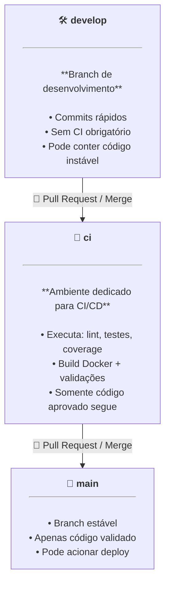

[](https://github.com/rodrigols89/ragproject/actions/workflows/lint.yml)
[](https://github.com/rodrigols89/ragproject/actions/workflows/test.yml)
[](https://github.com/rodrigols89/ragproject/actions/workflows/docker.yml)
[](https://codecov.io/github/rodrigols89/ragproject)

# RAG Project

 - [**git workflow**](#git-workflow)
 - **Project Structure:**
   - [`.github/workflows/`](#github-workflows)
     - [`docker.yml`](#github-workflows-docker-yml)
     - [`lint.yml`](#github-workflows-lint-yml)
     - [`test.yml`](#github-workflows-test-yml)
   - [`core/`](#core-project)
     - [`__init__.py`](#core-init-py)
     - [`asgi.py`](#core-asgi-py)
     - [`settings.py`](#core-settings-py)
       - [`TEMPLATES = []`](#settings-templates)
       - [`DATABASES = {}`](#settings-database)
       - [`/static/, /staticfiles & /media`](#settings-static-staticfiles-media)
     - [`urls.py`](#core-urls-py)
     - [`wsgi.py`](#core-wsgi-py)
   - [`nginx/`](#nginx-folder)
     - [`nginx.conf`](#nginx-conf)
   - [`tests/`](#global-tests)
     - [`__init__.py`](#tests-init-py)
     - [`test_manage.py`](#test-manage-py)
   - [`.editorconfig`](#editorconfig)
   - [`.env`](#env)
   - [`.pre-commit-config.yaml`](#pre-commit-config-yaml)
   - [`docker-compose.yml`](#docker-compose)
   - [`Dockerfile`](#dockerfile)
   - [`pyproject.toml`](#pyproject-toml)
     - [`[tool.ruff]`](#tool-ruff)
     - [`[tool.pytest.ini_options]`](#tool-pytest-ini-options)
     - [`[tool.taskipy.tasks]`](#tool-taskipy-tasks)
<!---
[WHITESPACE RULES]
- Same topic = "10" Whitespace character.
- Different topic = "50" Whitespace character.
--->


<!--- ( git Workflow ) --->

---

<div id="git-workflow"></div>

## git workflow

Esse projeto segue o seguinte workflow (fluxo de trabalho):



### `develop — Desenvolvimento Ativo`

> **A branch develop é utilizada para o trabalho diário.**

Aqui os commits são rápidos e frequentes, sem necessidade de executar pipelines de CI/CD.
Ela pode conter código instável, protótipos ou modificações ainda em validação.

Principais características:

 - Alterações livres para acelerar o desenvolvimento;
 - Não executa *CI/CD* automaticamente (evita lentidão);
 - Serve como base para evolução contínua do projeto.

### `ci-cd — Validação e Qualidade (CI/CD obrigatório)`

> **Todo código destinado a entrar na main deve passar pela branch ci-cd.**

Ela funciona como uma *“camada de proteção”*, garantindo que apenas commits totalmente validados avancem.

Nesta branch o GitHub Actions executa:

 - verificação de lint;
 - testes automatizados;
 - análise de cobertura;
 - build e validação de Docker;
 - inspeções de segurança (opcional);
 - validação de ambiente completo via docker-compose.

Somente se todos os jobs passarem com sucesso, o código pode seguir para main.

### `main — Estável / Produção`

> **A branch main contém sempre o estado atual estável e validado do projeto.**

Boas práticas:

 - Não permite push direto (apenas via Pull Request vindo da ci);
 - Pode acionar workflows de build final e deploy;
 - Deve permanecer íntegra e confiável.

### `🎯 Vantagens desse fluxo`

 - **Velocidade:**
   - Desenvolvimento fluido na `develop`, sem executar CI a cada mudança.
 - **Segurança:**
   - Nada chega na `main` sem passar por todos os testes.
 - **Qualidade:**
   - Bugs são detectados antes de afetar a branch estável.
 - **Manutenabilidade:**
   - Branches com papéis bem definidos facilitam colaboração e revisão de código.
 - **Escalabilidade:**
   - Estrutura compatível com projetos profissionais e pipelines complexos.


<!--- ( .github/workflows ) --->

---

<div id="github-workflows"></div>

## `.github/workflows`

O diretório [.github/workflows](.github/workflows) é uma pasta especial que fica dentro do seu repositório no GitHub.

> 👉 É onde você define os fluxos de automação que o GitHub deve executar automaticamente — chamados de workflows.

Esses workflows são escritos em `YAML (.yml)`, e dizem ao GitHub:

 - Quando executar algo (gatilhos/triggers como push, pull request, etc.);
 - Em qual ambiente executar (como Ubuntu, Windows, etc.);
 - O que deve ser executado (os comandos, scripts ou jobs).

Por exemplo:

```bash
your-repo/
│
├── .github/
│   └── workflows/
│       ├── ci.yml
│       └── deploy.yml
```

Cada arquivo `.yml` dentro de [.github/workflows](.github/workflows) representa um workflow independente.

Por exemplo:

 - `ci.yml` → Faz testes automáticos e checa o código (CI = Continuous Integration);
 - `deploy.yml` → Envia o código para o servidor (CD = Continuous Deployment).

#### `O que é um “workflow” no GitHub Actions?`

Um *workflow* é composto de:

 - **Trigger (gatilho)** → Quando ele deve rodar;
 - **Jobs (tarefas)** → O que ele faz (como rodar testes, buildar imagem, etc.);
 - **Steps (passos)** → Os comandos de cada tarefa

#### `Cobrindo os testes com codecov.io`

 - **Acesse: https://app.codecov.io/gh**
   - Selecione seu repositório.
 - **"Select a setup option"**:
   - Selecione -> Using GitHub Actions
 - **"Step 1: Output a Coverage report file in your CI"**
   - Selecione -> Pytest
   - ...
 - **Step 3: add token as repository secret**
   - Copie -> CODECOV_TOKEN
   - Copie -> SUA-CHAVE-SECRETA
   - **NOTE:** Você vai utilizar eles no workflow `.github/workflows/ci.yml` (ex: [env](#env)).

Ótimo, agora você já tem a chave secreta para o Codecov, vá em:

 - Seu projeto/settings;
 - secrets and variables:
   - Actions.

Continuando, agora você vai clicar em `New repository secret` e adicionar:

 - Name: `CODECOV_TOKEN`
 - Secret: `YOUR-CODECOV-TOKEN`
 - Finalmente, clicar em "Add Secret".

Por fim, vamos adicionar os badges do **Codecov** e do **Pipeline**:

 - Para obter um *Pipeline badge*, altere o link abaixo para o repositório/CI-CD do seu projeto:
   - `[](https://github.com/rodrigols89/ragproject/actions/workflows/ci.yml)`
 - Para obter um *Codecov badge*:
   - Acesse [https://app.codecov.io/gh/](https://app.codecov.io/gh/)
   - Selecione o projeto que está sendo monitorado pela cobertura de testes.
   - Vá em **Settings > Badges & Graphs > Markdown** e copie o badge gerado:


---

<div id="github-workflows-docker-yml"></div>

## `docker.yml`

> Esse workflow valida o Dockerfile, valida o docker-compose, sobe todo o ambiente Docker e testa se o servidor responde corretamente.

[docker.yml](.github/workflows/docker.yml)
```yaml
name: Docker

on:
  push:
    branches: [ ci-cd ]
  pull_request:
    branches: [ ci-cd ]

jobs:
  docker-ci:
    runs-on: ubuntu-latest

    steps:
      # 1) Checkout do repositório
      - name: Checkout repository
        uses: actions/checkout@v3

      # 2) Criar um .env temporário para o CI
      - name: Create .env for CI
        run: |
          cat <<EOF > .env
          POSTGRES_DB=easy_rag_db
          POSTGRES_USER=easyrag
          POSTGRES_PASSWORD=easyragpass
          POSTGRES_HOST=db
          POSTGRES_PORT=5432

          REDIS_HOST=redis
          REDIS_PORT=6379

          DJANGO_SECRET_KEY=testkey
          DJANGO_DEBUG=False
          DJANGO_ALLOWED_HOSTS=*
          
          UVICORN_HOST=0.0.0.0
          UVICORN_PORT=8000
          EOF

      # 3) Validar Dockerfile
      - name: Validate Dockerfile
        run: docker build -t test-app -f Dockerfile .

      # 4) Validar docker-compose
      - name: Validate docker-compose
        run: docker compose config

      # 5) Subir ambiente inteiro
      - name: Start stack
        run: docker compose up -d --build

      # 6) Aguardar o servidor subir
      - name: Wait for server
        run: |
          for i in {1..30}; do
            STATUS=$(curl -o /dev/null -s -w "%{http_code}" http://localhost)
            if [ "$STATUS" -eq 200 ]; then
              echo "Server is up!"
              exit 0
            fi
            echo "Waiting for server (try $i)..."
            sleep 5
          done
          echo "Server did not start in time."
          exit 1

      # 7) Ver logs (aparece só se falhar)
      - name: Logs
        if: always()
        run: docker compose logs --no-color

      # 8) Derrubar stack
      - name: Shutdown stack
        run: docker compose down -v
```

Agora, vamos explicar algumas partes do código acima (só o necessário, sem repetir o que já foi explicado em outras partes do README):

 - `name: Create .env for CI`
   - `cat <<EOF > .env  ...  EOF`
     - Cria um arquivo `.env` temporário para o CI;
     - O GitHub Actions não possui seu .env local;
     - docker-compose precisa dessas variáveis para subir o ambiente.
 - `name: Validate Dockerfile`
 - `run: docker build -t test-app -f Dockerfile .`
   - Testa se o Dockerfile constrói sem erros;
   - Garante que a imagem da aplicação está válida.
 - `name: Validate docker-compose`
 - `run: docker compose config`
   - Apenas valida a sintaxe e merge final do docker-compose;
   - Se houver erro estrutural → o CI falha aqui.
 - `name: Start stack`
 - `run: docker compose up -d --build`
   - Sobe todos os containers (web, db, redis, nginx, etc);
   - `--build` força a recriação das imagens necessárias.
 - `name: Wait for server`
   - Esse bloco espera pelo servidor Django/Uvicorn subir:
 - `name: Logs`
 - `if: always()`
 - `run: docker compose logs --no-color`
   - Mostra logs mesmo se o workflow falhar;
   - Ajuda muito no debug.
 - `name: Shutdown stack`
 - `run: docker compose down -v`
   - Derruba todos os containers e remove volumes criados pelo CI;
   - Mantém o runner limpo para a próxima execução.


---

<div id="github-workflows-lint-yml"></div>

## `lint.yml`

> Esse *workflow* faz a *verificação* de *lint* no código.

[lint.yml](.github/workflows/lint.yml)
```yaml
name: Lint

on:
  push:
    branches: [ ci-cd ]
    paths:
      - "**/*.py"
      - "requirements*.txt"
      - "pyproject.toml"
  pull_request:
    branches: [ ci-cd ]
    paths:
      - "**/*.py"
      - "requirements*.txt"
      - "pyproject.toml"

jobs:
  lint-ci:
    runs-on: ubuntu-latest
    steps:
      - name: Checkout
        uses: actions/checkout@v4

      - name: Set up Python
        uses: actions/setup-python@v4
        with:
          python-version: "3.12"

      - name: Install dependencies for lint
        run: |
          python -m venv .venv
          source .venv/bin/activate
          python -m pip install --upgrade pip
          pip install ruff
          if [ -f requirements.txt ]; then pip install -r requirements.txt; fi

      - name: Run Ruff (lint)
        run: |
          source .venv/bin/activate
          ruff check .
```

Agora, vamos explicar algumas partes do código acima (só o necessário, sem repetir o que já foi explicado em outras partes do README):

 - `name: Lint`
   - Nome visível do workflow no GitHub Actions.
 - `on:`
   - Você pode pensar no comando `on`, como: "Toda vez que o repositório receber o comando *x ("push" e "pull_request" no nosso caso)*.
   - `push:`
     - Gatilho (trigger) do workflow.
     - `branches: [ ci-cd  ]`
       - Branches que executarão as tarefas, no nosso caso, é *"ci-cd "*;
       - ci-cd já garante a qualidade do código;
       - *"main"* normalmente só recebe merges já validados.
     - `paths:`
       - Só executa quando houver mudanças em `arquivos Python`, `requirements*.txt`, `pyproject.toml`.
   - `pull_request:`
     - Gatilho (trigger) do workflow.
     - `branches: [ ci-cd  ]`
       - Branches que executarão as tarefas, no nosso caso, é *"ci-cd "*;
       - ci-cd já garante a qualidade do código;
       - *"main"* normalmente só recebe merges já validados.
     - `paths:`
       - Só executa quando houver mudanças em `arquivos Python`, `requirements*.txt`, `pyproject.toml`.
 - `jobs:`
   - Um workflow pode ter vários **"jobs"** (testar, build, deploy, lint, etc.).
   - Mas, nesse nosso exemplo só vamos ter o *"lint"*.
   - `lint-ci`
     - É o nome da tarefa (job).
     - `runs-on: ubuntu-latest`
       - A *runner (SO)* que vai rodar essa tarefa.
     - `steps`
       - Uma lista de passos que vão ser executados na runner.
       - `name: Checkout`
       - `uses: actions/checkout@v4`
         - Diz ao GitHub que queremos usar a Action oficial para clonar o repositório.
       - `name: Set up Python`
       - `uses: actions/setup-python@v4`
         - Action oficial que instala Python.
         - `with:`
           - `python-version: "3.12"`
       - `name: Install dependencies for lint`
       - `run: |`
         - Vai executar comandos de shell, e o `|` permite escrever múltiplas linhas de comandos.
         - `python -m venv .venv`
           - Cria um ambiente virtual.
         - `source .venv/bin/activate`
           - Ativa o ambiente virtual.
         - `python -m pip install --upgrade pip`
           - Atualiza o pip.
         - `pip install ruff pytest pytest-cov`
           - Instala ferramentas utilizadas no CI.
         - `if [ -f requirements.txt ]; then pip install -r requirements.txt; fi`
           - Instala dependências do seu projeto somente se o arquivo existir.
       - `name: Run Ruff (lint)`
         - `run: |`
           - Vai executar comandos de shell, e o `|` permite escrever múltiplas linhas de comandos.
           - `source .venv/bin/activate`
             - Ativa o venv.
           - `ruff check .`
             - Roda o Ruff em todo o repositório.

> **O comando `name:` pode ser qualquer texto.**  
> Ele serve apenas como identificador visual no *GitHub Actions*, para você conseguir ler no painel.


---

<div id="github-workflows-test-yml"></div>

## `test.yml`

> Esse *workflow* faz a *verificação* de *teste* no código.

[test.yml](.github/workflows/test.yml)
```yaml
name: Test

on:
  push:
    branches: [ ci-cd ]
    paths:
      - "**/*.py"
      - "requirements*.txt"
      - "pyproject.toml"
  pull_request:
    branches: [ ci-cd ]
    paths:
      - "**/*.py"
      - "requirements*.txt"
      - "pyproject.toml"

jobs:
  test-ci:
    runs-on: ubuntu-latest

    steps:
      - name: Checkout
        uses: actions/checkout@v4

      - name: Set up Python
        uses: actions/setup-python@v4
        with:
          python-version: "3.12"

      - name: Install dependencies for tests
        run: |
          python -m venv .venv
          source .venv/bin/activate
          python -m pip install --upgrade pip
          pip install pytest pytest-cov
          if [ -f requirements.txt ]; then pip install -r requirements.txt; fi

      - name: Run tests + coverage
        run: |
          source .venv/bin/activate
          pytest --cov=. --cov-report=xml

      - name: Upload coverage to Codecov
        uses: codecov/codecov-action@v4
        with:
          token: ${{ secrets.CODECOV_TOKEN }}
          fail_ci_if_error: true
          verbose: true
```

Agora, vamos explicar algumas partes do código acima (só o necessário, sem repetir o que já foi explicado em outras partes do README):

 - `name: Upload coverage to Codecov`
 - `uses: codecov/codecov-action@v4`
   - Usa a Action oficial do Codecov.
   - `with:`
     - `token: ${{ secrets.CODECOV_TOKEN }}`
       - Token armazenado nos *“Secrets”* do repositório.
     - `fail_ci_if_error: true`
       - Se o upload falhar -> o job falha.
     - `verbose: true`
       - Mostra logs detalhados.


<!--- ( core/ ) --->

---

<div id="core-project"></div>

## `core/`

> A pasta `core` é o *“cérebro”* do projeto.

A pasta/diretório `core` é considerada o projeto Django em si — ou seja, a parte que controla:

 - Configurações globais;
 - URLs principais;
 - Startup do servidor;
 - ASGI/WSGI (para servidores web);
 - Apps registrados;
 - Middlewares;
 - Templates globais;
 - Linguagem, Timezone;
 - Banco de Dados.
 - etc.


---

<div id="core-init-py"></div>

## `__init__.py`

> **✔ O que é?**
> Define que a pasta é um módulo Python.

Por exemplo, permite fazer:

```python
from core import settings
```

ou

```python
from core.settings import INSTALLED_APPS
```


---

<div id="core-asgi-py"></div>

## `asgi.py`

> **✔ O que é?**  
> É o equivalente ao `wsgi.py`, só que para **ASGI (servidores async)**.

 - Daphne;
 - Uvicorn;
 - Hypercorn.

Se você usa:

 - WebSockets;
 - GraphQL subscriptions;
 - Django Channels;
 - Server-Sent Events;
 - streaming async.

> **✔ Django moderno usa ASGI**

Se você usa `Uvicorn + Nginx` (como no seu Docker), ele inicia o Django assim:

```bash
uvicorn core.asgi:application
```


---

<div id="core-settings-py"></div>

## `settings.py`

> **✔ O arquivo mais importante do projeto.**

Ele contém todas as *configurações globais* do projeto, como:

 - Banco de dados;
 - Apps instalados;
 - Middlewares;
 - Templates;
 - Arquivos estáticos;
 - Configuração de e-mail;
 - Linguagem;
 - Timezone;
 - Segurança.

<div id="settings-templates"></div>

#### `TEMPLATES = []`

> O dicionário `TEMPLATES = []` diz ao Django onde ele deve procurar os templates.

[core/settings.py](core/settings.py)
```python
TEMPLATES = [
    {
        'BACKEND': 'django.template.backends.django.DjangoTemplates',
        'DIRS': [BASE_DIR / 'templates'],
        'APP_DIRS': True,
        'OPTIONS': {
            'context_processors': [
                'django.template.context_processors.request',
                'django.contrib.auth.context_processors.auth',
                'django.contrib.messages.context_processors.messages',
            ],
        },
    },
]
```

<div id="settings-database"></div>

#### `DATABASES = {}`

Antes de começar a configurar o Django para reconhecer o PostgreSQL como Banco de Dados, vamos fazer ele reconhecer as variáveis de ambiente dentro de [core/settings.py](core/settings.py).

Primeiro, vamos instalar o `python-dotenv`:

```bash
poetry add python-dotenv@latest
```

**Outra biblioteca importante que vamos instalar agora é a "psycopg2-binary", que vai servir como driver para o PostgreSQL:**
```bash
poetry add psycopg2-binary@latest
```

Agora, vamos iniciar uma instância de `python-dotenv`:

[core/settings.py](core/settings.py)
```python
import os

from pathlib import Path
from dotenv import load_dotenv

load_dotenv()
```

> **Como testar que está funcionando?**

Primeiro, imagine que nós temos as seguinte variáveis de ambiente:

[.env](.env)
```bash
# ==========================
# CONFIGURAÇÃO DO POSTGRES
# ==========================
POSTGRES_DB=easy_rag_db                     # Nome do banco de dados a ser criado
POSTGRES_USER=easyrag                       # Usuário do banco
POSTGRES_PASSWORD=easyragpass               # Senha do banco
POSTGRES_HOST=db                            # Nome do serviço (container) do banco no docker-compose
POSTGRES_PORT=5432                          # Porta padrão do PostgreSQL
```

Agora vamos abrir um **shell interativo do Django**, ou seja, um terminal Python (REPL) com o Django já carregado, permitindo testar código com acesso total ao projeto.

É parecido com abrir um python normal, mas com estas diferenças:

| Recurso                           | Python normal | `manage.py shell` |
| --------------------------------- | ------------- | ----------------- |
| Carrega o Django automaticamente  | ❌ Não       | ✅ Sim            |
| Consegue acessar `settings.py`    | ❌           | ✅                |
| Consegue acessar models           | ❌           | ✅                |
| Consegue consultar banco de dados | ❌           | ✅                |
| Lê o `.env` (se Django carregar)  | ❌           | ✅                |
| Útil para debugar                 | Razoável      | Excelente         |

```bash
python manage.py shell
```

**OUTPUT:**
```bash
6 objects imported automatically (use -v 2 for details).
Python 3.12.3 (main, Aug 14 2025, 17:47:21) [GCC 13.3.0] on linux
Type "help", "copyright", "credits" or "license" for more information.
(InteractiveConsole)
```

**INPUT:**
```python
import os
```

**INPUT:**
```bash
print(os.getenv("POSTGRES_HOST"))
```

**OUTPUT:**
```bash
db
```

**INPUT:**
```bash
print(os.getenv("POSTGRES_PASSWORD"))
```

**OUTPUT:**
```bash
easyragpass
```

> **NOTE:**  
> Vejam que realmente nós estamos conseguindo acessar as variáveis de ambiente.

Continuando, agora vamos dizer ao Django qual Banco de Dados vamos utilizar.

Por exemplo:

[core/settings.py](core/settings.py)
```python
DATABASES = {
    "default": {
        "ENGINE": "django.db.backends.postgresql",
        "NAME": os.getenv("POSTGRES_DB"),
        "USER": os.getenv("POSTGRES_USER"),
        "PASSWORD": os.getenv("POSTGRES_PASSWORD"),
        "HOST": os.getenv("POSTGRES_HOST", "localhost"),
        "PORT": os.getenv("POSTGRES_PORT", 5432),
    }
}
```

No exemplo acima nós temos um dicionário que informa ao Django como conectar ao banco de dados:

 - `ENGINE`
   - Qual backend/driver o Django usa — aqui, PostgreSQL.
 - `NAME`
   - Nome do banco.
 - `USER`
   - Usuário do banco.
 - `PASSWORD`
   - Senha do usuário.
 - `HOST`
   - Host/hostname do servidor de banco.
 - `PORT`
   - Porta TCP onde o Postgres escuta.

#### `O que os.getenv('VAR', 'default') faz, exatamente?`

`os.getenv` vem do módulo padrão `os` e faz o seguinte:

 - Tenta ler a variável de ambiente chamada 'VAR' (por exemplo POSTGRES_DB);
 - Se existir, retorna o valor da variável de ambiente;
 - Se não existir, retorna o valor padrão passado como segundo argumento ('default').

#### `Por que às vezes PASSAMOS um valor padrão (default) no código?`

 - *Conforto no desenvolvimento local:* evita quebrar o projeto se você esquecer de definir `.env`.
 - *Documentação inline:* dá uma ideia do nome esperado (easy_rag, 5432, etc.).
 - *Teste rápido:* você pode rodar `manage.py` localmente sem carregar variáveis.

> **NOTE:**  
> Mas atenção: os valores padrões não devem conter segredos reais (ex.: supersecret) no repositório público — isso é um risco de segurança.

#### `Por que não você não deveria colocar senhas no código?`

 - Repositórios (Git) podem vazar ou ser lidos por terceiros.
 - Código pode acabar em backups, imagens Docker, etc.
 - Difícil rotacionar/chavear senhas se espalhadas pelo repositório.

> **Regra prática:**  
> - *"NUNCA"* colocar credenciais reais em `settings.py`.
> - Use `.env` (não comitado) ou um *"secret manager"*.

<div id="settings-static-staticfiles-media"></div>

#### `/static/, /staticfiles & /media`

[core/settings.py](core/settings.py)
```python
STATIC_URL = '/static/'
STATICFILES_DIRS = [BASE_DIR / 'static']
STATIC_ROOT = BASE_DIR / 'staticfiles'

MEDIA_URL = '/media/'
MEDIA_ROOT = BASE_DIR / 'media'
```


---

<div id="core-urls-py"></div>

## `urls.py`

> **✔ É o “roteador” principal do Django.**

Ele define por onde cada requisição deve passar, distribuindo para os URLs de cada app.

[`urls.py`](core/urls.py)
```python
from django.contrib import admin
from django.urls import include, path

urlpatterns = [
    path("admin/", admin.site.urls),
    path("accounts/", include("allauth.urls")),
    path("", include("users.urls")),
    path("", include("workspace.urls")),
]
```


---

<div id="core-wsgi-py"></div>

## `wsgi.py`

> ✔ É o ponto de entrada para servidores *web WSGI*.

Como:

 - Gunicorn;
 - uWSGI;
 - mod_wsgi (Apache);

Ou seja, quando você faz deploy tradicional, o servidor web chama o arquivo:

```bash
core/wsgi.py
```


<!--- ( nginx/ ) --->

---

<div id="nginxfolder"></div>

## `nginx/`

> A pasta `nginx/` geralmente existe em projetos que precisam de um **Servidor NGINX** para:

 - Servir páginas estáticas (HTML, CSS, JS);
 - Roteamento de frontend (React, Vue, Angular);
 - Fazer reverse proxy para APIs (ex.: /api → backend);
 - Gerenciar SSL/HTTPS;
 - Fazer cache, compressão, headers de segurança;
 - Balancear tráfego (em setups maiores).

Por exemplo:

```bash
nginx/
 ├── nginx.conf      ← configuração principal
 ├── default.conf    ← configuração do server (separada, opcional)
 ├── ssl/            ← certificados HTTPS (em produção)
 └── conf.d/         ← configurações extras
```


---

<div id="nginx-conf"></div>

## `nginx.conf`

> Esse arquivo é **a configuração principal do servidor Nginx** da sua aplicação.

[nginx.conf](nginx/nginx.conf)
```conf
server {
    listen 80;
    server_name _;

    # 🔓 Permitir uploads (dados enviados pelo usuário) de qualquer tamanho.
    # > O Django quem vai validar isso.
    client_max_body_size 0;

    # Servir arquivos estáticos diretamente
    location /static/ {
        alias /code/staticfiles/;
        expires 30d;
        access_log off;
        autoindex on;
    }

    # Servir arquivos de mídia
    location /media/ {
        alias /code/media/;
        expires 30d;
        access_log off;
        autoindex on;
    }

    # Repassar o resto das requisições para o Django (Uvicorn)
    location / {
        proxy_pass http://web:8000;
        proxy_set_header Host $host;
        proxy_set_header X-Real-IP $remote_addr;
        proxy_set_header X-Forwarded-For $proxy_add_x_forwarded_for;
        proxy_set_header X-Forwarded-Proto $scheme;
    }
}
```

 - `server { ... }`
   - Representa um servidor virtual — ou seja, as regras de como o NGINX deve se comportar quando recebe requisições em um domínio ou porta específica.
 - `listen 80;`
   - Define qual porta o servidor ouvirá: *80 (HTTP padrão)*.
 - `server_name _;`
   - Define para quais domínios esse servidor responde.
   - O `_` é um coringa, indicando *“qualquer nome de servidor”*.
   - É muito usado para servidores default.
 - `client_max_body_size 0;`
   - Define o tamanho máximo permitido para uploads.
   - 0 = Ilimitado.
   - Importante quando você trabalha com upload de arquivos grandes (PDF, imagens, vídeos, etc.).
 - `location /static/ { ... }`
   - O bloco **location** define como o *NGINX* deve responder a um caminho específico do site.
   - No caso de **/static/**, ele serve arquivos estáticos gerados pelo Django: CSS. JS, Images, etc.
   - `alias /code/staticfiles/;`
     - alias mapeia diretamente a pasta no sistema.
     - Ou seja: **/static/style.css** → **/code/staticfiles/style.css**
   - `expires 30d;`
     - Diz ao navegador que pode guardar esses arquivos em cache por 30 dias.
   - `access_log off;`
     - Desativa logs de acesso para estes arquivos — reduz ruído no log.
   - `autoindex on;`
     - Permite listar arquivos se acessar **/static/** diretamente.
     - **NOTE:** Não recomendado em produção, mas útil em Dev ou Docker.
 - `location /media/ { ... }`
   - Semelhante ao bloco **/static/**, mas agora para arquivos gerados pelo usuário: **/media/**.
   - `alias /code/media/;`
     - Mapeia a pasta real.
     - Ou seja: **/media/avatar.jpg** → **/code/media/avatar.jpg**.
 - `location / { ... }`
   - Qualquer URL que não seja **/static/** nem **/media/**.
   - Este bloco é o **catch-all (pega tudo)**.
   - Se nenhuma outra regra combinar, ele assume.
   - **Qual objetivo?**
     - 👉 Encaminhar a requisição para o servidor Django + Uvicorn;
     - Esse processo é chamado de `reverse proxy`.
   - `proxy_pass http://web:8000;`
     - Encaminha o tráfego para o container do Django:
       - hostname Docker: web
       - porta: 8000
       - É como se NGINX acessasse: `http://web:8000/<sua-url>`
   - `proxy_set_header Host $host;`
     - Envia o host original (example.com, localhost, etc).
     - Django usa isso para construir URLs corretamente.
   - `proxy_set_header X-Real-IP $remote_addr;`
     - Envia o IP real do cliente.
     - Sem isso, o Django veria só o IP do NGINX.
   - `proxy_set_header X-Forwarded-For $proxy_add_x_forwarded_for;`
     - Preserva a cadeia de proxies → importante para logs e segurança.
   - `proxy_set_header X-Forwarded-Proto $scheme;`
     - Informa se foi HTTP ou HTTPS.
     - **NOTE:** Se não repassar, o Django pode achar que o site é HTTP mesmo quando está usando HTTPS.


<!--- ( tests/ ) --->

---

<div id="global-tests"></div>

## `tests/`

> A pasta `tests/` na raiz do projeto utilizada para testes gerais.

#### ✅ Quando faz sentido ter uma pasta tests/ na raiz?

A pasta `raiz/tests/` é útil quando você precisa testar coisas que não pertencem a nenhum app específico, como:

 - **🔧 1. Testes de Settings:**
   - Testar se variáveis de ambiente foram carregadas.
   - Testar se configurações obrigatórias existem.
   - Validar se `DEBUG`, `ALLOWED_HOSTS`, `DATABASES` foram definidos corretamente.
 - **🗺 2. Testes de URLs globais:**
   - Verificar se cada rota resolve para a view correta.
   - Testar middlewares globais.
   - Testar permissões gerais.
 - **📦 3. Testes de Integração:**
   - Algo que envolve múltiplos apps ao mesmo tempo.
   - Testes de APIs que atravessam vários domínios.
 - **🚀 4. Testes de inicialização do projeto:**
   - Testar se o Django sobe sem erros.
   - Testar se sinalizadores (signals) globais foram registrados.
 - **🔐 5. Testes de segurança global:**
   - CORS.
   - CSRF.
   - Rate-limiting.
   - Configurações gerais de autenticação.


---

<div id="tests-init-py"></div>

## `__init__.py`

> O arquivo [`tests/__init__.py`](tests/__init__.py) (mesmo que sem nada dentro) faz com que a pasta `/tests` seja reconhecida como um módulo.


---

<div id="test-manage-py"></div>

> `test_manage.py`

> **Este arquivo contém testes unitários para o módulo [manage.py](manage.py) do Django.**

Ele verifica se o script de gerenciamento do Django está configurado corretamente, testando:

 - Se a variável de ambiente `DJANGO_SETTINGS_MODULE` é definida corretamente;
 - Se o comando do Django é executado apenas uma vez;
 - Se erros de importação são tratados adequadamente;
 - Se os argumentos da linha de comando são passados corretamente.

[tests/test_manage.py](tests/test_manage.py)
```python
import os
from unittest.mock import patch

import pytest

from manage import main

EXPECTED_CALLS = 1


def test_manage_sets_django_settings_module():
    # Limpa variável de ambiente antes do teste
    os.environ.pop("DJANGO_SETTINGS_MODULE", None)

    # Mocka o comando do Django
    with patch("manage.execute_from_command_line") as mocked_exec:
        main()

    assert os.environ["DJANGO_SETTINGS_MODULE"] == "core.settings"
    assert mocked_exec.called


def test_manage_calls_execute_from_command_line_once():
    with patch("manage.execute_from_command_line") as mocked_exec:
        main()

    assert mocked_exec.call_count == EXPECTED_CALLS


def test_manage_importerror_triggers_custom_message():
    def fake_command(_):
        raise ImportError("fake import error")

    # Força a entrada no bloco except
    with patch("manage.execute_from_command_line", side_effect=fake_command):
        with pytest.raises(ImportError) as exc:
            main()

    assert "Couldn't import Django" in str(exc.value)


def test_manage_main_calls_django_execute():
    with patch("sys.argv", ["manage.py", "help"]):
        with patch("manage.execute_from_command_line") as mocked_execute:
            main()
            mocked_execute.assert_called_once_with(["manage.py", "help"])
```

Agora, vamos explicar algumas partes do código acima (só o necessário, sem repetir o que já foi explicado em outras partes do README):

 - `import os`
   - Importa o módulo os para manipular variáveis de ambiente durante os testes.
 - `from unittest.mock import patch`
   - Importa `patch` do módulo `unittest.mock`, que permite substituir temporariamente objetos (funções, métodos) por versões *"mockadas"* durante os testes.
 - `import pytest`
   - Importa o framework de testes *pytest*, usado para executar os testes e fornecer funcionalidades como `pytest.raises`.
 - `from manage import main`
   - Importa a função `main` do módulo `manage.py`, que é a função principal sendo testada.
 - `EXPECTED_CALLS = 1`
   - Define uma constante global com o número esperado de chamadas à função `execute_from_command_line` (usada nos testes).

### `test_manage_sets_django_settings_module()`

Esta função testa se o [manage.py](manage.py) define corretamente a variável de ambiente `DJANGO_SETTINGS_MODULE` com o valor `"core.settings"` e se o comando do Django é executado.

[test_manage_sets_django_settings_module()](tests/test_manage.py)
```python
def test_manage_sets_django_settings_module():
    # Limpa variável de ambiente antes do teste
    os.environ.pop("DJANGO_SETTINGS_MODULE", None)

    # Mocka o comando do Django
    with patch("manage.execute_from_command_line") as mocked_exec:
        main()

    assert os.environ["DJANGO_SETTINGS_MODULE"] == "core.settings"
    assert mocked_exec.called
```

 - `os.environ.pop("DJANGO_SETTINGS_MODULE", None)`
   - Remove a variável de ambiente `DJANGO_SETTINGS_MODULE (.pop, ou seja, tira da pilha)` se ela existir, garantindo um estado limpo para o teste.
   - O segundo argumento **None** evita erro caso a variável não exista.
 - `with patch("manage.execute_from_command_line") as mocked_exec:`
   - Usa `patch` como gerenciador de contexto para substituir temporariamente `execute_from_command_line` do módulo [manage.py](manage.py) por um *mock* chamado `mocked_exec`.
     - `main()`
       - Chama a função `main()` do [manage.py](manage.py) dentro do contexto do *mock*.
 - `assert os.environ["DJANGO_SETTINGS_MODULE"] == "core.settings"`
   - Verifica se a variável de ambiente foi definida corretamente com o valor *"core.settings"*.
 - `assert mocked_exec.called`
   - Verifica se o mock mocked_exec foi chamado pelo menos uma vez.

### `test_manage_calls_execute_from_command_line_once()`

Esta função testa se o manage.py chama a função execute_from_command_line exatamente uma vez.

[test_manage_calls_execute_from_command_line_once()](tests/test_manage.py)
```python
def test_manage_calls_execute_from_command_line_once():
    with patch("manage.execute_from_command_line") as mocked_exec:
        main()
    assert mocked_exec.call_count == EXPECTED_CALLS
```

 - `with patch("manage.execute_from_command_line") as mocked_exec:`
   - Substitui `execute_from_command_line` por um *mock*.
   - `main()`
     - Executa a função principal do [manage.py](manage.py).
 - `assert mocked_exec.call_count == EXPECTED_CALLS`
   - Verifica se o mock foi chamado exatamente `EXPECTED_CALLS (1)` vez.

### `test_manage_importerror_triggers_custom_message()`

Esta função testa se o bloco except *ImportError* do [manage.py](manage.py) é executado corretamente e se a mensagem de erro apropriada é lançada quando há um erro de importação.

[test_manage_importerror_triggers_custom_message()](tests/test_manage.py)
```python
def test_manage_importerror_triggers_custom_message():
    def fake_command(_):
        raise ImportError("fake import error")

    with patch("manage.execute_from_command_line", side_effect=fake_command):
        with pytest.raises(ImportError) as exc:
            main()

    assert "Couldn't import Django" in str(exc.value)
```

 - `def fake_command(_):`
   - Define uma função auxiliar que recebe um argumento (ignorado).
   - `raise ImportError("fake import error")`
     - Lança um `ImportError` simulado quando a função é chamada.
 - `with patch("manage.execute_from_command_line", side_effect=fake_command):`
   - Substitui `execute_from_command_line` por um mock que, quando chamado, executa `fake_command`, forçando um `ImportError`.
   - `with pytest.raises(ImportError) as exc:`
     - Cria um gerenciador de contexto que captura a exceção `ImportError` esperada, armazenando-a em `exc`.
     - `main()`
       - Executa a função principal do [manage.py](manage.py).
 - `assert "Couldn't import Django" in str(exc.value)`
   - Verifica se a mensagem de erro capturada contém o texto *"Couldn't import Django"*, confirmando que a mensagem personalizada foi gerada.

### `test_manage_main_calls_django_execute()`

Esta função testa se a função `main()` passa corretamente os argumentos da linha de comando *(sys.argv)* para *execute_from_command_line*.

[test_manage_main_calls_django_execute()](tests/test_manage.py)
```python
def test_manage_main_calls_django_execute():
    with patch("sys.argv", ["manage.py", "help"]):
        with patch("manage.execute_from_command_line") as mocked_execute:
            main()
            mocked_execute.assert_called_once_with(["manage.py", "help"])
```

 - `with patch("sys.argv", ["manage.py", "help"]):`
   - Substitui temporariamente *sys.argv (argumentos da linha de comando)* por `["manage.py", "help"]`.
   - `with patch("manage.execute_from_command_line") as mocked_execute:`
     - Substitui `execute_from_command_line` por um mock chamado `mocked_execute`.
     - `main()`
       - Executa a função *main()*.
 


<!--- ( .editorconfig ) --->

---

<div id="editorconfig"></div>

## `.editorconfig`

O arquivo [.editorconfig](.editorconfig) é usado para **padronizar o estilo de código** entre diferentes editores e IDEs (como VS Code, PyCharm, Sublime, etc.).

Ele garante que, independentemente de quem edite o código e onde, as regras de formatação — como indentação, codificação de caracteres e finais de linha — sejam consistentes em todo o projeto.

[.editorconfig](.editorconfig)
```yaml
root = true

[*]
end_of_line = lf
insert_final_newline = true
charset = utf-8

# 4 space indentation
[*.{py,html, js}]
indent_style = space
indent_size = 4

# 2 space indentation
[*.{json,y{a,}ml,cwl}]
indent_style = space
indent_size = 2
```

 - `root = true`
   - ➡️ Indica que este é o arquivo `.editorconfig` principal.
   - Ou seja, o EditorConfig não deve procurar configurações em diretórios superiores.
   - Se houvesse outro `.editorconfig` acima na hierarquia, ele seria ignorado.

```yaml
[*]
end_of_line = lf
insert_final_newline = true
charset = utf-8
```

 - `[*]`
   - ➡️ Essa seção aplica-se a todos os arquivos (`*` é um curinga que significa “qualquer nome e extensão”).
   - Tudo o que vier abaixo até outra seção será aplicado globalmente.
 - `end_of_line = lf`
   - ➡️ Define o tipo de quebra de linha a ser usado:
     - lf = Line Feed (Unix/Linux/Mac)
     - crlf = Carriage Return + Line Feed (Windows)
   - 👉 Aqui, está sendo forçado o estilo Unix (LF), mesmo que alguém edite no Windows.
 - `insert_final_newline = true`
   - ➡️ Garante que haverá uma linha em branco no final do arquivo.
   - Muitos compiladores e ferramentas de versionamento esperam isso (boas práticas em Unix).
 - `charset = utf-8`
   - ➡️ Define o conjunto de caracteres padrão para todos os arquivos: *UTF-8*, o mais usado atualmente.
   - Isso evita erros de acentuação ou caracteres especiais ao abrir o arquivo em diferentes sistemas.

```yaml
# 4 space indentation
[*.{py,html, js}]
indent_style = space
indent_size = 4
```

 - `[*.{py,html, js}]`
   - ➡️ Aplica estas regras a arquivos com extensões `.py`, `.html` e `.js`.
   - O `{}` indica um grupo de extensões.
 - `indent_style = space`
   - ➡️ Usa espaços em vez de tabs para indentar o código.
 - `indent_size = 4`
   - ➡️ Define que cada nível de indentação terá 4 espaços.

```yaml
# 2 space indentation
[*.{json,y{a,}ml,cwl}]
indent_style = space
indent_size = 2
```

> **NOTE:**  
> Segue a mesma lógico do bloco anterior, porém, para arquivos com extensões `.json`, `.y{a,}ml` e `.cwl` e `indentação de 2 espaços`.


<!--- ( .env ) --->

---

<div id="env"></div>

## `.env`

[.env](.env)
```bash
# ==========================
# CONFIGURAÇÃO DO POSTGRES
# ==========================
POSTGRES_DB=easy_rag_db                     # Nome do banco de dados a ser criado
POSTGRES_USER=easyrag                       # Usuário do banco
POSTGRES_PASSWORD=easyragpass               # Senha do banco
POSTGRES_HOST=db                            # Nome do serviço (container) do banco no docker-compose
POSTGRES_PORT=5432                          # Porta padrão do PostgreSQL

# ==========================
# CONFIGURAÇÃO DO REDIS
# ==========================
REDIS_HOST=redis                            # Nome do serviço (container) do Redis no docker-compose
REDIS_PORT=6379                             # Porta padrão do Redis

# ==========================
# CONFIGURAÇÃO DJANGO
# ==========================
DJANGO_SECRET_KEY=djangopass                # Chave secreta do Django para criptografia e segurança
DJANGO_DEBUG=True                           # True para desenvolvimento; False para produção
DJANGO_ALLOWED_HOSTS=*                      # Hosts permitidos; * libera para qualquer host

# ==========================
# CONFIGURAÇÃO DO UVICORN
# ==========================
UVICORN_HOST=0.0.0.0                        # Escutar em todas as interfaces
UVICORN_PORT=8000                           # Porta interna do app

# ==========================
# CONFIGURAÇÃO DO CELERY
# ==========================

# Celery / Redis
CELERY_BROKER_URL=redis://redis:6379/0      # Onde as tasks vão ser enfileiradas (Redis service redis no compose)
CELERY_RESULT_BACKEND=redis://redis:6379/1  # Onde o resultado das tasks será guardado (usar Redis DB 1 separado é comum)

# Optional - For unit tests
CELERY_TASK_ALWAYS_EAGER=False
CELERY_TASK_EAGER_PROPAGATES=True
```


<!--- ( .pre-commit-config.yaml ) --->

---

<div id="pre-commit-config-yaml"></div>

## `.pre-commit-config.yaml`

> O `pre-commit` é uma ferramenta Python que executa verificações automáticas antes de cada commit no Git.

Para garantir que antes de cada commit seu projeto passe por:

 - ✅ lint (usando Ruff)
 - ✅ test (com pytest)
 - ✅ coverage

```bash
poetry add --group dev pre-commit@latest
```

[.pre-commit-config.yaml](.pre-commit-config.yaml)
```yaml
repos:
  - repo: local
    hooks:
      - id: ruff-lint
        name: ruff check
        entry: task lint
        language: system
        types: [python]
        pass_filenames: false
        exclude: ^(core/settings\.py|documents/migrations|users/adapter.py|workspace/migrations|workspace/urls.py)

      - id: pytest-test
        name: pytest test
        entry: task test
        language: system
        types: [python]
        pass_filenames: false
        exclude: ^(core/settings\.py)

      - id: pytest-coverage
        name: pytest coverage
        entry: task post_test
        language: system
        types: [python]
        pass_filenames: false
        exclude: ^(core/settings\.py)
```

#### `pass_filenames: false`

Antes, de começarmos com as explicações do código acima vamos entender a linha `pass_filenames: false`.

> O `pass_filenames: false` faz com que o pre-commit execute o comando sem passar os arquivos modificados, forçando a execução global do comando — essencial para hooks como pytest.

#### `Quando você deve usar pass_filenames: false?`

 - **✔️ O comando *"não aceita nomes"* de arquivos:**
   - pytest;
   - coverage;
   - task test;
   - scripts customizados
 - **✔️ Você quer rodar a ferramenta no projeto inteiro:**
   - (ex.: lint geral, testes completos)
 - **✔️ O hook não trabalha com arquivos individuais:**
   - (ex.: gerar docs, buildar, rodar migrations)

#### `❌ Quando NÃO usar?`

Quando a ferramenta trabalha melhor recebendo somente arquivos alterados:

 - ❌ ruff por arquivo;
 - ❌ black por arquivo;
 - ❌ isort por arquivo;
 - ❌ prettier por arquivo.
 - **NOTE:** Nesses casos, deixar pass_filenames habilitado (padrão) é o ideal.

```yaml
repos:
  - repo: local
```

 - `repos:`
   - Lista de repositórios que contêm os hooks (ações) que serão executados.
 - `repo: local`
   - Significa que os hooks não vêm de um repositório externo, mas estão definidos localmente no próprio projeto.
 - **➡️ Em outras palavras:**
   - Você está criando hooks personalizados, não baixando-os da internet.

```yaml
- id: ruff-lint
  name: ruff check
  entry: task lint
  language: system
  types: [python]
  exclude: ^(core/settings\.py|documents/migrations|users/adapter.py)
```

| Linha              | Significado                                                                                                                                                                                                            |
| ------------------ | ---------------------------------------------------------------------------------------------------------------------------------------------------------------------------------------------------------------------- |
| `- id: ruff-lint`  | Identificador único do hook (usado internamente pelo pre-commit).                                                                                                                                                      |
| `name: ruff check` | Nome amigável mostrado no terminal durante a execução.                                                                                                                                                                 |
| `entry: task lint` | **Comando que será executado.** Aqui, está chamando `task lint` — ou seja, o comando “lint” definido no arquivo `Taskfile.yml` (usando a ferramenta [Taskfile](https://taskfile.dev/), comum em automação de tarefas). |
| `language: system` | Indica que o comando usa o **sistema operacional** (não precisa de ambiente Python isolado). Ele executa o comando diretamente, como se fosse rodado no terminal.                                                      |
| `types: [python]`  | Define que o hook será aplicado apenas a arquivos **Python** (arquivos `.py`).                                                                                                                                         |

```yaml
- id: pytest-test
  name: pytest test
  entry: task test
  language: system
  types: [python]
```

| Linha               | Significado                                                         |
| ------------------- | ------------------------------------------------------------------- |
| `id: pytest-test`   | ID do hook (interno ao pre-commit).                                 |
| `name: pytest test` | Nome exibido durante a execução.                                    |
| `entry: task test`  | Executa o comando `task test` — novamente, vindo do `Taskfile.yml`. |
| `language: system`  | Roda o comando diretamente no ambiente do sistema.                  |
| `types: [python]`   | Aplica o hook somente a arquivos Python.                            |

```yaml
- id: pytest-coverage
  name: pytest coverage
  entry: task post_test
  language: system
  types: [python]
```

| Linha                   | Significado                                                                    |
| ----------------------- | ------------------------------------------------------------------------------ |
| `id: pytest-coverage`   | ID do hook.                                                                    |
| `name: pytest coverage` | Nome exibido no terminal.                                                      |
| `entry: task post_test` | Executa o comando `task post_test` — outro comando definido no `Taskfile.yml`. |
| `language: system`      | Usa o shell do sistema.                                                        |
| `types: [python]`       | Aplica-se apenas a arquivos Python.                                            |

Agora nós precisamos instalar o pre-commit:

```bash
pre-commit install
```

#### Dica extra: Se quiser rodar manualmente

```bash
pre-commit run --all-files
```

> **NOTE:**  
> É interessante ter uma checagem rápida no Taskipy.

[pyproject.toml](pyproject.toml)
```toml
[tool.taskipy.tasks]
precommit = 'pre-commit run --all-files'
```


<!--- ( docker-compose.yml ) --->

---

<div id="docker-compose"></div>

 - O [docker-compose.yml](docker-compose.yml) é um arquivo usado para **orquestrar múltiplos contêineres Docker** em um único lugar.
 - Ele descreve **serviços**, **volumes**, **redes** e como cada contêiner deve ser iniciado.
 - Permite definir tudo o que um ambiente precisa: *banco de dados*, *backend*, *frontend*, *cache*, etc.

Com ele, você sobe todo o ambiente com um único comando:

```bash
docker-compose up -d
```

[docker-compose.yml](docker-compose.yml)
```yaml
services:
  db:
    image: postgres:15
    container_name: postgresql
    restart: always
    env_file: .env
    environment:
      POSTGRES_PASSWORD: ${POSTGRES_PASSWORD}
      POSTGRES_USER: ${POSTGRES_USER}
      POSTGRES_DB: ${POSTGRES_DB}
    volumes:
      - postgres_data:/var/lib/postgresql/data
    networks:
      - backend

  redis:
    image: redis:7
    container_name: redis_cache
    restart: always
    env_file: .env
    volumes:
      - redis_data:/data
    networks:
      - backend

  web:
    build:
      context: .
      dockerfile: Dockerfile
    container_name: django
    restart: always
    env_file: .env
    command: >
      sh -c "
      until nc -z ${POSTGRES_HOST} ${POSTGRES_PORT}; do echo '⏳ Waiting for Postgres...'; sleep 2; done &&
      python manage.py migrate &&
      python manage.py collectstatic --noinput &&
      uvicorn core.asgi:application --host 0.0.0.0 --port 8000
      "
    volumes:
      - .:/code
      - ./static:/code/staticfiles
      - ./media:/code/media
    depends_on:
      - db
      - redis
    expose:
      - "8000"
    networks:
      - backend

  nginx:
    image: nginx:1.27
    container_name: nginx_reverse_proxy
    restart: always
    ports:
      - "80:80"
    volumes:
      - ./nginx/nginx.conf:/etc/nginx/conf.d/default.conf:ro
      - ./static:/code/staticfiles
      - ./media:/code/media
    depends_on:
      - web
    networks:
      - backend

volumes:
  postgres_data:
  redis_data:

networks:
  backend:
```

Vamos começar explicando os `volumes` e `networks`:

```yaml
volumes:
  postgres_data:
  redis_data:

networks:
  backend:
```

 - **🗂 1. O que são "volumes"?**
   - Volumes são lugares onde o Docker guarda dados de forma persistente.
   - Sem volumes, tudo que está dentro do container é apagado quando ele reinicia, o que seria terrível para um banco de dados, por exemplo: `postgres_data`
 - **🌐 2. O que são "networks"?**
   - Networks são redes internas criadas pelo Docker para que containers se comuniquem.
   - Por exemplo, `networks: backend:` cria uma rede chamada **backend**.
   - E quando você atribui a rede a algum container significa, que:
     - Este container “entra” na rede interna backend;
     - Ele pode conversar com outros containers que também estejam na mesma rede;
     - Ele pode usar o nome do container como hostname.

Agora vamos explicar os serviços separadamente:

#### `db service`

 - `db`
   - Nome do *serviço (container)* criado pelo docker-compose.
   - `image: postgres:15`
     - Pega a versão 15 oficial do PostgreSQL no Docker Hub.
   - `container_name: postgresql`
     - Nome fixo do container (para facilitar comandos como docker logs postgresql).
   - `restart: always`
     - 🔹 O container vai voltar sempre que o Docker daemon subir, independente do motivo da parada.
     - 🔹 Mesmo se você der *docker stop*, quando o host reiniciar o container volta sozinho.
     - 👉 Bom para produção quando você quer *99% de disponibilidade*.
   - `env_file: .env`
     - Carrega variáveis de ambiente do arquivo `.env`.
   - `volumes:`
       - `postgres_data:` → Volume docker (Named Volume).
       - `/var/lib/postgresql/data` → pasta interna do container onde o Postgres armazena os dados.
   - `volumes:`
     - `postgres_data:` → Volume docker (Named Volume).
   - `networks: backend`
     - Coloca o container na rede backend para comunicação interna segura.

#### `redis service`

 - `redis:`
   - Nome do *serviço (container)* criado pelo docker-compose.
   - `image: redis:7`
     - Pega a versão 7 oficial do Redis no Docker Hub.
   - `container_name: redis_cache`
     - Nome fixo do container (para facilitar comandos como docker logs redis_cache).
   - `restart: always`
     - 🔹 O container vai voltar sempre que o Docker daemon subir, independente do motivo da parada.
     - 🔹 Mesmo se você der *docker stop*, quando o host reiniciar o container volta sozinho.
     - 👉 Bom para produção quando você quer *99% de disponibilidade*.
   - `env_file: .env`
     - Carrega variáveis de ambiente do arquivo `.env`.
   - `volumes:`
     - `redis_data:` → Volume docker (Named Volume).
     - `/data` → pasta interna do container onde o Redis armazena os dados.
   - `networks: backend`
     - Só está acessível dentro da rede interna backend (não expõe porta para fora).

#### `web service`

 - `web`
   - Nome do *serviço (container)* criado pelo docker-compose.
   - `build: context + dockerfile.`
     - `context: .`
       - Ponto `(.)` significa que o contexto de build é a raiz do projeto.
       - Isso quer dizer que todos os arquivos dessa pasta estarão disponíveis para o build.
     - `dockerfile: Dockerfile`
       - Nome do arquivo Dockerfile usado para construir a imagem.
   - `container_name: django`
     - Nome fixo do container (para facilitar comandos como docker logs django).
   - `restart: always`
     - 🔹 O container vai voltar sempre que o Docker daemon subir, independente do motivo da parada.
     - 🔹 Mesmo se você der *docker stop*, quando o host reiniciar o container volta sozinho.
     - 👉 Bom para produção quando você quer *99% de disponibilidade*.
   - `env_file: .env`
     - Carrega variáveis de ambiente do arquivo `.env`.
   - `command`
     - `sh -c`
       - Executa um shell POSIX dentro do container e roda tudo o que estiver entre aspas como um único comando.
       - Usar *sh -c* permite encadear vários comandos com &&.
     - `python manage.py migrate &&`
       - Aplica migrações do Django ao banco (cria/atualiza tabelas).
       - O *&&* significa: só execute o próximo comando se este retornar sucesso (exit code 0).
       - **NOTE:** Se a migração falhar, nada depois roda.
     - `python manage.py collectstatic --noinput &&`
       - Coleta os arquivos estáticos de todas as apps para a pasta do *STATIC_ROOT*.
       - *--noinput* evita prompts interativos (obrigatório em automação/containers).
       - **NOTE:** Novamente, *&&* encadeia: só continua se deu tudo certo.
     - `uvicorn core.asgi:application --reload --host ${UVICORN_HOST} --port ${UVICORN_PORT}`
       - Inicia o servidor ASGI com Uvicorn usando a aplicação em core/asgi.py (objeto application).
       - `--reload` → modo desenvolvimento; monitora arquivos e reinicia automaticamente ao salvar (não use em produção).
       - `--host ${UVICORN_HOST}` → endereço de bind dentro do container. Normalmente 0.0.0.0 para aceitar conexões externas.
       - `--port ${UVICORN_PORT}` → porta interna onde o Uvicorn escuta (ex.: 8000).
   - `volumes:`
     - `./:/code`
       - pasta atual `.` → `/code` dentro do container.
     - `./static:/code/staticfiles`
       - `./static` → `/code/staticfiles`
     - `./media:/code/media`
       - `./media` → `/code/media`
     - **NOTE:** Aqui estamos aplicando o coneito de *"Bind Mounts"*.
   - `depends_on:`
     - Dependendo que os containers `db` e `redis` estejam rodando.
   - `ports: "${UVICORN_PORT}:${UVICORN_PORT}"`
     - `expose` - Para apenas informa a porta para outros containers, não mapeia para o host.
     - `port` - Para acessar pelo navegador no seu computador, você precisa de `ports`.
   - `networks: backend`
     - Rede interna para comunicação.

#### `nginx service`

 - `nginx:`
   - Nome do *serviço (container)* criado pelo docker-compose.
   - `image: nginx:1.27`
     - Pega a versão 1.27 oficial do Nginx no Docker Hub.
   - `container_name: nginx_reverse_proxy`
     - Nome fixo do container (para facilitar comandos como docker logs nginx_server).
   - `restart: always`
     - 🔹 O container vai voltar sempre que o Docker daemon subir, independente do motivo da parada.
     - 🔹 Mesmo se você der *docker stop*, quando o host reiniciar o container volta sozinho.
     - 👉 Bom para produção quando você quer *99% de disponibilidade*.
   - `ports:`
     - Mapeia portas do host para o container:
       - `80:80` → HTTP
       - `443:443` → HTTPS
   - `volumes:`
     - Pasta local `./nginx/conf` → onde ficam configs do Nginx.
     - Volumes `static` e `media` para servir arquivos.
   - `depends_on:`
     - Só inicia depois que o `Django (web)` estiver rodando.
   - `networks: backend`
     - Rede interna para conversar com Django sem expor a aplicação diretamente.


<!--- ( Dockerfile ) --->

---

<div id="dockerfile"></div>

## `Dockerfile`

Antes de criar o container contendo o *Django* e o *Uvicorn*, vamos criar o nosso Dockerfile...

> **Mas por que nós precisamos de um Dockerfile para o Django + Uvicorn?**

**NOTE:**  
O Dockerfile é onde você diz **como** essa imagem será construída.

> **O que o Dockerfile faz nesse caso?**

 - Escolhe a imagem base (ex.: python:3.12-slim) para rodar o Python.
 - Instala as dependências do sistema (por exemplo, libpq-dev para PostgreSQL).
 - Instala as dependências Python (pip install -r requirements.txt).
 - Copia o código do projeto para dentro do container.
 - Define o diretório de trabalho (WORKDIR).
 - Configura o comando de entrada.
 - Organiza assets estáticos e outras configurações.

> **Quais as vantagens de usar o Dockerfile?**

 - **Reprodutibilidade:**
   - Qualquer pessoa consegue subir seu projeto com o mesmo ambiente que você usa.
 - **Isolamento:**
   - Evita conflitos de versão no Python e dependências.
 - **Customização:**
   - Você pode instalar pacotes de sistema ou bibliotecas específicas.
 - **Portabilidade:**
   - Mesma imagem funciona no seu PC, no servidor ou no CI/CD.

O nosso [Dockerfile](Dockerfile) vai ficar da seguinte maneira:

[Dockerfile](Dockerfile)
```dockerfile
# ===============================
# 1️⃣ Imagem base
# ===============================
FROM python:3.12-slim

# ===============================
# 2️⃣ Configuração de ambiente
# ===============================
WORKDIR /code
ENV PYTHONUNBUFFERED=1 \
    PYTHONDONTWRITEBYTECODE=1 \
    PIP_NO_CACHE_DIR=1

# ===============================
# 3️⃣ Dependências do sistema
# ===============================
RUN apt-get update && apt-get install -y \
    build-essential \
    libpq-dev \
    netcat-traditional \
    bash \
    && rm -rf /var/lib/apt/lists/*

# ===============================
# 4️⃣ Instalar dependências Python
# ===============================
COPY requirements.txt /code/
RUN pip install --upgrade pip && pip install -r requirements.txt

# ===============================
# 5️⃣ Copiar código do projeto
# ===============================
COPY . /code/

# ===============================
# 6️⃣ (REMOVIDO) Ajustes de produção
# = NÃO CRIAR USUÁRIO appuser =
# = NÃO MUDAR PARA USER appuser =
# ===============================

# ===============================
# 7️⃣ Porta exposta
# ===============================
EXPOSE 8000

# ===============================
# 8️⃣ Comando padrão
# ===============================
CMD ["bash"]
```

Agora, vamos explicar algumas partes do código acima (só o necessário, sem repetir o que já foi explicado em outras partes do README):

 - `FROM python:3.12-slim`
   - Imagem base: usa a imagem oficial do Python 3.12 em versão “slim” (menor / sem pacotes extras).
 - `WORKDIR /code`
   - Define o diretório de trabalho dentro do contêiner para **/code**.
   - `ENV PYTHONUNBUFFERED=1 \`
     - Saída do Python não é bufferizada (logs aparecem imediatamente).
     - `PYTHONDONTWRITEBYTECODE=1 \`
       - Impede criação de arquivos *.pyc*.
     - `PIP_NO_CACHE_DIR=1`
       - pip não guarda cache local de pacotes (reduz camada/imagem).
 - `RUN apt-get update && apt-get install -y`
   - Atualiza repositórios e instala pacotes do sistema.
   - `build-essential \`
     - Ferramentas para compilar extensões nativas (gcc, make, etc).
   - `libpq-dev \`
     - Cabeçalhos/bibliotecas do PostgreSQL (necessários para psycopg/build).
   - `netcat-traditional \`
     - Utilitário nc (útil para scripts de espera/healthchecks).
   - `bash \`
     - shell bash.
   - `curl \`
     - Cliente HTTP/transferência.
   - `&& rm -rf /var/lib/apt/lists/*`
     - No fim remove cache do apt *(rm -rf ...)* para reduzir tamanho da imagem.
 - `COPY requirements.txt /code/`
   - Copia o arquivo **requirements.txt** do contexto para **/code/** dentro do contêiner (pré-requisito para instalar dependências).
 - `RUN pip install --upgrade pip && pip install -r requirements.txt`
   - Atualiza o *pip* e instala as dependências Python listadas em **requirements.txt**.
 - `COPY . /code/`
   - Copia todo o conteúdo do diretório do projeto **(. raiz)** para **/code/** no contêiner (código-fonte, scripts, etc).
 - `RUN adduser --disabled-password --no-create-home appuser && \`
   - `adduser --disabled-password`
     - Cria um novo usuário chamado appuser sem senha (não pode fazer login via senha).
   - `--no-create-home`
     - Não cria um diretório home (/home/appuser). Mantém o usuário mais "simples" e leve.
 - `chown -R appuser /code`
   - Dá permissão de dono (owner) do diretório **/code** para o usuário **appuser** *(recursivamente -R)*.
   - Isso é necessário para que o usuário não-root consiga ler/escrever o código.
 - `USER appuser`
   - Troca o usuário atual do container para appuser.
   - 👉 A partir daqui, qualquer comando rodará sem privilégios root (boa prática de segurança).
 - `EXPOSE 8000`
   - Documenta (define) que o contêiner *ouve* na porta **8000** (não publica a porta automaticamente — apenas informativo para quem usa a imagem).
 - `CMD ["bash"]`
   - Comando padrão ao iniciar o contêiner: abre bash (mantém um shell interativo — útil para desenvolvimento).


<!--- ( pyproject.toml ) --->

---

<div id="pyproject-toml"></div>

## `pyproject.toml`

O arquivo `pyproject.toml` é um arquivo de configuração padrão para projetos Python.
Ele centraliza informações sobre:

 - Dependências (bibliotecas necessárias para rodar o projeto);
 - Configuração de build (empacotamento e instalação);
 - Ferramentas de desenvolvimento (como Black, isort, Flake8, pytest, mypy, entre outras);
 - Metadados do projeto (nome, versão, autor, licença, etc.).

> **📦 Em resumo:**  
> O pyproject.toml é o coração da configuração moderna de um projeto Python.

#### 🏗️ Por que ele foi criado

Antes do `pyproject.toml`, cada ferramenta tinha seu próprio arquivo:

 - `setup.py` (empacotamento e distribuição);
 - `requirements.txt` (dependências);
 - `tox.ini` / `.flake8` / `pytest.ini` (configurações de ferramentas).

Isso tornava os projetos fragmentados e difíceis de manter.

> **👉 A partir do PEP 518 (e depois PEP 621)**  
> O Python passou a adotar o `TOML` como formato de configuração padrão — assim, tudo fica unificado em um só arquivo.


---

<div id="tool-ruff"></div>

## `[tool.ruff]`

```bash
poetry add --group dev ruff@latest
```

> Esse bloco define às *Regras Gerais de funcionamento do (Ruff)*.

#### `[tool.ruff]`

[pyproject.toml](pyproject.toml)
```toml
[tool.ruff]
line-length = 79
exclude = [
    "core/settings.py",
    "workspace/migrations",
    "users/adapter.py",
    "workspace/urls.py"
]
```

 - `line-length = 79`
   - Define que nenhuma linha de código deve ultrapassar 79 caracteres *(seguindo o padrão tradicional do PEP 8)*.
   - É especialmente útil para manter legibilidade em terminais com largura limitada.
   - Ruff irá avisar (e, se possível, corrigir) quando encontrar linhas mais longas.
 - `exclude = []`
   - Define quais arquivos o Ruff deve ignorar.

#### `[tool.ruff.lint]`

Esse é o sub-bloco principal de configuração de linting do Ruff, ou seja, onde você define como o Ruff deve analisar o código quanto a erros, estilo, boas práticas etc.

```toml
[tool.ruff.lint]
preview = true
select = ['I', 'F', 'E', 'W', 'PL', 'PT']
```

 - `preview = true`
   - Ativa regras experimentais (em fase de teste, mas estáveis o suficiente).
   - Pode incluir novas verificações que ainda não fazem parte do conjunto padrão.
   - Útil se você quer estar sempre com o Ruff mais “rigoroso” e atualizado.
 - `select = ['I', 'F', 'E', 'W', 'PL', 'PT']`
   - Define quais conjuntos de regras (lints) o Ruff deve aplicar ao seu código. Cada uma dessas letras corresponde a um grupo de regras:
     - `I` ([Isort](https://pycqa.github.io/isort/)): Ordenação de imports em ordem alfabética.
     - `F` ([Pyflakes](https://github.com/PyCQA/pyflakes)): Procura por alguns erros em relação a boas práticas de código.
     - `E` ([pycodestyle](https://pycodestyle.pycqa.org/en/latest/)): Erros de estilo de código.
     - `W` ([pycodestyle](https://pycodestyle.pycqa.org/en/latest/)): Avisos sobre estilo de código.
     - `PL` ([Pylint](https://pylint.pycqa.org/en/latest/index.html)): "erros" em relação a boas práticas de código.
     - `PT` ([flake8-pytest](https://pypi.org/project/flake8-pytest-style/)): Boas práticas do Pytest.

#### `[tool.ruff.format]`

O bloco [tool.ruff.format] é usado para configurar o formatador interno do Ruff, que foi introduzido recentemente como uma alternativa ao Black — mas com a vantagem de ser muito mais rápido.

```toml
[tool.ruff.format]
preview = true
quote-style = "double"
```

 - `preview = true`
   - Ativa regras experimentais (em fase de teste, mas estáveis o suficiente).
 - `quote-style = "double"`
   - Define o estilo de aspas (duplas no nosso caso) usadas pelo formatador.


---

<div id="tool-pytest-ini-options"></div>

## `[tool.pytest.ini_options]`

```bash
poetry add --group dev pytest@latest
```

```bash
poetry add --group dev pytest-cov@latest
```

```bash
poetry add --group dev pytest-django@latest
```

O bloco `[tool.pytest.ini_options]` no `pyproject.toml` é usado para configurar o comportamento do Pytest, da mesma forma que você faria com `pytest.ini`, `setup.cfg` ou `tox.ini`:

[pyproject.toml](pyproject.toml)
```toml
[tool.pytest.ini_options]
pythonpath = "."
addopts = "-p no:warnings"
DJANGO_SETTINGS_MODULE = "core.settings"
```

 - `pythonpath = "."`
   - Onde o Pytest procurar arquivos Python para executar.
   - Ou seja, a partir da `raiz (.)` do nosso projeto.
 - `addopts = '-p no:warnings'`
   - Para ter uma visualização mais limpa dos testes, caso alguma biblioteca exiba uma mensagem de warning, isso será suprimido pelo pytest.
 - `DJANGO_SETTINGS_MODULE = "core.settings"`
   - Ela diz ao Django:
     - *“Use o arquivo core/settings.py como arquivo principal de configurações.”*
   - Assim:
     - O Django inicializa totalmente.
     - Carrega INSTALLED_APPS.
     - Carrega banco de dados.
     - Carrega middleware.
     - Carrega URLs.
     - Carrega templates.
     - Carrega auth, admin, etc.
   - **NOTE:** Sem essa linha, o Django não funciona durante os testes.

**🧠 Diferença dos outros campos**

| Configuração                 | Serve para                                                     |
| ---------------------------- | -------------------------------------------------------------- |
| `pythonpath = "."`           | Onde importar módulos (raiz do projeto)                        |
| `addopts`                    | Opções extras do pytest                                        |
| `DJANGO_SETTINGS_MODULE`     | Define qual arquivo de configurações Django será carregado     |


---

<div id="tool-taskipy-tasks"></div>

## `[tool.taskipy.tasks]`

```bash
poetry add --group dev taskipy@latest
```

O bloco `[tool.taskipy.tasks]` é usado para definir *tarefas (tasks)* automáticas personalizadas no seu `pyproject.toml`, usando o pacote taskipy.

[pyproject.toml](pyproject.toml)
```toml
Em breve todos...
```

#### `opendb`

Agora vamos testar se está tudo bem no nosso container que contém o banco de dados (PostgreSQL):

> **NOTE:**  
> Para esse comando funcionar bem é importante que o container web esteja rodando e ter aplicado as migrações (migrate).

```bash
task opendb
```

Agora vamos listar as tabelas:

```bash
\dt+
```

**OUTPUT:**
```bash
                                               List of relations
 Schema |            Name            | Type  |  Owner  | Persistence | Access method |    Size    | Description
--------+----------------------------+-------+---------+-------------+---------------+------------+-------------
 public | auth_group                 | table | easyrag | permanent   | heap          | 0 bytes    |
 public | auth_group_permissions     | table | easyrag | permanent   | heap          | 0 bytes    |
 public | auth_permission            | table | easyrag | permanent   | heap          | 8192 bytes |
 public | auth_user                  | table | easyrag | permanent   | heap          | 16 kB      |
 public | auth_user_groups           | table | easyrag | permanent   | heap          | 0 bytes    |
 public | auth_user_user_permissions | table | easyrag | permanent   | heap          | 0 bytes    |
 public | django_admin_log           | table | easyrag | permanent   | heap          | 8192 bytes |
 public | django_content_type        | table | easyrag | permanent   | heap          | 8192 bytes |
 public | django_migrations          | table | easyrag | permanent   | heap          | 16 kB      |
 public | django_session             | table | easyrag | permanent   | heap          | 16 kB      |
```

Agora, vamos listas as colunas da tabela `auth_user`:

```bash
\d auth_user
```

**OUTPUT:**
```bash
                                     Table "public.auth_user"
    Column    |           Type           | Collation | Nullable |             Default
--------------+--------------------------+-----------+----------+----------------------------------
 id           | integer                  |           | not null | generated by default as identity
 password     | character varying(128)   |           | not null |
 last_login   | timestamp with time zone |           |          |
 is_superuser | boolean                  |           | not null |
 username     | character varying(150)   |           | not null |
 first_name   | character varying(150)   |           | not null |
 last_name    | character varying(150)   |           | not null |
 email        | character varying(254)   |           | not null |
 is_staff     | boolean                  |           | not null |
 is_active    | boolean                  |           | not null |
 date_joined  | timestamp with time zone |           | not null |
Indexes:
    "auth_user_pkey" PRIMARY KEY, btree (id)
    "auth_user_username_6821ab7c_like" btree (username varchar_pattern_ops)
    "auth_user_username_key" UNIQUE CONSTRAINT, btree (username)
Referenced by:
    TABLE "auth_user_groups" CONSTRAINT "auth_user_groups_user_id_6a12ed8b_fk_auth_user_id" FOREIGN KEY (user_id) REFERENCES auth_user(id) DEFERRABLE INITIALLY DEFERRED
    TABLE "auth_user_user_permissions" CONSTRAINT "auth_user_user_permissions_user_id_a95ead1b_fk_auth_user_id" FOREIGN KEY (user_id) REFERENCES auth_user(id) DEFERRABLE INITIALLY DEFERRED
    TABLE "django_admin_log" CONSTRAINT "django_admin_log_user_id_c564eba6_fk_auth_user_id" FOREIGN KEY (user_id) REFERENCES auth_user(id) DEFERRABLE INITIALLY DEFERRED
```

Por fim, vamos listar todos os usuários (com suas colunas) já cadastrados no Banco de Dados:

```bash
select * from auth_user;
```

**OUTPUT:**
```bash
 id |                                         password                                          |          last_login           | is_superuser | username | first_name | last_name |           email            | is_staff | is_active |          date_joined
----+-------------------------------------------------------------------------------------------+-------------------------------+--------------+----------+------------+-----------+----------------------------+----------+-----------+-------------------------------
  2 | pbkdf2_sha256$1000000$Q77ZUEe8nNZFT3DLvOBMRf$pLgNiCmXRUEaX0XGmC+JX8jTrNqS5I6QMVuutC3ypTw= |                               | f            | rodrigo  |            |           | rodrigo.praxedes@gmail.com | f        | t         | 2025-10-21 10:30:23.466991+00
  3 | pbkdf2_sha256$1000000$93BBiOAKodPLbmgJJtbfBY$HLYRqEN5oCfmZKsA0iGkbbG+KbITmlz26BDl2xRMGbs= | 2025-11-02 09:19:36.900889+00 | f            | romario  |            |           | romario@gmail.com          | f        | t         | 2025-10-28 00:52:23.111699+00
  4 | pbkdf2_sha256$1000000$AW4kQwpGOjvxBWaCg5EMkC$+YnHIhK29DhI8PMJQyx3SIuOnCHGUJgvuuc0XNDrEKs= | 2025-11-02 09:36:10.701396+00 | f            | brenda   |            |           | brenda@gmail.com           | f        | t         | 2025-11-02 09:36:05.24123+00
  1 | pbkdf2_sha256$1000000$TwwCgqC0kp0GRli3xEyzhO$5r01g9G+sbI99a9a6cvgky5XudMjI/ADg+t5wO+1tHw= | 2025-11-02 10:07:32.909962+00 | t            | drigols  |            |           | drigols.creative@gmail.com | t        | t         | 2025-10-21 09:01:46.482399+00
(4 rows)
```

---

**Rodrigo** **L**eite da **S**ilva - **rodirgols89**
