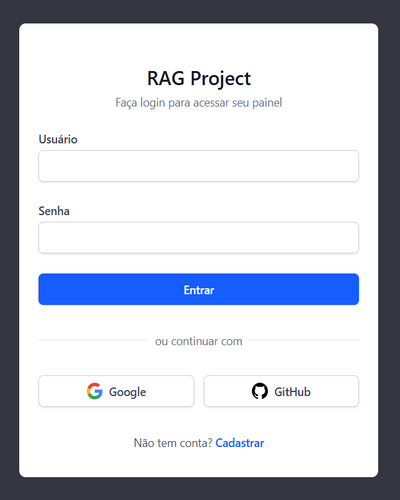

# `Criando a Landing Page da aplicação (base.html + index.html)`

## Conteúdo

 - **Implementações:**
   - [`Introdução a Landing Page`](#intro-to-landing-page)
   - [`Criando o HTML base (base.html)`](#base-html)
   - [`Relacionando as ROTAS/URLs (core/urls.py) e (users/urls.py)`](#mapping-urls)
   - [`Criando a view (ação) login_view()`](#login-view)
   - [`Criando os icones de login social`](#social-icons)
   - [`Criando a Página Inicial/Landing Page (index.html)`](#index-html)
 - **Testes:**
   - [`Testando se a rota "/" está registrada corretamente`](#main-router-test)
   - [`Testando se um GET "/" retorna status HTTP 200`](#test-main-router-200)
<!---
[WHITESPACE RULES]
- 50
--->


---

<div id="intro-to-landing-page"></div>

## `Introdução a Landing Page`

Agora sim, vamos partir para a criação da nossa `landing page`...

> **Mas, afinal, o que é um "landing page"?**

Uma `landing page` pública geralmente contem:

 - Apresentação do produto/serviço.
 - Botões de “Entrar” e “Cadastrar”.
 - Sessões com informações sobre a empresa.
 - Depoimentos, preços, etc.


---

<div id="base-html"></div>

## `Criando o HTML base (base.html)`

Antes de criar a nossa `Landing Page`, vamos criar o nosso `HTML base` que é responsável por aplicar configurações globais aos nossos templates.

[base.html](../../../templates/base.html)
```html
<!DOCTYPE html>
<html lang="pt-br">
    <head>
        <!-- ================================================================== -->
        <!-- METADADOS E CONFIGURAÇÕES BÁSICAS                                -->
        <!-- ================================================================== -->
        
        <!-- Codificação de caracteres UTF-8 -->
        <meta charset="UTF-8">
        
        <!-- Viewport para responsividade em dispositivos móveis -->
        <meta name="viewport" 
              content="width=device-width, initial-scale=1.0">
        
        <!-- Título da página (pode ser sobrescrito por templates filhos) -->
        <title>
            RAG Project
        </title>
        
        <!-- ================================================================== -->
        <!-- FRAMEWORKS E BIBLIOTECAS EXTERNAS                                -->
        <!-- ================================================================== -->
        
        <!-- Tailwind CSS via CDN (versão browser) -->
        <!-- Fornece utilitários de CSS para estilização rápida -->
        <script src="https://cdn.jsdelivr.net/npm/@tailwindcss/browser@4">
        </script>
        
        <!-- ================================================================== -->
        <!-- BLOCOS CUSTOMIZÁVEIS                                             -->
        <!-- ================================================================== -->
        
        <!-- Bloco para adicionar elementos no <head> (CSS, meta tags, etc) -->
        
    </head>
    <body class="min-h-screen bg-[#343541]">
        <!-- ================================================================== -->
        <!-- CONTEÚDO PRINCIPAL                                                -->
        <!-- ================================================================== -->
        
        <!-- Bloco principal de conteúdo da página -->
        <!-- Deve ser preenchido pelos templates filhos -->
        
        
        <!-- ================================================================== -->
        <!-- SCRIPTS JAVASCRIPT                                                -->
        <!-- ================================================================== -->
        
        <!-- Bloco para adicionar scripts JavaScript no final do body -->
        <!-- Colocar scripts no final melhora o tempo de carregamento -->
        
    </body>
</html>
```


---

<div id="mapping-urls"></div>

## `Relacionando as ROTAS/URLs (core/urls.py) e (users/urls.py)`

Agora, nós vamos relacionar as `ROTAS/URLs (core/urls.py) da aplicação` com as `ROTAS/URLs do app users`:

[core/urls.py](../../../core/urls.py)
```python
from django.contrib import admin
from django.urls import include, path

urlpatterns = [
    path("admin/", admin.site.urls),
    path("", include("users.urls")),
]
```

Ótimo, agora vamos começar configurando a rota/url que vai ser nosso `/`:

[users/urls.py](../../../users/urls.py)
```python
from django.urls import path

from .views import login_view

urlpatterns = [
    path(route="", view=login_view, name="index"),
]
```

 - Essa rota/url `/` vai ser tratada dentro do App `users` porque futuramente nós vamos criar condições para verificar se o usuário está logado ou não no sistema.
 - Desta maneira, é interessante que essa rota/url `/` seja tratada dentro do App `users`.


---

<div id="login-view"></div>

## `Criando a view (ação) login_view()`

Agora vamos criar uma view (ação) para a nossa `landing page`:

[users/views.py](../../../users/views.py)
```python
from django.shortcuts import render


def login_view(request):
    if request.method == "GET":
        return render(request, "pages/index.html")
```

> **NOTE:**  
> O nome desta view (ação) é `login_view()` porque futuramente nós vamos atualizar ela para tratar logins de usuários.


---

<div id="social-icons"></div>

## `Criando os icones de login social`

É normal que os usuários loguem usando o *Google*, *GitHub*, etc. Então, vamos criar icones para esses logins social:

[templates/icons/github.svg.html](../../../templates/icons/github.svg.html)
```html
<!--
    Ícone SVG do GitHub.

    Este ícone é usado nos botões de login social com GitHub.
    Utiliza SVG inline para melhor performance e customização.
    O ícone é estilizado com classes Tailwind CSS.
-->
<svg class="h-5 w-5 mr-2"
     viewBox="0 0 24 24"
     fill="currentColor"
     aria-hidden="true">
    <!-- Path do logo do GitHub (gato Octocat) -->
    <path fill-rule="evenodd" 
          d="M12 0C5.37 0 0 5.37 0 12c0 5.3 3.438 9.8 8.205 11.385.6.11.82-.26.82-.577 0-.285-.01-1.04-.015-2.04-3.338.724-4.042-1.61-4.042-1.61-.546-1.385-1.333-1.754-1.333-1.754-1.09-.745.083-.73.083-.73 1.205.085 1.84 1.236 1.84 1.236 1.07 1.834 2.807 1.304 3.492.997.107-.775.418-1.304.762-1.603-2.665-.303-5.467-1.333-5.467-5.93 0-1.31.468-2.38 1.235-3.22-.124-.303-.535-1.523.117-3.176 0 0 1.008-.322 3.3 1.23a11.5 11.5 0 013.003-.404c1.02.005 2.045.138 3.003.404 2.29-1.552 3.297-1.23 3.297-1.23.653 1.653.243 2.873.12 3.176.77.84 1.234 1.91 1.234 3.22 0 4.61-2.807 5.624-5.48 5.92.43.372.823 1.102.823 2.222 0 1.604-.014 2.896-.014 3.29 0 .32.217.694.825.576C20.565 21.796 24 17.297 24 12c0-6.63-5.37-12-12-12z"/>
</svg>
```

[templates/icons/google.svg.html](../../../templates/icons/google.svg.html)
```html
<!--
    Ícone SVG do Google.

    Este ícone é usado nos botões de login social com Google.
    Utiliza SVG inline para melhor performance e customização.
    O ícone mantém as cores oficiais do Google (azul, verde, 
    amarelo e vermelho) e é estilizado com classes Tailwind CSS.
-->
<svg class="h-5 w-5 mr-2"
     viewBox="0 0 533.5 544.3"
     xmlns="http://www.w3.org/2000/svg"
     aria-hidden="true">
    <!-- Parte azul do logo (canto superior esquerdo) -->
    <path d="M533.5 278.4c0-18.2-1.6-36-4.7-53.2H272v100.8h147.4c-6.4 34.9-26 64.5-55.5 84.3v69.9h89.6c52.5-48.3 82-119.7 82-201.8z" 
          fill="#4285F4"/>
    <!-- Parte verde do logo (canto inferior esquerdo) -->
    <path d="M272 544.3c73.5 0 135.3-24.5 180.4-66.7l-89.6-69.9c-24.9 16.7-56.9 26.6-90.8 26.6-69.7 0-128.7-47.1-149.8-110.4H31.6v69.5C76.3 494.7 169 544.3 272 544.3z" 
          fill="#34A853"/>
    <!-- Parte amarela do logo (canto inferior direito) -->
    <path d="M122.2 327.1c-11.7-34.6-11.7-72 0-106.6V150.9H31.6c-39.6 77-39.6 168.5 0 245.5l90.6-69.3z" 
          fill="#FBBC05"/>
    <!-- Parte vermelha do logo (canto superior direito) -->
    <path d="M272 107.7c39.9 0 75.7 13.7 104 40.6l78-78C403.3 24.7 337.2 0 272 0 169 0 76.3 49.6 31.6 150.9l90.6 69.5C143.3 154.8 202.3 107.7 272 107.7z" 
          fill="#EA4335"/>
</svg>
```


---

<div id="index-html"></div>

## `Criando a Página Inicial/Landing Page (index.html)`

Agora, nós vamos criar o HTML da nossa *Página Inicial/Landing Page*:

[templates/pages/index.html](../../../templates/pages/index.html)
```html
<!--
    Template da página inicial (login).

    Esta página exibe um formulário de login com suporte a:
    - Login tradicional (username/password)
    - Login social via Google e GitHub
    - Link para criação de nova conta

    Utiliza Tailwind CSS para estilização e django-allauth
    para autenticação social.
-->




    <!-- ==================================================================== -->
    <!-- CONTEÚDO PRINCIPAL - ÁREA DE LOGIN                                  -->
    <!-- ==================================================================== -->
    
    <main class="min-h-screen flex items-center justify-center py-12 
                 px-4 sm:px-6 lg:px-8">
        
        <!-- ================================================================ -->
        <!-- CARD DE LOGIN                                                  -->
        <!-- ================================================================ -->
        
        <div class="max-w-md w-full space-y-8 bg-white py-8 px-6 shadow 
                    rounded-lg">
            
            <!-- ============================================================ -->
            <!-- CABEÇALHO - LOGO E TÍTULO                                   -->
            <!-- ============================================================ -->
            
            <div class="mb-6 text-center">
                <h2 class="mt-4 text-2xl font-semibold text-gray-900">
                    RAG Project
                </h2>
                <p class="mt-1 text-sm text-gray-500">
                    Faça login para acessar seu painel
                </p>
            </div>

            <!-- ============================================================ -->
            <!-- MENSAGENS DO SISTEMA                                        -->
            <!-- ============================================================ -->
            
            <!-- Exibe mensagens de erro ou sucesso do Django -->
            
                <div class="mb-4">
                    
                        <div class="text-red-600 bg-red-100 
                                    border border-red-200 rounded-md 
                                    px-4 py-2 text-sm">
                            {{ message }}
                        </div>
                    
                </div>
            

            <!-- ============================================================ -->
            <!-- FORMULÁRIO DE LOGIN TRADICIONAL                             -->
            <!-- ============================================================ -->
            
            <form method="post" action="" class="space-y-6">
                <!-- Token CSRF para proteção contra ataques -->
                

                <!-- Campo de Username -->
                <div>
                    <label for="username" 
                           class="block text-sm font-medium 
                                  text-gray-700">
                        Usuário
                    </label>
                    <div class="mt-1">
                        <input
                            id="username"
                            name="username"
                            type="text"
                            autocomplete="username"
                            required
                            class="appearance-none block w-full px-3 
                                   py-2 border border-gray-300 
                                   rounded-md shadow-sm 
                                   placeholder-gray-400 
                                   focus:outline-none focus:ring-2 
                                   focus:ring-blue-500 
                                   focus:border-blue-500 sm:text-sm">
                    </div>
                </div>

                <!-- Campo de Senha -->
                <div>
                    <label for="password" 
                           class="block text-sm font-medium 
                                  text-gray-700">
                        Senha
                    </label>
                    <div class="mt-1">
                        <input
                            id="password"
                            name="password"
                            type="password"
                            autocomplete="current-password"
                            required
                            class="appearance-none block w-full px-3 
                                   py-2 border border-gray-300 
                                   rounded-md shadow-sm 
                                   placeholder-gray-400 
                                   focus:outline-none focus:ring-2 
                                   focus:ring-blue-500 
                                   focus:border-blue-500 sm:text-sm">
                    </div>
                </div>

                <!-- Botão de Submit -->
                <div>
                    <button type="submit"
                            class="w-full flex justify-center py-2 px-4 
                                   border border-transparent 
                                   rounded-md shadow-sm 
                                   text-sm font-medium 
                                   text-white bg-blue-600 
                                   hover:bg-blue-700 
                                   focus:outline-none focus:ring-2 
                                   focus:ring-offset-2 
                                   focus:ring-blue-500">
                        Entrar
                    </button>
                </div>
            </form>

            <!-- ============================================================ -->
            <!-- DIVISOR - SEPARADOR ENTRE LOGIN TRADICIONAL E SOCIAL        -->
            <!-- ============================================================ -->
            
            <div class="mt-6 relative">
                <div class="absolute inset-0 flex items-center">
                    <div class="w-full border-t border-gray-200"></div>
                </div>
                <div class="relative flex justify-center text-sm">
                    <span class="bg-white px-2 text-gray-500">
                        ou continuar com
                    </span>
                </div>
            </div>

            <!-- ============================================================ -->
            <!-- BOTÕES DE LOGIN SOCIAL                                       -->
            <!-- ============================================================ -->
            
            <!-- Grid com dois botões lado a lado (Google e GitHub) -->
            <div class="mt-6 grid grid-cols-2 gap-3">
                
                <!-- Botão de Login com Google -->
                <div>
                    <a href=""
                       class="w-full inline-flex justify-center 
                              items-center py-2 px-4 border 
                              border-gray-300 rounded-md 
                              shadow-sm bg-white hover:bg-gray-50">
                        <!-- Ícone do Google -->
                        
                        <span class="text-sm font-medium 
                                     text-gray-700">
                            Google
                        </span>
                    </a>
                </div>

                <!-- Botão de Login com GitHub -->
                <div>
                    <a href=""
                       class="w-full inline-flex justify-center 
                              items-center py-2 px-4 border 
                              border-gray-300 rounded-md 
                              shadow-sm bg-white hover:bg-gray-50">
                        <!-- Ícone do GitHub -->
                        
                        <span class="text-sm font-medium 
                                     text-gray-700">
                            GitHub
                        </span>
                    </a>
                </div>
            </div>

            <!-- ============================================================ -->
            <!-- RODAPÉ - LINK PARA CADASTRO                                 -->
            <!-- ============================================================ -->
            
            <p class="mt-6 text-center text-sm text-gray-600">
                Não tem conta?
                <a href="" 
                   class="font-medium text-blue-600 
                          hover:text-blue-700">
                    Cadastrar
                </a>
            </p>

        </div>

    </main>

```

> **NOTE:**  
> Não vou comentar sobre os *CSS/TailwindCSS* utilizados porque não é o foco desse tutorial.

Finalmente, se você abrir o projeto (site) na rota/url principal vai aparecer essa `landing page`.

 - [http://localhost/](http://localhost/)

  


---

<div id="main-router-test"></div>

## `Testando se a rota "/" está registrada corretamente`

Aqui, nós vamos criar um teste automatizado simples para garantir que a `rota principal da aplicação (/)` está registrada corretamente no sistema de rotas do Django e pode ser resolvida sem erros.

Esse teste:

 - Não verifica lógica de view
 - Não renderiza template
 - Não faz requisição HTTP.

> **NOTE:**  
> Ele apenas garante que o Django conhece a rota `/`.

Vamos começar criando um teste chamad `test_root_url_is_registered`:

[users/tests/test_urls.py](../../../users/tests/test_urls.py)
```python
def test_root_url_is_registered():
    """
    Testa se a rota / está registrada no sistema de rotas do Django.
    """
    ...
```

### ``🅰️ Arrange — Preparando o cenário``

Nesta etapa, quase não precisamos preparar nada, porque:

 - o Django já carrega automaticamente o ROOT_URLCONF
 - o arquivo `core/urls.py` já inclui `users.urls`
 - a rota `/` já foi definida no projeto

Mesmo assim, precisamos importar a função que será usada para testar URLs:

[users/tests/test_urls.py](../../../users/tests/test_urls.py)
```python
from django.urls import resolve

def test_root_url_is_registered():
    """
    Testa se a rota / está registrada no sistema de rotas do Django.
    """
    ...
```

### `🅰️🅰️ Act — Executando a ação`

Agora vamos executar a ação (act) principal do teste:

> **Pedir para o Django resolver a URL `/`.**

[users/tests/test_urls.py](../../../users/tests/test_urls.py)
```python
from django.urls import resolve


def test_root_url_is_registered():
    """
    Testa se a rota / está registrada no sistema de rotas do Django.
    """

    # Arrange
    # (nenhuma preparação adicional é necessária)

    # Act
    match = resolve("/")
```

### `🅰️🅰️🅰️ Assert — Verificando o resultado`

Agora vamos criar um único assert, focando em apenas uma coisa:

[users/tests/test_urls.py](../../../users/tests/test_urls.py)
```python
from django.urls import resolve


def test_root_url_is_registered():
    """
    Testa se a rota / está registrada no sistema de rotas do Django.
    """

    # Arrange
    # (nenhuma preparação adicional é necessária)

    # Act
    match = resolve("/")

    # Assert
    assert match is not None
```

> **O que esse assert garante?**

 - Que a URL `/` existe
 - Que o Django conseguiu resolvê-la
 - Que o encadeamento `core/urls.py → users/urls.py` está funcionando corretamente

> 👉 Se alguém remover ou quebrar essa rota no futuro,  
> 👉 esse teste falha imediatamente.

### `Testando`

Se você desejar rodar esse teste específico você pode executar o seguinte comando:

```bash
pytest --cov=. -vv users/tests/test_urls.py::test_root_url_is_registered
```


---

<div id="test-main-router-200"></div>

## `Testando se um GET "/" retorna status HTTP 200`

Aqui, nós vamos criar um teste automatizado simples para garantir que, quando um usuário acessa a rota principal do sistema (/) via navegador, o Django responde corretamente com o status `HTTP 200 (OK)`.

Esse teste:

 - Não valida conteúdo HTML
 - Não valida template
 - Não valida lógica interna da view.

> **Ele verifica apenas uma coisa: o status da resposta.**

Vamos criar uma **função de teste** chamada `test_root_get_returns_200()`:

[users/tests/test_views.py](../../../users/tests/test_views.py)
```python
def test_root_get_returns_200():
    """
    Testa se um GET / retorna status HTTP 200.
    """
    ...
```

### `🅰️ Arrange — Preparando o cenário`

Nesta etapa, precisamos preparar apenas um **cliente HTTP** de teste. O Django fornece uma ferramenta pronta para isso: o Client.

[users/tests/test_views.py](../../../users/tests/test_views.py)
```python
from django.test import Client

def test_root_get_returns_200():
    """
    Testa se um GET / retorna status HTTP 200.
    """

    # Arrange
    client = Client()
```

 - **O que `Client()` faz?**
   - Cria um cliente HTTP de teste do Django
   - Simula requisições como um navegador faria
 - **Quais parâmetros ela recebe?**
   - Nenhum (na forma mais comum)
 - **O que ela retorna?**
   - Um objeto do tipo `django.test.Client`

## `🅰️🅰️ Act — Executando a ação`

Agora executamos a ação (act) principal do teste:

> **👉 realizar um GET na rota `/`**

[users/tests/test_views.py](../../../users/tests/test_views.py)
```python
from django.test import Client


def test_root_get_returns_200():
    """
    Testa se um GET / retorna status HTTP 200.
    """

    # Arrange
    client = Client()

    # Act
    response = client.get("/")
```

 - **O que essa função faz?**
   - Executa uma requisição HTTP GET dentro do Django
   - Passa pela URL, middleware e view normalmente
 - **Quais parâmetros ela recebe?**
   - 1️⃣ path (obrigatório)
     - Caminho da URL
     - Exemplo: `"/"`
   - Outros parâmetros opcionais:
     - data
     - follow
     - headers 
 - **O que ela retorna?**
   - Um objeto `django.http.HttpResponse`
   - Principais atributos:
     - response.status_code
     - response.content
     - response.context
     - response.templates

### `🅰️🅰️🅰️ Assert — Verificando o resultado`

Agora vamos criar um único `assert`, focando em apenas uma coisa:

[users/tests/test_views.py](../../../users/tests/test_views.py)
```python
from django.test import Client

OK_STATUS_CODE = 200


def test_root_get_returns_200():
    """
    Testa se um GET / retorna status HTTP 200.
    """

    # Arrange
    client = Client()

    # Act
    response = client.get("/")

    # Assert
    assert response.status_code == OK_STATUS_CODE
```

> **O que esse assert garante?**

 - Que a rota `/`:
   - existe
   - foi resolvida corretamente
   - não gerou erro interno
   - Que a aplicação respondeu com sucesso

> 👉 Se a view quebrar, a rota for removida ou ocorrer erro `500`,
> 👉 esse teste falha imediatamente.

### `Testando`

Se você desejar rodar esse teste específico você pode executar o seguinte comando:

```bash
pytest --cov=. -vv users/tests/test_views.py::test_root_get_returns_200
```

---

**Rodrigo** **L**eite da **S**ilva - **rodrigols89**
