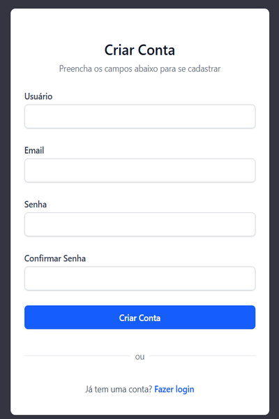

# `Criando a página de cadastro (create-account.html + DB Commands)`

## Conteúdo

 - **Implementações:**
   - [`Criando a ROTA/URL create-account/`](#create-account-url)
   - [`Criando o formulário personalizado de criação de usuário`](#create-account-form)
   - [`Criando a view (ação) create_account()`](#create-account-view)
   - [`Criando o template de cadastro (create-account.html)`](#create-account-template)
   - [`Modificando a "Internacionalização" para PT-BR`](#modify-language)
   - [`DB Commands`](#db-commands)
 - **Testes:**
   - [`Testando se o formulário CustomUserCreationForm cria um usuário no banco`](#test-customusercreationform)
   - [`Testando se o formulário não permite e-mail duplicado`](#test-customusercreationform-duplicate-email)
   - [`Testando se senhas diferentes geram a mensagem de erro correta`](#test-customusercreationform-different-passwords)
   - [`Testando se username duplicado mostra mensagem de erro em português`](#test-customusercreationform-duplicate-username)
   - [`Testando se GET /create-account/ retorna 200 e renderiza o template correto`](#test-create-account-200)
   - [`Testando se um POST válido cria um usuário no banco (Usuário é criado no banco)`](#test-create-account-post)
   - [`Testando se um POST válido retorna status 302 (Resposta é um redirect - 302)`](#test-create-account-post-redirects)
   - [`Testando se um POST inválido exibe a mensagem de erro correta`](#test-create-account-post-shows-error-message)
<!---
[WHITESPACE RULES]
- 50
--->


---

<div id="create-account-url"></div>

## `Criando a ROTA/URL create-account/`

Aqui, nós vamos criar a ROTA/URL de criação de usuário `create-account/`:

[users/urls.py](../../../users/urls.py)
```python
from django.urls import path

from users import views

urlpatterns = [

    ...

    path(
        route="create-account/",
        view=views.create_account,
        name="create-account"
    ),
]
```


---

<div id="create-account-form"></div>

## `Criando o formulário personalizado de criação de usuário`

Agora, antes de criar a view (ação) que vai ser responsável por redirecionar o usuário para a página de cadastro (GET) e enviar os dados para o Banco de Dados (POST), vamos criar um formulário personalizado usando o Django.

O Django já vem com um formulário pronto para criar usuários (`UserCreationForm`), mas:

 - queremos personalizar os campos
 - traduzir labels
 - criar mensagens de erro em português
 - impedir que dois usuários usem o mesmo e-mail

Vamos começar importanto os seguintes módulos do Django:

[users/forms.py](../../../users/forms.py)
```python
from django import forms
from django.contrib.auth.forms import UserCreationForm
from django.contrib.auth.models import User
```

 - `from django import forms`
   - **O que faz?**
     - Importa o módulo de formulários do Django.
   - **Para que vamos usar?**
     - Para criar validações customizadas e lançar erros (forms.ValidationError).
 - `from django.contrib.auth.forms import UserCreationForm`
   - **O que faz?**
     - Importa o formulário padrão do Django para criação de usuários.
   - **O que ele já faz automaticamente?**
     - Cria os campos:
       - username
       - password1
       - password2
     - Valida:
       - se o usuário já existe
       - se as senhas coincidem
       - se a senha segue regras de segurança
   - **O que ele retorna?**
     - Um formulário pronto para uso, que salva um usuário no banco.
 - `from django.contrib.auth.models import User`
   - **O que faz?**
     - Importa o modelo padrão de usuário do Django.
   - **Para que vamos usar?**
     - Para:
       - definir o modelo do formulário
       - consultar usuários no banco (ex: validar e-mail duplicado)

Continuando, vamos criar uma classe chamada `CustomUserCreationForm()` que vai herdar de `UserCreationForm`:

[users/forms.py](../../../users/forms.py)
```python
class CustomUserCreationForm(UserCreationForm):
    ...
```

Agora, vamos criar uma classe interna `Meta` que vai ter uma instância de `User`:

[users/forms.py](../../../users/forms.py)
```python
class CustomUserCreationForm(UserCreationForm):
    class Meta:
        model = User
```

 - **O que é a classe Meta?**
   - É onde informamos configurações do formulário
   - O Django usa essas informações para:
     - saber qual modelo salvar
     - quais campos exibir
     - como exibir esses campos
 - **model = User**
   - **O que faz?**
     - Diz ao Django:
       - *“Este formulário cria objetos do modelo User.”*
   - **Resultado prático:**
     - Quando o formulário for salvo, um usuário será criado no banco.

Agora, vamos definir quais campos aparecerão no formulário (A ordem da lista define a ordem na tela):

[users/forms.py](../../../users/forms.py)
```python
class CustomUserCreationForm(UserCreationForm):
    class Meta:
        model = User

        fields = [
            "username",
            "email",
            "password1",
            "password2"
        ]
```

 - **📌 Observação importante:**
   - `password1` e `password2` já existem no `UserCreationForm`
   - `email` estamos adicionando explicitamente

Agora, nós vamos criar alguns labels que nada mais serão que um mapeamento entre os campos (fields) e nomes amigaveis para o usuário:

[users/forms.py](../../../users/forms.py)
```python
class CustomUserCreationForm(UserCreationForm):
    class Meta:
        model = User

        fields = [
            "username",
            "email",
            "password1",
            "password2"
        ]

        labels = {
            "username": "Usuário",
            "email": "Email",
            "password1": "Senha",
            "password2": "Confirmar Senha",
        }
```

 - **O que isso faz?**
   - Altera os textos exibidos no HTML
 - **Em vez de:**
   - username
 - **O usuário verá:**
   - Usuário
 - `👉 Isso melhora a experiência do usuário.`

Agora, vamos implementar algumas mensagens de erros para os campos `username` e `password2` que serão utilizados quando:

 - `username`
   - Dizendo que o campo de usuário é obrigatória
   - Já existe um usuário com esse nome
 - `password2`
   - Dizendo que as duas senhas não coincidem

[users/forms.py](../../../users/forms.py)
```python
class CustomUserCreationForm(UserCreationForm):

    ...

        error_messages = {
            "username": {
                "unique": "Já existe um usuário com este nome.",
                "required": "O campo Usuário é obrigatório.",
            },
            "password2": {
                "password_mismatch": "Os dois campos de senha não correspondem.",
            },
        }
```

 - **O que isso faz?**
   - Substitui mensagens de erro padrão (em inglês)
   - Define mensagens claras e em português
 - `"username"`
   - `"unique"`
     - Disparado quando o nome de usuário já existe no banco
   - `"required"`
     - Disparado quando o campo não é preenchido
 - `"password2"`
   - `"password_mismatch"`
     - Disparado quando:
       - password1 ≠ password2
   - 📌 Essa validação já existe, aqui só mudamos a mensagem.

Agora, nós vamos criar uma *método* chamado `clean_email()` que será responsável por validar o campo `email`:

[users/forms.py](../../../users/forms.py)
```python
class CustomUserCreationForm(UserCreationForm):

    ...

    def clean_email(self):
        email = self.cleaned_data.get("email")
        if User.objects.filter(email=email).exists():
            raise forms.ValidationError(
                "Este e-mail já está cadastrado."
            )
        return email
```

 - `email = self.cleaned_data.get("email")`
   - `.get("email")`
     - retorna o valor do campo email
     - ou None se não existir
 - `if User.objects.filter(email=email).exists():`
   - Verifica se já existe algum usuário com o mesmo e-mail
 - `raise forms.ValidationError("Este e-mail já está cadastrado.")`
   - **O que isso faz?**
     - Interrompe a validação
     - Marca o formulário como inválido
     - Exibe a mensagem de erro no campo email
  - **📌 Importante:**
    - O formulário não será salvo
    - O usuário verá o erro na tela
 - `return email`
   - Se o e-mail não existir no banco:
     - ele é considerado válido
     - retorna para o fluxo normal do formulário


---

<div id="create-account-view"></div>

## `Criando a view (ação) create_account()`

Agora, nós vamos criar uma view (ação) para:

 - Quando alguém clicar em "Cadastrar" na [landing page (index.html)](../../../templates/pages/index.html) seja redirecionado para [página de cadastro (create-account.html)](../../../users/templates/pages/create-account.html).
 - E quando alguém cadastrar algum usuário (corretamente), ele seja salvo no Banco de Dados e depois redirecionado para a [landing page (index.html)](../../../templates/pages/index.html).

Essa view faz três coisas principais:

 - 📄 Mostra um formulário de cadastro (GET)
 - 📨 Recebe os dados enviados pelo usuário (POST)
 - ✅ Valida, cria o usuário e mostra mensagens de sucesso ou erro

Vamos começar importando os módulos necessários:

[users/views.py](../../../users/views.py)
```python
from django.contrib import messages
from django.shortcuts import redirect, render

from users.forms import CustomUserCreationForm
```

 - `from django.contrib import messages`
   - Importa o framework de mensagens do Django, usado para mostrar mensagens temporárias ao usuário.
 - `from django.shortcuts import redirect, render`
   - `render()`
     - **O que faz?**
       - Renderiza um template HTML
       - Junta HTML + dados (contexto)
     - **Parâmetros:**
       - request
       - nome do template (string)
       - contexto (dicionário)
    - **Retorno**
      - Um `HttpResponse` com HTML pronto
   - `redirect()`
     - **O que faz?**
       - Redireciona o usuário para outra URL
     - **Parâmetros:**
       - Uma URL ("/", "/login/", etc.)
     - **Retorno:**
       - Um `HttpResponseRedirect`
 - `from users.forms import CustomUserCreationForm`
   - Importa o formulário criado anteriormente: [users/forms.py](../../../users/forms.py)

Ótimo, agora nós vamos começar criando uma view (ação) chamada `create_account()` que vai ter como parâmetro um `request`:

[users/views.py](../../../users/views.py)
```python
def create_account(request):
    ...
```

Agora nós vamos criar uma condição para verificar se o método HTTP utilizado pelo o usuário foi `GET`:

[users/views.py](../../../users/views.py)
```python
def create_account(request):

    if request.method == "GET":
        ...
```

 - **O que isso significa?**
   - `GET` acontece quando:
     - o usuário digita a URL no navegador
     - clica em um link
     - Não há envio de dados ainda

Agora, dentro do nosso `if` nós vamos criar uma instância chamada `form` do nosso formulário personalizado `CustomUserCreationForm()`:

[users/views.py](../../../users/views.py)
```python
def create_account(request):

    if request.method == "GET":
        form = CustomUserCreationForm()
```

 - **O que essa linha faz?**
   - Cria uma instância vazia do formulário
   - Nenhum dado foi enviado ainda
 - **Para que isso serve?**
   - Mostrar os campos:
     - `username`
     - `email`
     - `senha`
     - `confirmação de senha`

Agora que nós temos uma instância do nosso formulário personalizado, vamos passar ele como contexto para o template:

[users/views.py](../../../users/views.py)
```python
def create_account(request):

    if request.method == "GET":

        form = CustomUserCreationForm()

        return render(
            request,
            "pages/create-account.html",
            {"form": form}
        )
```

 - **O que acontece aqui?**
   - O Django carrega o template:
     - `pages/create-account.html`
   - Injeta o formulário no template:
     - `{{ form }}`
   - Retorna a página pronta para o navegador

Como nós já temos tudo pronto para uma requisição do tipo `GET`, agora nós vamos criar uma condição para verificar se o método HTTP utilizado pelo o usuário foi `POST`:

[users/views.py](../../../users/views.py)
```python
def create_account(request):

    if request.method == "GET":
        ...

    elif request.method == "POST":
        ...
```

 - **Quando isso acontece?**
   - Quando o usuário:
     - preenche o formulário
     - clica em “Criar conta”
     - O navegador envia os dados para o servidor

Continuando, como nós sabemos que o método utilizado foi `POST`, nós podemos utilizar `request.POST` para criar uma instância de `CustomUserCreationForm` com os dados recebidos no `POST`:

[users/views.py](../../../users/views.py)
```python
def create_account(request):

    if request.method == "GET":
        ...

    elif request.method == "POST":

        form = CustomUserCreationForm(request.POST)
```

 - **O que é request.POST?**
   - Um dicionário com os dados enviados.

```json
{
  "username": "...",
  "email": "...",
  "password1": "...",
  "password2": "..."
}
```

Agora, nós vamos utilizar a função `is_valid()` da a classe `CustomUserCreationForm (herdou de UserCreationForm)` para verificar (validar) se os dados enviados pelo usuário estão ok:

[users/views.py](../../../users/views.py)
```python
def create_account(request):

    if request.method == "GET":
        ...

    elif request.method == "POST":

        form = CustomUserCreationForm(request.POST)

        if form.is_valid():
            ...
```

 - **O que is_valid() faz?**
   - **Verifica:**
     - campos obrigatórios
     - formatos
     - senhas iguais
   - **Executa:**
     - clean_email()
   - **Preenche:**
     - form.cleaned_data
   - **Retorno:**
     - `True` → dados válidos
     - `False` → erros encontrados

Partindo, do pressuposto que está tudo ok, agora nós vamos:

 - Salvar o usuário no banco de dados
 - Exibir uma mensagem de sucesso
 - Redirecionar o usuário para a [landing page (index.html)](../../../templates/pages/index.html)

[users/views.py](../../../users/views.py)
```python
def create_account(request):

    if request.method == "GET":
        ...

    elif request.method == "POST":

        form = CustomUserCreationForm(request.POST)

        if form.is_valid():
            form.save()
            messages.success(
                request,
                "Conta criada com sucesso! Faça login."
            )
            return redirect("/")
```

 - `form.save()`
   - **O que essa função faz?**
     - Cria um objeto User
     - Criptografa a senha
     - Salva no banco de dados
     - 📌 Tudo isso é feito automaticamente pelo Django.
 - `messages.success()`
   - **O que essa função faz?**
     - Registra uma mensagem de sucesso
     - A mensagem ficará disponível na próxima página
 - `return redirect("/")`
   - **O que acontece aqui?**
     - O usuário é enviado para a página inicial (landing page)
     - A mensagem de sucesso aparece lá

**NOTE:**  
Agora, vocês concordam comigo que dentro do nosso `elif request.method == "POST"`, quando `if form.is_valid()` é inválido nós precisamos:

 - Exibir o erro
 - Redirecionar novamente para a página de cadastro

Então, é isso que nós vamos implementar agora:

[users/views.py](../../../users/views.py)
```python
def create_account(request):

    if request.method == "GET":
        ...

    elif request.method == "POST":
        ...

        messages.error(
            request,
            "Corrija os erros abaixo."
        )

        return render(
            request,
            "pages/create-account.html",
            {"form": form}
        )
```

 - **Por que isso é importante?**
   - O formulário volta:
     - preenchido
     - com mensagens de erro nos campos
     - O usuário pode corrigir sem perder os dados

**🧠 Resumo mental do fluxo:**

```bash
        Usuário acessa página (GET)
                      ↓
        Formulário vazio aparece
                      ↓
        Usuário preenche e envia (POST)
                      ↓
                Django valida
             ↙                ↘
          ↙                     ↘
      válido                  inválido
        ↓                        ↓
  salva usuário             mostra erros
        ↓                        ↓ 
mensagem(Success)          mensagem(Error)
+redirect(/)          re-render form (create-account.html)
```


---

<div id="create-account-template"></div>

## `Criando o template de cadastro (create-account.html)`

> Bem, lembram que nós estamos passando como `contexto` o formulário `form` para o template `create-account.html`?

```python
form = CustomUserCreationForm(request.POST)
return render(request, "pages/create-account.html", {"form": form})
```

Então, nós vamos utilizar esses dados (campos) passado para o template para criar um formulário dinâmico no nosso template:

[users/templates/pages/create-account.html](../../../users/templates/pages/create-account.html)
```html


Criar Conta



    <!-- ==================================================================== -->
    <!-- CONTEÚDO PRINCIPAL - ÁREA DE CADASTRO                                -->
    <!-- ==================================================================== -->
    
    <main class="min-h-screen flex items-center justify-center py-12 
                 px-4 sm:px-6 lg:px-8">
        
        <!-- ================================================================ -->
        <!-- CARD DE CADASTRO                                                 -->
        <!-- ================================================================ -->
        
        <div class="max-w-md w-full space-y-8 bg-white py-8 px-6 shadow 
                    rounded-lg">
            
            <!-- ============================================================ -->
            <!-- CABEÇALHO - TÍTULO                                           -->
            <!-- ============================================================ -->
            
            <div class="mb-6 text-center">
                <h2 class="mt-4 text-2xl font-semibold text-gray-900">
                    Criar Conta
                </h2>
                <p class="mt-1 text-sm text-gray-500">
                    Preencha os campos abaixo para se cadastrar
                </p>
            </div>

            <!-- ============================================================ -->
            <!-- MENSAGENS DO SISTEMA                                         -->
            <!-- ============================================================ -->
            
            <!-- Exibe mensagens de erro ou sucesso do Django -->
            
                <div class="mb-4">
                    
                        <div class="text-red-600 bg-red-100 
                                    border border-red-200 rounded-md 
                                    px-4 py-2 text-sm">
                            {{ message }}
                        </div>
                    
                </div>
            

            <!-- ============================================================ -->
            <!-- FORMULÁRIO DE CADASTRO                                       -->
            <!-- ============================================================ -->
            
            <form method="post" action="" class="space-y-6">
                <!-- Token CSRF para proteção contra ataques -->
                

                <!-- Erros gerais do formulário (não relacionados a campos) -->
                {{ form.non_field_errors }}

                <!-- Campo de Username -->
                <div>
                    <label for="{{ form.username.id_for_label }}"
                           class="block text-sm font-medium 
                                  text-gray-700">
                        Usuário
                    </label>
                    <div class="mt-1">
                        <input
                            type="text"
                            name="{{ form.username.name }}"
                            id="{{ form.username.id_for_label }}"
                            value="{{ form.username.value|default_if_none:'' }}"
                            class="appearance-none block w-full px-3 py-2 
                                   border border-gray-300 rounded-md 
                                   shadow-sm placeholder-gray-400 
                                   focus:outline-none focus:ring-2 
                                   focus:ring-blue-500 
                                   focus:border-blue-500 sm:text-sm"
                            required>
                    </div>
                    <!-- Exibe erros de validação do campo username -->
                    
                        <p class="text-sm text-red-600 mt-1">
                            {{ error }}
                        </p>
                    
                </div>

                <!-- Campo de Email -->
                <div>
                    <label for="{{ form.email.id_for_label }}"
                           class="block text-sm font-medium 
                                  text-gray-700">
                        Email
                    </label>
                    <div class="mt-1">
                        <input
                            type="email"
                            name="{{ form.email.name }}"
                            id="{{ form.email.id_for_label }}"
                            value="{{ form.email.value|default_if_none:'' }}"
                            class="appearance-none block w-full px-3 py-2 
                                   border border-gray-300 rounded-md 
                                   shadow-sm placeholder-gray-400 
                                   focus:outline-none focus:ring-2 
                                   focus:ring-blue-500 
                                   focus:border-blue-500 sm:text-sm"
                            required>
                    </div>
                    <!-- Exibe erros de validação do campo email -->
                    
                        <p class="text-sm text-red-600 mt-1">
                            {{ error }}
                        </p>
                    
                </div>

                <!-- Campo de Senha -->
                <div>
                    <label for="{{ form.password1.id_for_label }}"
                           class="block text-sm font-medium 
                                  text-gray-700">
                        Senha
                    </label>
                    <div class="mt-1">
                        <input
                            type="password"
                            name="{{ form.password1.name }}"
                            id="{{ form.password1.id_for_label }}"
                            class="appearance-none block w-full px-3 py-2 
                                   border border-gray-300 rounded-md 
                                   shadow-sm placeholder-gray-400 
                                   focus:outline-none focus:ring-2 
                                   focus:ring-blue-500 
                                   focus:border-blue-500 sm:text-sm"
                            required>
                    </div>
                    <!-- Exibe erros de validação do campo password1 -->
                    
                        <p class="text-sm text-red-600 mt-1">
                            {{ error }}
                        </p>
                    
                </div>

                <!-- Campo de Confirmar Senha -->
                <div>
                    <label for="{{ form.password2.id_for_label }}"
                           class="block text-sm font-medium 
                                  text-gray-700">
                        Confirmar Senha
                    </label>
                    <div class="mt-1">
                        <input
                            type="password"
                            name="{{ form.password2.name }}"
                            id="{{ form.password2.id_for_label }}"
                            class="appearance-none block w-full px-3 py-2 
                                   border border-gray-300 rounded-md 
                                   shadow-sm placeholder-gray-400 
                                   focus:outline-none focus:ring-2 
                                   focus:ring-blue-500 
                                   focus:border-blue-500 sm:text-sm"
                            required>
                    </div>
                    <!-- Exibe erros de validação do campo password2 -->
                    
                        <p class="text-sm text-red-600 mt-1">
                            {{ error }}
                        </p>
                    
                </div>

                <!-- Botão de Submit -->
                <div>
                    <button type="submit"
                            class="w-full flex justify-center py-2 px-4 
                                   border border-transparent rounded-md 
                                   shadow-sm text-sm font-medium 
                                   text-white bg-blue-600 hover:bg-blue-700 
                                   focus:outline-none focus:ring-2 
                                   focus:ring-offset-2 
                                   focus:ring-blue-500">
                        Criar Conta
                    </button>
                </div>

            </form>

            <!-- ============================================================ -->
            <!-- DIVISOR - SEPARADOR VISUAL                                   -->
            <!-- ============================================================ -->
            
            <div class="mt-6 relative">
                <div class="absolute inset-0 flex items-center">
                    <div class="w-full border-t border-gray-200"></div>
                </div>
                <div class="relative flex justify-center text-sm">
                    <span class="bg-white px-2 text-gray-500">ou</span>
                </div>
            </div>

            <!-- ============================================================ -->
            <!-- RODAPÉ - LINK PARA LOGIN                                     -->
            <!-- ============================================================ -->
            
            <p class="mt-6 text-center text-sm text-gray-600">
                Já tem uma conta?
                <a href="/" 
                   class="font-medium text-blue-600 
                          hover:text-blue-700">
                    Fazer login
                </a>
            </p>

        </div>

    </main>

```

**NOTE:**  
Agora, nós precisamos referenciar que quando alguém clicar em "Cadastrar" na minha [Landing Page (index.html)](../../../templates/pages/index.html) seja redirecionado para a [Página de cadastro (create-account.html)](../../../users/templates/pages/create-account.html):

[index.html](../../../templates/pages/index.html)
```html
<p class="mt-6 text-center text-sm text-gray-600">
    Não tem conta?
    <a href="" 
        class="font-medium text-blue-600 
              hover:text-blue-700">
        Cadastrar
    </a>
</p>
```

Ótimo, agora vamos visualizar o resultado:

  


---

<div id="modify-language">

## `Modificando a "Internacionalização" para PT-BR`

Se você digitar senhas que não coincidem ou tentar cadastrar um usuário que já existe você vai ter um erro, como:

 - `The two password fields didn’t match.`
 - `A user with that username already exists.`

> **NOTE:**  
> Isso acontece porque o Django, por padrão, usa mensagens de *validação internas em inglês*.

Para resolver isso abra seu arquivo [core/settings.py](../../../core/settings.py) e localize (ou adicione, se não existir) as seguintes variáveis:

[core/settings.py](../../../core/settings.py)
```python
LANGUAGE_CODE = "pt-br"
TIME_ZONE = "America/Sao_Paulo"
USE_I18N = True
USE_TZ = True
```

Ótimo, agora suas mensagens de erro serão em português.


---

<div id="db-commands"></div>

## `DB Commands`

> **Como eu sei que os usuários estão sendo gravados no Banco de Dados?**

Primeiro, vamos abrir o container que tem PostgreSQL:

```bash
task opendb
```

Agora vamos listar as tabelas:

```bash
\dt+
```

**OUTPUT:**
```bash
                                               List of relations
 Schema |            Name            | Type  |  Owner  | Persistence | Access method |    Size    | Description
--------+----------------------------+-------+---------+-------------+---------------+------------+-------------
 public | auth_group                 | table | easyrag | permanent   | heap          | 0 bytes    |
 public | auth_group_permissions     | table | easyrag | permanent   | heap          | 0 bytes    |
 public | auth_permission            | table | easyrag | permanent   | heap          | 8192 bytes |
 public | auth_user                  | table | easyrag | permanent   | heap          | 16 kB      |
 public | auth_user_groups           | table | easyrag | permanent   | heap          | 0 bytes    |
 public | auth_user_user_permissions | table | easyrag | permanent   | heap          | 0 bytes    |
 public | django_admin_log           | table | easyrag | permanent   | heap          | 8192 bytes |
 public | django_content_type        | table | easyrag | permanent   | heap          | 8192 bytes |
 public | django_migrations          | table | easyrag | permanent   | heap          | 16 kB      |
 public | django_session             | table | easyrag | permanent   | heap          | 16 kB      |
```

Agora, vamos listas as colunas da tabela `auth_user`:

```bash
\d auth_user
```

**OUTPUT:**
```bash
                                     Table "public.auth_user"
    Column    |           Type           | Collation | Nullable |             Default
--------------+--------------------------+-----------+----------+----------------------------------
 id           | integer                  |           | not null | generated by default as identity
 password     | character varying(128)   |           | not null |
 last_login   | timestamp with time zone |           |          |
 is_superuser | boolean                  |           | not null |
 username     | character varying(150)   |           | not null |
 first_name   | character varying(150)   |           | not null |
 last_name    | character varying(150)   |           | not null |
 email        | character varying(254)   |           | not null |
 is_staff     | boolean                  |           | not null |
 is_active    | boolean                  |           | not null |
 date_joined  | timestamp with time zone |           | not null |
Indexes:
    "auth_user_pkey" PRIMARY KEY, btree (id)
    "auth_user_username_6821ab7c_like" btree (username varchar_pattern_ops)
    "auth_user_username_key" UNIQUE CONSTRAINT, btree (username)
Referenced by:
    TABLE "auth_user_groups" CONSTRAINT "auth_user_groups_user_id_6a12ed8b_fk_auth_user_id" FOREIGN KEY (user_id) REFERENCES auth_user(id) DEFERRABLE INITIALLY DEFERRED
    TABLE "auth_user_user_permissions" CONSTRAINT "auth_user_user_permissions_user_id_a95ead1b_fk_auth_user_id" FOREIGN KEY (user_id) REFERENCES auth_user(id) DEFERRABLE INITIALLY DEFERRED
    TABLE "django_admin_log" CONSTRAINT "django_admin_log_user_id_c564eba6_fk_auth_user_id" FOREIGN KEY (user_id) REFERENCES auth_user(id) DEFERRABLE INITIALLY DEFERRED
```

Por fim, vamos listar todos os usuários (com suas colunas) já cadastrados no Banco de Dados:

```bash
select * from auth_user;
```

**OUTPUT:**
```bash
 id |                                         password                                          |          last_login           | is_superuser | username | first_name | last_name |           email            | is_staff | is_active |          date_joined
----+-------------------------------------------------------------------------------------------+-------------------------------+--------------+----------+------------+-----------+----------------------------+----------+-----------+-------------------------------
  2 | pbkdf2_sha256$1000000$Q77ZUEe8nNZFT3DLvOBMRf$pLgNiCmXRUEaX0XGmC+JX8jTrNqS5I6QMVuutC3ypTw= |                               | f            | rodrigo  |            |           | rodrigo.praxedes@gmail.com | f        | t         | 2025-10-21 10:30:23.466991+00
  3 | pbkdf2_sha256$1000000$93BBiOAKodPLbmgJJtbfBY$HLYRqEN5oCfmZKsA0iGkbbG+KbITmlz26BDl2xRMGbs= | 2025-11-02 09:19:36.900889+00 | f            | romario  |            |           | romario@gmail.com          | f        | t         | 2025-10-28 00:52:23.111699+00
  4 | pbkdf2_sha256$1000000$AW4kQwpGOjvxBWaCg5EMkC$+YnHIhK29DhI8PMJQyx3SIuOnCHGUJgvuuc0XNDrEKs= | 2025-11-02 09:36:10.701396+00 | f            | brenda   |            |           | brenda@gmail.com           | f        | t         | 2025-11-02 09:36:05.24123+00
  1 | pbkdf2_sha256$1000000$TwwCgqC0kp0GRli3xEyzhO$5r01g9G+sbI99a9a6cvgky5XudMjI/ADg+t5wO+1tHw= | 2025-11-02 10:07:32.909962+00 | t            | drigols  |            |           | drigols.creative@gmail.com | t        | t         | 2025-10-21 09:01:46.482399+00
(4 rows)
```


---


---

<div id="test-customusercreationform"></div>

## `Testando se o formulário CustomUserCreationForm cria um usuário no banco`

> Aqui, nós vamos criar um teste automatizado simples para garantir que o formulário de criação de usuário (`CustomUserCreationForm`) funciona corretamente quando os dados enviados são válidos.

Em termos simples:

 - simulamos o preenchimento correto do formulário
 - pedimos para o Django validar os dados
 - salvamos o formulário
 - verificamos se um usuário foi realmente criado no banco de dados

**NOTE:**  
Mas, antes de criarmos esse teste nós precisamos de algumas configurações especiais para o nosso teste não utilizar nosso Banco de Dados real e sim um Banco de Dados de Teste.

Primeiro, nós vamos criar um arquivo chamado [core/settings_test.py](../../../core/settings_test.py) que só terá configurações de teste:

[core/settings_test.py](../../../core/settings_test.py)
```python
from .settings import *  # noqa: F403

DATABASES = {
    "default": {
        "ENGINE": "django.db.backends.sqlite3",
        "NAME": ":memory:",
    }
}
```

Vejam que:

 - Nós estamos importanto todas as configurações do nosso `settings.py`
 - Porém, estamos sobreescrevendo apenas a configuração de Banco de Dados

Agora, nós precisamos dizer ao Pytest para utilizar esse arquivo como configuração para teste:

[pyproject.toml](../../../pyproject.toml)
```toml
[tool.pytest.ini_options]
DJANGO_SETTINGS_MODULE = "core.settings_test"
```

👉 Agora:

 - produção → PostgreSQL
 - desenvolvimento → Docker/Postgres
 - testes → SQLite em memória

Para iniciar nosso teste vamos começar criando uma **função de teste** chamada `test_custom_user_creation_form_creates_user()`:

[users/tests/test_forms.py](../../../users/tests/test_forms.py)
```python
@pytest.mark.django_db
def test_custom_user_creation_form_creates_user():
    """
    Testa se um formulário válido cria um usuário no banco de dados.
    """
    ...
```

> **NOTE:**  
> O decorator `@pytest.mark.django_db` diz ao Pytest que esse teste precisa utilizar o Banco de Dados de Teste.

### `🅰️ Arrange — Preparando o cenário`

> Nesta etapa, nós vamos preparar os dados necessários para o teste.

Para isso, precisamos importar:

 - o formulário que queremos testar
 - o modelo `User`, para consultar o banco depois

[users/tests/test_forms.py](../../../users/tests/test_forms.py)
```python
from django.contrib.auth.models import User

from users.forms import CustomUserCreationForm


@pytest.mark.django_db
def test_custom_user_creation_form_creates_user():
    """
    Testa se um formulário válido cria um usuário no banco de dados.
    """
    ...
```

Agora, ainda na etapa de Arrange, vamos criar um dicionário com dados válidos, simulando exatamente o que um usuário preencheria no formulário:

[users/tests/test_forms.py](../../../users/tests/test_forms.py)
```python
@pytest.mark.django_db
def test_custom_user_creation_form_creates_user():

    ...

    # Arrange
    form_data = {
        "username": "usuario_teste",
        "email": "usuario_teste@email.com",
        "password1": "SenhaForte123!",
        "password2": "SenhaForte123!",
    }
```

Em seguida, ainda no Arrange, criamos uma instância do formulário usando esses dados:

[users/tests/test_forms.py](../../../users/tests/test_forms.py)
```python
@pytest.mark.django_db
def test_custom_user_creation_form_creates_user():

    ...

    # Arrange
    form_data = {
        "username": "usuario_teste",
        "email": "usuario_teste@email.com",
        "password1": "SenhaForte123!",
        "password2": "SenhaForte123!",
    }

    form = CustomUserCreationForm(data=form_data)
```

 - **📌 O que fizemos até aqui?**
   - simulamos um preenchimento correto do formulário
   - ainda não validamos
   - ainda não salvamos
   - apenas preparamos o cenário do teste

### `🅰️🅰️ Act — Executando a ação`

Agora vamos executar a ação principal do teste.

> **👉 Validar o formulário e, se for válido, salvá-lo no banco.**

[users/tests/test_forms.py](../../../users/tests/test_forms.py)
```python
@pytest.mark.django_db
def test_custom_user_creation_form_creates_user():

    ...

        # Act
    is_valid = form.is_valid()

    if is_valid:
        form.save()
```

Aqui acontecem várias coisas importantes automaticamente:

 - **O Django:**
   - valida campos obrigatórios
   - verifica se as senhas coincidem
   - executa clean_email()
 - **Se tudo estiver correto:**
   - `is_valid()` retorna `True`
   - `form.save()` cria um usuário no banco

### `🅰️🅰️🅰️ Assert — Verificando o resultado`

Como esse teste deve ter apenas um `assert`, vamos focar em uma única garantia:

> **👉 Existe exatamente um usuário no banco com o username informado?**

[users/tests/test_forms.py](../../../users/tests/test_forms.py)
```python
@pytest.mark.django_db
def test_custom_user_creation_form_creates_user():

    ...

    # ----------------- ( Assert ) ----------------
    assert User.objects.filter(
        username="usuario_teste"
    ).exists()
```


> **O que esse assert garante?**

 - Que o formulário foi validado corretamente
 - Que o formulário foi salvo no banco de dados
 - Que um usuário com o username informado foi criado

### `Testando`

Se você desejar rodar esse teste específico você pode executar o seguinte comando:

```bash
pytest --cov=. -vv users/tests/test_forms.py::test_custom_user_creation_form_creates_user
```


---

<div id="test-customusercreationform-duplicate-email"></div>

## `Testando se o formulário não permite e-mail duplicado`

> Aqui, nós vamos criar um teste automatizado simples para garantir que o formulário de criação de usuário **não permite cadastrar dois usuários com o mesmo e-mail**.

Esse tipo de teste é importante porque:

 - essa é uma regra de negócio sua
 - o Django não impede e-mails duplicados por padrão
 - se alguém remover essa validação no futuro, o teste falha imediatamente

Vamos começar criando uma **função de teste** chamada `test_form_does_not_allow_duplicate_email()`:

[users/tests/test_forms.py](../../../users/tests/test_forms.py)
```python
def test_form_does_not_allow_duplicate_email():
    """
    Testa se o formulário não permite e-mail duplicado.
    """
    ...
```

### `🅰️ Arrange — Preparando o cenário`

Nesta etapa, nós vamos preparar o estado inicial do sistema, ou seja:

 - criar um usuário já existente no banco
 - preparar os dados de um segundo usuário com o mesmo e-mail

> **NOTE:**  
> Como o teste acessa o banco de dados, precisamos habilitar o banco de testes do Django usando o marker do pytest.

[users/tests/test_forms.py](../../../users/tests/test_forms.py)
```python
import pytest
from django.contrib.auth.models import User

from users.forms import CustomUserCreationForm


@pytest.mark.django_db
def test_form_does_not_allow_duplicate_email():
    """
    Testa se o formulário não permite e-mail duplicado.
    """

    # ---------------- ( Arrange ) ----------------
    User.objects.create_user(
        username="usuario_existente",
        email="email@duplicado.com",
        password="SenhaForte123!",
    )

    form_data = {
        "username": "novo_usuario",
        "email": "email@duplicado.com",
        "password1": "SenhaForte123!",
        "password2": "SenhaForte123!",
    }
```

Vejam que no `Arrange` acima:

 - Primeiro, nós criamos um usuário no Banco de Dados:
   - Esse usuário vai ter o seguinte e-mail: `email@duplicado.com`
 - Segundo, nós criamos um dicionários com os dados de um segundo usuário com o mesmo e-mail:
   - Esse segundo usuário também terá o mesmo e-mail: `email@duplicado.com`

### `🅰️🅰️ Act — Executando a ação`

Agora vamos executar a ação principal do teste:

> **👉 validar o formulário com um e-mail já existente.**

[users/tests/test_forms.py](../../../users/tests/test_forms.py)
```python
@pytest.mark.django_db
def test_form_does_not_allow_duplicate_email():

    ...

    # ------------------ ( Act ) ------------------
    form = CustomUserCreationForm(data=form_data)
    is_valid = form.is_valid()
```

 - O Django executa todas as validações do formulário
 - Inclusive a validação customizada de e-mail duplicado
 - Nenhum usuário novo é salvo no banco

### `🅰️🅰️🅰️ Assert — Verificando o resultado`

Agora vamos criar um único `assert`, focando em uma coisa só:

> **👉 verificar que o formulário é inválido.**

[users/tests/test_forms.py](../../../users/tests/test_forms.py)
```python
@pytest.mark.django_db
def test_form_does_not_allow_duplicate_email():

    ...

    # ----------------- ( Assert ) ----------------
    assert is_valid is False
```

> **O que esse assert garante?**

 - Que o formulário detectou o e-mail duplicado
 - Que a regra de negócio está funcionando
 - Que nenhum usuário duplicado será criado
 - **NOTE:** 👉 Se alguém remover essa validação no futuro, esse teste falha.

### `Testando`

Se você desejar rodar esse teste específico você pode executar o seguinte comando:

```bash
pytest --cov=. -vv users/tests/test_forms.py::test_form_does_not_allow_duplicate_email
```


---

<div id="test-customusercreationform-different-passwords"></div>

## `Testando se senhas diferentes geram a mensagem de erro correta`

> Aqui, nós vamos criar um teste automatizado simples para garantir que o formulário de criação de usuário **exibe a mensagem correta quando as senhas não correspondem**.

Esse teste é importante porque:

 - valida uma mensagem customizada sua
 - protege contra regressões de `i18n`
 - garante uma boa experiência para o usuário final

Vamos começar criando uma **função de teste** chamada `test_form_passwords_do_not_match_error_message()`:

[users/tests/test_forms.py](../../../users/tests/test_forms.py)
```python
def test_form_passwords_do_not_match_error_message():
    """
    Testa se senhas diferentes geram a mensagem de erro correta.
    """

    ...
```

### `🅰️ Arrange — Preparando o cenário`

Nesta etapa, vamos apenas preparar os dados do formulário, não precisamos de banco de dados porque:

 - nenhuma consulta é feita
 - a validação ocorre apenas no formulário

[users/tests/test_forms.py](../../../users/tests/test_forms.py)
```python
def test_form_passwords_do_not_match_error_message():

    ...

    # ---------------- ( Arrange ) ----------------
    form_data = {
        "username": "usuario_teste",
        "email": "usuario@email.com",
        "password1": "SenhaForte123!",
        "password2": "SenhaDiferente123!",
    }
```

### `🅰️🅰️ Act — Executando a ação`

Agora vamos executar a ação principal do teste:

> **👉 validar o formulário com senhas diferentes.**

[users/tests/test_forms.py](../../../users/tests/test_forms.py)
```python
def test_form_passwords_do_not_match_error_message():

    ...

    # ------------------ ( Act ) ------------------
    form = CustomUserCreationForm(data=form_data)
    form.is_valid()
```

 - O Django executa todas as validações do formulário
 - A comparação entre password1 e password2 acontece aqui
 - O erro é armazenado internamente no formulário

### `🅰️🅰️🅰️ Assert — Verificando o resultado`

Agora vamos criar um único `assert`, focando em uma coisa só:

> **👉 verificar se a mensagem de erro correta aparece.**

[users/tests/test_forms.py](../../../users/tests/test_forms.py)
```python
def test_form_passwords_do_not_match_error_message():

    ...

    # ----------------- ( Assert ) ----------------
    assert "As senhas não correspondem." in form.errors["password2"]
```

> **O que esse assert garante?**

 - que a validação de senha foi executada
 - que a mensagem customizada está ativa
 - que mudanças futuras não quebrem o texto esperado
 - **NOTE:** 👉 Se alguém alterar ou remover essa mensagem, o teste falha.

### `Testando`

Se você desejar rodar esse teste específico você pode executar o seguinte comando:

```bash
pytest --cov=. -vv users/tests/test_forms.py::test_form_passwords_do_not_match_error_message
```


---

<div id="test-customusercreationform-duplicate-username"></div>

## `Testando se username duplicado mostra mensagem de erro em português`

> Aqui, nós vamos criar um teste automatizado simples para garantir que o formulário de criação de usuários **não permite usernames duplicados** e retorna **uma mensagem de erro em português**, conforme a regra de negócio definida pelo projeto.

Vamos começar criando uma **função de teste** chamada `test_form_duplicate_username_error_message()`:

[users/tests/test_forms.py](../../../users/tests/test_forms.py)
```python
import pytest

@pytest.mark.django_db
def test_form_duplicate_username_error_message():
    """
    Testa se um username duplicado retorna a mensagem de erro correta.
    """

    ...
```

### `🅰️ Arrange — Preparando o cenário`

Nesta etapa, vamos preparar tudo o que o teste precisa antes da ação:

 - obter o model de usuário configurado no projeto
 - criar um usuário existente no banco de dados
 - definir os dados do formulário com o mesmo username

[users/tests/test_forms.py](../../../users/tests/test_forms.py)
```python
import pytest
from django.contrib.auth import get_user_model

from users.forms import CustomUserCreationForm


@pytest.mark.django_db
def test_form_duplicate_username_error_message():
    """
    Testa se um username duplicado retorna a mensagem de erro correta.
    """

    # ---------------- ( Arrange ) ----------------
    User = get_user_model()

    User.objects.create_user(
        username="usuario_teste",
        email="usuario@email.com",
        password="SenhaForte123!",
    )

    form_data = {
        "username": "usuario_teste",
        "email": "outro@email.com",
        "password1": "SenhaForte123!",
        "password2": "SenhaForte123!",
    }
```

 - **🔍 Função: get_user_model()**
   - **O que ela faz?**
     - Retorna o model de usuário ativo no projeto Django
   - **Quais parâmetros ela recebe?**
     - Nenhum
   - **O que ela retorna?**
     - Um model Django (por padrão, `django.contrib.auth.models.User`)
   - **Por que usar essa função?**
     - Garante compatibilidade caso o projeto use um usuário customizado

### `🅰️🅰️ Act — Executando a ação`

Agora vamos executar a ação principal do teste:

> **👉 Submeter os dados ao formulário e rodar as validações.**

[users/tests/test_forms.py](../../../users/tests/test_forms.py)
```python
@pytest.mark.django_db
def test_form_duplicate_username_error_message():

    ...

    # ------------------ ( Act ) ------------------
    form = CustomUserCreationForm(data=form_data)
    form.is_valid()
```

### `🅰️🅰️🅰️ Assert — Verificando o resultado`

Agora vamos criar um único `assert`, focando em uma única responsabilidade:

> **👉 verificar se a mensagem de erro correta foi exibida para o campo username.**

[users/tests/test_forms.py](../../../users/tests/test_forms.py)
```python
@pytest.mark.django_db
def test_form_duplicate_username_error_message():

    ...

    # ------------------ ( Assert ) ------------------
    assert (
        "Já existe um usuário com este nome."
        in form.errors["username"]
    )
```

> **O que esse teste garante?**

 - que usernames duplicados não são permitidos
 - que a validação consulta o banco de dados corretamente
 - que o usuário recebe uma mensagem em português
 - que a regra de negócio está protegida por teste automatizado

### `Testando`

Se você desejar rodar esse teste específico você pode executar o seguinte comando:

```bash
pytest --cov=. -vv users/tests/test_forms.py::test_form_duplicate_username_error_message
```


---

<div id="test-create-account-200"></div>

## `Testando se GET /create-account/ retorna 200 e renderiza o template correto`

Aqui, nós vamos criar um **teste de integração** para garantir que a rota `/create-account/`:

 - está corretamente ligada à view
 - retorna HTTP 200
 - renderiza o template correto
 - envia um formulário no contexto

Vamos começar criando uma **função de teste** chamada `test_get_create_account_returns_200_and_correct_template()`:

[users/tests/test_views.py](../../../users/tests/test_views.py)
```python
import pytest

@pytest.mark.django_db
def test_get_create_account_returns_200_and_correct_template(client):
    """
    Testa se GET /create-account/ retorna 200 e renderiza o template correto.
    """
```

### `🅰️ Arrange — Preparando o cenário`

Neste teste, o arrange é mínimo, porque:

 - o Django já está inicializado
 - as URLs já estão carregadas
 - o client do `pytest-django` já está pronto para uso
 - **NOTE:** Ou seja, não precisamos preparar dados manualmente.

[users/tests/test_views.py](../../../users/tests/test_views.py)
```python
@pytest.mark.django_db
def test_get_create_account_returns_200_and_correct_template(client):

    ...

    # ---------------- ( Arrange ) ----------------
    # Nenhuma preparação extra é necessária
```

### `🅰️🅰️ Act — Executando a ação`

Agora vamos executar a ação principal do teste:

> **👉 fazer uma requisição `HTTP GET` para `/create-account/`.**

[users/tests/test_views.py](../../../users/tests/test_views.py)
```python
@pytest.mark.django_db
def test_get_create_account_returns_200_and_correct_template(client):

    ...

    # ------------------ ( Act ) ------------------
    response = client.get("/create-account/")
```

### `🅰️🅰️🅰️ Assert — Verificando o resultado`

Agora vem a parte importante, precisamos verificar **três coisas com apenas um assert**:
Aqui o nosso assert precisa verificar várias coisas ao mesmo tempo (ou seja, com um único `assert`):

 - está corretamente ligada à view
 - retorna HTTP 200
 - renderiza o template correto
 - envia um formulário no contexto

[users/tests/test_views.py](../../../users/tests/test_views.py)
```python
@pytest.mark.django_db
def test_get_create_account_returns_200_and_correct_template(client):

    ...

    # ----------------- ( Assert ) ----------------
    assert (
        response.status_code == OK_STATUS_CODE
        and response.templates[0].name
        == "pages/create-account.html"
        and "form" in response.context
    )
```

 - Antes de tudo quero deixar claro que não é recomendado usar uma `assert` para validar várias coisas ao mesmo temp.
 - O ideal aqui seria quebrar esse `assert` em vários `asserts` individuais.

```python
# ----------------- ( Assert ) ----------------
assert response.status_code == 200

# ----------------- ( Assert ) ----------------
assert response.templates[0].name == "pages/create-account.html"

# ----------------- ( Assert ) ----------------
assert "form" in response.context
```

> **Continuando... o que esse teste garante?**

 - Com um `único assert`, este teste garante que:
   - a rota `/create-account/` existe
   - está ligada à view correta
   - retorna HTTP 200
   - renderiza o template `pages/create-account.html`
   - envia um formulário para o template:
     - `{{ form }}`

### `Testando`

Se você desejar rodar esse teste específico você pode executar o seguinte comando:

```bash
pytest --cov=. -vv users/tests/test_views.py::test_get_create_account_returns_200_and_correct_template
```


---

<div id="test-create-account-post"></div>

## `Testando se um POST válido cria um usuário no banco (Usuário é criado no banco)`

> Aqui, vamos simular exatamente o que um usuário faz ao preencher o formulário de criação de conta. Se os dados forem válidos, o sistema deve **persistir o usuário no banco de dados**.

[users/tests/test_views.py](../../../users/tests/test_views.py)
```python
import pytest

from django.contrib.auth.models import User
from django.test import Client


@pytest.mark.django_db
def test_post_create_account_creates_user():
    """
    Testa se um POST válido cria um usuário no banco de dados.
    """

    # ---------------- ( Arrange ) ----------------
    client = Client()
    form_data = {
        "username": "usuario_teste",
        "email": "usuario@email.com",
        "password1": "SenhaForte123!",
        "password2": "SenhaForte123!",
    }

    # ------------------ ( Act ) ------------------
    client.post("/create-account/", data=form_data)

    # ----------------- ( Assert ) ----------------
    assert User.objects.filter(username="usuario_teste").exists()
```

Funções utilizadas:

 - `Client()`
   - **O que faz?**
     - Cria um cliente HTTP de testes do Django
   - **Parâmetros:**
     - Nenhum
   - **Retorno:**
     - *django.test.Client*
 - `client.post()`
   - **O que faz?**
     - Simula uma requisição HTTP POST
   - **Parâmetros:**
     - path (str): URL da requisição
     - data (dict): dados do formulário
   - **Retorno**
     - *HttpResponse*
 - `User.objects.filter().exists()`
   - **O que faz?**
     - Verifica se existe ao menos um registro que corresponde ao filtro
   - **Retorno:**
     - bool

### `Testando`

Se você desejar rodar esse teste específico você pode executar o seguinte comando:

```bash
pytest --cov=. -vv users/tests/test_views.py::test_post_create_account_creates_user
```


---

<div id="test-create-account-post-redirects"></div>

## `Testando se um POST válido retorna status 302 (Resposta é um redirect - 302)`

> Agora vamos verificar se, após o envio correto do formulário, o Django responde com um redirect, comportamento esperado após um POST bem-sucedido.

[users/tests/test_views.py](../../../users/tests/test_views.py)
```python
import pytest

from django.test import Client


@pytest.mark.django_db
def test_post_create_account_returns_redirect_status():
    """
    Testa se um POST válido retorna status HTTP 302.
    """

    # ---------------- ( Arrange ) ----------------
    client = Client()
    form_data = {
        "username": "usuario_teste",
        "email": "usuario@email.com",
        "password1": "SenhaForte123!",
        "password2": "SenhaForte123!",
    }

    # ------------------ ( Act ) ------------------
    response = client.post("/create-account/", data=form_data)

    # ----------------- ( Assert ) ----------------
    assert response.status_code == 302
```

Função utilizada:

 - `response.status_code`
   - **O que faz?**
     - Retorna o código HTTP da resposta
   - **Tipo**
     - `int`

### `Testando`

Se você desejar rodar esse teste específico você pode executar o seguinte comando:

```bash
pytest --cov=. -vv users/tests/test_views.py::test_post_create_account_returns_redirect_status
```


---

<div id="test-create-account-post-shows-error-message"></div>

## `Testando se um POST inválido exibe a mensagem de erro correta`

> Aqui, nós vamos criar um teste automatizado de integração para garantir que, quando um usuário envia um formulário inválido para a view `create_account`, o Django exibe corretamente a mensagem de erro **"Corrija os erros abaixo."**.

Vamos criar uma **função de teste** chamada `test_post_invalid_form_displays_error_message()`:

[users/tests/test_views.py](../../../users/tests/test_views.py)
```python
import pytest

@pytest.mark.django_db
def test_post_invalid_form_displays_error_message():
    """
    Testa se um POST inválido exibe a mensagem de erro correta.
    """

    ...
```

### `🅰️ Arrange — Preparando o cenário`

> Nesta etapa, vamos preparar o ambiente do teste.

Precisamos de duas coisas:

 1. Um **client** para simular um usuário acessando o site
 2. Um **payload inválido**, que faça o formulário falhar na validação

[users/tests/test_views.py](../../../users/tests/test_views.py)
```python
import pytest
from django.contrib.messages import get_messages
from django.test import Client


@pytest.mark.django_db
def test_post_invalid_form_displays_error_message():
    """
    Testa se um POST inválido exibe a mensagem de erro correta.
    """

    # ---------------- ( Arrange ) ----------------
    client = Client()

    invalid_form_data = {
        "username": "",
        "email": "email-invalido",
        "password1": "123",
        "password2": "456",
    }
```

### `🅰️🅰️ Act — Executando a ação`

Agora vamos executar a ação principal do teste:

> **👉 enviar um `POST inválido` para a rota de criação de conta.**

[users/tests/test_views.py](../../../users/tests/test_views.py)
```python
@pytest.mark.django_db
def test_post_invalid_form_displays_error_message():

    ...

    # ------------------ ( Act ) ------------------
    response = client.post(
        "/create-account/",
        data=invalid_form_data,
        follow=True,
    )
```

 - `client.post()`
   - **O que faz?**
     - Simula uma requisição HTTP POST feita por um usuário
   - **Quais parâmetros recebe?**
     - `path` → URL que será acessada
     - `data` → dados enviados no corpo da requisição
     - `follow` → se o client deve seguir redirects automaticamente
   - **O que retorna?**
     - Um objeto `django.http.HttpResponse`

### `🅰️🅰️🅰️ Assert — Verificando o resultado`

Agora vamos verificar uma única coisa (regra de ouro):

> **👉 Se a mensagem de erro correta foi adicionada ao sistema de mensagens do Django.**

[users/tests/test_views.py](../../../users/tests/test_views.py)
```python
@pytest.mark.django_db
def test_post_invalid_form_displays_error_message():

    ...

    # ----------------- ( Assert ) ----------------
    messages = list(get_messages(response.wsgi_request))

    assert "Corrija os erros abaixo." in str(messages[0])

```

Funções utilizadas nesta etapa:

 - `get_messages()`
   - **O que faz?**
     - Recupera todas as mensagens armazenadas no request atual
   - **Quais parâmetros recebe?**
     - `request` → normalmente `response.wsgi_request`
   - **O que retorna?**
     - Um iterador de objetos `Message`
 - `str()`
   - **O que faz?**
     - Converte o objeto da mensagem em texto
   - **Quais parâmetros recebe?**
     - Um objeto Python
   - **O que retorna?**
     - Uma string (str)

> **O que esse teste garante?**

 - Se o formulário realmente for considerado inválido, entra no bloco:
   - `messages.error()`

### `Testando`

Se você desejar rodar esse teste específico você pode executar o seguinte comando:

```bash
pytest --cov=. -vv users/tests/test_views.py::test_post_invalid_form_displays_error_message
```

---

**Rodrigo** **L**eite da **S**ilva - **rodrigols89**
