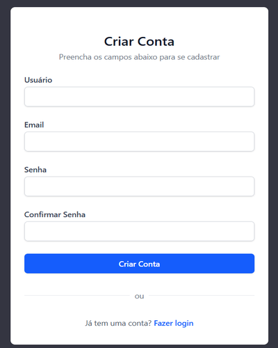

# `Criando a página de cadastro (create-account.html + DB Commands)`

## Conteúdo

 - [`Instalando o app "users" no settings.py`](#configure-users-app)
 - [`Criando a ROTA/URL create_account/`](#create-create-account-url)
 - [`Criando o formulário customizado CustomUserCreationForm()`](#custom-form)
 - [`Criando a view (ação) create_account()`](#create-account-view)
 - [`Criando a página de cadastro (create-account.html)`](#create-account-html)
 - [`Referenciando a página de cadastro (url 'create-account')`](#ref-create-account)
 - [`Configurando o Django para Português (Brasil)`](#internationalization-pt-br)
 - [`Verificando se os usários estão sendo gravados no Banco de Dados (DB Commands)`](#check-db)
<!---
[WHITESPACE RULES]
- 50
--->


---

<div id="configure-users-app"></div>

## `Instalando o app "users" no settings.py`

Aqui nós vamos instalar/configurar o app "users" no nosso `settings.py` (esse passo não havia sido feito ainda porque geraria um erro):

[settings.py](../../../core/settings.py)
```python

    ...

INSTALLED_APPS = [
    "django.contrib.admin",
    "django.contrib.auth",
    "django.contrib.contenttypes",
    "django.contrib.sessions",
    "django.contrib.messages",
    "django.contrib.staticfiles",
    "users",
]

    ...

```


---

<div id="create-create-account-url"></div>

## `Criando a ROTA/URL create_account/`

De início vamos começar configurando a ROTA/URL `create-account`:

[users/urls.py](../../../users/urls.py)
```python
from django.urls import path

from .views import create_account, login_view

urlpatterns = [

    ...

    path(
        route="create-account/",
        view=create_account,
        name="create-account"
    ),
]
```


---

<div id="custom-form"></div>

## `Criando o formulário customizado CustomUserCreationForm()`

> Agora, antes de criar a view (ação) que vai ser responsável por redirecionar o usuário para a página de cadastro (GET) e enviar os dados para o Banco de Dados (POST) vamos criar um formulário customizado.

Para fazer esse formulário customizado vamos criar o arquivo [users/forms.py](../../../users/forms.py) que nada mais é que um classe para criar um formulário genêrico para o nosso App `users` utilizando de tudo o que o Django já tem pronto:

[users/forms.py](../../../users/forms.py)
```python
from django import forms
from django.contrib.auth.forms import UserCreationForm
from django.contrib.auth.models import User


class CustomUserCreationForm(UserCreationForm):
    class Meta:
        model = User

        fields = [
            "username",
            "email",
            "password1",
            "password2"
        ]

        labels = {
            "username": "Usuário",
            "email": "Email",
            "password1": "Senha",
            "password2": "Confirmar Senha",
        }

        error_messages = {
            "username": {
                "unique": "Já existe um usuário com este nome.",
                "required": "O campo Usuário é obrigatório.",
            },
            "password2": {
                "password_mismatch": "As senhas não correspondem.",
            },
        }

    def clean_email(self):
        email = self.cleaned_data.get("email")

        if User.objects.filter(email=email).exists():
            raise forms.ValidationError(
                "Este e-mail já está cadastrado."
            )

        return email
```


---

<div id="create-account-view"></div>

## `Criando a view (ação) create_account()`

Agora vamos criar uma view (ação) para:

 - Quando alguém clicar em "Cadastrar" na [landing page (index.html)](../../../templates/pages/index.html) seja redirecionado para [página de cadastro (create-account.html)](../../../users/templates/pages/create-account.html).
 - E quando alguém cadastrar algum usuário (corretamente), ele seja salvo no Banco de Dados e depois redirecionado para a [landing page (index.html)](../../../templates/pages/index.html).

[users/views.py](../../../users/views.py)
```python
from django.contrib import messages
from django.shortcuts import redirect, render

from users.forms import CustomUserCreationForm


def create_account(request):

    if request.method == "GET":
        form = CustomUserCreationForm()
        return render(
            request,
            "pages/create-account.html",
            {"form": form}
        )

    elif request.method == "POST":
        form = CustomUserCreationForm(request.POST)

        if form.is_valid():
            form.save()
            messages.success(
                request,
                "Conta criada com sucesso! Faça login."
            )
            return redirect("/")

        messages.error(
            request,
            "Corrija os erros abaixo."
        )

        return render(
            request,
            "pages/create-account.html",
            {"form": form}
        )
```


---

<div id="create-account-html"></div>

## `Criando a página de cadastro (create-account.html)`

> **E o formulário de cadastro?**

Bem, aqui nós vamos criar um formulário (HTML) dinâmico usando os dados enviados pelo usuário:

```python
form = CustomUserCreationForm(request.POST)
return render(request, "pages/create-account.html", {"form": form})
```

O código completo para fazer isso é o seguinte:

[users/templates/pages/create-account.html](../../../users/templates/pages/create-account.html)
```html


Criar Conta



    <!-- ==================================================================== -->
    <!-- CONTEÚDO PRINCIPAL - ÁREA DE CADASTRO                                -->
    <!-- ==================================================================== -->
    
    <main class="min-h-screen flex items-center justify-center py-12 
                 px-4 sm:px-6 lg:px-8">
        
        <!-- ================================================================ -->
        <!-- CARD DE CADASTRO                                                 -->
        <!-- ================================================================ -->
        
        <div class="max-w-md w-full space-y-8 bg-white py-8 px-6 shadow 
                    rounded-lg">
            
            <!-- ============================================================ -->
            <!-- CABEÇALHO - TÍTULO                                           -->
            <!-- ============================================================ -->
            
            <div class="mb-6 text-center">
                <h2 class="mt-4 text-2xl font-semibold text-gray-900">
                    Criar Conta
                </h2>
                <p class="mt-1 text-sm text-gray-500">
                    Preencha os campos abaixo para se cadastrar
                </p>
            </div>

            <!-- ============================================================ -->
            <!-- MENSAGENS DO SISTEMA                                         -->
            <!-- ============================================================ -->
            
            <!-- Exibe mensagens de erro ou sucesso do Django -->
            
                <div class="mb-4">
                    
                        <div class="text-red-600 bg-red-100 
                                    border border-red-200 rounded-md 
                                    px-4 py-2 text-sm">
                            {{ message }}
                        </div>
                    
                </div>
            

            <!-- ============================================================ -->
            <!-- FORMULÁRIO DE CADASTRO                                       -->
            <!-- ============================================================ -->
            
            <form method="post" action="" class="space-y-6">
                <!-- Token CSRF para proteção contra ataques -->
                

                <!-- Erros gerais do formulário (não relacionados a campos) -->
                {{ form.non_field_errors }}

                <!-- Campo de Username -->
                <div>
                    <label for="{{ form.username.id_for_label }}"
                           class="block text-sm font-medium 
                                  text-gray-700">
                        Usuário
                    </label>
                    <div class="mt-1">
                        <input
                            type="text"
                            name="{{ form.username.name }}"
                            id="{{ form.username.id_for_label }}"
                            value="{{ form.username.value|default_if_none:'' }}"
                            class="appearance-none block w-full px-3 py-2 
                                   border border-gray-300 rounded-md 
                                   shadow-sm placeholder-gray-400 
                                   focus:outline-none focus:ring-2 
                                   focus:ring-blue-500 
                                   focus:border-blue-500 sm:text-sm"
                            required>
                    </div>
                    <!-- Exibe erros de validação do campo username -->
                    
                        <p class="text-sm text-red-600 mt-1">
                            {{ error }}
                        </p>
                    
                </div>

                <!-- Campo de Email -->
                <div>
                    <label for="{{ form.email.id_for_label }}"
                           class="block text-sm font-medium 
                                  text-gray-700">
                        Email
                    </label>
                    <div class="mt-1">
                        <input
                            type="email"
                            name="{{ form.email.name }}"
                            id="{{ form.email.id_for_label }}"
                            value="{{ form.email.value|default_if_none:'' }}"
                            class="appearance-none block w-full px-3 py-2 
                                   border border-gray-300 rounded-md 
                                   shadow-sm placeholder-gray-400 
                                   focus:outline-none focus:ring-2 
                                   focus:ring-blue-500 
                                   focus:border-blue-500 sm:text-sm"
                            required>
                    </div>
                    <!-- Exibe erros de validação do campo email -->
                    
                        <p class="text-sm text-red-600 mt-1">
                            {{ error }}
                        </p>
                    
                </div>

                <!-- Campo de Senha -->
                <div>
                    <label for="{{ form.password1.id_for_label }}"
                           class="block text-sm font-medium 
                                  text-gray-700">
                        Senha
                    </label>
                    <div class="mt-1">
                        <input
                            type="password"
                            name="{{ form.password1.name }}"
                            id="{{ form.password1.id_for_label }}"
                            class="appearance-none block w-full px-3 py-2 
                                   border border-gray-300 rounded-md 
                                   shadow-sm placeholder-gray-400 
                                   focus:outline-none focus:ring-2 
                                   focus:ring-blue-500 
                                   focus:border-blue-500 sm:text-sm"
                            required>
                    </div>
                    <!-- Exibe erros de validação do campo password1 -->
                    
                        <p class="text-sm text-red-600 mt-1">
                            {{ error }}
                        </p>
                    
                </div>

                <!-- Campo de Confirmar Senha -->
                <div>
                    <label for="{{ form.password2.id_for_label }}"
                           class="block text-sm font-medium 
                                  text-gray-700">
                        Confirmar Senha
                    </label>
                    <div class="mt-1">
                        <input
                            type="password"
                            name="{{ form.password2.name }}"
                            id="{{ form.password2.id_for_label }}"
                            class="appearance-none block w-full px-3 py-2 
                                   border border-gray-300 rounded-md 
                                   shadow-sm placeholder-gray-400 
                                   focus:outline-none focus:ring-2 
                                   focus:ring-blue-500 
                                   focus:border-blue-500 sm:text-sm"
                            required>
                    </div>
                    <!-- Exibe erros de validação do campo password2 -->
                    
                        <p class="text-sm text-red-600 mt-1">
                            {{ error }}
                        </p>
                    
                </div>

                <!-- Botão de Submit -->
                <div>
                    <button type="submit"
                            class="w-full flex justify-center py-2 px-4 
                                   border border-transparent rounded-md 
                                   shadow-sm text-sm font-medium 
                                   text-white bg-blue-600 hover:bg-blue-700 
                                   focus:outline-none focus:ring-2 
                                   focus:ring-offset-2 
                                   focus:ring-blue-500">
                        Criar Conta
                    </button>
                </div>

            </form>

            <!-- ============================================================ -->
            <!-- DIVISOR - SEPARADOR VISUAL                                   -->
            <!-- ============================================================ -->
            
            <div class="mt-6 relative">
                <div class="absolute inset-0 flex items-center">
                    <div class="w-full border-t border-gray-200"></div>
                </div>
                <div class="relative flex justify-center text-sm">
                    <span class="bg-white px-2 text-gray-500">ou</span>
                </div>
            </div>

            <!-- ============================================================ -->
            <!-- RODAPÉ - LINK PARA LOGIN                                     -->
            <!-- ============================================================ -->
            
            <p class="mt-6 text-center text-sm text-gray-600">
                Já tem uma conta?
                <a href="/" 
                   class="font-medium text-blue-600 
                          hover:text-blue-700">
                    Fazer login
                </a>
            </p>

        </div>

    </main>

```


---

<div id="ref-create-account"></div>

## `Referenciando a página de cadastro (url 'create-account')`

> Agora, nós precisamos referenciar que quando alguém clicar em "Cadastrar" na minha `Landing Page` (index.html) seja redirecionado para a `Página de cadastro` (create-account.html).

[index.html](../../../templates/pages/index.html)
```html
<p class="mt-6 text-center text-sm text-gray-600">
    Não tem conta?
    <a href="" 
        class="font-medium text-blue-600 
              hover:text-blue-700">
        Cadastrar
    </a>
</p>
```

Ótimo, agora vamos visualizar o resultado:

 - [http://localhost/create-account/](http://localhost/create-account/)

  


---

<div id="internationalization-pt-br"></div>

## `Configurando o Django para Português (Brasil)`

Agora tem um porém, se você digitar senhas que não coincidem ou tentar cadastrar um usuário que já existe você vai ter um erro, como:

 - `The two password fields didn’t match.`
 - `A user with that username already exists.`

> **⚠️ NOTE:**  
> Isso acontece porque o Django, por padrão, usa mensagens de *validação internas em inglês*.

Para resolver isso abra seu arquivo [core/settings.py](../../../core/settings.py) e localize (ou adicione, se não existir) as seguintes variáveis:

[core/settings.py](../../../core/settings.py)
```python
LANGUAGE_CODE = "pt-br"
TIME_ZONE = "America/Sao_Paulo"
USE_I18N = True
USE_TZ = True
```

Ótimo, agora suas mensagens de erro serão em português.


---

<div id="check-db"></div>

## `Verificando se os usários estão sendo gravados no Banco de Dados (DB Commands)`

> **Por fim, como eu sei que os usuários estão sendo gravados no Banco de Dados?**

Primeiro, vamos abrir o container que tem PostgreSQL:

```bash
task opendb
```

Agora vamos listar as tabelas:

```bash
\dt+
```

**OUTPUT:**
```bash
 Schema |            Name            | Type  |  Owner  | Persistence | Access method |    Size    | Description
--------+----------------------------+-------+---------+-------------+---------------+------------+-------------
 public | auth_group                 | table | raguser | permanent   | heap          | 0 bytes    |
 public | auth_group_permissions     | table | raguser | permanent   | heap          | 0 bytes    |
 public | auth_permission            | table | raguser | permanent   | heap          | 8192 bytes |
 public | auth_user                  | table | raguser | permanent   | heap          | 8192 bytes |
 public | auth_user_groups           | table | raguser | permanent   | heap          | 0 bytes    |
 public | auth_user_user_permissions | table | raguser | permanent   | heap          | 0 bytes    |
 public | django_admin_log           | table | raguser | permanent   | heap          | 8192 bytes |
 public | django_content_type        | table | raguser | permanent   | heap          | 8192 bytes |
 public | django_migrations          | table | raguser | permanent   | heap          | 16 kB      |
 public | django_session             | table | raguser | permanent   | heap          | 8192 bytes |
(10 rows)
```

Agora, vamos listas as colunas da tabela `auth_user`:

```bash
\d auth_user
```

**OUTPUT:**
```bash
                                     Table "public.auth_user"
    Column    |           Type           | Collation | Nullable |             Default
--------------+--------------------------+-----------+----------+----------------------------------
 id           | integer                  |           | not null | generated by default as identity
 password     | character varying(128)   |           | not null |
 last_login   | timestamp with time zone |           |          |
 is_superuser | boolean                  |           | not null |
 username     | character varying(150)   |           | not null |
 first_name   | character varying(150)   |           | not null |
 last_name    | character varying(150)   |           | not null |
 email        | character varying(254)   |           | not null |
 is_staff     | boolean                  |           | not null |
 is_active    | boolean                  |           | not null |
 date_joined  | timestamp with time zone |           | not null |
Indexes:
    "auth_user_pkey" PRIMARY KEY, btree (id)
    "auth_user_username_6821ab7c_like" btree (username varchar_pattern_ops)
    "auth_user_username_key" UNIQUE CONSTRAINT, btree (username)
Referenced by:
    TABLE "auth_user_groups" CONSTRAINT "auth_user_groups_user_id_6a12ed8b_fk_auth_user_id" FOREIGN KEY (user_id) REFERENCES auth_user(id) DEFERRABLE INITIALLY DEFERRED
    TABLE "auth_user_user_permissions" CONSTRAINT "auth_user_user_permissions_user_id_a95ead1b_fk_auth_user_id" FOREIGN KEY (user_id) REFERENCES auth_user(id) DEFERRABLE INITIALLY DEFERRED
    TABLE "django_admin_log" CONSTRAINT "django_admin_log_user_id_c564eba6_fk_auth_user_id" FOREIGN KEY (user_id) REFERENCES auth_user(id) DEFERRABLE INITIALLY DEFERRE
```

Por fim, vamos listar todos os usuários (com suas colunas) já cadastrados no Banco de Dados:

```bash
select * from auth_user;
```

**OUTPUT:**
```bash
 id |                                         password                                          |          last_login           | is_superuser | username | first_name | last_name |           email            | is_staff | is_active |          date_joined
----+-------------------------------------------------------------------------------------------+-------------------------------+--------------+----------+------------+-----------+----------------------------+----------+-----------+-------------------------------
  2 | pbkdf2_sha256$1000000$Q77ZUEe8nNZFT3DLvOBMRf$pLgNiCmXRUEaX0XGmC+JX8jTrNqS5I6QMVuutC3ypTw= |                               | f            | rodrigo  |            |           | rodrigo.praxedes@gmail.com | f        | t         | 2025-10-21 10:30:23.466991+00
  3 | pbkdf2_sha256$1000000$93BBiOAKodPLbmgJJtbfBY$HLYRqEN5oCfmZKsA0iGkbbG+KbITmlz26BDl2xRMGbs= | 2025-11-02 09:19:36.900889+00 | f            | romario  |            |           | romario@gmail.com          | f        | t         | 2025-10-28 00:52:23.111699+00
  4 | pbkdf2_sha256$1000000$AW4kQwpGOjvxBWaCg5EMkC$+YnHIhK29DhI8PMJQyx3SIuOnCHGUJgvuuc0XNDrEKs= | 2025-11-02 09:36:10.701396+00 | f            | brenda   |            |           | brenda@gmail.com           | f        | t         | 2025-11-02 09:36:05.24123+00
  1 | pbkdf2_sha256$1000000$TwwCgqC0kp0GRli3xEyzhO$5r01g9G+sbI99a9a6cvgky5XudMjI/ADg+t5wO+1tHw= | 2025-11-02 10:07:32.909962+00 | t            | drigols  |            |           | drigols.creative@gmail.com | t        | t         | 2025-10-21 09:01:46.482399+00
(4 rows)
```

---

**Rodrigo** **L**eite da **S**ilva - **rodirgols89**
