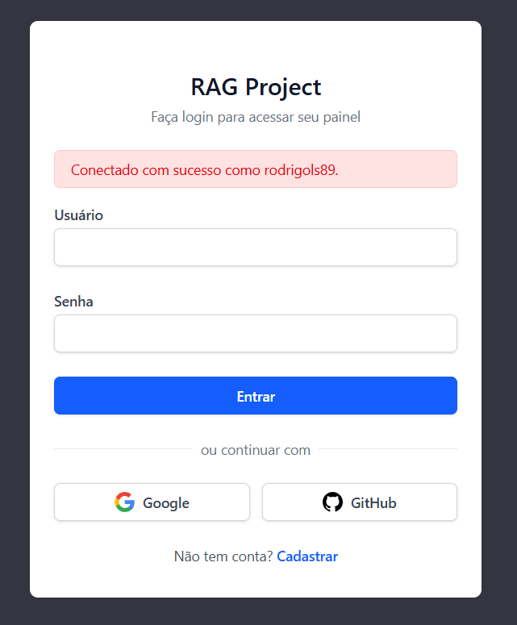

# `Instalando/Configurando o django-allauth (+Script de inicialização)`

## Conteúdo


<!---
[WHITESPACE RULES]
- 50
--->


---

<div id="social-login-google">

## `Como pegar as credenciais (chaves) do Google e adicionar no Django Admin`

> **⚠️ NOTE:**  
> Antes de criar os script/códigos para automatizar o processo de login social no Django Admin, precisamos pegar as credenciais do Google.

 - **Etapas no Console do Google:**
   - Acesse https://console.cloud.google.com/
   - Faça login e crie um novo projeto (ex: Easy RAG Auth).
   - No menu lateral, vá em:
     - APIs e serviços → Credenciais → Criar credenciais → ID do cliente OAuth 2.0
   - Clique no botão “Configure consent screen”
     - Clique em `Get started`
     - **Em App Information:**
       - `App name:`
         - Easy RAG
         - Esse nome aparecerá para o usuário quando ele for fazer login pelo Google.
       - `User support email:`
         - Selecione seu e-mail pessoal (ele aparece automaticamente no menu).
         - É usado pelo Google caso o usuário queira contato sobre privacidade.
       - Cli quem `next`
     - **Em Audience:**
       - Aqui o Google vai perguntar quem pode usar o aplicativo.
       - ✅ External (Externo):
         - Isso significa que qualquer usuário com uma conta Google poderá fazer login (ótimo para ambiente de testes e produção pública).
     - **Contact Information:**
       - O campo será algo como:
         - Developer contact email:
           - Digite novamente o mesmo e-mail (ex: seuemail@gmail.com)
         - Esse é o contato para eventuais notificações do Google sobre a aplicação.
     - **Finish:**
       - Revise as informações e clique em Create (botão azul no canto inferior esquerdo).
       - Isso cria oficialmente a tela de consentimento OAuth.

**✅ Depois que criar**

Você será redirecionado automaticamente para o painel de `OAuth consent screen`. De lá, basta voltar:

 - Ao menu lateral → APIs & Services → Credentials;
 - e aí sim o botão `+ Create credentials` → `OAuth client ID` ficará habilitado.

Agora escolha:

 - **Tipo de aplicativo:**
   - Aplicativo da Web
 - **Nome:**
   - Easy RAG - Django
 - **Em URIs autorizados de redirecionamento, adicione:**
   - http://localhost:8000/accounts/google/login/callback/
        - Se você também utilizar Django em um container: http://localhost/accounts/google/login/callback/
 - **Clique em Criar**
 - Copie o `Client ID` e o `Client Secret`

> **NOTE:**  
> Essas *informações (Client ID e Secret)* serão configuradas no admin do Django, não diretamente no código.

### `Registrando o provedor do Google Auth no Django Admin`

> **⚠️ NOTE:**  
> Esse passo não precisa ser feito, pois vamos automatizar o processo de login social no Django Admin.

 - **1️⃣ Acesse: http://localhost:/admin/**
 - **2️⃣ Vá em: Social Accounts → Social Applications → Add Social Application**
 - **3️⃣ Adicionando um `Site`:**
   - Selecione `Site`
   - Depois clique em `Adicionar Site`
   - Nome do domínio: `localhost`
   - Nome para exibição: `localhost`
   - Por fim, clique em `Salvar`
   - **NOTE:** Se tiver um site com o nome "example.com", pode remove
 - **4️⃣ Agora vá em: http://localhost/admin/socialaccount/socialapp/**
   - Provider (É um checkbox, selecione Google): Google
   - ID do provedor: Google
   - Name: Google Login
   - Client ID: (cole o do Google)
   - Secret Key: (cole o secret)
   - Por fim, vá em `Sites`:
     - *"Available sites"*
     - *"Choose sites by selecting them and then select the "Choose" arrow button"*
       - Adicione (Se não tiver): localhost
       - Selecione localhost e aperta na seta `->`
   - Finalmente é só clicar em `Salvar`


---

<div id="social-login-github">

## `Como pegar as credenciais (chaves) do GitHub e adicionar no Django Admin`

> **⚠️ NOTE:**  
> Antes de criar os script/códigos para automatizar o processo de login social no Django Admin, precisamos pegar as credenciais do GitHub.

### `Pegando as credenciais do GitHub`

 - Vá em https://github.com/settings/developers
 - Clique em OAuth Apps → New OAuth App
 - Preencha:
   - *Application name:* Easy RAG
   - *Homepage URL:* http://localhost
   - *Authorization callback URL:* http://localhost/accounts/github/login/callback/
 - Clique em `Register Application`
 - Copie o `Client ID`
 - Clique em `Generate new client secret` e copie o `Client Secret`

### `Registrando o provedor do GitHub Auth no Django Admin`

> **⚠️ NOTE:**  
> Esse passo não precisa ser feito, pois vamos automatizar o processo de login social no Django Admin.

 - **1️⃣ Acesse: http://localhost:/admin/**
 - **2️⃣ Vá em: Social Accounts → Social Applications → Add Social Application**
 - **(Se já tiver feito, ignore) 3️⃣ Adicionando um `Site`:**
   - Selecione `Site`
   - Depois clique em `Adicionar Site`
   - Nome do domínio: `localhost`
   - Nome para exibição: `localhost`
   - Por fim, clique em `Salvar`
   - **NOTE:** Se tiver um site com o nome "example.com", pode remove
 - **4️⃣ Agora vá em: http://localhost/admin/socialaccount/socialapp/**
   - Provider (É um checkbox, selecione GitHub): GitHub
   - ID do provedor: GitHub
   - Name: GitHub Login
   - Client ID: (cole o do GitHub)
   - Secret Key: (cole o secret)
   - Por fim, vá em `Sites`:
     - *"Available sites"*
     - *"Choose sites by selecting them and then select the "Choose" arrow button"*
       - Adicione (Se não tiver): localhost
       - Selecione localhost e aperta na seta `->`
   - Finalmente é só clicar em `Salvar`


---

<div id="add-env"></div>

## `Adicionando as variáveis de ambiente (.env)`

Para criar um super usuário automaticamente e configurar os logins sociais, vamos precisar de algumas variáveis de ambiente:

```bash
# ============================================================================
# CONFIGURAÇÃO DO DJANGO
# ============================================================================
DJANGO_SUPERUSER_USERNAME=your-username  # Nome de usuário do superusuário
DJANGO_SUPERUSER_EMAIL=your-email        # Email do superusuário
DJANGO_SUPERUSER_PASSWORD=your-password  # Senha do superusuário
DJANGO_SITE_ID=1
DJANGO_SITE_DOMAIN=localhost
DJANGO_SITE_NAME=localhost


# ============================================================================
# GOOGLE E GITHUB OAUTH
# ============================================================================
GOOGLE_CLIENT_ID=your_google_client_id
GOOGLE_CLIENT_SECRET=your_google_client_secret

GITHUB_CLIENT_ID=your_github_client_id
GITHUB_CLIENT_SECRET=your_github_client_secret
```

> **⚠️ NOTE:**  
> Essas variáveis de ambiente serão usadas no nosso script e ele será executado automaticamente quando o container inicia.


---

<div id="update-docker-compose"></div>

## `Atualizando o docker-compose.yml`

Agora, nós vamos modificar o nosso [docker-compose.yml](../../../docker-compose.yml), em específico o container `web (com django)` para não ter aqueles comandos de inicialização:

**ANTES:** [docker-compose.yml](../../../docker-compose.yml)
```yml
command: >
  sh -c "
  until nc -z ${POSTGRES_HOST} ${POSTGRES_PORT}; do
    echo '⏳ Waiting for Postgres...';
    sleep 2;
  done &&
  python manage.py migrate &&
  python manage.py collectstatic --noinput &&
  python manage.py runserver ${DJANGO_HOST:-0.0.0.0}:${DJANGO_PORT:-8000}
  "
```

**AGORA:** [docker-compose.yml](../../../docker-compose.yml)
```yml
services:
  web:
    build:
      context: .
      dockerfile: Dockerfile
    container_name: django
    restart: always
    env_file: .env
    stdin_open: true
    tty: true
    volumes:
      - .:/code
      - ./static:/code/staticfiles
      - ./media:/code/media
    expose:
      - "8000"
    networks:
      - backend

networks:
  backend:
    driver: bridge
```


---

<div id="create-command-class"></div>

## `Criando o código Python para criar um super usuário e configurar os provedores sociais`

Agora, nós vamos criar um script Python que será responsável por:

 - **🧰 Cria um "Management Command" do Django**
   - Define um comando customizado que pode ser executado com:
     - `python manage.py setup_social_providers`
   - Esse comando será chamado automaticamente no:
     - `entrypoint.sh`
 - **🌐 Lê as variáveis de ambiente do django.contrib.sites**
   - Ele pega do `.env`:
     - `DJANGO_SITE_ID`
     - `DJANGO_SITE_DOMAIN`
     - `DJANGO_SITE_NAME`
   - Se não existir, usa:
     - ID = 1
     - Domain = localhost:8000
     - Name = localhost
 - **🏗️ Garante que o Site existe no banco**
 - **🔐 Configura OAuth do Google**
   - Ele lê:
     - `GOOGLE_CLIENT_ID`
     - `GOOGLE_CLIENT_SECRET`
 - **🔐 Configura OAuth do GitHub**
   - Repete o mesmo processo, lê:
     - `GITHUB_CLIENT_ID`
     - `GITHUB_CLIENT_SECRET`

### `Código Completo`

[users/management/commands/setup_social_providers.py](../../../users/management/commands/setup_social_providers.py)
```python
import os

from allauth.socialaccount.models import SocialApp
from django.contrib.sites.models import Site
from django.core.management.base import BaseCommand


class Command(BaseCommand):
    help = (
        'Configura provedores sociais (Google e GitHub) a partir de '
        'variáveis de ambiente'
    )

    def handle(self, *args, **options):
        site_id = int(os.getenv("DJANGO_SITE_ID", "1"))
        site_domain = os.getenv(
            "DJANGO_SITE_DOMAIN", "localhost:8000"
        )
        site_name = os.getenv("DJANGO_SITE_NAME", "localhost")

        try:
            site = Site.objects.get(id=site_id)
            # Atualiza o site se ainda estiver com valores padrão
            if site.domain != site_domain or site.name != site_name:
                site.domain = site_domain
                site.name = site_name
                site.save()
                self.stdout.write(
                    self.style.SUCCESS(
                        f'Site {site_id} atualizado: '
                        f'domain="{site_domain}", name="{site_name}"'
                    )
                )
        except Site.DoesNotExist:
            self.stdout.write(
                self.style.ERROR(
                    f'Site com ID {site_id} não encontrado. Criando...'
                )
            )
            site = Site.objects.create(
                id=site_id,
                domain=site_domain,
                name=site_name
            )
            self.stdout.write(
                self.style.SUCCESS(
                    f'Site {site_id} criado: '
                    f'domain="{site_domain}", name="{site_name}"'
                )
            )

        # Configurar Google
        google_client_id = os.getenv("GOOGLE_CLIENT_ID")
        google_client_secret = os.getenv("GOOGLE_CLIENT_SECRET")

        if google_client_id and google_client_secret:
            social_app, created = SocialApp.objects.get_or_create(
                provider='google',
                defaults={
                    'name': 'Google',
                    'client_id': google_client_id,
                    'secret': google_client_secret,
                }
            )

            if not created:
                # Atualiza se já existir
                social_app.client_id = google_client_id
                social_app.secret = google_client_secret
                social_app.save()
                self.stdout.write(
                    self.style.WARNING('SocialApp Google atualizado.')
                )
            else:
                self.stdout.write(
                    self.style.SUCCESS(
                        'SocialApp Google criado com sucesso.'
                    )
                )

            # Garante que o site está associado
            if site not in social_app.sites.all():
                social_app.sites.add(site)
                self.stdout.write(
                    self.style.SUCCESS(
                        f'Site {site_id} associado ao Google.'
                    )
                )
        else:
            self.stdout.write(
                self.style.WARNING(
                    'Variáveis GOOGLE_CLIENT_ID ou '
                    'GOOGLE_CLIENT_SECRET não encontradas. '
                    'Pulando configuração do Google.'
                )
            )

        # Configurar GitHub
        github_client_id = os.getenv("GITHUB_CLIENT_ID")
        github_client_secret = os.getenv("GITHUB_CLIENT_SECRET")

        if github_client_id and github_client_secret:
            social_app, created = SocialApp.objects.get_or_create(
                provider='github',
                defaults={
                    'name': 'GitHub',
                    'client_id': github_client_id,
                    'secret': github_client_secret,
                }
            )

            if not created:
                # Atualiza se já existir
                social_app.client_id = github_client_id
                social_app.secret = github_client_secret
                social_app.save()
                self.stdout.write(
                    self.style.WARNING('SocialApp GitHub atualizado.')
                )
            else:
                self.stdout.write(
                    self.style.SUCCESS(
                        'SocialApp GitHub criado com sucesso.'
                    )
                )

            # Garante que o site está associado
            if site not in social_app.sites.all():
                social_app.sites.add(site)
                self.stdout.write(
                    self.style.SUCCESS(
                        f'Site {site_id} associado ao GitHub.'
                    )
                )
        else:
            self.stdout.write(
                self.style.WARNING(
                    'Variáveis GITHUB_CLIENT_ID ou '
                    'GITHUB_CLIENT_SECRET não encontradas. '
                    'Pulando configuração do GitHub.'
                )
            )
```


---

<div id="update-entrypoint"></div>

## `Atualizando o script de inicialização (entrypoint.sh)`

Até, então o nosso script de inicialização só:

 - Criava os diretórios: `media/`, `static/` e `staticfiles/`;
 - Ajustava permissões e ownership desses diretórios;
 - Trovaca de usuário quando necessário.

Agora o nosso script de inicialização também vai:

 - Preparar automaticamente o ambiente do Django toda vez que o container subir:
   - Criar o superusuário;
   - Configurar os logins sociais;
   - Configurar o site;
 - Rodar tudo com um usuário seguro (appuser) em vez de root
 - Evitar configuração manual no /admin (superuser + OAuth)

[entrypoint.sh](../../../entrypoint.sh)
```bash
#!/bin/bash
set -e

# ============================================================================
# Configuração de diretórios e permissões
# ============================================================================

setup_directories() {
    # Cria diretórios necessários se não existirem
    mkdir -p /code/media /code/staticfiles

    # Ajusta permissões e ownership dos diretórios
    # Garante que o usuário appuser (UID 1000) possa escrever neles
    chmod -R 755 /code/media /code/staticfiles

    # Obtém o UID do appuser (geralmente 1000)
    APPUSER_UID=$(id -u appuser 2>/dev/null || echo "1000")
    APPUSER_GID=$(id -g appuser 2>/dev/null || echo "1000")

    # Ajusta ownership se estiver rodando como root
    if [ "$(id -u)" = "0" ]; then
        chown -R ${APPUSER_UID}:${APPUSER_GID} \
            /code/media /code/staticfiles 2>/dev/null || true
    fi
}

# ============================================================================
# Funções de inicialização do Django
# ============================================================================

wait_for_postgres() {
    # Aguarda o PostgreSQL estar pronto
    until nc -z ${POSTGRES_HOST} ${POSTGRES_PORT}; do
        echo '⏳ Waiting for Postgres...'
        sleep 2
    done
    echo '✅ Postgres is ready!'
}

run_migrations() {
    echo '🔄 Running migrations...'
    python manage.py migrate
}

collect_static_files() {
    echo '📦 Collecting static files...'
    python manage.py collectstatic --noinput
}

create_superuser() {
    echo '👤 Checking for superuser...'
    if [ -n "$DJANGO_SUPERUSER_USERNAME" ] && \
       [ -n "$DJANGO_SUPERUSER_EMAIL" ] && \
       [ -n "$DJANGO_SUPERUSER_PASSWORD" ]; then
        python manage.py shell << PYEOF
from django.contrib.auth import get_user_model
User = get_user_model()
if not User.objects.filter(
    username="${DJANGO_SUPERUSER_USERNAME}"
).exists():
    User.objects.create_superuser(
        "${DJANGO_SUPERUSER_USERNAME}",
        "${DJANGO_SUPERUSER_EMAIL}",
        "${DJANGO_SUPERUSER_PASSWORD}"
    )
    print("✅ Superuser created successfully!")
else:
    print("ℹ️  Superuser already exists, skipping creation.")
PYEOF
    else
        echo '⚠️  Superuser environment variables not set, ' \
             'skipping superuser creation.'
    fi
}

setup_social_providers() {
    echo '🔐 Setting up social providers...'
    python manage.py setup_social_providers
}

start_django_server() {
    echo '🚀 Starting Django server...'
    exec python manage.py runserver \
        ${DJANGO_HOST:-0.0.0.0}:${DJANGO_PORT:-8000}
}

# ============================================================================
# Inicialização completa do Django
# ============================================================================

init_django() {
    wait_for_postgres
    run_migrations
    collect_static_files
    create_superuser
    setup_social_providers
    start_django_server
}

# ============================================================================
# Script principal
# ============================================================================

main() {
    # Configura diretórios e permissões
    setup_directories

    # Se estiver rodando como root
    if [ "$(id -u)" = "0" ]; then
        # Se não houver comando passado ou se for o comando padrão/bash,
        # executa inicialização completa
        if [ $# -eq 0 ] || [ "$1" = "bash" ]; then
            # Executa a inicialização como appuser usando heredoc
            # para preservar o contexto das funções
            exec gosu appuser bash << 'INIT_SCRIPT'
set -e

# Aguarda o PostgreSQL estar pronto
until nc -z ${POSTGRES_HOST} ${POSTGRES_PORT}; do
  echo '⏳ Waiting for Postgres...'
  sleep 2
done

echo '✅ Postgres is ready!'

# Executa migrations
echo '🔄 Running migrations...'
python manage.py migrate

# Coleta arquivos estáticos
echo '📦 Collecting static files...'
python manage.py collectstatic --noinput

# Cria super usuário se não existir
echo '👤 Checking for superuser...'
if [ -n "$DJANGO_SUPERUSER_USERNAME" ] && \
   [ -n "$DJANGO_SUPERUSER_EMAIL" ] && \
   [ -n "$DJANGO_SUPERUSER_PASSWORD" ]; then
  python manage.py shell << PYEOF
from django.contrib.auth import get_user_model
User = get_user_model()
if not User.objects.filter(
    username="${DJANGO_SUPERUSER_USERNAME}"
).exists():
    User.objects.create_superuser(
        "${DJANGO_SUPERUSER_USERNAME}",
        "${DJANGO_SUPERUSER_EMAIL}",
        "${DJANGO_SUPERUSER_PASSWORD}"
    )
    print("✅ Superuser created successfully!")
else:
    print("ℹ️  Superuser already exists, skipping creation.")
PYEOF
else
  echo '⚠️  Superuser environment variables not set, ' \
       'skipping superuser creation.'
fi

# Configura provedores sociais
echo '🔐 Setting up social providers...'
python manage.py setup_social_providers

# Inicia o servidor
echo '🚀 Starting Django server...'
exec python manage.py runserver \
    ${DJANGO_HOST:-0.0.0.0}:${DJANGO_PORT:-8000}
INIT_SCRIPT
        else
            # Executa o comando passado como appuser
            exec gosu appuser "$@"
        fi
    else
        # Se já estiver rodando como appuser e não houver comando,
        # executa inicialização
        if [ $# -eq 0 ] || [ "$1" = "bash" ]; then
            init_django
        else
            # Executa o comando passado
            exec "$@"
        fi
    fi
}

# Executa o script principal
main "$@"
```

> **E aqueles comandos que tinha no meu docker-compose, onde (em que parte do código) serão executados?**

 - **ONDE ESTÃO SENDO EXECUTADOS:**
   - Os comandos agora estão executados no [entrypoint.sh](../../../entrypoint.sh).
 - **EM QUE PARTE DO CÓDIGO:**
   - O [entrypoint.sh](../../../entrypoint.sh) é executado automaticamente quando o container inicia, porque:
     - No [Dockerfile](../../../Dockerfile), o ENTRYPOINT está definido como ["/entrypoint.sh"] (linha 54 do Dockerfile).
     - No [docker-compose.yml](../../../docker-compose.yml), o serviço web não tem um command: definido (foi removido).
     - Quando não há **command:** no docker-compose, o Docker usa o *CMD* do [Dockerfile](../../../Dockerfile), que é ["bash"] (linha 69 do Dockerfile).


---

<div id="install-allauth">

## `Instalando o django-allauth e suas dependências`

Até, agora nós só implementamos os códigos de criação, mas também vamos precisar instalar o `django-allauth` e suas dependências:

```bash
docker compose exec web poetry add PyJWT@latest
```

```bash
docker compose exec web poetry add cryptography@latest
```

```bash
docker compose exec web poetry add requests@latest
```

```bash
docker compose exec web poetry add django-allauth@latest
```

Novamente, lembre-se de importar essas bibliotecas para os nossos `requirements.txt`:

```bash
task exportdev
```

```bash
task exportprod
```


---

<div id="add-accounts-url"></div>

## `Adicionando a URL accounts/ no nosso core/urls.py`

> O `django-allauth` nos disponibiliza vários mecanismos prontos para adicionar *autenticação social (OAuth)* e *funcionalidades de conta (login, logout, registro, verificação de e-mail)* ao nosso projeto Django.

A primeira coisa que nós devemos fazer para ter acesso a esses mecanismos é adicionar a URL `accounts/` ao nosso `core/urls.py`:

[core/urls.py](../../../core/urls.py)
```python
from django.contrib import admin
from django.urls import include, path

urlpatterns = [
    path('admin/', admin.site.urls),
    path('', include('users.urls')),
    path("accounts/", include("allauth.urls")),
]
```


---


<div id="configuring-settings-py"></div>

## `Configurando o settings.py para reconhecer o django-allauth`

Agora, nós vamos adicionar os *Apps* e *Middlewares* `django-allauth` necessários no `settings.py`:

[core/settings.py](../../../core/settings.py)
```python
INSTALLED_APPS = [
    # Apps padrão do Django
    "django.contrib.admin",
    "django.contrib.auth",
    "django.contrib.contenttypes",
    "django.contrib.sessions",
    "django.contrib.messages",
    "django.contrib.staticfiles",

    # Obrigatório pro allauth
    "django.contrib.sites",

    # Apps principais do allauth
    "allauth",
    "allauth.account",
    "allauth.socialaccount",

    # Provedores de login social
    "allauth.socialaccount.providers.google",  # 👈 habilita login com Google
    "allauth.socialaccount.providers.github",  # 👈 habilita login com GitHub

    # Seus apps
    "users",
]

MIDDLEWARE = [
    'django.middleware.security.SecurityMiddleware',
    'django.contrib.sessions.middleware.SessionMiddleware',
    'django.middleware.common.CommonMiddleware',
    'django.middleware.csrf.CsrfViewMiddleware',
    'django.contrib.auth.middleware.AuthenticationMiddleware',

    # ✅ Novo middleware exigido pelo Django Allauth
    'allauth.account.middleware.AccountMiddleware',

    'django.contrib.messages.middleware.MessageMiddleware',
    'django.middleware.clickjacking.XFrameOptionsMiddleware',
]
```

 - `django.contrib.sites`
   - App do Django que permite associar configurações a um Site (domínio) — o allauth usa isso para saber qual domínio/URL usar para callbacks OAuth.
   - Você precisará criar/ajustar um Site no admin (ou via fixtures) com SITE_ID = 1 (ver mais abaixo).
 - `allauth, allauth.account, allauth.socialaccount`
   - `allauth` é o pacote principal;
   - `account` fornece funcionalidade de conta (registro, login local, confirmação de e-mail);
   - `socialaccount` é a camada que integra provedores OAuth (Google, GitHub, etc.).
 - `allauth.socialaccount.providers.google, allauth.socialaccount.providers.github`
   - Provedores prontos do allauth — carregam os adaptadores e rotas específicas para cada provedor.
   - Adicione apenas os provedores que você pretende suportar (pode ativar mais tarde).

Também, vamos adicionar `context_processors.request` e configurar:

[core/settings.py](../../../core/settings.py)
```python
TEMPLATES = [
    {
        'BACKEND': 'django.template.backends.django.DjangoTemplates',
        'DIRS': [BASE_DIR / 'templates'],
        'APP_DIRS': True,
        'OPTIONS': {
            'context_processors': [
                'django.template.context_processors.debug',
                'django.template.context_processors.request',  # <- Necessário para allauth
                'django.contrib.auth.context_processors.auth',
                'django.template.context_processors.media',
                'django.template.context_processors.static',
                'django.template.context_processors.tz',
                'django.contrib.messages.context_processors.messages',
            ],
        },
    },
]
```

Outras configurações importantes no `settings.py` são as seguintes:

[core/settings.py](../../../core/settings.py)
```python
##############################################################################
# Django Allauth                                                             #
##############################################################################

# AUTHENTICATION_BACKENDS — combine o backend padrão com o do allauth
AUTHENTICATION_BACKENDS = [
    "django.contrib.auth.backends.ModelBackend",            # Seu login normal
    "allauth.account.auth_backends.AuthenticationBackend",  # Login social
]

LOGIN_REDIRECT_URL = "/home/"  # ou o nome da rota que preferir
LOGOUT_REDIRECT_URL = "/"      # para onde o usuário vai depois do logout

# Permitir login apenas com username (pode ser {'username', 'email'} se quiser os dois)
ACCOUNT_LOGIN_METHODS = {"username"}

# Campos obrigatórios no cadastro (asterisco * indica que o campo é requerido)
ACCOUNT_SIGNUP_FIELDS = ["email*", "username*", "password1*", "password2*"]
ACCOUNT_EMAIL_VERIFICATION = "optional"  # "mandatory" em produção
SOCIALACCOUNT_LOGIN_ON_GET = True

# CSRF
CSRF_TRUSTED_ORIGINS = [
    "http://localhost:8000",
    "http://localhost",
]

# Cookies
CSRF_COOKIE_SAMESITE = "Lax"
SESSION_COOKIE_SAMESITE = "Lax"

# Segurança
CSRF_COOKIE_SECURE = False     # True em produção
SESSION_COOKIE_SECURE = False  # True em produção

# HTTPS
USE_X_FORWARDED_HOST = True
SECURE_PROXY_SSL_HEADER = ('HTTP_X_FORWARDED_PROTO', 'https')
```

 - `LOGIN_REDIRECT_URL = "/home/"`
   - **O que faz?**
     - URL para onde o usuário é redirecionado após login bem-sucedido.
 - `LOGOUT_REDIRECT_URL = "/"`
   - **O que faz?**
     - URL para onde o usuário vai após logout.
 - `ACCOUNT_LOGIN_METHODS = {"username"}`
   - **O que faz?**
     - Define como o usuário pode fazer login
     - `"username"` -> Login só com username.
     - `"email"` -> Login só com email.
     - `"username_email"` -> Aceita os dois.
   - **nosso caso caso:**
     - `{"username"}`
     - ➡️ O usuário só pode logar usando username.
     - ❌ Email não é aceito para login.
 - `ACCOUNT_SIGNUP_FIELDS = ["email*", "username*", "password1*", "password2*"]`
   - **O que faz?**
     - Define quais campos aparecem no cadastro e se são obrigatórios.
     - O `*` significa 👉 Campo obrigatório
 - `ACCOUNT_EMAIL_VERIFICATION = "optional"`
   - **O que faz?**
     - Define se o email precisa ser confirmado ou não.
     - `"mandatory"` -> Usuário **não pode logar** sem confirmar email.
     - `"optional"` -> Email pode ser confirmado depois.
     - `"none"` -> Nenhuma verificação.


---

## `Linkando os botões de login social`

 - Até aqui, nós configuramos o `django-allauth` para registrar os provedores (Google e GitHub) no painel administrativo.
 - Agora, nós vamos fazer com que os botões **“Entrar com Google”** e **“Entrar com GitHub”** funcionem de verdade, conectando o *front-end* com o *allauth*.

[templates/pages/index.html](../../../templates/pages/index.html)
```html



<!-- Botão de Login com Google -->
<div>
    <a href=""
        class="w-full inline-flex justify-center 
              items-center py-2 px-4 border 
              border-gray-300 rounded-md 
              shadow-sm bg-white hover:bg-gray-50">
        <!-- Ícone do Google -->
        
        <span class="text-sm font-medium 
                      text-gray-700">
            Google
        </span>
    </a>
</div>


<!-- Botão de Login com GitHub -->
<div>
    <a href=""
        class="w-full inline-flex justify-center 
              items-center py-2 px-4 border 
              border-gray-300 rounded-md 
              shadow-sm bg-white hover:bg-gray-50">
        <!-- Ícone do GitHub -->
        
        <span class="text-sm font-medium 
                      text-gray-700">
            GitHub
        </span>
    </a>
</div>
```

**Explicação das principais partes do código:**

**🧩 Herança do template e carregamento de tags**
```html

```

 - ``
   - Importa os templates tags fornecidas pelo `django-allauth (ex.: )`.
   - Sem esse `load`, as tags sociais nao seriam reconhecidas pelo template engine.

**🧩 Botões de login social (links gerados pelo allauth)**
```html
<a href="">
    ...
</a>

<a href="">
    ...
</a>
```

 - **O que faz?**
   - `` e ``
     - Geram as URLs corretas para iniciar o fluxo `OAuth` com *Google* e *GitHub* (fornecidas pelo django-allauth).
     - Os `<a>` envolvem botões visuais que, ao clicar, redirecionam o usuário para o provedor externo.
 - **Por que é importante?**
   - Conecta o front-end ao sistema de login social do allauth.
   - O allauth cuida de gerar a URL correta, adicionar parâmetros e tratar callbacks.

Agora quando você clicar para logar com o **Google** ou **GitHub** você será redirecionado para o provedor externo, onde ele irá perguntar ao usuário se ele quer permitir o acesso ao seu perfil ou não:

  

**NOTE:**  
Porém, nesse exemplo acima nós não somos redirecionados diretamente para os provedores externos do google e github respectivamente. Primeiro, nós passamos por páginas internas do allauth e depois redirecionamos para eles.

> **Tem como ir diretor para os provedores externos do Google e GitHub sem passar por essas páginas do allauth?**

**SIM!**  
Para isso nós precisamos configurar [settings.py](../../../core/settings.py) para que o allauth redirecione diretamente para os provedores externos:

[core/settings.py](../../../core/settings.py)
```python
##############################################################################
# Django Allauth                                                             #
##############################################################################

SOCIALACCOUNT_LOGIN_ON_GET = True
```

 - `SOCIALACCOUNT_LOGIN_ON_GET = True`
   - Quando `True`, o allauth redireciona diretamente para o provedor externo ao clicar nos botões de login.
   - **NOTE:** Por padrão, ele vem como `False`.


---

## `Reescrevendo as mensagens do Django Allauth`

Continuando, aqui nós temos um probleminha, quando nós deslogamos com alguma das contas sociais aparece uma mensagem na nossa página principal (langin page):

  

É como se fosse o *"resto"* de uma mensagem do Django depois do login!

> **Como resolver isso?**

#### `Criando um adapter.py`

O arquivo [adapter.py](../../../users/adapter.py) serve para *personalizar o comportamento interno do Django Allauth*, que é o sistema responsável pelos *logins*, *logouts* e *cadastros* — tanto locais quanto via provedores sociais (como Google e GitHub).

Por padrão, o Allauth envia automaticamente mensagens para o sistema de mensagens do Django (django.contrib.messages), exibindo textos como:

 - **“Successfully signed in as rodrigols89.”**
 - **“You have signed out.”**
 - **“Your email has been confirmed.”**

Essas mensagens são geradas dentro dos adapters do `Allauth` — classes que controlam como ele interage com o Django.

Agora, vamos criar (recriar) nossas versões personalizadas dos adapters (`NoMessageAccountAdapter` e `NoMessageSocialAccountAdapter`) para impedir que essas mensagens automáticas sejam exibidas.

> **NOTE:**  
> Assim, temos controle total sobre quais mensagens aparecem para o usuário — mantendo o front mais limpo e sem textos gerados automaticamente.

[users/adapter.py](../../../users/adapter.py)
```python
from allauth.account.adapter import DefaultAccountAdapter
from allauth.socialaccount.adapter import (
    DefaultSocialAccountAdapter
)


class NoMessageAccountAdapter(DefaultAccountAdapter):
    def add_message(
        self,
        request,
        level,
        message_template,
        message_context=None
    ):
        return


class NoMessageSocialAccountAdapter(DefaultSocialAccountAdapter):
    def add_message(
        self,
        request,
        level,
        message_template,
        message_context=None
    ):
        return
```

Por fim, vamos fazer nossos adapters serem usados em `settings.py`:

[settings.py](../../../core/settings.py)
```python
ACCOUNT_ADAPTER = "users.adapter.NoMessageAccountAdapter"
SOCIALACCOUNT_ADAPTER = "users.adapter.NoMessageSocialAccountAdapter"
```

 - Use o caminho Python completo para a classe.
 - No exemplo acima assumimos que:
   - O app se chama `users`;
   - No arquivo `adapter`;
   - Estamos chamando as classes: `NoMessageAccountAdapter` e `NoMessageSocialAccountAdapter`.

Por fim, reinicie o servidor (python manage.py runserver) depois de editar `settings.py` para que as mudanças tenham efeito.

---

**Rodrigo** **L**eite da **S**ilva - **rodirgols89**
