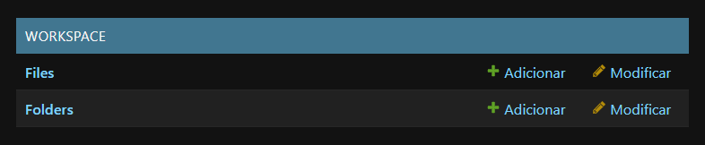
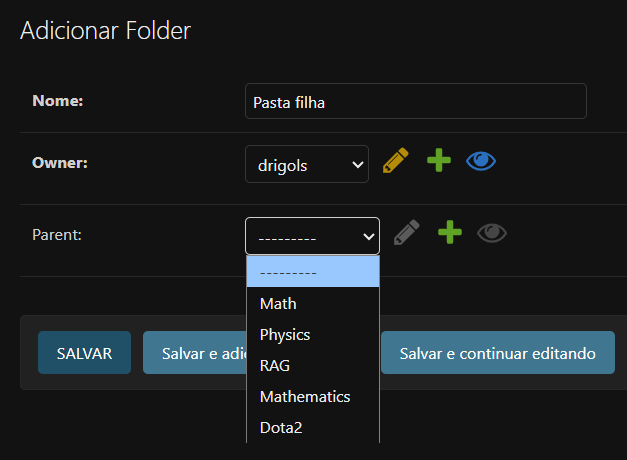
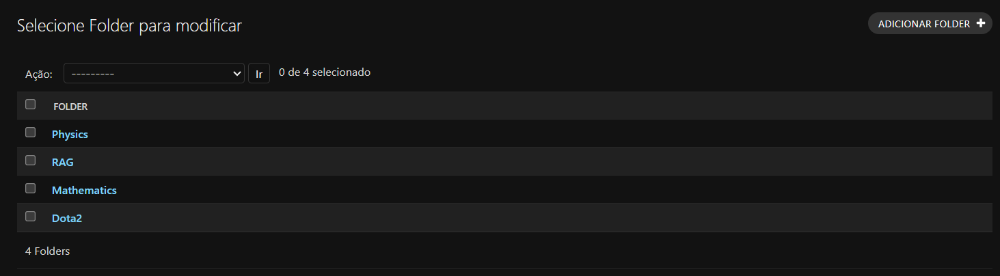
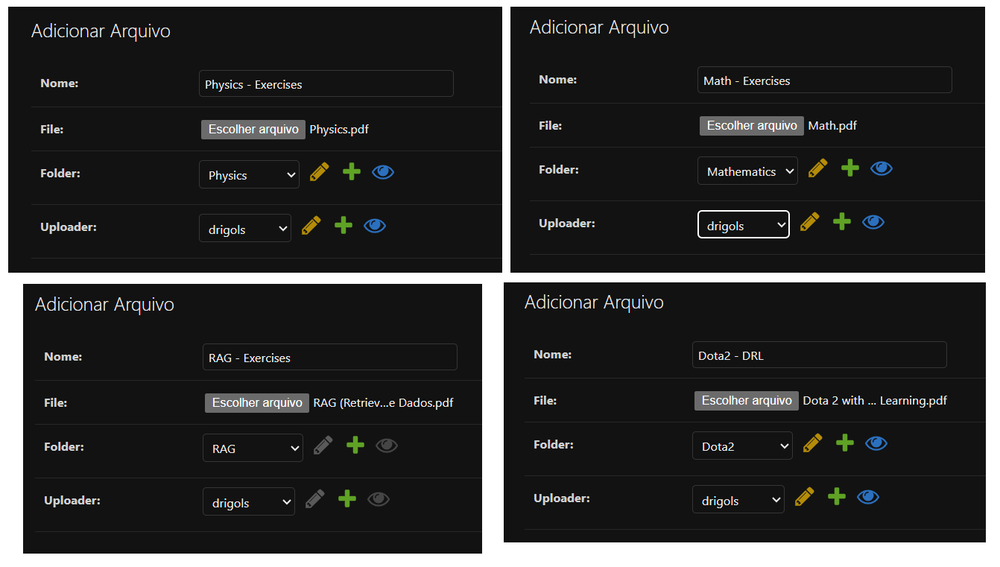
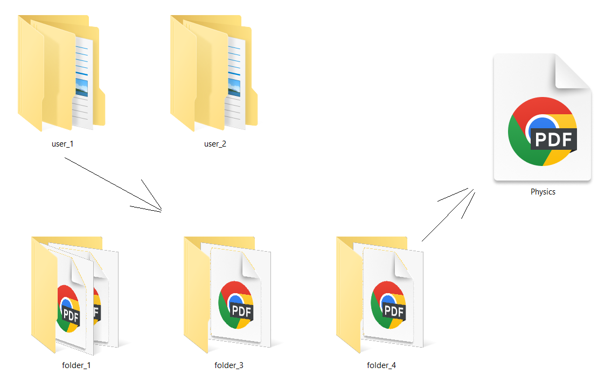

# `Modelando (e entendendo) o workspace: Pastas (Folders) e Arquivos (Files)`

## Conteúdo

 - [`O que vamos fazer aqui? (Entendendo como os arquivos/pastas serão salvos)`](#oqvfa)
 - [`Função workspace_upload_to()`](#worksace-upload-to)
 - [`Classe Folder()`](#class-folder)
 - [`Classe File()`](#class-file)
 - [`Migrando o App "workspace"`](#apply-migrations)
 - [`Registrando (testando manualmente) os modelos (Folder, File) no Django Admin`](#django-admin)
<!---
[WHITESPACE RULES]
- 50
--->


---

<div id="oqvfa">

## `O que vamos fazer aqui? (Entendendo como os arquivos/pastas serão salvos)`

Para entender o que vai ser feito nesta feature, vamos começar com a seguinte pergunta:

> **Onde vai ser salvo os arquivos e pastas do projeto?**

* salva o **arquivo físico no disco**
* dentro do seu:

```bash
MEDIA_ROOT
```

Ou seja:

```bash
/code/media/workspace/user_1/folder_4/Physics.pdf
```

> 👉 Isso está **no filesystem do container**

E no **PostgreSQL** fica só:

```bash
workspace/user_1/folder_4/Physics.pdf
```

Ou seja:

| Banco (PostgreSQL) | Disco (media/) |
| ------------------ | -------------- |
| Caminho do arquivo | Arquivo real   |
| uploader_id        | Conteúdo       |
| folder_id          | Bytes do PDF   |
| uploaded_at        | etc            |

### `Onde as empresas costumam salvar arquivos/pastas?`

> Empresas **não salvam (quase nunca) arquivos dentro do PostgreSQL**.

Porque, salvar isso:

```bash
20MB
```

dentro do banco:

* explode o tamanho do DB
* destrói performance de backup
* replica lentíssimo
* aumenta custo de storage
* degrada queries

Banco é feito para:

> 🔹 Metadados
> 🔹 Relacionamentos
> 🔹 Índices
> 🔹 Queries

Não para armazenar binários pesados.

> **🏢 Como empresas fazem no mundo real?**

### `🗄️ Banco de Dados (PostgreSQL)`

Guarda:

```bash
id
user_id
folder_id
file_name
storage_path
file_size
mime_type
created_at
```

### `☁️ Object Storage (NÃO banco)`

Guarda:

```bash
O ARQUIVO REAL (PDF, JPG, CSV, etc)
```

Exemplos:

* Amazon S3
* Google Cloud Storage
* Cloudflare R2
* MinIO

### `📦 Exemplo real (tipo Instagram)`

Upload de imagem:

1. Usuário envia `photo.jpg`
2. Backend recebe
3. Backend envia pra:

```bash
S3 bucket
```

Arquivo vai pra:

```bash
s3://user-uploads/123/photo.jpg
```

No PostgreSQL fica só:

```bash
id: 88
user_id: 3
file_url: https://cdn.site.com/user-uploads/123/photo.jpg
mime_type: image/jpeg
size: 2.1MB
```

### `No nosso projeto (Workspace)`

 - **📁 Storage**
   - Guardar:
     - PDFs
     - DOCX
     - CSV
     - TXT
   - no:
     - S3 / R2 / MinIO
 - **🧠 PostgreSQL**
   - Guardar:
     - id
     - uploader_id
     - folder_id
     - file_url
     - size
     - hash

### `Arquitetura final (produção)`

```bash
User Upload
     ↓
Django API
     ↓
Object Storage (S3)
     ↓
PostgreSQL (metadados)
     ↓
Embeddings (pgvector)
```

### `🟢 Conclusão direta`

| Onde salvar? | Produção                |
| ------------ | ----------------------- |
| Arquivo real | ❌ PostgreSQL            |
| Arquivo real | ✅ S3/R2/MinIO           |
| Caminho      | ✅ PostgreSQL            |
| Metadados    | ✅ PostgreSQL            |
| Embeddings   | ✅ PostgreSQL (pgvector) |


---

<div id="worksace-upload-to"></div>

## `Função workspace_upload_to()`

> A função `workspace_upload_to()` será utilizada pelo Django para definir dinamicamente o caminho onde um arquivo será salvo dentro do `MEDIA_ROOT`.

Ela é passada como valor do parâmetro `upload_to` em um `FileField`, permitindo que o caminho do arquivo dependa de:

 - Quem fez o upload (usuário);
 - Em qual pasta do workspace o arquivo está;
 - Nome do arquivo tratado de forma segura.

Em vez de salvar tudo em um diretório fixo, essa função cria uma estrutura hierárquica organizada, por exemplo:

```bash
media/
└── workspace/
    └── user_3/
        └── folder_12/
            └── contrato.pdf
```

### `Código Completo`

A nossa função `workspace_upload_to()` (completa) vai ficar da seguinte maneira:

[workspace/models.py](../../../workspace/models.py)
```python
import os
import re


def workspace_upload_to(instance, filename):

    try:
        if (instance.folder and
            hasattr(instance.folder, 'owner') and
            instance.folder.owner and
            hasattr(instance.folder.owner, 'id')):
            user_part = f"user_{instance.folder.owner.id}"
        elif hasattr(instance, 'uploader') and instance.uploader:
            user_part = f"user_{instance.uploader.id}"
        else:
            user_part = "user_0"
    except (AttributeError, ValueError):
        try:
            user_part = f"user_{instance.uploader.id}"
        except (AttributeError, ValueError):
            user_part = "user_0"

    try:
        if (instance.folder and
                hasattr(instance.folder, 'id') and
                instance.folder.id):
            folder_part = f"folder_{instance.folder.id}"
        else:
            folder_part = "root"
    except (AttributeError, ValueError):
        folder_part = "root"

    safe_name = os.path.basename(filename)
    safe_name = re.sub(r'[<>:"|?*\x00-\x1f]', '_', safe_name)
    safe_name = safe_name.strip()

    if not safe_name:
        safe_name = "unnamed-file"

    return os.path.join("workspace", user_part, folder_part, safe_name)
```

### `Explicação passo a passo (Step-by-Step)`

A função recebe dois parâmetros:

 - `instance`
   - Instância do modelo *File* sendo salvo (Django).
 - `filename`
   - Nome original do arquivo enviado.

Esses parâmetros vêm do Django quando um arquivo é enviado via *FileField* ou *ImageField* com `upload_to=workspace_upload_to`.

```bash
try:
    # Linha 25-28: Verifica se instance.folder existe E se tem owner E se owner existe E se owner tem id
    if (instance.folder and
        hasattr(instance.folder, 'owner') and
        instance.folder.owner and
        hasattr(instance.folder.owner, 'id')):
        # Linha 29: Se tudo estiver OK, cria user_part com o ID do dono da pasta
        user_part = f"user_{instance.folder.owner.id}"
    # Linha 30-31: Se não tiver folder.owner, tenta pegar direto do instance.uploader
    elif hasattr(instance, 'uploader') and instance.uploader:
        user_part = f"user_{instance.uploader.id}"
    # Linha 32-33: Se não tiver nem folder.owner nem uploader, usa user_0 como padrão
    else:
        user_part = "user_0"
except (AttributeError, ValueError):
    # Linha 35-36: Se deu erro no try acima, tenta pegar direto do instance.uploader
    try:
        user_part = f"user_{instance.uploader.id}"
    # Linha 37-38: Se mesmo assim der erro, usa user_0 como fallback final
    except (AttributeError, ValueError):
        user_part = "user_0"
```

 - **Quando entra no try?**
   - Quando `instance` tem os atributos esperados e não há erros ao acessá-los.
 - **Quando entra no except?**
   - Quando ocorre AttributeError (atributo não existe) ou ValueError (valor inválido) ao acessar `instance.folder`, `instance.folder.owner`, `instance.folder.owner.id`, etc.

```bash
try:
    # Linha 41-43: Verifica se instance.folder existe E se tem id E se o id não é None/vazio
    if (instance.folder and
            hasattr(instance.folder, 'id') and
            instance.folder.id):
        # Linha 44: Se tiver folder com id, cria folder_part com o ID da pasta
        folder_part = f"folder_{instance.folder.id}"
    # Linha 45-46: Se não tiver folder ou folder.id, usa "root" (pasta raiz)
    else:
        folder_part = "root"
except (AttributeError, ValueError):
    # Linha 48: Se der qualquer erro, assume que é pasta raiz
    folder_part = "root"
```

 - **Quando entra no try?**
   - Quando `instance` tem os atributos esperados e não há erros ao acessá-los.
 - **Quando entra no except?**
   - Quando ocorre *AttributeError* ou *ValueError* ao acessar `instance.folder` ou `instance.folder.id`.

```bash
safe_name = os.path.basename(filename)
safe_name = re.sub(r'[<>:"|?*\x00-\x1f]', '_', safe_name)
safe_name = safe_name.strip()
```

 - `safe_name = os.path.basename(filename)`
   - `os.path.basename`
     - Função da biblioteca padrão os.
     - Remove qualquer caminho do nome do arquivo.
     - Exemplo: `"pasta/arquivo.txt" → "arquivo.txt"`
 - `safe_name = re.sub(r'[<>:"|?*\x00-\x1f]', '_', safe_name)`
   - `re.sub`
     - Biblioteca *re (regex)*.
     - Substitui caracteres inválidos para sistemas de arquivos por `_`.
 - `safe_name = safe_name.strip()`
   - Remove espaços no início e no fim.

```bash
if not safe_name:
    safe_name = "unnamed-file"
```

 - Garante que o nome nunca seja vazio.
 - Evita erros de sistema operacional.

```bash
return os.path.join("workspace", user_part, folder_part, safe_name)
```

 - `os.path.join`
   - Junta caminhos respeitando o sistema operacional.
   - Exemplo final: `workspace/user_3/folder_12/contrato.pdf`


---

<div id="class-folder"></div>

### `Classe Folder()`

A classe `Folder` representa uma **pasta virtual dentro do workspace do usuário**, permitindo:

 - Estrutura hierárquica (pastas dentro de pastas);
 - Associação direta com um usuário (dono);
 - Soft delete (exclusão lógica);
 - Organização cronológica;
 - Base para upload de arquivos e RAG futuramente.

Ela funciona como uma árvore (tree structure), onde cada pasta pode ter:

 - um pai (parent);
 - vários filhos (children).

### `Código Completo`

A nossa claasse `Folder()` (completa) vai ficar da seguinte maneira:

[workspace/models.py](../../../workspace/models.py)
```python
from django.conf import settings
from django.db import models
from django.utils.translation import gettext_lazy as _


class Folder(models.Model):

    name = models.CharField(
        _("name"),
        max_length=255
    )

    owner = models.ForeignKey(
        settings.AUTH_USER_MODEL,
        on_delete=models.CASCADE,
        related_name="folders",
    )

    parent = models.ForeignKey(
        "self",
        null=True,
        blank=True,
        on_delete=models.CASCADE,
        related_name="children",
    )

    created_at = models.DateTimeField(auto_now_add=True)
    is_deleted = models.BooleanField(default=False)
    deleted_at = models.DateTimeField(null=True, blank=True)

    class Meta:
        ordering = ["-created_at"]
        verbose_name = _("Folder")
        verbose_name_plural = _("Folders")

    def __str__(self):
        """Representação em string do modelo."""
        return self.name
```

### `Explicação passo a passo (Step-by-Step)`

Agora, vamos explicar algumas partes do código acima (só o necessário, sem repetir o que já foi explicado em outras partes do README):

**📌 Campo: name**
```python
name = models.CharField(
    _("name"),
    max_length=255
)
```

 - **O que é?**
   - Campo que armazena o nome da pasta.
 - **Detalhes técnicos:**
   - `models.CharField`
     - Campo de texto curto no banco de dados.
   - `_("name")`
     - Usa tradução internacional (i18n) do Django.
     - `_()` vem de django.utils.translation.
     - Permite traduzir o nome do campo no admin e formulários.
   - `max_length=255`
     - Limita o tamanho do nome.
     - Compatível com praticamente todos os bancos (Postgres, MySQL, SQLite).

**👤 Campo: owner**
```python
owner = models.ForeignKey(
    settings.AUTH_USER_MODEL,
    on_delete=models.CASCADE,
    related_name="folders",
)
```

 - **O que é?**
   - Define quem é o dono da pasta.
 - **Detalhes técnicos:**
   - `models.ForeignKey(...)`
     - Relacionamento muitos-para-um:
       - Um usuário pode ter várias pastas;
       - Cada pasta pertence a um usuário.
   - `settings.AUTH_USER_MODEL`
     - Referência ao modelo de usuário ativo do projeto;
     - Pode ser *auth.User* ou um usuário customizado;
     - Boa prática absoluta (evita acoplamento).
   - `on_delete=models.CASCADE`
     - Se o usuário for excluído:
       - Todas as pastas dele serão excluídas automaticamente.
   - `related_name="folders"`
     - Permite acessar: *user.folders.all()*
 - **📌 Importante:**
   - Esse campo é essencial para segurança, isolamento de dados e multi-tenant.

**🌳 Campo: parent**
```python
parent = models.ForeignKey(
    "self",
    null=True,
    blank=True,
    on_delete=models.CASCADE,
    related_name="children",
)
```

 - **O que é?**
   - Permite criar pastas dentro de pastas.
 - **Detalhes técnicos:**
   - `self`
     - O relacionamento aponta para o próprio modelo Folder.
   - `null=True`
     - No banco de dados:
       - Permite NULL;
       - Usado para pastas raiz (sem pai).
   - `blank=True`
     - Em formulários:
       - Campo opcional.
   - `on_delete=models.CASCADE`
     - Se uma pasta pai for deletada:
       - Todas as subpastas são deletadas junto.
   - `related_name="children"`
     - Permite acessar: *folder.children.all()*

**🕒 Campos de controle e soft delete:**
```python
created_at = models.DateTimeField(auto_now_add=True)
is_deleted = models.BooleanField(default=False)
deleted_at = models.DateTimeField(null=True, blank=True)
```

 - `created_at = models.DateTimeField(auto_now_add=True)`
   - Salva automaticamente a data/hora de criação.
   - Nunca muda depois de criada.
   - Ideal para:
     - ordenação;
     - auditoria;
     - histórico.
 - `is_deleted = models.BooleanField(default=False)`
   - Implementa soft delete;
   - A pasta não é removida do banco;
   - Apenas marcada como deletada.
   - 📌 Vantagens:
     - Recuperação futura;
     - Auditoria;
     - Evita perda acidental.
 - `deleted_at = models.DateTimeField(null=True, blank=True)`
   - Guarda *quando* a pasta foi deletada.
   - Usado junto com is_deleted.
   - Permite:
     - lixeira;
     - limpeza agendada;
     - versionamento.

```python
class Meta:
    ordering = ["-created_at"]
    verbose_name = _("Folder")
    verbose_name_plural = _("Folders")
```

 - `ordering = ["-created_at"]`
   - Define ordenação padrão das queries:
     - Mais recentes primeiro.
 - `verbose_name = _("Folder")`
   - Nome legível do modelo;
   - Usado no Django Admin e formulários;
   - Traduzível.
 - `verbose_name_plural = _("Folders")`
   - Forma plural correta.
   - Evita: *Folder s*

```python
def __str__(self):
    """Representação em string do modelo."""
    return self.name
```

 - **Para que serve?**
   - Define como o objeto aparece quando convertido para string:
     - Django Admin;
     - Shell (print(folder));
     - Logs;
     - Debug.


---

<div id="class-file"></div>

### `Classe File()`

A classe **File** representa um arquivo físico armazenado no workspace do usuário, podendo:

 - Estar dentro de uma pasta (Folder);
 - Ou estar na raiz do workspace;
 - Ser associado a um usuário específico;
 - Ser organizado cronologicamente;
 - Ser excluído logicamente (soft delete).

> **⚠️ NOTE:**  
> Ela é o **modelo que conecta o mundo físico (filesystem)** com o mundo **lógico (banco de dados)**.

### `Código Completo`

A nossa classe `File()` (completa) vai ficar da seguinte maneira:

[models.py](../../../workspace/models.py)
```python
class File(models.Model):

    name = models.CharField(
        _("name"),
        max_length=255
    )

    file = models.FileField(
        _("file"),
        upload_to=workspace_upload_to
    )

    folder = models.ForeignKey(
        Folder,
        on_delete=models.CASCADE,
        related_name="files",
        null=True,
        blank=True,
    )

    uploader = models.ForeignKey(
        settings.AUTH_USER_MODEL,
        on_delete=models.CASCADE,
        related_name="uploaded_files",
    )

    uploaded_at = models.DateTimeField(auto_now_add=True)

    is_deleted = models.BooleanField(default=False)
    deleted_at = models.DateTimeField(null=True, blank=True)

    class Meta:
        ordering = ["-uploaded_at"]
        verbose_name = _("File")
        verbose_name_plural = _("Files")

    def __str__(self):
        """Representação em string do modelo."""
        return self.name
```


---

<div id="apply-migrations"></div>

### `Migrando o App "workspace"`

Agora, vamos criar as migrações do App `workspace` e do Banco de Dados geral:

```bash
docker compose exec web python manage.py makemigrations workspace
```

```bash
docker compose exec web python manage.py migrate
```


---

<div id="django-admin"></div>

## `Registrando (testando manualmente) os modelos (Folder, File) no Django Admin`

> **Mas como eu posso testar os modelos criados (Folder, File) no Django Admin?**

Primeiro, nós devemos adicionar (registrar) essas modelagens no nosso [admin.py](../../../workspace/admin.py):

[admin.py](../../../workspace/admin.py)
```python
from django.contrib import admin

from .models import Folder, File


admin.site.register(Folder)
admin.site.register(File)
```

Agora se você atualizar a página no seu Django Admin verá:

  

Ou seja, o projeto `workspace` tem os modelos:

 - `Files`;
 - `Folders`.

Agora, podemos criar alguns folders e adicionar alguns arquivos:

  

  

  

Vejam que:

 - **As *Pastas (Folders)* seguem uma estrutura em árvore:**
   - Tem que ter um dono (`owner`);
   - Se tiver uma pasta pai (`parent`) selecione ela:
     - Se não tiver essa pasta vai para a raiz.
   - **NOTE:** Também é obrigatório escolher um nome para a pasta.
 - **Os *Arquivos (Files)* estão sendo relacionados:**
   - Uma *Pasta (Folder)*;
   - Um *Usuário (Uploader)*.
   - **NOTE:** Também é obrigatório escolher um nome para o arquivo.

> **Onde estão essas pastas/arquivos no nosso projeto?**  
> Em `media/` e separado por usuarios.

  

> **Mas esses dados também estão sendo salvos no Banco de Dados (PostgreSQL)?**

Vamos abrir nosso Banco de Dados PostgreSQL para verificar:

```bash
task opendb
```

Agora vamos listar as tabelas:

```bash
\dt+
```

**OUTPUT:**
```bash
                                                 List of relations
 Schema |             Name              | Type  |  Owner  | Persistence | Access method |    Size    | Description
--------+-------------------------------+-------+---------+-------------+---------------+------------+-------------
 public | workspace_file                | table | easyrag | permanent   | heap          | 8192 bytes |
 public | workspace_folder              | table | easyrag | permanent   | heap          | 8192 bytes |
```

> **NOTE:**  
> Vejam que nós temos as tabelas `workspace_file` e `workspace_folder`.

Por fim, vamos listar quantas *Pastas (Folders)* e *Arquivos (Files)* temos cadastrados no Banco de Dados:

**Lista quantas pastas (folders) temos cadastradas:**
```bash
select * from workspace_folder;


 id |    name     |          created_at           | owner_id | parent_id
----+-------------+-------------------------------+----------+-----------
  1 | Dota2       | 2025-11-16 20:25:52.853803+00 |        1 |
  2 | Mathematics | 2025-11-16 20:26:01.732653+00 |        2 |
  3 | RAG         | 2025-11-16 20:26:13.053282+00 |        1 |
  4 | Physics     | 2025-11-16 20:26:22.719736+00 |        1 |
(4 rows)
```

**Lista quantos arquivos (files) temos cadastrados:**
```bash
select * from workspace_file;


 id |        name         |                                                 file                                                 |          uploaded_at          | uploader_id | folder_id
----+---------------------+------------------------------------------------------------------------------------------------------+-------------------------------+-------------+-----------
  1 | Physics - Exercises | workspace/user_1/folder_4/Physics.pdf                                                                | 2025-11-16 20:34:30.137585+00 |           1 |         4
  2 | Math - Exercises    | workspace/user_2/folder_2/Math.pdf                                                                   | 2025-11-16 20:35:32.587887+00 |           1 |         2
  3 | RAG - Exercises     | workspace/user_1/folder_3/RAG_Retrieval_Augmented_Generation_Aplicado_à_Ciência_de_Dados.pdf         | 2025-11-16 20:39:10.916045+00 |           1 |         3
  4 | Dota2 - DRL         | workspace/user_1/folder_1/Applications_of_Machine_Learning_in_Dota_2_-_Literature_Review_pcINztR.pdf | 2025-11-16 20:41:56.880436+00 |           1 |         1
(4 rows)
```

---

**Rodrigo** **L**eite da **S**ilva - **rodirgols89**
