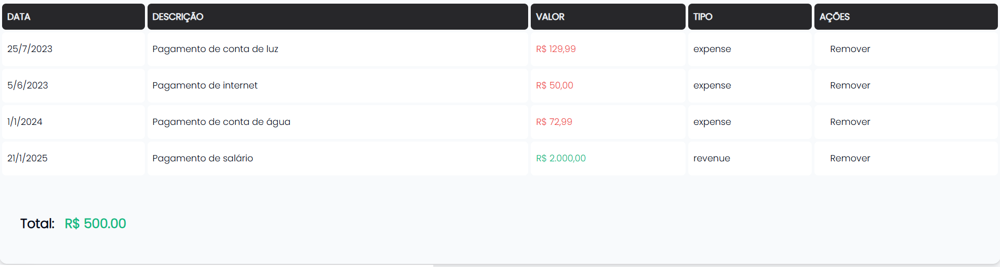

# Money Manager

## O que eu aprendi na criação desse projeto?

 - **Frontend:**
   - [Como estruturar um frontend Next.js](#nextjs-structure)
   - [Como criar um projeto Next.js na última versão](#nextjs-latest)
   - [Como instalar o shadcn/ui](#shadcn-ui)
   - [Como fazer uma div ocupar a tela inteira (altura/Height)](#h-screen)
   - [Como utilizar a biblioteca lucide-react para adicionar icons da lib Lucide](#lucide-react)
   - [Como adicionar um componente com shadcn-ui](#shadcn-input)
   - [Could not find a valid build in the '.next' directory!](#next-build-error)
   - [npm run dev vs. start vs. build](#dev-start-build)
 - **Backend:**
   - [Como iniciar um projeto (vazio) com gradle](#gradle-init)
   - [gradle run](#gradle-run)
   - [Como mapear uma tabela (frontend) para uma classe Java (backend)](#mapping-table)


<!--- 
[WHITESPACE RULES]
- Same topic = "10" Whitespace character.
- Different topic = "50" Whitespace character.
--->


<!--- ( Frondend ) --->

---

<div id="nextjs-structure"></div>

## Como estruturar um frontend Next.js

> Aqui nós vamos entender uma maneira (isso porque podem ter outras maneiras) de estruturar um projeto Next.js.

De início o home da nossa aplicação vai ficar em **/src/app**:

```bash
frontend/
├── src
│   └── app
│       └── page.tsx
│       └── layout.tsx
```

 - `layout.tsx`
   - Define o layout que será compartilhado entre múltiplas páginas.
   - Funciona como um template que envolve outras páginas.
   - Permanece estático quando as páginas dentro dele mudam.
   - Ideal para elementos comuns como *header*, *footer*, *navegação*.

**Exemplo básico:**
```tsx
export default function RootLayout({
  children,
}: {
  children: React.ReactNode
}) {
  return (
    <html lang="en">
      <body>
        <header>Meu Site</header>
        {children}
        <footer>Rodapé</footer>
      </body>
    </html>
  )
}
```

 - `page.tsx`
   - É a página principal da rota.
   - Define o conteúdo único daquela rota específica.
   - **NOTE:** Renderiza no lugar do `{children}` dentro do layout correspondente.

**Exemplo:**
```tsx
export default function Home() {
  return (
    <main>
      <h1>Bem-vindo à página inicial</h1>
      <p>Este é o conteúdo específico desta página</p>
    </main>
  )
}
```

A relação entre eles:

 - **NOTE:** O conteúdo do `page.tsx` é inserido automaticamente no lugar do `{children}` do *layout*.
 - Você pode ter múltiplos `page.tsx` em diferentes rotas, todos compartilhando o mesmo layout.

**Continuando...**

> Ótimo e se eu desejar criar uma rota **/test**?

Simples, primeiro nós criamos uma pasta **"test"** em `src/app/` e depois os arquivos `layout.tsx` e `page.tsx`:

**page.tsx**
```tsx
export default function Test() {
    return (
        <h1>Teste...</h1>
    );
}
```

> **NOTE:**  
> Vejam que aqui no `page.tsx` nós criamos o HTML que será exibido na página (rota).

**layout.tsx**
```tsx
import React from 'react';

export default function TestLayout({ children }: { children: React.ReactNode }) {
    return (
        <>{children}</>
    )
}
```

> **NOTE:**  
> Aqui a função **TestLayout()** recebe um `{children}` como argumento que é o nosso HTML criado em `page.tsx`.  
> Agora é só ir em `localhost:3000/teste` e testar.

**Continuando...**

### Como criar uma rota e component para um /dashboard

De início para criar um componente com next.js vamos criar uma pasta `/components` dentro de `/src`.

Lá irá ficar:

 - Os componentes que você criar.
 - Os componentes que você baixar de uma biblioteca externa, por exemplo:
   - shadcn-ui.
   - lucide-react.
   - **NOTE:** Normalmente ficam em `src/components/ui`.

Por exemplo, vamos criar 2 componentes para o nosso `/dashboard`:

**src/components/dashboard/insert-activity-form/index.tsx**
```tsx
import { Button } from "@/components/ui/button"
import { Input } from "@/components/ui/input"
import { Select, SelectContent, SelectItem, SelectTrigger, SelectValue } from "@/components/ui/select";


export function InsertActivityForm() {
    return (
        <div className="flex space-x-2 p-8">
            <Input type="date" className="w-max" />
            <Input type="text" placeholder="Insira a descrição da atividade..." />
            <Input type="number" className="w-max" placeholder="Digite o valor..." />
            <Select>
                <SelectTrigger className="w-80">
                    <SelectValue placeholder="Tipo de atividade" />
                </SelectTrigger>
                <SelectContent>
                    <SelectItem value="0">Entrada</SelectItem>
                    <SelectItem value="1">Saída</SelectItem>
                </SelectContent>
            </Select>
            <Button>Incluir</Button>
        </div>
    );
}
```

> **NOTE:**  
> Vejam que além de nós criamos nosso componente também estamos utilizando componentes externos (shadcn-ui: select, button, input).

Agora vamos construir uma tabela e essa tabela vai ter seus componentes separados (modularizados) por arquivos:

**src/components/dashboard/activity-table/columns.tsx**
```tsx
"use client"

import { ColumnDef } from "@tanstack/react-table"

// This type is used to define the shape of our data.
// You can use a Zod schema here if you want.
export type Payment = {
    id: string
    amount: number
    status: "pending" | "processing" | "success" | "failed"
    email: string
}

export const columns: ColumnDef<Payment>[] = [
    {
        accessorKey: "status",
        header: "Status",
    },
    {
        accessorKey: "email",
        header: "Email",
    },
    {
        accessorKey: "amount",
        header: "Amount",
    },
]
```

**src/components/dashboard/activity-table/data-table.tsx**
```tsx
"use client"

import {
    ColumnDef,
    flexRender,
    getCoreRowModel,
    useReactTable,
} from "@tanstack/react-table"

import {
    Table,
    TableBody,
    TableCell,
    TableHead,
    TableHeader,
    TableRow,
} from "@/components/ui/table"

interface DataTableProps<TData, TValue> {
    columns: ColumnDef<TData, TValue>[]
    data: TData[]
}

export function DataTable<TData, TValue>({
    columns,
    data,
}: DataTableProps<TData, TValue>) {
    const table = useReactTable({
        data,
        columns,
        getCoreRowModel: getCoreRowModel(),
    })

    return (
        <div className="rounded-md border">
            <Table>
                <TableHeader>
                    {table.getHeaderGroups().map((headerGroup) => (
                        <TableRow key={headerGroup.id}>
                            {headerGroup.headers.map((header) => {
                                return (
                                    <TableHead key={header.id}>
                                        {header.isPlaceholder
                                            ? null
                                            : flexRender(
                                                header.column.columnDef.header,
                                                header.getContext()
                                            )}
                                    </TableHead>
                                )
                            })}
                        </TableRow>
                    ))}
                </TableHeader>
                <TableBody>
                    {table.getRowModel().rows?.length ? (
                        table.getRowModel().rows.map((row) => (
                            <TableRow
                                key={row.id}
                                data-state={row.getIsSelected() && "selected"}
                            >
                                {row.getVisibleCells().map((cell) => (
                                    <TableCell key={cell.id}>
                                        {flexRender(cell.column.columnDef.cell, cell.getContext())}
                                    </TableCell>
                                ))}
                            </TableRow>
                        ))
                    ) : (
                        <TableRow>
                            <TableCell colSpan={columns.length} className="h-24 text-center">
                                No results.
                            </TableCell>
                        </TableRow>
                    )}
                </TableBody>
            </Table>
        </div>
    )
}
```

agora vamos chamar (invokar) esses componentes dentro do meu `index.tsx`:

**src/components/dashboard/activity-table/index.tsx**
```tsx
import { Payment, columns } from "./columns"
import { DataTable } from "./data-table"

function getData(): Payment[] {
    // Fetch data from your API here.
    return [
        {
            id: "728ed52f",
            amount: 100,
            status: "pending",
            email: "m@example.com",
        },
        // ...
    ]
}

export function ActivityTable() {
    const data = getData()

    return (
        <div className="container mx-auto py-10">
            <DataTable columns={columns} data={data} />
        </div>
    )
}
```

> **Ok, só isso?**  
> Não. Nós precisamos chamar (invokar) os componentes `<InsertActivityForm />` e `<ActivityTable />` dentro de `src/app/dashboard/page.tsx`.

**src/app/dashboard/page.tsx**
```tsx
import { ActivityTable } from "@/components/dashboard/activity-table";
import { InsertActivityForm } from "@/components/dashboard/insert-activity-form";


export default function dashboard() {
    return (
        <>
            <InsertActivityForm />
            <ActivityTable />
        </>
    );
}
```

> **NOTE:**  
> Outra maneira interessante de planejar esse dashboard seria implementar (planejar) primeiro o **src/app/dashboard/page.tsx** e depois implementar esse componentes.


---

<div id="nextjs-latest"></div>

## Como criar um projeto Next.js na última versão

```bash
npx create-next-app@latest frontend
```

> **NOTE:**  
> Para mudar de opção na hora da criação do projeto você move com as setas [← or →] do teclado.


---

<div id="shadcn-ui"></div>

## Como instalar e iniciar o shadcn/ui

```bash
npm install shadcn-ui
```


---

<div id="h-screen"></div>

## Como fazer uma div ocupar a tela inteira (altura/Height)

```tsx
<div className="h-screen"></div>
```


---

<div id=""></div>

## Como utilizar a biblioteca lucide-react para adicionar icons da lib Lucide

```bash
npm i lucide-react
```

Depois de instalada a biblioteca nós vamos ser capazes de utilizar os icons da lib Lucide:

```tsx
import { BadgeDollarSign } from "lucide-react";

<div>
    <BadgeDollarSign />
</div>
```


---

<div id="shadcn-input"></div>

## Como adicionar um componente com shadcn-ui

```bash
npx shadcn@latest add input
```

Se você prestar atenção vai ver que em [src/components/ui/input.tsx](src/components/ui/input.tsx) foi criado um novo componente:

```tsx
import * as React from "react"

import { cn } from "@/lib/utils"

const Input = React.forwardRef<HTMLInputElement, React.ComponentProps<"input">>(
    ({ className, type, ...props }, ref) => {
        return (
            <input
                type={type}
                className={cn(
                    "flex h-9 w-full rounded-md border border-input bg-transparent px-3 py-1 text-base shadow-sm transition-colors file:border-0 file:bg-transparent file:text-sm file:font-medium file:text-foreground placeholder:text-muted-foreground focus-visible:outline-none focus-visible:ring-1 focus-visible:ring-ring disabled:cursor-not-allowed disabled:opacity-50 md:text-sm",
                    className
                )}
                ref={ref}
                {...props}
            />
        )
    }
)
Input.displayName = "Input"

export { Input }
```

**NOTE:**  
Agora você pode importar esse componente onde desejar e utilizá-lo:

```tsx
import { Input } from "@/components/ui/input";

<Input type="email" placeholder="Digite o seu e-mail..." />
```


---

<div id="next-build-error"></div>

## Could not find a valid build in the '.next' directory!

```bash
npm run build
```


---

<div id="dev-start-build"></div>

## npm run dev vs. start vs. build

 - **npm run dev**
   - Inicia o servidor em modo de desenvolvimento.
   - Possui *Hot Reloading (atualização automática quando há mudanças no código)*.
   - Otimizado para desenvolvimento, com melhor feedback de erros.
   - Não faz otimizações de produção, tornando o build mais rápido.
   - Ideal para quando você está desenvolvendo/codando.
 - **npm run build**
   - Compila a aplicação para produção.
   - Gera arquivos otimizados na pasta .next.
   - Minifica o código.
   - Otimiza imagens e outros assets.
   - Gera arquivos estáticos quando possível.
   - **NOTE:** Não inicia nenhum servidor, apenas constrói a aplicação.
 - **npm start**
   - Inicia o servidor em modo de produção.
   - Usa os arquivos compilados gerados pelo `npm run build`.
   - Não tem Hot Reloading.
   - Otimizado para performance.
   - Usado em ambientes de produção.
   - **NOTE:** Requer que `npm run build` tenha sido executado antes

### Fluxo típico

 - **Durante desenvolvimento:**
   - Use `npm run dev`.
 - **Para deploy:**
   - Primeiro `npm run build`, depois `npm start`.


<!--- ( Backend ) --->

---

<div id="gradle-init"></div>

## Como iniciar um projeto (vazio) com gradle

```bash
gradle init
```


---

<div id="gradle-run"></div>

## gradle run

Assim que iniciar um projeto com gradle é interessante você testar se o projeto está funcionando corretamente:

```bash
gradle run
```

Se tudo ocorrer bem você terá uma saída parecida com essa:

```bash
Calculating task graph as no cached configuration is available for tasks: run

> Task :app:run
Hello World!

BUILD SUCCESSFUL in 3s
2 actionable tasks: 2 executed
Configuration cache entry stored.
```


---

<div id="mapping-table"></div>

## Como mapear uma tabela (frontend) para uma classe Java (backend)

Imagine que nós desejarmos mapear a tabela abaixo para o Java:

  

Vamos iniciar criando nossa classe que vai se chamar de `Activity.java`. Isso porque ela vai representar uma atividade:

**app/src/main/java/moneymanager/domain/activity/Activity.java**
```java
package moneymanager.domain.activity;

public class Activity {
    
}
```

Ok, mas para essa classe representar nossa tabela primeiro nós precisamos criar os campos dessa tabela na nossa classe `Activity.java`:

**app/src/main/java/moneymanager/domain/activity/Activity.java**
```java
package moneymanager.domain.activity;

import java.time.Instant;

public class Activity {

    private final String id;
    private final Instant date;
    private final String description;
    private final float value;
}
```

> Até aqui tudo bem, mas como vamos representar os **"tipos"** na tabela? Sabendo que eles podem ser `expense` ou `revenue`.

Seguindo o príncio do *DDD (Domain Driven Design)* uma maneira de resolver isso seria criando um **"objeto de valor"**. Isso porque não é um tipo qualquer, ele representa mais do que isso.

**app/src/main/java/moneymanager/domain/activity/type/Type.java**
```java
package moneymanager.domain.activity.type;

public class Type {
    public enum ActivityType {
        EXPENSE,
        REVENUE
    }
}
```

Vejam que nós não temos uma classe qualquer. Na verdade nós temos um **"enum"** que vai representar os tipos `expense` e `revenue`.

> **NOTE:**  
> Porém, ao trabalhar com **"enum"** é interessante nós trabalharmos com valores predefinidos.

Por exemplo:

**app/src/main/java/moneymanager/domain/activity/type/Type.java**
```java
package moneymanager.domain.activity.type;

public class Type {
    public enum ActivityType {
        EXPENSE("expense"),
        REVENUE("revenue");

        private String type;

        ActivityType(final String atype) {
            this.type = atype;
        }

        public String getValue() {
            return this.type;
        }
    }
}
```

Vejam que agora:

 - Nós temos um construtor para o enum `ActivityType`:
   - Obrigando quem instanciar a classe passar um tipo de atividade (type).
 - Um `getType()`:
   - Como nosso tipo é privado para acessar ele nós temos que criar um getter para disponibilizar esse valor.
 - Por fim, nós também definimos quais são os tipos de enum que podem ser usados:
   - `EXPENSE("expense")` e `REVENUE("revenue")`.

> **NOTE:**  
> No meu computador a implementação do enum (Type) acima deu errado. Então eu modifiquei para o código abaixo.

```java
package moneymanager.domain.activity.type;

public enum Type {
    EXPENSE, // Despesa.
    REVENUE  // Receita.
}
```

Continuando com o mapeamento da nossa tabela agora nós temos o nosso **"objeto de valor"** como um tipo:

**app/src/main/java/moneymanager/domain/activity/Activity.java**
```java
package moneymanager.domain.activity;

import java.time.Instant;

import moneymanager.domain.activity.type.Type;


public class Activity {

    private final String id;
    private final Instant date;
    private final String description;
    private final float value;
    private final Type type;
}
```

**NOTE:**  
No backend por questão de auditoria é interessante criar os campos `createdAt` e `updatedAt`. Mesmo que esses campos não sejam visíveis na tabela é importante para verificar quando um registro foi `criado` ou `atualizado` (E até mesmo quem).

**app/src/main/java/moneymanager/domain/activity/Activity.java**
```java
package moneymanager.domain.activity;

import java.time.Instant;

import moneymanager.domain.activity.type.Type;


public class Activity {

    private final String id;
    private final Instant date;
    private final String description;
    private final float value;
    private final Type type;
    private final Instant createdAt;
    private final Instant updatedAt;
}
```

Agora eu quero forçar que ninguém crie um objeto dessa classe `pelo construtor direto`.

> **Como fazer isso?**  
> É só criar um construtor *privado (private)*.

**app/src/main/java/moneymanager/domain/activity/Activity.java**
```java
private Activity(final String anId, final Instant aDate, final String aDescription,
    final float aValue, final Type aType, final Instant aCreatedAt,
    final Instant aUpdatedAt) {
        this.id = anId;
        this.date = aDate;
        this.description = aDescription;
        this.value = aValue;
        this.type = aType;
        this.createdAt = aCreatedAt;
        this.updatedAt = aUpdatedAt;
}
```

**NOTE:**  
Como nós temos um construtor privado, ninguém vai conseguir instanciar essa classe `Activity` diretamente.

> **Mas e se eu desejar criar uma instância desse objeto?**

### Factory Method (ou Static Factory Method)

> Um padrão de projeto conhecido para resolver isso é o *"Factory Method (ou Static Factory Method)"*.

 - Ele é amplamente utilizado para criar objetos de maneira controlada, ao invés de usar diretamente o construtor público.
 - **NOTE:** Quando você combina um construtor privado com métodos estáticos que criam e retornam instâncias, está aplicando uma variação desse padrão.

Por exemplo, vamos criar outro método para criar uma instância da classe `Activity`, porém, só com os campos que realmente vamos precisar:

**app/src/main/java/moneymanager/domain/activity/Activity.java**
```java
public static Activity newActivity(final Instant aDate, final String aDescription,
    final float aValue, final Type aType) {
    return new Activity(
        UUID.randomUUID().toString().toLowerCase(),
        aDate,
        aDescription,
        aValue,
        aType,
        Instant.now().truncatedTo(ChronoUnit.MICROS),
        Instant.now().truncatedTo(ChronoUnit.MICROS)
    );
}
```

Vejam que:

 - Nós temos um método estático do tipo `Activity (ou seja, ele vai ter que retornar uma Activity)`.
 - Que tem como retorno uma instância (new) do *"construtor privado Activity"*.
 - Vejam que alguns campos estão sendo inicializados de forma automática:
   - UUID.randomUUID().toString().toLowerCase()
   - Instant.now().truncatedTo(ChronoUnit.MICROS)

> **Ok, alguns dados nesse método foram criados de forma automática e os outros?**

Os outros nós vamos criar um método público (e estático) que:

 - Vai ser do tipo `Activity (ou seja, ele vai ter que retornar uma Activity)`.
 - Vai utilizar o recurso **with()** que é usado para *"reconstruir ou recriar uma instância de Activity (classe) com dados já existentes"* (Ou seja, os dados que nós criamos de forma automática no método newActivity).
 - Que tem como retorno uma instância (new) do *"construtor privado Activity"*.

**app/src/main/java/moneymanager/domain/activity/Activity.java**
```java
public static Activity with(final String anId, final Instant aDate, final String aDescription,
    final float aValue, final Type aType, final Instant aCreatedAt,
    final Instant aUpdatedAt) {
    return new Activity(anId, aDate, aDescription, aValue, aType, aCreatedAt, aUpdatedAt);
}
```

 - **POR QUE TER DOIS MÉTODOS?**
   - **newActivity():**
     - Cria uma instância com geração automática de valores.
     - É ideal para criar novos objetos que não possuem estado anterior.
   - **with():**
     - Permite criar uma instância com valores já existentes, sem nenhuma lógica adicional.
     - É ideal para reconstruir objetos existentes ou replicar dados entre sistemas.
 - **POR QUE NÃO USAR SÓ UM MÉTODO?**
   - *Se você usasse apenas um método para ambos os casos, o código ficaria mais confuso ou menos seguro:*
     - Com `newActivity()`, você não pode passar um `id` ou ajustar os `timestamps`, pois eles são gerados automaticamente.
     - Com `with()`, você teria que passar todos os valores, mesmo em situações onde não precisa (por exemplo, gerar um novo ID ou timestamp).
   - *Separar esses métodos garante clareza e semântica:*
     - Use `newActivity()` para criar algo novo.
     - Use `with()` para recriar algo existente.

Continuando, como todos nossos atributos são privados nós precisamos criar getters para acessar eles:

**app/src/main/java/moneymanager/domain/activity/Activity.java**
```java
public String getId() {
    return id;
}

public Instant getDate() {
    return date;
}

public String getDescription() {
    return description;
}

public float getValue() {
    return value;
}

public Type getType() {
    return type;
}

public Instant getCreatedAt() {
    return createdAt;
}

public Instant getUpdatedAt() {
    return updatedAt;
}
```

> **NOTE:**  
> Para criar esses métodos automaticamente no VSCode é só selecionar as variáveis e quando aparecer "lampadazinha" no lado esquerdo clica nela e escolha a opção de criar os getters, setters (ou ambos ao mesmo tempo).

Agora, vamos reescrever (override) o método **toString()** para exibir os dados da nossa `Activity`:

**app/src/main/java/moneymanager/domain/activity/Activity.java**
```java
@Override
public String toString() {
    return "Activity [id=" + id 
        + ", date=" + date 
        + ", description=" + description 
        + ", value=" + value 
        + ", type=" + type 
        + ", createdAt=" + createdAt 
        + ", updatedAt=" + updatedAt + "]";
}
```

> **NOTE:**  
> Quando usamos `@Override` e implementamos nosso próprio `toString()`, estamos sobrescrevendo o comportamento padrão para fornecer uma representação em texto mais útil e legível do nosso objeto.

Por fim, vamos testar essa classe `Activity` no nosso App. Como nós não podemos utilizar o construtor (privado) da classe, vamos criar uma instância utilizando o método `newActivity()`:

**app/src/main/java/moneymanager/App.java:**
```java
package moneymanager;

import java.time.Instant;

import moneymanager.domain.activity.Activity;
import moneymanager.domain.activity.type.Type;

public class App {

    public static void main(String[] args) {

        Activity activityDespesa = Activity.newActivity(
                Instant.now(),
                "Compra no supermercado",
                150.50f,
                Type.EXPENSE
        );

        System.out.println(activityDespesa.toString());

        System.out.println(activityDespesa); // Java chama toString() automaticamente.
    }
}
```

**OUTPUT:**
```bash
> Task :app:run
Activity [id=c57ce778-7792-40f0-821d-8f6f4bd6ff84, date=2025-01-29T10:00:28.817866397Z, description=Compra no supermercado, value=150.5, type=EXPENSE, createdAt=2025-01-29T10:00:28.849256Z, updatedAt=2025-01-29T10:00:28.849723Z]

Activity [id=c57ce778-7792-40f0-821d-8f6f4bd6ff84, date=2025-01-29T10:00:28.817866397Z, description=Compra no supermercado, value=150.5, type=EXPENSE, createdAt=2025-01-29T10:00:28.849256Z, updatedAt=2025-01-29T10:00:28.849723Z]
```

> **NOTE:**  
> Vejam que se nós não chamamos o método toString() explicitamente, o resultado é diferente.

Agora nós vamos reconsruir essa atividade (Activity) com alguns dados já existentes, usando o método `with()`:

**app/src/main/java/moneymanager/App.java:**
```java
package moneymanager;

import java.time.Instant;

import moneymanager.domain.activity.Activity;
import moneymanager.domain.activity.type.Type;

public class App {

    public static void main(String[] args) {

        // Criando uma nova atividade usando newActivity (simulando uma nova despesa)
        Activity despesa = Activity.newActivity(
                Instant.now(), // Data atual
                "Compra no supermercado", // Descrição
                150.50f, // Valor
                Type.EXPENSE // Tipo (assumindo que EXPENSE é um enum)
        );

        // Imprimindo a despesa criada
        System.out.println("Nova despesa criada:");
        System.out.println(despesa);

        // Criando uma atividade usando with (simulando reconstrução de dados existentes)
        Activity atividadeExistente = Activity.with(
                "abc123", // ID existente
                Instant.now(), // Data
                "Salário mensal", // Descrição
                5000.00f, // Valor
                Type.REVENUE, // Tipo (assumindo que INCOME é um enum)
                Instant.now(), // Data de criação
                Instant.now() // Data de atualização
        );

        // Imprimindo a atividade reconstruída
        System.out.println("\nAtividade reconstruída:");
        System.out.println(atividadeExistente);

        // Testando os getters
        System.out.println("\nTestando getters da despesa:");
        System.out.println("ID: " + despesa.getId());
        System.out.println("Descrição: " + despesa.getDescription());
        System.out.println("Valor: " + despesa.getValue());
        System.out.println("Tipo: " + despesa.getType());
        System.out.println("Data: " + despesa.getDate());
        System.out.println("Criado em: " + despesa.getCreatedAt());
        System.out.println("Atualizado em: " + despesa.getUpdatedAt());
    }
}
```

**OUTPUT:**
```bash
Nova despesa criada:
Activity [id=84fe431e-fdee-4640-861b-24a300a78ad6, date=2025-01-29T23:04:51.605827846Z, description=Compra no supermercado, value=150.5, type=EXPENSE, createdAt=2025-01-29T23:04:51.642591Z, updatedAt=2025-01-29T23:04:51.643079Z]

Atividade reconstruída:
Activity [id=abc123, date=2025-01-29T23:04:51.662163415Z, description=Salário mensal, value=5000.0, type=REVENUE, createdAt=2025-01-29T23:04:51.662168461Z, updatedAt=2025-01-29T23:04:51.662168976Z]

Testando getters da despesa:
ID: 84fe431e-fdee-4640-861b-24a300a78ad6
Descrição: Compra no supermercado
Valor: 150.5
Tipo: EXPENSE
Data: 2025-01-29T23:04:51.605827846Z
Criado em: 2025-01-29T23:04:51.642591Z
Atualizado em: 2025-01-29T23:04:51.643079Z
```

---

**Rodrigo** **L**eite da **S**ilva
