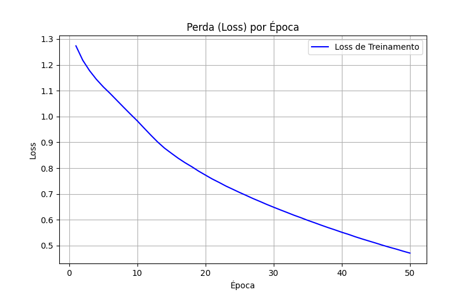
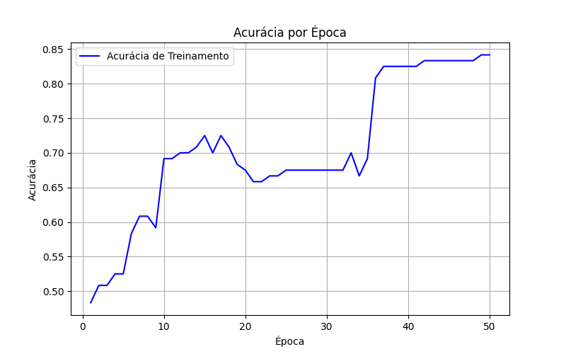
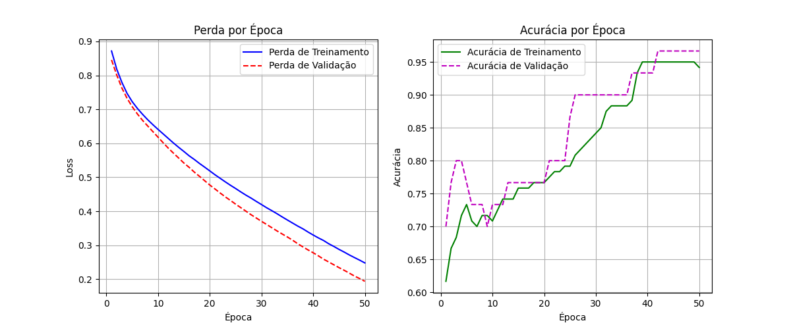
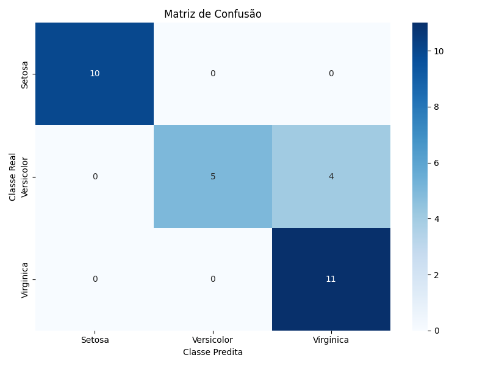
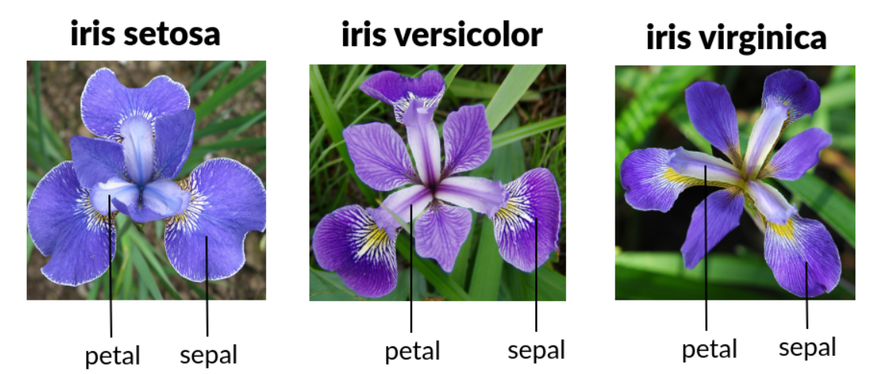
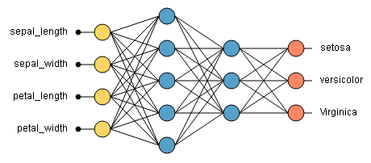

# Deep Learning

## Conteúdo

 - [**Funções de Perda (Loss Functions):**](#loss-functions)
   - **Problemas de Regressão:**
     - Mean Squared Error (MSE | Problemas com saída contínua, ex: preço, temperatura)
     - Mean Absolute Error (MAE | Quando você quer menos sensibilidade a outliers)
     - Huber Loss (Regressão robusta, Combinação entre MSE e MAE, mais robusta a outliers)
   - **Problemas de Classificação:**
     - Binary Cross Entropy (Quando há apenas 2 classes, ex: spam/não-spam)
     - Categorical Cross-Entropy (Saídas em one-hot (ex: [0, 0, 1])
     - Sparse Categorical Crossentropy (Saídas como rótulo inteiro, ex: 2 ao invés de [0, 0, 1])
   - **Comparação entre distribuições de probabilidade:**
     - Kullback-Leibler Divergence (Quando se quer medir a diferença entre duas distribuições)
 - [**Optimizers (ou Otimizadores):**](#optimizers)
   - Stochastic Gradient Descent (SGD)
   - SGD com Momentum
   - Learning Rate
   - Learning Rate Decay
   - Adam
   - RMSprop
   - Adagrad
   - Adadelta
   - Nadam
   - FTRL
 - **Gráficos (Plots):**
   - **🤖 Gráficos relacionados ao treinamento do modelo:**
     - [Gráfico de Perda (Loss) por Época em Redes Neurais](#loss-by-epoch-plot)
     - [Gráfico de Acurácia por Época em Redes Neurais](#accuracy-by-epoch-plot)
     - [Interpretando os Gráficos de Perda e Acurácia](#loss-vs-accuracy)
   - **✅ Gráficos relacionados ao desempenho do modelo:**
     - [Matriz de Confusão (Confusion Matrix) – Entendendo os Acertos e Erros do Modelo](#confusion-matrix)
 - **Projetos:**
   - [🌸 Iris flower data set](#iris-data-set)
 - [**REFERÊNCIAS**](#ref)
<!---
[WHITESPACE RULES]
- Same topic = "20" Whitespace character.
- Different topic = "200" Whitespace character.
--->


<!--- ( Funções de Perda (Loss Functions) ) --->

---

<div id="loss-functions"></div>

## Funções de Perda (Loss Functions)

> Funções de perda (Loss Functions) são fórmulas matemáticas que medem o erro entre a **"saída prevista"** pela rede neural e a **"saída real"**.

Em outras palavras, elas dizem:

 - Quão ruim está a previsão da rede;
 - **NOTE:** Quanto menor o valor da perda, melhor o modelo está aprendendo.

### 🎯 Para que servem?

As *funções de perda (loss functions)** servem para orientar o processo de aprendizagem da rede neural. Durante o treinamento, a rede ajusta seus pesos internos para minimizar essa perda.

> **NOTE:**  
> ➡️ Os otimizadores (como Adam, SGD, etc.) usam essa perda para saber como e quanto alterar os pesos (e bias) da rede.

### ⏱️ Quando são usadas?

As funções de perda **são usadas em todo treino da rede neural**:

 - A cada batch de dados;
 - Em cada época;
 - **NOTE:** São indispensáveis — sem ela, o modelo não aprende.

### 📦 Tipos de Funções de Perda

> A função de perda muda dependendo do tipo de problema (Regressão ou Classificação).

**🔵 1. Classificação:**  
Para tarefas em que o modelo precisa prever classes (ex: detectar se uma flor é iris-setosa, iris-versicolor ou iris-virginica).

| Função de Perda                   | Quando usar                                                                |
| --------------------------------- | -------------------------------------------------------------------------- |
| `categorical_crossentropy`        | Classificação multiclasse com one-hot encoding                             |
| `sparse_categorical_crossentropy` | Classificação multiclasse com labels inteiros (sem one-hot)                |
| `binary_crossentropy`             | Classificação binária (ex: 0 ou 1)                                         |
| `Kullback-Leibler divergence`     | Quando se quer medir a diferença entre duas distribuições de probabilidade |

**🟠 2. Regressão:**  
Para tarefas em que o modelo precisa prever números contínuos (ex: preço de uma casa, temperatura, etc.)

| Função de Perda       | Quando usar                                |
| --------------------- | ------------------------------------------ |
| `mean_squared_error`  | Regressão – penaliza mais os grandes erros |
| `mean_absolute_error` | Regressão – menos sensível a outliers      |
| `huber_loss`          | Regressão robusta – mistura dos dois acima |


### ⚙️ Como implementar?

<details>

<summary>TensorFlow (Python)</summary>

<br/>

Na prática, você escolhe a **função de perda (loss function)** ao compilar o modelo com TensorFlow:

<br/>

```python
model.compile(
    loss='categorical_crossentropy',  # <- Função de perda
)
```

</details>


<!--- ( Optimizers (ou Otimizadores) ) --->

---

<div id="optimizers"></div>

## Optimizers (ou Otimizadores)

> **"Otimizadores"** são algoritmos usados para **ajustar os pesos de uma rede neural durante o treinamento**, **minimizando a função de perda (loss function)**.

### 🎯 Para que servem?

 - Encontrar os melhores valores de pesos e bias;
 - Reduzir o erro (loss) entre as previsões e os valores reais;
 - Ajudar o modelo a convergir para uma solução precisa;
 - Tornar o treinamento mais rápido e estável.

### ⚙️ Como implementar?

<details>

<summary>TensorFlow (Python)</summary>

<br/>

Na prática, você escolhe o **otimizador** ao compilar o modelo com TensorFlow:

<br/>

```python
model.compile(
    optimizer="adam",  # <- Otimizador
)
```

</details>

<br/>

| 🔧 Nome                                  | 📝 Breve descrição                                                                                                                                                    |
| ---------------------------------------- | --------------------------------------------------------------------------------------------------------------------------------------------------------------------- |
| **Stochastic Gradient Descent (SGD)**    | Método clássico. Atualiza pesos a cada amostra. Simples e eficiente, mas pode oscilar.                                                                                |
| **SGD com Momentum**                     | Variante do SGD. Adiciona uma "memória" do gradiente anterior (momentum), o que ajuda a evitar oscilações e acelera em direção à solução.                             |
| **Learning Rate**                        | Hiperparâmetro que controla o "tamanho do passo" que o otimizador dá ao atualizar os pesos. Um valor muito alto pode pular o mínimo; muito baixo pode demorar demais. |
| **Learning Rate Decay**                  | Estratégia para diminuir gradualmente o learning rate conforme o treinamento avança. Permite aprendizado rápido no início e refinamento no final.                     |
| **Adam**                                 | Muito usado. Combina Momentum + RMSprop. Adapta os passos automaticamente e funciona bem em muitos problemas.                                                         |
| **RMSprop**                              | Mantém histórico de gradientes com média exponencial. Ideal para problemas com dados não estacionários (como séries temporais).                                       |
| **Adagrad**                              | Adapta o tamanho do passo para cada parâmetro com base no histórico de gradientes. Funciona bem com dados esparsos.                                                   |
| **Adadelta**                             | Variante do Adagrad que limita a acumulação dos gradientes passados. Melhora a estabilidade.                                                                          |
| **Nadam**                                | Combina Adam com Nesterov momentum. Pode oferecer convergência mais rápida e suave.                                                                                   |
| **FTRL (Follow The Regularized Leader)** | Otimizador específico para problemas com muitos dados esparsos (ex: grandes sistemas de recomendação). Muito usado no Google.                                         |


<!--- ( Gráficos ) --->

---

<div id="loss-by-epoch-plot"></div>

## Gráfico de Perda (Loss) por Época em Redes Neurais

**🔍 O que é "Perda (Loss) por Época"?**  
Durante o treinamento de uma rede neural, o modelo tenta prever os resultados certos com base nos dados de entrada. A **função de perda (loss function)** é usada para medir o quanto o modelo erra em cada etapa.

 - **Perda (Loss):** Um número que representa o erro do modelo — quanto menor, melhor.
 - **Época (Epoch):** Uma passada completa por todos os dados de treino. Se você treina por 50 épocas, o modelo verá o mesmo conjunto de dados 50 vezes.
 - **Gráfico de perda por época:** Mostra como o *erro (loss)* muda ao longo do treinamento. Ele ajuda a entender se o modelo está aprendendo, estagnado ou até piorando.

> **Por que esse gráfico é importante?**

 - **Ele responde perguntas como:**
   - O modelo está aprendendo com o tempo?
   - A perda está diminuindo ou aumentando?
   - O modelo está sofrendo overfitting?

Ótimo, agora que nós já entendemos o que é **"Perda (Loss) por Época"**, vamos vamos criar uma função que faz isso para nós para qualquer tipo de rede neural e salva o gráfico em uma imagem:

<details>

<summary>TensorFlow (Python)</summary>

<br/>

[plots.py](src/plots.py)
```python
import matplotlib.pyplot as plt
import os

def plot_loss(history, filename="loss_plot.png"):
    """
    Gera e salva um gráfico de perda (loss) por época com base no objeto `history` do Keras.
    
    Parâmetros:
    - history: objeto retornado por model.fit()
    - filename: nome do arquivo de imagem que será salvo
    """
    loss = history.history.get("loss")
    val_loss = history.history.get("val_loss")

    epochs = range(1, len(loss) + 1)

    plt.figure(figsize=(8, 5))
    plt.plot(epochs, loss, "b-", label="Loss de Treinamento")
    
    if val_loss:
        plt.plot(epochs, val_loss, "r--", label="Loss de Validação")

    plt.title("Perda (Loss) por Época")
    plt.xlabel("Época")
    plt.ylabel("Loss")
    plt.legend()
    plt.grid(True)

    plt.savefig("../images/" + filename)
    plt.close()
```

Agora é só treinar o modelo com o método `fit()` e pegar o objeto retornado pelo mesmo e passar para a função `plot_loss()`:

```python
# Treinamento
history = model.fit(
    X_train,
    y_train_ohe,
    epochs=50,
    batch_size=8,
    verbose=0
)

plot_loss(history, filename="loss_plot-01.png")
```

**GRÁFICO:**

  

</details>


---

<div id="accuracy-by-epoch-plot"></div>

## Gráfico de Acurácia por Época em Redes Neurais

**🎯 O que é "Acurácia por Época"?**  
Durante o treinamento de uma rede neural, além de medir quanto o modelo está errando (com a perda), também queremos saber o quanto ele está acertando. Para isso usamos a acurácia.

 - **Acurácia (accuracy):** A porcentagem de acertos que o modelo teve em relação ao total de exemplos avaliados.
 - **Época (Epoch):** Uma rodada completa de treinamento, onde o modelo vê todos os dados uma vez.
 - **Gráfico de acurácia por época:** Mostra como a porcentagem de acertos do modelo muda a cada época.

> **Para que serve esse gráfico?**

 - **Esse gráfico ajuda a responder:**
   - O modelo está melhorando ao longo do tempo?
   - O modelo está memorizando os dados de treino (overfitting)?
   - O desempenho está estagnado?

É comum usar dois tipos de acurácia no gráfico:

 - **Acurácia de treino:** desempenho nos dados usados para treinar.
 - **Acurácia de validação:** desempenho em dados que o modelo nunca viu durante o treino.

Ótimo, agora que nós já entendemos o que é **"Acurácia por Época"**, vamos vamos criar uma função que faz isso para nós para qualquer tipo de rede neural e salva o gráfico em uma imagem:

<details>

<summary>TensorFlow (Python)</summary>

<br/>

[plots.py](src/plots.py)
```python
def plot_accuracy(history, filename="accuracy_plot.png"):
    """
    Gera e salva um gráfico de acurácia por época com base no objeto `history` do Keras.

    Parâmetros:
    - history: objeto retornado por model.fit()
    - filename: nome do arquivo de imagem que será salvo
    """
    acc = history.history.get("accuracy")
    val_acc = history.history.get("val_accuracy")

    epochs = range(1, len(acc) + 1)

    plt.figure(figsize=(8, 5))
    plt.plot(epochs, acc, "b-", label="Acurácia de Treinamento")
    
    if val_acc:
        plt.plot(epochs, val_acc, "g--", label="Acurácia de Validação")

    plt.title("Acurácia por Época")
    plt.xlabel("Época")
    plt.ylabel("Acurácia")
    plt.legend()
    plt.grid(True)

    plt.savefig("../images/" + filename)
    plt.close()
```

Agora é só treinar o modelo com o método `fit()` e pegar o objeto retornado pelo mesmo e passar para a função `plot_accuracy()`:

```python
# Treinamento
history = model.fit(
    X_train,
    y_train_ohe,
    epochs=50,
    batch_size=8,
    verbose=0
)

plot_accuracy(history, filename="accuracy_plot-01.png")
```

**GRÁFICO:**

  

</details>

<br/>


---

<div id="loss-vs-accuracy"></div>

## Interpretando os Gráficos de Perda e Acurácia

Quando treinamos uma rede neural, é essencial acompanhar como o modelo está se comportando a cada época. Os dois principais gráficos para isso são:

 - Gráfico de Perda por Época (Loss)
 - Gráfico de Acurácia por Época (Accuracy)

Mas, mais importante que olhar separadamente, é analisar os dois juntos.

### 🔁 Por que observar os dois gráficos juntos?

A combinação dos dois gráficos ajuda você a entender se:

 - O modelo está aprendendo bem.
 - O modelo está sofrendo com overfitting (ajuste exagerado aos dados de treino).
 - O modelo está subajustado (underfitting), ou seja, não aprendeu o suficiente.

### ✅ Situação 1: O Modelo Está Aprendendo Bem

Comportamento esperado:

| Gráfico         | O que acontece?     |
| --------------- | ------------------- |
| 📉 **Loss**     | Diminui com o tempo |
| 📈 **Accuracy** | Aumenta com o tempo |

> **➡️ Interpretação:** 
> O modelo está aprendendo a generalizar e se adaptar aos dados.

### ⚠️ Situação 2: Overfitting (Sobreajuste)

Comportamento típico:

| Gráfico         | Treinamento      | Validação         |
| --------------- | ---------------- | ----------------- |
| 📉 **Loss**     | Diminui          | Começa a subir 📈 |
| 📈 **Accuracy** | Sobe bastante 📈 | Começa a cair 📉  |

> **➡️ Interpretação:**  
> O modelo está aprendendo bem os dados de treino, mas está memorizando demais e não consegue generalizar para novos dados (test/validação). Isso é *"overfitting"*.

 - **🛠️ O que fazer nesse caso:**
   - Reduza o número de épocas.
   - Use técnicas como regularização (Dropout, L2, etc.).
   - Adicione mais dados ou use Data Augmentation.

### 🧊 Situação 3: Underfitting (Subajuste)

Comportamento típico:

| Gráfico         | O que acontece?             |
| --------------- | --------------------------- |
| 📉 **Loss**     | Fica alto ou não muda muito |
| 📈 **Accuracy** | Baixa ou não sobe muito     |

> **➡️ Interpretação:**  
> O modelo não está aprendendo o suficiente nem no treino nem na validação.

 - **🛠️ O que fazer nesse caso:**
   - Aumente a complexidade do modelo (mais camadas ou neurônios).
   - Treine por mais épocas.
   - Melhore o pré-processamento dos dados.

Ótimo, agora que nós já entendemos qual a vantagem de comparar os gráficos de **Perda (Loss)** e **Acurácia (Accuracy)**, vamos criar um gráfico que gera essa comparação para qualquer Rede Neural e salve em uma imagem:

<details>

<summary>TensorFlow (Python)</summary>

<br/>

[plots.py](src/plots.py)
```python
def loss_vs_accuracy_plot(history, filename="training_metrics.png"):
    """
    Gera e salva um gráfico com a perda (loss) e acurácia (accuracy) por época, usando o histórico de treinamento.
    
    Parâmetros:
    - history: objeto retornado por model.fit()
    - filename: nome do arquivo de imagem a ser salvo
    """
    loss = history.history.get("loss")
    val_loss = history.history.get("val_loss")
    acc = history.history.get("accuracy")
    val_acc = history.history.get("val_accuracy")

    epochs = range(1, len(loss) + 1)

    plt.figure(figsize=(12, 5))

    # 🔻 Subplot 1: Perda
    plt.subplot(1, 2, 1)
    plt.plot(epochs, loss, "b-", label="Perda de Treinamento")
    if val_loss:
        plt.plot(epochs, val_loss, "r--", label="Perda de Validação")
    plt.title("Perda por Época")
    plt.xlabel("Época")
    plt.ylabel("Loss")
    plt.legend()
    plt.grid(True)

    # 🔺 Subplot 2: Acurácia
    plt.subplot(1, 2, 2)
    plt.plot(epochs, acc, "g-", label="Acurácia de Treinamento")
    if val_acc:
        plt.plot(epochs, val_acc, "m--", label="Acurácia de Validação")
    plt.title("Acurácia por Época")
    plt.xlabel("Época")
    plt.ylabel("Acurácia")
    plt.legend()
    plt.grid(True)

    plt.savefig("../images/" + filename)
    plt.close()
```

Agora é só treinar o modelo com o método `fit()` e pegar o objeto retornado pelo mesmo e passar para a função `loss_vs_accuracy_plot()`:

```python
# Treinamento
history = model.fit(
    X_train,
    y_train_ohe,
    validation_data=(X_test, y_test_ohe),  # obrigatório para ter val_loss e val_accuracy
    epochs=50,
    batch_size=8,
    verbose=0
)

loss_vs_accuracy_plot(history, filename="loss-vs-accuracy-01.png")
```

**GRÁFICO:**

  

</details>


---

<div id="confusion-matrix"></div>

## Matriz de Confusão (Confusion Matrix) – Entendendo os Acertos e Erros do Modelo

**✅ O que é a Matriz de Confusão (Confusion Matrix)?**  
A *matriz de confusão (Confusion Matrix)* é uma tabela que mostra como o seu `modelo de classificação` está se saindo, comparando as previsões com os valores reais.

Ela indica onde o modelo acertou e onde errou, classe por classe.

### 🧠 Estrutura da Matriz

Para um problema com 3 classes (por exemplo, Iris Dataset), por exemplo:

|                    | **Classe Prevista: 0**  | **Classe Prevista: 1**  | **Classe Prevista: 2**   |
| ------------------ | ----------------------- | ----------------------- | ------------------------ |
| **Classe Real: 0** | ✅ Acertos da classe 0  | ❌ Erros para classe 1  | ❌ Erros para classe 2  |
| **Classe Real: 1** | ❌ Erros para classe 0  | ✅ Acertos da classe 1  | ❌ Erros para classe 2  |
| **Classe Real: 2** | ❌ Erros para classe 0  | ❌ Erros para classe 1  | ✅ Acertos da classe 2  |

> **NOTE:**  
> Olhando para a tabela acima é interessante ver quando (quantas vezes) ele errou por linha (classe real).  
> Quando ele erra nós dizemos que ele **"se confundiu"** com essa classe prevista (coluna).

 - Os acertos estão na diagonal principal (em verde).
 - Os erros estão fora da diagonal (em vermelho).

### 🎯 Para que serve?

 - Avaliar quais classes o modelo *confunde*.
 - Diagnosticar erros específicos (ex: a classe 1 sempre é confundida com a 2).
 - Melhorar o modelo, observando padrões de erro.

Ótimo, agora que nós já entendemos qual a vantagem de utilizar uma **Matriz de Confusão (Confusion Matrix)**, vamos criar um gráfico que gera essa comparação para qualquer Rede Neural e salve em uma imagem:

<details>

<summary>TensorFlow (Python)</summary>

<br/>

[plots.py](src/plots.py)
```python
def plot_confusion_matrix(y_true, y_pred, class_names=None, filename="confusion_matrix.png"):
    """
    Gera e salva um gráfico de matriz de confusão.
    
    Parâmetros:
    - y_true: rótulos verdadeiros
    - y_pred: rótulos previstos pelo modelo
    - class_names: nomes das classes (opcional)
    - filename: nome do arquivo de saída
    """
    # Calcula a matriz de confusão
    cm = confusion_matrix(y_true, y_pred)

    # Cria os rótulos se não forem fornecidos
    if class_names is None:
        class_names = [str(i) for i in range(cm.shape[0])]

    # Cria o gráfico
    plt.figure(figsize=(8, 6))
    sns.heatmap(cm, annot=True, fmt="d", cmap="Blues",
                xticklabels=class_names,
                yticklabels=class_names)

    plt.xlabel("Classe Predita")
    plt.ylabel("Classe Real")
    plt.title("Matriz de Confusão")
    plt.tight_layout()

    plt.savefig("../images/" + filename)
    plt.close()
```

Agora nós vamos:

 - Treinar o modelo;
 - Fazer previsões com `X_test`:
   - `y_pred = [[0.1, 0.7, 0.2], [0.8, 0.1, 0.1], [0.2, 0.3, 0.5]]` 
 - Retornar o índice de maior probabilidade em cada linha:
   - Ou seja, transforma as probabilidades em rótulos previstos (classes).
   - `y_pred_classes = tf.argmax(y_pred, axis=1).numpy()`
   - Retorno: `<tf.Tensor: shape=(3,), dtype=int64, numpy=array([1, 0, 2])>`

`y_pred_classes = tf.argmax(y_pred, axis=1).numpy()`  
Essa linha transforma as probabilidades de saída da rede em classes previstas (inteiros).

| Saída da rede (`y_pred`) | Classe prevista (`y_pred_classes`) |
| ------------------------ | ---------------------------------- |
| \[0.1, 0.7, 0.2]         | 1 (maior probabilidade é 0.7)      |
| \[0.8, 0.1, 0.1]         | 0 (maior probabilidade é 0.8)      |
| \[0.2, 0.3, 0.5]         | 2 (maior probabilidade é 0.5)      |

O código antes de chamar a função para criar a **Matriz de Confusão (Confusion Matrix)** é o seguinte:

```python
# Treinamento
history = model.fit(
    X_train,
    y_train_ohe,
    validation_data=(X_test, y_test_ohe),  # obrigatório para ter val_loss e val_accuracy
    epochs=50,
    batch_size=8,
    verbose=0
)

y_pred = model.predict(X_test)
y_pred_classes = tf.argmax(y_pred, axis=1).numpy()

plot_confusion_matrix(
    y_true=y_test,
    y_pred=y_pred_classes,
    class_names=["Setosa", "Versicolor", "Virginica"],
    filename="confusion-matrix-01.png"
)
```

**GRÁFICO:**

  

</details>


<!--- ( Projetos ) --->

---

<div id="iris-data-set"></div>

## 🌸 Iris flower data set

O **Iris Dataset** é um dos conjuntos de dados mais famosos da história da ciência de dados e aprendizado de máquina. Ele foi publicado em 1936 pelo estatístico e biólogo Ronald A. Fisher.

**📊 O que ele contém?**  
O conjunto de dados contém 150 amostras de flores da planta Iris, divididas igualmente entre 3 espécies:

 - Iris setosa;
 - Iris versicolor;
 - Iris virginica.

  

Para cada flor, foram medidas 4 características:

 - **🌸 1. Comprimento da sépala (Sepal length):**
   - **O que é sépala?**
     - É a parte verde que protege a flor quando ainda está em botão (antes de abrir).
     - Medida: O comprimento da sépala em centímetros (cm).
     - Exemplo: 5.1 cm.
 - **🌸 2. Largura da sépala (Sepal width):**
   - **O que mede?**
     - A largura (horizontal) da sépala, também em centímetros.
     - Importância: Algumas espécies têm sépalas mais largas ou estreitas, o que ajuda a diferenciá-las.
 - **🌺 3. Comprimento da pétala (Petal length):**
   - **O que é pétala?**
     - É a parte colorida da flor, que atrai polinizadores.
     - Medida: O comprimento da pétala em centímetros.
     - Relevância: Essa é uma das features mais úteis para separar as espécies.
 - **🌺 4. Largura da pétala (Petal width):**
   - Medida: A largura da pétala em centímetros.
   - Importância: Também é muito útil — por exemplo, a Iris setosa tende a ter pétalas bem estreitas.

  

**🧠 Para que ele é usado?**  
O Iris Dataset é amplamente usado para aprender conceitos de **"classificação"**:

 - Redes Neurais;
 - SVM;
 - K-NN.

**✅ Por que ele é tão popular?**

 - Pequeno e fácil de entender;
 - Bem balanceado (50 amostras por classe);
 - Perfeito para iniciantes praticarem classificação multiclasse.

Ótimo, agora que já entendemos o dataset, vamos planejar como será nossa Rede Neural utilizando o mesmo. De início vamos revisar quais são as entradas:

 - **🌸 1. Comprimento da sépala (Sepal length):**
 - **🌸 2. Largura da sépala (Sepal width):**
 - **🌺 3. Comprimento da pétala (Petal length):**
 - **🌺 4. Largura da pétala (Petal width):**

> **E a saída?**  
> A saída (output) do Iris dataset é a espécie da flor, ou seja, a classe à qual cada flor pertence.

| Código | Classe (Espécie)  | Descrição                                   |
| ------ | ----------------- | ------------------------------------------- |
| 0      | *Iris setosa*     | Sépala larga e pétala curta                 |
| 1      | *Iris versicolor* | Medidas intermediárias entre as outras duas |
| 2      | *Iris virginica*  | Pétalas mais longas e largas                |

Sabendo de tudo isso vamos imaginar que a nossa Rede Neural vai ter a seguinte estrutura:

  

> **NOTE:**  
> Vejam que a saída vai ser uma das 3 classes (Iris setosa, Iris versicolor e Iris virginica).

Para começar a implementação da nossa Rede Neural vamos importar as bibliotecas necessárias:

<details>

<summary>TensorFlow (Python)</summary>

<br/>

[iris-v1.py](src/iris-v1.py)
```python
import os
import tensorflow as tf
from sklearn.datasets import load_iris
from sklearn.model_selection import train_test_split
from sklearn.preprocessing import StandardScaler, LabelEncoder
```

</details>

<br/>

Agora vamos carregar o conjunto de dados:

 - X recebe as 4 características das flores (sépalas e pétalas).
 - y recebe os rótulos das classes (0=setosa, 1=versicolor, 2=virginica).

<details>

<summary>TensorFlow (Python)</summary>

<br/>

[iris-v1.py](src/iris-v1.py)
```python
# Carrega o dataset Iris
iris = load_iris()
X = iris.data  # 4 features
y = iris.target  # 3 classes
```

</details>

<br/>

Agora vamos aplicar uma **normalização (ou padronização)** nos dados:

<details>

<summary>TensorFlow (Python)</summary>

<br/>

[iris-v1.py](src/iris-v1.py)
```python
# Pré-processamento
scaler = StandardScaler()
X_scaled = scaler.fit_transform(X)
```

</details>

<br/>

Continuando, um processo comum em *Machine Learning (Deep Learning)* é dividir os **dados em dados de treinamento** e **"dados de teste"**:

<details>

<summary>TensorFlow (Python)</summary>

<br/>

[iris-v1.py](src/iris-v1.py)
```python
# Divisão treino/teste
X_train, X_test, y_train, y_test = train_test_split(
    X_scaled, y, test_size=0.2, random_state=42
)
```

 - Divide os dados em `80%` para treino e `20%` para teste.
 - `random_state=42` garante que a divisão seja reprodutível.

</details>

<br/>

Agora vamos aplicar **"One-hot encoding"** nas classes.

> **What? O que é isso?**

**🟡 O problema:**  
Por padrão, as classes do Iris dataset são representadas como números inteiros:

| Flor | Classe |
| ---- | ------ |
| A    | 0      |
| B    | 1      |
| C    | 2      |

Por exemplo, se você estiver utilizando o Python a saída deve ser algo parecido com isso:

```python
print(y)
print("Dimensão de y:", y.shape)
```

**OUTPUT:**
```bash
[0 0 0 0 0 0 0 0 0 0 0 0 0 0 0 0 0 0 0 0 0 0 0 0 0 0 0 0 0 0 0 0 0 0 0 0 0
 0 0 0 0 0 0 0 0 0 0 0 0 0 1 1 1 1 1 1 1 1 1 1 1 1 1 1 1 1 1 1 1 1 1 1 1 1
 1 1 1 1 1 1 1 1 1 1 1 1 1 1 1 1 1 1 1 1 1 1 1 1 1 1 2 2 2 2 2 2 2 2 2 2 2
 2 2 2 2 2 2 2 2 2 2 2 2 2 2 2 2 2 2 2 2 2 2 2 2 2 2 2 2 2 2 2 2 2 2 2 2 2
 2 2]
Dimensão de y: (150,)
```

> **NOTE:**  
> Vejam que nós temos como saída um array 1-dimensinal com 150 elementos.

**NOTE:**  
Só que esses números **não são interpretados corretamente** por redes neurais quando usamos funções de saída como **Softmax**, que retornam **"probabilidades"** para cada classe.

**🔁 A solução: One-Hot Encoding:**  
Em vez de representar a classe como um único número inteiro, vamos representar cada classe como um vetor binário onde apenas uma posição é 1 (indicando a classe), e as demais são 0:

| Classe original | One-hot encoded |
| --------------- | --------------- |
| 0 (Setosa)      | \[1, 0, 0]      |
| 1 (Versicolor)  | \[0, 1, 0]      |
| 2 (Virginica)   | \[0, 0, 1]      |

**✅ Aplicando Softmax:**
A função *Softmax* vai transformar esses valores em algo assim:

```python
[0.65, 0.24, 0.11]
```

Ou seja:

 - **Classe 0 (Setosa):** 65% de chance;
 - **Classe 1 (Versicolor):** 24% de chance;
 - **Classe 2 (Virginica):** 11% de chance.

**📌 O que a rede está dizendo?**  
A *Rede Neural* acredita que:

 - A flor provavelmente é Setosa (classe 0), com 65% de confiança.
 - Há uma chance menor de ser Versicolor (24%) ou Virginica (11%).

**📊 Por que é útil?**  

 - Isso permite que o modelo **"escolha a classe"** com a **maior probabilidade** como resposta.
 - Também permite medir o nível de incerteza nas previsões (ex: se todas as classes tiverem probabilidade próxima, a rede está em dúvida).

Ótimo, agora que nós já entendemos o que é **"One-hot encoding"**, vamos aplicar isso na prática nos nossos `y_train` e `y_test`:

<details>

<summary>TensorFlow (Python)</summary>

<br/>

[iris-v1.py](src/iris-v1.py)
```python
# One-hot encoding das classes
y_train_ohe = tf.keras.utils.to_categorical(y_train, num_classes=3)
y_test_ohe = tf.keras.utils.to_categorical(y_test, num_classes=3)
```

 - **Classe 0** → [1, 0, 0]
 - **Classe 1** → [0, 1, 0]
 - **Classe 2** → [0, 0, 1]

</details>

<br/>

Continuando, agora nós precisamos definir o número de **neuronios de entrada** da nossa Rede Neural:

<details>

<summary>TensorFlow (Python)</summary>

<br/>

Como nós sabemos a nossa entrada vai ser **"X"**:

```python
print(X.shape)
```

**OUTPUT:**
```bash
(150, 4)
```

> **NOTE:**  
> Vejam que nós temos 150 amostras, com 4 características (features) cada. Ou seja, nossa rede neural terá 4 neuronios de entrada.

[iris-v1.py](src/iris-v1.py)
```python
# Input com 4 features
n_inputs = X.shape[1]  # 4
inputs = tf.keras.Input(shape=(n_inputs,), name="input_layer")
```

</details>

<br/>

Agora nós vamos definir as **Camadas Ocultas (Hidden layers)** da nossa Rede Neural:

<details>

<summary>TensorFlow (Python)</summary>

<br/>

[iris-v1.py](src/iris-v1.py)
```python
# Camadas Ocultas (Hidden Layers)
hidden1 = tf.keras.layers.Dense(5, activation="relu", name="hidden_layer_1")(inputs)
hidden2 = tf.keras.layers.Dense(3, activation="relu", name="hidden_layer_2")(hidden1)
```

</details>

<br/>

Agora nós vamos conectar nossas **Camadas Ocultas (Hidden layers)** com nossa **Camada de Saída (Output layer)**:

<details>

<summary>TensorFlow (Python)</summary>

<br/>

[iris-v1.py](src/iris-v1.py)
```python
# Camada de Saída (Output Layer)
output = tf.keras.layers.Dense(3, activation="softmax", name="output_layer")(hidden2)
```

</details>

<br/>

Para finalizar essa parte de camadas, vamos criar o nosso **Modelo (conectar as camadas)** e **visualizar sua estrutura**:

<details>

<summary>TensorFlow (Python)</summary>

<br/>

[iris-v1.py](src/iris-v1.py)
```python
# Cria o modelo (conecta as camadas)
model = tf.keras.Model(inputs=inputs, outputs=output)
model.summary()  # Visualiza a estrutura da Rede Neural
```

**OUTPUT:**
```bash
Model: "functional"
┏━━━━━━━━━━━━━━━━━━━━━━━━━━━━━━━━━━━━━━┳━━━━━━━━━━━━━━━━━━━━━━━━━━━━━┳━━━━━━━━━━━━━━━━━┓
┃ Layer (type)                         ┃ Output Shape                ┃         Param # ┃
┡━━━━━━━━━━━━━━━━━━━━━━━━━━━━━━━━━━━━━━╇━━━━━━━━━━━━━━━━━━━━━━━━━━━━━╇━━━━━━━━━━━━━━━━━┩
│ input_layer (InputLayer)             │ (None, 4)                   │               0 │
├──────────────────────────────────────┼─────────────────────────────┼─────────────────┤
│ hidden_layer_1 (Dense)               │ (None, 5)                   │              25 │
├──────────────────────────────────────┼─────────────────────────────┼─────────────────┤
│ hidden_layer_2 (Dense)               │ (None, 3)                   │              18 │
├──────────────────────────────────────┼─────────────────────────────┼─────────────────┤
│ output_layer (Dense)                 │ (None, 3)                   │              12 │
└──────────────────────────────────────┴─────────────────────────────┴─────────────────┘
 Total params: 55 (220.00 B)
 Trainable params: 55 (220.00 B)
 Non-trainable params: 0 (0.00 B)
```

</details>

<br/>

Agora nós vamos **"preparar o modelo para treino"**. Essa parte conhecida como **"compilação"** é o momento em que você diz ao modelo:

> Aqui está **"como você vai aprender"**, **"como calcular o erro"**, e **"como vamos medir seu desempenho"**.


<details>

<summary>TensorFlow (Python)</summary>

<br/>

[iris-v1.py](src/iris-v1.py)
```python
# Compilação
model.compile(
    optimizer="adam",
    loss="categorical_crossentropy",
    metrics=["accuracy"]
)
```

</details>

<br/>

Agora que nós já orientamos o nosso modelo quais métricas utilizar vamos treinar o nosso modelo:

<details>

<summary>TensorFlow (Python)</summary>

<br/>

[iris-v1.py](src/iris-v1.py)
```python
# Treinamento
model.fit(
    X_train,
    y_train_ohe,
    epochs=50,
    batch_size=8,
    verbose=0
)
```

 - `X_train`
   - Os dados de entrada (também chamados de features ou atributos) usados para treinar o modelo.
   - Formato: Uma matriz com várias linhas (amostras) e colunas (4 colunas no caso do Iris: sépala e pétala).
 - `y_train_ohe`
   - Os rótulos das classes, ou seja, a **"resposta certa"** para cada exemplo.
   - Por que está em formato ohe (One-Hot Encoding)?
     - Porque a saída do modelo é uma distribuição de probabilidade (com Softmax), então o rótulo também precisa estar nesse formato compatível.
 - `epochs=50`
   - Define **quantas vezes o modelo verá todos os dados de treino**.
   - Exemplo: Se você tem 120 amostras e epochs=50, o modelo verá todas essas 120 amostras 50 vezes, tentando melhorar a cada repetição.
   - Quanto maior o número, maior a chance do modelo aprender bem (mas cuidado com o overfitting).
 - `batch_size=8`
   - O número de amostras que serão usadas de cada vez antes de o modelo atualizar os pesos.
   - Exemplo: Se `batch_size=8`, o modelo pega 8 amostras, calcula o erro, ajusta os pesos, e só então passa para as próximas 8.
   - Por que isso é útil?
     - Treinar com batches pequenos ajuda a reduzir o uso de memória e pode melhorar a generalização.
 - `verbose=0`
   - Controla o nível de mensagens mostradas durante o treinamento.
   - Valores possíveis:
     - 0: nenhum output (silencioso);
     - 1: barra de progresso por época;
     - 2: uma linha por época (resumo).
     - Por que usar 0?
       - Útil para evitar poluição visual quando não queremos ver o log de treino.

</details>

<br/>

Agora nós vamos **avalia (validar)** o modelo nos dados de teste:

<details>

<summary>TensorFlow (Python)</summary>

<br/>

[iris-v1.py](src/iris-v1.py)
```python
# Avaliação
loss, accuracy = model.evaluate(X_test, y_test_ohe, verbose=0)
print(f"\nAcurácia do modelo: {accuracy:.2f}")
```

**OUTPUT:**
```bash
Acurácia do modelo: 0.70
```

**O que esses 0.70 significa?**  
Uma **acurácia de 0.70 (ou 70%)** significa que o nosso modelo **acertou 70% das previsões** no conjunto de teste.

</details>

<br/>

Ótimo, que temos um modelo treinado (não é perfeito 70%, mas é o que temos por agora) vamos tentar fazer algumas previsões:

<details>

<summary>TensorFlow (Python)</summary>

<br/>

[iris-v1.py](src/iris-v1.py)
```python
# Previsão com um exemplo real
sample = X_test[0].reshape(1, -1)
prediction = model(sample)
print("\nPredição (probabilidades):", prediction.numpy())
print("Classe prevista:", tf.argmax(prediction, axis=1).numpy())
print("Classe Real:", y_test[0])
```

**OUTPUT:**
```bash
Predição (probabilidades): [[0.12156641 0.6814825  0.19695109]]
Classe prevista: [1]
Classe Real: 1
```

</details>


---

<div id="settings"></div>

## 🚀 Instalação / Execução local

*Crie e ative o ambiente virtual (recomendado):**  

```bash
python -m venv environment
```

**LINUX:**  
```bash
source environment/bin/activate
```

**WINDOWS:**  
```bash
source environment/Scripts/activate
```

**ATUALIZE O PIP:**
```bash
python -m pip install --upgrade pip
```

**Instale as dependências:**  

```bash
pip install -U -v --require-virtualenv -r requirements.txt
```


<!--- ( REFERÊNCIAS ) --->

---

<div id="ref"></div>

## REFERÊNCIAS

 - [ChatGPT](https://chat.openai.com/)

---

**Rodrigo** **L**eite da **S**ilva - **rodrigols89**

<!--->

<details>

<summary>TensorFlow (Python)</summary>

<br/>

[](src/)
```python

```

</details>

<br/>
