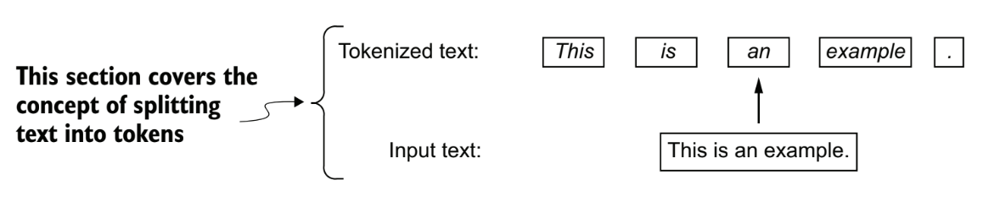

# Large Language Models

## Conteúdo

 - **Introdução a LLMs:**
   - [O que são LLMs?](#intro-to-llm)
   - [Como o modelo "entende" linguagem?](#how-understand)
   - [Como LLMs são treinados)](#how-are-trained)
   - [Diferença entre LLMs e modelos tradicionais de NLP](#llm-vs-nlp)
   - [Por que os Transformers revolucionaram o NLP?](#transformers-inovation)
   - [Como funciona o Mecanismo de Attention (Atenção)?](#attention-mechanism)
   - [Exemplos de tarefas resolvidas por LLMs](#llm-examples)
 - **Conceitos utilizados em LLMs:**
   - [Entendendo "Word Embeddings"](#understanding-word-embeddings)
   - [Word2Vec](#word2vec-idea)
 - **Preparação e amostragem de dados (Data preparation & sampling):**
   - **Lendo arquivos (Reading files):**
     - [read_txt()](#read-txt)
   - **Tokenization:**
     - [Tokenização de texto (Tokenizing text)](#tokenization)
     - [Convertendo tokens em IDs de token (Converting tokens into token IDs)](#token-id)
 - **Mecanismo de atenção (Attention mechanism):**
 - **Arquiteturas de LLMs (LLMs architecture):**
 - **Pré-treinamento (Pretraining):**
 - **Loop de treinamento (Training loop):**
 - **Avaliação do modelo (Model evaluation):**
 - **Carregamento pesos pré-treinados (Load pretrained weights):**
 - **Afinação (Fine-tuning):**
   - **Modelos de classificação (Classification models):**
   - **Assistentes pessoais ou modelos de chat (Personal assistants or chat models):**
 - [**🚀 Instalação / Execução local**](#settings)
 - [**REFERÊNCIAS**](#ref)
<!---
[WHITESPACE RULES]
- Same topic = "20" Whitespace character.
- Different topic = "200" Whitespace character.
--->


<!--- ( Introdução a LLMs ) --->

---

<div id="intro-to-llm"></div>

## O que são LLMs?

**📘 Definição:**  
LLMs (Large Language Models) são modelos de aprendizado de máquina treinados para **"entender"**, **"gerar"** e **"manipular linguagem natural"**.

> **OBSERVAÇÃO:**  
> Eles são chamados de "grandes" por causa da quantidade massiva de parâmetros (milhões ou bilhões) e por serem treinados em grandes volumes de texto da internet, livros, artigos, fóruns, código-fonte etc.


---

<div id="how-understand"></div>

### Como o modelo "entende" linguagem?

Na verdade, LLMs não entendem no sentido humano. Eles aprendem probabilidades estatísticas:

> Se eu vejo a frase: "O céu está ___", a palavra mais provável é "azul".  
> Esse "palpite" é feito com base no que ele viu durante o treinamento.


---

<div id="how-are-trained"></div>

### Como LLMs são treinados

 - **Pré-treinamento (Pretraining):**
   - O modelo é exposto a grandes quantidades de texto e aprende padrões de linguagem por meio de tarefas como **"prever a próxima palavra"** (auto-regressivo) ou **"preencher palavras faltantes"** (máscara).
 - **Ajuste fino (Fine-tuning):**
   - O modelo pode ser adaptado para tarefas específicas, como:
     - Classificação de texto;
     - Tradução;
     - Geração de código;
     - Resumo de documentos.


---

<div id="llm-vs-nlp"></div>

## Diferença entre LLMs e modelos tradicionais de NLP

 - Antes dos LLMs, os modelos de **NLP** eram **específicos para cada tarefa**, como *análise de sentimentos*, *tradução*, ou *resumo*.
 - Com os **LLMs**, **um único modelo pode ser usado para várias tarefas** com pouco ou nenhum ajuste.

### Comparação Direta

| Característica                  | Modelos Tradicionais de NLP                 | LLMs (Large Language Models)                        |
| ------------------------------- | ------------------------------------------- | --------------------------------------------------- |
| **Arquitetura**                 | Simples (SVM, Regressão, Naive Bayes, RNNs) | Transformer (profundo e em larga escala)            |
| **Treinamento**                 | Um modelo por tarefa                        | Um único modelo para tarefas múltiplas              |
| **Requer feature engineering?** | Sim! Manual e demorado                      | Não. O modelo aprende tudo automaticamente          |
| **Escalabilidade**              | Limitado                                    | Altamente escalável e flexível                      |
| **Precisão/Desempenho**         | OK, mas limitado com grandes volumes        | Alta, especialmente com dados em larga escala       |
| **Entrada/Saída**               | Tipicamente vetores numéricos               | Texto puro (prompts e respostas)                    |
| **Contexto considerado**        | Curto (às vezes só 1 frase)                 | Longo (vários parágrafos ou até milhares de tokens) |
| **Exemplos**                    | TF-IDF + SVM, Word2Vec + LSTM               | GPT, BERT, T5, LLaMA, Claude, Gemini                |

### Explicando com um exemplo

 - **Modelo tradicional (pré-LLM):**
   - Transformar o texto em vetores (TF-IDF, Bag of Words).
   - Treinar um SVM ou uma Regressão Logística para prever o sentimento.
   - Modelo só serve pra essa tarefa.
 - **LLM:**
   - Você escreve:
     - `Classifique o sentimento desta frase: Estou muito feliz hoje!`
   - O modelo responde:
     - `Sentimento: Positivo`
   - **OBSERVAÇÃO:** O mesmo modelo pode também traduzir, resumir, gerar código...

### Vantagens dos LLMs sobre modelos tradicionais

 - ✅ **Generalização:** Um modelo para muitas tarefas;
 - ✅ **Zero-shot & few-shot:** Resolve tarefas com poucas instruções;
 - ✅ Menos dependência de dados rotulados;
 - ✅ Contexto mais longo e melhor compreensão;
 - ✅ Geração de linguagem natural mais fluida.

### Mas os modelos tradicionais morreram?

 - **❌ Não! Eles ainda são úteis quando:**
   - Você tem poucos dados e poucos recursos computacionais;
   - A tarefa é muito específica e não exige interpretação profunda;
   - Você precisa de explicabilidade clara e rápida.


---

<div id="transformers-inovation"></div>

## Por que os Transformers revolucionaram o NLP?

> Transformers são uma arquitetura introduzida no artigo [**"Attention is All You Need" (2017)**](https://arxiv.org/abs/1706.03762).

**OBSERVAÇÃO:**  
Eles eliminaram a necessidade de processar palavras em sequência como faziam **RNNs** e **LSTMs** — e com isso, permitiram muito mais *"paralelismo"*, *"contexto global"* e *"velocidade"*.

### 🚫 Problema dos modelos anteriores (RNN, LSTM)

 - Processavam tokens um por um (sequencialmente).
 - Sofriam com longas dependências ("o que foi dito 30 palavras atrás?").
 - Eram lentos para treinar.
 - Tinha dificuldade com frases longas e contexto amplo.

### ✅ Como o Transformer resolveu tudo isso?

**A resposta:** Attention Mechanism.

> O modelo aprende a **"prestar atenção"** nas palavras mais importantes do texto — independentemente da posição!

### 🧩 Componentes principais do Transformer

| Componente                    | Função Básica                                                    |
| ----------------------------- | ---------------------------------------------------------------- |
| **Embedding**                 | Converte palavras em vetores numéricos.                          |
| **Self-Attention**            | Calcula a importância de cada palavra em relação às outras.      |
| **Positional Encoding**       | Adiciona informação da posição das palavras (já que é paralelo). |
| **Feedforward Layers**        | Faz transformações profundas nos vetores.                        |
| **Normalization & Residuals** | Ajudam a estabilizar e melhorar o aprendizado.                   |


---

<div id="attention-mechanism"></div>

## Como funciona o Mecanismo de Attention (Atenção)?

> O mecanismo de atenção permite que o modelo **"foque" em partes importantes da entrada** — como humanos fazem ao ler.

Por exemplo, imagine que nós temos a frase:

Imagine a frase:

> “A maçã estava azeda, então ela foi jogada fora.”

 - A palavra **"ela"** poderia se referir à **maçã** ou à **azeda**.
 - O modelo precisa **“prestar atenção”** nas palavras relevantes para entender corretamente.

### 🧮 Fórmula matemática (simples)

A fórmula matemática (simples) é a seguinte:

$\text{Attention}(Q, K, V) = \text{softmax}\left(\frac{QK^\top}{\sqrt{d_k}}\right)V$

 - `QKᵀ`
   - Compara (multiplica) os queries com os keys → gera pontuações de atenção.
 - `/ √d_k`
   - Normaliza para evitar explosões numéricas.
 - `softmax`
   - Transforma em probabilidades.
 - `× V`
   - Gera a atenção ponderada, ou seja, a saída final.

### 🔢 Exemplo numérico ilustrativo

```bash
Frase: ["O", "gato", "correu"]

→ Para "correu", o modelo calcula:

Q(correu) • K(O)     →  baixa atenção
Q(correu) • K(gato)  →  alta atenção
Q(correu) • K(correu)→  média atenção
```

> **Resultado:**  
> O modelo vai ponderar mais o **"gato"**, porque **"gato correu"** tem uma relação forte.


---

<div id="llm-examples"></div>

### Exemplos de tarefas resolvidas por LLMs

Vamos começar com uma introdução de algumas tarefas que podem ser resolvidas utilizando **"LLMs"**:

| Tarefa                      | Exemplo prático                             |
| --------------------------- | ------------------------------------------- |
| **Geração de texto**        | Chatbots, redação automática                |
| **Classificação**           | Análise de sentimentos, spam vs. não spam   |
| **Tradução**                | Inglês → Português, etc.                    |
| **Perguntas e Respostas**   | Assistente de dúvidas                       |
| **Resumo automático**       | Resumir longos artigos                      |
| **Extração de informações** | Pegar nomes, datas, eventos de um texto     |
| **Geração de código**       | Auto-complete em IDEs, explicação de código |

### 🚀 Aplicações Reais das LLMs

| **Área**                   | **Aplicação**                                                                                       |
| -------------------------- | --------------------------------------------------------------------------------------------------- |
| **Assistentes virtuais**   | Chatbots inteligentes (ex: ChatGPT, Google Bard, Alexa)                                             |
| **Educação**               | Tutores personalizados, correção automática de redações, explicações sob demanda                    |
| **Saúde**                  | Análise de prontuários, resposta a perguntas médicas, apoio à decisão clínica                       |
| **Atendimento ao cliente** | Respostas automáticas, suporte 24/7, resumo de interações com usuários                              |
| **Pesquisa e ciência**     | Síntese de artigos, geração de hipóteses, revisão automática de literatura                          |
| **Programação**            | Autocompletar código, explicar funções, gerar trechos em diferentes linguagens (ex: GitHub Copilot) |
| **Tradução de idiomas**    | Traduções contextuais e multilíngues, com adaptação ao domínio específico                           |
| **Criação de conteúdo**    | Geração de artigos, roteiros, marketing, posts para redes sociais                                   |
| **Direito**                | Análise de contratos, extração de cláusulas, sumarização de decisões legais                         |
| **Análise de sentimentos** | Classificação de avaliações e sentimentos em redes sociais e e-commerce                             |
| **Segurança cibernética**  | Explicação de exploits, análise de logs e geração de alertas                                        |
| **Games e NPCs**           | Diálogos gerados dinamicamente, comportamentos inteligentes, roteiros                               |

### 📈 Exemplos Reais de Impacto com LLMs

| **Organização / Produto** | **Uso de LLMs**                                                                          |
| --------------------------|------------------------------------------------------------------------------------------|
| `Duolingo`                | Feedback em tempo real sobre frases escritas por alunos com explicações contextualizadas |
| `Notion AI`               | Geração e reformulação de textos, resumos automáticos, criação de tarefas                |
| `Khan Academy (GPT-4)`    | Tutor personalizado que responde dúvidas dos alunos com explicações passo a passo        |
| `GitHub Copilot`          | Sugestões de código em tempo real, explicações de funções, geração de testes             |
| `GrammarlyGO`             | Reescrita e aprimoramento de textos com base no contexto do usuário                      |
| `Legal Robot`             | Análise de contratos com explicação em linguagem natural das cláusulas jurídicas         |
| `You.com (YouChat)`       | Motor de busca com respostas geradas por LLM, integrando fontes e interatividade         |


<!--- ( Conceitos utilizados em LLMs ) --->

---

<div id="understanding-word-embeddings"></div>

## Entendendo "Word Embeddings"

 - Modelos de Deep Learning, incluindo LLMs, não podem processar texto bruto diretamente;
 - Como o texto é categórico, ele não é compatível com as operações matemáticas utilizadas para implementar e treinar redes neurais;
 - Portanto, precisamos de uma forma de representar palavras como vetores com valores contínuos.

> **OBSERVAÇÃO:**  
> O conceito de converter dados (áudio, vídeo, texto) para o formato de vetor (numérico) é frequentemente chamado de **"embedding"**.

Por exemplo:

  

> **OBSERVAÇÃO:**  
> No entanto, é importante observar que diferentes formatos de dados exigem *modelos de embbedding* distintos.  
> Por exemplo, um modelo de embedding projetado para texto não seria adequado para embbedding de dados de áudio ou vídeo.


---

<div id="word2vec-idea"></div>

## Word2Vec

> A principal *ideia* por trás do **Word2Vec** é que *"palavras que aparecem em contextos semelhantes tendem a ter significados semelhantes"*.

Consequentemente, quando projetadas em embeddings de palavras bidimensionais para fins de visualização, palavras semelhantes ficam agrupadas.

  


<!--- ( Preparação e amostragem de dados (Data preparation & sampling) ) --->

---

<div id="read-txt"></div>

## read_txt()

Aqui nós vamos aprender como ler um arquivo de texto no formato `.txt`:

<!--- ( Python (From Scratch) ) --->
<details>

<summary>Python (From Scratch)</summary>

</br>

[utils.py](src/utils.py)
```python
import re


def read_txt(file_path):
    with open(file_path, "r", encoding="utf-8") as f:
        text = f.read()
    return text


if __name__ == "__main__":

    file_path = "../datasets/the-verdict.txt"
    text = read_txt(file_path)

    print("Total number of characters:", len(text))
    print("Text type:", type(text), "\n")

    print(text[:353])
```

**OUTPUT:**
```bash
Total number of characters: 20479
Text type: <class 'str'> 
```

> **OBSERVAÇÃO:**  
> Podemos usar o conceito **fatiamento (slicing)** para selecionar uma parte específica do texto.

```python
print(text[:353])
```

**OUTPUT:**
```bash
I HAD always thought Jack Gisburn rather a cheap genius--though a good fellow enough--so it was no great surprise to me to hear that, in the height of his glory, he had dropped his painting, married a rich widow, and established himself in a villa on the Riviera. (Though I rather thought it would have been Rome or Florence.)

"The height of his glory"
```

</details>


---

<div id="tokenization"></div>

## Tokenização de texto (Tokenizing text)

> Aqui, vamos discutir como podemos dividir umma entrada texto *tokens* individuais, uma etapa de pré-processamento necessária para criar *embeddings* para um *LLM*.

Esses tokens são palavras individuais ou caracteres especiais, incluindo sinais de pontuação, conforme mostrado abaixo:

  

Vamos implementar uma função `tokenizer_txt()` para ver como isso funciona:

<!--- ( Python (From Scratch) ) --->
<details>

<summary>Python (From Scratch)</summary>

</br>

[tokenizer.py](src/tokenizer.py)
```python
import re

from utils import read_txt


def tokenizer_txt(text):
    text_tokenized = re.split(r'([,.:;?_!"()\']|--|\s)', text)
    text_tokenized = [item.strip() for item in text_tokenized if item.strip()]
    return text_tokenized


if __name__ == "__main__":

    file_path = "../datasets/the-verdict.txt"
    text = read_txt(file_path)

    tokens = tokenizer_txt(text)
    print("Total number of tokens (without whitespaces):", len(tokens))
```

**OUTPUT:**  
```bash
Total number of tokens (without whitespaces): 4690
```

> **OBSERVAÇÃO:**  
> Vejam que nós temos 4690 tokens (sem espaços em branco).

Por exemplo, vamos imprimir os primeiros 30 tokens para uma verificação visual rápida:

```python
print(tokens[:30])
```

**OUTPUT:**  
```bash
['I', 'HAD', 'always', 'thought', 'Jack', 'Gisburn', 'rather', 'a', 'cheap', 'genius', '--', 'though', 'a', 'good', 'fellow', 'enough', '--', 'so', 'it', 'was', 'no', 'great', 'surprise', 'to', 'me', 'to', 'hear', 'that', ',', 'in']
```

> **OBSERVAÇÃO:**  
> Vejam que nós temos uma lista (sim, uma lista normal Python) com todos os tokens, sem espaços em branco do nosso texto.

</details>

<!--- ( Transformers (Hugging Face) ) --->
<details>

<summary>Transformers (Hugging Face)</summary>

</br>

Aqui vamos utilizar o tokenizador `AutoTokenizer` da biblioteca [🤗 Transformers (Hugging Face)](https://github.com/huggingface/transformers) com o modelo `bert-base-uncased`:

[ready_tokenizers.py](src/ready_tokenizers.py)
```python
from transformers import AutoTokenizer

from utils import read_txt


# load the BERT tokenizer
tokenizer = AutoTokenizer.from_pretrained("bert-base-uncased")

# Load the and read the text
file_path = "../datasets/the-verdict.txt"
text = read_txt(file_path)

# Tokenization
tokens = tokenizer.tokenize(text)
print("Total number of tokens (without whitespaces):", len(tokens))
print("Tokens:", tokens[:30])
```

**OUTPUT:**  
```bash
Total number of tokens (without whitespaces): 5212
Tokens: ['i', 'had', 'always', 'thought', 'jack', 'gi', '##sb', '##urn', 'rather', 'a', 'cheap', 'genius', '-', '-', 'though', 'a', 'good', 'fellow', 'enough', '-', '-', 'so', 'it', 'was', 'no', 'great', 'surprise', 'to', 'me', 'to']
```

> **Por que nós temos mais tokens utilizando o tokenizador da Hugging Face?**

### 🧠 Diferença fundamental: Subword Tokenization

O **BERT** não usa tokenização por palavras ou pontuações simples. Ele usa um método chamado:

> **👉 WordPiece Tokenization:**  
> Palavras desconhecidas ou raras são quebradas em subpartes, chamadas *"subwords"*.

Por exemplo:

```bash
'Gisburn' → ['gi', '##sb', '##urn']
```

A ideia é balancear entre:

 - Cobertura de vocabulário (poucos tokens desconhecidos);
 - Tamanho do vocabulário (tornar o modelo mais eficiente).

### `🧠 O que são esses ##?`

 - No **BERT**, os tokens que começam com `##` são subpalavras que continuam uma palavra anterior.
 - Por exemplo:
   - `gi` é o começo da palavra `Gisburn`;
   - ``##sb`` e ``##urn`` são subpalavras que continuam `gi` até formar `gi + sb + urn = Gisburn`.

Esse tipo de tokenização:

 - Reduz o número de palavras *OOV (out-of-vocabulary)*;
 - Garante que até palavras não vistas no treinamento ainda sejam entendidas em partes.

### 📌 Outros detalhes que aumentam a contagem no BERT:

| Fator                                 | Explicação                                                                        |
| ------------------------------------- | --------------------------------------------------------------------------------- |
| **Subwords**                          | Palavras como `Gisburn`, `unbelievable` viram várias partes                       |
| **Lowercasing**                       | O `bert-base-uncased` transforma tudo em minúsculo antes de tokenizar             |
| **Tokens especiais (em outros usos)** | `[CLS]`, `[SEP]` etc. (no seu caso não estão aparecendo porque você só tokenizou) |
| **Sem filtragem de pontuação**        | O tokenizer BERT inclui pontuações como tokens próprios (`.`, `,`, etc.)          |

### ✅ Conclusão

| Tokenizador          | Tipo de tokenização            | Total de tokens | Exemplo                 |
| -------------------- | ------------------------------ | --------------- | ----------------------- |
| `Seu (com re.split)` | Baseado em pontuação e espaços | 4690            | `'Gisburn'`             |
| `BERT ("WordPiece")` | Subword Tokenization           | 5212            | `'gi', '##sb', '##urn'` |

> **OBSERVAÇÃO:**  
> O BERT gera mais tokens porque ele quebra palavras em partes menores que estão no vocabulário aprendido durante o pré-treinamento. Isso permite lidar melhor com palavras raras ou compostas.

</details>


---

<div id="token-id"></div>

## Convertendo tokens em IDs de token (Converting tokens into token IDs)

Aqui nós vamos ver o processo de atribuir um ID numérico único para cada token (palavra, subpalavra ou símbolo) com base em um vocabulário fixo do modelo.

### 📘 O que é "Vocabulário" em LLMs?

No contexto de Modelos de Linguagem (LLMs), o vocabulário é a lista de todos os tokens que o modelo conhece.

**✅ Cada token tem:**

 - Uma forma textual (ex: "hello", "##ing", "!")
 - Um ID único (ex: 101, 1254, 999)

> **OBSERVAÇÃO:**  
> Esse vocabulário é definido antes do treinamento do modelo, geralmente criado com base em um grande corpus de texto.

### 🧠 Por que esse vocabulário é importante?

Porque o modelo só consegue processar textos usando os *tokens* do seu *vocabulário*. Se uma palavra não estiver nele, será dividida em subpalavras ou marcada como token desconhecido ([UNK]).

Por exemplo, imagine que temos o seguinte texto como entrada:

**Entrada (Input):**
```python
I love learning because I love new things
```

| Token      | Token ID |
| ---------- | -------- |
| `[PAD]`    | 0        |
| `[UNK]`    | 1        |
| `i`        | 2        |
| `love`     | 3        |
| `learning` | 4        |
| `because`  | 5        |
| `new`      | 6        |
| `things`   | 7        |

**🧮 Tokenização (simples):**
```python
tokens = ['i', 'love', 'learning', 'because', 'i', 'love', 'new', 'things']
```

> **OBSERVAÇÃO:**  
> Mesmo que as palavras **"i"** e **"love"** apareçam mais de uma vez, elas serão tokenizadas da mesma forma, pois o vocabulário é estático.

**🔢 Conversão para Token IDs:**
```python
token_ids = [2, 3, 4, 5, 2, 3, 6, 7]
```

| Palavra      | Token      | Token ID |
| ------------ | ---------- | -------- |
| **I**        | `i`        | 2        |
| **love**     | `love`     | 3        |
| **learning** | `learning` | 4        |
| **because**  | `because`  | 5        |
| **I**        | `i`        | 2        |
| **love**     | `love`     | 3        |
| **new**      | `new`      | 6        |
| **things**   | `things`   | 7        |

**✅ Observações:**

 - Tokens repetidos (como "i" e "love") continuam recebendo o mesmo ID.
 - O modelo trata repetições de **forma contextual**:
   - Ou seja, mesmo com o mesmo token ID, o significado pode *"mudar dependendo do contexto anterior"*.

Agora vamos ver como implementar isso na prática:


<!--- ( Python (From Scratch) ) --->
<details>

<summary>Python (From Scratch)</summary>

<br/>

Para criar esse mecanismo de adicionar um `id` para cada token vamos precisar utilizar nossa lógica de programação. Por exemplo, nós vamos ter que pegar todas as **"palavras únicas"** do texto:

```python
tokens = tokenizer_txt(text)
unique_tokens = set(tokens)

print("type:", type(unique_tokens))
print("Number of unique tokens:", len(unique_tokens))
```

**OUTPUT:**
```bash
type: <class 'set'>
Number of unique tokens: 1130
```

Veja que:

 - Nos temos um objeto do tipo `set`:
   - Ou seja, não temos objetos repetidos.
 - Com o total de **1130** palavras únicas.
 - **OBSERVAÇÃO:** Como `set()` não permite *slicing* não vou mostrar todas as palavras (tokens).

Continuando, também seria interessante **ordenar** esse **conjunto (set)**:

```python
tokens = tokenizer_txt(text)
unique_tokens = sorted(set(tokens))
```

> **Ótimo, nós já temos todas as palavras (tokens) únicas do texto e agora?**

Agora é só mapear (criando um dicionário) para cada palavra (token) um índice (id) do vocabulário:

```python
vocabulary = {}
for id, token in enumerate(unique_tokens):
    vocabulary[token] = id
```

> **OBSERVAÇÃO:**  
> Vejam que nós fizemos uma troca, *onde era a key ficou o token (valor)*, e onde era o valor ficou o id (key).

Vamos mostrar alguns exemplos:

```python
tokens = tokenizer_txt(text)

unique_tokens = sorted(set(tokens))

vocabulary = {}
for id, token in enumerate(unique_tokens):
    vocabulary[token] = id

for i, item in enumerate(vocabulary.items()):
    print(item)
    if i >= 20:
        break
```

**OUTPUT:**
```bash
('!', 0)
('"', 1)
("'", 2)
('(', 3)
(')', 4)
(',', 5)
('--', 6)
('.', 7)
(':', 8)
(';', 9)
('?', 10)
('A', 11)
('Ah', 12)
('Among', 13)
('And', 14)
('Are', 15)
('Arrt', 16)
('As', 17)
('At', 18)
('Be', 19)
('Begin', 20)
```

Ótimo, nós já temos toda a lógica necessária para criar nossa função `create_vocabulary()`:

[tokenizer.py](src/tokenizer.py)
```python
def create_vocabulary(tokens):
    unique_tokens = sorted(set(tokens))
    vocabulary = {}
    for id, token in enumerate(unique_tokens):
        vocabulary[token] = id
    return vocabulary


if __name__ == "__main__":

    file_path = "../datasets/the-verdict.txt"
    text = read_txt(file_path)

    tokens = tokenizer_txt(text)  # Tokenize the text
    vocabulary = create_vocabulary(tokens)  # Create the vocabulary

    print("Vocabulary size:", len(vocabulary))

    # Print some vocabulary examples
    for i, item in enumerate(vocabulary.items()):
        print(item)
        if i >= 20:
            break
```

**OUTPUT:**
```bash
Vocabulary size: 1130
('!', 0)
('"', 1)
("'", 2)
('(', 3)
(')', 4)
(',', 5)
('--', 6)
('.', 7)
(':', 8)
(';', 9)
('?', 10)
('A', 11)
('Ah', 12)
('Among', 13)
('And', 14)
('Are', 15)
('Arrt', 16)
('As', 17)
('At', 18)
('Be', 19)
('Begin', 20)
```

</details>


<!--- ( Transformers (Hugging Face) ) --->
<details>

<summary>Transformers (Hugging Face)</summary>

</br>

Com a biblioteca **transformers (Hugging Face)** podemos utilizar a função `tokenizer.get_vocab()` para pegar o vocaculário dos tokens:

[ready_tokenizers.py](src/ready_tokenizers.py)
```python
tokens = tokenizer.tokenize(text)  # Tokenize the text
vocabulary = tokenizer.get_vocab()  # Get the vocabulary

print(list(vocabulary.items())[:10])  # Print the first 10 vocabulary items
```

**OUTPUT:**
```bash
Vocabulary size: 30522
('##ibility', 13464)
('palazzo', 18482)
('1735', 26063)
('carter', 5708)
('transformations', 21865)
('[unused926]', 931)
('nervously', 12531)
('1753', 23810)
('libre', 21091)
('ramon', 12716)
('grange', 18203)
('##ryl', 23320)
('encore', 19493)
('additions', 13134)
('##ʒ', 29704)
('amenities', 19870)
('##gus', 12349)
('##cite', 17847)
('tears', 4000)
('##bber', 29325)
('aggressive', 9376)
```


<!--- ( 🚀 Instalação / Execução local ) --->

---

<div id="settings"></div>

## 🚀 Instalação / Execução local

*Crie e ative o ambiente virtual (recomendado):**  

```bash
python -m venv environment
```

**LINUX:**  
```bash
source environment/bin/activate
```

**WINDOWS:**  
```bash
source environment/Scripts/activate
```

**ATUALIZE O PIP:**
```bash
python -m pip install --upgrade pip
```

**Instale as dependências:**  

```bash
pip install -U -v --require-virtualenv -r requirements.txt
```


<!--- ( REFERÊNCIAS ) --->

---

<div id="ref"></div>

## REFERÊNCIAS

 - [ChatGPT](https://chat.openai.com/)

---

**Rodrigo** **L**eite da **S**ilva - **rodrigols89**

<!--->

<details>

<summary>TensorFlow (Python)</summary>

<br/>

[](src/)
```python

```

</details>
